# How to Create Diagrams in Obsidian

Quick guide on creating and displaying diagrams in your MAIA KB.

---

## Option 1: Mermaid Diagrams (Built-in) ⭐ Recommended

**What:** Native Mermaid support in Obsidian - renders automatically in preview mode

**When to use:**
- Flowcharts (workflows, decision trees)
- Sequence diagrams (API calls, user interactions)
- Gantt charts (roadmaps, timelines)
- State diagrams (document status flows)
- Class diagrams (data models)

### How to Create

Just use a code block with `mermaid` language:

````markdown
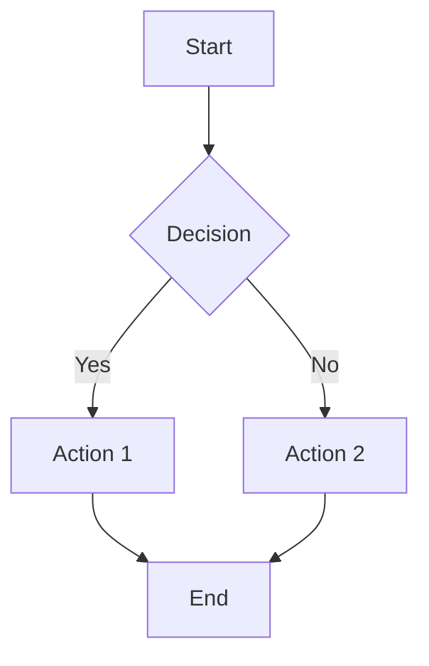
````

**Result:** Renders as a flowchart in preview mode

---

## Real MAIA Examples

### Example 1: Quote-to-Cash Workflow

````markdown
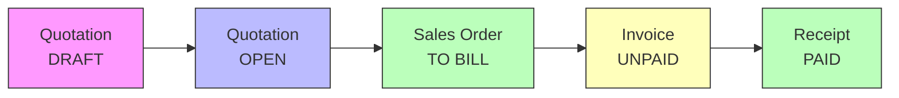
````

**When to use:** In workflow documentation files

---

### Example 2: Triage Decision Tree

````markdown
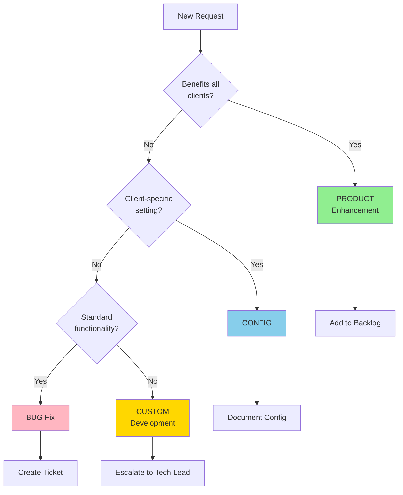
````

**When to use:** In [[Triage SOP (Product vs Config vs Custom)]]

---

### Example 3: Document Status Flow

````markdown
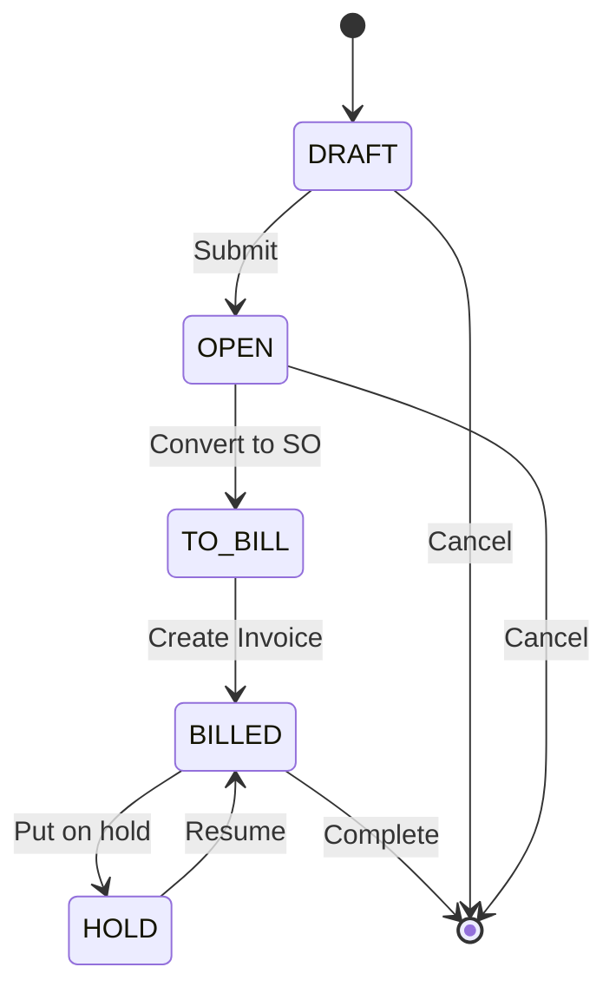
````

**When to use:** In [[Document Status Flows]]

---

### Example 4: Product Roadmap Timeline

````markdown
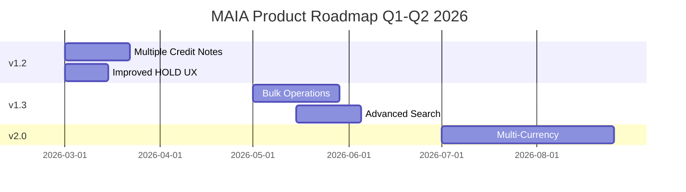
````

**When to use:** In [[05 - Releases & Updates/Upcoming Features]]

---

### Example 5: Feature Dependency Map

````markdown
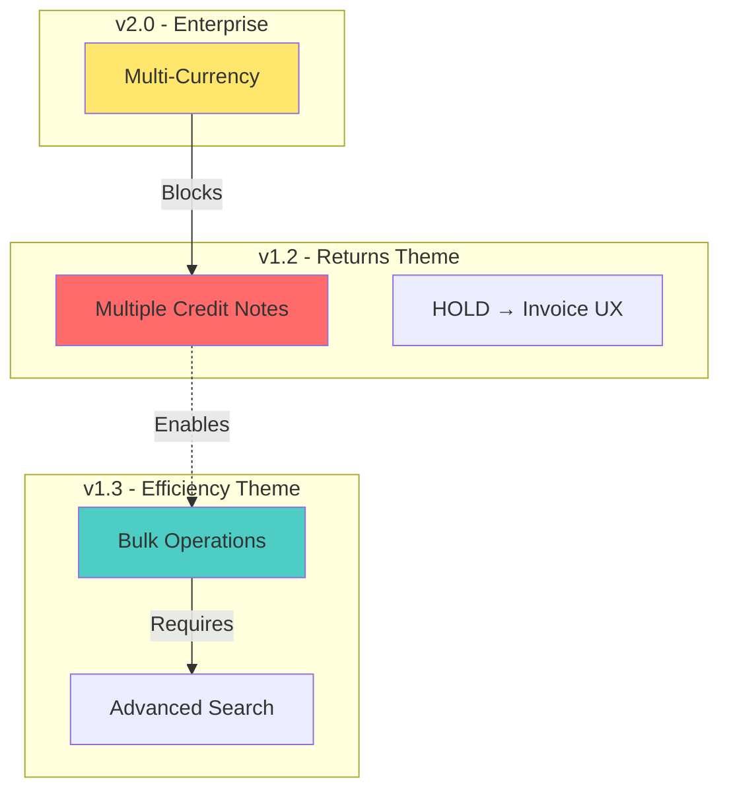
````

**When to use:** In feature planning documents

---

### Example 6: Client Impact Sequence

````markdown
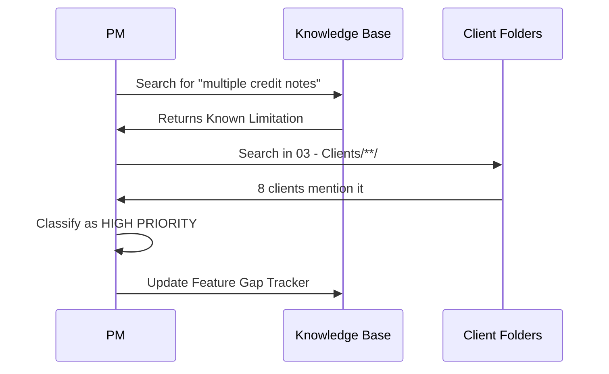
````

**When to use:** In process documentation

---

## Option 2: Excalidraw (Hand-drawn Style) 🎨

**What:** Plugin for hand-drawn style diagrams (already installed in your vault)

**When to use:**
- Sketches and wireframes
- Visual brainstorming
- Annotations on screenshots
- Freeform diagrams

### How to Create

1. **Create new Excalidraw file:**
   - Right-click in file explorer → "New Excalidraw drawing"
   - Or: Create file with `.excalidraw` extension

2. **Draw using the toolbar:**
   - Shapes (rectangles, circles, arrows)
   - Text labels
   - Freehand drawing

3. **Embed in markdown:**
   ```markdown
   ![[diagram-name.excalidraw]]
   ```

---

## Option 3: Canvas (Visual Board) 📊

**What:** Native Obsidian canvas for visual boards (already enabled)

**When to use:**
- Visual roadmaps
- Feature relationship maps
- Client ecosystem diagrams
- Brainstorming sessions

### How to Create

1. **Create new canvas:**
   - Right-click in file explorer → "New canvas"
   - Or: Create file with `.canvas` extension

2. **Add cards:**
   - Drag notes from vault onto canvas
   - Create text cards directly
   - Add links between cards

3. **Organize visually:**
   - Color-code cards by theme
   - Draw arrows to show relationships
   - Group related items

**Note:** Canvas files are separate (not embedded in markdown)

---

## Option 4: Image Diagrams (PNG/SVG)

**When to use:**
- Complex diagrams from external tools
- Screenshots
- Design mockups

### How to Embed

```markdown

```

Or use Obsidian syntax:
```markdown
![[image-name.png]]
```

---

## Mermaid Diagram Types Reference

### Flowchart (Most Common)
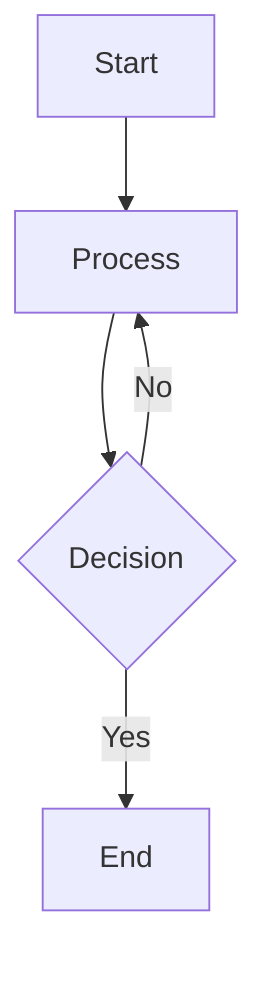

### Sequence Diagram
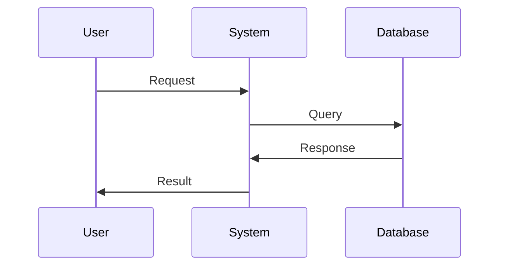

### State Diagram
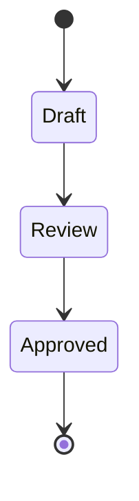

### Gantt Chart
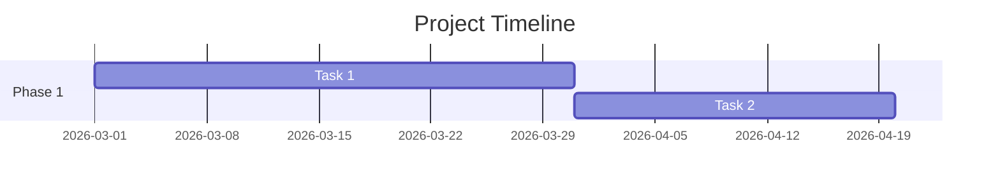

### Pie Chart
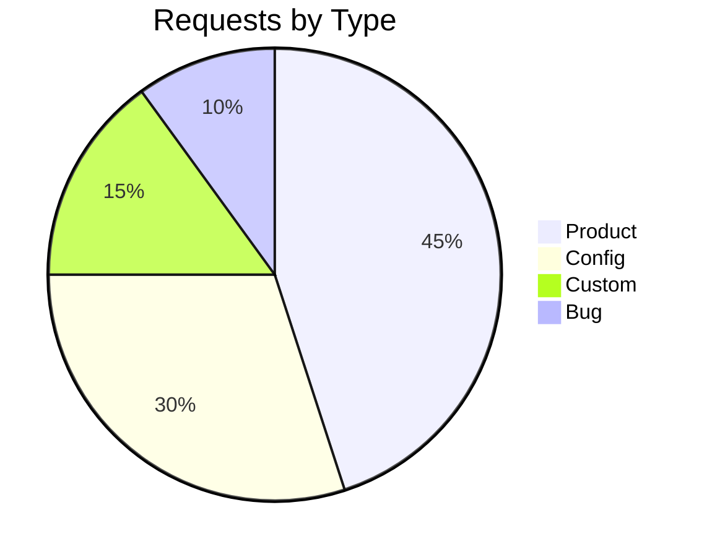

### Class Diagram
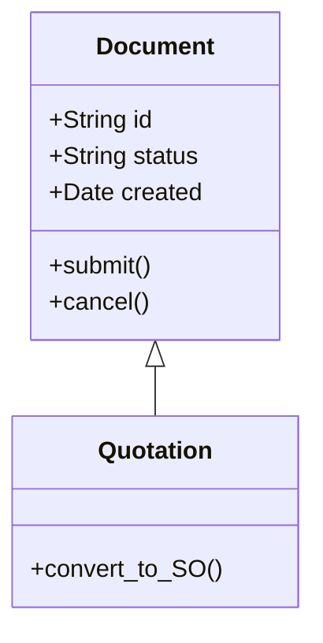

---

## Styling Tips

### Colors
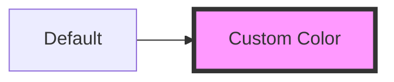

### Common Colors for MAIA
- `#90EE90` - Product (green)
- `#87CEEB` - Config (blue)
- `#FFD700` - Custom (gold)
- `#FFB6C1` - Bug (pink)
- `#FF6B6B` - Critical (red)
- `#4ECDC4` - In Progress (teal)

---

## Best Practices for MAIA KB

### 1. **Workflows** → Use Flowcharts
Example files to add diagrams:
- [[Quote-to-Cash Flow]]
- [[Quotation Workflows]]
- [[Sales Order Workflows]]
- [[Invoice Workflows]]

### 2. **Status Transitions** → Use State Diagrams
Example files:
- [[Document Status Flows]]

### 3. **Decision Trees** → Use Flowcharts
Example files:
- [[Triage SOP (Product vs Config vs Custom)]]
- [[Requirement Gathering Process]]

### 4. **Timelines** → Use Gantt Charts
Example files:
- [[Upcoming Features]]
- [[Roadmap]]

### 5. **Dependencies** → Use Graph Diagrams
Example files:
- Feature dependency mapping
- Client impact analysis

---

## Quick Start: Add Your First Diagram

### Add to Quote-to-Cash Flow

1. Open: [[01 - MAIA Product/Core Workflows/Quote-to-Cash Flow]]

2. Add this Mermaid diagram:

````markdown
## Visual Workflow

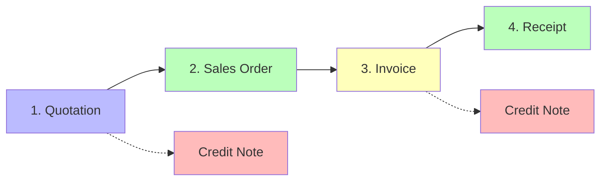
````

3. Switch to **Preview mode** (Ctrl/Cmd + E) to see the rendered diagram

4. Done! ✅

---

## Troubleshooting

### Diagram Not Showing?

**Issue:** Mermaid code block shows as code, not diagram

**Solution:**
- Make sure you're in **Preview mode** (not Edit mode)
- Check the code block starts with ` ```mermaid ` (three backticks + mermaid)
- Verify syntax is correct (no typos)

### Syntax Errors?

**Resources:**
- Mermaid Live Editor: https://mermaid.live (test diagrams online)
- Mermaid docs: https://mermaid.js.org/intro/

---

## Recommended Next Steps

1. ✅ Add workflow diagram to [[Quote-to-Cash Flow]]
2. ✅ Add triage decision tree to [[Triage SOP (Product vs Config vs Custom)]]
3. ✅ Add status diagram to [[Document Status Flows]]
4. ✅ Create roadmap Gantt chart in [[Upcoming Features]]

---

## See Also

- [[Quick Reference]] — Quick links
- [[CLAUDE.md]] — KB conventions
- Mermaid Documentation: https://mermaid.js.org
