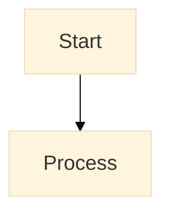
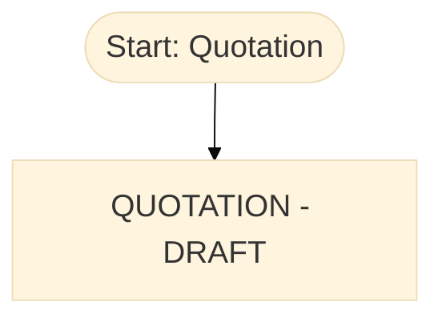

# How to Zoom Mermaid Diagrams in Obsidian

**Problem:** Mermaid diagrams in Obsidian cannot be zoomed in/out with mouse wheel or gestures.

**Quick Solutions:**

---

## Solution 1: Browser Zoom (Easiest) ⭐

Use your browser/OS zoom controls:

**Windows/Linux:**
- **Zoom In:** `Ctrl` + `+`
- **Zoom Out:** `Ctrl` + `-`
- **Reset:** `Ctrl` + `0`

**Mac:**
- **Zoom In:** `Cmd` + `+`
- **Zoom Out:** `Cmd` + `-`
- **Reset:** `Cmd` + `0`

**Benefit:** Works immediately, no setup needed
**Limitation:** Zooms entire Obsidian window, not just the diagram

---

## Solution 2: Export as PNG/SVG (Best for Sharing)

Export diagrams as images, then zoom as needed.

### Method A: Use Mermaid Live Editor

1. **Copy the Mermaid code** from your markdown file
2. **Go to:** https://mermaid.live
3. **Paste** your code
4. **Click "Actions" → "PNG"** or **"SVG"**
5. **Save** to vault: `01 - MAIA Product/Core Workflows/images/`
6. **Embed in markdown:**
   ```markdown
   
   ```

**Benefit:** Can zoom image freely, better for presentations
**Limitation:** Diagram is static (won't update if code changes)

---

### Method B: Export from Obsidian (If Plugin Available)

Some Mermaid plugins allow right-click → Export

Check: Settings → Community Plugins → Search "Mermaid Export"

---

## Solution 3: Open in External Viewer

**For complex diagrams:**

1. Copy Mermaid code
2. Open https://mermaid.live
3. Paste code
4. Use browser zoom to view large diagram
5. Keep browser tab open for reference

**Benefit:** Full zoom control, pan around diagram
**Limitation:** External to Obsidian

---

## Solution 4: Make Diagrams Larger by Default

Modify your Mermaid code to use larger font sizes:

### Add to top of Mermaid block:



**Font size options:**
- Default: `16px`
- Larger: `18px` or `20px`
- Extra large: `24px`

**Example for workflow diagrams:**



---

## Solution 5: Use CSS Snippet (Advanced)

Create custom CSS to make all Mermaid diagrams larger.

### Steps:

1. **Create:** `.obsidian/snippets/mermaid-zoom.css`

2. **Add this code:**
```css
/* Make Mermaid diagrams larger */
.mermaid {
    transform: scale(1.2);
    transform-origin: top left;
    margin-bottom: 40px;
}

/* Make Mermaid diagrams zoomable on hover */
.mermaid:hover {
    transform: scale(1.5);
    z-index: 1000;
    cursor: zoom-in;
}
```

3. **Enable in Obsidian:**
   - Settings → Appearance → CSS Snippets
   - Toggle on: `mermaid-zoom`

**Benefit:** All diagrams automatically larger
**Limitation:** May affect layout

---

## Solution 6: Split View + Zoom

**Best for reviewing large diagrams:**

1. **Open diagram file** in Reading View
2. **Split pane:** `Cmd/Ctrl + Click` on file to open in new pane
3. **Zoom one pane:** Use `Cmd/Ctrl + +` on right pane only
4. **Keep left pane** normal for editing

**Benefit:** See both zoomed and normal view
**Limitation:** Uses screen space

---

## Recommended Approach for MAIA KB

### For Daily Use:
✅ **Use Browser Zoom** (`Ctrl/Cmd +`) when viewing diagrams

### For Presentations:
✅ **Export to PNG** from mermaid.live, embed in presentation

### For Complex Diagrams:
✅ **Open in mermaid.live** for full pan/zoom control

### For Permanent Fix:
✅ **Install CSS snippet** (Solution 5) for auto-scale on hover

---

## Example: Export Quote-to-Cash Flow

1. **Open:** `01 - MAIA Product/Core Workflows/Quote-to-Cash Flow.md`
2. **Copy** the entire `mermaid` code block
3. **Go to:** https://mermaid.live
4. **Paste** code
5. **Click:** Actions → PNG (or SVG)
6. **Save as:** `quote-to-cash-flow.png`
7. **Create images folder:**
   ```
   01 - MAIA Product/Core Workflows/images/
   ```
8. **Add to markdown:**
   ```markdown
   ## Static Diagram (Zoomable)

   

   ## Interactive Diagram (Editable)

   ```mermaid
   [... original code ...]
   ```
   ```

**Now you have both:**
- Static PNG (can zoom freely)
- Live Mermaid (can edit and re-render)

---

## Zoom Tips for Large Workflow Diagrams

### Our largest diagrams:
- Quote-to-Cash Flow (4 modules, ~150 lines)
- Sales Order Workflow (6 actions, ~110 lines)
- Invoice Workflow (7 actions, ~109 lines)

**Best practice:**
1. Use `Cmd/Ctrl + +` to zoom browser to 125-150%
2. Scroll/pan to see different parts
3. Reset zoom with `Cmd/Ctrl + 0` when done

---

## Quick Reference Card

| Need | Solution | Shortcut |
|------|----------|----------|
| **Quick zoom in Obsidian** | Browser zoom | `Ctrl/Cmd +` |
| **Zoom out** | Browser zoom | `Ctrl/Cmd -` |
| **Reset zoom** | Browser zoom | `Ctrl/Cmd 0` |
| **Export for sharing** | mermaid.live → PNG | N/A |
| **Permanent solution** | CSS snippet | One-time setup |
| **Complex diagrams** | Open in mermaid.live | Copy/paste |

---

## See Also

- [[How to Create Diagrams in Obsidian]] — Creating diagrams guide
- [[Quote-to-Cash Flow]] — Example large diagram
- Mermaid Live Editor: https://mermaid.live

---

## Updated Files

**All these files now have zoomable diagrams:**
- ✅ [[Quote-to-Cash Flow]] — 4-module comprehensive workflow
- ✅ [[Sales Order Workflows]] — 6-action detailed flow
- ✅ [[Quotation Workflows]] — Quotation → SO conversion
- ✅ [[Invoice Workflows]] — 7-action invoice flow
- ✅ [[Credit Note Workflows]] — 3-action credit note flow

**Use browser zoom (`Ctrl/Cmd +`) to view them clearly!**
