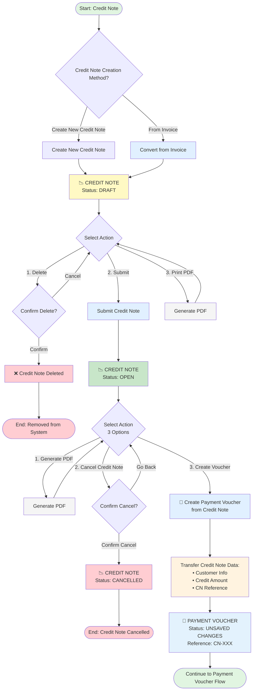

# Credit Note Workflows

Detailed workflows for managing credit notes in MAIA.

## Visual Workflow Diagram

## Creating a Credit Note

### From Invoice (Most Common)
1. Open an UNPAID or PAID invoice
2. Click "Create Credit Note"
3. System pre-fills invoice data
4. Select items and quantities to credit
5. Submit → OPEN

### Standalone Credit Note
**When:** Goodwill credit or promotional credit (no invoice reference)

1. Navigate to Sales → Credit Notes → New
2. Fill in customer and credit details
3. Submit → OPEN

## Credit Note Types

### Full Credit
- Credit the entire invoice amount
- Effectively voids the invoice

### Partial Credit
- Credit specific items or quantities
- Invoice remains valid for remaining amount

## Credit Note Application

**OPEN credit notes can be:**
1. **Applied to invoices** — Reduce customer balance
2. **Issued as refund** — Generate payment voucher

## Known Limitations

⚠️ **CRITICAL:** Cannot create multiple credit notes from same invoice

**Impact:**
- If customer returns items in multiple batches, only first batch can be credited
- All returns must be consolidated into single credit note

**Workaround:**
- Wait until all returns are complete before issuing credit note

**See:** [[01 - MAIA Product/Overview/Known Limitations]]

## See Also

- [[Quote-to-Cash Flow]] — Full E2E workflow
- [[Invoice Workflows]] — Invoice management
- [[01 - MAIA Product/Sales Workspace/Billing/Credit Notes]] — Module details
- [[Document Status Flows]] — Status rules
