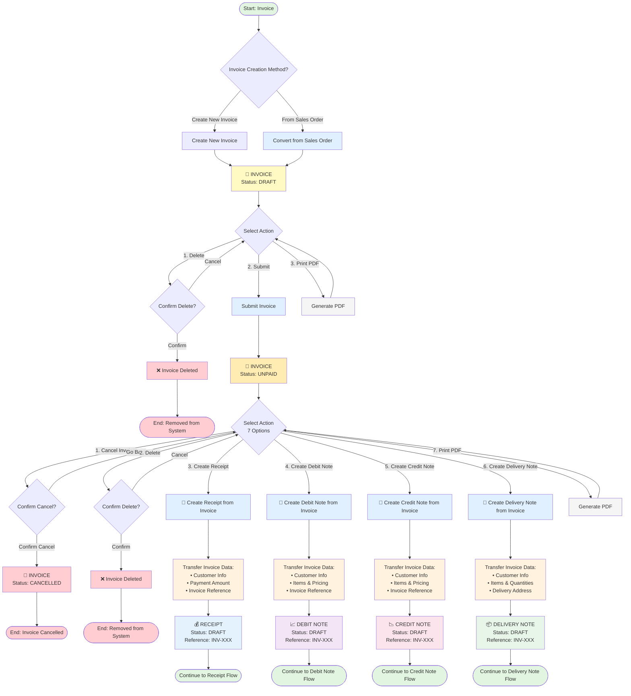

# Invoice Workflows

Detailed workflows for managing invoices in MAIA.

## Visual Workflow Diagram

## Creating an Invoice

### From Sales Order (Recommended)
1. Open a TO BILL sales order
2. Click "Create Invoice"
3. System pre-fills all SO data
4. Optional: Create Delivery Note simultaneously
5. Submit → UNPAID

### Direct Invoice (No SO)
1. Navigate to Sales → Invoices → New
2. Fill in all required fields manually
3. Submit → UNPAID

### Partial Invoicing
- MAIA supports **multiple invoices from single SO**
- Invoice partial quantities across multiple invoices
- Each invoice tracks remaining unbilled quantities

**Example:**
- SO: 100 units
- Invoice 1: 30 units
- Invoice 2: 45 units
- Invoice 3: 25 units (completes SO)

## Invoice Statuses

See [[01 - MAIA Product/Overview/Document Status Flows]] for detailed status transitions.

## Key Operations

### Cancel Invoice
**When:** Invoice was issued in error or needs to be voided

**Process:**
1. Open UNPAID invoice
2. Click "Cancel"
3. Enter cancellation reason (required)
4. Status changes to CANCELLED
5. Customer balance is adjusted

**Note:** ⚠️ Cannot delete UNPAID invoices — must cancel instead

### Create Credit Note
**When:** Customer returns goods or requests refund

**See:** [[Credit Note Workflows]]

### Create Debit Note
**When:** Additional charges need to be added after invoicing

**See:** [[01 - MAIA Product/Sales Workspace/Billing/Debit Notes]]

## See Also

- [[Quote-to-Cash Flow]] — Full E2E workflow
- [[01 - MAIA Product/Sales Workspace/Billing/Invoices]] — Module details
- [[Document Status Flows]] — Status rules
- [[Receipt & Payment Workflows]] — Recording payments
