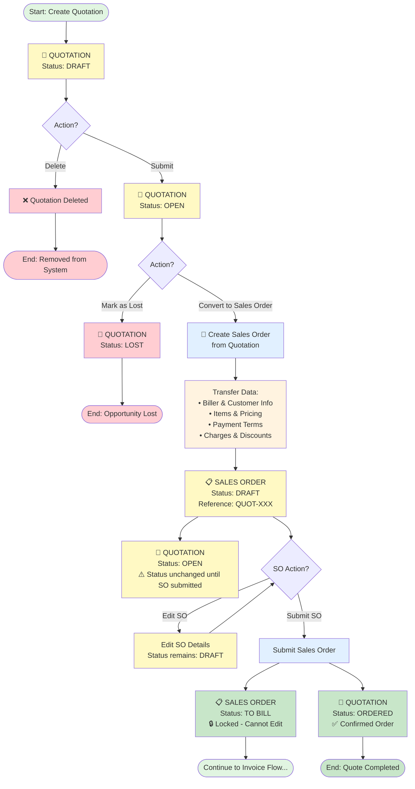

# Quotation Workflows

Detailed workflows for managing quotations in MAIA.

## Visual Workflow Diagram

## Creating a New Quotation

### Required Fields
- Quotation Date
- Biller (Company)
- Customer
- At least 1 item with quantity and price

### Optional Fields
- Valid Until Date
- Reference Number
- Payment Terms
- Notes/Remarks

### Sections to Complete
1. **Details** — Dates and reference
2. **Biller Information** — Company details
3. **Customer Information** — Customer selection
4. **Items** — Products/services
5. **Summary** — Totals (auto-calculated)
6. **Payment Terms** — Payment conditions

## Quotation Statuses

See [[01 - MAIA Product/Overview/Document Status Flows]] for detailed status transitions.

## Common Workflows

### Perfect Quotation Flow
1. Create quotation with all details
2. Save as DRAFT
3. Review totals and terms
4. Submit → OPEN
5. Convert to Sales Order → ORDERED

### Quotation with Revisions
1. Create DRAFT quotation
2. Customer requests changes
3. Edit quotation (still in DRAFT)
4. Adjust pricing/items
5. Submit → OPEN

### Lost Quotation
1. Customer declines quotation
2. Mark quotation as LOST
3. Quotation archived, cannot be edited

## See Also

- [[Quote-to-Cash Flow]] — Full E2E workflow
- [[01 - MAIA Product/Sales Workspace/Selling/Quotations]] — Module details
- [[Document Status Flows]] — Status rules
