# Quote-to-Cash Flow

The **Quote-to-Cash** workflow is the primary business flow in MAIA for B2B sales operations.

## Overview

The Quote-to-Cash flow has 4 main stages, with supporting documents for returns, adjustments, and fulfillment.

### Visual Workflow — Complete Flow

This comprehensive diagram shows all 4 main modules (Quotation, Sales Order, Invoice, Credit Note) and their status transitions.

```mermaid
flowchart TD
    %% Global Styles
    classDef draft fill:#fff9c4,stroke:#fbc02d,stroke-width:2px,color:#000
    classDef open fill:#c8e6c9,stroke:#388e3c,stroke-width:2px,color:#000
    classDef unpaid fill:#ffecb3,stroke:#ffa000,stroke-width:2px,color:#000
    classDef cancelled fill:#ffcdd2,stroke:#d32f2f,stroke-width:2px,color:#000
    classDef process fill:#e1f0ff,stroke:#1976d2,stroke-width:2px,stroke-dasharray: 5 5,color:#000
    classDef transfer fill:#fff3e0,stroke:#f57c00,stroke-width:2px,color:#000
    classDef doc fill:#f5f5f5,stroke:#616161,stroke-width:1px,color:#000
    classDef start fill:#e1f5e1,stroke:#4caf50,stroke-width:2px,color:#000
    classDef endState fill:#ffebee,stroke:#c62828,stroke-width:2px,color:#000

    %% MODULE 1: QUOTATION
    subgraph QUOTATION_MODULE [Quotation Workflow]
        direction TB
        Q_Start([Start: Quotation]):::start --> Q_Draft[📄 QUOTATION<br/>Status: DRAFT]:::draft

        Q_Draft --> Q_DraftAction{Action?}
        Q_DraftAction -->|Delete| Q_Deleted[❌ Quotation Deleted]:::cancelled
        Q_DraftAction -->|Submit| Q_Open[📄 QUOTATION<br/>Status: OPEN]:::open

        Q_Open --> Q_OpenAction{Action?}
        Q_OpenAction -->|Mark as Lost| Q_Lost[📄 QUOTATION<br/>Status: LOST]:::cancelled
        Q_OpenAction -->|Convert to SO| Q_ConvertToSO[🔄 Convert to Sales Order]:::process
    end

    %% MODULE 2: SALES ORDER
    subgraph SALES_ORDER_MODULE [Sales Order Workflow]
        direction TB
        SO_Start([Start: Sales Order]):::start --> SO_Creation{Method?}
        SO_Creation -->|Create New| SO_New[Create New SO]:::process

        Q_ConvertToSO --> SO_DataTransfer[Transfer Quote Data]:::transfer
        SO_DataTransfer --> SO_Draft[📋 SALES ORDER<br/>Status: DRAFT<br/>Ref: QUOT-XXX]:::draft
        SO_New --> SO_Draft

        SO_Draft --> SO_DraftAction{Action?}
        SO_DraftAction -->|Delete| SO_Deleted[❌ Sales Order Deleted]:::cancelled
        SO_DraftAction -->|Submit| SO_Submit[Submit SO]:::process

        SO_Submit -.->|Updates Status| Q_Ordered[📄 QUOTATION<br/>Status: ORDERED]:::open
        SO_Submit --> SO_ToBill[📋 SALES ORDER<br/>Status: TO BILL]:::open

        SO_ToBill --> SO_ToBillActions{Action?}

        SO_ToBillActions -->|Hold| SO_Hold[⏸️ SO Status: HOLD]:::unpaid
        SO_Hold -->|Resume| SO_ToBill

        SO_ToBillActions -->|Close| SO_Closed[✅ SO Status: CLOSED]:::doc
        SO_ToBillActions -->|Cancel| SO_Cancelled[❌ SO Status: CANCELLED]:::cancelled

        SO_ToBillActions -->|Convert to Invoice| SO_ConvertToInv[🔄 Convert to Invoice]:::process
        SO_ToBillActions -->|Create Delivery Note| SO_CreateDN[📦 Create Delivery Note]:::process
        SO_Hold -->|Convert to Invoice| SO_ConvertToInv
    end

    %% MODULE 3: INVOICE
    subgraph INVOICE_MODULE [Invoice Workflow]
        direction TB
        INV_Start([Start: Invoice]):::start --> INV_Creation{Method?}
        INV_Creation -->|Create New| INV_New[Create New Invoice]:::process

        SO_ConvertToInv --> INV_DataTransfer[Transfer SO Data]:::transfer
        INV_DataTransfer --> INV_Draft[🧾 INVOICE<br/>Status: DRAFT<br/>Ref: SO-XXX]:::draft
        INV_New --> INV_Draft

        INV_Draft --> INV_DraftAction{Action?}
        INV_DraftAction -->|Delete| INV_Deleted[❌ Invoice Deleted]:::cancelled
        INV_DraftAction -->|Submit| INV_Submit[Submit Invoice]:::process

        INV_Submit --> INV_Unpaid[🧾 INVOICE<br/>Status: UNPAID]:::unpaid

        INV_Unpaid --> INV_UnpaidActions{Action?}

        INV_UnpaidActions -->|Cancel| INV_Cancelled[❌ INVOICE - CANCELLED]:::cancelled
        INV_UnpaidActions -->|Create Receipt| INV_CreateReceipt[💰 Create Receipt]:::process
        INV_UnpaidActions -->|Create Delivery Note| INV_CreateDN[📦 Create Delivery Note]:::process
        INV_UnpaidActions -->|Create Debit Note| INV_CreateDN_Fin[📈 Create Debit Note]:::process
        INV_UnpaidActions -->|Create Credit Note| INV_CreateCN[🔄 Create Credit Note]:::process
    end

    %% MODULE 4: CREDIT NOTE
    subgraph CREDIT_NOTE_MODULE [Credit Note Workflow]
        direction TB
        CN_Start([Start: Credit Note]):::start --> CN_Creation{Method?}
        CN_Creation -->|Create New| CN_New[Create New CN]:::process

        INV_CreateCN --> CN_DataTransfer[Transfer Invoice Data]:::transfer
        CN_DataTransfer --> CN_Draft[📉 CREDIT NOTE<br/>Status: DRAFT<br/>Ref: INV-XXX]:::draft
        CN_New --> CN_Draft

        CN_Draft --> CN_DraftAction{Action?}
        CN_DraftAction -->|Delete| CN_Deleted[❌ CN Deleted]:::cancelled
        CN_DraftAction -->|Submit| CN_Submit[Submit Credit Note]:::process

        CN_Submit --> CN_Open[📉 CREDIT NOTE<br/>Status: OPEN]:::open

        CN_Open --> CN_OpenActions{Action?}
        CN_OpenActions -->|Cancel| CN_Cancelled[❌ CN CANCELLED]:::cancelled
        CN_OpenActions -->|Create Voucher| CN_CreateVoucher[💸 Create Payment Voucher]:::process

        CN_CreateVoucher --> CN_VoucherUnsaved[PAYMENT VOUCHER<br/>Status: UNSAVED]:::draft
    end

    %% TERMINAL STATES
    Q_Deleted --> End_Removed([End: Removed]):::endState
    Q_Lost --> End_Lost([End: Lost Opportunity]):::endState
    SO_Deleted --> End_Removed
    SO_Cancelled --> End_Cancelled([End: Cancelled]):::endState
    INV_Deleted --> End_Removed
    INV_Cancelled --> End_Cancelled
    CN_Deleted --> End_Removed
    CN_Cancelled --> End_Cancelled

    %% Supporting Documents
    SO_CreateDN --> DN_Draft[📦 DELIVERY NOTE<br/>Status: DRAFT]:::draft
    INV_CreateDN --> DN_Draft
    INV_CreateReceipt --> RCT_Draft[💰 RECEIPT<br/>Status: DRAFT]:::draft
```



**Supporting documents:**
- **Credit Notes** — Returns, refunds, adjustments
- **Debit Notes** — Additional charges
- **Delivery Notes** — Shipment tracking
- **Payment Vouchers** — Refund processing

## Step-by-Step Workflow

### Step 1: Create Quotation

**Purpose:** Provide a formal price quote to the customer

**Process:**
1. Navigate to Sales → Quotations → New Quotation
2. Fill in required sections:
   - **Biller Information** — Select company/biller
   - **Customer Information** — Select customer
   - **Details** — Quotation date, valid until date, reference
   - **Items** — Add products/services with quantities and prices
   - **Summary** — Review totals (auto-calculated)
   - **Payment Terms** — Define payment conditions
3. Save as DRAFT
4. Review and Submit → Status changes to **OPEN**

**Status:** DRAFT → OPEN

**See:** [[Quotation Workflows]] for detailed quotation processes

---

### Step 2: Convert to Sales Order

**Purpose:** Customer accepts quotation, create a confirmed order

**Process:**
1. Open the OPEN quotation
2. Click "Convert to Sales Order"
3. System creates new Sales Order with all quotation data
4. Review Sales Order details
5. Submit → Status changes to **TO BILL**
6. Original quotation status changes to **ORDERED**

**Status:** Quotation becomes ORDERED, Sales Order becomes TO BILL

**See:** [[Sales Order Workflows]] for SO management

---

### Step 2.5: Generate Proforma Invoice (Optional — Cash-in-Advance Customers Only)

**Purpose:** Send a pre-invoice PDF to the customer so they can make payment upfront before the final Invoice is raised

**When to use:** Only for customers on **cash-in-advance payment terms**. Skip this step for customers on credit terms.

**Important:** A Proforma Invoice is **not a separate document** in MAIA. It is a PDF export of the Sales Order.

**Process:**
1. Open the submitted Sales Order (status: **TO BILL**)
2. Click **Generate PDF** on the Sales Order page
3. Select **Proforma Invoice** from the options
4. PDF downloads immediately — send to customer for payment

No new record is created. The Sales Order stays in **TO BILL** status.

**See:** [[Proforma Invoice]] for full details

---

### Step 3: Create Invoice

**Purpose:** Bill the customer for delivered goods/services

**Process:**
1. Navigate to Sales Orders
2. Open the TO BILL sales order
3. Click "Create Invoice"
4. System creates new Invoice linked to SO
5. Review invoice details (delivery note can be created here)
6. Submit → Status changes to **UNPAID**
7. Sales Order status may change based on billing completion

**Status:** Invoice becomes UNPAID, SO status updates

**See:** [[Invoice Workflows]] for invoicing details

---

### Step 4: Record Payment (Receipt)

**Purpose:** Record customer payment against invoice

**Process:**
1. Navigate to Sales → Receipts → New Receipt
2. Select customer
3. Select invoice(s) to pay
4. Enter payment details:
   - Payment amount
   - Payment method (Cash, Bank Transfer, Cheque, etc.)
   - Payment date
   - Reference number
5. Submit → Receipt recorded
6. Invoice status changes to **PAID** (if fully paid)

**Status:** Invoice becomes PAID

**See:** [[Receipt & Payment Workflows]] for payment processing

---

## Alternative Paths

### Cash-in-Advance → Proforma Invoice Before Billing
For customers who must pay upfront before the final Invoice is raised.

**Path:** Quotation → Sales Order → **Generate Proforma Invoice PDF** → Customer pays → Invoice → Receipt

**See:** [[Proforma Invoice]]

### Skip Quotation → Direct Sales Order
Some businesses allow direct Sales Order creation without quotation.

**Path:** Sales Order → Invoice → Receipt

### Skip Sales Order → Direct Invoice
For simple transactions or service billing.

**Path:** Invoice → Receipt

### Returns → Credit Note
Customer returns goods or requests refund.

**Path:** Invoice → Credit Note

**See:** [[Credit Note Workflows]]

---

## Document Relationships

```
Quotation (SAL-QTN-2025-00001)
    ↓
Sales Order (SAL-ORD-2025-00001)
    ↓
Invoice (ACC-SINV-2025-00001)
    ↓
Receipt (ACC-RCV-2025-00001)
```

Each document references its parent document for traceability.

---

## Common Scenarios

### Scenario 1: Perfect Flow (5 items)
1. Create Quotation with 5 items
2. Submit quotation (OPEN)
3. Convert to Sales Order (TO BILL)
4. Create Invoice (UNPAID)
5. Record Payment (PAID)

**Expected Time:** ~2-5 minutes

### Scenario 2: Partial Invoicing
1. Sales Order with 100 units
2. Create Invoice 1 for 30 units
3. Create Invoice 2 for 45 units
4. Create Invoice 3 for 25 units
5. Each invoice paid separately

**Note:** MAIA supports multiple invoices from single SO

### Scenario 3: Hold and Resume
1. Sales Order in TO BILL
2. Put on HOLD (temporary pause)
3. Resume to TO BILL when ready
4. Continue to Invoice

---

## Known Limitations

- ⚠️ Cannot create invoice directly from HOLD status (must resume first)
- ⚠️ Cannot create multiple credit notes from same invoice
- ✅ Can create multiple invoices from same sales order

**See:** [[01 - MAIA Product/Overview/Known Limitations]]

---

## See Also

- [[Quotation Workflows]] — Detailed quotation processes
- [[Sales Order Workflows]] — SO management and statuses
- [[Proforma Invoice]] — PDF export for cash-in-advance customers
- [[Invoice Workflows]] — Invoicing and billing
- [[Credit Note Workflows]] — Returns and credits
- [[Receipt & Payment Workflows]] — Payment recording
- [[Document Status Flows]] — All status transitions
- [[04 - QA & Known Issues/Test Scenarios Index]] — Test scenarios for this flow
