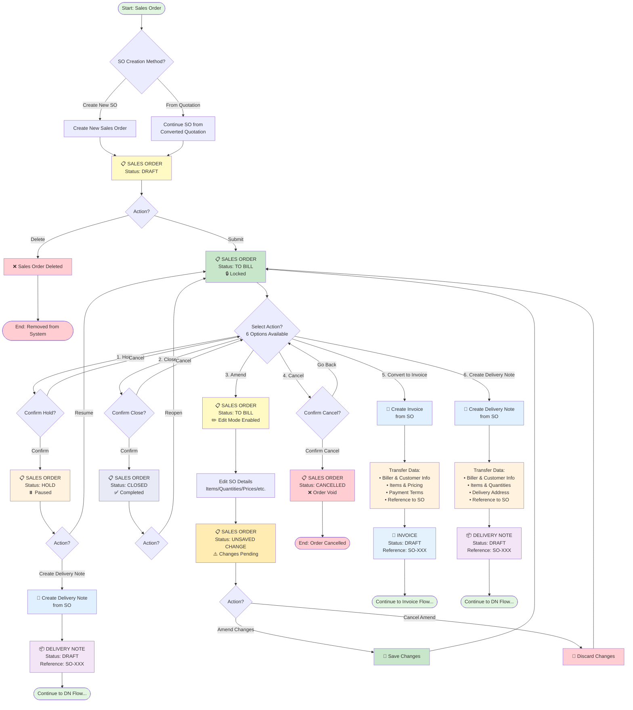

# Sales Order Workflows

Detailed workflows for managing sales orders in MAIA.

## Visual Workflow Diagram

## Creating a Sales Order

### From Quotation (Recommended)
1. Open an OPEN quotation
2. Click "Convert to Sales Order"
3. System pre-fills all quotation data
4. Review and adjust if needed
5. Submit → TO BILL

### Direct Sales Order
1. Navigate to Sales → Sales Orders → New
2. Fill in all required fields manually
3. Submit → TO BILL

## Sales Order Statuses

See [[01 - MAIA Product/Overview/Document Status Flows]] for detailed status transitions.

## Key Operations

### Amend Sales Order
**When:** SO is in TO BILL and needs changes

**Process:**
1. Open the TO BILL sales order
2. Click "Amend"
3. Status changes to UNSAVED
4. Make changes (items, quantities, prices)
5. Submit → Returns to TO BILL

**Note:** Amendments create a new version, original remains in history

### Hold and Resume
**When:** Temporarily pause an order

**Process:**
1. Open TO BILL sales order
2. Click "Hold"
3. Status changes to HOLD
4. To resume: Click "Resume"
5. Status returns to TO BILL

**Limitation:** ⚠️ Cannot create invoice directly from HOLD — must resume first

### Close Sales Order
**When:** Order is complete (fully invoiced and delivered)

**Process:**
1. Open TO BILL sales order
2. Click "Close"
3. Status changes to CLOSED
4. Order is archived, cannot be modified

### Cancel Sales Order
**When:** Customer cancels order or order cannot be fulfilled

**Process:**
1. Open TO BILL sales order
2. Click "Cancel"
3. Enter cancellation reason (required)
4. Status changes to CANCELLED
5. If quotation exists, quotation reverts to OPEN

## See Also

- [[Quote-to-Cash Flow]] — Full E2E workflow
- [[01 - MAIA Product/Sales Workspace/Selling/Sales Orders]] — Module details
- [[Document Status Flows]] — Status rules
- [[01 - MAIA Product/Overview/Known Limitations]] — Known issues
