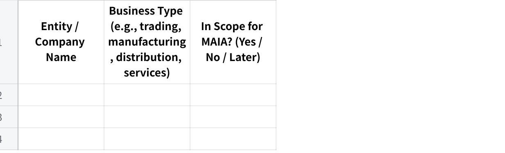

**\[Survey\] MAIA Pre-Onboarding Requirements Questionnaire**

*To be completed by client before the first deep-dive meeting*

**Client Name:** \_\_\_\_\_\_\_\_\_\_\_\_\_\_\_\_\_\_\_\_\_\_\_\_\_\_\_\_\_\_\_\_\_\_\_\
**Completed By:** \_\_\_\_\_\_\_\_\_\_\_\_\_\_\_\_\_\_\_\_\_\_\_\_\_\_\_\_\_\_\_\_\_\_\_ (Name / Role)\
**Date:** \_\_\_\_\_\_\_\_\_\_\_\_\_\_\_\_\_\_\_\_\_\_\_\_\_\_\_\_\_\_\_\_\_\_\_\
**Account Manager (Mindhive):** \_\_\_\_\_\_\_\_\_\_\_\_\_\_\_\_\_\_\_\_\_\_\_\_\_\_\_\_\_\_\_\_\_\_\_

**How to Use This Document**

This questionnaire collects factual information about your business so we can prepare for a focused and productive first meeting. The meeting itself will focus on *how* your workflows actually run and *where* they break --- not on collecting this baseline data.

**Guidelines:**

Answer as completely as you can. Partial answers are fine --- write \"unsure\" or \"to discuss\" for anything unclear, rather than leaving it blank.

For tables, add or remove rows as needed.

If a question doesn\'t apply to your business, write \"N/A.\"

Please return this document within **5 business days** of receipt. Your meeting will be scheduled once this is received.

**Section 1 --- Business Structure**

*We need to understand the full picture of your business entities before the meeting --- even if only one entity is in scope for Phase 1. Multi-entity structures affect system configuration, data filtering, and integration design.*

**1.1** How many companies or business entities are in your group? List all of them, even if they won\'t use MAIA immediately.

**点击图片可查看完整电子表格**

**1.2** Do all entities share the same ERP / accounting system instance, or does each have its own?

**1.3** Do the entities share the same customer database and item database, or are they separate?

**1.4** How many branches, warehouses, or office locations operate across the in-scope entities?

**点击图片可查看完整电子表格**

**1.5** Do you operate in multiple currencies? If yes, which currencies and for which entities/customers?

**Section 2 --- Team & Roles**

**2.1** How many people in your company will use MAIA day-to-day? (Approximate is fine.)

**2.2** What roles or departments will use the system, and roughly how many people per role?

**点击图片可查看完整电子表格**

**2.3** What are your standard operating hours? Do you operate on weekends or public holidays?

**2.4** Do any of your staff work in the field (e.g., outdoor salespeople, drivers, service technicians)? If yes, which roles?

**2.5** Do field staff currently have access to your ERP / accounting system? If not, why not? (e.g., no mobile access, VPN too slow, system too complex, licensing cost)

**Section 3 --- Current Systems & ERP**

*This section is critical for integration planning. Please be as specific as possible --- it directly affects cost and timeline.*

**3.1** What is your main ERP / accounting system?

**点击图片可查看完整电子表格**

**3.2** Have you ever done any integration project with your ERP before? (e.g., connecting it to another system, enabling API access, automated data sync) If yes, describe briefly.

**3.3** Are there any customizations in your ERP that are not standard out-of-the-box features? (e.g., custom approval workflows, custom report templates, custom modules, special data fields) If yes, describe briefly.

**3.4** Do multiple users share a single ERP login, or does each user have their own account?

**3.5** Does your ERP have a test/UAT environment separate from the live system?

**3.6** What other systems or tools do you use alongside the ERP?

**点击图片可查看完整电子表格**

**3.7** Which of these systems would you want MAIA to connect to?

**3.8** Are there any systems you plan to replace or stop using once MAIA is live?

**Section 4 --- Products, Inventory & Pricing**

**Products & Inventory**

**4.1** Approximately how many products / items (SKUs) do you carry?

**4.2** How often are new items added? (e.g., 5/month, rarely, constantly)

**4.3** Do you use product categories, brands, or groupings? If yes, describe briefly.

**4.4** Do you manage stock across multiple warehouses or locations? If yes, list them.

**4.5** Which of the following apply to your products? (Check all that apply.)

\[ \] Expiry dates / shelf life

\[ \] Batch numbers

\[ \] Serial numbers

\[ \] Multiple units of measure (e.g., sold in pieces but stocked in cartons, or sold by weight but received by piece)

\[ \] Bundle / kit products (one SKU = multiple items)

\[ \] Product variants (e.g., size, colour, material, voltage, model)

\[ \] Product images are important for identification or quotation documents

**4.6** Do you do any processing, cutting, repackaging, or transformation of raw materials into finished goods? If yes, describe what types. (e.g., fish filleting, bulk repackaging into smaller units, assembly)

**4.7** Do your salespeople or account managers ever \"reserve\" stock for specific customers before a confirmed order is placed? If yes, how is this tracked today?

**Pricing**

**4.8** How do you manage pricing? (Check all that apply.)

\[ \] One standard price list for all customers

\[ \] Multiple price lists / tiers for different customer segments

\[ \] Customer-specific pricing (negotiated per customer)

\[ \] Blanket agreements / contract pricing with individual customers

\[ \] Volume-based or quantity-based discounts

\[ \] Discount-based tiers (e.g., Tier 1 = 20% off, Tier 2 = 15% off)

\[ \] Price varies based on sourcing / import cost at time of order

\[ \] Other: \_\_\_\_\_\_\_\_\_\_\_\_\_\_\_

**4.9** If you have multiple price lists or tiers, how many are there? What defines each tier?

**4.10** Where is pricing data maintained today? (Check all that apply.)

\[ \] Inside the ERP system

\[ \] In a separate spreadsheet / Excel file

\[ \] In the salesperson\'s memory / experience

\[ \] Other: \_\_\_\_\_\_\_\_\_\_\_\_\_\_\_

**4.11** How frequently do your costs or selling prices change? (e.g., daily for commodities, monthly, annually, by contract period)

**4.12** Is there a person or role responsible for setting or updating prices? If yes, who?

**Section 5 --- Sales & Order Workflow**

*In this section, we are collecting facts about your process --- not a detailed walkthrough. The walkthrough happens in the meeting.*

**5.1** How do customer orders / enquiries typically arrive? (Check all that apply.)

\[ \] WhatsApp (text, voice message, or image)

\[ \] Email

\[ \] Phone call

\[ \] Walk-in / counter

\[ \] Customer portal / website

\[ \] Marketplace (Shopee, Lazada, etc.)

\[ \] Purchase Order document (PDF, Excel, or other format)

\[ \] Other: \_\_\_\_\_\_\_\_\_\_\_\_\_\_\_

**5.2** Approximately how many sales orders are processed per day?

**5.3** How many line items does a typical order contain? (e.g., 5--10 items, 20--50 items, 100+)

**5.4** Who creates quotations? Who approves them?

**5.5** Who creates or confirms sales orders? Is there an approval process?

**5.6** Are there situations where a quotation or order needs special approval? (e.g., large order value, credit limit exceeded, special pricing, non-standard items, new customer)

**5.7** Do you handle any of the following? (Check all that apply.)

\[ \] Customer returns / exchanges

\[ \] Credit notes

\[ \] Debit notes

\[ \] Advance payments or deposits before delivery

\[ \] Partial deliveries (order split across multiple shipments)

\[ \] Back orders (items ordered but not currently in stock)

\[ \] Consignment stock at customer sites

\[ \] Substitution of alternative items when requested item is out of stock

**5.8** What are the most common reasons your team issues credit notes? (e.g., pricing error, wrong item delivered, early payment discount, quality rejection, wrong serial number)

**5.9** Can salespeople currently create credit notes, or is that restricted to finance?

**Section 6 --- Delivery & Logistics**

**6.1** How do you deliver goods to customers? (Check all that apply.)

\[ \] Own fleet / in-house drivers

\[ \] Freelance / contract drivers

\[ \] Third-party courier / logistics company

\[ \] Customer self-pickup

\[ \] Other: \_\_\_\_\_\_\_\_\_\_\_\_\_\_\_

**6.2** Do you plan delivery routes or trips? If yes, how is this done today?

**6.3** Do drivers currently capture proof of delivery (signature, photo)?

**6.4** Do you handle cash-on-delivery (COD)? If yes, how is COD reconciled with finance?

**6.5** Is the delivery order and invoice issued at the same time, or separately?

**Section 7 --- Finance, Payments & Credit**

**7.1** What payment methods do your customers use? (Check all that apply.)

\[ \] Bank transfer

\[ \] Cheque

\[ \] Cash

\[ \] Cash on delivery (COD)

\[ \] Credit terms (net 30, net 60, etc.)

\[ \] Online payment gateway

\[ \] Other: \_\_\_\_\_\_\_\_\_\_\_\_\_\_\_

**7.2** Do you extend credit terms to customers? If yes, what are your standard terms? (e.g., 7 days, 30 days, 60 days)

**7.3** Do you set credit limits per customer? If yes, what happens when a customer exceeds their limit? (e.g., order blocked, requires manager approval, warning only)

**7.4** Is your credit limit enforcement managed inside the ERP, or tracked manually?

**7.5** How do customers notify you when they\'ve made a payment? (e.g., WhatsApp message to salesperson, email to finance, upload to portal)

**7.6** Do you send Statements of Account (SOA) to customers? If yes, how often and how? (e.g., monthly PDF email, manual process)

**7.7** What is your e-invoicing status?

\[ \] Already compliant and automated (auto-sync to LHDN)

\[ \] Compliant but manual submission

\[ \] In progress

\[ \] Not started

\[ \] Not applicable

**7.8** Do customers prefer individual invoices per delivery, or consolidated monthly invoices? (Is it a per-customer preference?)

**7.9** Are there any tax exemption scenarios relevant to your business? (e.g., C1, C3, A57 certificates, LMW, export exemptions)

**Section 8 --- Documents & Reports**

**8.1** What documents do you currently generate for customers? (Check all that apply.)

\[ \] Quotation

\[ \] Proforma invoice

\[ \] Sales order confirmation

\[ \] Invoice

\[ \] Delivery order / delivery note

\[ \] Pick list (internal)

\[ \] Credit note

\[ \] Debit note

\[ \] Payment receipt

\[ \] Statement of Account (SOA)

\[ \] Other: \_\_\_\_\_\_\_\_\_\_\_\_\_\_\_

**8.2** Are your document templates generated by the ERP\'s built-in report engine (e.g., Crystal Reports for SAP B1)? If yes, which documents?

**8.3** Are there specific fields, references, or formatting on your documents that your customers or regulators require? (e.g., PO reference, project number, company registration, specific logo placement) Write \"to discuss\" if easier to show in the meeting.

**8.4** What reports do you look at regularly? (e.g., daily sales summary, outstanding AR aging, stock movement, salesperson performance)

**8.5** Are there any reports you currently build manually in Excel that you wish were automated?

**Section 9 --- Communication & Channels**

**9.1** Do you have a WhatsApp Business account? If yes, is it a regular WhatsApp Business app or WhatsApp Business API (WABA)?

**9.2** Would you want MAIA to communicate with your customers via WhatsApp? (e.g., order confirmations, delivery updates, payment reminders)

**9.3** Would you want MAIA to help your internal team via WhatsApp? (e.g., sales staff creating orders through chat, drivers receiving trip details, payment proof forwarding)

**9.4** What primary languages does your team use in daily operations? (e.g., English, Malay, Chinese --- specify Mandarin/Cantonese if relevant)

**9.5** What primary languages do your customers communicate in?

**Section 10 --- Pain Points & Priorities**

**10.1** What are the top 3 problems you want MAIA to solve? (In your own words --- be as specific as possible.)

**10.2** What currently takes the most time in your daily operations that you wish was faster or easier?

**10.3** Is there anything that currently \"falls through the cracks\" --- orders missed, documents lost, follow-ups forgotten?

**10.4** If MAIA could only do one thing for your business, what would it be?

**10.5** Is there anything your team currently does outside the ERP system (in WhatsApp, spreadsheets, paper, or memory) that you believe should be in a system? Describe briefly.

**Section 11 --- Data Readiness**

**11.1** Can you provide the following in Excel or CSV format? (Check all you can provide.)

\[ \] Customer list (company name, code, contact person, phone, email, address, credit terms, credit limit)

\[ \] Product / item list (SKU/code, name, description, unit of measure, category, active/inactive status)

\[ \] Price list(s) --- standard and/or customer-specific

\[ \] Current stock balances (item, warehouse, quantity)

\[ \] Supplier list (if relevant for purchasing)

**11.2** For each item checked above, who in your team will prepare this data?

**11.3** Please provide 3--5 sample transaction documents. These help us understand your document formats, field requirements, and workflow. (e.g., a recent quotation, sales order, invoice, delivery order, credit note, customer PO, pick list)

**11.4** Do you want historical transaction data (old orders, invoices, etc.) available inside MAIA, or are you comfortable starting fresh with forward-only data?

\[ \] Forward-only (new transactions from go-live onwards) --- *standard*

\[ \] Want historical data migrated --- Approximate date range: \_\_\_\_\_\_\_\_\_\_\_\_\_\_\_

\[ \] Unsure --- to discuss

*Note: Historical data migration is a separate scope item. We will assess feasibility and cost based on the volume and quality of your data.*

**Section 12 --- Timeline & Project Ownership**

**12.1** When do you need MAIA to be operational? Is there a hard deadline? (e.g., tied to a contract, season, audit, or event)

**12.2** Who from your team will be the **internal project owner** --- the day-to-day contact during onboarding? (Ideally someone operational who understands the daily workflow, not only a department head.)

**12.3** Who will be the **decision-maker** if we need approvals during setup? (e.g., on workflows, permissions, integrations, scope decisions)

**12.4** Are there any upcoming events that might affect your availability during onboarding? (e.g., holidays, audits, travel, peak season)

**What Happens Next**

Once you return this questionnaire and the sample data items, we will:

Review your responses and prepare a focused agenda for the deep-dive meeting

Schedule **Meeting 1** (business workflow deep-dive) at your office --- 1.5 to 2.5 hours

If integration with your ERP or third-party systems is needed, schedule **Meeting 2** (IT/integration scoping) --- this can be remote and may include your IT vendor

**Please inform us once this document is completed.**\
**Questions about any item?** Reply to this message --- we\'re happy to clarify.

*MAIA by Mindhive --- Client Onboarding Questionnaire v2.0*
