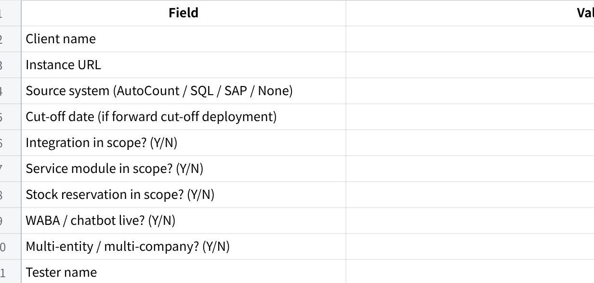
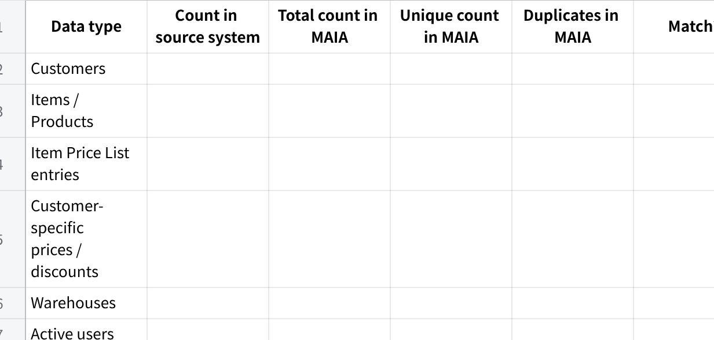
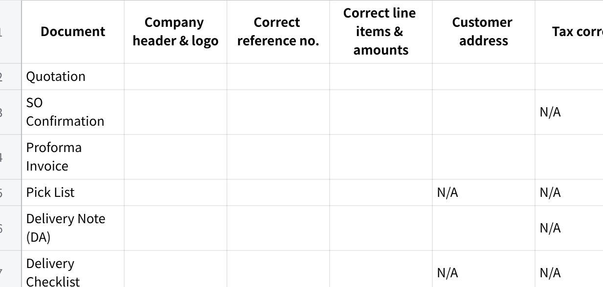
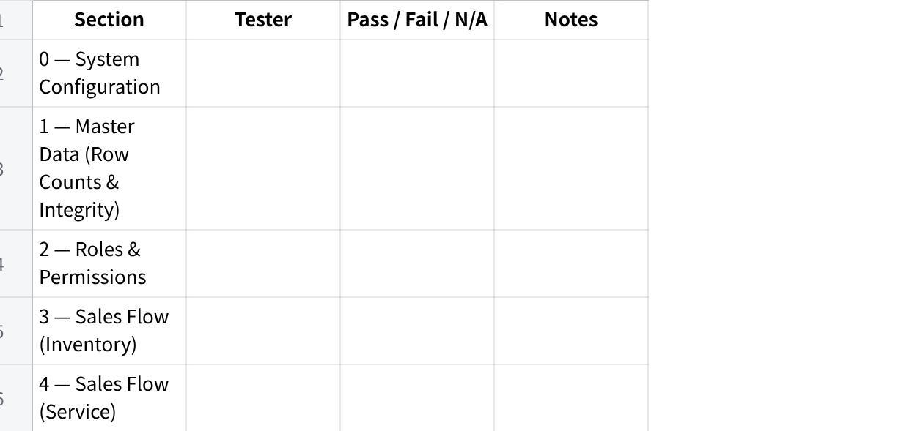

**\[Testing\] - Checklist**

**MAIA QA Testing Framework**

**Version:** v0.2

**Owner:** Product / Implementation Team

**Purpose:** Internal QA gate --- complete this before any client handover or UAT session

**Environment:** Staging or dedicated QA instance with real client data loaded

**How to Use**

Mark each item: ✅ Pass · ❌ Fail · ⚠️ Flag (works but behaviour is unexpected --- escalate)

If anything is ❌ Fail --- stop, log it, fix it. Do not proceed to the next section.

⚠️ Flag items do not block progress but must be reviewed before final sign-off.

**One person runs this. A different person reviews and countersigns.** No self-approval.

Sections marked (If in scope) --- skip only if explicitly confirmed out of scope for this deployment. Write \"N/A --- \[reason\]\" in the notes column, not just a blank.

**Deployment Details (Fill Before Starting)**

**点击图片可查看完整电子表格**

**Section 0 --- System Configuration**

  -------------------------------------------------------------------------------------------------------------------------------------------------------
  These are the foundational settings that everything else depends on. Wrong config here means every test below this is testing on a broken foundation.

  -------------------------------------------------------------------------------------------------------------------------------------------------------

**0.1 Company Setup**

\[ \] Company legal name is correct and matches SSM registration

\[ \] Default currency is MYR (or confirmed correct for the client)

\[ \] Fiscal year start and end dates are correct

\[ \] Company logo is uploaded and displays correctly on document PDFs

\[ \] Company address, phone, email, and registration number are correct on document headers

\[ \] If multi-entity: all companies are created, each with their own correct legal name, currency, and fiscal year

\[ \] Inter-company transactions are configured correctly (if applicable)

**0.2 Tax Configuration**

\[ \] Tax template(s) are configured (SST 8%, SST 6%, exempt --- whatever applies to this client)

\[ \] Default tax is applied correctly on QT, SO, and SI line items

\[ \] Tax-exempt items are correctly flagged and do not attract tax on documents

\[ \] Tax registration number appears correctly on Sales Invoice PDF

**0.3 Numbering Series**

\[ \] Document numbering series are configured for all doctypes in scope:

\[ \] cRFQ (if in scope)

\[ \] Quotation

\[ \] Sales Order

\[ \] Sales Invoice

\[ \] Delivery Note

\[ \] Pick List

\[ \] Payment Entry

\[ \] Credit Note / Debit Note

\[ \] SWO (if service module in scope)

\[ \] Numbering series format matches client\'s preferred format (e.g. INV-2025-0001, not ERPNext default)

\[ \] Series do not clash with existing document numbers in the client\'s source system --- confirm prefix is distinct

**0.4 Payment Terms**

\[ \] All payment terms used by the client are configured (e.g. Net 30, Net 60, COD, CIA)

\[ \] Payment terms produce correct due dates when applied to a Sales Invoice

\[ \] Default payment term is set at company level

**0.5 Currency & Exchange Rate**

\[ \] MYR is the base currency

\[ \] If the client transacts in foreign currencies: USD, SGD, or others are configured

\[ \] Exchange rates are set and up to date

\[ \] Foreign currency invoices display correctly with both foreign and base currency amounts

**0.6 User Accounts & Role Assignment**

\[ \] Every live user account is created with their correct name and email

\[ \] Each user is assigned the correct role(s) --- no over-permissioning

\[ \] Each user is scoped to the correct company via UserPermission (multi-entity deployments)

\[ \] No user has System Manager access unless explicitly authorised

\[ \] Shared/generic logins do not exist --- every account is person-specific

**0.7 Workflow Configuration (If configured)**

\[ \] Approval workflows are active on the correct doctypes (QT, SO, or both --- per client config)

\[ \] Only one active workflow per doctype --- confirm no duplicate workflows exist

\[ \] workflow_state field is used --- not competing with ERPNext native status

\[ \] Workflow transitions are correctly defined: who can approve, who can reject, what state each action leads to

\[ \] Rejected documents route back to the submitter with the reason visible

**0.8 Notification & Digest Configuration**

\[ \] Notification rules are configured per the notification serving protocol

\[ \] Working hours are set correctly for the client\'s timezone

\[ \] Daily digest schedule is configured and set to the correct delivery time

\[ \] WABA channel is linked to the correct phone number (if in scope)

\[ \] In-app notification fallback is active for users without WABA

**Section 1 --- Master Data: Row Counts & Integrity**

  ---------------------------------------------------------------------------------------------------------------------------------------------------------------------------------------
  Garbage in, garbage out. The most boring section and the most important. Row count checks come first --- if the numbers don\'t add up, spot-checking individual records is pointless.

  ---------------------------------------------------------------------------------------------------------------------------------------------------------------------------------------

**1.1 Row Count Reconciliation**

Before checking any individual record, verify total record counts match between source system and MAIA. Get these numbers from the client\'s source system export or the integration sync log.

**点击图片可查看完整电子表格**

  ----------------------------------------------------------------------------------------------------------------------------------------------------------------------------------------------------------------------------------------------------------------------------------------------------------------------------------
  **How to get unique count and duplicates in MAIA:** Run a report or query grouped by the unique key (customer code, item code, etc.) and count records with more than one occurrence. Duplicates must be resolved before proceeding --- they cause silent data corruption on every transaction that touches the affected record.

  ----------------------------------------------------------------------------------------------------------------------------------------------------------------------------------------------------------------------------------------------------------------------------------------------------------------------------------

\[ \] Total count in MAIA matches source system --- tolerance: zero

\[ \] Unique count equals total count --- if these differ, duplicates exist and must be resolved before proceeding

\[ \] Zero duplicate customer codes in MAIA

\[ \] Zero duplicate item codes in MAIA

\[ \] Zero duplicate price list entries for the same item + price list combination

\[ \] Zero duplicate customer-specific price entries for the same customer + item combination

\[ \] If any count does not match or duplicates exist: **do not proceed**. Find the gap or duplicate, fix the import, recount.

**1.2 Customer Master**

**Completeness --- spot-check 5 customers from different segments:**

\[ \] Full legal name matches source system exactly --- no truncation, no abbreviation

\[ \] All billing addresses are present and correctly formatted

\[ \] All shipping / delivery addresses are present --- if the customer has multiple delivery points, all must be selectable on documents

\[ \] All contacts are present: primary contact (name, phone, email), plus secondary contacts (AP, operations) if the client tracks them

\[ \] Payment terms are set and match source system

\[ \] Customer group / category is assigned --- if missing, tiered pricing will fall back incorrectly

\[ \] Tax ID / SST registration number is present (if applicable)

**Integration code check (AutoCount / SQL deployments):**

\[ \] Customer code in MAIA matches source system exactly --- including leading zeros and format (e.g. C00123 not C123)

\[ \] Pull 5 customers at random. Compare codes side by side. All 5 must match exactly.

**Credit exposure --- spot-check at least 3 customers with outstanding balances:**

+:----------------------------------------------------------------------------------------------------------------------------------------------------------------------------------------+
| **Forward cut-off deployments:** Balances are not live-synced. They are represented by two manually created opening balance invoices per customer, dated as at the agreed cut-off date: |
|                                                                                                                                                                                         |
| **Invoice 1 --- Current outstanding:** total open invoices not yet overdue at cut-off                                                                                                   |
|                                                                                                                                                                                         |
| **Invoice 2 --- Overdue:** total overdue amount at cut-off, backdated so aging buckets (30/60/90 days) are correct                                                                      |
|                                                                                                                                                                                         |
| Without these, credit limit checks are meaningless from day one.                                                                                                                        |
+-----------------------------------------------------------------------------------------------------------------------------------------------------------------------------------------+

\[ \] Credit limit in MAIA matches source system exactly

\[ \] Opening balance invoices exist for every customer with an outstanding balance (current + overdue split)

\[ \] Invoice amounts match source system export at cut-off date --- tolerance: zero

\[ \] Overdue invoice is backdated correctly --- aging buckets calculate accurately from go-live

\[ \] Combined exposure (opening invoices + new MAIA invoices) displays correctly in the customer credit view

\[ \] Customer with a hold/block in source system shows the same status in MAIA

\[ \] Customer with zero balance shows zero --- no false positive block

**1.3 Item Master**

**Completeness --- spot-check 10 items across different categories:**

\[ \] Item code matches source system exactly --- same format, same leading zeros

\[ \] Item name / description matches source system (clients notice this immediately)

\[ \] Item group / category is assigned

\[ \] item_type is correct: Product for inventory items, Service for service items

\[ \] Reorder / minimum stock level is set (if client tracks this)

**Integration code check (AutoCount / SQL deployments):**

\[ \] Item code in MAIA matches source system exactly

\[ \] Pull 10 items at random. Compare codes. All 10 must match.

**UOM:**

\[ \] Base UOM is correct for each item (e.g. KG, PCS, BOX)

\[ \] All secondary UOMs are configured for items sold or purchased in multiple units (e.g. item sold as PCS but purchased as CTN)

\[ \] UOM conversion factors are correct --- if 1 CTN = 12 PCS, that must be in MAIA exactly. Wrong conversion factors silently corrupt every quantity calculation downstream.

\[ \] Spot-check 5 items with multiple UOMs: verify conversion factors against source system or physical pack size

**Stock / Inventory:**

\[ \] Opening stock quantity per warehouse matches source system export at cut-off date

\[ \] Stock is linked to the correct warehouse

\[ \] actual_qty and available_qty are visible and correct

\[ \] reserved_qty is visible (if stock reservation is in scope)

\[ \] Zero-stock items exist as item records showing 0 --- they must not be missing from MAIA

**1.4 Pricing & Price Lists**

\[ \] Standard price list is created and named correctly

\[ \] Every item that has a price in source system has a corresponding price in MAIA\'s standard price list --- use row count from §1.1 to confirm completeness

\[ \] Spot-check 10 item prices: prices in MAIA match source system exactly (amount and currency)

\[ \] If the client has multiple price lists (e.g. retail, wholesale, distributor): all price lists are configured in MAIA

\[ \] Each price list is assigned to the correct customer group or individual customer

**Customer-specific pricing and discounts:**

\[ \] Customer Item Price entries exist in MAIA for every customer-specific price override that exists in source system --- use row count from §1.1 to confirm completeness

\[ \] Spot-check 5 customer-specific prices: verify the override price in MAIA matches what the client has configured in AutoCount/SQL

\[ \] Customer discounts (if client uses discount % instead of override price) are configured and apply correctly on QT line items

\[ \] When creating a QT for a customer with a special price, the special price auto-applies --- the standard price does not appear first

\[ \] When creating a QT for a customer with no special price, the standard price list price applies

**1.5 Warehouse Structure**

  --------------------------------------------------------------------------------------------------------------------------------------------------------------------------
  **Rule:** Warehouse structure in MAIA must mirror the client\'s physical and system structure. Do not rename or consolidate warehouses without explicit client approval.

  --------------------------------------------------------------------------------------------------------------------------------------------------------------------------

\[ \] If client has named warehouses in source system: the same names exist in MAIA

\[ \] If client has no warehouse structure (MAIA standalone): MAIA default warehouse structure is applied --- document which default was used

\[ \] Each warehouse is linked to the correct company (critical for multi-entity deployments)

\[ \] Warehouse codes match source system codes exactly (AutoCount / SQL deployments)

\[ \] Items are linked to the correct warehouse --- an item stocked in Penang Store must not show as stocked in Main Warehouse

\[ \] Stock levels per warehouse are correct --- if client tracks stock by location, the split must be accurate

**Section 2 --- Role & Permission Isolation**

  ------------------------------------------------------------------------------------------------------------------------------------------
  Test this with actual role-specific logins. Do not test by toggling permissions in admin view --- that is not what the user experiences.

  ------------------------------------------------------------------------------------------------------------------------------------------

**2.1 Sales User**

\[ \] Can create: cRFQ, CPO, Quotation, Sales Order

\[ \] Cannot access: Sales Invoice, Payment Entry, Pick List creation

\[ \] Cannot see records belonging to other companies (multi-entity deployments)

**2.2 Sales Manager**

\[ \] Can see approval queues: cRFQ, Quotation, SO (per workflow config)

\[ \] Can approve --- document transitions to correct next state

\[ \] Can reject with reason --- document returns to Sales User with reason visible

**2.3 Finance User**

\[ \] Can access: Sales Invoice, Debit Note, Credit Note, Payment Entry, Payment Receipt, Payment Voucher

\[ \] Cannot create or edit: Sales Order, Pick List, Delivery Note

**2.4 Logistics User**

\[ \] Can access: Pick List, Delivery Note, Delivery Trip, Shipment

\[ \] Cannot access: Sales Invoice, Payment Entry, customer credit data

**2.5 Warehouse User**

\[ \] Can view and update Pick List (confirm actual picked quantities)

\[ \] Cannot access: financial documents, customer pricing, credit data

**2.6 Driver**

\[ \] Can view assigned Delivery Trip stops only

\[ \] Can record POD / POP

\[ \] Cannot access any document outside their assigned trips

**2.7 Service Coordinator (If service module in scope)**

\[ \] Can create, assign, schedule, and complete SWO

\[ \] Cannot access: financial documents, pick lists

**2.8 Cross-Entity Isolation (If multi-entity)**

\[ \] User scoped to Company A cannot see Company B records in any list view, report, or chatbot query

\[ \] No cross-entity data leakage

**Section 3 --- Sales Flow: Inventory Path**

  --------------------------------------------------------------------------------------------------------------------------------
  Run this end-to-end. Every document must be created and submitted --- do not assume a step works because the previous one did.

  --------------------------------------------------------------------------------------------------------------------------------

**3.1 cRFQ (If in scope)**

\[ \] Create a new cRFQ, attach a sample file (PDF or image)

\[ \] AI extraction runs and populates draft line items

\[ \] Line items are reviewable and editable by the user

\[ \] Status transitions correctly: Open → Drafting → Draft Ready → Under Review → Quotation Issued

\[ \] Quotation is generated from cRFQ and linked back to it

\[ \] Clarification questions surface on the cRFQ form and can be answered

**3.2 CPO Upload**

\[ \] Upload a sample customer PO document

\[ \] AI extracts: customer, items, quantities, requested delivery date

\[ \] Extracted line items can be matched to existing items in MAIA

\[ \] CPO converts to Quotation (match/review path) OR directly to Sales Order (CPO direct path) --- confirm which path is configured

**3.3 Quotation**

\[ \] Create a Quotation manually (not from cRFQ or CPO)

\[ \] Customer-specific price auto-applies on line items where configured

\[ \] Null-price item blocks QT submission --- notification fires to the correct person

\[ \] Quotation PDF generates correctly: company header, logo, customer address, line items, totals, T&Cs

**3.4 Sales Order**

\[ \] Convert Quotation to SO (QT Won path)

\[ \] Create SO directly from CPO (CPO direct path)

\[ \] SO shows: per_delivered, per_billed, per_fulfilled

\[ \] SO Confirmation PDF generates correctly

**3.5 Pick List**

\[ \] Generate Pick List from SO

\[ \] Pick List shows correct items, quantities, warehouse

\[ \] Warehouse user can update actual picked quantities

\[ \] Pick List marked complete --- DN creation is triggered

**3.6 Delivery Note**

\[ \] Create DN from Pick List --- quantities reflect actual picked, not SO quantities

\[ \] Create DN directly from SO (no Pick List path) --- confirm this path works

\[ \] DN submission updates per_delivered on SO

\[ \] Delivery Note PDF generates correctly

**3.7 Delivery Trip (Self-deliver)**

\[ \] Create Delivery Trip, add DN as a stop, assign driver

\[ \] Driver can view their trip stops in their own login

\[ \] Driver records POD --- delivery confirmed

\[ \] Delivery Checklist PDF generates correctly

**3.8 Shipment (3PL path)**

\[ \] Create Shipment from DN

\[ \] Airway Bill generates correctly

\[ \] Shipment status updates correctly on DN

**3.9 Sales Invoice**

\[ \] Create SI from SO

\[ \] SI line items match SO --- no phantom additions, no missing lines

\[ \] Customer-specific price is preserved on SI (not reverted to standard)

\[ \] Tax applies correctly

\[ \] SI submission updates per_billed on SO

\[ \] Invoice PDF generates correctly

**3.10 Payment Entry (Receive)**

\[ \] Create Payment Entry (payment_type = Receive)

\[ \] Payment allocates correctly to the outstanding SI

\[ \] Payment Receipt PDF generates

\[ \] Customer outstanding balance updates after payment

**Section 4 --- Sales Flow: Service Path (If in scope)**

\[ \] Create SO with item_type = Service line item

\[ \] SWO is created and linked to the SO

\[ \] Service Coordinator can assign technician and set schedule

\[ \] Job Sheet generates correctly for the technician

\[ \] Technician can view their assigned SWO in their own login

\[ \] SWO marked complete --- per_fulfilled updates on SO

\[ \] If parts consumed: Stock Entry (Material Issue) reduces inventory correctly

\[ \] SI can be created from SO after SWO completion

**Section 5 --- Amendment & Returns Flow**

**5.1 Sales Return**

\[ \] Create Return Note from existing DN (is_return = 1)

\[ \] Return Note is linked to original DN

\[ \] Credit Note created from Return Note --- amounts are correct

\[ \] Payment Entry (payment_type = Pay) created for refund --- Payment Voucher generates

**5.2 Billing Amendments**

\[ \] Create Debit Note from submitted SI (additional charge)

\[ \] Create Credit Note from submitted SI (correction / reduction)

\[ \] Both PDFs generate correctly

**5.3 Cancel & Amend**

\[ \] Cancel a submitted QT --- confirm downstream documents handle the cancellation

\[ \] Cancel a submitted SO --- confirm linked DNs and SIs handle the cancellation

\[ \] Amend creates a new draft (docstatus = 0) with reference to the original

\[ \] Resubmit amended document --- status transitions correctly

**Section 6 --- Exception & Approval Flows**

**6.1 Credit Limit Breach**

\[ \] Create a SO for a customer at or above their credit limit

\[ \] Credit check fires --- correct block or flag behaviour

\[ \] Notification routes to the correct approver (Finance / Credit Controller)

\[ \] Approver can approve with reason --- order proceeds

\[ \] Approver can reject with reason --- document returns to Sales User

\[ \] Audit trail records who approved/rejected and when

**6.2 Null-Price Block**

\[ \] Attempt to submit a QT with a null-price item --- block fires

\[ \] Notification routes to the pricing/purchasing owner

\[ \] Pricing owner sets the price --- Sales User is notified

\[ \] QT can now be submitted with price confirmed

\[ \] Audit trail shows price was set after initial block

**6.3 Approval Workflow**

\[ \] Submit a document requiring approval (QT or SO --- per config)

\[ \] Approver receives notification

\[ \] Approver approves --- document transitions to correct next state

\[ \] Approver rejects with reason --- document returns to submitter

\[ \] Rejected document shows the rejection reason to the submitter

**6.4 Stock Reservation (If in scope)**

\[ \] Create a stock reservation for a specific item and customer

\[ \] Available-to-sell quantity reduces correctly

\[ \] A second user cannot over-reserve beyond available stock

\[ \] Reservation can be released --- available-to-sell restores

\[ \] Stale reservation alert fires after the configured hold threshold

**Section 7 --- Notifications & Chatbot**

**7.1 Notification Delivery**

\[ \] Submit a document that triggers a notification --- notification received on the correct channel

\[ \] Notification content is correct: doctype, reference number, amount, customer name

\[ \] Critical events (credit breach, approval rejection) fire immediately --- not batched

\[ \] Non-critical events batch correctly into Summary at phase transitions

\[ \] Daily digest delivers at the configured time with role-appropriate content

\[ \] Outside working hours: non-critical notifications are held, not sent

\[ \] Critical events bypass working hours and send immediately

**7.2 Chatbot Queries**

\[ \] Stock check: correct quantity returned for the queried item

\[ \] Price check: correct price returned, including customer-specific price where applicable

\[ \] Credit check: correct outstanding balance and credit limit returned

\[ \] Invoice retrieval: correct document returned by reference number

\[ \] Query for another company\'s data returns nothing / access denied --- no cross-entity leakage

**Section 8 --- Integration Layer (If in scope)**

  -------------------------------------------------------------------------------------------------------------------------------------------
  Integration failures are silent killers. A push that silently fails is worse than one that errors --- nobody knows the data didn\'t land.

  -------------------------------------------------------------------------------------------------------------------------------------------

**8.1 Master Data Sync (Source ERP → MAIA)**

\[ \] Create a new customer in source ERP --- appears in MAIA within sync window

\[ \] Update an item price in source ERP --- price updates in MAIA within sync window

\[ \] Update stock level in source ERP --- stock level updates in MAIA within sync window

\[ \] Sync log is visible and shows last successful sync timestamp

**8.2 Transactional Push (MAIA → Source ERP)**

\[ \] Submit SO in MAIA --- accepted and visible in source ERP

\[ \] Submit DN in MAIA --- accepted in source ERP

\[ \] Submit SI in MAIA --- accepted in source ERP

\[ \] Submit Payment Entry in MAIA --- accepted in source ERP

\[ \] Submit Credit Note in MAIA --- accepted in source ERP

**8.3 Error Handling**

\[ \] Deliberately trigger a failed push (e.g. item code that doesn\'t exist in source ERP) --- MAIA surfaces an error, does not silently drop it

\[ \] Failed sync items are logged and visible to an admin

\[ \] Retry mechanism works --- failed push retries without manual intervention

\[ \] After retry succeeds, the record is no longer in the failed queue

**Section 9 --- Document Output Quality**

  ----------------------------------------------------------------------------------------------------
  Clients see the PDFs, not the database. A correct record with a broken PDF is a day-one complaint.

  ----------------------------------------------------------------------------------------------------

For each document, generate a PDF and review it visually against this checklist:

**点击图片可查看完整电子表格**

**Section 10 --- Data Integrity & Edge Cases**

\[ \] Create two SOs for the same customer simultaneously --- no collision, both process correctly

\[ \] Cancel a submitted document --- all downstream documents linked to it handle the cancellation without errors

\[ \] per_delivered on SO updates immediately and correctly after DN submission

\[ \] per_billed on SO updates immediately and correctly after SI submission

\[ \] per_fulfilled on SO updates correctly after SWO completion (service) or DN (inventory)

\[ \] Fully fulfilled and fully billed SO transitions to the correct closed/completed status automatically

\[ \] Search and retrieve any submitted document by: document number, customer name, date range

\[ \] Audit trail on every submitted document shows: created by, submitted by, timestamp

**Section 11 --- Adoption Readiness**

\[ \] Sales User can create a Quotation entirely from a mobile browser --- no desktop required

\[ \] Chatbot interactions work correctly on WhatsApp (if WABA is live)

\[ \] No form takes more than 3 seconds to load on a normal connection

\[ \] List views show relevant records by default --- no user sees a blank screen on first login

\[ \] Notification links are actionable --- tapping a link goes directly to the relevant document

\[ \] At least one real user from each role has logged in, completed a test transaction, and confirmed it makes sense to them

**Final Sign-Off**

All sections must be complete. Partial sign-off is not valid. Write \"N/A\" with a reason for any skipped section.

**点击图片可查看完整电子表格**

**QA Tester:** \_\_\_\_\_\_\_\_\_\_\_\_\_\_\_\_\_\_\_\_\_\_\_\_\_**Reviewer:** \_\_\_\_\_\_\_\_\_\_\_\_\_\_\_\_\_\_\_\_\_\_\_\_\_**Date completed:** \_\_\_\_\_\_\_\_\_\_\_\_\_\_\_\_\_\_\_\_\_\_\_\_\_**Client / Instance:** \_\_\_\_\_\_\_\_\_\_\_\_\_\_\_\_\_\_\_\_\_\_\_\_\_**Overall result:** ☐ Ready for UAT ☐ Not ready --- open failures logged

**Known Exclusions**

The following are out of scope for this internal QA pass:

Client-specific UAT test scenarios (covered in per-client UAT protocol)

Performance / load testing

Security / penetration testing

Historical data migration validation (covered in separate migration acceptance checklist)

WABA channel setup and number verification (covered in onboarding channel setup guide)

*MAIA QA Testing Framework v0.2 --- Mindhive Internal Use Only*
