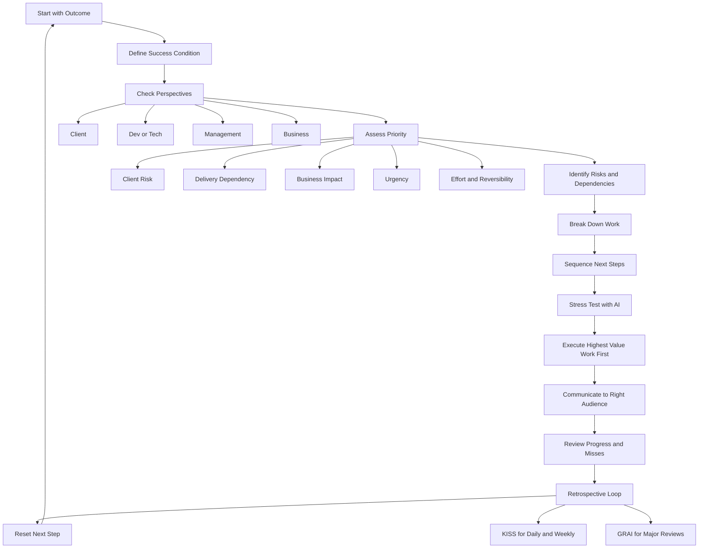

# PM Personal Operating System

This is a practical operating system for working as a PM in a lean startup where priorities shift fast, visibility is high, and judgment matters as much as output.

Use this system to:
- stay clear on the highest-value work
- manage accounts and workstreams with more ownership
- communicate better across dev, management, and clients
- use AI to stress-test thinking before others do it for you
- improve through structured daily, weekly, and major retros
- integrate AI into planning, prioritisation, communication, and review without giving away judgment

## Quick Start

Use these templates:
- Daily plan: [[02 - PM Playbook/Templates/[Template] Daily Operating Plan]]
- Weekly review: [[02 - PM Playbook/Templates/[Template] Weekly Operating Review]]
- Account tracker: [[02 - PM Playbook/Templates/[Template] Account Ownership Dashboard]]
- KISS retro: [[02 - PM Playbook/Templates/[Template] KISS Retrospective]]
- GRAI retro: [[02 - PM Playbook/Templates/[Template] GRAI Retrospective]]

## Operating Flow



## Core Mental Model

Your default mindset:
- I own clarity for my accounts and workstreams.
- I should know what matters most before others ask.
- I should think from multiple perspectives, not only my own.
- I should protect delivery and business value, not just stay busy.
- I should escalate ambiguity early.
- I should use AI to challenge weak thinking.
- I should turn every important task into a clear outcome, sequence, and next step.
- I should learn in loops, not repeat mistakes blindly.

For any meaningful work, run this loop:
1. What is the outcome?
2. How do I know it is done?
3. Why does it matter?
4. Who cares about this most?
5. What could go wrong?
6. What is the next step?
7. If this fails, why will it fail?

## Daily and Weekly Cadence

### Daily routine

#### Morning planning: 15-20 min
- review active accounts, deliverables, and deadlines
- define the top 3 outcomes for the day
- write the next action for each
- identify blockers, risks, and dependencies
- decide who needs follow-up
- run AI critique on high-stakes work
- protect time for the most important work first

#### Midday reset: 5-10 min
- check if the top work is actually moving
- re-rank if urgency or risk changed
- escalate anything unclear before it drags

#### End-of-day close: 10 min
- record what moved
- record what slipped
- note blockers and owner
- set tomorrow's first important task
- capture anything that could be forgotten
- run a short KISS retro

### Weekly routine

At the end of the week:
- review each active account or workstream
- identify top priority, current status, biggest risk, next milestone, next follow-up, and owner or dependency
- identify where time was wasted
- identify where you reacted too late
- identify where AI caught something you missed
- choose one behavior to improve next week
- run a fuller KISS retro for the week

## Priority Framework

When everything feels important, score each item from 1 to 5 across:

| Lens | Question |
|------|----------|
| Client risk | Will delay, silence, or confusion hurt trust or progress? |
| Delivery dependency | Does this unblock other work or prevent downstream delay? |
| Business impact | Does this affect revenue, adoption, or delivery confidence? |
| Urgency | Is there a real timing constraint? |
| Effort and reversibility | Is delay costly, and is the work easy or hard to reverse? |

Priority rules:
- do not start with the easiest task
- start with the task that creates the most meaningful movement or risk reduction
- if scores tie, do the item with higher unblock value, higher relationship risk, or higher irreversibility if delayed

## Escalation Rules

Escalate early when:
- blocked for more than 24 hours without progress
- no clear owner for a critical dependency
- client expectation is likely to be missed
- dev ambiguity affects scope, timeline, or quality
- management decision is needed to move forward
- tradeoff exists that you should not decide alone
- risk is growing but not yet visible to others

When escalating, always bring:
- issue
- impact
- what you checked already
- options if any
- recommendation
- next step needed

## Communication Model

### With dev or tech
Use:
- Context
- Problem
- Expected outcome
- Priority
- Ask

### With management, lead, CTO, CEO, seniors
Use:
- Outcome
- Status
- Risk
- Recommendation
- Next step

### With clients
Use:
- Current update
- Impact
- Needed action
- Next step
- Timeline

Principle:
- do not pass raw confusion
- translate issues into clear options, risks, and next steps

## AI Critique Layer

Use AI as a strict thinking partner, not a validation tool.

### AI integration model

Use AI inside the workflow at four points:
- `Clarify`: turn vague work into a clearer outcome, scope, success condition, and next step
- `Challenge`: attack weak logic, bad prioritisation, missing assumptions, and hidden risks
- `Draft`: create a first-pass brief, update, or summary that you will still own and refine
- `Review`: critique your message, plan, or retro before it goes out or gets locked in

Use AI by workflow stage:
- `Before work starts`: clarify outcome, success condition, dependencies, and what is still fuzzy
- `Before prioritising`: challenge whether this is truly high value or just loud
- `Before sending updates`: review the message for the target audience
- `When blocked`: generate options, escalation framing, likely stakeholder concerns, and the most likely failure mode
- `During retros`: run KISS or GRAI with stronger challenge and sharper takeaways

Hard rule:
- AI can help frame, challenge, draft, and review
- AI does not replace judgment, stakeholder alignment, or final ownership

Use AI when:
- the message is high-stakes
- the priority is unclear
- the plan has many dependencies
- the escalation may be politically sensitive
- the client issue has delivery risk
- the dev brief may still be ambiguous
- you feel emotionally rushed, frustrated, or too attached to one view

Use AI less or not at all when:
- the decision is already clear and low-stakes
- the work is simple enough that prompting would create overhead
- a direct stakeholder conversation is the real next step

### Standard prompts

For daily planning:

```text
Help me turn this into a sharp operating plan.
Define:
1. the outcome
2. success condition
3. dependencies
4. major risks
5. next concrete action
6. what is still unclear
If this is too vague or poorly framed, say so directly.
```

For prioritisation:

```text
Act like a startup operator with no patience for low-value work.
Tell me if this is actually important, what should be deprioritised, and what creates the most real movement.
```

For dev briefing:

```text
Review this like an impatient tech lead.
Tell me:
1. what is ambiguous
2. what context is missing
3. what assumptions dev would have to guess
4. what questions will come back immediately
Rewrite it in a clearer execution-ready format.
```

For management updates:

```text
Review this like a senior leader with limited time.
Tell me if this is too vague, too long, missing ownership, missing recommendation, or unclear on next step.
Rewrite it so the outcome, risk, recommendation, and next step are obvious.
```

For client communication:

```text
Review this from the client's perspective.
Tell me where this is confusing, too internal, or weak on expectation-setting.
Rewrite it so the update, impact, next step, and timing are clear.
```

For escalation:

```text
Help me escalate this properly.
List:
1. the issue
2. why it matters
3. what I checked already
4. realistic options
5. my recommended path
6. the next decision needed
If my escalation is weak or premature, say so.
```

For perspective-checking:

```text
Challenge this from 4 perspectives:
1. client
2. dev/tech
3. management
4. company/business
What would each side care about most, and what am I missing?
```

For failure risk:

```text
If this fucks up, why will it fuck up?
List the most likely failure points, unclear assumptions, dependency risks, and wasted-effort traps.
```

For KISS retros:

```text
Use KISS to review this day or week.
Be direct.
Tell me:
1. what to keep
2. what to improve
3. what to stop before I add more work
4. what to start next
Focus on prioritisation, stakeholder handling, and wasted effort.
```

For GRAI retros:

```text
Use GRAI to review this project or incident.
Challenge whether:
1. the original goal was weak or not SMART
2. the result gap is clear
3. my analysis is superficial
4. the root cause is real
5. the insight is actually reusable
Do not let me hide behind generic lessons.
```

### AI decision rule

Use AI by default for:
- high-stakes work
- ambiguous work
- multi-dependency work
- politically sensitive work
- repeated patterns where you want sharper learning

Do not default to AI for:
- simple obvious tasks
- decisions that only a real conversation can resolve
- low-value wording polish on low-value work

### AI misuse guardrails

- do not use AI to launder weak decisions into better wording
- do not ask AI to decide political tradeoffs for you
- do not send AI-generated drafts without review
- do not let AI create extra work that was not priority in the first place
- if stakes are high, record what you accepted from AI and what you rejected

## Retrospective System

### KISS for daily and weekly retros
Use KISS when the main question is: what should I do next?

- Keep: what worked and should be repeated
- Improve: what is directionally right but needs tuning
- Stop: what is low-value, distracting, or not working
- Start: what new action or experiment should begin next

Rules:
- use at end of day and end of week
- focus on action, not deep root-cause analysis
- consider Stop before adding more Start

### GRAI for major retros
Use GRAI when the main question is: why did this happen and what should change structurally?

- Goal: was the target actually SMART?
- Result: what happened versus target?
- Analysis: why did it happen? enumerate reasons and use 5 whys
- Insight: what reusable conclusion should change future behavior?

Use GRAI for:
- project closeouts
- quarterly reviews
- major misses
- major wins
- repeated failures that need structural change

## Failure Recovery Loop

When something slips:
1. State what slipped.
2. State why it slipped.
3. State the impact.
4. Take immediate recovery action.
5. Tell the right people.
6. Change the process so it is less likely to repeat.

Use GRAI if the failure is material, repeated, or strategic.

## Overload Protection Rules

- do not let noisy work outrank important work
- defer tasks with low impact and low risk
- say not now when work has no clear business or delivery value
- batch low-value admin work into smaller time blocks
- protect prime focus time for top-priority work
- if more than 3 major priorities appear, force ranking instead of pretending all are equal

Use this question often:

> If I do this, what more important thing am I not doing?

## Success Metrics

Track weekly:
- number of missed follow-ups
- number of blockers raised early vs late
- percentage of time spent on top 3 priorities
- number of low-value tasks that consumed meaningful time
- number of important updates sent with clear outcome, risk, and next step
- number of times AI caught a real issue before others did
- number of high-stakes tasks reviewed by AI before execution
- number of times AI improved a brief, update, or escalation
- number of times AI use created noise or overthinking
- number of tasks completed that materially moved an outcome
- number of KISS retros completed
- number of GRAI retros completed when warranted

## 30-60-90 Day Path

### First 30 days
- use the daily planning template every workday
- maintain the account dashboard
- define top 3 outcomes every day
- start using AI critique on important work
- run daily KISS and weekly KISS
- begin weekly tracking of success metrics

### Days 31-60
- improve prioritisation using the scoring rule
- escalate earlier using the escalation triggers
- adapt updates better by audience
- reduce time spent on low-value work
- review failures using the recovery loop
- run GRAI on one significant project, incident, or workstream

### Days 61-90
- make the system feel automatic
- sharpen multi-perspective thinking
- show stronger account ownership
- use AI more strategically
- review quarterly themes and tighten weak areas
- use GRAI for larger strategic review, not only when problems happen

## Use This Weekly Scorecard

- Priority judgment
- Backward planning
- Execution discipline
- Communication clarity
- Risk anticipation
- Account ownership
- AI challenge quality

## See Also

- [[02 - PM Playbook/Processes/PM E2E Workflow]]
- [[02 - PM Playbook/Templates/[Template] Daily Operating Plan]]
- [[02 - PM Playbook/Templates/[Template] Weekly Operating Review]]
- [[02 - PM Playbook/Templates/[Template] Account Ownership Dashboard]]
- [[02 - PM Playbook/Templates/[Template] KISS Retrospective]]
- [[02 - PM Playbook/Templates/[Template] GRAI Retrospective]]
