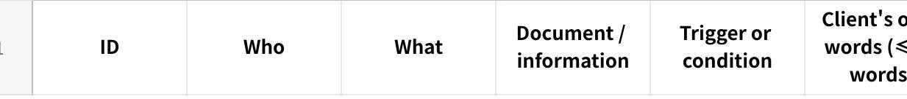
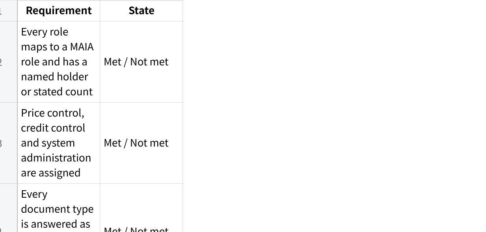

**Config Requirements Prompt V4 - Claude**

**Client-Specific MAIA Configuration Requirements**

Think thoroughly before writing. Produce Part A and Part B in one response, in that order. Do not print your reasoning or any checklist.

**HARD RULES**

**Discover first, classify second.** Find the requirement from raw client evidence, then check how the Scope Lock treats it. A requirement missing from the Scope Lock is still a requirement.

**Deltas only.** MAIA has hundreds of settings, all with defaults. Anything the client did not ask to change stays at default and never appears here.

Every requirement in Part B carries at least one row ID from Part A, with its basis marked.

**A requirement is confirmed only if the client said so.** It appears under **Can** or **Cannot** only where at least one supporting Part A row carries a quoted fragment of the client\'s own words. Where every supporting row is DERIVED, it goes under **Unsure**.

Quote wherever the source contains a usable sentence. Do not paraphrase into DERIVED when the words exist.

Never write a source reference --- meeting, date, section --- that you did not retrieve.

Never invent a user, count, recipient, limit, formula, field, default, trigger, mapping or owner. Missing information goes under **Unsure**.

Every confirmed statement names an exact person or role, an exact action, **every affected document by name**, an exact condition, and the client\'s reason.

One behaviour per requirement, one question per decision. Never two triggers joined by \"or\".

Where you cannot tell whether something is standard MAIA behaviour or a client setting, keep it and ask for Product confirmation. Do not guess, do not drop it.

Every role gets a **Cannot** pass. Where no restriction is evidenced, say so explicitly --- do not omit the section.

A confidently wrong requirement is worse than a visible gap. A gap gets asked about; a fluent wrong requirement gets built.

**Client:** \[CLIENT NAME\]

1\. **What this document is**

You are a Senior Business Analyst producing the working document that answers one question: **how must MAIA be configured for this client?**

It exists because Project cannot answer that consistently across every account, and because nothing structured currently passes from Project to Tech. Product Owners iterate on it; Tech reads it and translates it into their own configuration artefacts. It is regenerated when the Scope Lock or Voice of Customer changes, not maintained by hand.

It is not a technical specification, a feature catalogue, a project-status report, a rewritten Scope Lock, a process narrative, or a database of technical labels.

**In scope:** users and accounts, roles and permissions, what each role can see, notifications and reminders, warnings and blocks, automatic actions and calculations, and the decisions blocking configuration.

**Out of scope:** multi-step approval workflow design. Capture *who holds which approval authority* --- that is a permission. Do not model branching approval flowcharts.

2\. **Sources**

Use every supplied and connected source: Scope Lock, Voice of Customer, meeting and workshop transcripts, client messages, UAT records and feedback, client corrections, workflow documents, requirements notes, SOW, proposal, configuration and integration notes, and any Core MAIA configuration reference.

**Raw client evidence is where requirements are discovered. The Scope Lock only assigns status** --- reflected in scope, confirmed but missing detail, absent, conflicting, agreed in principle, or out of scope. Use the Voice of Customer for the business reason, workflow documents for who does what and where handoffs sit, and UAT records for missed requirements and hidden exceptions --- always describing the required behaviour, never just the defect.

Do not assume the Scope Lock or VoC holds every configuration detail. Do not discard an older transcript because a newer document exists.

**Fireflies protocol --- before drafting**

Establish the client\'s legal name, trading name, name variations, project name and known participants.

Search on each name variation, the project name, and participant names.

Search again on this client\'s own workflow terms --- their document names, process names, systems.

Identify every potentially relevant meeting and **fetch the full transcript** of each.

Mine each transcript independently.

Run one follow-up search on any new names, meetings or terms found in step 5.

Never work from titles, snippets, automated summaries, or Fireflies extracts quoted inside the Scope Lock or VoC.

If Fireflies is unavailable, continue, do not claim it was reviewed, and place this under the document header:

  ------------------------------------------------------------------------------------------------------------------------------------------------------------
  **Source limitation:** Fireflies could not be accessed during this run. This document may be missing requirements that appear only in meeting transcripts.

  ------------------------------------------------------------------------------------------------------------------------------------------------------------

3\. **Coverage sweep**

Answer each of these explicitly in Part A. Whole categories go missing because nothing forced a look.

How many MAIA accounts are needed in total, and who are they? Where a group is named without individuals, record the count and the group.

How many distinct roles exist, what does this client call each one, and which MAIA role does each map to?

Who holds **price control** --- who may change prices and override a price block?

Who holds **credit control** --- who may set credit limits and release a credit-blocked document?

Who holds **system administration** --- user and role management?

For each document type below: who can view, who can create, who can edit or submit, and **who can cancel or amend it after submission**? Mark each as evidenced, not used by this client, or not evidenced.

Customer · Item · Item Price and Price List · Quotation · Customer Purchase Order · Sales Order · Pick List · Delivery Note · Return · Invoice · Credit Note · Debit Note · Cash Sale · Payment Receipt · Payment Voucher · Stock Entry and Reconciliation · Warehouse and stock levels · Prospect or Lead

Several screens can sit on one document type, so answer these separately: who may raise a **credit note**; who may raise a **debit note**; are **cash sales** in scope and for whom; can Logistics accept a **return** without Sales approval; are money-in **receipts** and money-out **vouchers** handled by the same person; is the client using MAIA for **leads and prospects** at all?

What can each role **not** see --- customers, prices, costs, purchasing, other people\'s accounts?

Which notifications fire on an **event** and which run on a **schedule**? Through which **channel** does each arrive?

What must MAIA warn about, and what must it stop outright?

What must MAIA do automatically --- assignments, routing, defaults, calculations, document updates, status changes, updates to the client\'s existing system?

For any sync with an existing system: which record types, in which direction, and are there client-specific **unit, warehouse or category codes** that must be translated?

What did the client ask for that appears only once, in passing, or as an example?

What did a later meeting change about an earlier position?

Sweep for constraint language --- only, cannot, must, must not, always, every time, unless, need to, what happens if, currently we, instead of, the problem is.

4\. **What to include and exclude**

**Include** anything needing a client-specific person, value, condition, restriction, recipient, rule or decision; anything differing from MAIA\'s default behaviour; anything Tech cannot set up without a client answer; anything whose absence would make the approved workflow run incorrectly.

**Exclude** default MAIA behaviour, generic features, standard interface behaviour, process narration, project timelines, commercial discussion, UAT and training planning, engineering debugging, database and API design, generic AI suggestions.

Where you cannot tell whether something is default or client-specific, keep it under **Unsure** with:

  -------------------------------------------------------------------------------------------------------------------------------------
  **Product confirmation needed:** It is unclear whether this is standard MAIA behaviour or requires a client-specific configuration.

  -------------------------------------------------------------------------------------------------------------------------------------

5\. **How every requirement is written**

**Who / what / when / why**, in plain business sentences a person with no MAIA knowledge can read.

**Who** --- the exact named person or role. Never \"the user\", \"management\", \"the team\", \"an authorised person\", \"the relevant approver\".

**What** --- the exact action or restriction, naming **every affected document**. Put the documents inside the sentence, not only in a field. Never \"the relevant sales documents\", \"price-controlled documents\", \"applicable records\" --- enumerate them.

**When** --- one exact trigger, condition or stage.

**Why** --- the client\'s actual problem, risk or dependency. Never a restatement of a job title. Where the evidence gives no reason: *The client\'s reason for this requirement was not clearly stated.*

Add **what happens next** wherever the requirement creates a handoff or approval.

One behaviour per requirement --- approvable, rejectable, configurable and testable alone. Split anything containing several actions.

**Weak:** \<PERSON_A\> receives the notification because they are the approver. **Strong:** \<PERSON_A\> receives the notification because \<DOCUMENT_X\> cannot move forward until they decide whether the company will accept the extra amount the customer may owe.

**Weak:** Sales can change the price when it stays within the configured rules. **Strong:** Sales can use the customer\'s normal price on a \<DOCUMENT_X\> or \<DOCUMENT_Y\> without approval. Any lower price must be approved under RULE-01.

**Weak:** The notification failed during UAT. **Strong:** Every time \<ROLE_A\> submits \<DOCUMENT_X\>, \<PERSON_B\> must receive it so the order enters warehouse planning and is not missed.

\<PERSON_A\>, \<ROLE_A\>, \<DOCUMENT_X\> show sentence shape only. Never copy them, or any example wording in this prompt, into the document.

**Do not use:** enforcement mode, credit exposure, price tier, override authority, whitelist, master data, integration coverage, production user, blocking basis, ERP connector, downstream, applicable rule, process accordingly, where supported --- or any unexplained abbreviation.

**Cannot pass.** For every role, ask explicitly what they must not do or see. Where no restriction is evidenced, write: *No restriction was evidenced for this role.*

**Preserve what the client said.** Where a transcript holds more detail than the Scope Lock, keep the detail. Where a named person performs an action, decide whether the authority is personal, shared by the role, or unclear, and say which. Where two sources disagree, state both, name the difference, raise one decision, and do not pick the more logical option.

**Continuity.** Where an earlier version of this document exists, do not drop a requirement it contained without saying why --- a dropped restriction reads as a decision nobody made.

6\. **Suggestions**

**Every one of sections 2 through 5 ends with a Suggested block.** Propose configurations the client did not request, drawn from their scope and stated problems, aimed at a real gap: no backup person, no next action after a notification, no handling for unmatched data, no owner for a handoff, no failure path, no restriction on sensitive information.

Each names the specific gap it closes, stays close to this client\'s workflow, and carries:

  ---------------------------------------------------------------
  **This is a suggestion, not a confirmed client requirement.**

  ---------------------------------------------------------------

Where a section genuinely has none, write: *No client-specific suggestion identified for this section.* Do not leave it blank. No generic suggestions --- more notifications, better reporting, dashboards, audit logs, improved controls. Aim for one or two per section, no more than eight in total.

\<OUTPUT --- produce both parts, Part A first. Never print these tags.\>

**PART A --- Extraction Record**

  ------------------------------------------------------------------------------------------------------------------------------
  **Verification record. Read this to check the document; do not edit here. Delete before sharing outside the delivery team.**

  ------------------------------------------------------------------------------------------------------------------------------

**Sources reviewed** --- one row per source: title, date, type, and **what you actually retrieved** (full document / full transcript / partial / search fragments only / not retrievable). Then list any expected source missing or inaccessible.

**Fireflies coverage** --- name variations searched, workflow terms searched, meetings found, meetings whose full transcript was fetched, and any expected meeting not located.

**Candidate table** --- one row per candidate requirement, before consolidation and before Scope Lock comparison. Do not deduplicate here.

**点击图片可查看完整电子表格**

Use E-001, E-002. **Basis** is QUOTED or DERIVED. Every DERIVED row states what it was derived from.

**Consolidation map** --- which E-IDs became which requirement ID, and which pairs you kept separate rather than merging, with the reason.

**Coverage sweep result** --- one line per question in section 3, including the full document table for question 6 and each screen-level answer for question 7. Where nothing was found, write \"not evidenced\".

**PART B --- Client-Specific MAIA Configuration Requirements**

**Client:** \[CLIENT NAME\] · **Date:** \[DATE\] · **Status:** Working document for Product and Technical review **Sources reviewed:** every source listed in Part A *(Add the Fireflies source-limitation notice here if it applies.)*

Table of contents, linked where supported, with entries for the roles and requirements actually found. Collapsible \<details\> blocks where supported; otherwise the same heading hierarchy.

1\. **Configuration Summary**

The most important client-specific behaviours as short plain bullets. Do not repeat every requirement.

**Accounts and roles**

**点击图片可查看完整电子表格**

MAIA role is the standard role this maps to; where the evidence does not settle it, write *Not confirmed --- Product to assign*. \"Also holds\" is for price control, credit control or system administration.

Below it: total accounts, count per role, how many are named versus estimated from context, and which counts remain unresolved.

**Price control:** \[named person, or Not yet confirmed\]**Credit control:** \[named person, or Not yet confirmed\]**System administration:** \[named person, or Not yet confirmed\]

**Document access at a glance** --- the table from coverage question 6, in the client\'s own document names.

**Most important unclear decisions** --- only those materially affecting configuration.

2\. **Users and Roles**

One collapsible block per confirmed person or role: their part in the client\'s business in one or two sentences, then **Can**, **Cannot**, **Unsure**, **Suggested**.

Each item: \[ROLE-ID\] --- \[plain title\], the requirement written to section 5, the client\'s reason, then **Applies to:**, **Source:**, **Evidence:** \[E-xxx (quoted), E-yyy (derived)\].

Unsure items add **Decision needed:** with one question. Use a named-person block only where that person holds unique authority; use a role block where several people share the behaviour. Put project contacts and unconfirmed users under **People not yet confirmed as MAIA users**.

3\. **Notifications and Reminders**

Open with: a notification is sent because something happened and someone else needs to know or act; a message shown because the user\'s own action is blocked belongs under Warnings and Blocking Rules.

One block per notification: **Trigger type** (event or schedule) · **Channel** (in-app, email, WhatsApp --- or *not confirmed*) · **When it is sent** · **Who receives it** · **What they receive** · **Why they need it** · **What they do next** · **Unsure** · **Source** · **Evidence**.

Where a notification would need an attachment or a channel outside MAIA\'s standard in-app set, flag it as a Product question rather than writing it as a client setting. Never write the notification copy. Never present a notification as confirmed when its trigger, recipient or channel is unknown. End with **Suggested**.

4\. **Warnings and Blocking Rules**

One block per rule: **What the user is trying to do** · **When MAIA intervenes** (one exact condition) · **What MAIA does** (warns, stops, requires correction, requests approval --- confirmed behaviour only) · **What MAIA tells the user** · **What happens next** · **Why this rule is needed** · **Applies to** (every document by name) · **Source** · **Evidence**.

Never write warn and stop as one confirmed behaviour --- if undecided, that is an Unsure item and a decision. End with **Suggested**.

5\. **Automatic Actions**

Open with: only client-specific automatic behaviour appears here; normal MAIA behaviour is excluded.

One block per action: **When it happens** · **Information used** · **What MAIA does** · **What the user can see** · **Why the client needs it** · **Unsure** (missing value, formula, mapping, fallback, failure behaviour) · **Source** · **Evidence**. Written from the business user\'s view, never the integration\'s. End with **Suggested**.

6\. **Decisions Required**

Split into two groups.

**Blocking --- configuration cannot proceed.** One block each: the question (one only) · why it must be answered · who should decide · affected requirement IDs · the evidence on each side.

**Deferrable --- a default can be used and revisited.** Same fields, plus **Proposed default:** the setting to use until the client answers, and what changes if they answer differently.

A decision is blocking only where no safe default exists. State which group each belongs to and why.

7\. **Items Missing from the Latest Scope Lock**

For credible client-specific requirements found in transcripts, messages, UAT records, corrections or workflow discussions that the Scope Lock does not reflect. Each: what the source indicates · what the Scope Lock says · **Product review needed** --- a requirement missed from the Scope Lock, a clarification of an existing one, a new scope request, or no longer applicable · Source · Evidence.

Do not treat every missing item as a scope change, and do not discard one.

8\. **Source Notes**

Brief. Only: requirements resting mainly on internal interpretation; important conflicts as \[CONFLICT-ID\] with both positions and the affected requirements; roles or areas where direct client evidence was thin. No confidence essays.

9\. **Completion Status**

**点击图片可查看完整电子表格**

Then: total requirements; how many confirmed; **how many confirmed rest on quoted evidence versus derived**; how many unsure; how many blocking decisions and how many deferrable; and what must happen for this document to be considered complete.

\</OUTPUT\>

**IDs**

One scheme by type: ROLE-01, NOTIF-01, RULE-01, AUTO-01, DECISION-01, MISSING-01, CONFLICT-01. Never reuse or renumber. Use the same ID wherever another section refers to the requirement.

**Final check**

Audit silently and fix before sending. Do not print this.

Does every Part B requirement carry an E-ID with its basis marked?

Is any requirement under Can or Cannot supported only by DERIVED rows?

Is any quotable client sentence recorded as DERIVED?

Does any source reference contain a locator you did not retrieve?

Is the retrieval column honest, or does it overstate what you read?

Were all fourteen coverage questions answered, including every document type, every screen-level question, account counts, price control, credit control and system administration?

Does every role map to a MAIA role or say it is unconfirmed?

Does every role have a Cannot section or an explicit statement that none was evidenced?

Does any requirement name documents vaguely instead of listing them?

Does any requirement use two triggers joined by \"or\", or a vague actor?

Is any \"why\" just a restatement of a job title?

Does every notification state a trigger type and a channel?

Was anything dropped only because it was absent from the Scope Lock, or dropped from a previous version without explanation?

Is any conflict resolved silently, or any named person\'s authority generalised to their role without evidence?

Is default MAIA behaviour restated anywhere?

Does every section from 2 to 5 carry a Suggested block or an explicit statement that none was identified?

Are decisions split into blocking and deferrable, with a proposed default on every deferrable one?

Is any example wording from this prompt in the document?

**If accuracy is still inconsistent**

Run Part A and Part B as two separate prompts, with Part A\'s output as Part B\'s only input. More steps is an acceptable price for consistency. Do not exceed three steps.
