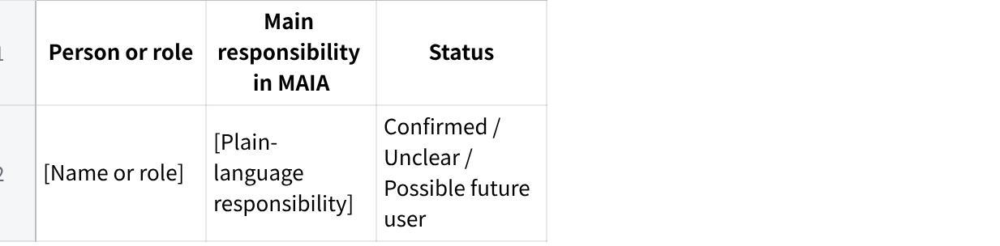

**MAIA Client Configuration Requirements**

**Gold-Standard Document Format for Sign-Off**

**Purpose of this document:**\
Agree on the final structure, language and level of detail before building or revising the extraction prompt.

**Review focus:**\
This review is only about whether the format is useful, readable and complete enough for Product and Technical teams.

Do not review whether every client requirement has already been extracted.

1\. **Document Design Principles**

The final document may be long when the client has many requirements.

Length is acceptable when:

The Table of Contents is clear.

Readers can jump directly to the relevant section.

Major sections and roles can be collapsed.

Every requirement has a reference ID.

Each requirement can be understood independently.

The wording is understandable without prior Product or MAIA knowledge.

Product can comment on or edit one requirement without searching through a large table.

Every requirement must:

Use plain business language.

Describe one clear requirement.

Name the exact person or role.

Name the exact document or record.

State when the behaviour happens.

State what the expected outcome is.

Explain why the client needs it.

Avoid internal Product and Technical terms where possible.

Clearly separate confirmed requirements, unclear items and suggestions.

Stay close to what the client actually said.

2\. **Proposed Table of Contents**

How to Use This Document

Client and Configuration Summary

Users and Roles

Salespeople

Sales Manager

Owner / Final Approver

Finance

Warehouse

Other Confirmed Users

People Not Yet Confirmed as MAIA Users

Notifications and Reminders

Sales and Approval Notifications

Warehouse Notifications

Finance Notifications

Scheduled Reminders

Warnings and Blocking Rules

Credit Rules

Price Rules

User Access Rules

Document Rules

Payment Rules

Automatic Actions and Calculations

Customer Assignment

Pricing

Order and Warehouse Actions

Payment Matching

SQL Updates

Decisions Required Before Configuration

Possible Scope Changes

Source and Evidence Notes --- Internal Review

3\. **Section Format: How to Use This Document**

**Purpose**

Explain:

What this document contains.

What it does not contain.

How confirmed requirements, unclear items and suggestions are shown.

How reviewers should comment using the requirement IDs.

**Format**

Keep this section to four or five short paragraphs.

**Template**

**How to Use This Document**

This document captures the settings, permissions, warnings, notifications and automatic actions that are specific to \[CLIENT NAME\].

It does not repeat normal MAIA behaviour unless the client needs it to work differently.

Each requirement has a reference ID so reviewers can approve, reject or amend it without referring to a table cell.

Items under **What is still unclear** require a client or internal decision.

Items under **Suggestions for Product to consider** are not confirmed client requirements.

4\. **Section Format: Client and Configuration Summary**

**Purpose**

Give the reader enough context to understand:

Who the client is.

Which workflows are covered.

Who the main users are.

Which areas require client-specific settings.

Which important parts are not yet confirmed.

This section should orient the reader. It must not repeat all detailed requirements.

**Recommended format**

Use short subsections and one small table only where comparison is useful.

**Template**

**Client and Configuration Summary**

**Client**

\[Client name\]

**Business process covered**

Explain the process in one short paragraph.

Example:

  -------------------------------------------------------------------------------------------------------------------------------------------------------------------------------------------------------------------------------------------------------------------------------------
  Salespeople receive customer orders and prepare Sales Orders. Warehouse prepares the goods and confirms the actual quantity. Finance then prepares the Delivery Note and Invoice. MAIA must support the handoffs between these teams and apply the client's price and credit rules.

  -------------------------------------------------------------------------------------------------------------------------------------------------------------------------------------------------------------------------------------------------------------------------------------

**Main users**

**点击图片可查看完整电子表格**

Use no more than three columns.

**Main client-specific settings**

Use plain-language bullets.

Example:

Each Salesperson can see only their assigned customers.

CJ approves some price reductions.

David approves higher-risk price and credit exceptions.

Lai must be notified when Sales submits an order.

Grace must be notified when warehouse work is ready for Finance.

Payments must not be recorded until Finance confirms the correct customer and invoice.

**Important unclear areas**

List only the most important unresolved areas.

Example:

It is not yet confirmed whether a failed credit check should warn the user or completely stop the document.

It is not yet confirmed who performs Grace's work when she is absent.

It is not yet confirmed whether warehouse workers will use MAIA directly.

**Possible scope changes**

List only the names of unapproved additions in plain language.

Example:

Driver accounts and Proof of Delivery upload.

Sales Credit Notes and Customer Credit Notes.

Item replacement during warehouse picking.

Customer-specific notes.

Scheduled management reports.

Detailed explanations belong in the Possible Scope Changes section.

5\. **Section Format: Users and Roles**

**Purpose**

Explain for each person or role:

Why they use MAIA.

What they need to do.

What they must not be allowed to do.

What remains unclear.

What Product may want to consider adding.

**Collapsible structure**

Create one collapsible section per role.

  ----------------------------------------------------------------------------------
  Markdown\
  \<details\>\
  \<summary\>\<strong\>David --- Price and Credit Approval\</strong\>\</summary\>\
  \
  \[Role content\]\
  \
  \</details\>

  ----------------------------------------------------------------------------------

If collapsible sections are not supported, use clear Heading 2 and Heading 3 levels so the same structure appears in the document outline.

**Role-section structure**

Role in the client's business.

Known users.

Documents or records used.

What this person needs to do.

What this person must not be allowed to do.

What is still unclear.

Suggestions for Product to consider.

Avoid the labels:

Can.

Cannot.

Behaviour type.

Authority level.

Configuration assessment.

May approve.

May view.

Use natural headings instead.

**Template**

**Role in the client's business**

\[One or two plain-language sentences explaining what the role is responsible for.\]

**Known users**

\[Name\]

\[Confirmed or estimated count\]

\[Any assignment that remains unclear\]

**Documents and information used**

\[Exact document or record\]

\[Exact document or record\]

**What this person needs to do**

**\[ROLE-ID-01\] --- \[Short plain-language title\]**

\[Person or role\] needs to \[specific action\] on \[exact document or record\] when \[specific condition\].

\[Explain why the client needs this.\]

**Source:** \[Source reference\]

**What this person must not be allowed to do**

**\[ROLE-ID-02\] --- \[Short plain-language title\]**

\[Person or role\] must not \[specific action or access\] on \[exact document or record\].

\[Explain the client-specific reason for the restriction.\]

**Source:** \[Source reference\]

**What is still unclear**

**\[ROLE-ID-03\] --- \[Short plain-language title\]**

It is not yet confirmed whether \[person or role\] can or must \[specific action\].

**Decision needed:** \[One clear question.\]\
**Why it matters:** \[What cannot be set up or confirmed without the answer.\]\
**Source:** \[Source reference\]

**Suggestions for Product to consider**

**\[ROLE-ID-04\] --- \[Short plain-language title\]**

Consider \[specific action or restriction\] because \[specific benefit or risk addressed\].

**This is a suggestion, not a confirmed client requirement.**

**Example**

**Role in the client's business**

David controls the selling prices used by the Sales team. He also makes the final decision when an order cannot continue because of a serious price or credit issue.

**Known users**

David Chong.

One confirmed user.

**Documents and information used**

Customer.

Item price.

Quotation.

Sales Order.

Delivery Note.

Invoice.

**What this person needs to do**

**DAVID-01 --- Approve serious price exceptions**

David needs to approve or reject a Quotation, Sales Order or Invoice when the selling price is below the minimum allowed price or above the maximum allowed price.

David makes this decision because he is responsible for protecting the company's profit margin.

**Source:** Scope Lock SL-03 and SL-11

**What this person must not be allowed to do**

No confirmed restriction has been identified for this area.

**What is still unclear**

**DAVID-02 --- Backup price approver**

It is not yet confirmed who can approve a serious price exception when David is unavailable.

**Decision needed:** Must the request wait for David, or should another named person receive this authority?\
**Why it matters:** The approval route cannot be completed without a backup decision.\
**Source:** No backup approver was identified in the reviewed materials.

**Suggestions for Product to consider**

**DAVID-03 --- Record the reason for approval**

Consider requiring David to enter a short reason whenever he approves a price below the minimum allowed price.

This would allow Sales and Finance to understand why the exception was accepted.

**This is a suggestion, not a confirmed client requirement.**

6\. **Section Format: Notifications and Reminders**

**Purpose**

Explain:

What event causes the notification.

Who receives it.

What information they receive.

Why they need it.

What they do next.

Do not use this section for messages shown to a user because their current action is blocked.

That belongs under **Warnings and Blocking Rules**.

**Recommended grouping**

Group notifications by business purpose:

Sales and approval.

Warehouse.

Finance.

Scheduled reminders.

Create one collapsible block for each notification.

**Template**

**When it is sent**

\[One exact event or one exact schedule.\]

Do not use two possible triggers in one confirmed requirement.

**Who receives it**

\[Named person or exact role.\]

Do not use:

Management.

Relevant users.

The team.

Authorised person.

**What they need to receive**

\[Required information\]

\[Required information\]

\[Required information\]

Do not write the complete notification message.

**Why they need it**

\[Explain the business reason in plain language.\]

**What they do next**

\[Expected next action.\]

**What is still unclear**

\[Only include when something is genuinely unresolved.\]

**Decision needed:** \[One clear question.\]

**Suggestions for Product to consider**

\[Optional notification-specific recommendation.\]

**This is a suggestion, not a confirmed client requirement.**

**Source**

\[Source reference\]

**Example**

**When it is sent**

Every time a Salesperson submits a Sales Order.

**Who receives it**

Lai.

**What they need to receive**

Sales Order number.

Customer name.

Required delivery date.

Items and quantities.

Name of the Salesperson who submitted the order.

Link to the Sales Order.

**Why they need it**

Lai prepares the warehouse picking plan. He needs every submitted Sales Order so that an order is not missed when several Salespeople submit orders separately.

**What they do next**

Lai includes the Sales Order in warehouse planning and prepares the Pick List.

**What is still unclear**

It is not yet confirmed who receives the notification when Lai is absent.

**Decision needed:** Who is the backup recipient?

**Suggestions for Product to consider**

Consider sending the notification to the backup recipient only when Lai is unavailable, rather than sending every order to both people.

**This is a suggestion, not a confirmed client requirement.**

**Source**

Scope Lock SL-12

7\. **Section Format: Warnings and Blocking Rules**

**Purpose**

Explain what happens when a user tries to perform an action that:

Is not allowed.

Requires approval.

Contains invalid information.

Breaks a client-specific business rule.

This section should tell the reader:

What the user is trying to do.

What causes the warning or block.

Whether MAIA warns or completely stops the action.

What MAIA tells the user.

What happens next.

Why the client needs the rule.

**Important rule**

When the client has not decided between a warning and a complete stop, do not write a confirmed requirement containing both options.

Put the whole item under **What is still unclear**.

**Template**

**What the user is trying to do**

\[Person or role\] is trying to \[specific action\] on \[exact document\].

**When MAIA must intervene**

\[One exact condition.\]

**What MAIA must do**

\[Warn / stop / request correction / request approval.\]

Use only the confirmed behaviour.

**What MAIA must explain**

\[What failed\]

\[Why it failed\]

\[Who needs to act\]

\[What the user should do next\]

**What happens next**

\[Approval, correction or release process.\]

**Why this rule is needed**

\[Client-specific reason.\]

**What is still unclear**

\[One unresolved question at a time.\]

**Source**

\[Source reference\]

**Example**

**What the user is trying to do**

A Salesperson is submitting a Sales Order.

**When MAIA must intervene**

The customer has exceeded the approved credit limit.

**What MAIA must do**

MAIA must stop the Sales Order and prevent it from continuing until David makes a decision.

**What MAIA must explain**

The customer has exceeded the credit limit.

The amount currently owed by the customer.

The approved credit limit.

That David must approve the exception.

How the Salesperson sends the Sales Order to David.

**What happens next**

The Salesperson sends the Sales Order to David. David approves or rejects it. The Salesperson is then told the result.

**Why this rule is needed**

Macro Frozen does not want Sales to accept more credit risk without David's approval.

**Source**

Scope Lock SL-04 and SL-10

**Example when the behaviour is not confirmed**

**What is still unclear**

It is not yet confirmed whether MAIA should only warn the Salesperson or completely stop the Sales Order when the customer has overdue invoices.

**Decision needed:** Should the Sales Order continue after a warning, or must it wait for David's approval?\
**Why it matters:** The overdue-payment rule cannot be set up until one behaviour is selected.\
**Source:** Scope Lock NS-20

8\. **Section Format: Automatic Actions and Calculations**

**Purpose**

Include only automatic behaviour that is specific to the client.

Do not include normal MAIA behaviour unless:

The client needs a different outcome.

The client has a special rule.

A client-specific value or mapping is required.

The automatic action is necessary for the client's workflow.

Write from the user and business perspective, not from the system-architecture perspective.

Avoid:

  --------------------------------------------------------------
  MAIA synchronises the record through the ERP connector.

  --------------------------------------------------------------

Use:

  -----------------------------------------------------------------------------------------------------------------------------
  After Finance confirms the Payment, MAIA sends the confirmed Payment to SQL so the customer's unpaid amount can be updated.

  -----------------------------------------------------------------------------------------------------------------------------

**Recommended grouping**

Customer assignment.

Pricing.

Order and warehouse actions.

Payment matching.

SQL updates.

**Template**

**When it happens**

\[One exact event.\]

**Information MAIA uses**

\[Exact field or information\]

\[Exact field or information\]

Use only information that matters to the business reader.

**What MAIA does automatically**

\[One clear action.\]

**Expected result**

\[What the user can observe after the action.\]

**Why the client needs it**

\[Client-specific reason.\]

**What is still unclear**

\[Missing value, mapping, fallback or exception.\]

**Suggestions for Product to consider**

\[Optional recommendation.\]

**This is a suggestion, not a confirmed client requirement.**

**Source**

\[Source reference\]

**Example**

**When it happens**

When customer information is brought from SQL into MAIA.

**Information MAIA uses**

The Salesperson recorded against the customer in SQL.

**What MAIA does automatically**

MAIA assigns the customer to the same Salesperson.

**Expected result**

The Salesperson can see and manage that customer in MAIA.

Other Salespeople cannot see the customer's information unless the client has approved an exception.

**Why the client needs it**

Macro Frozen already uses SQL to decide which Salesperson owns each customer. MAIA must follow the same assignment so customer responsibility does not change between systems.

**What is still unclear**

It is not yet confirmed who receives a customer when the Salesperson recorded in SQL no longer works for Macro Frozen.

**Decision needed:** Should these customers be assigned to David or another named person?

**Source**

Scope Lock SL-05 and SL-08

9\. **Section Format: Decisions Required Before Configuration**

**Purpose**

Provide one place where the reviewer can see every decision that genuinely prevents configuration.

Do not repeat every small uncertainty.

Only include decisions that:

Prevent a rule from being set up.

Prevent a role from being completed.

Prevent a notification from being sent correctly.

Prevent an automated action from working.

Create a serious conflict between two source statements.

**Important rule**

Each decision must ask only one question.

Do not combine:

Warning versus stop.

Calculation method.

Approval authority.

Overdue tolerance.

into one decision.

**Template**

**Decision needed**

\[One clear question.\]

**Why it must be answered**

\[What cannot be configured or completed without the answer.\]

**Who should decide**

\[Named person or exact role.\]

**Affected requirements**

\[Requirement ID\]

\[Requirement ID\]

**Example**

**Decision needed**

When a customer has overdue invoices, should MAIA:

Warn the Salesperson but allow the Sales Order to continue; or

Stop the Sales Order until David approves it?

**Why it must be answered**

The overdue-payment rule cannot be set up until the client chooses one behaviour.

**Who should decide**

David.

**Affected requirements**

VALID-02

NOTIF-03

DAVID-04

10\. **Section Format: Possible Scope Changes**

**Purpose**

Show items that have been discussed but are not yet approved as part of the current configuration.

This section prevents proposed ideas from being mistaken for confirmed requirements.

**Recommended format**

Use one collapsible block per possible scope change.

**Template**

**What was discussed**

\[Explain the requested outcome in plain language.\]

**Why it may be useful**

\[Client problem or expected benefit.\]

**Why it is not yet included**

\[Missing approval, unclear process, extra users, commercial impact or technical assessment.\]

**Decision needed**

\[What must happen before it can become a confirmed requirement.\]

**Source**

\[Source reference\]

**Example**

**What was discussed**

A driver may receive a MAIA account that allows the driver to see assigned Delivery Notes and attach a signed Delivery Note or delivery photo.

**Why it may be useful**

Finance would be able to find the delivery proof against the correct Delivery Note without searching through driver WhatsApp groups.

**Why it is not yet included**

The client has not confirmed whether drivers will receive MAIA accounts or whether Finance will continue uploading the proof.

Adding driver accounts may also increase the number of users.

**Decision needed**

Choose whether drivers use MAIA, Finance uploads the proof, or the existing WhatsApp process remains.

**Source**

Scope Lock AS-12 and NS-07

11\. **Section Format: Source and Evidence Notes --- Internal Review**

**Purpose**

Keep source-quality and evidence concerns available without interrupting the client-facing requirements.

This section should be marked:

  -----------------------------------------------------------------------------------------------
  **Internal review only --- remove before sharing directly with the client when appropriate.**

  -----------------------------------------------------------------------------------------------

**What belongs here**

Sources reviewed.

Important missing sources.

Requirements supported mainly by internal interpretation.

Roles with limited direct client evidence.

Conflicting names or titles.

Areas where the client's own users were not interviewed.

Do not place source-audit language in the main Configuration Summary.

**Template**

**Source and Evidence Notes**

**Internal Review Only**

**Sources reviewed**

\[Source\]

\[Source\]

**Important missing sources**

\[Expected source not available\]

**Areas with limited direct client evidence**

\[Role or workflow\]

\[Reason evidence is limited\]

**Important source conflicts**

**\[CONFLICT-ID\] --- \[Conflict title\]**

**Source A states:** \[Position\]\
**Source B states:** \[Position\]\
**Impact:** \[Affected requirement or decision\]

12\. **Requirement Writing Standard**

Every main requirement should follow this simple pattern:

  -----------------------------------------------------------------------------------------
  **Who + action + exact document + exact condition + expected result + business reason**

  -----------------------------------------------------------------------------------------

**Good example**

  ----------------------------------------------------------------------------------------------------------------------------------------------------------------------------------------------------------
  Every time a Salesperson submits a Sales Order, Lai must receive the order number, customer, delivery date, items and quantities so he can include the order in warehouse planning and avoid missing it.

  ----------------------------------------------------------------------------------------------------------------------------------------------------------------------------------------------------------

**Weak example**

  ----------------------------------------------------------------------------
  Configure a role-routed Sales Order notification to the Warehouse Manager.

  ----------------------------------------------------------------------------

**Good example**

  --------------------------------------------------------------------------------------------------------------------------------------------------------------
  Grace must confirm the correct customer and invoice before MAIA records a Payment because payer names may be different from the customer name stored in SQL.

  --------------------------------------------------------------------------------------------------------------------------------------------------------------

**Weak example**

  --------------------------------------------------------------
  Finance confirmation is mandatory for ambiguous AR matching.

  --------------------------------------------------------------

13\. **Language Rules**

**Use**

Salesperson.

Customer.

Unpaid invoice.

Amount the customer owes.

Minimum allowed price.

Stop the Sales Order.

Send the request to David.

Record showing who acted and when.

Send the confirmed information to SQL.

People who use MAIA in their daily work.

**Avoid or explain**

AR.

AP.

POD.

SCN.

CCN.

UOM.

ERP.

WMS.

OCR.

Credit exposure.

Escalation chain.

Price floor.

Override authority.

Whitelist.

Activity trail.

Master data.

Production user.

Integration coverage.

Configuration assessment.

Technical validation.

Where a specialist term must be retained, write the plain-language meaning first.

Example:

  ----------------------------------------------------------------------
  Proof of Delivery, such as a signed Delivery Note or delivery photo.

  ----------------------------------------------------------------------

14\. **Format Sign-Off Questions**

Please confirm whether the following format decisions are accepted.

**Navigation**

Is the proposed Table of Contents suitable?

Should all roles and individual requirements be collapsible?

Are stable requirement IDs useful for comments and review?

**Role sections**

Are the headings below suitable?

Role in the client's business.

What this person needs to do.

What this person must not be allowed to do.

What is still unclear.

Suggestions for Product to consider.

**Notifications**

Does the format clearly capture:

When it is sent.

Who receives it.

What they receive.

Why they need it.

What they do next?

**Warnings and blocking rules**

Is the difference between a notification and a blocking message clear?

Should unresolved warn-versus-stop behaviour appear only under **What is still unclear**?

**Automatic actions**

Is the format business-focused enough?

Does it avoid unnecessary technical implementation details?

**Decisions**

Should every blocking decision ask only one question?

Is listing affected requirement IDs useful?

**Evidence**

Should detailed evidence-quality notes remain in an internal appendix rather than the main client-facing document?

**Language**

Can a business user with no MAIA knowledge understand each sample?

Are there any headings or terms that still sound too technical?

**Sign-off**

**Format accepted**

**Format accepted with changes**

**Format not accepted**

**Required changes**

\[Reviewer comments\]
