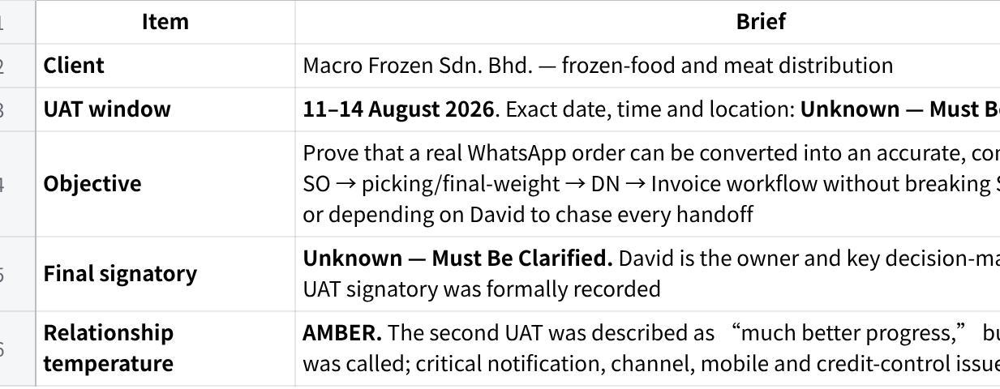
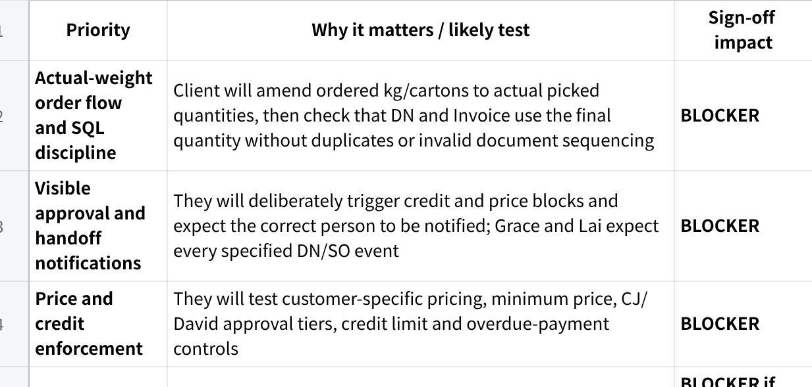
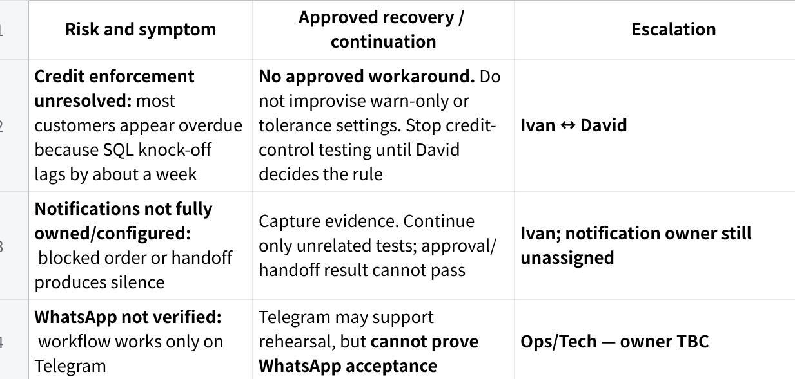
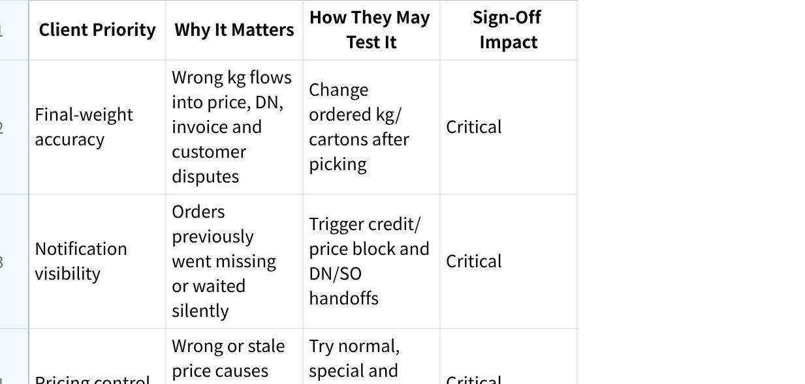
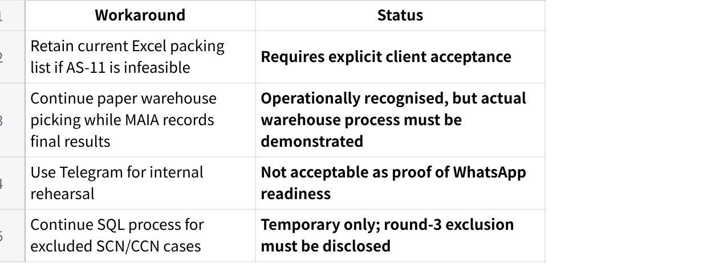
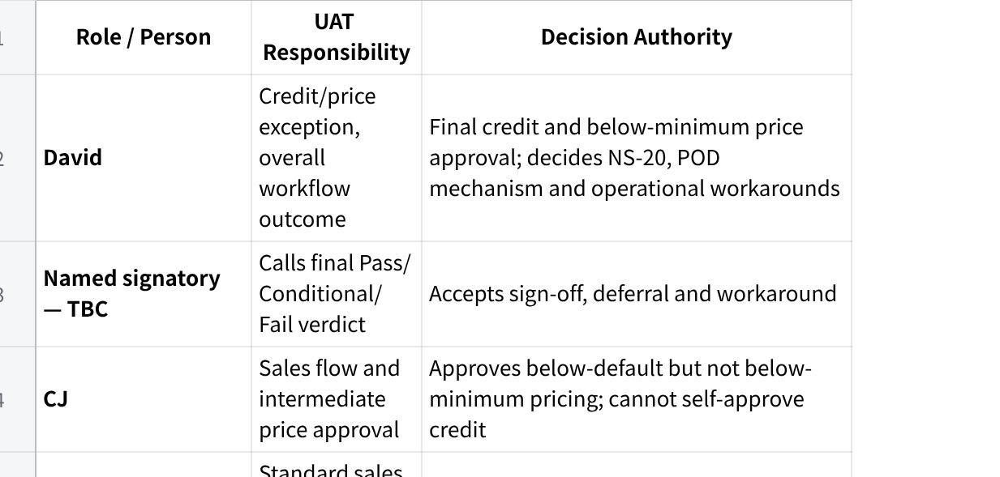
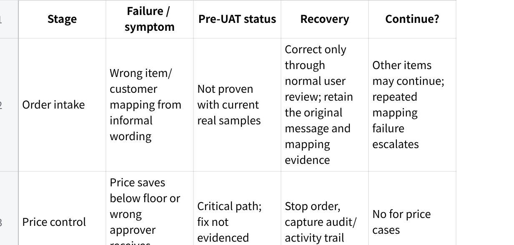
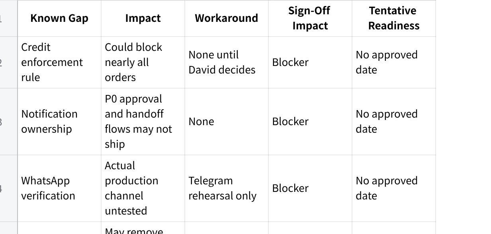
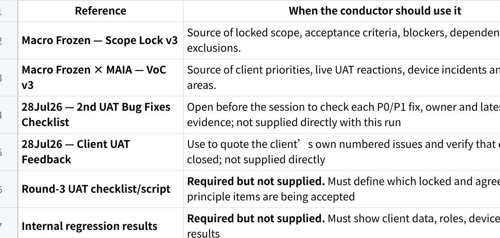

**Macro Frozen --- UAT Briefing Pack**

**Evidence cut-off:** 29 July 2026\
**Authority used:** Updated Scope Lock v3 and VoC v3. These supersede earlier versions. No post-29 July evidence was supplied showing that the listed P0/P1 fixes, integrations or channel dependencies have passed internal testing.

**PART 1 --- UAT COMMANDER BRIEF**

**Client and UAT**

**点击图片可查看完整电子表格**

**What Matters Most**

**点击图片可查看完整电子表格**

**Non-Negotiable Acceptance Criteria**

Salesperson can forward an order, review the MAIA draft SO and submit it without crossing customer-access boundaries.

Customer/item data comes from SQL-derived records and confirmed SO/DN/Invoice records follow SQL document constraints.

Final picked quantity---not initial requested quantity---drives the downstream DN and Invoice.

Normal, below-default and below-minimum prices route through the agreed approval ladder.

Credit failure visibly identifies and reaches the correct approver; the approved override is recorded.

Submitted SO, draft DN and confirmed pick-list events notify the agreed recipients.

Critical approval and order workflows work on the client's actual mobile devices.

Pick-list PDFs print required headers and Chinese item descriptions correctly.

No invalid financial value, quantity, stock movement or duplicate ERP document is created.

**Top Failure Risks**

**点击图片可查看完整电子表格**

**Known Gaps to Disclose Before Testing**

**Credit enforcement:** "The escalation flow is designed, but the day-one block rule and overdue tolerance still require David's decision. We will not demonstrate this as final until that rule is confirmed."

**WhatsApp channel:** "The previous UAT used Telegram. WhatsApp verification and channel-parity testing are still required."

**Picked breakdown:** "The proposed replacement for the Excel packing list is subject to technical feasibility and client approval of the PDF presentation. Excel remains unless both are confirmed."

**Credit notes:** "SCN/CCN connector testing, including the stock-reducing case, is not part of round-3 acceptance."

**POD:** "The Accounts-upload and driver-account approaches conflict. No POD design is final until David selects one."

**AR bank-statement workspace:** "The accelerated finance workspace has no approved readiness date."

**Do Not Promise**

Do not promise:

that all P0/P1 fixes are complete merely because their target date is 5 August;

a WhatsApp go-live date before verification and channel-parity testing;

removal of the Excel packing list before AS-11 is proven and accepted;

AR, driver/POD, catalogue or notification delivery dates not formally approved;

invoice-mirrored credit-note numbering;

volume pricing, WhatsApp blasting, route planning, WMS, AP reconciliation, QR settlement or fleet telemetry;

any credit-block tolerance or override authority not decided by David.

**Session Decision**

**NO-GO --- on the evidence currently supplied**

Critical acceptance conditions remain unresolved or unproven: credit enforcement mode, notification ownership, WhatsApp verification, ERP-access readiness, mobile approvals and named sign-off authority. Reclassify to **CONDITIONAL GO** only after the pre-UAT gates below are evidenced.

**PART 2 --- CLIENT UAT MISSION PACK**

**PAGE 1 --- CLIENT AND UAT CONTEXT**

1\. **UAT Mission**

Prove that Macro Frozen can process a real, imperfect customer order through its actual operating model:

  --------------------------------------------------------------
  Plain Text\
  WhatsApp order\
  ↓\
  Salesperson interprets and reviews draft SO\
  ↓\
  Price / credit controls and approvals\
  ↓\
  Warehouse picks using practical paper/digital workflow\
  ↓\
  Actual kg / cartons / pcs confirmed\
  ↓\
  Grace reviews and requests DN / Invoice\
  ↓\
  Documents follow SQL rules and reach the correct users

  --------------------------------------------------------------

The objective is not simply to show that MAIA can create an order. It is to prove that weight changes, approval exceptions, mobile users, warehouse handoffs and SQL document rules work together without silent failure.

2\. **Client Operating Profile**

Orders arrive mainly through informal WhatsApp text, forwarded messages, voice notes and occasional formal customer POs.

Items may be described using customer shorthand rather than exact SQL item names.

Frozen meat products are commonly ordered by kg, carton or pcs; actual box and piece weights vary.

Warehouse work remains heavily paper-based and is grouped by delivery area or driver.

SQL Accounting remains the customer, item and accounting master; MAIA is an operational layer.

Pricing currently relies heavily on WhatsApp images and human knowledge.

David is the operational coordinator, final price controller and final credit approver.

CJ, Queenie and other sales users are mobile-dependent; warehouse adoption remains weakly evidenced.

Users communicate using mixed English, Mandarin, Malay and Chinese item descriptions.

3\. **What Makes This Client Different**

The order is provisional until actual picking and weighing are complete.

One line may require a detailed breakdown such as individual boxes with different kg values.

The warehouse's priority is accountability---who picked, who checked and what quantity was confirmed.

Silence is interpreted as system failure; every blocked or handed-off item must visibly move to someone.

SQL document sequencing and stock-movement timing must not be violated.

Approvers must operate from their actual phones, not a facilitator's laptop.

4\. **Client Priority and Sensitivity Map**

**点击图片可查看完整电子表格**

5\. **Relationship and Decision Context**

**Confidence:** Amber---progress acknowledged, but the client has already encountered live defects and missing notifications.

**Repeated concerns:** silent blocks, paper/Excel replacement, actual-weight handling, mobile rendering, printed document quality and approval controls.

**David:** owner, final price and credit approver, main operational decider.

**Grace:** finance and DN/invoice handoff; receives every agreed draft-DN notification.

**Lai:** warehouse/logistics; receives every submitted SO and operates picking.

**CJ:** Sales Manager and intermediate pricing approver.

**Queenie:** standard sales-user path and pcs/UOM test user.

**Signatory:** not formally named. This must be resolved before the session.

**PAGE 2 --- WORKFLOW AND ACCEPTANCE BOUNDARIES**

1\. **Agreed End-to-End Workflow**

  ---------------------------------------------------------------------------------
  Plain Text\
  CUSTOMER\
  Sends WhatsApp order, informal text/voice or formal PO\
  ↓\
  SALESPERSON\
  Forwards directly to MAIA; reviews customer, item, UOM, price and remarks\
  ↓\
  MAIA\
  Creates draft SO using SQL-derived customer/item data\
  ↓\
  PRICE / CREDIT CONTROL\
  Normal order proceeds\
  Below standard but above minimum → CJ price approval\
  Below minimum or credit exception → David approval\
  ↓\
  WAREHOUSE / LAI\
  Receives submitted SO; warehouse picks and records actual quantities\
  Paper or agreed picking method is retained where required\
  ↓\
  MAIA\
  SO is amended to the confirmed actual quantity\
  ↓\
  GRACE\
  Receives pick/DN handoff; explicitly requests DN and Invoice\
  ↓\
  ERP INTEGRATION\
  SO/DN/Invoice follow SQL constraints and push where integration permits\
  ↓\
  FINANCE\
  Payment matching remains human-confirmed; ambiguous matches are not auto-posted

  ---------------------------------------------------------------------------------

**Retained external/manual steps:** warehouse paper handling where required; delivery-route planning; any Excel packing-list fallback accepted by the client; QR-merchant settlement; final external bank reconciliation where applicable.

2\. **Acceptance Boundaries**

**Must Pass for Sign-Off**

Direct salesperson order entry and territory isolation.

Correct SQL customer/item mapping and document sequence.

Actual quantity amendment through DN and Invoice.

Price and credit approval chains with visible notification.

Grace/Lai event notifications and activity evidence.

Mobile operation for the critical sales and approval paths.

Required pick-list/DN PDF fields, headers and Chinese characters.

No erroneous ERP records, stock movement, duplicate invoice or financial calculation.

**May Enter Hypercare**

Only after client agreement:

minor wording or layout issues that do not hide data or prevent printing;

cosmetic alignment on non-critical desktop pages;

isolated low-severity usability issues with a reliable, approved operational path;

non-blocking search/filter enhancements.

**Deferred / Future Phase**

Product catalogue: agreed in principle; exact template remains to be locked.

Driver role and mandatory POD: agreed in principle but mechanism and commercial impact open.

Expanded AR bank-statement workspace: no approved date.

Cost/buying-price workflow, quotation enhancements and contact database.

Sunday reports versus dashboard approach.

**Out of Scope**

AP or supplier reconciliation.

Merchant/QR settlement.

Full route/trip planning.

WMS, barcode or QR warehouse system.

Volume-based price tiers.

Full B2C ordering app.

Automated WhatsApp blasting.

Packing-list Excel OCR.

Facebook lead capture.

Fleet GPS and temperature telemetry.

**Manual Workarounds**

**点击图片可查看完整电子表格**

3\. **Role and Decision Map**

**点击图片可查看完整电子表格**

**PAGE 3 --- RISK, GAP AND SESSION GUIDANCE**

1\. **Failure and Recovery Map**

**点击图片可查看完整电子表格**

2\. **Known Gap and Disclosure Register**

**点击图片可查看完整电子表格**

3\. **Session Conduct Instructions**

Begin with the disclosures above; do not wait for the client to discover them.

Confirm the named signatory and the exact round-3 acceptance boundary before testing.

Let Queenie, CJ, David, Grace and Lai perform their own steps.

Use real Macro Frozen customers, items, UOMs, prices and device models.

Do not coach a user around a defect to manufacture a Pass.

Capture screenshots, PDFs, chat messages, activity logs and resulting SQL records before retrying.

Stop immediately if quantity, price, stock, credit status or ERP records are wrong.

Limit live debugging; move the issue to an evidence-backed defect and continue only independent cases.

Classify each issue as defect, configuration, data, environment, integration, permission, training, limitation, future phase, out-of-scope request or unresolved commitment.

4\. **Session Deterioration Triggers**

Pause and escalate when:

the same critical workflow fails twice;

notification or integration failure invalidates all downstream tests;

the client raises a previously committed item that the team cannot classify;

team members give contradictory answers on scope or expected behaviour;

a financial, stock, quantity or ERP record is wrong;

the conductor cannot identify the expected result or approved workaround;

more than 15 minutes is spent debugging one issue in front of the client;

the client begins testing around the system because the intended workflow is unusable.

5\. **Final Readiness Recommendation**

**NO-GO**

The supplied evidence does not prove that the non-negotiable workflows are ready on the client's configuration, channel, devices and ERP integration. A third UAT should proceed only after the hard gates below are closed and evidenced.

**Minimum gates to move to CONDITIONAL GO**

David records the credit enforcement rule in writing.

Notification-service owner is assigned and all P0 events pass internal end-to-end testing.

WhatsApp is verified and a channel-parity smoke test passes.

ERP integration access and SO/DN/Invoice push are proven.

Z Fold and iPhone approval tests pass on the named devices.

Pick-list Chinese/header printing defects pass.

AS-11 is either proven or the Excel fallback is explicitly accepted.

Exact UAT date, acceptance scope and final signatory are recorded.

**PART 3 --- SUPPORTING REFERENCES**

**点击图片可查看完整电子表格**
