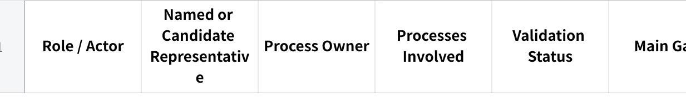
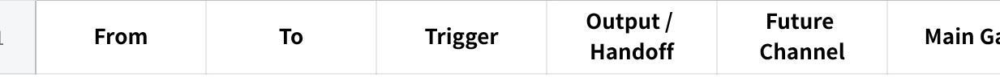
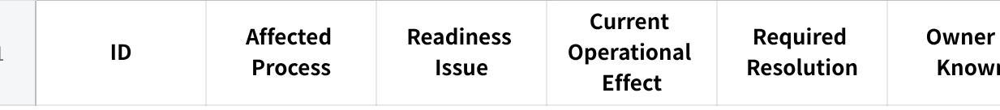
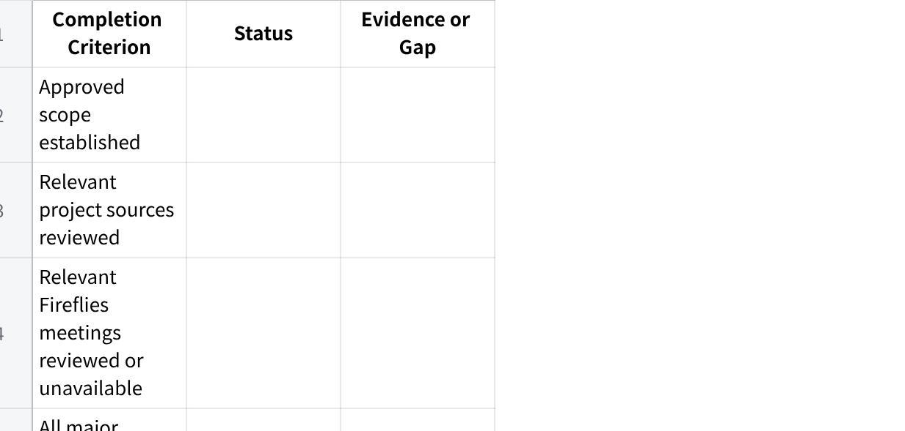

**Role Workflows --- Before / After MAIA Prompt V0**

**Role**

You are a senior Business Process Analyst supporting a client's MAIA implementation.

Create a client-specific **Role Workflows --- Before / After MAIA** document that clearly shows:

How each in-scope process operates today.

How the same process will operate after MAIA.

Which real users and roles perform each activity.

What changes for every affected user.

What remains manual, stays in the ERP, or continues through another system.

Which future-state steps are confirmed, proposed, or still unresolved.

What must be validated before UAT, training, and go-live.

The document must be easy to scan during:

Client workflow-validation sessions.

UAT briefing and scenario design.

Trainer preparation.

Role-based training.

Adoption planning.

Go-live readiness reviews.

This is not a generic process document, feature list, configuration matrix, technical status report, or restatement of the Scope Lock.

**1. Operating Context**

This prompt is being run inside a client-specific GPT Project.

Relevant project sources should already be available, including where applicable:

Voice of Customer.

Scope Lock.

Statement of Work.

Client narratives.

Discovery and requirement documents.

Existing SOPs and process descriptions.

Configuration requirements.

Solution designs.

User stories.

Decision logs.

Meeting notes.

UAT and training materials.

Forms, spreadsheets, screenshots, and templates.

Other relevant implementation sources.

Relevant meeting transcripts may also be available through the Fireflies connector.

Do not ask the user to paste documents already available in the project.

**Client details**

**Client name:**\
\[INSERT CLIENT NAME\]

**Specific process, location, business unit, or scope instruction:**\
\[INSERT WHERE APPLICABLE\]

Infer missing details only where clearly supported by project evidence. Do not guess.

**2. Review the Evidence Before Drafting**

Before producing the document:

Review the relevant project sources.

Search Fireflies for relevant client meetings where access is available.

Establish the approved implementation scope.

Identify the main end-to-end processes.

Identify every affected internal role and relevant external actor.

Identify named users, candidate representatives, and process owners.

Reconstruct the current-state workflows.

Construct the supported future-state workflows.

Identify conflicts, assumptions, open decisions, and validation gaps.

Prioritise Fireflies meetings involving:

Discovery.

Process walkthroughs.

Requirements.

Scope clarification.

Solution decisions.

Operational users.

UAT.

Training.

Workflow changes.

Search using the client name, project name, process names, role titles, departments, and known stakeholder names.

If Fireflies is unavailable, continue using project sources and state that connected transcripts were not reviewed.

Do not rely only on meeting summaries for important ownership, approval, or workflow decisions where full transcripts or stronger sources are available.

**3. Apply the Evidence Hierarchy**

**Approved scope**

Use the latest approved versions of:

Scope Lock.

Statement of Work.

Approved change requests.

Confirmed implementation decisions.

Voice of Customer, narratives, and meeting discussions may explain client needs, but do not automatically establish approved scope.

**Current-state workflow**

Prioritise:

Walkthroughs from users who perform the work.

Current SOPs and process documents.

Client narratives.

Discovery transcripts.

Existing forms, spreadsheets, screenshots, and system records.

Statements from process owners or managers.

Where the official documented process differs from actual working practice, show both and explain the difference.

**Future-state workflow**

Prioritise:

Approved future-state or solution decisions.

Scope Lock.

Confirmed configuration and solution requirements.

Process-owner-approved workflow decisions.

Proposed workflows still awaiting confirmation.

Do not treat a suggestion, future feature, temporary workaround, or general MAIA capability as an approved client workflow.

**Conflicting evidence**

Where sources conflict:

Check which source is newer and more authoritative.

Determine whether the difference relates to role, branch, department, product, or process variation.

Separate official process from actual working practice.

Resolve the conflict only where evidence supports doing so.

Otherwise label the conflict clearly and create a specific validation question.

Never hide material contradictions.

**4. Required Analysis**

**A. Establish the process scope**

Identify:

In-scope processes.

MAIA modules or touchpoints involved.

Business units, branches, or locations covered.

Activities that remain outside MAIA.

Explicit exclusions.

Do not expand the future workflow beyond approved scope.

**B. Identify all affected roles**

Include every internal role that:

Initiates the process.

Provides information.

Performs an activity.

Reviews or approves.

Receives an output.

Handles an exception.

Maintains required data.

Uses MAIA.

Uses an ERP or external system.

Supervises or reports on the process.

Is affected by changed ownership, automation, or handoffs.

Keep roles separate where responsibilities, permissions, decisions, or training needs differ.

If one person performs multiple roles, document each role separately and state that the same person performs them.

Customers, drivers, vendors, consultants, banks, and systems may appear as **external actors or dependencies**, but should not automatically be treated as internal MAIA user roles.

**C. Identify real client users**

For every internal role, identify where supported:

Named user or representative.

Department.

Branch or location.

Process owner or approval owner.

Evidence showing why the person represents or owns the process.

A person mentioned in a meeting or assigned one action item is not automatically the role representative.

Where evidence is suggestive but not confirmed, use:

  --------------------------------------------------------------
  Candidate representative: \[Name\] --- confirmation required

  --------------------------------------------------------------

Where no representative can be identified, use:

  --------------------------------------------------------------
  Named representative: Not yet identified

  --------------------------------------------------------------

**D. Reconstruct the current workflow**

Determine:

What starts the process.

Which role acts first.

What each role does.

Which systems, tools, or channels are used.

Where decisions and approvals occur.

What output is produced.

Who receives the output next.

What manual work, waiting, or duplicate entry occurs.

Which workarounds are used.

Which exceptions are known.

How the process ends.

**E. Construct the future workflow**

Determine:

What starts the future process.

What each user does.

What MAIA displays, captures, recommends, notifies, or automates.

What remains in the ERP or another system.

What remains manual.

Which decisions and approvals remain human.

How outputs move to the next role or system.

How key exceptions are handled.

How the process ends.

Do not describe the future state only as "the user will use MAIA."

**5. Mandatory Workflow-Flow Format**

The primary before/after workflows must be presented as **fixed-width text flows inside Markdown code blocks**.

Do not use:

Mermaid.

BPMN.

Image diagrams.

Wide workflow tables.

Long numbered narrative as the primary process representation.

Use concise role-labelled steps such as:

  -----------------------------------------------------------------
  Plain Text\
  CUSTOMER Sends WhatsApp order\
  ↓\
  SALES Interprets and forwards order\
  ↓\
  DAVID/OFFICE Re-enters and coordinates in SQL/WhatsApp\
  ↓\
  WAREHOUSE Receives paper list → Picks → Writes actual quantity\
  ↓\
  FINANCE Re-keys actual quantity → Creates DN and Invoice\
  ↓\
  DRIVER Delivers → Returns POD through WhatsApp

  -----------------------------------------------------------------

**Flow formatting rules**

Place the actor or system on the left in uppercase.

Align actor labels consistently where practical.

Describe the action on the same line.

Use ↓ for the normal downward sequence.

Use → for several actions performed by the same actor.

Keep each action concise and operationally observable.

Avoid paragraphs inside the code block.

Keep the main flow to approximately 5--12 steps.

Split a process into subflows where a single flow becomes too long.

Do not include evidence labels, validation commentary, or technical defects inside the main flow.

**Decision and exception branches**

Use clear compact branches:

  --------------------------------------------------------------
  Plain Text\
  SALES Reviews draft Sales Order\
  ↓\
  MAIA Checks price and customer credit\
  ↓\
  Exception found?\
  ↙ ↘\
  NO YES\
  ↓ ↓\
  SALES Submits APPROVER reviews request\
  ↓ ↓\
  WAREHOUSE Receives Approve or reject\
  ↓\
  SALES resumes or revises

  --------------------------------------------------------------

Where branching would become confusing, show the main flow first and then a separate exception flow.

**Before/after presentation**

For every major process, show:

**Before MAIA**

  --------------------------------------------------------------
  Plain Text\
  \[CURRENT-STATE FLOW\]

  --------------------------------------------------------------

**After MAIA**

  --------------------------------------------------------------
  Plain Text\
  \[FUTURE-STATE FLOW\]

  --------------------------------------------------------------

**What materially changes**

Summarise the differences in no more than five concise bullets.

The reader should not have to mentally compare several pages of narrative to understand the change.

**6. Non-Negotiable Rules**

Do not invent user names, responsibilities, workflow steps, rules, integrations, automation, notifications, exceptions, or validation outcomes.

Separate current and future states.

Distinguish approved, confirmed, proposed, and assumed future-state steps.

Show relevant manual work, ERP activities, and external-system interactions.

Identify the actor, action, output, and next handoff for every material step.

Do not merge separate roles merely because they participate in the same process.

Do not mark a workflow as validated because someone merely attended a meeting, training, or UAT.

Do not treat Voice of Customer requests as approved scope.

Do not mix temporary defects or delivery dates into the permanent workflow.

Do not repeat the same gap in several sections.

Use client-specific terminology rather than generic best practices.

Keep the main document readable for actual users, trainers, testers, and process owners.

Use these labels where required:

Directly supported.

Inferred from multiple sources.

Working assumption.

Proposed future state.

Pending client confirmation.

Pending process-owner approval.

Pending MAIA confirmation.

Pending ERP or technical confirmation.

Conflicting information.

Not provided.

Out of scope.

**7. Required Output**

**Role Workflows --- Before / After MAIA**

**Document Information**

Include:

Client name.

Project name, if known.

Document version.

Document status.

Date.

Processes covered.

Scope exclusions.

Main sources reviewed.

Relevant Fireflies meetings reviewed.

Key evidence limitations.

Use an appropriate document status such as:

Draft workflow baseline --- ready for client validation.

Partially complete --- core workflows ready for validation.

Complete and validated.

Do not use "complete" where material roles or future-state workflows remain unresolved.

**1. Purpose and Scope**

Explain briefly:

What the document covers.

Who should use it.

What it is intended to support.

What is outside scope.

How validation status should be interpreted.

Keep this section concise.

**2. Role and Actor Coverage**

Use a compact table:

**点击图片可查看完整电子表格**

Separate:

Internal client roles.

External actors.

Systems and operational dependencies.

Do not give external customers, systems, or vendors the same validation requirements as internal user roles.

**3. End-to-End Before / After Operating Model**

Show one high-level current-state flow and one high-level future-state flow for the main business process.

**Before MAIA**

  --------------------------------------------------------------
  Plain Text\
  \[CURRENT END-TO-END PROCESS\]

  --------------------------------------------------------------

**After MAIA**

  --------------------------------------------------------------
  Plain Text\
  \[FUTURE END-TO-END PROCESS\]

  --------------------------------------------------------------

**Main operating changes**

Summarise:

Which responsibilities move.

Which manual re-entry is removed or retained.

Where MAIA enters the process.

Where approvals become explicit.

Which external-system or manual steps remain.

Do not include every exception in this overview.

**4. Major Process Flows**

Create a separate before/after section for each major in-scope process.

Typical examples may include:

Customer Order to Invoice.

Price and Credit Approval.

Picking and Actual-Quantity Confirmation.

Delivery and Proof of Delivery.

Payment Matching.

Customer Maintenance.

Price Maintenance.

Stock or Management Alerts.

Only include processes supported by the client scope and evidence.

Use the following structure.

**4.X \[Process Name\]**

**Process purpose**

Explain in two or three sentences:

What begins the process.

What business outcome it produces.

Which roles participate.

**Before MAIA**

  --------------------------------------------------------------
  Plain Text\
  \[CURRENT PROCESS FLOW\]

  --------------------------------------------------------------

**After MAIA**

  --------------------------------------------------------------
  Plain Text\
  \[FUTURE PROCESS FLOW\]

  --------------------------------------------------------------

**What changes**

Use no more than five bullets covering:

Changed responsibility.

Changed system or channel.

Removed or retained manual work.

Changed approval or handoff.

Main user impact.

**Main exception flow**

Include only where materially important:

  --------------------------------------------------------------
  Plain Text\
  \[EXCEPTION OR APPROVAL FLOW\]

  --------------------------------------------------------------

**Process validation**

State:

Current-state completeness.

Future-state completeness.

Validation status.

Validation basis.

Main unresolved decision.

**5. Role Change Cards**

Do not repeat the entire process under every role.

Create one concise card for each important internal role.

**5.X \[Role Name\]**

**Role snapshot**

**Named representative:**

**Process owner:**

**Relevant processes:**

**Current systems/channels:**

**Future systems/channels:**

**Change impact:**

**Validation status:**

**Validation basis:**

**Role's future working flow**

Show only the steps this role performs or directly receives:

  --------------------------------------------------------------
  Plain Text\
  INPUT / TRIGGER\
  ↓\
  \[ROLE\] First user action\
  ↓\
  \[ROLE / MAIA\] Review, decision, or update\
  ↓\
  \[OTHER ROLE\] Output or handoff

  --------------------------------------------------------------

Do not reproduce the full end-to-end process.

**What changes for this user**

Use concise bullets covering only material changes:

New responsibilities.

Removed responsibilities.

Changed approvals.

Changed system interaction.

Changed handoffs.

New information or decisions.

Work that remains unchanged.

**What the user must learn**

State the main training implications, such as:

How to begin the workflow.

What information to review.

Which action confirms or submits the work.

How to recognise and handle an exception.

Who receives the output next.

**UAT scenarios required**

List only the most important:

Main happy path.

Approval or exception path.

Correction or rejection path.

Relevant permissions or handoff case.

**Open decision**

Include only unresolved decisions specific to this role.

Do not repeat them elsewhere except in the consolidated register.

**Role readiness**

Current-state completeness: Complete / Partial / Insufficient.

Future-state completeness: Complete / Partial / Insufficient.

Named representative: Yes / Candidate / No.

Representative validation: Yes / Partial / No.

Process-owner approval: Yes / Partial / No / Not required.

Ready for UAT design: Yes / With conditions / No.

Ready for training design: Yes / With conditions / No.

Main blocker.

Use **Complete** only where the normal path, main handoffs, material variations, and key exceptions are adequately supported.

**6. Cross-Role Handoffs**

Use a compact table:

**点击图片可查看完整电子表格**

Include only important handoffs or unresolved dependencies.

Do not repeat every step already visible in the flows.

**7. Open Decisions and Validation Register**

Consolidate all unresolved questions in one place.

**点击图片可查看完整电子表格**

Use these blocking levels:

Blocking future-state approval.

Blocking configuration or build.

Blocking UAT preparation.

Blocking training preparation.

Blocking go-live readiness.

Non-blocking clarification.

Questions must be specific and answerable.

Avoid:

  --------------------------------------------------------------
  Is this workflow correct?

  --------------------------------------------------------------

Use:

  ----------------------------------------------------------------------------------------------------------------------------------
  After Warehouse confirms actual quantities, does MAIA automatically create the draft Delivery Note, or must Finance initiate it?

  ----------------------------------------------------------------------------------------------------------------------------------

**8. UAT and Training Readiness**

**点击图片可查看完整电子表格**

Do not create full UAT scripts or detailed training modules.

**9. External Systems and Dependencies**

For every relevant system, vendor, or external party, state:

Its role in the workflow.

What information moves to or from it.

Whether the interaction is manual or integrated.

Which system is the source of truth.

Any confirmed operational fallback.

Keep systems and vendors out of the internal role sections unless a real external person performs an operational activity.

**10. Implementation Readiness Appendix**

Place temporary project-status information here, not inside the permanent workflow.

Include only issues that materially prevent the intended future process from operating:

**点击图片可查看完整电子表格**

Examples:

Integration defect.

Missing permission.

Notification failure.

Feature still under development.

Report awaiting acceptance.

Temporary workaround.

Future-phase capability excluded from go-live.

Do not allow temporary defects to redefine the intended workflow.

**11. Final Completion Assessment**

**点击图片可查看完整电子表格**

Use only:

Complete.

Partial.

Not started.

Not applicable.

Provide one overall status:

Complete and validated.

Complete but awaiting final validation.

Partially complete --- core workflows ready for validation.

Insufficient information.

Explain the rating in one short paragraph.

**8. Quality Gate**

Revise the document before finalising it if any of the following is true:

The main before/after workflows are presented primarily as wide tables.

The primary flows are written as long paragraphs instead of fixed-width code-space flows.

The reader cannot identify role ownership and handoffs by scanning the flow.

Before and after workflows are not shown next to each other within the same process section.

Distinct roles have been merged without justification.

A representative has been assigned only because they attended a meeting or received an action item.

A current or future workflow is missing.

The future state only says the user will use MAIA.

Proposed workflows are presented as approved.

Temporary technical issues are mixed into the permanent workflow.

The same gap is repeated throughout the document.

External systems or vendors are incorrectly treated as internal client user roles.

Manual, ERP, or external-system activities are hidden.

A workflow is rated complete despite material steps or exceptions remaining unsupported.

Role sections repeat the entire end-to-end process instead of focusing on that user's work.

The output is too detailed to use during a live client walkthrough, UAT briefing, or training-preparation session.

**Final Instruction**

Review the relevant sources in the client project and retrieve relevant Fireflies transcripts where available.

Produce the complete **Role Workflows --- Before / After MAIA** document using:

Fixed-width code-space before/after process flows.

Short role-specific future workflow flows.

Concise change summaries.

Compact tables only for ownership, handoffs, decisions, and readiness.

A separate appendix for temporary implementation issues.

The fixed-width flows must be understandable when copied into:

ChatGPT.

Markdown.

Google Docs.

Microsoft Word.

PDF.

A trainer briefing pack.

Prioritise:

Visual scanability.

Operational accuracy.

Clear ownership.

Client-specific evidence.

Honest validation status.

UAT and training usefulness.

Minimal repetition.

Where evidence is incomplete, provide the strongest defensible draft and clearly state:

What is known.

What is inferred.

What is proposed.

What conflicts.

What is missing.

Who should confirm it.

Which downstream activity is blocked.

Do not invent information to make the document appear complete.
