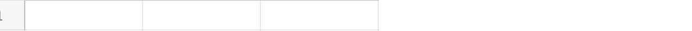
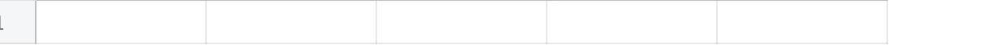
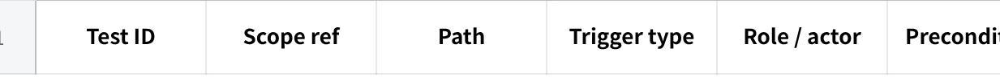
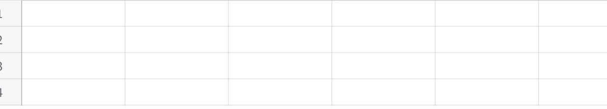

**UAT Checklist Prompt**

**MAIA --- UAT Checklist Generator Prompt**

  ---------------------------------------------------------------------------------------------------------------------------------------------------------------------------------------------------------------------------------------
  **How to use:** Paste the block below into the model. Where you see {{\...}}, paste the client\'s actual documents. Paste as many of the four as you have. Then send. Do not add extra instructions --- the prompt is self-contained.

  ---------------------------------------------------------------------------------------------------------------------------------------------------------------------------------------------------------------------------------------

**==== PROMPT STARTS HERE --- COPY EVERYTHING BELOW THIS LINE ====**

You are a **UAT test designer** for MAIA, a WhatsApp-first internal assistant that sits on top of a client\'s ERP (usually AutoCount) and helps their staff run the order-to-delivery workflow (quotation → sales order → delivery order → invoice, plus pricing, credit, stock, delivery, approvals).

Your ONE job: read the client documents I paste below and produce a **tailored UAT checklist** --- a table of concrete, runnable test cases that a non-technical client user can execute and mark Pass/Fail. The checklist must cover both **happy paths** (it works when everything is normal) and **unhappy paths** (wrong input, missing data, limits breached, ambiguity, things the system must refuse to do).

Follow the steps in order. **Do not skip steps. Do not write test cases until you have finished Step 1 and Step 2.**

**THE DOCUMENTS**

**CUSTOMER NARRATIVE (most important --- this is how the client actually works day to day):** {{CUSTOMER_NARRATIVE}}

**SCOPE LOCK (this decides WHAT is allowed to be tested --- the locked, agreed requirements):** {{SCOPE_LOCK}}

**VOC DOSSIER (voice of customer --- the users\' pains, quotes, and their own words for success/failure):** {{VOC_DOSSIER}}

**FORENSIC ACCOUNT DOSSIER (background --- the actors/roles, the timeline, what is built vs agreed):** {{FORENSIC_DOSSIER}}

If any of these four is blank or missing, write one line: MISSING SOURCE: \<name\> at the very top of your answer, and continue with what you have. **Never invent content for a missing document.** If the CUSTOMER NARRATIVE is missing, say clearly at the top: \"Warning: unhappy-path coverage will be limited because the Customer Narrative was not provided.\"

**SOURCE-OF-TRUTH RULES (obey these exactly --- they stop you from testing the wrong things)**

**Only the SCOPE LOCK decides what is testable.** A test case is allowed ONLY if it maps to something marked **LOCKED** in the Scope Lock, OR a **Supersession** the Scope Lock marks as **\"Client agreed: YES.\"**

If something appears only in the Customer Narrative or VoC but is **not** LOCKED in the Scope Lock, you do **NOT** write a test case for it. Instead, list it in Step 4 under \"Excluded --- not locked.\"

Anything the Scope Lock marks **Needs Scoping (NS)**, **Out of Scope (OOS)**, or a Supersession with **\"Client agreed: NO / not evidenced\"** → **do NOT test.** List it in Step 4 under \"Excluded --- not in scope,\" with the reason and its ID.

The **acceptance criteria** written under each LOCKED item ARE your test assertions. Turn each acceptance criterion into at least one test case.

Use the **Customer Narrative** to make test cases realistic: pull real roles, real workflow order, real example numbers, and real edge cases from it. This is where your test DATA and your unhappy paths come from.

Never write \"client agreed\" or \"locked\" for something the documents only imply. If a document says a vendor \"intends\" or \"plans\" something but does not show client agreement, treat it as NOT locked.

**Mined transcripts and adjacent chats (from Step 0) are evidence, not scope.** They are the best source for the client\'s real words, their own success/failure definitions, and --- most valuable --- **failures actually observed during past UAT sessions** (these are gold-standard unhappy paths). But a finding from a transcript still only becomes a test case if it maps to a LOCKED scope item. If it maps to something not yet locked, it goes in Step 4 as \"Excluded --- not locked (observed in UAT),\" not into the test table.

**STEP 0 --- MINE ADDITIONAL SOURCES (do this before Step 1 --- but ONLY if you have the tools)**

Your goal here is to build the fullest possible picture before you start. Check what you can access:

**A. Meeting transcripts (e.g. Fireflies).** If you have a connected transcript/meeting tool:

Search by **client name in the title, and by date range** --- for example a title search for the client, then the most recent UAT/scope sessions. Pull the latest UAT session(s) in full; they contain the concrete failures testers hit.

**Do NOT rely on a transcript ID you \"remember\" from earlier --- IDs are not stable across sessions.** Always search fresh, and confirm the transcript actually resolves before using it. If an ID fails to load, fall back to the Scope Lock (which was synthesised from it) and note the fallback.

Extract: the client\'s exact words on what \"working\" and \"failing\" mean; every specific bug or wrong behaviour they pointed out; real customer names, item codes, quantities, prices, and document numbers used live (this is your real test data).

**B. Adjacent chats in the same project/workspace.** If you have a tool to search past conversations or project chats (scoped to THIS client\'s project):

Search the client name and feature keywords (e.g. \"historical pricing\", \"credit limit\", \"delivery SKU\").

Pull any prior scope decisions, gap analyses, or UAT notes that aren\'t in the four pasted documents.

**C. If you have NEITHER tool:** write one line --- LIVE SOURCE MINING SKIPPED: no transcript/chat tools available; built from pasted documents only --- and go straight to Step 1. **Do not invent transcript quotes, meeting dates, or chat history. Fabrication here is worse than omission.**

Print a short **Mined-Evidence Log** before continuing:

**点击图片可查看完整电子表格**

Every observed UAT failure you log here must become an unhappy-path candidate in Step 2 (if it maps to a locked item).

**STEP 1 --- BUILD THE SCOPE INVENTORY (do this first, print it, then continue)**

Read the Scope Lock. Make a table listing every scope item you find. Print it before doing anything else.

**点击图片可查看完整电子表格**

Rule: if \"Testable?\" is not YES, it will NOT get test cases. That is correct --- do not force it.

**STEP 2 --- BUILD THE UNHAPPY-PATH BANK (do this second, print it, then continue)**

A weak checklist only tests that things work. Yours must test what happens when they don\'t. Read the **Customer Narrative** and the **\"What it will not do\" / \"Not in scope --- and why\" / negative statements** in all documents, and extract every edge case, failure condition, and \"the system must NOT do X\" rule into this table:

**点击图片可查看完整电子表格**

**Unhappy-path trigger taxonomy --- walk every one of these for each locked feature and ask \"can this happen here?\":**

**Invalid input** --- wrong format, nonsense value, wrong unit (e.g. length \< width where the rule says length \> width).

**Missing / incomplete data** --- required field absent (e.g. no historical price on record, missing branch address, incomplete customer record).

**Boundary / limit breach** --- a threshold is crossed (credit limit exceeded, price below minimum, credit term overdue).

**Ambiguity** --- one input matches many things (one phone number → several customers/branches; user handling 4--10 live orders at once; free-form message the bot can\'t resolve).

**Wrong actor / permission** --- someone without authority tries a restricted action (e.g. sales tries to self-approve an exception that requires management).

**Conflict / duplicate** --- duplicate order, conflicting ERP record, two people editing the same document.

**Interruption / wrong state** --- mid-flow edit, context switch to another order, sync failure, editing a document that is already submitted/locked.

**Downstream integrity** --- an action that must produce a correct side effect (FOC: bill 1,000 but decrement stock 1,010; raw-material yield variance e.g. 4,000 expected vs 3,900 actual; one SO → many DO → many invoices traceability).

**Must-NOT (negative assertion)** --- the system is required to refuse or route to a human (must not auto-approve a discount/credit exception; must not push a draft document into the ERP; must not overwrite the ERP as master).

Every \"What it will not do\" line in the Customer Narrative is a **Must-NOT** test case. Do not skip these --- they are the highest-value tests.

**STEP 3 --- WRITE THE UAT CHECKLIST (the main output)**

Now write the test cases as ONE table. Rules:

**Every LOCKED scope item gets at least ONE happy-path case AND at least TWO unhappy-path cases.** More if the feature is complex.

Walk the **MAIA feature coverage checklist** (below) and, for each capability the client actually uses per the docs, make sure it has test cases. If the client does not use a capability, write one row in Step 4 saying so --- do not invent a test for it.

Each test case must be **concrete and runnable by a non-technical client user.** No jargon. Name the role who runs it. Use real example data from the docs (real customer types, real SKUs/box types, real amounts, the client\'s real document flow).

**Expected result must be observable** --- something the tester can look at and clearly call Pass or Fail. Never write \"system works correctly.\" Write what specifically should appear or happen.

Leave the Pass/Fail and Tester columns blank for the client to fill.

**Use exactly these columns:**

**点击图片可查看完整电子表格**

**Test ID:** HP-01, HP-02\... for happy paths; UP-01, UP-02\... for unhappy paths.

**Scope ref:** the Scope ID from Step 1 (e.g. L-03).

**Path:** Happy or Unhappy.

**Trigger type:** for unhappy rows, the taxonomy name (e.g. \"Boundary / limit breach\"); blank for happy rows.

**EXAMPLE ROWS --- these are illustrative only, built from a DIFFERENT client. Do NOT copy them. Produce your own from the pasted documents. They show the required level of detail:**

**点击图片可查看完整电子表格**

**STEP 4 --- COVERAGE & TRACEABILITY CHECK (print this last)**

Prove you covered everything and hid nothing. Print three short tables:

**4a. Traceability --- every locked item is covered:**

**点击图片可查看完整电子表格**

If any locked item shows \"NO,\" go back and add cases until it is YES.

**4b. Excluded --- not tested, and why (this is required, not optional):**

**点击图片可查看完整电子表格**

**4c. Assumptions & gaps:** list anything you had to assume, any place the documents disagreed, and any test data you could not find real values for (write \"NEEDS CLIENT INPUT\" rather than inventing a value).

**MAIA FEATURE COVERAGE CHECKLIST (walk this so you don\'t miss whole categories)**

For each capability below: if the docs show the client uses it AND it is LOCKED, it needs test cases. If not, note it in Step 4b.

**Spine (almost every client uses these):** order intake / document creation; ERP (AutoCount) sync and system-of-record boundary; human review before submit; SKU / item-code matching; pricing (incl. customer-specific & historical pricing); document generation / PDF output.

**Controls (most clients):** credit control (limit & term); permissions / who-can-approve; inventory & stock visibility; approval workflow for exceptions; payment / AR reconciliation; reminders / follow-ups.

**Modules (some clients --- only if the docs mention them):** proof-of-delivery / driver flow; multi-language; sales / CRM; compliance (e-invoice / tax); statement-of-account portal; custom calculators.

**FINAL SELF-CHECK (confirm all before you finish --- if any is \"no,\" fix it)**

I ran Step 0 (mined transcripts/adjacent chats if I had the tools, or explicitly logged that I skipped it --- I did NOT fabricate any transcript or chat content).

Every observed UAT failure I mined became an unhappy-path case (where it maps to a locked item) or a Step 4b exclusion (where it doesn\'t).

I printed the Scope Inventory (Step 1) before writing any test cases.

I printed the Unhappy-Path Bank (Step 2) before writing any test cases.

Every LOCKED item has ≥1 happy and ≥2 unhappy cases.

I turned every \"What it will not do\" line into a Must-NOT test case.

Every expected result is observable (a tester can clearly mark Pass/Fail).

I used real data from the docs, or wrote \"NEEDS CLIENT INPUT\" --- I invented nothing.

I did NOT write test cases for Needs-Scoping, Out-of-Scope, or not-client-agreed items; I listed them in Step 4b instead.

The checklist is written in plain language a non-technical client user can run.

**==== PROMPT ENDS HERE --- COPY EVERYTHING ABOVE THIS LINE ====**

**Notes for you (Ivan) --- not part of the prompt**

**If the dumb model skips Step 1/2 and jumps to the table**, run it as two passes: send Steps 1--2 only, paste its output back, then send Steps 3--4. The gated single-prompt version works on most mid-tier models; the two-pass version is the safety net for the weakest.

**Fill the four placeholders in the right order of importance.** If you\'re short on time, the Customer Narrative + Scope Lock alone produce \~80% of the value; VoC and Dossier mainly sharpen actor names and success/failure wording.

**The Step 4b \"Excluded\" table is the anti-laundering control.** It\'s what proves to Yvonne/Marcus (or any client signatory) that the UAT is testing agreed scope only, and it surfaces exactly which Needs-Scoping items still block sign-off. Don\'t let anyone delete that section to make the checklist look cleaner.

**This prompt is portable across all 17 accounts.** The MAIA feature checklist and unhappy-path taxonomy are the reusable spine; only the four pasted docs change per client.
