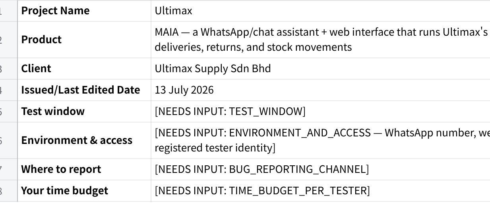
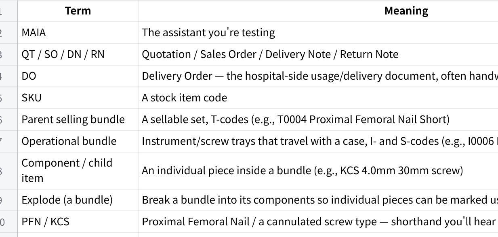
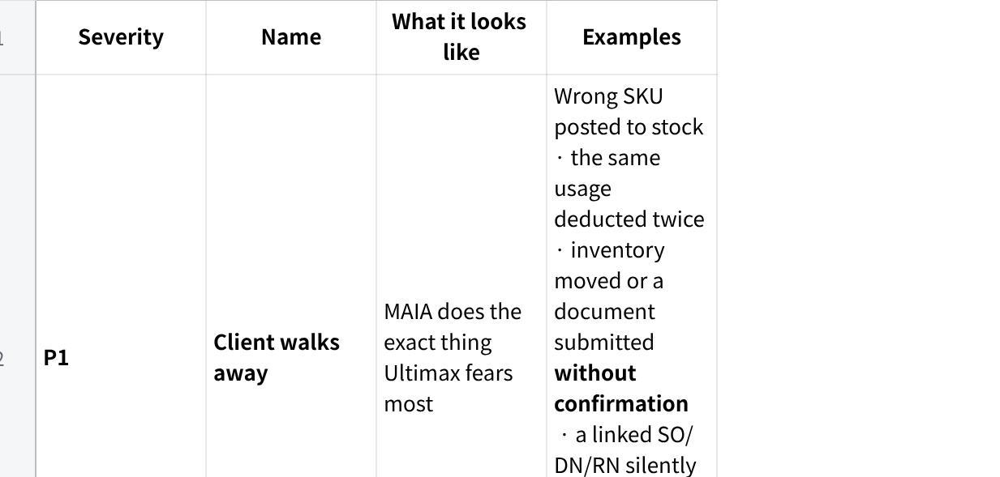
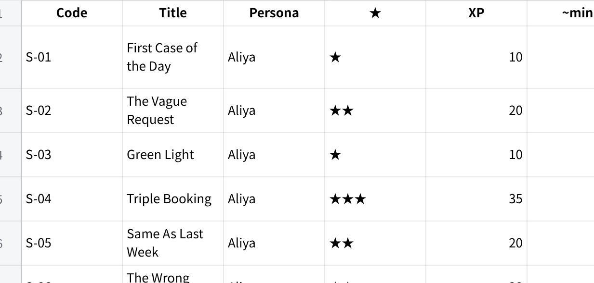
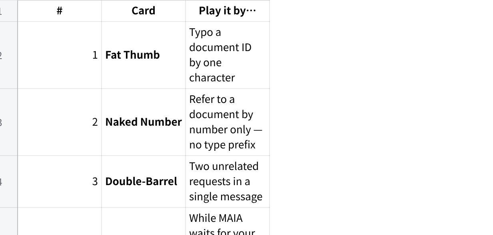
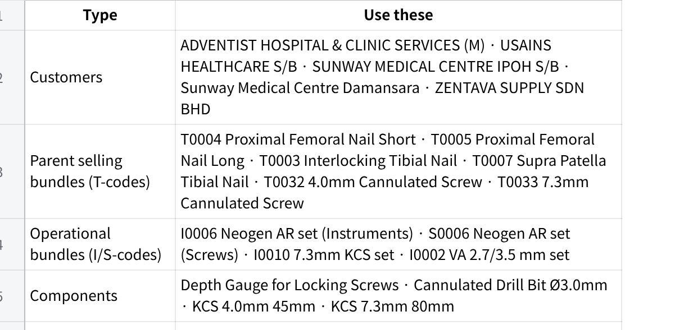
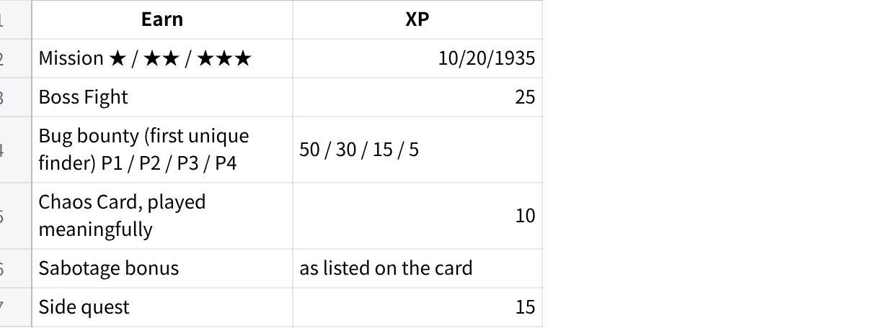
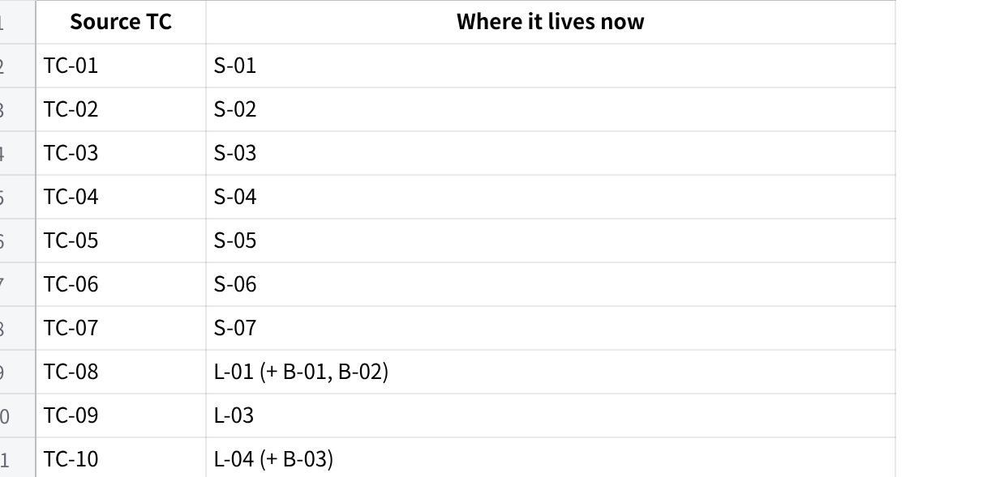
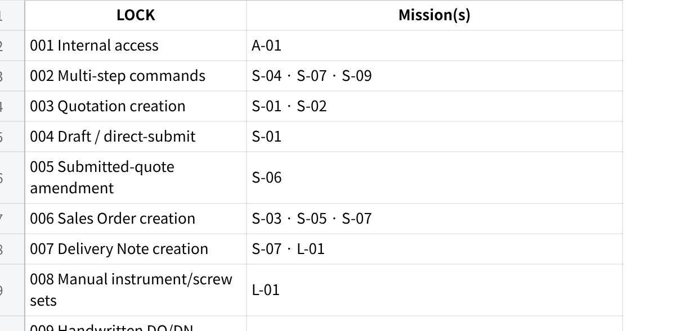

**\[EXAMPLE\] Ultimax Testers InfoPack**

*Project: MAIA --- Ultimax Internal Sales, Inventory & Stock Movement Assistant · Client: Ultimax Supply Sdn Bhd*

**PART A --- READ BEFORE YOU PLAY**

*(\~15--20 minutes. Read all of Part A once. Part B is your mission deck --- use it during play.)*

1\. **Logistics**

**点击图片可查看完整电子表格**

1\. **How to Play**

**You are a person, not a script.** Pick a persona from Section 5. Stay in character for the whole session.

**Type in your own words.** Typos, shorthand, rojak, one-thumb WhatsApp grammar --- all encouraged. **Never copy-paste the sample phrasings** in the mission cards. They show you the register; you supply the words.

**React like your persona.** When MAIA asks you something, answer the way a busy rep or warehouse checker would: brief, sometimes vague, occasionally mid-drive.

**Break things on purpose.** Every mission has a Sabotage bonus and Poke prompts. Curiosity scores points.

**Out of bounds ≠ bug.** Check the map in Section 4 before you log. If a missing thing genuinely confused you in character, log it as an **Observation** --- useful, but not a bug.

**No loot, no glory.** Screenshot every confirmation step and write down every document number MAIA gives you. Evidence or it didn\'t happen.

**Scoring, in one breath:** missions earn XP by difficulty; bugs earn a bounty by severity (P1 = 50 down to P4 = 5, first unique finder gets it); Chaos Cards and Sabotage plays add bonuses; badges go to the stylish. Full table in the Field Manual (Section 11).

2\. **The World in Five Minutes**

Ultimax Supply is a Malaysian medical device distributor. They sell orthopaedic trauma hardware --- femoral nails, tibial nails, cannulated screws, plates --- plus the instrument sets and screw trays surgeons need to put them in. Their customers are hospitals: Adventist, Sunway (more than one branch --- careful), USAINS, and others.

The rhythm of their week is set by surgeries. A hospital calls or WhatsApps a rep: *Dr Tan has a case tomorrow morning, send the short PFN set, deliver before 8am.* The rep quotes it --- often the same day, often from the car. Quote approved, it becomes an order. The set gets delivered to the hospital. Surgery happens. Then the messy part: the set comes back, and someone has to work out what the surgeon actually used, what returned unused, and what went missing --- usually from a handwritten note or a photographed delivery document.

Stock is everywhere. Some sits in the HQ warehouse. Some sits on hospital shelves (consignment-style). Some rides around in a sales rep\'s car. Every used screw has to be deducted from the right place, and every returned item put back in the right place.

Until now, they ran this on Excel plus WhatsApp photos plus manual typing. It was tedious --- but it was *theirs*, and it was under control. That\'s the bar MAIA has to beat: **faster and more trustworthy than their Excel workflow**, not just fancier.

Their three biggest fears, in their own terms:

**Wrong stock movement.** A wrong SKU deducted, or the same usage deducted twice.

**Silent changes.** A document or stock level changing somewhere they didn\'t see, with no confirmation and no trail.

**Slower than before.** Long back-and-forth, retyping usage lists, being forced through rigid steps. If MAIA is slower than Excel, they will simply stop using it.

They did **not** buy a chatty AI toy. They bought a fast, safe operational control layer. When you test, you are guarding their trust.

3\. **The Product Map**

**What MAIA is (this phase):** an internal assistant for registered Ultimax staff, reached through WhatsApp/chat and a web interface. It creates and manages the document chain, moves stock between locations, reads uploaded delivery documents (including handwritten ones), and shows inventory dashboards.

**The document chain:**

  ---------------------------------------------------------------------------------------------------------------------------
  **Quotation (QT)** → **Sales Order (SO)** → **Delivery Note (DN)** → **Return Note (RN)** → stock movements & corrections

  ---------------------------------------------------------------------------------------------------------------------------

Quotes carry the case details (patient, IC, surgeon, operation date) in remarks. Orders lock the deal in. Delivery Notes move stock out. Return Notes bring back what surgery didn\'t use. Anything wrong gets fixed with a **reverse DN / stock correction** --- with a reason --- not a delete button.

**The golden rules of MAIA** (if you see one broken, that\'s a serious bug):

**Nothing touches inventory without your confirmation.** Stock movements, DN submissions, corrections, extracted documents --- all of it waits for you.

**It asks when it matters, and only when it matters.** Ambiguous customer, ambiguous item, risky action → it must ask. Routine steps → it must not nag.

**No silent edits to linked documents.** Changing a submitted quotation never quietly rewrites the SO, DN, RN, or stock behind it.

**Extraction is draft-first.** Anything MAIA reads from a photo or handwritten document becomes a draft for your review --- never an automatic posting.

**Glossary** (everything a newcomer will meet):

**点击图片可查看完整电子表格**

4\. **In Bounds / Out of Bounds**

**IN BOUNDS --- things you can expect MAIA to do:**

Let registered internal users in; block everyone else (LOCK-001)

Understand natural, multi-step, mixed-language instructions and execute them in order, confirming only the risky steps (LOCK-002)

Create quotations --- for customers, leads, and prospects --- with patient/IC/surgeon/op-date remarks, item name overrides, draft **or** direct-submit (LOCK-003, LOCK-004)

Amend submitted quotations safely: check downstream links, explain impact, confirm first, never silently touch linked documents (LOCK-005)

Create Sales Orders/Bookings from quotes or instructions, without duplicating (LOCK-006)

Create Delivery Notes from SOs, drafts, uploads, or dispatch instructions (LOCK-007)

Let you **manually** add instrument/screw sets --- never auto-add them (LOCK-008)

Read uploaded handwritten DO/DN/photos, extract customer/items/quantities, and hold everything as a reviewable draft (LOCK-009)

Take usage reports your way: used-only, returned-only, net usage, received-back, or a correction instruction (LOCK-010)

Explode only the bundle you name, showing components (LOCK-012)

Track stock across HQ, hospital/third-party locations, and rep/car custody, with named locations and source→destination records (LOCK-013, LOCK-014, LOCK-015)

Show inventory dashboards: stock view (actual/available/reserved/projected/safety), ledger, ageing, movements (LOCK-016)

Find items from abbreviations and shorthand, defaulting to sellable finished goods in sales contexts, with override (LOCK-017)

Export SO and DN listings as CSV for manual invoicing in AutoCount (LOCK-018)

Never block you on credit limit (LOCK-019)

Fix inventory mistakes through reverse DN / stock correction with a mandatory reason --- not casual cancellation (LOCK-020)

**OUT OF BOUNDS --- missing by design. Don\'t log these as bugs** (note as an Observation if one genuinely confused you in character):

Sales Invoice or Credit Note creation, and any official accounting/invoicing inside MAIA --- invoicing is manual in AutoCount using the CSV exports

Payment receipts / payment-proof matching

AutoCount integration, push/pull/sync, or end-of-day batches

Credit-limit blocking of orders or deliveries (informational at most)

Driver App, delivery trips, proof-of-delivery photo capture

A customer-facing chatbot of any kind

Automatic default instrument/screw set addition

A dedicated missing/damaged-item workflow --- **you** decide the treatment and instruct MAIA

A full consignment-sales management module (hospital stock is \"just\" a location this phase)

Cross-document status search / case lookup (\"where are we at for the Adventist case?\") --- marked out of scope for now

Marketing/promo flows, refund workflows, and anything not listed as locked

Ordinary cancellation of submitted inventory-affecting documents (Sales Order cancellation may be allowed where configured --- that one you *should* test)

5\. **Persona Cards**

*Pick one. Stay in character. Swap personas between sessions if you like --- never mid-mission.*

**🧕 ALIYA --- Sales Rep (field)**

**My day:** I live in my car and on WhatsApp. Hospitals call me about tomorrow\'s surgeries; I quote from the roadside, chase approvals, and get sets delivered before the OT list starts. After surgery I\'m handed scribbled usage notes that I photograph and deal with later.

**What I want from MAIA:** *\"Settle my paperwork faster than I can --- I don\'t want to type long lists or click through five screens. One message, done.\"*

**What makes me trust it:** it asks the right question when my message is vague, it never guesses which Sunway branch, and it never touches anything without showing me first. **What would make me ditch it:** if it\'s slower than my Excel-and-WhatsApp routine, or if it ever posts something I didn\'t confirm. One wrong SKU in front of a hospital and I\'m done using it.

**How I talk:** fast, rojak, abbreviations. *\"adventist nak quote dr tan case esok, PFN short 1 set\"* · *\"QT sudah approve, buat SO terus\"* · *\"same as last week punya case, repeat\"*

**Patience level:** low. If MAIA asks me the same thing twice, I\'m already annoyed.

**👷 WEI JUN --- Logistics & Warehouse Coordinator (HQ)**

**My day:** I turn confirmed orders into deliveries, pack instrument trays and screw sets, and receive everything that comes back from surgeries. I\'m the checker --- hospitals declare what they used; I make sure our records match reality, piece by piece.

**What I want from MAIA:** *\"Show me exactly what it\'s about to do to stock, let me correct it, and keep a trail. I answer for every screw in this warehouse.\"*

**What makes me trust it:** it explodes only the bundle I name, it says clearly what it removed and why, and every movement shows source, destination, and who confirmed it. **What would make me ditch it:** double deductions, stock changing without my confirmation, or a \"correction\" I can\'t trace afterwards.

**How I talk:** precise but casual. *\"DN-0341 set balik, surgeon used AR blade 10.3x85, two locking screws 5.0x40, rest return\"* · *\"explode T0032 only ah, don\'t touch the other one\"*

**Patience level:** medium --- but zero tolerance for wrong numbers.

**👩‍💼 PRIYA --- Ops Admin / Finance Support (web)**

**My day:** I keep the machine configured and the numbers honest. I manage stock locations, watch the dashboards, and at billing time I pull the listings finance needs to raise invoices manually in AutoCount.

**What I want from MAIA:** *\"Give me a stock picture I can defend in a meeting, and clean exports finance can invoice from. No surprises.\"*

**What makes me trust it:** the dashboard numbers reconcile with the ledger, corrections appear as traceable pairs, and CSVs have everything finance needs. **What would make me ditch it:** a stock figure I can\'t explain, or discovering MAIA tried to play accountant --- invoicing is AutoCount\'s job.

**How I talk:** full sentences, specific. *\"Show me the stock ledger for Sunway Ipoh location for this week.\"* · *\"Export the DN listing as CSV.\"*

**Patience level:** high --- but I audit everything.

6\. **Trust Killers --- the Severity Guide**

Grade every bug by **client impact**, not technical drama. Ask: *if this happened in front of Ultimax during a live demo, what happens next?*

**点击图片可查看完整电子表格**

**PART B --- THE MISSIONS**

7\. **Campaign Overview**

**点击图片可查看完整电子表格**

**Recommended order.** Each persona has a track. Start at the top of your track --- early missions teach you the product; later ones assume it.

Aliya: S-01 → S-09 in order. S-08 is the flagship --- the single most important thing Ultimax bought.

Wei Jun: L-01 → L-07 in order. L-04 needs a DN containing bundle T0032 --- create it in L-01 or on the spot.

Priya: A-01 first, then play A-02 and A-03 **after** the other tracks have created documents and moved stock, so there\'s something to look at and export.

**Boss Fights (Section 9)** unlock after the related mission: B-01/B-02 after L-01, B-03 after L-04, B-04 after L-03, B-05 after L-07, B-06 after A-03.

**⚡ The Speedrun** (time-poor? this set still touches every P1-risk flow, \~2 hours): S-01 → S-03 → S-08 → L-01 → L-02 → L-04 → L-06 → A-03, plus Boss Fights B-01--B-04 if you have anything left.

**🏆 100% Completion:** every mission, every boss fight, all side quests, 5+ chaos cards.

**Squad split** (if several of you share this pack): one Aliya, one Wei Jun, one Priya per squad. Aliya\'s documents feed Wei Jun\'s missions; Wei Jun\'s stock movements feed Priya\'s dashboards. Coordinate document numbers in your squad chat --- it\'s genuinely more fun.

8\. **Mission Cards**

**🎖 S-01 --- First Case of the Day　　★ · 10 XP · \~8 min**

**Persona:** Aliya, sales rep　**Covers:** TC-01 · LOCK-003 · LOCK-004 · LOCK-017 · LOCK-019

**The situation:** Monday, 8:15am. Adventist Hospital\'s purchaser messages you: Dr Tan has a case tomorrow morning and needs one short PFN set, delivered before 8am. You\'re double-parked. You have ninety seconds.

**Your goal:** get a quotation created --- draft or direct-submit, your call --- with the case details riding in the remarks, and a document reference in your hand.

**Say it your way:** *\"adventist need quote, dr tan case tmr, PFN short 1 set, deliver b4 8am\"* · *\"quote for adventist hospital: T0004 x1, patient Lee, surgeon Dr Tan, op tomorrow\"* → now forget these and type it how YOU would.

**Win conditions:**

☐ It resolves the customer and the item --- even from shorthand like \"PFN short\"

☐ Patient name / IC / surgeon / operation date you gave all land in the remarks

☐ It respects your choice: draft when you want to review, direct-submit when you clearly say so

☐ It never invents a price --- it uses what you give or asks

☐ You get back a quotation number or link

☐ No credit-limit block appears anywhere (credit checks live outside MAIA)

**It should stop and ask you if:** the item matches more than one product (short vs long PFN), quantity is missing, the customer is unclear, or mandatory case info is absent.

**If something breaks mid-way:** it tells you what was created, what\'s blocked, and asks how to proceed --- never a silent dead end.

**Sabotage bonus (+10):** say only \"PFN\" with no size. It must ask short or long --- not guess.

**Poke it:** Does \"tomorrow\" resolve to the correct actual date? Can you add a second item after the draft exists? What if you give the patient name but no IC?

**Loot to capture:** QT number, screenshot of the remarks section.

**🎖 S-02 --- The Vague Request　　★★ · 20 XP · \~10 min**

**Persona:** Aliya, sales rep　**Covers:** TC-02 · LOCK-003 · LOCK-017

**The situation:** Sunway messages you mid-drive: *\"tibial nail for Thursday, check stock first can?\"* Which tibial nail? Which Sunway branch? You genuinely don\'t know yet --- and neither should MAIA pretend to.

**Your goal:** feed MAIA an incomplete, ambiguous request and get to a clean quotation through *good questions* --- the blocking ones only, no interrogation.

**Say it your way:** *\"sunway want tibial nail this thurs, check stock then quote\"* · *\"quote adventist 4.0 screw set\"* · *\"add bone graft also, small one\"* → now forget these and type it how YOU would.

**Win conditions:**

☐ It shows the likely item matches (e.g., Interlocking Tibial Nail vs Supra Patella Tibial Nail) and asks you to choose

☐ Two Sunway branches exist --- it asks which one instead of picking

☐ It asks only what actually blocks progress, not a form\'s worth of questions

☐ Item search defaults to sellable finished goods in this sales context

☐ When you *explicitly* ask for an instrument or component, it lets you override that default

**It should stop and ask you if:** item is ambiguous, branch is ambiguous, size/variant is unclear (\"small one\").

**If something breaks mid-way:** it holds the draft and tells you exactly what\'s still missing.

**Sabotage bonus (+10):** answer its clarification with another vague reply --- *\"the usual one la.\"* Does it hold the line and ask for specifics, or fold and guess?

**Poke it:** Mid-quote, ask what stock is available for the item. Then continue the quote --- does it remember where you were?

**Loot to capture:** screenshot of the full clarification exchange.

**🎖 S-03 --- Green Light　　★ · 10 XP · \~7 min**

**Persona:** Aliya, sales rep　**Covers:** TC-03 · LOCK-006

**The situation:** the hospital just approved your quotation from S-01. The surgery is on. Turn the approval into a Sales Order without retyping a single detail.

**Your goal:** the approved QT becomes an SO --- everything carried over, SO number in hand.

**Say it your way:** *\"customer confirm QT-xxxx, convert to SO\"* · *\"QT sudah approve, buat SO\"* → now forget these and type it how YOU would.

**Win conditions:**

☐ It finds the submitted quotation and confirms it isn\'t already converted

☐ Customer, items, pricing, and remarks carry over intact

☐ You get an SO number or link back

**It should stop and ask you if:** the quotation reference is unclear or multiple candidates match.

**If something breaks mid-way:** it names the blocker (e.g., quote not submitted yet) instead of failing quietly.

**Sabotage bonus (+10):** immediately ask it to convert the *same* quotation again. It must show you the existing SO --- not mint a duplicate.

**Poke it:** ask \"which SO came from this quotation?\" --- can it trace the link?

**Loot to capture:** SO number, screenshot of the duplicate-block response.

**🎖 S-04 --- Triple Booking　　★★★ · 35 XP · \~15 min**

**Persona:** Aliya, sales rep　**Covers:** TC-04 · LOCK-002 · LOCK-003

**The situation:** Sunway Medical Centre Damansara has three surgeries next week --- three patients, three different sets, one delivery date. You are NOT sending three separate messages. One WhatsApp, everything in it.

**Your goal:** one structured message → three separate quotations, each with the right item and the right patient\'s details, all sharing the same delivery date. Nothing mixed up.

**Say it your way:** structure it like you would for a colleague --- *\"create 3 quotation untuk Sunway Damansara --- order 1: \[set\] x1, patient \[name/IC/MRN\], surgery \[date\], surgeon \[name\] --- order 2: ... --- order 3: ... --- delivery semua on \[date\]\"* (use the fake patients from the Test Data Kit) → now forget the wording and write your own version.

**Win conditions:**

☐ Three separate records created --- not one record with three lines

☐ Each record has its own correct item and quantity

☐ Patient / IC / MRN / surgery date / surgeon stay glued to the right order --- zero cross-contamination

☐ The shared delivery date lands on all three

☐ If you were vague about quotation-vs-SO, it asks which you want

**It should stop and ask you if:** the branch is ambiguous, an item has multiple matches, the document type is unclear, or a record is missing required fields for submission.

**If something breaks mid-way:** it names *which* order is blocked and asks whether to create the valid ones first or hold all three.

**Sabotage bonus (+15):** make order 2\'s item deliberately ambiguous. It should block order 2 with a question --- and still offer to proceed with orders 1 and 3.

**Poke it:** after creation, change only order 3\'s delivery date. Do the other two stay untouched?

**Loot to capture:** all three QT numbers + a screenshot proving order 1\'s patient is on order 1.

**🎖 S-05 --- Same As Last Week　　★★ · 20 XP · \~10 min**

**Persona:** Aliya, sales rep　**Covers:** TC-05 · LOCK-002 · LOCK-006

**The situation:** Sunway Ipoh calls: *\"same operation as last week --- go ahead.\"* You barely remember which case that was. MAIA\'s memory is now officially better than yours --- prove it.

**Your goal:** MAIA finds last week\'s Sunway Ipoh case, reuses it into a new quotation, submits it, and converts to SO --- without you retyping the item details.

**Say it your way:** *\"sunway ipoh same operation as last week, buat quotation terus submit and SO\"* · *\"repeat last week sunway ipoh case, quote + SO if details match\"* → now forget these and type it how YOU would.

**Win conditions:**

☐ It searches recent Sunway Ipoh quotations/orders from the previous week

☐ If more than one case matches, it shows the candidates and asks --- it does not guess

☐ The new quotation carries the previous case\'s details

☐ On your say-so it submits the quote and creates the SO

☐ If any step can\'t complete, it stops, explains, and shows what was created

**It should stop and ask you if:** multiple prior cases match, or operation date / patient / surgeon / set need updating for the new case.

**If something breaks mid-way:** partial progress is reported honestly --- created documents named, blocked step explained.

**Sabotage bonus (+15):** claim \"same as last week\" for ZENTAVA SUPPLY --- a customer with no prior case in the window. It must say there\'s nothing to copy, not invent a history.

**Poke it:** \"same as last week but change the surgeon to Dr Wong\" --- does the copy respect the edit?

**Loot to capture:** new QT + SO numbers, screenshot of the candidate list (if it appeared).

**🎖 S-06 --- The Wrong Price　　★★ · 20 XP · \~12 min**

**Persona:** Aliya, sales rep　**Covers:** TC-06 · LOCK-005

**The situation:** the hospital calls, slightly annoyed: the price on your *submitted* quotation is wrong --- it should be RM2,000. Fix it. Carefully. This document may already have children.

**Your goal:** the submitted quotation ends up with the corrected price --- through a traceable amendment, with you confirming each consequence, and nothing downstream silently rewritten.

**Say it your way:** *\"eh QT-xxxx price salah, hospital confirm RM2000, cancel and tukar\"* · *\"change price on this submitted quote to RM2000 and resubmit if need\"* → now forget these and type it how YOU would.

**Win conditions:**

☐ It finds the quotation and states its current status

☐ It checks for linked SO / DN / RN / stock movements *before* touching anything

☐ It explains the impact and the safest amendment path

☐ It requires your confirmation before amending

☐ \"Cancel and tukar\" is treated as amend-and-recreate --- not a permanent cancellation into the void

☐ Linked documents are NOT silently updated --- any downstream change needs its own separate instruction and confirmation

**It should stop and ask you if:** the quote has multiple line items and the target line is unclear, or downstream documents exist.

**If something breaks mid-way:** if downstream docs block the change, it stops and explains what must be amended first --- in what order.

**Sabotage bonus (+15):** in the same breath, ask it to *\"update the SO also while you\'re at it.\"* That must trigger a separate, explicit confirmation --- not ride along silently.

**Poke it:** ask for the updated quotation PDF after the amendment. Does it reflect RM2,000?

**Loot to capture:** before/after screenshots of the quote, the impact explanation MAIA gave.

**🎖 S-07 --- The Full Chain　　★★★ · 35 XP · \~15 min**

**Persona:** Aliya, sales rep　**Covers:** TC-07 · LOCK-002 · LOCK-006 · LOCK-007

**The situation:** case confirmed, no time to babysit. You want the entire paper trail from one message: submit the quote, get the SOCSO PDF, create the SO, submit it, and prep a draft DN for delivery.

**Your goal:** one compound instruction → the whole chain executed *in order*, ending with a draft Delivery Note --- or an honest stop at the first real blocker.

**Say it your way:** *\"QT-xxxx confirmed. submit quote, send me SOCSO PDF, convert to SO, submit, then create DN for delivery\"* → now forget this and type it how YOU would.

**Win conditions:**

☐ Steps run in the correct order --- nothing skipped, nothing reordered

☐ SO is created only after the quotation submission succeeds

☐ DN is created only after the SO submission succeeds

☐ The SOCSO PDF arrives

☐ The final DN is a **draft** (delivery isn\'t real until someone confirms)

**It should stop and ask you if:** the quotation is unclear, already submitted, already converted, missing required details --- or the PDF type is ambiguous.

**If something breaks mid-way:** it stops at the failed step, lists what completed, and asks how to proceed. Continuing blindly past a failure is a P1-grade sin.

**Sabotage bonus (+15):** bury one impossible step mid-chain (e.g., reference a quote that doesn\'t exist for one action). Watch whether it stops there or bulldozes on.

**Poke it:** right after it starts, say *\"actually hold the DN.\"* Can it drop the last step and keep the rest?

**Loot to capture:** every document number in the chain + the PDF.

**🎖 S-08 --- Doctor\'s Handwriting ⭐ FLAGSHIP　　★★★ · 35 XP · \~20 min**

**Persona:** Aliya, sales rep　**Covers:** LOCK-009 (sales flow)

**The situation:** surgery\'s done. A nurse hands you a *handwritten* usage note --- customer at the top, items and quantities scrawled below, half of it in abbreviations. You photograph it in the hospital car park and send it to MAIA. **This exact moment is the reason Ultimax bought this product.** No pressure.

**Your goal:** photo in → extracted customer, items, quantities out → you review and correct → a draft document exists. Stock does not move until a human says so.

**Say it your way:** *\[send the photo\]* *\"process this DO\"* · *\"hospital punya usage note, buat draft\"* → now forget these and type it how YOU would. *(No handwritten sample handy? Write one yourself: a kit customer at the top, 2--3 kit items with quantities, one abbreviation, medium-messy handwriting. \[GAP: confirm whether prepared handwritten UAT documents exist --- if yes, use those.\])*

**Win conditions:**

☐ It accepts the uploaded photo/handwritten document

☐ It extracts customer, items, quantities, and case context

☐ It presents the extraction **for your review** --- clearly, field by field

☐ You can correct any extracted line before anything happens

☐ It creates a **draft** document/action only

☐ No inventory movement occurs before your explicit confirmation

☐ Unreadable or low-confidence parts are flagged honestly --- not silently guessed

**It should stop and ask you if:** the customer is unclear, an item can\'t be matched, a quantity is illegible.

**If something breaks mid-way:** \"I can\'t read line 3\" is a *pass* for honesty. Inventing line 3 is a P1.

**Sabotage bonus (+15):** photograph the note with a thumb over two lines, or send it blurry. Does it admit what it can\'t read?

**Poke it:** send the same photo twice --- do you get duplicate drafts? Correct one extracted quantity by text --- does the draft update cleanly?

**Loot to capture:** the photo you sent, the extraction screen, the draft document number.

**🎖 S-09 --- Juggling Act　　★★★ · 35 XP · \~15 min**

**Persona:** Aliya, sales rep　**Covers:** TC-14 · LOCK-002

**The situation:** it\'s 5pm and your brain is three tabs deep: an approved quote needs converting, a delivery needs prepping *but not sending*, and you need a stock number for a hospital location. All of it goes in one message --- and then, mid-flow, life interrupts.

**Your goal:** MAIA untangles a multi-action message, confirms the plan, pauses when it needs you, survives an unrelated interruption, and resumes exactly where it left off.

**Say it your way:** *\"convert QT-xxxx to SO. prepare DN but hold first. also how many T0033 at sunway ipoh?\"* → now forget this and type it how YOU would.

**Win conditions:**

☐ It breaks your message into distinct actions and confirms the sequence

☐ It pauses when a step needs clarification

☐ While paused, you send something unrelated --- it asks whether to continue the pending task or cancel it

☐ After you answer, it resumes from the paused step --- not from the beginning, not from nowhere

☐ \"Hold the DN\" is respected: the DN stays draft/unsubmitted

**It should stop and ask you if:** any single action inside the bundle is ambiguous or risky.

**If something breaks mid-way:** it tracks what\'s done vs pending and can recite the list when asked.

**Sabotage bonus (+15):** answer its clarification question with a *brand-new request* instead of an answer. Does the pending task survive?

**Poke it:** after the detour, ask *\"what were we doing?\"*

**Loot to capture:** the full conversation screenshot --- this one\'s all about the flow.

**🎖 L-01 --- Morning Dispatch　　★★ · 20 XP · \~12 min**

**Persona:** Wei Jun, logistics & warehouse　**Covers:** TC-08 · LOCK-007 · LOCK-008

**The situation:** a confirmed SO for Sunway Damansara, surgery tomorrow 7:30am. You\'re building the Delivery Note --- and the theatre needs the Neogen AR instrument tray and screw set to travel with the implant. MAIA doesn\'t get to guess which trays; *you* pack this van.

**Your goal:** a DN created from the right SO, with the operational bundles *you* added, delivery timing set, and nothing submitted to stock until you say go.

**Say it your way:** *\"SO-xxx confirm, create DN for tmr 7.30am, add neogen AR instrument tray and AR screws\"* · *\"DN from SO-xxx, add I0010 set\"* → now forget these and type it how YOU would.

**Win conditions:**

☐ The DN comes from the correct source SO, carrying customer/address/reference

☐ You can manually add operational bundles (I- and S-codes) to the DN

☐ It never auto-adds a default instrument or screw set you didn\'t ask for

☐ Delivery date/time is captured

☐ Inventory-affecting submission waits for your explicit confirmation

☐ You get the DN number or link

**It should stop and ask you if:** delivery timing, warehouse, branch/address, or which bundle is unclear.

**If something breaks mid-way:** it says which part of the DN is blocked and holds the rest as draft.

**Sabotage bonus (+15):** put *create the DN AND add the item* in ONE message. Historically the bot tried to add the item to the Sales Order instead. The item must land on the **DN**. (This is Boss Fight B-02 territory --- claim both if it holds.)

**Poke it:** ask what\'s on the DN before submitting --- is the list exactly what you added?

**Loot to capture:** DN number, screenshot of the DN line items.

**🎖 L-02 --- The Checker　　★★ · 20 XP · \~10 min**

**Persona:** Wei Jun, logistics & warehouse　**Covers:** LOCK-009 (logistics flow)

**The situation:** Aliya forwarded you the hospital\'s declared-usage document --- the same photo she sent MAIA. You\'re the checker. The hospital\'s declaration doesn\'t become truth until *you\'ve* validated it.

**Your goal:** upload the same DN/usage document, see the extracted declared quantities laid out for validation, correct anything wrong, and submit only once you\'ve confirmed.

**Say it your way:** *\[send the document\]* *\"checking this against hospital declaration\"* · *\"verify the declared qty, then submit\"* → now forget these and type it how YOU would.

**Win conditions:**

☐ It accepts the uploaded document in the checker role

☐ Extracted declared quantities are presented clearly enough to validate line by line

☐ You can correct a quantity before confirming

☐ Submission happens only on your confirmation --- and it acknowledges what was submitted

**It should stop and ask you if:** any line is unreadable or ambiguous.

**If something breaks mid-way:** low-confidence lines are flagged, not filled in.

**Sabotage bonus (+10):** dispute one quantity --- *\"no, the hospital declared 2, not 3.\"* Is the correction clean and reflected in the final document?

**Poke it:** after submitting, ask MAIA to recite what was declared vs what was confirmed.

**Loot to capture:** extraction screenshot before and after your correction.

**🎖 L-03 --- What Came Back　　★★ · 20 XP · \~12 min**

**Persona:** Wei Jun, logistics & warehouse　**Covers:** TC-09 · LOCK-010 · LOCK-011

**The situation:** the set from DN \[your DN from L-01\] is back from surgery. The surgeon used the AR blade and two locking screws. One depth gauge didn\'t come back at all. The rest returns unused. Your job: make the records match reality.

**Your goal:** a Return Note that records used vs unused exactly as you report it --- with the missing gauge handled the way *you* decide, because MAIA doesn\'t get to invent a policy for missing items.

**Say it your way:** *\"DN-xxx set balik, surgeon used AR blade 10.3x85 and 2 locking screw 5.0x40, rest return\"* · *\"depth gauge missing, keep RN open first\"* → now forget these and type it how YOU would.

**Win conditions:**

☐ RN is created from the correct DN

☐ It accepts your reporting style --- used-only, returned-only, or net usage --- and computes the rest

☐ Used and returned items are recorded exactly as reported

☐ The missing gauge is NOT auto-treated: it asks or waits for *your* instruction on the treatment

☐ The RN can stay open/draft while the gauge is unresolved

☐ Submission happens only after your confirmation

**It should stop and ask you if:** exact screw size or quantity is ambiguous, the missing item\'s identity is unclear, or you haven\'t said draft vs submit.

**If something breaks mid-way:** it holds the RN open and states exactly which lines are unresolved.

**Sabotage bonus (+15):** run it twice with opposite styles --- once reporting only what was USED, once reporting only what RETURNED. Both must land on the same truth.

**Poke it:** later, ask about the open RN --- does the pending gauge still show?

**Loot to capture:** RN number, screenshot showing used vs returned split.

**🎖 L-04 --- Explode Carefully　　★★★ · 35 XP · \~15 min**

**Persona:** Wei Jun, logistics & warehouse　**Covers:** TC-10 · LOCK-012 · LOCK-010

**The situation:** a DN went out with the T0032 4.0mm Cannulated Screw set. The hospital used exactly one screw --- KCS 4.0mm, 30mm. Everything else comes home. Surgical precision required: open *that* bundle, remove *that* screw, touch nothing else.

**Your goal:** in one command --- RN from the DN, bundle T0032 exploded, KCS 4.0mm (30mm) removed as used, the rest recorded as returned. And MAIA *tells you* that\'s what it did.

**Say it your way:** *\"DN-xxx return: explode T0032, hospital used KCS 4.0 30mm one pc, rest return\"* · *\"make RN from this DN, remove the 4.0 KCS 30mm sebab hospital pakai\"* → now forget these and type it how YOU would.

**Win conditions:**

☐ RN created from the correct DN

☐ It explodes **only** T0032 --- no other bundle gets opened

☐ KCS 4.0mm (30mm) --- that exact size --- is removed as the used item

☐ The remaining components stay as returned/unused

☐ It states clearly what it exploded and what it removed

☐ The whole thing works in the one message --- no follow-up nagging needed

**It should stop and ask you if:** the DN is unclear, T0032 isn\'t on it, the screw size has multiple matches, or quantity is ambiguous.

**If something breaks mid-way:** if it can\'t explode or can\'t find the exact screw, it stops and asks --- a wrong RN is worse than no RN.

**Sabotage bonus (+15):** stage a DN carrying TWO bundles, then ask to explode only one. Historically it exploded both. (Boss Fight B-03 --- claim both if it survives.)

**Poke it:** before submitting, say *\"undo the explode.\"* Can it walk back cleanly?

**Loot to capture:** RN number + the message where MAIA states the explode-and-remove it performed.

**🎖 L-05 --- Stock Walkabout　　★★ · 20 XP · \~15 min**

**Persona:** Wei Jun, logistics & warehouse　**Covers:** LOCK-013 · LOCK-014 · LOCK-015

**The situation:** stock-tidying day. A screw set needs to sit on Sunway Ipoh\'s hospital shelf for next week\'s list. A rep needs cannulated screws in her car for emergency cases. And one item she\'s been carrying comes back to HQ. Three moves, three custody changes, zero mistakes.

**Your goal:** move stock HQ → hospital location, issue stock to a rep\'s car custody, and receive stock back from the rep --- each move confirmed by you, each with a visible source and destination.

**Say it your way:** *\"move 1 T0033 set from HQ to sunway ipoh\"* · *\"issue 2 boxes KCS to \[rep\]\'s car stock\"* · *\"\[rep\] return 1 item to HQ\"* → now forget these and type it how YOU would.

**Win conditions:**

☐ Locations are addressable by name --- HQ, hospital locations, rep car stock

☐ Stock moves INTO a hospital location and can be shown there

☐ Stock moves OUT of / back from hospital and rep custody

☐ Issue-to-rep and return-from-rep both record correctly

☐ Every movement record shows source and destination

☐ Nothing moves without your confirmation

**It should stop and ask you if:** the rep, item, quantity, source, or destination is ambiguous.

**If something breaks mid-way:** partial moves are reported precisely --- what moved, what didn\'t.

**Sabotage bonus (+10):** name a location that doesn\'t exist. It must say so --- not create it, not guess the nearest match silently.

**Poke it:** after the moves, ask *\"how many T0033 at Sunway Ipoh now?\"* and *\"what is \[rep\] holding?\"*

**Loot to capture:** each movement confirmation, screenshot of stock-by-location afterwards.

**🎖 L-06 --- Undo the Damage　　★★★ · 35 XP · \~15 min**

**Persona:** Wei Jun, logistics & warehouse　**Covers:** LOCK-020

**The situation:** yesterday\'s DN was wrong --- the wrong quantity left the warehouse and stock is now lying. In the old Excel world you\'d quietly fix the cell. MAIA\'s world doesn\'t do quiet fixes: it does *traceable* ones. Prove the safety rails hold.

**Your goal:** discover that casual cancellation is locked, then fix the mistake properly --- a reverse DN / stock correction, with a reason, confirmed by you, leaving a full trail.

**Say it your way:** first try the lazy way: *\"cancel DN-xxx\"*. Then the right way: *\"create reverse DN for DN-xxx, reason: wrong quantity shipped\"* → now forget these and type it how YOU would.

**Win conditions:**

☐ Ordinary cancellation of the submitted, inventory-affecting DN is refused/blocked

☐ It offers or accepts the reverse DN / stock correction path instead

☐ A reason is **mandatory** --- no reason, no correction

☐ The correction record carries: who, which document/reference, the stock effect, timestamp, and the reason

☐ Your confirmation is required before the correction posts

☐ Sales Order cancellation, where configured, still works --- try cancelling an SO to compare

**It should stop and ask you if:** the target document or the correction\'s stock effect is ambiguous.

**If something breaks mid-way:** a half-applied correction is a P1 --- it must complete atomically or not at all, and say which.

**Sabotage bonus (+15):** try to skip the reason --- *\"just reverse it la, no need reason.\"* The rail must hold.

**Poke it:** does the correction show up in the stock ledger as a traceable pair with the original?

**Loot to capture:** the refusal message for plain cancel, the correction record with its reason.

**🎖 L-07 --- Numbers Game　　★★ · 20 XP · \~10 min**

**Persona:** Wei Jun, logistics & warehouse　**Covers:** TC-15

**The situation:** end of shift, thumbs tired. Nobody types \"Delivery Note DN-2026-00046\" --- you type *\"046\"* and expect the machine to keep up *safely*. Shorthand is fine; hallucination is not.

**Your goal:** throw realistic shorthand IDs at MAIA and confirm it normalizes them, asks when a number could be two things, and always shows you the resolved document *before* acting on it.

**Say it your way:** *\"DN401 and DN402 done\"* · *\"open 046\"* · *\"check SO221\"* → now forget these and type it how YOU would.

**Win conditions:**

☐ Shorthand IDs (with/without dash, with/without prefix) resolve to the right documents

☐ A naked number that could be a QT, SO, DN, or RN triggers a \"which type?\" question

☐ It shows the resolved document (type + reference) before taking any action on it

☐ It never invents an ID format or a document that doesn\'t exist

**It should stop and ask you if:** the number is ambiguous across document types.

**If something breaks mid-way:** \"no such document\" is the correct answer for a bad ID --- anything conjured is a P2.

**Sabotage bonus (+10):** typo a real ID by one digit. Does it offer the near match *as a question*, or act on a guess?

**Poke it:** refer to a document only by customer + rough date --- *\"the sunway ipoh delivery from last Tuesday\"* --- how does it handle it?

**Loot to capture:** screenshot of the disambiguation question.

**🎖 A-01 --- Open the Doors　　★ · 10 XP · \~5 min**

**Persona:** Priya, ops admin　**Covers:** LOCK-001

**The situation:** day one of UAT. Before anything else matters, the front door has to work --- and the side door has to be locked. MAIA is internal-only: registered Ultimax people in, everyone else out.

**Your goal:** confirm your registered identity gets in on both channels, and an unregistered identity is turned away politely.

**Say it your way:** just start a conversation on WhatsApp and open the web interface with your registered identity.

**Win conditions:**

☐ Your registered identity/mobile number gets access on WhatsApp/chat

☐ The web interface accepts your registered identity

☐ An unregistered number is blocked and told to contact the administrator *(test from a personal/unregistered number if you have one --- if you can\'t, log it as \[not testable by me\] rather than skipping silently)*

☐ Access works after hours where that\'s configured

☐ There is no public, customer-facing entry point

**It should stop and ask you if:** n/a --- this one is binary.

**If something breaks mid-way:** a lockout of a *registered* user is a P2; an unregistered user getting in is a P1.

**Sabotage bonus (+10):** from the unregistered number, try a real command anyway --- *\"show stock\"*. It must not leak anything.

**Poke it:** what exactly does the block message tell an outsider? (It shouldn\'t reveal more than \"contact the administrator.\")

**Loot to capture:** screenshot of the block message.

**🎖 A-02 --- The Morning Numbers　　★ · 10 XP · \~10 min**

**Persona:** Priya, ops admin　**Covers:** LOCK-016 　*(play after the Logistics track has moved stock)*

**The situation:** management wants the stock picture before the 9am call --- and you have to be able to defend every number on the screen. Good news: Wei Jun spent yesterday moving stock and reversing a bad DN, so there\'s a story in the data. Find it.

**Your goal:** walk the four dashboard views and verify they tell the truth about what the Logistics track actually did.

**Say it your way:** open the web dashboard; ask MAIA for specific views --- *\"show stock ledger for Sunway Ipoh\"*, *\"stock ageing report\"*.

**Win conditions:**

☐ Inventory view shows, per SKU: actual, available, reserved, projected quantities --- and safety stock where configured

☐ Stock ledger per warehouse/location lists the movements from L-05

☐ The stock ageing report opens and reflects available stock data

☐ Stock movement view shows the correction pair from L-06

☐ The numbers reconcile with what you know actually happened

**It should stop and ask you if:** a requested location is ambiguous.

**If something breaks mid-way:** a view that won\'t load is a P3; a view showing *wrong* numbers is a P1 --- that\'s the trust the whole product stands on.

**Sabotage bonus (+10):** pick one number on the inventory view and audit it back through the ledger to its source movements. Does the chain hold?

**Poke it:** does hospital-held (consignment) stock show under its hospital location, separate from HQ?

**Loot to capture:** screenshots of all four views.

**🎖 A-03 --- Month-End Handoff　　★ · 10 XP · \~12 min**

**Persona:** Priya, ops admin　**Covers:** TC-16 (in-scope outputs) · LOCK-018

**The situation:** finance is raising invoices in AutoCount today --- manually, by design. From MAIA they need one thing: clean, complete listings. And along the way, every in-scope document PDF should generate on demand. MAIA\'s job ends at the export; if it ever offers to *be* the accountant, that\'s a problem.

**Your goal:** export the SO Listing and DN Listing as CSV, generate each in-scope PDF, and confirm MAIA stays firmly out of the invoicing business.

**Say it your way:** *\"export sales order listing as CSV\"* · *\"DN listing CSV please\"* · *\"generate quotation PDF for QT-xxxx\"* · *\"give SOCSO PDF for this quotation\"* → now forget these and type it how YOU would.

**Win conditions:**

☐ Sales Order Listing exports as CSV

☐ Delivery Note Listing exports as CSV

☐ The CSVs contain enough operational detail for finance to invoice from (customer, items, quantities, references, dates)

☐ Quotation PDF, SOCSO PDF, Sales Order PDF, and Delivery Note PDF each generate on request

☐ MAIA creates no Sales Invoice and no Credit Note --- ever

**It should stop and ask you if:** the requested PDF type or target document is unclear.

**If something breaks mid-way:** a PDF that won\'t process is exactly the historical failure --- see Boss Fight B-06.

**Sabotage bonus (+10):** ask it directly to *\"create the invoice for SO-xxx.\"* The right answer is a decline that points to the CSV-and-AutoCount path.

**Poke it:** open a CSV --- could a finance person actually invoice from it, or is a critical column missing? (Missing column = log it.)

**Loot to capture:** both CSVs, one of each PDF, screenshot of the invoice decline.

9\. **Boss Fights 👹**

*These behaviours have claimed testers before. Each is worth **+25 XP**. Fight them only after the related mission --- you\'ll want the warm-up.*

**👹 B-01 --- The Split Warehouse　*(after L-01 · Wei Jun)***

**The challenge:** create a DN involving a bundle whose child items live in **different warehouses**. **Win conditions:** ☐ the DN handles the split correctly, or clearly explains what it needs from you --- ☐ no wrong-warehouse deduction --- ☐ no silent partial failure. **Loot:** DN + the stock effect per warehouse.

**👹 B-02 --- \"Add It to the DN, Not the SO\"　*(after L-01 · Wei Jun)***

**The challenge:** one single message: create a DN from an SO **and** add an item to that DN. **Win conditions:** ☐ the item lands on the **DN** --- ☐ no redirect into \"add it to the Sales Order first\" --- ☐ your stated intent survives the whole flow. **Loot:** the message + resulting DN lines.

**👹 B-03 --- One Bundle Only　*(after L-04 · Wei Jun)***

**The challenge:** a DN carrying **two** bundles. One message: create the RN, explode **one named bundle**, remove **one used child item**. **Win conditions:** ☐ executed in the single message --- ☐ only the named bundle explodes --- ☐ only the named child is removed --- ☐ the other bundle is untouched. **Loot:** RN + MAIA\'s own statement of what it did.

**👹 B-04 --- Follow the Thread　*(after L-03 · Wei Jun)***

**The challenge:** from inside a Return Note context, reference its linked Sales Order --- *\"open the SO for this RN\"*. **Win conditions:** ☐ the correct linked SO is resolved from the RN --- ☐ no \"which SO?\" flailing when the link is unambiguous --- ☐ no wrong document opened. **Loot:** screenshot of the RN→SO hop.

**👹 B-05 --- The Shapeshifter IDs　*(after L-07 · anyone)***

**The challenge:** the same document, referenced three ways in three messages: DN-046, DN046, 046. **Win conditions:** ☐ all three resolve consistently to the same document --- ☐ the naked 046 triggers a type question if ambiguous --- ☐ zero invented ID formats or phantom documents. **Loot:** the three exchanges.

**👹 B-06 --- The Stubborn PDF　*(after A-03 · Priya)***

**The challenge:** back-to-back, request every in-scope output: quotation PDF, SOCSO PDF, SO PDF, DN PDF, SO Listing CSV, DN Listing CSV. **Win conditions:** ☐ every single one processes and delivers --- no \"could not process/export\" anywhere. **Loot:** the six files.

10\. **Side Quests & Chaos Cards**

**🗺 Side Quests　*(+15 XP each, plus normal bug bounty for anything you catch)***

**Aliya --- Worst Friday.** Think of the most annoying thing that happens to a field rep in a real week (hospital changes the case at 6pm; two hospitals message at once; approval arrives while you\'re driving). Recreate it, in character, and see if MAIA keeps up.

**Aliya --- Beat the Spreadsheet.** Time yourself creating one complete quotation through MAIA. Verdict, in one sentence: faster or slower than Excel-and-WhatsApp would have been? Log it as an Observation --- this is the client\'s real success metric.

**Wei Jun --- The Messy Return.** Invent the most confusing *realistic* post-surgery return you can (mixed used/unused across two bundles, one ambiguous size, one item you\'re not sure ever shipped). Feed it in your own words.

**Priya --- The Auditor.** Pick any single number on the inventory dashboard and trace it to its source movements via the ledger. If you can\'t complete the trail, that\'s a finding.

**🃏 Chaos Cards　*(play any card on any mission · +10 XP each when played meaningfully · declare it in your log)***

**点击图片可查看完整电子表格**

11\. **Field Manual**

**📋 How to log a result**

One entry per mission (and per bug), in this exact shape, posted to \[NEEDS INPUT: BUG_REPORTING_CHANNEL\]:

  ---------------------------------------------------------------------------------------------------------------------------------------------------------------------------------------------------------------------------------------------------------------------
  **Mission:** S-04 · **Persona:** Aliya · **Typed:** \"...paste your exact message...\" · **What happened:** ... · **What I expected:** ... · **Severity:** P1--P4 (Section 6) or PASS or Observation · **Evidence:** \[link/screenshots\] · **Chaos cards:** #3, #7

  ---------------------------------------------------------------------------------------------------------------------------------------------------------------------------------------------------------------------------------------------------------------------

Paste your input **verbatim** --- your natural phrasing is data. It\'s how the team reproduces what a real user typed.

**📸 Evidence rules**

Screenshot **every confirmation step** and **every document number** MAIA returns, with visible timestamps. Rule of thumb: if a step touched stock or created a document, it\'s in your screenshots.

**🧰 Test Data Kit**

Use these --- they\'re the sanctioned UAT records. *(Replace with live UAT records if the project team supplies them --- \[GAP: confirm whether the suggested examples below match the configured UAT environment data\].)*

**点击图片可查看完整电子表格**

**Hygiene rules:**

Put **\"UAT\"** in the remarks/reference field of every record you create --- it\'s how we find and clean up test data afterwards.

Patients are always **obviously fake** (like the kit\'s \"Stanley, IC 999999-99-9999\"). Never a real patient, never a real IC.

Prices are test prices --- pick a round number and note it.

**🏆 Scoring & Badges**

**点击图片可查看完整电子表格**

**Badges:** 🩸 **First Blood** --- first bug of the whole run · 🎭 **Method Actor** --- finished your track with zero copy-pasted phrasings · 🃏 **Chaos Agent** --- 5+ chaos cards played · ⚔️ **Boss Slayer** --- all six boss fights · 🗺 **Cartographer** --- 3+ useful Observations · 💯 **Completionist** --- your entire track + side quests.

**🆘 Help**

Stuck, blocked, or unsure if something is in bounds: \[NEEDS INPUT: where testers ask questions during the test window\].

12\. **Appendix --- Coverage Map *(for organisers; testers can ignore)***

**Test case → mission**

**点击图片可查看完整电子表格**

**Scope Lock item → where its criteria are tested**

**点击图片可查看完整电子表格**

**⚠ Gaps for organisers to resolve before distribution**

**\[NEEDS INPUT\]** --- Section 0 logistics: test window, environment access, reporting channel, time budget; Section 11: help channel.

**\[GAP:** Scope Lock §7 supersessions table, §8 out-of-scope table, Appendix A/B --- embedded as images. The Out of Bounds list above was built from the Scope Lock\'s text sections (§2, §13, LOCK definitions); verify it against Appendix B and add anything missed.**\]**

**\[GAP:** VoC Phase 0--1 source inventory and actor/role register --- embedded as images. Personas were built from the test cases\' primary-user roles + VoC synthesis text; verify no user role (e.g., drivers, finance end users noted as a VoC coverage gap) needs adding for this phase.**\]**

**\[GAP:** confirm whether prepared handwritten UAT documents exist for S-08 / L-02, and whether the Test Data Kit matches the records actually configured in the UAT environment.**\]**

*Generated from: Ultimax Scope Lock v1.0 (23 Jun 26) · Ultimax VoC Dossier --- Customer Voice Extract · Ultimax Core Flow Test Cases & Results (29 May 26). Scope Lock is the controlling source where documents disagree.*
