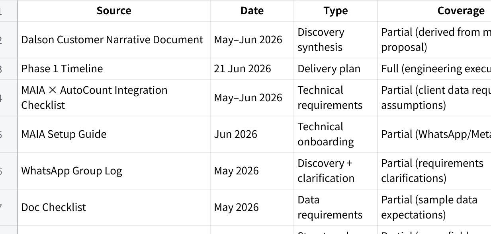
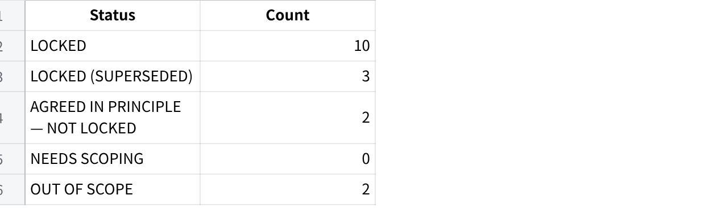
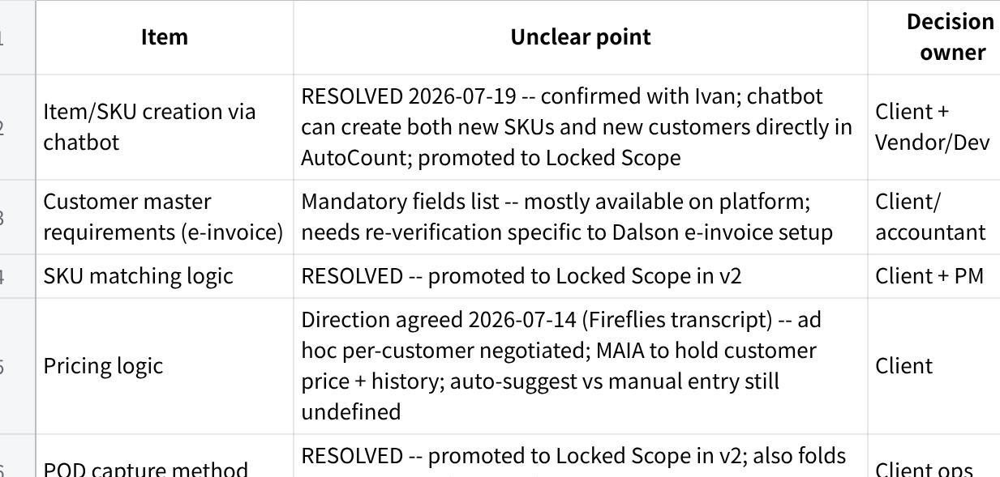

**14 Jul 26 - Scope Lock v2 --- Dalson Industrial Supplies**

**Scope Lock v2 --- Dalson Industrial Supplies (MAIA Phase 1)**

**Date:** 14 Jul 2026 (rerun; v1 was 23 Jun 2026)\
**Stage:** In-build --- most blocking items resolved 2026-07-12/13, build actively underway per Phase 1 Timeline\
**Rerun trigger:** Fireflies transcript (2026-05-22 requirements call, clean capture) cross-checked against Granola transcript of the same call, Customer Narrative, and VoC Extraction --- surfaced pricing direction and a client-side SO-workflow resolution not previously reflected here

1\. **Source Manifest**

**点击图片可查看完整电子表格**

**Coverage note:** No formal signed SOW provided in extracted files → scope is reconstructed from proposal narrative + conversations. Confidence is MED.

2\. **Scope Lock Summary (Dashboard)**

**点击图片可查看完整电子表格**

**Blocking items (cannot safely build past)**

**Cash Sales Invoice support** --- CONFIRMED 2026-07-31: Dalson does handle cash/walk-in sales (customer pays on the spot, no PO, no formal customer record). MAIA has no cash-invoice type end to end today --- no front-end payment-table UI, chatbot can\'t handle it, backend API schema missing the dynamic fields, PDF/reporting doesn\'t surface it. Not yet scoped or sized --- see Needs-Scoping Register row 12.

3\. **Locked Scope (Build-Ready)**

**SL-1 --- MAIA as operational layer on top of AutoCount**

**Status:** LOCKED\
**Source:** Narrative + integration framing

**User-facing flow**

User interacts via MAIA (chat)

MAIA references and updates AutoCount

AutoCount remains system of record

**Acceptance criteria**

No scenario where MAIA replaces AutoCount as ledger/invoicing source

All financial records persist in AutoCount

**Confidence: HIGH**

**SL-2 --- Core order intake via unstructured channels (WhatsApp / call / email)**

**Status:** LOCKED\
**Source:** Business process description

**User-facing flow**

Customer sends PO via WhatsApp/email/image

Staff forwards into MAIA

MAIA extracts order draft

**Acceptance criteria**

At least WhatsApp intake supported end-to-end

Non-structured PO ingestion works for basic cases

**Confidence: HIGH**

**SL-4 --- SKU alias mapping / matching**

**Status:** LOCKED (promoted 2026-07-12 --- v1 blocking list claimed this resolved but the item was never written up here)\
**Source:** Needs-Scoping Register row 1; core MAIA platform capability, not Dalson-specific

**User-facing flow**

Customer PO/description arrives with item wording that may not match Dalson\'s internal SKU naming

MAIA suggests the closest-match SKU and asks staff to confirm before the order draft is finalised

**Acceptance criteria**

Ambiguous item descriptions are never auto-committed without staff confirmation

Matching engine is the shared MAIA platform engine; Dalson alias data populates it, no custom build required

**Confidence: HIGH**

**SL-5 --- Proof of Delivery capture**

**Status:** LOCKED (promoted 2026-07-12; independently re-confirmed 2026-07-14 in both Fireflies and Granola captures of the 2026-05-22 call)\
**Source:** Needs-Scoping Register row 4; VOC-010, VOC-011, VOC-012; core MAIA platform feature

**User-facing flow**

Driver takes a photo at delivery and the chop-signed DO is uploaded into MAIA, tied to the related order

Staff can retrieve a past DO later by asking MAIA for it (\"master DO\") instead of searching WhatsApp/printed copies

**Acceptance criteria**

POD photo and signed-DO image are stored against the order and retrievable on request

This item folds in VOC-012 (DO retrieval pain) --- no separate scope line needed, same capability

**Confidence: HIGH**

**SL-6 --- AutoCount integration: access + data migration**

**Status:** LOCKED (resolved 2026-07-12: access granted, data migrated)\
**Source:** Needs-Scoping Register row 5

**User-facing flow**

MAIA reads from and writes to Dalson\'s AutoCount instance (cloud-hosted, v2.2, managed by their AutoCount dealer)

**Acceptance criteria**

Read/write access confirmed working against Dalson\'s live AutoCount instance

Historical data (customers, SKUs, pricing) migrated in

*Scope boundary: this item covers access and one-time migration only. The ongoing 2-way sync mechanism (API vs middleware, write-back timing, error handling) is a separate, still-open item --- see SL-12.*

**Confidence: HIGH**

**SL-8 --- Credit note handling**

**Status:** LOCKED (new in v2 --- not written up in v1 despite being marked resolved on the Needs-Scoping Register)\
**Source:** Needs-Scoping Register row 7; VOC-022; independently confirmed in the 2026-05-22 call (both Fireflies and Granola captures)

**User-facing flow**

Credit notes are issued against a specific invoice ID/item --- invoice-level, not customer-account-level

Client explicitly distinguished this from an account-level credit approach used by another vendor client --- invoice-level is Dalson\'s actual, confirmed practice

**Acceptance criteria**

Credit note creation requires selecting the source invoice; no account-level credit-balance mechanism is built

**Confidence: HIGH**

**SL-9 --- Warehouse / stock update**

**Status:** LOCKED (new in v2 --- not written up in v1 despite being marked resolved on the Needs-Scoping Register)\
**Source:** Needs-Scoping Register row 9; VOC-006, VOC-020; independently confirmed in the 2026-05-22 call (both captures)

**User-facing flow**

Dalson trades heavily --- stock comes in and goes straight back out for B2B orders; only retail-facing stock is actual inventory

B2B order fulfilment does not require stock-count tracking or restrictions in MAIA

**Acceptance criteria**

MAIA does not force a stock-count update on B2B order fulfilment for SKUs the client doesn\'t track

Retail-facing SKUs (the few that need it) retain tracking

**Confidence: HIGH**

**SL-17 --- Receipts**

**Status:** LOCKED (new in v2 --- closes a gap flagged independently by VoC Extraction, UAT Checklist §4c, and End-user & Process Map §6, none of which had a Scope Lock home for it)\
**Source:** VOC-023 (CONFIRMED), VOC-024 (CONFIRMED); independently re-confirmed in both Fireflies and Granola captures of the 2026-05-22 call --- \"we never generate receipt\... if customer really want, we can generate \[in\] Maya\"

**User-facing flow**

Dalson does not generate receipts as standard practice today

Receipt generation is on customer request only, one click in MAIA --- never automatic on payment

**Acceptance criteria**

No receipt is auto-generated when a payment/proof-of-payment is attached to an order or invoice

A receipt can be generated from MAIA on explicit request, tied to the related sales order/invoice

**Confidence: HIGH**

**SL-11 --- Customer & item/SKU creation via chatbot**

**Status:** LOCKED (resolved 2026-07-19 --- was the last remaining NEEDS SCOPING/blocking item)\
**Source:** Confirmed with Ivan (Vendor/Dev) --- chatbot is able to create both new SKUs and new customers directly in AutoCount. Client-side need was already CONFIRMED daily-frequency (VOC-015/016/030, re-confirmed in both Fireflies and Granola captures of the 2026-05-22 call); the open question was purely technical feasibility on the AutoCount validation constraint, now closed.

**User-facing flow**

Staff can create a new customer or new item/SKU directly through the MAIA chatbot, without manually keying into AutoCount first

New customer/item pushes through to AutoCount via the same validated flow as existing records

**Acceptance criteria**

New customer creation via chatbot succeeds and reflects correctly in AutoCount

New item/SKU creation via chatbot succeeds and reflects correctly in AutoCount

No fallback/manual-entry workaround is needed as the primary path --- full automation is the design, not a degraded default

**Confidence: HIGH**

**SL-10 --- Pricing logic**

**Status:** LOCKED (resolved 2026-07-22 --- moved from AGREED IN PRINCIPLE; both open mechanic questions confirmed with Yap Li Min, Owner)\
**Source:** Needs-Scoping Register row 2 (original); Fireflies transcript 2026-05-22 + Granola capture (direction); owner alignment confirming mechanic, captured 2026-07-22

**User-facing flow**

Pricing is per-customer negotiated and ad hoc, not a fixed structured price list --- client marks up low for a customers first order, then adjusts on repeat orders depending on the relationship

No customer-specific price table exists in AutoCount today --- only a single standard price per item

MAIA holds customer-specific pricing and surfaces item price history from the customers last few orders in the chatbot when staff create an order --- staff references this history and manually decides/confirms the price (not a single auto-suggested value)

When no customer-specific price history exists yet (new customer, or first order on that item), MAIA auto-applies the standard AutoCount price as the default; staff can still override it

**Acceptance criteria**

Chatbot displays the last few order prices charged to that customer for the item being ordered, before staff confirms the line price

New customer or first order on an item with no price history defaults to the standard AutoCount item price, editable by staff

**Confidence: HIGH**

**SL-12 --- AutoCount integration: ongoing 2-way sync mechanism**

**Status:** LOCKED (design resolved 2026-07-24 --- client confirmed direct DB access) --- **⚠️ NOT YET ACTIVE.** Confirmed 2026-07-31: the sync mechanism is not turned on in Dalson\'s live environment yet. Do not test this in the current UAT cycle.\
**Source:** Gareth (internal), 2026-07-24; testability caveat confirmed 2026-07-31

**User-facing flow**

Scope narrowed in v2 --- SL-6 already covers access + one-time migration (LOCKED). This item is the remaining piece: ongoing write-back design.

Implementation method confirmed: direct DB access via a duplicate/replica AutoCount database --- not API, not middleware.

**Acceptance criteria**

Design-level: not yet applicable for UAT --- sync isn\'t live. Once turned on, verify write-back correctness and timing against AutoCount before adding UAT coverage.

**Confidence: MED --- design locked, activation status unverified**

**SL-14 --- Document generation (SO / Invoice / DO PDFs)**

**Status:** LOCKED (resolved 2026-07-24 --- client confirmed MAIA template; re-confirmed 2026-07-31)\
**Source:** Gareth (internal), 2026-07-24; re-confirmed with client 2026-07-31

**User-facing flow**

Required outputs: SO, Sales Invoice (SI), DO, Credit Note (CN), Quotation (QTN)

Client confirmed MAIA\'s own document template/layout used for all five doc types --- not AutoCount-style parity

**Acceptance criteria**

All five generated documents (SO, SI, DO, CN, QTN) use MAIA\'s own PDF template/layout, not an AutoCount-parity layout

**Confidence: HIGH**

4\. **Locked (Superseded)**

**SL-3 --- Messaging channel (WhatsApp vs Telegram)**

**SOW / earlier assumption:** WhatsApp as primary channel\
**Now confirmed:** Telegram used for go-live execution phase\
**Changed by:** Delivery timeline decision 21 Jun 2026\
**Client agreement:** CONFIRMED with client (per PM, 2026-07-12) --- risk closed

**Status**

✅ LOCKED (2026-07-12) --- Telegram confirmed as production channel with client

**Risk**

RESOLVED 2026-07-12 --- Telegram confirmed as production channel with client; delivery plan and client expectation now aligned

**SL-13 --- PO → SO → Invoice → DO workflow (SO stage reinterpreted)**

**SOW / earlier assumption:** formal PO → SO → Invoice → DO flow, with a Sales Order pushed into AutoCount for every order\
**Now confirmed:** Dalson does not use a formal Sales Order stage in practice (VOC-021, CONFIRMED --- client states directly \"no sales order\"). MAIA generates a quotation/proforma-style SO-equivalent document, sent to the customer (used as the pre-order doc, and for new customers to collect payment upfront). Invoice and DO push into AutoCount; the quotation/SO-equivalent stays inside MAIA only.\
**Changed by:** Proposed by vendor (Brendan) on the 2026-05-22 requirements call; client verbally agreed in the same call (\"okay we can do that method\")\
**Client agreement:** YES --- verbal agreement on 2026-05-22; written confirmation in the Sample Data Checklist doc: \"You are happy to use MAIA\'s template for Sales Orders and Proforma Invoices for new customers. Invoices will continue to be generated via AutoCount.\" Direct client quote, Dalson WhatsApp group, 2026-05-26 (Yap Li Min): \"if MAIA can do her own \'quotation\' with her own SKU is ok de.\" AutoCount integration scope doc lists only \"sales orders and invoices\" as pushed to AutoCount --- quotation is not in that push list.

**⚠️ Unresolved conflict (2026-07-31):** the Before/After E2E Flow doc was edited to state the quotation IS pushed to AutoCount, citing an unattributed \"PM direct check of Dalson\'s live AutoCount instance\" --- no date detail beyond \"2026-07-29\", no name, no linked source doc. This contradicts the three grounded citations above (verbal agreement, written Sample Data Checklist confirmation, and the AutoCount integration scope doc\'s push list). Per this Scope Lock\'s grounding rule (\"no citation → it does not go in as fact\"), this claim does not override the cited position. Reverted to the MAIA-only position pending a properly attributed re-verification --- see Client Confirmation Agenda.

**Status**

✅ LOCKED (SUPERSEDED) --- confidence **MED** (downgraded 2026-07-31 from HIGH: an unattributed claim reversed this item without proper citation --- see conflict note above; reverting to the cited \"MAIA-only\" position but flagging for re-verification, not treating either version as fully settled)

**Risk**

PARTIALLY RESOLVED 2026-07-19 --- written confirmation (Sample Data Checklist doc) and a direct client quote (WhatsApp, 2026-05-26) both support the quotation staying MAIA-only. RE-OPENED 2026-07-31 --- an uncited claim in the Before/After E2E Flow doc asserted the opposite (\"PM direct check\", no name/source). Per grounding rules, an uncited claim can\'t override cited sources, so the MAIA-only position stands as current intent --- but this needs a properly attributed live-system verification before build finalizes either way. Added to Client Confirmation Agenda. Downstream docs (VoC VOC-021, End-user & Process Map, UAT Checklist UP-22/UP-23, Before/After E2E Flow doc) need to be corrected to match once this is settled --- currently inconsistent with each other.

**SL-7 --- Submission flow (no separate approval gate)**

**Status:** LOCKED --- SUPERSEDED 2026-07-20: client (Yap Li Min) confirmed only 3 people use MAIA for Dalson (Yap Li Min, Asilah, Joseph) --- small enough that a separate approval gate is unnecessary. Any of the 3 registered users may submit a document directly; submission is final, not a draft pending Yap Li Min\'s sign-off.\
**Source:** Client confirmation, 2026-07-20 (previously: Needs-Scoping Register row 6, resolved 2026-07-12)

**User-facing flow**

MAIA prepares a draft SO/Invoice; any of the 3 registered users (Yap Li Min, Asilah, Joseph) can submit it directly to AutoCount

No approval tier --- no submission requires a second person\'s sign-off before reaching AutoCount

**Acceptance criteria**

Only the 3 registered users (Yap Li Min, Asilah, Joseph) can submit; anyone else attempting to act via MAIA is refused (access control, not approval --- see SL-3)

**Confidence: HIGH**

**AGREED IN PRINCIPLE --- NOT LOCKED**

None currently. SL-12 and SL-14 both resolved to LOCKED 2026-07-24 (SL-14 re-confirmed 2026-07-31) --- see Locked Scope (Build-Ready) above.

**NEEDS SCOPING REGISTER**

**点击图片可查看完整电子表格**

7\. **Supersessions Log**

**S1 --- Messaging channel shift**

**SOW baseline:** WhatsApp as primary operational channel

**Now intended:** Telegram used for Phase 1 execution

**Who changed:** Internal delivery decision

**Rationale:** Meta business verification pending

**Client agreed:** CONFIRMED 2026-07-12

**Risk:** RESOLVED (was HIGH, channel mismatch vs client expectation) --- closed 2026-07-12

**S2 --- Sample data expectations expanded**

**SOW baseline:** basic sample docs

**Now:** full dataset required (20--100 POs, full SKU exports)

**Agreement:** implied via checklist request, not formally confirmed

**S3 --- SO stage reinterpreted**

**SOW baseline:** formal PO → SO → Invoice → DO flow with Sales Order pushed into AutoCount

**Now intended:** SO/quotation-equivalent stays inside MAIA only; Invoice + DO push to AutoCount; new customers get a MAIA-generated proforma-style doc for upfront payment

**Who changed:** Vendor-proposed (Brendan) on the 2026-05-22 call, in direct response to the client stating they don\'t use a formal SO stage (VOC-021)

**Rationale:** Matches Dalson\'s actual practice rather than forcing an SO stage they don\'t use

**Client agreed:** YES, verbally on the call, and now also in writing (Sample Data Checklist doc, 2026-07-19)

**Risk:** RESOLVED --- written confirmation found 2026-07-19, confidence upgraded MED → HIGH

**S4 --- Approval gate removed**

**SOW baseline:** single approver (Yap Li Min) required before any SO/Invoice reaches AutoCount

**Now intended:** no separate approval gate --- any of the 3 registered MAIA users (Yap Li Min, Asilah, Joseph) can submit a document directly; submission is final

**Who changed:** Client (Yap Li Min) confirmed 2026-07-20

**Rationale:** Only 3 people use MAIA for Dalson --- small enough that a separate approval tier adds friction without adding safety

**Client agreed:** YES, directly, 2026-07-20

**Risk:** LOW --- direct client confirmation, not inferred. Cascades to UAT Checklist (SL-7 test cases), End-user & Process Map (Permission Matrix), VoC (approval framing), and the UAT Infopack (Field Guide Persona/Mission content built around the old sole-approver model) --- all need to be updated to match.

**S5 --- Pricing mechanic resolved**

**Prior state:** AGREED IN PRINCIPLE --- NOT LOCKED (both resolved 2026-07-24, see Supersessions Log S6/S7) (SL-10); direction (per-customer ad hoc pricing, MAIA holds history) agreed, mechanic undefined

**Now confirmed:** MAIA surfaces item price history from the customers last few orders in the chatbot at order time; staff manually decides/confirms price referencing that history (not a single auto-suggested value). When no customer-specific history exists yet, MAIA auto-applies the standard AutoCount price as default, staff can override.

**Who changed:** Client (Yap Li Min, Owner) confirmed

**Client agreed:** YES, captured 2026-07-22

**Risk:** RESOLVED --- SL-10 moved from AGREED IN PRINCIPLE to LOCKED. Cascades to VoC Extraction, UAT Checklist, End-user & Process Map, and UAT Infopack --- all currently list SL-10 as open/not-testable and need updating to match.

**S6 --- AutoCount 2-way sync mechanism resolved**

**Prior state:** AGREED IN PRINCIPLE --- NOT LOCKED (SL-12); implementation method undecided (API / middleware / DB access)

**Now confirmed:** Direct DB access --- MAIA has a duplicate/replica AutoCount database to read/write against for ongoing sync

**Who changed:** Gareth (internal), 2026-07-24

**Risk:** RESOLVED --- SL-12 moved from AGREED IN PRINCIPLE to LOCKED.

**S7 --- Document template decision resolved**

**Prior state:** AGREED IN PRINCIPLE --- NOT LOCKED (SL-14); layout rules/templates only partially available

**Now confirmed:** Client will use MAIA\'s own document template for all five doc types --- SO, SI, DO, CN, QTN --- not AutoCount-style parity

**Who changed:** Gareth (internal), 2026-07-24

**Risk:** RESOLVED --- SL-14 moved from AGREED IN PRINCIPLE to LOCKED.

**S8 --- SL-13 reconciliation pass (uncited reversal rejected)**

**Trigger:** Before/After E2E Flow doc was edited to claim the quotation IS pushed to AutoCount, citing an unattributed \"PM direct check\" with no name, no linked source, only a date.

**What was checked:** Sample Data Checklist doc (written client confirmation), Dalson WhatsApp group (2026-05-26, direct quote from Yap Li Min), and the AutoCount integration scope doc (push list = sales orders + invoices only, quotation excluded).

**Outcome:** All three grounded sources agree the quotation stays MAIA-only. The uncited reversal claim does not meet this doc\'s grounding bar and was not accepted as fact.

**Status:** SL-13 reverted to the MAIA-only position, confidence downgraded HIGH → MED, flagged for a properly attributed live-system re-verification. Added to Client Confirmation Agenda.

**Who changed:** Gareth (internal), 2026-07-31

**S9 --- SL-12/SL-14 bucket placement fixed; SL-12 testability caveat added**

**Trigger:** Structural bug --- SL-12 and SL-14 both already said \"Status: LOCKED\" in their own body text (resolved 2026-07-24, S6/S7) but were still structurally filed under the \"AGREED IN PRINCIPLE --- NOT LOCKED\" heading. Doc contradicted itself.

**Client input, 2026-07-31:** SL-14 confirmed LOCKED --- will use MAIA\'s own PDF template. SL-12 confirmed design-locked (direct DB access) but the sync mechanism is **not turned on yet** in Dalson\'s live environment --- do not test in this UAT cycle.

**Fix:** Moved both SL-12 and SL-14 into Locked Scope (Build-Ready) with full entry shape (status/source/flow/acceptance criteria/confidence). SL-12 carries an explicit \"NOT YET ACTIVE\" testability caveat, confidence MED. SL-14 confidence HIGH. AIP section now empty, left in place with a pointer note rather than deleted (preserves the doc\'s standard section order).

**Who changed:** Gareth (internal), 2026-07-31, per direct client/team confirmation

8\. **Out of Scope / Explicit Exclusions**

**SL-15 --- Supplier-side procurement automation**

Explicitly excluded from Phase 1

**SL-16 --- Full ERP replacement**

MAIA is overlay only, not system replacement

9\. **Source-Conflict Register**

**Conflict 1 --- Communication channel**

Narrative implies WhatsApp-centric operations

Timeline sets Telegram as go-live channel

**Resolution:** unresolved --- treated as scope risk until client confirms final production channel.

**Conflict 2 --- SL-13 quotation push destination**

Sample Data Checklist doc (written) + Dalson WhatsApp group 2026-05-26 (Yap Li Min direct quote) + AutoCount integration scope doc (push list excludes quotation) --- all say the quotation/SO-equivalent stays MAIA-only

Before/After E2E Flow doc, edited 2026-07-31 --- claims quotation IS pushed to AutoCount, citing an unattributed \"PM direct check,\" no name/source

**Resolution:** unresolved --- cited sources retained as current position (MAIA-only); uncited claim rejected per grounding rules but not disproven. Needs a properly attributed live-system verification --- see Client Confirmation Agenda.

10\. **Client Confirmation Agenda (Send-ready)**

How should **SKU matching confidence** behave when multiple matches exist --- override rules and confidence thresholds? (Refinement on SL-4.)

What are the **mandatory e-invoice customer fields** required for new-customer creation? (Needs-Scoping Register row 3.)

Where does the **quotation/SO-equivalent document actually live** --- MAIA only, or pushed to AutoCount? A 2026-07-31 edit claimed it\'s pushed to AutoCount but cited no attributable source, and contradicts written confirmation + a direct client quote. Need someone to name who checked Dalson\'s live AutoCount instance, when, and how --- or re-confirm directly with Yap Li Min. (SL-13, see Source-Conflict Register --- Conflict 2.)

**Bottom line**

Core positioning (MAIA as overlay on AutoCount) plus 12 operational items are now LOCKED --- includes SL-11 (chatbot SKU/customer creation, confirmed with Ivan 2026-07-19), SL-10 (pricing logic, mechanic confirmed with Yap Li Min 2026-07-22), SL-12 (AutoCount 2-way sync via direct DB access) and SL-14 (MAIA document templates for SO/SI/DO/CN/QTN), both confirmed 2026-07-24.

3 items are LOCKED (SUPERSEDED) --- messaging channel (Telegram, HIGH confidence), the submission flow (SL-7, HIGH confidence, approval gate removed 2026-07-20 --- only 3 people use MAIA for Dalson, so a separate sign-off step was dropped), and SL-13 (SO-stage reinterpretation --- quotation stays MAIA-only, **MED confidence**, downgraded 2026-07-31 pending a properly attributed re-verification; see SL-13 and Source-Conflict Register --- Conflict 2 for detail).

0 items remain AGREED IN PRINCIPLE --- AutoCount 2-way sync method and document template completion both resolved 2026-07-24 (SL-12, SL-14).

0 items remain NEEDS SCOPING. No blocking items left as of 2026-07-19.

Delivery is materially closer to scope finalisation than v1 suggested. One live follow-up as of 2026-07-20: the SL-7 approval-gate removal needs to cascade into VoC, UAT Checklist, End-user & Process Map, and the UAT Infopack --- those docs still assume the old sole-approver model.

\|（注：部分内容可能由 AI 生成）
