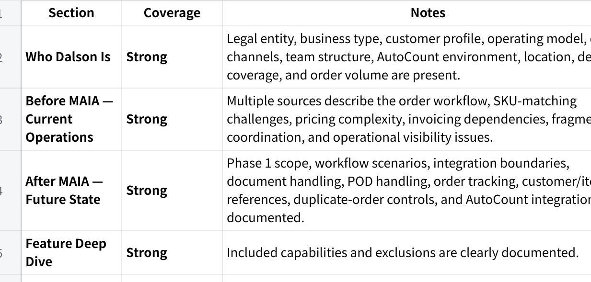

**Dalson - Customer Narrative v2**

**Source Coverage**

**点击图片可查看完整电子表格**

**Discovery Gaps to Close**

The following information is not available or only partially available in the supplied material:

Exact SKU count.

Exact headcount beyond the confirmed 2 sales coordinators plus warehouse and delivery involvement.

Exact customer count.

Exact credit-term structure.

Exact approval workflow for quotations and orders.

Exact number of warehouses (one location is stated, but warehouse structure is not fully confirmed).

Whether Dalson Multi Supply is a separate legal entity.

Investment figure was available internally (RM15,000 implementation, RM2,500/month subscription), but client-facing inclusion depends on whether commercial disclosure is desired.

No assumptions have been made to fill these gaps.

**MAIA for Dalson Industrial Supplies**

**Bringing structure, visibility, and operational control to the work that happens around AutoCount.**

*Prepared by Mindhive for Dalson Industrial Supplies Sdn Bhd*

*Investment: RM15,000 implementation fee*

**Who Dalson Is**

Dalson Industrial Supplies is a Malaysian B2B industrial supply business serving primarily automotive-related and construction-related customers.

The business operates from Bandar Sunway and delivers nationwide across Malaysia. Its customers place orders through a mixture of WhatsApp, phone calls, emails, and purchase orders sent in various formats.

At its core, Dalson already has a system.

That system is AutoCount.

AutoCount is the company\'s accounting, invoicing, inventory, debtor, and operational record platform. It remains the source of truth for transactions and financial records. Dalson currently operates on AutoCount Version 2.2 in a cloud-hosted environment.

The business processes approximately 50 to 100 orders per month. Day-to-day order handling is currently carried by two sales coordinators, supported by warehouse and delivery personnel.

Dalson\'s business is also more complex than it first appears.

Customer-specific pricing is common. Product descriptions received from customers often do not match Dalson\'s internal SKU naming. Similar products can appear under different descriptions depending on who is ordering and how the request arrives.

As a result, successful order processing today depends heavily on staff experience and memory.

AutoCount handles the accounting.

That is not the problem.

The problem is everything that happens around AutoCount.

**Before MAIA --- How Dalson Operates Today**

Dalson does not have a software problem.

It has a coordination problem.

The company already has a system capable of storing records and generating invoices. The challenge is the amount of interpretation, checking, chasing, and cross-referencing required before information ever reaches that system.

**Orders Arrive Unstructured**

Customer requests arrive through WhatsApp messages, phone calls, emails, and purchase orders.

Every request must first be interpreted by a sales coordinator.

A coordinator reads the message, determines what the customer wants, checks customer details, checks item details, checks pricing, and only then begins creating the required records.

The work is not document creation.

The work is figuring out what the document should contain.

Every order starts with manual interpretation.

Every order consumes staff attention before it can become a transaction.

**The SKU Translation Problem**

One of Dalson\'s most important operational challenges is that customers frequently describe products differently from how those products exist inside AutoCount.

A customer may use their own description.

A supplier catalogue may use another.

AutoCount may store the item under a completely different internal SKU structure.

Experienced staff bridge this gap manually.

They compare descriptions, recall previous orders, search item records, and determine which SKU is actually being requested.

This creates a dependency on individual knowledge.

It also creates risk.

A wrong interpretation can lead to the wrong item being quoted, ordered, invoiced, or delivered.

**Pricing Lives in Experience**

Dalson does not operate from a rigid standardised price list.

Customer-specific pricing is common.

Prices are often adjusted based on the customer relationship and prior transactions.

This means coordinators are not simply selecting products.

They are validating whether the selected price is appropriate for that specific customer.

The result is repeated checking and repeated reliance on historical knowledge.

**Invoicing Still Depends on Manual Preparation**

AutoCount remains the invoicing core.

However, when customer records or invoice-related information are incomplete, staff still need to manually prepare and enter information before invoicing can proceed.

The accounting system works.

The preparation work around it remains manual.

That creates delay and administrative dependency.

**Order Visibility Is Fragmented**

Order conversations live in WhatsApp.

Documents live in AutoCount.

Follow-ups live in people\'s memories.

Delivery updates live somewhere else.

Proof-of-delivery records are not naturally attached to the full operational history of the order.

As orders move from intake to fulfilment, information becomes fragmented across conversations, files, and system records.

Management visibility depends on asking people.

Not on opening a single operational view.

**Follow-Up Depends on Memory**

Pending invoices.

Outstanding deliveries.

Customer follow-ups.

Document revisions.

Order exceptions.

These activities exist, but they are not naturally surfaced in one place.

The business relies heavily on coordinators remembering what needs attention.

As order volume grows, memory becomes the bottleneck.

**After MAIA --- What Changes**

MAIA does not replace AutoCount.

MAIA replaces the coordination work that currently happens outside AutoCount.

A sales coordinator receives a customer purchase order through WhatsApp.

Instead of manually interpreting everything from scratch, the coordinator forwards the request into MAIA.

MAIA reads the request, references customer records, item records, pricing references, and stock information, then prepares a draft sales order for review.

The coordinator remains in control.

Nothing is submitted automatically.

Nothing is confirmed automatically.

The coordinator reviews the draft and decides whether it is correct.

If a customer description does not clearly match an internal SKU, MAIA does not guess.

It surfaces the closest matching items and asks the coordinator to confirm the correct one.

The knowledge stays with the business.

The repetitive searching disappears.

A coordinator preparing a quotation for a customer requesting an unfamiliar item no longer starts from a blank page.

If the item is new and does not yet exist in the item master, the coordinator can still prepare the quotation workflow without immediately restructuring the master data.

The coordinator remains the decision-maker.

MAIA becomes the assistant.

When a sales order is confirmed, MAIA prepares the relevant transaction and pushes the confirmed information into AutoCount.

AutoCount continues to own the accounting record.

AutoCount continues to generate and maintain the financial transaction.

MAIA simply removes the repeated manual preparation work that happens beforehand.

A delivery driver completes a delivery.

The proof of delivery is sent into MAIA.

Instead of becoming another image buried inside a chat thread, the proof is attached to the related order trail.

The sales team can see it.

Management can see it.

The delivery history remains connected to the order.

The document trail becomes searchable and traceable.

A manager starts the day.

Instead of asking multiple people what is pending, the manager sees a consolidated operational view.

Pending orders.

Pending billing activities.

Delivery-related follow-ups.

Exceptions that require attention.

The information already existed before.

The difference is that it is now visible.

The result is not automation replacing people.

The result is fewer operational gaps between people.

AutoCount remains the accounting engine.

MAIA becomes the operational layer connecting the work around it.

**Feature Deep Dive**

1\. **Intelligent Order Intake**

**What it does**

Accepts forwarded customer requests, POs, text, images, and supported voice inputs.

References customer, item, pricing, and stock information.

Prepares draft sales orders for review.

**What it won\'t do**

Automatically confirm orders.

Automatically create transactions without user review.

**Why it matters**

The coordinator spends less time interpreting requests and more time validating them.

2\. **SKU Matching Assistance**

**What it does**

Detects ambiguous descriptions.

Suggests the closest matching internal items.

**What it won\'t do**

Automatically choose the item on behalf of the user.

**Why it matters**

It reduces SKU interpretation risk while keeping human judgment in control.

3\. **AutoCount-Connected Document Workflow**

**What it does**

Supports sales orders, invoices, delivery-related workflows, and e-invoice preparation.

Pushes confirmed transactions into AutoCount.

**What it won\'t do**

Replace AutoCount.

Replace Dalson\'s accounting processes.

**Why it matters**

The operational workflow becomes faster without disrupting the existing ERP foundation.

4\. **Operational Tracking and Visibility**

**What it does**

Tracks orders through their lifecycle.

Maintains document trails and activity history.

Generates daily digest and pending-task visibility.

**What it won\'t do**

Make operational decisions for users.

**Why it matters**

Visibility becomes system-driven rather than memory-driven.

5\. **Proof of Delivery Management**

**What it does**

Stores proof-of-delivery records against the related order.

Maintains a searchable order trail.

**What it won\'t do**

Replace delivery operations.

**Why it matters**

Order history remains complete from intake through fulfilment.

**Scope Summary**

**Included in RM15,000**

Internal order intake workflow.

Customer PO forwarding.

Draft sales-order preparation.

Customer, pricing, and item reference support.

AutoCount integration.

Sales order support.

Invoice support.

E-invoice trigger support through AutoCount.

Delivery-order support.

Proof-of-delivery attachment and storage.

Duplicate-order warning guardrails.

SKU ambiguity assistance.

Backend tracking and visibility.

Daily digest and follow-up visibility.

**Designed For, Not Included (Future Phase)**

Procurement-side supplier workflows.

Supplier-linked SKU orchestration.

Advanced reporting and management dashboards.

Additional workflow automation beyond Phase 1.

**Requires Clarification**

Inventory update responsibilities.

E-invoice data readiness requirements.

Customer master-data completeness.

Pricing-rule maintenance ownership.

**Not in Scope**

ERP replacement.

Procurement automation.

Supplier workflow automation.

Advanced approval matrices.

Major AutoCount restructuring.

Custom workflows outside agreed Phase 1.

**The Design Principle**

Dalson\'s challenge is not that information is missing.

The challenge is that information is scattered.

Orders arrive in one place.

Documents live in another.

Knowledge lives in people\'s heads.

Follow-up lives in memory.

AutoCount already stores the record.

MAIA structures everything that happens before and after that record is created.

The objective is not to remove human judgment.

The objective is to give human judgment a structured environment to operate within.

**MAIA structures the workflow. Humans remain the decision-makers.**
