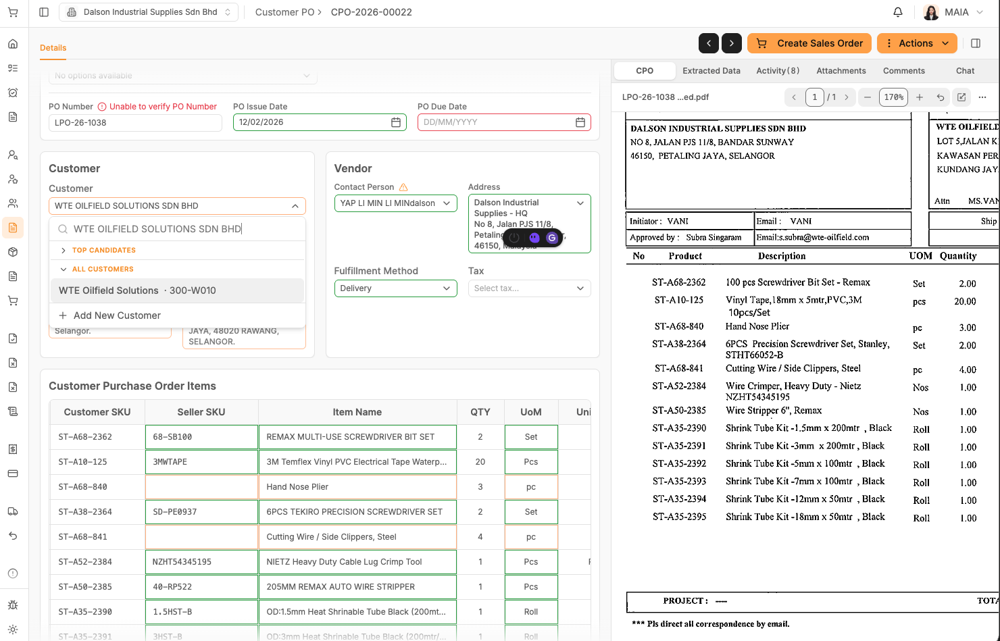
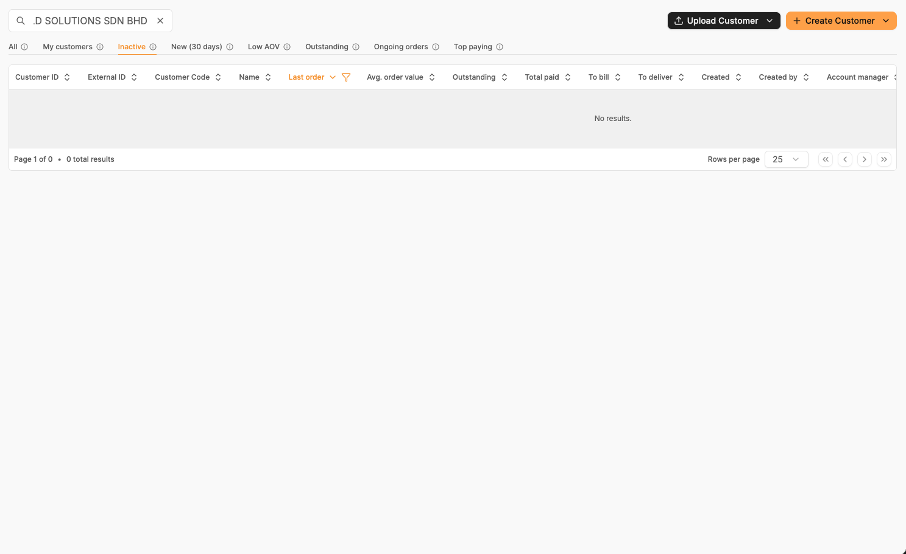
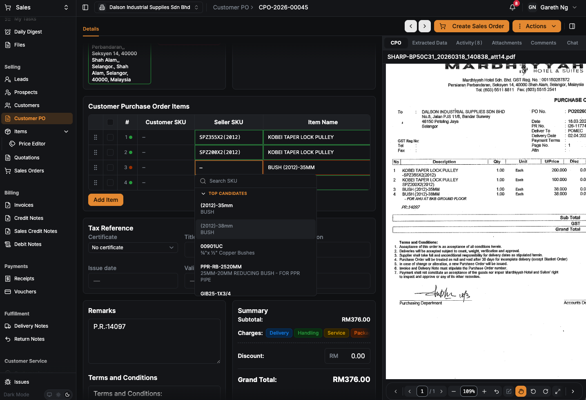
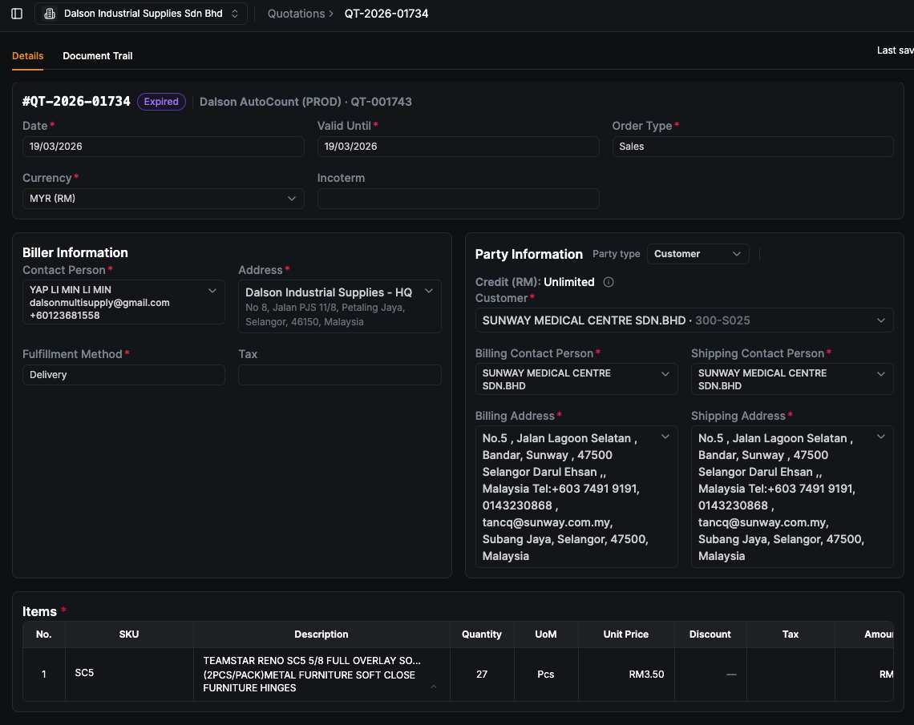
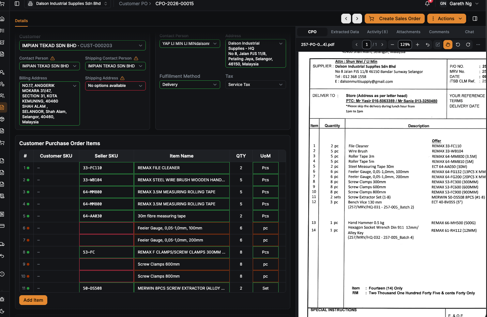

**Dalson CPO Testing Report**

1\. **CPO 22**

{width="5.75in" height="3.6875in"}

{width="5.75in" height="3.5208333333333335in"}

https://maia-fe-dalson.vercel.app/sales/customer-purchase-orders/CPO-2026-00022

Description:

In client db, the customer name is not fully named properly, missing sdn. Bhd.

When extracting the customer name with sdn bhd, if fail to do so

2\. **CPO 45**

https://maia-fe-dalson.vercel.app/sales/customer-purchase-orders/CPO-2026-00045

Rank as 2nd in the top candidates, not confidence to match the item name

{width="5.75in" height="3.9166666666666665in"}

3\. **CPO 47**

https://maia-fe-dalson.vercel.app/sales/quotations?page=1&page_size=25&sort=modified&order=desc&tab=all

{width="5.75in" height="4.5625in"}

4\. **CPO 15**

https://maia-fe-dalson.vercel.app/sales/customer-purchase-orders/CPO-2026-00015

False positive for 4th line items 3m

{width="5.75in" height="3.75in"}
