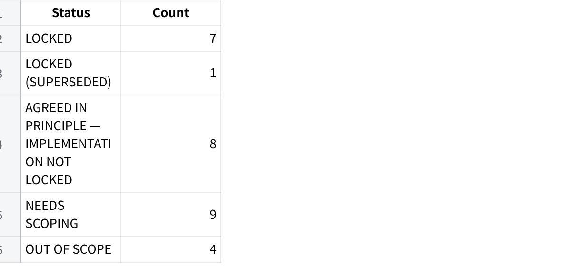

**24 June 26 - MAIA \<\> Fixguru Scope-Lock v2**

**Fixguru --- Scope Lock v2**

**Date:** 24 June 2026\
**Build stage:** UAT / post-2nd UAT scope correction\
**Main conclusion:** This is **not sign-off ready**. The 24 June UAT transcript makes one thing clear: the first sales-order step is still not matching the client's real workflow. The biggest blocker is **historical pricing + discount visibility in a simple, one-glance format**.

1.1 **Source Manifest**

Processed sources:

**SOW / Product Specification Baseline** --- processed for sold baseline: MAIA order flow, workspaces, AutoCount sync, document generation, approvals, inventory, chatbot and custom calculator scope.

**Fixguru Scope Gathering** --- processed for original discovery: AutoCount as main database, EOD sync, internal WhatsApp chatbot, credit limit, credit term, B2B pricing/discount, 2pm cutoff, delivery flow, and roles.

**Fixguru Functional Requirements** --- processed for functional flow, reminder engine, approval engine, quotation/SO/payment/DO/invoice flows.

**Fixguru UAT Gaps** --- processed for first UAT findings: AutoCount faster than chatbot, historical pricing missing, item-level discount missing, AutoCount PDF expectations, branch/contact sync, delivery method as SKU, FOC, stock visibility, calculators, and out-of-scope notes.

**Fixguru 2nd UAT Plan** --- processed for planned in-scope fixes before second UAT: historical pricing, customer pricing enforcement, credit limit exposure, delivery method SKU, language preference, HQ/branch contact, 2-way sync, PDF template, volume fields, FOC, calculator.

**Fireflies transcript: "Fixguru UAT with Gareth and Bryan 24 June 26"** --- processed in full from Fireflies connector. This is the key new v2 source. Citation key used below: **\[FF \| 24 Jun 2026\]**.

Not found / not available in project sources:

**Forensic Account Dossier** --- not present in the uploaded project files.

**Client / Customer Narrative** --- not present in the uploaded project files.

WhatsApp/chat exports beyond the provided stock-backward visibility transcript were not separately available.

1.2 **Scope Lock Summary**

**Status counts**

**点击图片可查看完整电子表格**

**Blocking items**

**Historical pricing + discount decision step** --- must be redesigned before client can continue meaningful UAT. Client said if this first step is not solved, the team will abandon MAIA and go back to AutoCount. \[FF \| 24 Jun 2026\]

**Chatbot response format / UX simplicity** --- client wants one-glance, table-style, low-reading output; current output is too wordy and confusing. \[FF \| 24 Jun 2026\]

**Price / discount approval logic** --- minimum price and credit control are understood, but exact approval behaviour is not fully locked. \[FF \| 24 Jun 2026\];

**Customer search by phone / WhatsApp number** --- client says this is operationally critical because sales staff often identify customers by phone number, not company name. \[FF \| 24 Jun 2026\]

**Warehouse / shelf / branch stock configuration** --- still needs technical alignment on how AutoCount structure maps into MAIA/ERPNext. \[FF \| 24 Jun 2026\];

**Top items to confirm with client**

Confirm the exact **historical pricing table** fields: item code, item name, date, quantity, standard unit price, discount %, net price, invoice reference, last 5 invoice transactions.

Confirm whether historical pricing must come from **Sales Invoice only**, not quotation or sales order.

Confirm whether MAIA should show historical delivery method from the **last 5 orders/invoices**.

Confirm whether order creation should be **chat-first + web/table review**, instead of pure chatbot conversation.

Confirm approval rules for **minimum price below threshold**, **credit limit exceeded**, and **cash customer with payment proof not yet knocked off in AutoCount**.

Confirm whether **price-book/customer-specific pricing** should bypass repeated approval.

3\. **Locked Scope**

**L-01 --- AutoCount as master system of record**

**Status:** LOCKED\
**Confidence:** HIGH

**SOW / baseline:** MAIA integrates with AutoCount for customers, products, invoices, credit notes, receipts, payment vouchers, and product quantity updates.

**Current locked definition:** AutoCount remains the authoritative database for customer, product, stock and accounting records. MAIA/chatbot must pull from and push to AutoCount, not become an independent conflicting master. Scope gathering also confirms "AutoCount use as main database" and "sync to AutoCount every EOD not live."

**User-facing flow:**\
Sales user creates or updates sales documents in MAIA/chatbot → MAIA syncs relevant document/customer/product/payment records to AutoCount → AutoCount remains the accounting and stock authority.

**Acceptance criteria:**

Customer, product, invoice, credit note, receipt and payment voucher objects sync to AutoCount.

MAIA uses AutoCount IDs / external document IDs where required.

No MAIA-generated document should create duplicate/conflicting accounting records.

Sync failure must be visible to internal users or management.

**L-02 --- Internal WhatsApp chatbot, not customer-facing chatbot**

**Status:** LOCKED\
**Confidence:** HIGH

**SOW / baseline:** SOW supports omnichannel chat and internal assistants for sales, logistics and drivers.

**Current locked definition:** For Fixguru, chatbot is for **internal operations only**: sales agents, accounts/payment validation, operations/logistics, drivers and boss/management. Scope gathering explicitly says WhatsApp only, internal team only, not customer-facing.

**User-facing flow:**\
Customer messages sales externally → sales forwards order details to internal MAIA WhatsApp bot → bot assists with quotation/SO/DO/invoice/payment/delivery coordination → internal users act on the outputs.

**Acceptance criteria:**

WhatsApp chatbot works for internal users.

It supports the internal roles: sales, operations/logistics, driver, accounts/management.

It does not send customer-facing order updates unless separately confirmed.

**L-03 --- Core sales document flow**

**Status:** LOCKED\
**Confidence:** MED

**SOW / baseline:** Standard document flow is Quotation → Sales Order → Proforma → Delivery Note/DO → Invoice → Credit Note if needed.

**Current locked definition:** Fixguru's practical flow remains Quotation / Proforma Invoice → Sales Order → DO → Invoice, with AutoCount document references required. Scope gathering says Fixguru uses Quotation → Sales Order / Proforma Invoice → DO → Invoice, and one proforma may have two or more DOs.

**User-facing flow:**\
Sales receives customer order → creates quotation/proforma → confirms pricing/payment/credit → creates SO → operations creates DO/picking → invoice follows delivery outcome.

**Acceptance criteria:**

User can create quotation and SO.

SO can link to one or more DOs.

Invoice can trace back to the originating SO/DO.

Document IDs must follow/return AutoCount external IDs where available.

**L-04 --- Draft editability before final submission**

**Status:** LOCKED\
**Confidence:** HIGH

**SOW / baseline:** SOW states order-centric record grouping and editability during proforma stage; final invoice accuracy reflects last agreed version.

**Current locked definition:** Draft quotations/SOs must remain editable. Client clarified in UAT that the sales order should only lock when confirmed/submitted to AutoCount; before that, users need to edit items, quantities, delivery method and charges. \[FF \| 14 May 2026 transcript\];

**User-facing flow:**\
Sales creates draft quotation/SO → user can keep amending → user confirms final → only then system submits/locks.

**Acceptance criteria:**

Draft documents can be edited.

Submit/confirm action is explicit.

After submission to AutoCount, document lock behaviour follows accounting rules.

Chatbot must not silently submit before user confirmation.

**L-05 --- RSC + Diecut calculator only**

**Status:** LOCKED (SUPERSEDED)\
**Confidence:** HIGH

**SOW / baseline:** SOW includes custom box quotation module based on IAM Excel models: RSC and Diecut.

**Supersession:**\
SOW said calculator scope is **RSC + Diecut** → client later has 5 calculator types → current intended scope remains **2 calculators only**; additional calculators are CR. UAT Gaps records the decision: MAIA supports 2 calculators, while client now has RSC, Diecut, Pizza, Layer Pad and 5 panels; decision is to allow the 2 calculators only and treat more calculators as CR.

**User-facing flow:**\
User selects RSC or Diecut calculator → enters dimensions/specs → system calculates price/cost → price can flow into quotation/SO.

**Acceptance criteria:**

RSC calculator works.

Diecut calculator works.

Price flows into quotation/SO.

Pizza, Layer Pad and 5-panel calculators are not included unless CR is approved.

**L-06 --- FOC quantity handling**

**Status:** LOCKED\
**Confidence:** MED

**Current locked definition:** FOC quantity must be represented so revenue is calculated only on billable quantity, while stock decrements billable + FOC quantity. UAT Gaps gives example: 1000 billable + 10 FOC should decrement 1010 stock, but revenue is 1000 × rate.

**User-facing flow:**\
Sales enters item quantity and FOC quantity → system shows both clearly → stock deducts total physical quantity → revenue ignores FOC quantity.

**Acceptance criteria:**

User can enter billable quantity and FOC quantity.

FOC does not inflate revenue.

Stock deduction includes FOC.

PDF / document line display is clear enough for Fixguru.

**L-07 --- Delivery method / delivery charge as SKU line item**

**Status:** LOCKED\
**Confidence:** HIGH

**Current locked definition:** Delivery charges such as Lalamove / 3PL must be captured as item/SKU line items, not only as delivery method metadata. UAT Gaps records that chatbot incorrectly added "3PL-Lalamove" as delivery method instead of item, while Fixguru treats delivery method/charge as item.

**User-facing flow:**\
Sales chooses delivery method → if charge applies, system adds the correct delivery SKU/item line with amount → document/PDF reflects delivery charge line → accounting code is preserved.

**Acceptance criteria:**

Delivery method can be selected.

Delivery charge can be added as SKU/item line.

SKU code follows Fixguru/AutoCount item code.

Invoice accounting does not treat delivery charge as product revenue incorrectly.

**L-08 --- Brand in item display string**

**Status:** LOCKED\
**Confidence:** HIGH

**Current locked definition:** Item display string must include brand, not just item code and name. Client explicitly said \"brand matters\... right now we are not showing brand.\" Confirmed core, in scope (13 Jul 2026).

**Acceptance criteria:**

Item display string format: item code + brand + item name.

Applies consistently across chatbot and FE display.

Brand pulled from AutoCount item master where available.

**Source:** Fixguru VoC Extraction VOC-009 (2026-05-15 feedback sync)

4\. **Agreed in Principle --- Implementation Not Locked**

**AIP-01 --- Historical pricing + discount visibility**

**Status:** LOCKED (was AGREED IN PRINCIPLE)\
**Blocking:** NO (resolved)\
**Confidence:** HIGH

**Baseline / history:** First UAT already identified historical pricing as critical: client needs last transacted price + discount % by customer and item; item-level discount was not supported.

**24 June update:** Client repeated that historical pricing is the core blocker. They need to see past quantity, standard/unit price, discount %, net price and date before deciding the current quote price. Client said current chatbot output is too wordy, confusing, and not usable; they will return to AutoCount if this is not solved. \[FF \| 24 Jun 2026\]

**Current intended definition:**\
When sales submits an order request, MAIA should first show historical pricing by item/customer in a table or image-style one-glance format before asking user to confirm price/discount.

**Acceptance criteria (locked, 13 Jul 2026):**

Source data: **Sales Invoice only** (see NS-02).

FE UI lists **ALL transactions**, not capped at 5 (see NS-01).

Exact fields (locked): item code, item name, date, invoice no, quantity, standard price, discount %, net price (see NS-03).

Output: standalone FE URL link-out from chatbot, not inline WhatsApp table/image (see NS-01).

**AIP-02 --- Chat + web dual-interface workflow**

**Status:** LOCKED (was AGREED IN PRINCIPLE)\
**Blocking:** NO (resolved)\
**Confidence:** HIGH

**24 June update:** Vendor proposed a hybrid workflow because rich historical pricing is hard to display clearly inside chat. Client accepted the idea in principle if it solves the "one glance" problem. \[FF \| 24 Jun 2026\]

**Current intended definition:**\
Chatbot handles quick input/actions; web interface or side panel displays rich tables for historical pricing, discounts and item review.

**Resolution (13 Jul 2026):** For item historical pricing, chatbot returns a URL; user taps it to open the FE page for a quick-glance table view. Not a separate always-on web app --- a link-out from chat, triggered on demand.

**AIP-03 --- Customer search by phone / WhatsApp number**

**Status:** AGREED IN PRINCIPLE --- IMPLEMENTATION NOT LOCKED\
**Blocking:** YES\
**Confidence:** HIGH

**Baseline:** Scope gathering says customer info lives in AutoCount and customer profiles include contact number.

**24 June update:** Client said sales often only has WhatsApp/phone number, not exact company name. They want MAIA to search customer by phone/mobile number and then pull historical orders. \[FF \| 24 Jun 2026\]

**Acceptance criteria still to lock:**

Search fields: phone, mobile, WhatsApp number, contact person number.

How to handle duplicate numbers across HQ/branches.

Whether partial phone number search is allowed.

How search result should be displayed before proceeding.

**AIP-04 --- Historical delivery method recommendation**

**Status:** AGREED IN PRINCIPLE --- IMPLEMENTATION NOT LOCKED\
**Blocking:** NO\
**Confidence:** MED

**Baseline:** Delivery options include internal delivery, Lalamove and self-pickup from scope gathering.

**24 June update:** Client wants to see last 3--5 historical delivery methods because customers switch between courier, pickup and Lalamove depending on urgency. Client said last 5 would be good. \[FF \| 24 Jun 2026\]

**Acceptance criteria still to lock:**

Last 3 or last 5 delivery records?

Pull from invoice, SO, DO or delivery note?

Show as recommendation only, or auto-default?

Confirm exact delivery method labels/SKUs.

**AIP-05 --- Credit limit / credit exposure approval**

**Status:** AGREED IN PRINCIPLE --- IMPLEMENTATION NOT LOCKED\
**Blocking:** YES\
**Confidence:** MED

**Baseline:** SOW includes approval when customer approaches credit limit before creating SO; functional requirements include credit limit exceeded → management approval.

**24 June update:** Client clarified approval happens because real AR/payment state may not yet be knocked off in AutoCount. They need approver to see AR/owing amount, current order value, credit limit, available/exceeded amount, and payment proof context before approving. \[FF \| 24 Jun 2026\]

**Acceptance criteria still to lock:**

Block at quotation, SO conversion, DO, or invoice?

Exact credit formula.

Exact approver role.

Whether payment proof can temporarily allow approval before AutoCount knock-off.

**AIP-06 --- Minimum price / below-threshold approval**

**Status:** AGREED IN PRINCIPLE --- IMPLEMENTATION NOT LOCKED\
**Blocking:** YES\
**Confidence:** MED

**Baseline:** Scope gathering says minimum price needs approval if discount is more than minimum price; SOW approval section says quotation/SO approval when selling price falls below minimum threshold.

**24 June update:** Client clarified minimum price is item-level: example standard price is 33 sen, anything below 27 sen needs approval. \[FF \| 24 Jun 2026\]

**Acceptance criteria still to lock:**

Is threshold global per item or per item/UOM?

Does customer-specific price book bypass approval?

Can quotation be generated while pending approval?

Who approves and where?

**AIP-07 --- Price-book / customer-specific pricing bypass**

**Status:** AGREED IN PRINCIPLE --- IMPLEMENTATION NOT LOCKED\
**Blocking:** NO\
**Confidence:** LOW

**24 June update:** Client said some customers already have approved special prices; if these are maintained in price book/customer pricing, they should not need repeated approval. \[FF \| 24 Jun 2026\]

**Acceptance criteria still to lock:**

Where the approved customer price is maintained.

Whether data is available from AutoCount API.

Whether price-book price overrides minimum price block.

Whether upload/import is required.

**AIP-08 --- Warehouse / shelf / branch stock configuration**

**Status:** AGREED IN PRINCIPLE --- IMPLEMENTATION NOT LOCKED\
**Blocking:** YES\
**Confidence:** MED

**Baseline:** SOW says MAIA validates stock quantity against AutoCount/WMS and DO issuance reflects into AutoCount immediately to prevent oversell.

**Prior UAT:** UAT Gaps identified stock/warehouse sync, shelf info needed for pick list/DO, and stock balance cannot be identified.

**24 June update:** Discussion clarified that AutoCount may model shelves/branches via warehouse hierarchy/sub-warehouse configuration, but mapping still needs technical confirmation. \[FF \| 24 Jun 2026\]

**Acceptance criteria still to lock:**

Exact AutoCount module/table for stock, warehouse, branch, shelf.

Whether shelf is item master, warehouse hierarchy, or additional note.

Whether MAIA can prevent DO when insufficient stock.

How multi-warehouse stock should be displayed.

5\. **Needs-Scoping Register**

**NS-01 --- Historical pricing final UI**

**Question to close:** Should MAIA show historical pricing as WhatsApp table/image, web table, or both?\
**Who decides:** Fixguru + Mindhive PM/product\
**Blocking:** YES\
**Source:** \[FF \| 24 Jun 2026\]

**Resolution (13 Jul 2026):** Standalone FE URL link-out. When user queries a specific item from a past order in chatbot, chatbot fetches and returns a standalone FE URL pre-filtered to that customer/item/history view. Example: [example URL](https://maia-oms-dev.vercel.app/sales-staging?company=MAIA&customer=CUST-000004&items=COFFEE-NESTLE-001,DAIRY-MILK-FRESH-001,MEAL-001&sheet=COFFEE-NESTLE-001&tab=history&src=whatsapp&chat=60123456789). Matches AIP-02 (chat + web, resolved as link-out, not a separate always-on app).

**NS-02 --- Historical data source**

**Question to close:** Should historical pricing come strictly from **Sales Invoice**, or include Quotation and Sales Order history?\
**Who decides:** Fixguru finance/sales lead\
**Blocking:** YES\
**Source:** \[FF \| 24 Jun 2026\]

**Resolution (13 Jul 2026):** For Fixguru specifically, the historical-pricing view checks from **Sales Invoice**. MAIA generally still supports Quotation and Sales Order history as a system capability, just not surfaced in this Fixguru view.

**NS-03 --- Exact historical pricing fields**

**Question to close:** Confirm fields: item code, item name, invoice date, invoice no, quantity, standard unit price, discount %, net price, delivery method.\
**Who decides:** Fixguru sales lead\
**Blocking:** YES\
**Source:** \[FF \| 24 Jun 2026\]

**Resolution (13 Jul 2026):** Locked: item code, item name, date, invoice no, quantity, standard price, discount %, net price. 8 fields, invoice-sourced (see NS-02).

**NS-04 --- Approval timing for credit control**

**Question to close:** Should credit approval block at SO creation, SO submission, DO creation, or invoice creation?\
**Who decides:** Fixguru management / finance\
**Blocking:** YES\
**Source:** \[FF \| 24 Jun 2026\];

**Resolution (13 Jul 2026):** Block at DN level. Dev has configured and built this. Not yet client-tested --- status is RESOLVED-PENDING-TEST, not open.

**NS-05 --- Payment proof vs AutoCount AR timing**

**Question to close:** If payment proof exists but AutoCount AR is not knocked off yet, can approver override credit block?\
**Who decides:** Fixguru finance\
**Blocking:** YES\
**Source:** \[FF \| 24 Jun 2026\]

**Resolution (13 Jul 2026):** Parked / deferred. Not resolving this round.

**NS-06 --- Customer search duplicates**

**Question to close:** If one phone number matches multiple contacts/branches, what should MAIA show and require before proceeding?\
**Who decides:** Fixguru sales/admin\
**Blocking:** YES\
**Source:** \[FF \| 24 Jun 2026\]

**Resolution (13 Jul 2026):** Parked. Fixguru does not use branches --- all contacts sit at the same level under the customer record (no hierarchy). Downgrade Blocking to NO.

**Dedup rule:** Contacts merge only if contact type is duplicated (same type/number). Differently-named branches (e.g. \"Branch 1\" vs \"Branch 2\") do not merge, even under the same customer.

**NS-07 --- Delivery method history**

**Question to close:** Should MAIA show last 3 or last 5 delivery methods, and should it auto-suggest the most common/latest method?\
**Who decides:** Fixguru sales/logistics\
**Blocking:** NO\
**Source:** \[FF \| 24 Jun 2026\]

**Status (13 Jul 2026):** Still open --- aligning with tech team and Fixguru client on which doctype (invoice/SO/DO) delivery-method history should reference.

**NS-08 --- Warehouse/shelf technical mapping**

**Question to close:** Which AutoCount stock/warehouse structure should MAIA integrate with for branch, warehouse and shelf?\
**Who decides:** Mindhive tech + Fixguru AutoCount admin\
**Blocking:** YES\
**Source:** \[FF \| 24 Jun 2026\];

**Resolution (13 Jul 2026, per 2nd UAT Backward Plan M0 Decisions):** Scoped, not full sub-warehouse modelling. Shelf number populates in the Delivery Note additional-note field only. Branch does not apply (see NS-06). Downgrade Blocking to NO for shelf; warehouse mapping itself remains open.

**NS-09 --- Multilingual chatbot quality**

**Question to close:** Does 2nd UAT require full Malay/Chinese response quality, or only language preference support?\
**Who decides:** Fixguru operations\
**Blocking:** NO\
**Source:** UAT Gaps says staff cannot read English and Malay/Chinese responses are required.

**Status (13 Jul 2026):** Implemented --- needs testing.

**NS-10 --- PDF / document template (AutoCount parity)**

**Question to close:** PDF template format and delivery-charge line display were tracked in Scope Lock v1 (locked capability + open item) but dropped from v2. Client prefers AutoCount-style layout; delivery charge must show as its own PDF line for invoicing accuracy.\
**Who decides:** Fixguru + Mindhive product\
**Blocking:** Not yet assessed\
**Status (13 Jul 2026):** Implemented --- needs client testing/involvement.\
**Source:** Fixguru VoC Extraction VOC-010/011; Scope Lock v1 Part 1.D + Open Item #3

**NS-11 --- SST / tax visibility on customer-facing documents**

**Question to close:** Client does not want SST/tax shown on customer-facing documents, even though tax exists in the item master config.\
**Who decides:** Fixguru + Mindhive product\
**Blocking:** NO\
**Status (13 Jul 2026):** RESOLVED.\
**Source:** Fixguru VoC Extraction VOC-025 (2026-05-15 feedback sync)

6\. **Supersessions Log**

**S-01 --- Pure chatbot order creation → chatbot + one-glance pricing decision UI**

**Risk:** HIGH\
**SOW said:** Chatbot can support full order creation via bot and real-time sales document creation.\
**Now intended:** Chatbot alone is not sufficient for historical pricing-heavy decisions; likely need chat + table/web/image interface. \[FF \| 24 Jun 2026\]\
**Changed by:** Client feedback during 24 June UAT; vendor acknowledged design gap.\
**Rationale:** Client users do not like reading long chatbot responses and need fast, one-glance pricing decisions. \[FF \| 24 Jun 2026\]\
**Client agreed?** YES in principle, but final implementation not locked.

**S-02 --- Standard discount flow → item-level historical discount decision flow**

**Risk:** HIGH\
**SOW said:** Sales workspace supports quotations, invoices and credit-related workflows; approval workflows include discounts/refunds/escalations.\
**Now intended:** Every item/customer may require historical discount visibility before quoting; discount must be item-level, quantity-sensitive and shown as percentage/net price. \[FF \| 24 Jun 2026\]\
**Client agreed?** YES as requirement; implementation not locked.

**S-03 --- Calculator scope remains 2 calculators only**

**Risk:** MED\
**SOW said:** RSC + Diecut custom calculator.\
**Now intended:** Still only RSC + Diecut; Pizza, Layer Pad and 5-panel are CR.\
**Client agreed?** Not evidenced in the provided sources as a formal client sign-off; treat as internal scope position to confirm.

**S-04 --- Delivery method metadata → delivery charge as SKU line**

**Risk:** HIGH\
**SOW said:** Fulfillment method / delivery method supported.\
**Now intended:** Delivery charge must be itemized as a SKU/item line because accounting code matters. Prior UAT showed chatbot incorrectly treated 3PL-Lalamove as delivery method, not item.\
**Client agreed?** YES as operational requirement.

7\. **Out-of-Scope / Explicit Exclusions**

**OOS-01 --- WhatsApp reply-function context targeting**

UAT Gaps explicitly lists using WhatsApp reply functions to target certain chat as out of scope.

**OOS-02 --- Additional calculators beyond RSC + Diecut**

Pizza, Layer Pad and 5-panel calculators are not in current scope; treat as CR.

**OOS-03 --- Updated RSC/Diecut Excel formula version changes**

Updated formula versions require assessment and should be treated as CR if they differ from scoped formula.

**OOS-04 --- Hardware / on-premise infrastructure**

SOW excludes hardware procurement and on-premise infrastructure.

8\. **Source-Conflict Register**

**C-01 --- SOW says full chatbot order creation; UAT shows pure chatbot is not enough**

**Conflict:** SOW positions chatbot as full order creation assistant, but 24 June UAT shows real users need visual historical pricing review before they can proceed. \[FF \| 24 Jun 2026\]\
**Resolution:** Do not treat pure chatbot flow as locked. Scope is now **chatbot + simplified pricing decision UX**, pending implementation lock.

**C-02 --- Historical pricing marked in-scope / testing done, but client still says blocker remains**

**Conflict:** 2nd UAT plan says item historical pricing chatbot testing was done / ready to test, but 24 June transcript shows client still finds historical pricing unusable. \[FF \| 24 Jun 2026\]\
**Resolution:** Move historical pricing from "ready" back to **blocking AIP / implementation not locked**.

**C-03 --- Stock visibility marked as validation/integration scope, but warehouse/shelf mapping unresolved**

**Conflict:** SOW says stock validation and AutoCount/WMS stock ownership are part of inventory integration, while UAT Gaps and 24 June transcript show stock, shelf and warehouse mapping still unclear. \[FF \| 24 Jun 2026\]\
**Resolution:** Keep stock validation as locked objective, but warehouse/shelf implementation remains **Needs Scoping**.

9\. **Client Confirmation Agenda**

Send-ready questions:

For historical pricing, should MAIA show the **last 5 invoice transactions** per customer + item before quotation/SO confirmation?\
**Answer (13 Jul 2026):**RESOLVED. MAIA lists ALL transactions in the FE UI (not capped at 5); the 5-row figure is a floor when fewer exist, not a cap.

Please confirm the historical pricing columns: **date, invoice no, item code, quantity, standard unit price, discount %, net price**.\
**Answer (13 Jul 2026):**RESOLVED. Locked per NS-03: item code, item name, date, invoice no, quantity, standard price, discount %, net price.

Should historical pricing come from **Sales Invoice only**, or also include quotation and sales order history?\
**Answer (13 Jul 2026):**RESOLVED --- already confirmed with client previously. Sales Invoice only for this view (see NS-02); MAIA still generally supports QTN/SO history as a capability.

Is it acceptable for MAIA to use a **chat + web/table review workflow**, or must all review happen inside WhatsApp?\
**Answer (13 Jul 2026):**RESOLVED --- YES, acceptable and necessary. Chatbot output response has format/length limitations that make inline tables impractical; the FE link-out (NS-01) is the resolution.

If the WhatsApp message becomes too long, can MAIA send the pricing table as an **image/table attachment**?\
**Answer (13 Jul 2026):**SUPERSEDED. Implementation route chosen is a standalone FE URL link-out (NS-01), not an inline image/table attachment.

Should MAIA allow customer search by **phone/mobile/WhatsApp number**, including partial number search?\
**Answer (13 Jul 2026):**YES, confirmed (24 Jun debrief) --- phone-first retrieval, mobile + landline. Partial-number search still unconfirmed.

If one phone number matches multiple customers/branches, should MAIA ask the user to choose the correct branch before continuing?\
**Answer (13 Jul 2026):**Moot for Fixguru --- no branches exist (see NS-06). Generic dedup rule: merge only on duplicate contact type, not by branch name.

Should MAIA show the **last 5 delivery methods** used by that customer as a recommendation?\
**Answer (13 Jul 2026):**YES, confirmed (24 Jun debrief) --- last 5 confirmed delivery methods. Source doctype (invoice/SO/DO) still pending tech+client alignment (see NS-07).

For delivery charges, please confirm all charge SKUs: Lalamove, 3PL, courier, internal delivery, pickup, and any others.\
**Answer (13 Jul 2026):**RESOLVED. Charge SKU options pulled directly from AutoCount (their master list), not a separate manually-confirmed list.

For credit control, should the system block at **SO creation**, **SO submission**, **DO creation**, or **invoice creation**?\
**Answer (13 Jul 2026):**RESOLVED --- DN-level, confirmed 24 Jun debrief. Dev has configured and built this. Needs client testing (see NS-04).

If payment proof exists but AutoCount AR is not updated yet, can management approve the order manually?\
**Answer (13 Jul 2026):**Parked / deferred. Debrief discussed a bank-in-slip approval mechanism (prepaid auto-approve, credit-exceeded case-by-case, no hard-stop) but this is not treated as formally locked --- deliberate override, revisit later (see NS-05).

For minimum price, is the threshold configured by **item only**, or by **item + UOM**?\
**Answer (13 Jul 2026):**RESOLVED --- item + UOM. Threshold varies by UOM within the same item.

If customer-specific price book already approves a lower price, should MAIA bypass minimum-price approval?\
**Answer (13 Jul 2026):**RESOLVED. A locked price-book/customer-specific price bypasses the standard minimum-price approval. Exception: if the requested price goes below even that locked customer price, approval is still required.

For warehouse/shelf, which AutoCount structure is the source of truth: warehouse hierarchy, item master, branch warehouse, or another stock module?\
**Answer (13 Jul 2026):**Partially resolved. Shelf: populates in DN additional-note field only, per 2nd UAT Backward Plan decision (see NS-08). Broader warehouse/branch structure mapping still pending tech investigation.

Is Malay/Chinese chatbot response required for UAT sign-off, or can it be part of post-UAT improvement?\
**Answer (13 Jul 2026):**Implemented --- needs testing (see NS-09).

**Final v2 position**

The scope is **not cleanly locked after 24 June**. The real lock is:

  -------------------------------------------------------------------------------------------------------------------------------------------------------------------------------------------------------------------------------------------------------------
  Fixguru will only accept the system if MAIA makes the first sales pricing decision faster than AutoCount. That means historical invoice pricing, discount %, quantity and net price must be shown clearly, in one glance, before quotation/SO confirmation.

  -------------------------------------------------------------------------------------------------------------------------------------------------------------------------------------------------------------------------------------------------------------

Until that is demonstrated and accepted, the project should not push for sign-off.

\|（注：部分内容可能由 AI 生成）
