**25 June 26 - UAT Debrief**

**Fixguru UAT Debrief --- 24 June 2026**

**Meeting:** Fixguru UAT (on-site) **Mindhive:** Bryan (tech/product), Gareth (junior PM), Ivan (organizer) · **Fixguru:** Yvonne & Marcus (sign-off authorities) **Sources:** Fireflies transcript (01KVVSWST9...) + Ivan\'s raw notes + whiteboard sketches + AutoCount credit-control screenshots

**Headline verdict**

The showcase did **not** meet requirements. The step-1 blocker --- surface historical pricing per item and let sales confirm a discount in a single glance --- is the *same* issue raised on 7 Apr, failed on 14 May, and worked again on 16 Jun. It is still not delivered. Every downstream conversation (delivery method, credit, picking, e-invoice) is blocked behind it.

Client sentiment: patient but eroding. Fixguru (Yvonne/Marcus): *\"I speak many times the same... I don\'t know how to tell you.\"* Mindhive acknowledged the root gap openly --- a disconnect between the developer view and the real blue-collar user. That candour is good; it does not reset the clock.

**Commercial stake:** Milestone-2 (RM24,000) is contractually tied to UAT completion. Four UATs in, we have no signed acceptance on step 1.

**Understanding Fixguru --- what we must build *for***

This meeting was, more than anything, a lesson in *who the user is*. Three things to internalize across product and tech:

**The real competitor is AutoCount, not \"no system.\"** We are not replacing nothing --- we are replacing a tool that already works and is *faster* for them today. The bar is not \"MAIA integrated with AutoCount\"; it is \"MAIA beats AutoCount at the daily quoting bench.\" The moment MAIA is slower or more confusing than keying it into AutoCount, the user reverts --- and we lose. Every design decision is measured against that fallback, not against a blank slate.

**The user is the constraint --- design for the lowest-literacy person in the chain.** Fixguru\'s sales users are blue-collar; they don\'t like reading and want quick action. Ivan\'s framing: if a head of department needs five minutes to digest a screen, their team needs far longer. So MAIA must be *super direct* --- single message, one-glance, yes/no. Anything that asks them to read, parse, or hunt across numbers gets abandoned. This is the disconnect Bryan named out loud: rich data feels easy to people who write code; to the real user it\'s \"a scare.\" One-glance simplicity is an **acceptance condition, not polish.**

**What they are actually buying is one decision, made fast.** Strip away the features and the job-to-be-done is: *\"For this customer, this item, this volume --- what discount do I give, and let me confirm it in seconds.\"* Pricing at Fixguru is customer-specific, volume-based, and drifts over time, so that decision is the heart of the sales work --- and it can only be made well with history (past invoice price, discount %, qty, date) in front of them. Everything else (PDF, delivery, credit) is downstream of getting this one moment right.

**What matters most to them, ranked:**

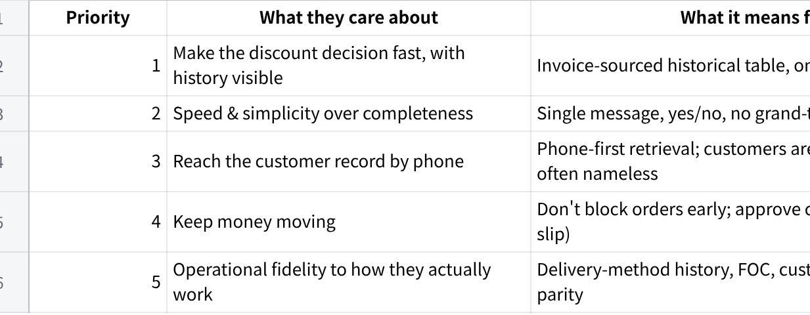

**点击图片可查看完整电子表格**

**The mindset shift for Mindhive:** their operational instincts --- don\'t block the order, approve on bank-in, surface the last five, default to one-glance --- are not edge cases or \"unusual requests.\" They are *revenue logic and floor-level usability* from people who run this business daily. Build to their reality, not to what is elegant to engineer. The fastest path to sign-off is to stop translating their workflow into our system and start mirroring it.

**The pattern that actually matters**

This is no longer a feature gap. It is a **delivery-credibility problem with one repeating root cause**: we keep demoing the *standard* chatbot flow and patching at the prompt level, when the client needs (a) a purpose-built historical-pricing surface and (b) a radically shorter confirmation path. The account history already flagged this --- \"historical pricing needs a first-class module, not prompt-level patching.\" The 24 Jun meeting confirms the patch approach has hit its ceiling.

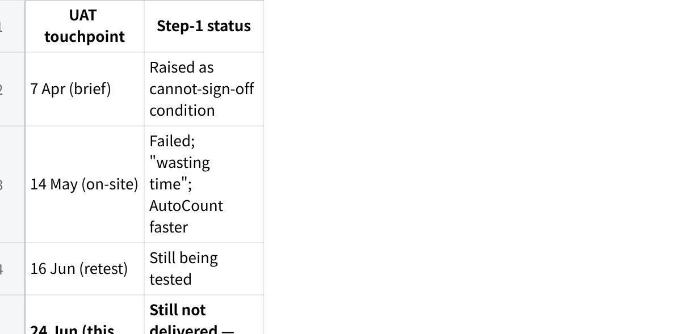

**点击图片可查看完整电子表格**

**The one acceptance bar to lock (what \"done\" means for step 1)**

Make this explicit and get it signed *before* the next build. From the transcript + whiteboard sketches, the target flow is:

User pastes order + phone number, e.g. 011-xxxx --- G3 100, G1 300, PM72 500.

MAIA retrieves the customer **by phone number** (mobile/landline), not name.

Per item, MAIA returns a **one-glance historical table** sourced from **invoices** (not orders) --- mirroring AutoCount\'s per-item *quick view*, which lists the last 10 invoices with date, qty, price and discount:

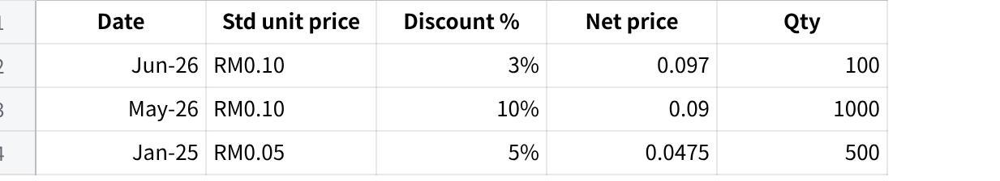

**点击图片可查看完整电子表格**

**Benchmark: replicate AutoCount\'s quick view --- up to the last 10 invoices per item.** 5 rows is the acceptable working minimum at this phase (client: \"3 is too few, 5 is good\"). Date matters --- it signals price drift vs. the current standard price.

MAIA asks one question: *\"Which price should I proceed with?\"*

User replies per item (G3 3%, G1 5%, PM72 none) → MAIA generates SO/quotation → PDF.

**Hard UX constraints (non-negotiable per client):**

Single message, readable in one glance. No grand-total noise (total lives in the PDF).

Columns shown: **standard price, discount %, net price**. Nothing else.

Yes/no interactions only. Too many words = abandonment → user reverts to AutoCount.

\"Not found = not found.\" No over-enrichment of prior records.

**What\'s new / sharpened this meeting (beyond the repeat blocker)**

**Direction decided --- chat enrichment, NOT dual interface.** Bryan floated a chat-input + rich-web (≈70/30 \"co-work\") split. Ivan\'s call: the dual interface is far-fetched and *masks the shortcomings of both platforms* --- it should remain a *possible* mode of usage, not the solve. The mandate is to make the **chat interface itself** surface and handle rich tabular information the way a web view can. The concrete benchmark already exists: **AutoCount\'s per-item quick view** (last 10 invoices: date, qty, price, discount). Replicate that *in chat*.

**Phone-number-first retrieval:** customers WhatsApp in, often with no name/company; existing customers can look new. Search by phone (mobile + landline columns).

**Historical delivery-method surfacing:** show last 5 confirmed delivery methods (courier / Lalamove / self-pickup) so sales can recap with the customer.

**Customer context bank:** minimum 5 confirmed documents per customer, considered at every turn (pricing + delivery method).

**Credit / approval logic --- now evidenced by AutoCount screenshots:** Credit control is enabled at **Delivery Order and Cash Sale level only** --- Quotation and Sales Order are *unchecked* (confirms \"block at DN, not order\"). Override mechanism is \"Need Password\" (i.e. approval). When a DO violates the limit, AutoCount fires a **Document\'s Credit Control Approval** dialog showing the full exposure breakdown --- Outstanding in A/R, D/O, S/O, PD cheque, Total Outstanding, Original/Increased Credit Limit, and Exceeded Credit --- with Approve / Reject. This is the exact flow MAIA must mirror. AR-negative (customer prepaid) and credit-exceed cases are approved case-by-case on the bank-in slip.

**Minimum price by item:** e.g. G1 standard 0.33, floor 0.27 --- below floor needs approval, but the quotation can still be generated *pending* approval. No maximum price. (Min-price block is separate from credit control; screenshot still to come from Azib.)

**Actionables**

**CLIENT --- Fixguru (owner: Ivan to chase)**

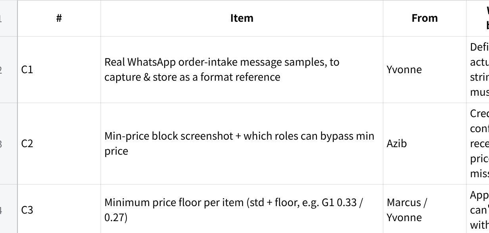

**点击图片可查看完整电子表格**

**PRODUCT (owner: Ivan / product team)**

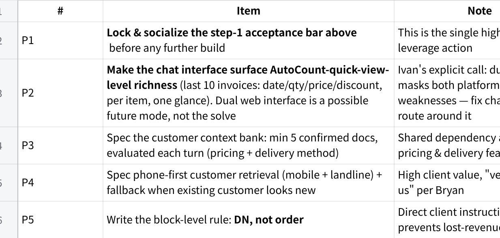

**点击图片可查看完整电子表格**

**TECH (owner: Jermaine + leads)**

Grouped by build area. **T7 (credit enforcement) and T8 (role-based price bypass) are the two explicitly flagged as missing --- they are enforcement engines, not config.**

**A. Pricing, discount & retrieval engine**

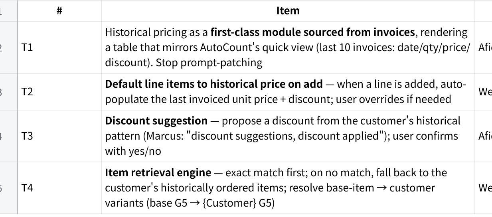

**点击图片可查看完整电子表格**

**B. Customer identity & context bank**

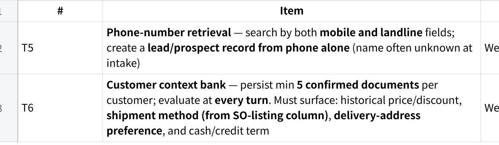

**点击图片可查看完整电子表格**

**C. Credit control & approval --- ENFORCEMENT (flagged gap)**

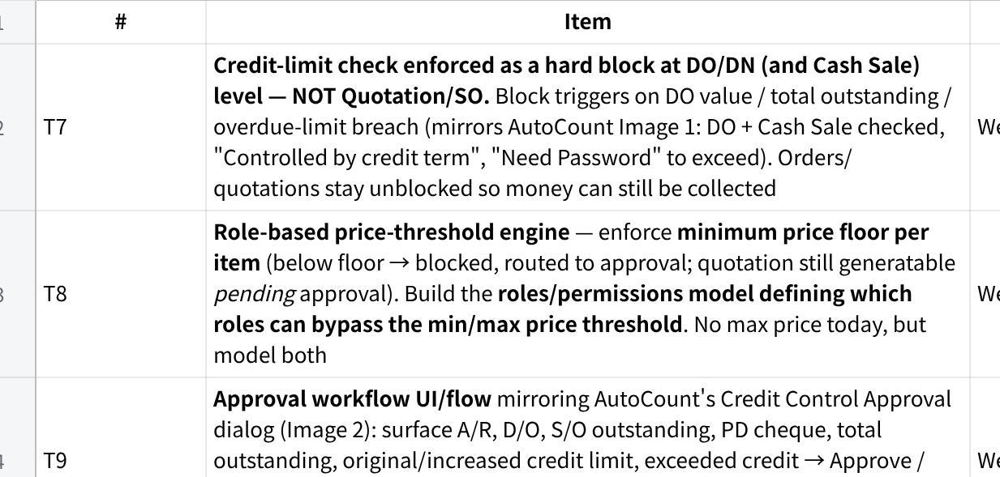

**点击图片可查看完整电子表格**

**D. Output, platform & ops**

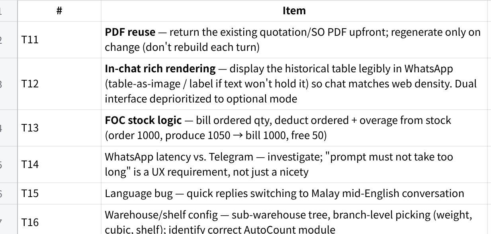

**点击图片可查看完整电子表格**

**Triage & execution**

**Scales.** *UX impact* = effect on the floor-user\'s ability to complete an order in one glance (High / Med / Low). *Urgency* = **P0** required for step-1 sign-off · **P1** required for a complete, trustworthy order flow · **P2** enhancement / later. *Size* = S (≤2d) · M (\~1wk) · L (2--3wk) · XL (3wk+/spike). Tech sizes are **provisional until the AutoCount invoice-API spike lands** --- if it\'s ugly, T1 and its dependents slip right.

**The cut that matters: step-1 critical path**

Only a small set actually gates sign-off. **Protect these from the rest.** Everything in Wave 2--3 is post-sign-off and must not pull focus before step-1 ships.

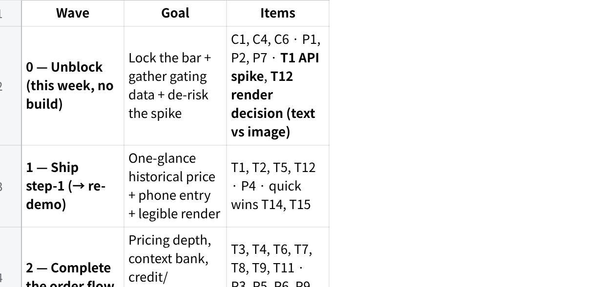

**点击图片可查看完整电子表格**

**Bundle warning:** T7 + T8 + T9 are one subsystem (credit state, price-floor state, shared approval flow). One owner, one approval object defined up front, or they diverge.

**Client triage**

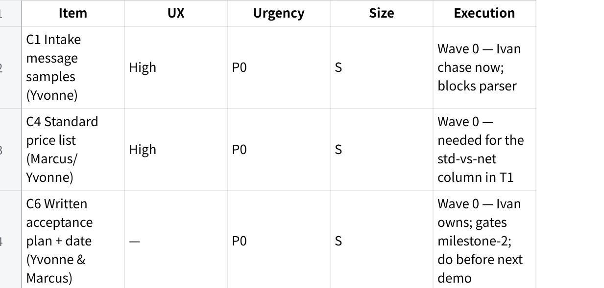

**点击图片可查看完整电子表格**

**Product triage**

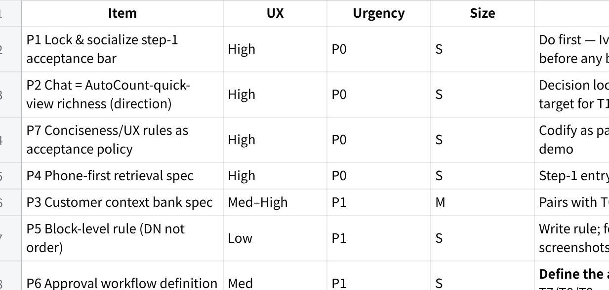

**点击图片可查看完整电子表格**

**Tech triage**

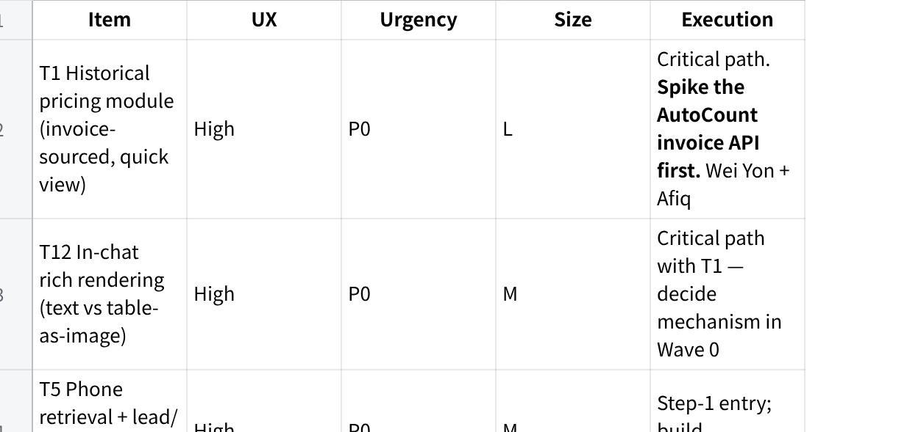

**点击图片可查看完整电子表格**

**Risk / pre-mortem (this is consequential --- relationship + payment + reference value)**

**It\'s 12 months later and Fixguru churned or never signed off. What killed it?**

We retreated to the dual interface to dodge the hard problem. Ivan has already named it: the split *masks the shortcomings of both platforms* --- it lets us ship something that looks rich without making chat actually work for the floor user. The failure mode is using it as an escape hatch instead of fixing chat\'s information density. **Chat must reach AutoCount-quick-view parity; the web view is optional, not the prerequisite.**

We kept prompt-patching the pricing display instead of building the invoice-sourced module. Same ceiling, fifth meeting.

We never pinned a *signed* acceptance bar with Yvonne & Marcus, so \"done\" stayed subjective and the demo-fail loop repeated indefinitely → milestone-2 RM24k unpaid, account becomes a reference liability.

**Load-bearing assumptions to verify before committing the next demo date:**

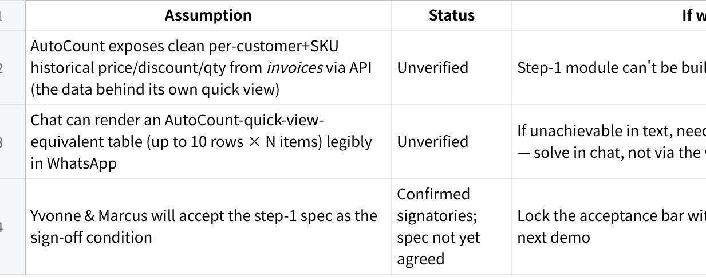

**点击图片可查看完整电子表格**

**Open decisions (need an explicit call)**

**How to reach chat parity with AutoCount\'s quick view** --- text table vs. table-as-image rendering in WhatsApp. (Decided: *not* by routing to a separate web interface.)

**Block level** --- confirmed at DO + Cash Sale (not Quotation/SO) per AutoCount screenshots; lock this in the spec.

**UAT sign-off** --- authority resolved (Yvonne & Marcus); still need a written acceptance plan + date.

**Min-price block** --- get Azib\'s screenshot + role-bypass rules; spec separately from credit control.
