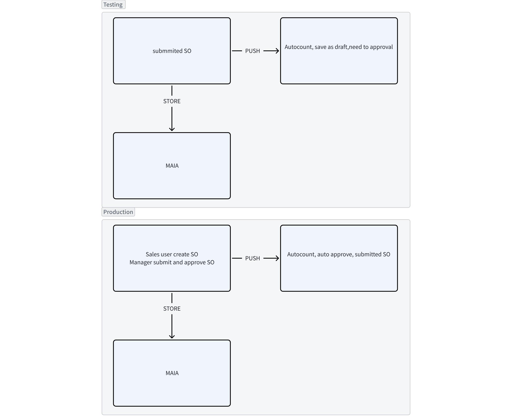

**Fixguru Autcount Integration**

\@Muhammad Azib Iqbal Bin Harun

**Doctype**

Doctype need to return external ID

**Pull after the cut-off date**

Clarify with the client

QTN

SO

SI

CN

DN

RN

DO

Payment Entry

~~Delivery Method - need to test~~

Stock Balance

Stock Recon 12 am & 7 am

Warehouse TBC

~~Shelf in DO~~

UOM

**Pricing**

Min/Max pricing

Historical pricing

Get historical pricing and discounts from the price historical report

Based on the debtor code and the item

Custom endpoint to pull the data

~~No need to access it from the doctype~~

{width="5.75in" height="4.71875in"}

**Master Data**

Item

BOM - Scoped

Volume - Pulled

Volume UOM - Need tbc

Need to return item code into MAIA as SKU

Confirm chatbot can surface it out

Customer

General Tab - billing contact, billing address, delivery address

Contact Tab - shipping contact, can be multiple

Branch - shipping address, contact, can be multiple

Credit Limit

Credit limit approval was implemented before , need to retest,

Unpaid invoice & active customer , latest and recent doctype - clarify with client the flow

Pro \> do \> inv need inv to knock off , limit

**PDF template**

Those submitted doctype (PI, SI, DO) pulled from Autocount - Done

For draft doctype in MAIA, get html from the external template

Fe side, refactor to add internal or external template, not sure want to override the native template ( fixguru got multiple templates)

Itemised vision

2-3 months

Prompt 2-3 month if dont buy

Customer dont commit

Past 1 month

Last year feb

Qtn = lookup

So = last inv

invoice

Purchasing 4 decimal

Einv 4 dec, report limit to show only 2 dec

Latest 3 transaction for historical pricing

Search Customer with phone number
