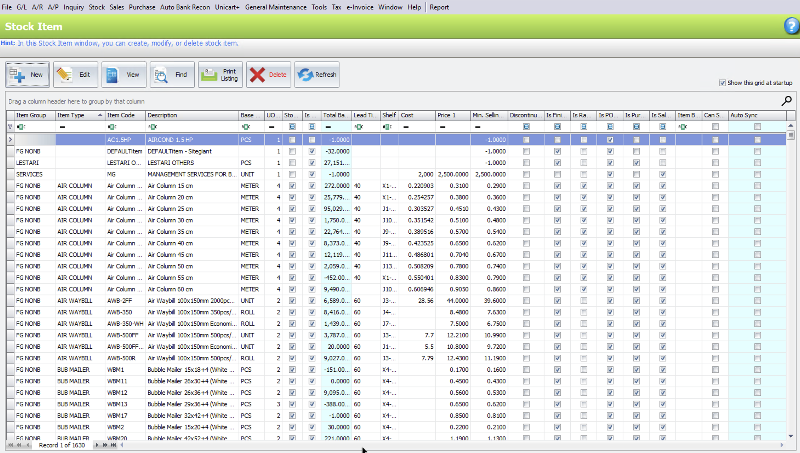
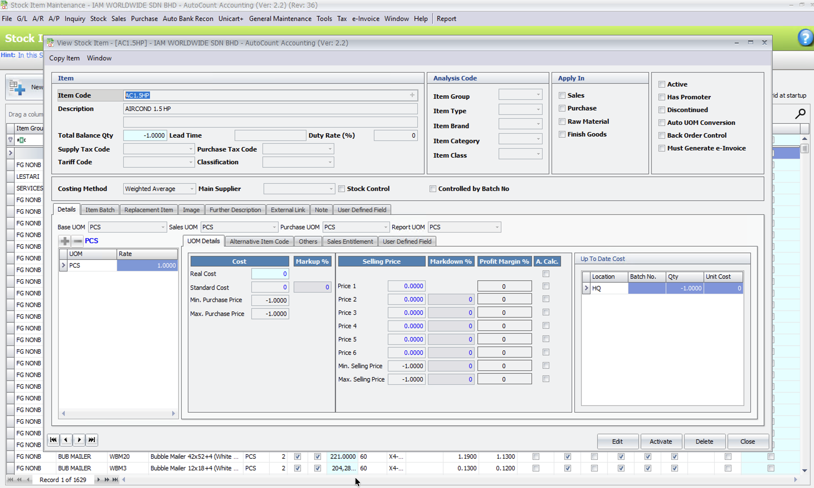
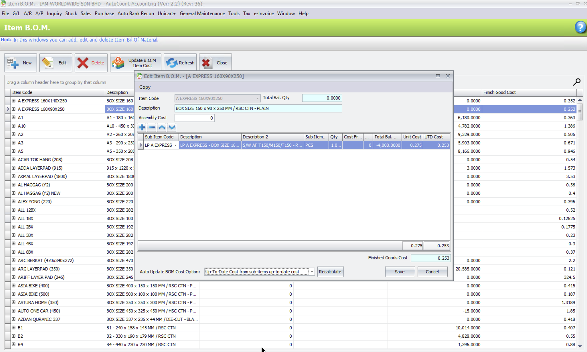
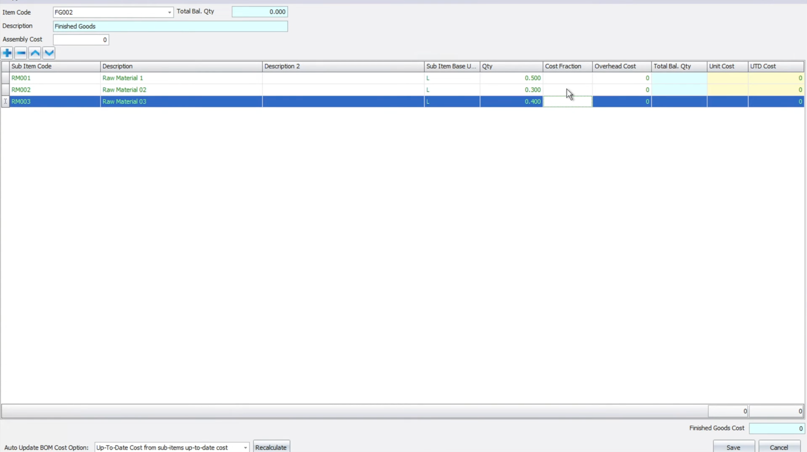
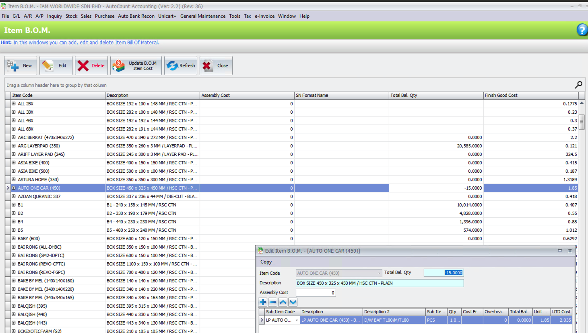
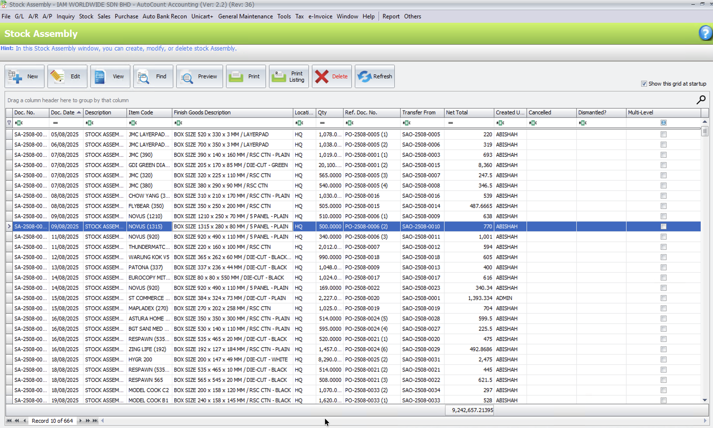
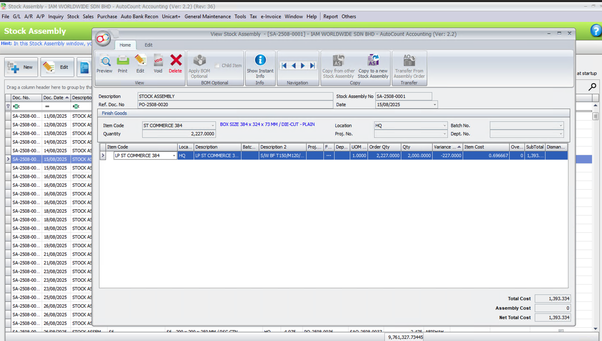
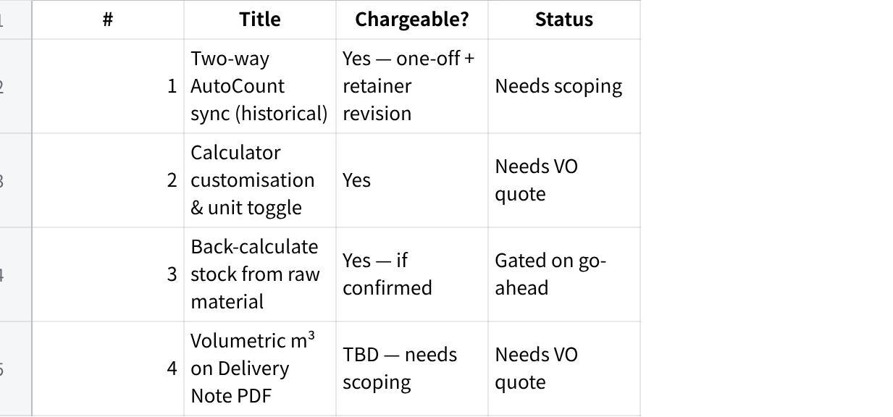

**Fixguru CR Scoping**

**CR Scoping --- Fixguru (IAM Worldwide Sdn Bhd)**

Change requests raised by Fixguru that fall outside the signed SOW scope. Each CR is assessed against the baseline SOW and scoped for commercial discussion.

1\. **Two-Way AutoCount Sync (Historical Records)**

Pre-cutoff AutoCount documents to be brought into MAIA as historical records. SOW covers EOD sync from go-live onward only. This is a one-off migration executed at production launch --- does not block UAT.

**1.1 Historical Document Migration**

**Platform:** AutoCount integration layer + MAIA data store

**Features:**

**Historical Document Import:** Ingest all pre-cutoff AutoCount documents into MAIA as read-only historical records. Document types to be confirmed with Fixguru (Invoices, Credit Notes, Receipts).

**Cut-Off Date Mapping:** Records imported with their original AutoCount dates and document numbers to preserve chronological order and document reference integrity.

**One-Off Migration Run:** Migration executed once at production go-live. After migration, all new documents flow through the standard EOD sync covered in the SOW.

**Post-Migration Sanitization:** Mindhive performs a sanitization check after import --- row counts and duplicate verification --- to confirm data integrity before handover to Fixguru.

2\. **Calculator Policy Customisation & Unit Toggle**

[ALL 7 custom calculator](https://eg69120xnei.sg.larksuite.com/drive/folder/OY2qfRXc0llEwidX2ymlUpaPgmJ)

Updated transformation ratios and unit toggle (cm ↔ inches) required on the Custom Box Quotation Module. SOW covered original IAM-provided logic only --- updated ratios, new builds, and unit toggling are new scope.

**2.1 Calculator Revision**

**Platform:** MAIA Web Workspace --- Custom Box Quotation Module

**Features:**

**Existing Calculator Update:** Revise 2 outdated calculators with Fixguru\'s updated transformation ratio logic per the updated Excel models provided by Fixguru.

**2.2 New Calculator Build**

**Platform:** MAIA Web Workspace --- Custom Box Quotation Module

**Features:**

**New Calculator Build:** Build 5 new calculators with new logic and UI configuration per Fixguru\'s updated Excel models.

**2.3 Unit Toggle (cm ↔ inches)**

**Platform:** MAIA Web Workspace --- Custom Box Quotation Module

**Features:**

**Unit System Toggle:** Add a toggle to the calculator interface allowing users to switch input units between centimetres and inches across all calculators.

3\. **Raw-to-Finished Conversion with Stock Visibility and Yield Variance**

Raw materials (e.g. sheetboard) are converted into finished custom box units via Stock Assembly. Both stock types must be tracked independently. Sales team uses remaining raw material stock to calculate producible quantity and decide order commitment. Actual yield may differ from BOM output (e.g. 3900 vs 4000 expected) --- shortfall must be visible to decide whether to adjust the Delivery Order, give FOC units, or re-order. SOW covers document and stock item sync only; BOM data, yield tracking, and dual-stock visibility are new scope.

**3.1 AutoCount BOM and Stock Data Sync Extension**

**Platform:** AutoCount integration layer (extending the existing sync)

**Features:**

**Finished Good Item Sync:** Pull the list of finished good items with an active BOM record from AutoCount.

**BOM Transformation Ratio Sync:** Pull the BOM composition for each finished good --- raw material components and the quantity of raw material required per unit of finished good produced.

**Raw Material Stock Level Sync:** Pull the current on-hand stock quantity per raw material item from AutoCount, synced on the existing daily schedule.

**Finished Good Stock Level Sync:** Pull the current on-hand stock quantity per finished good item from AutoCount, synced on the existing daily schedule.

**3.2 Stock Visibility and Conversion Planner**

**Platform:** Logistics Workspace --- Stock Conversion Module

**Features:**

**Dual Stock View:** MAIA displays current on-hand stock for both the raw material and the corresponding finished good side by side, so the team can assess total fulfillable quantity at a glance.

**Multi-Box Raw Material Visibility:** A single raw material purchase may be size-matched and allocated across multiple finished good box types. MAIA surfaces which finished goods each raw material stock can support, allowing the team to plan allocation across box types before committing to orders.

**Producible Quantity Calculation:** From the remaining raw material stock and the BOM transformation ratio, MAIA calculates how many additional finished good units can be produced, supporting order commitment decisions.

**Conversion Entry:** Operator records the raw material quantity consumed and the actual finished good quantity produced for a production run.

**Expected Output Calculation:** MAIA calculates the BOM-implied expected output from the consumed raw material quantity and the transformation ratio.

**Yield Variance Display:** MAIA surfaces the variance between expected and actual output --- unit loss is shown explicitly against the BOM-implied result, enabling the team to decide whether to adjust the Delivery Order quantity to actual, give FOC units, or initiate a re-order based on the size of the shortfall.

**Last Sync Timestamp:** MAIA displays the last data sync timestamp so users understand the data freshness.

**Stock Item Maintenance**

  -------------------------------------------------------------------------------------------------- ------------------------------------------------------------------------------------------------
   {width="2.78125in" height="1.5833333333333333in"}   {width="2.625in" height="1.5729166666666667in"}

  -------------------------------------------------------------------------------------------------- ------------------------------------------------------------------------------------------------

**What this feature is about**\
SIM is the **item master**: all finished goods, semi‑finished goods, and raw materials are created and maintained here. It controls item codes, UOM, costing method, and basic stock attributes used everywhere else.

**Purpose (for scoping)**

Define the canonical identity of items that will appear in BOM, Assembly Orders, and Stock Assembly.

Ensure all downstream documents reference the same item records for quantity and costing.

**Typical user actions**

Create/edit finished goods (e.g. NOVUS box).

Create/edit components/semi‑finished items (e.g. LP NOVUS, inner packs, materials).

Set UOM, item group, default location, costing method, active/inactive status.

**How SIM passes context forward**

**Item BOM Maintenance** can only select items defined in SIM (for both BOM parent and BOM components).

**Stock Assembly Order** and **Stock Assembly** can only assemble items that exist in SIM; their lines reference SIM item codes and inherit description, UOM, costing behaviour.

In other words, SIM is the **shared master** that keeps item identity consistent across all BOM and assembly documents.

**Item B.O.M.**

  ------------------------------------------------------------------------------------------------- -------------------------------------------------------------------------------------------------------------
   {width="2.6041666666666665in" height="1.5625in"}   {width="2.8020833333333335in" height="1.5729166666666667in"}

  ------------------------------------------------------------------------------------------------- -------------------------------------------------------------------------------------------------------------

{width="4.770833333333333in" height="2.7083333333333335in"}

**What it is**\
Item BOM is the master definition of how a finished good is produced. It tells AutoCount:

What components are needed.

In what quantity per finished unit.

At what cost, to derive the finished good\'s production cost.

**How the client uses it**\
The client maintains one BOM per finished box size (e.g. AUTO ONE CAR (450), NOVUS (1315), B1, B2). Their setup is a straightforward **1:1 conversion**:

Each finished carton requires **one LP (inner pack / semi-finished item)** as its only component.

No overhead cost and no assembly cost are configured.

This means their production is a **repackaging step,** converting a semi-finished LP item into a finished carton.

**How costing works through BOM**\
BOM is not just a recipe; it is also the **costing engine** for finished goods:

Finish Good Cost = Component UTD Cost × BOM Qty.

Since overhead and assembly cost = 0, finished carton cost equals LP cost directly (e.g. LP AUTO ONE CAR = 1.85 → finished AUTO ONE CAR = 1.85).

When LP costs change (supplier price revision or new purchase), user clicks **Update BOM Item Cost** to recalculate and push updated cost across all finished goods at once.

This updated cost then flows into every subsequent Stock Assembly, ensuring Net Total Cost always reflects the latest material cost.

Fixguru one-to-many ratio item SKU

**Stock Assembly - SA**

  ------------------------------------------------------------------------------------------------ --------------------------------------------------------------------------------------------------
   {width="2.625in" height="1.5729166666666667in"}   {width="2.78125in" height="1.5833333333333333in"}

  ------------------------------------------------------------------------------------------------ --------------------------------------------------------------------------------------------------

In this Stock Assembly, variance happens because **actual quantity consumed is different from the BOM/order quantity**, and AutoCount shows that difference in the **Variance Qty** column so users can see and post the real usage.

The BOM (and/or Assembly Order) says for finished good **ST COMMERCE 384** they should use **2,227.000** units of component **LP ST COMMERCE 384** (Order Qty = 2,227.000).

In reality, they only consume **2,000.000** units (Qty = 2,000.000). AutoCount auto‑calculates **Variance Qty = 2,000.000 − 2,227.000 = −227.000**, which appears as **−227.000** in the grid for that line.

The system still calculates **SubTotal** and **Total Cost** based on the actual Qty of 2,000.000 × Item Cost 0.696667, giving Total Cost / Net Total Cost of 1,393.334 at the bottom; this means cost is aligned with what they really used, not the original planned quantity.

So the typical user workflow is:

Start from BOM/Assembly Order → system fills **Order Qty**.

On production completion, user edits **Qty** to match actual consumption (here 2,000.000 instead of 2,227.000).

AutoCount computes **Variance Qty** and cost based on actual Qty; user posts the Stock Assembly, which updates stock and cost and keeps the variance visible for review or reporting.

4\. **Volumetric (m³) Field on Delivery Note PDF**

Volumetric (m³) field required on the Delivery Note. Item weight and volume stored as master data per SKU in AutoCount. MAIA syncs these fields and surfaces volumetric calculations on the Delivery Note and its PDF output. How much load can fit into the lorry?

**4.1 AutoCount Weight and Volume Sync Extension**

**Platform:** AutoCount integration layer (extending the existing item master sync)

**Features:**

**Weight and Volume Field Sync:** Extend the AutoCount item master sync to include weight, volume, volume UOM, and volume per unit fields stored per SKU in Stock Item.

**4.2 Delivery Note Volumetric Update**

**Document:** Delivery Note (document and PDF output)

**Features:**

**Volumetric Line Column:** Display qty × item volume per Delivery Note line item, mirroring the AutoCount \"IAM Delivery Order\" formula field logic.

**Volumetric Total:** Aggregate line-level volumetric values into a total on the Delivery Note.

**PDF Output:** Volumetric fields, including volume and volume UOM, are surfaced on the Delivery Note PDF. Output is rendered via IAM\'s AutoCount PDF template.

**Summary Table**

**点击图片可查看完整电子表格**
