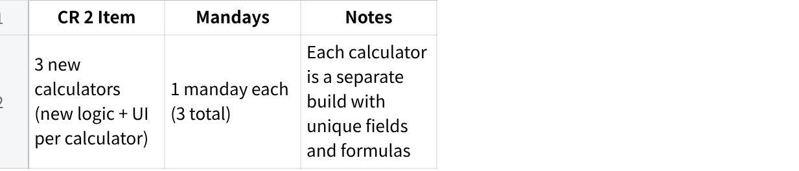
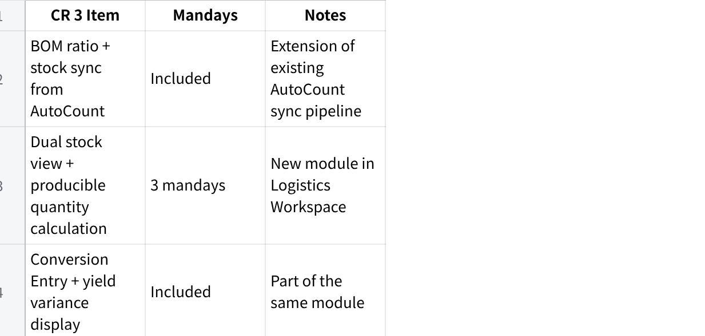
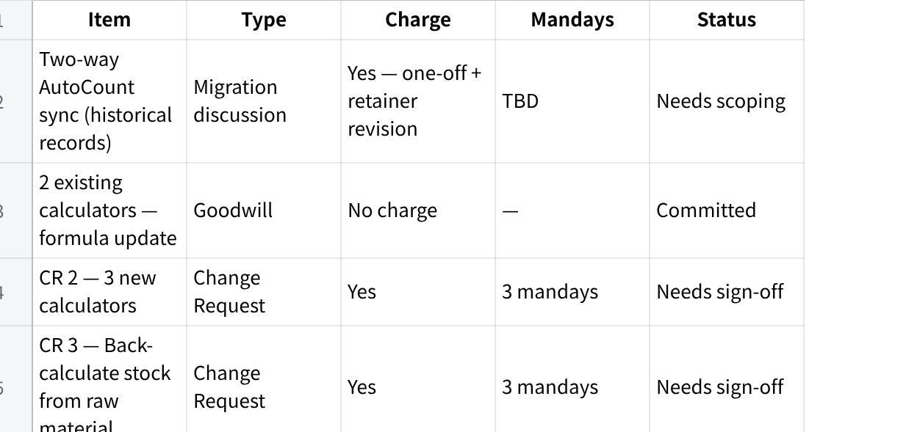

**Fixguru CR brief**

**CR Scoping Presentation --- Fixguru (2026-05-26)**

**Meeting Purpose:** Align with Fixguru on 2 change requests (CR 2 & CR 3) and discuss 1 outstanding migration topic (historical sync) ahead of commercial next steps.

**Reference:** See CR Scoping --- Fixguru for full feature breakdown.

**Agenda**

Context --- what is a CR and why it matters

Discussion --- Two-Way AutoCount Sync (Historical Records)

CR 2 --- Calculator Policy Customisation & Unit Toggle

CR 3 --- Back-Calculate Stock from Raw Material

Commercial summary and next steps

**What Is a Change Request (CR)?**

A CR covers work that falls outside the original signed SOW. It is not a complaint --- it reflects how requirements evolve as the team gets hands-on with the system. Each CR is assessed, scoped, and priced separately before any build begins.

**Discussion Item --- Two-Way AutoCount Sync (Historical Records)**

This is not a CR --- it is a pre-go-live migration topic that needs alignment before production launch. Pre-cutoff AutoCount documents (Invoices, Credit Notes, Receipts) need to be brought into MAIA as read-only historical records. The signed SOW covers EOD sync from go-live onward only; this one-off migration is outside that scope and needs to be scoped separately.

**Key points:**

One-off migration executed once at production go-live --- does not block UAT

Document types to confirm with Fixguru: Invoices, Credit Notes, Receipts

Mindhive performs post-migration sanitization (row count + duplicate check) before handover

Chargeable: Yes --- one-off migration fee + retainer revision

**CR 2 --- Calculator Policy Customisation & Unit Toggle**

The original RSC and Die Cut calculators were built and delivered per the signed SOW. As Fixguru\'s box designs and material costs evolve, their calculator logic needs to keep up --- and they now need additional calculator types that were not part of the original build.

**What\'s covered under this CR:**

**Goodwill (no charge) --- Formula Updates to Existing Calculators**\
The 2 existing calculators (RSC and Die Cut) have updated transformation ratios per Fixguru\'s latest Excel models. Mindhive will apply these formula updates at no additional cost as a goodwill gesture, since this is a maintenance-level change to work already delivered.

**CR 2 (Chargeable) --- 3 New Calculators**\
Beyond the 2 existing calculators, Fixguru needs 3 additional calculator types that cover new box configurations not previously built. Each requires a new UI, new input fields, and new calculation logic built from the ground up.

**点击图片可查看完整电子表格**

**Total CR 2 estimate: 3 mandays**

**CR 3 --- Back-Calculate Stock from Raw Material**

When the sales team receives an order, they need to know: **how many finished boxes can we still produce from the raw material (sheetboard / LP inner packs) we have on hand?** Currently this requires manual checking in AutoCount across two separate item types --- raw material stock and finished good stock --- with no single view in MAIA.

After a production run, actual yield often differs from what the BOM says (e.g. 3,900 boxes produced vs 4,000 expected). That shortfall needs to be visible immediately so the team can decide whether to adjust the Delivery Order quantity, offer FOC units to the customer, or initiate a re-order.

**What Fixguru gets:**

Raw material stock and finished good stock visible side by side in MAIA

Calculated view of how many more finished boxes can be produced from remaining raw stock

Ability to record each production run (raw consumed vs finished goods produced)

Variance display between expected and actual output --- so the team can act on shortfalls immediately

**点击图片可查看完整电子表格**

**Total CR 3 estimate: 3 mandays**

**Commercial Summary**

**点击图片可查看完整电子表格**

**Meeting Notes**

*To be filled during / after session.*

**Attendees:**

**Decisions:**

**Actions:**

**点击图片可查看完整电子表格**
