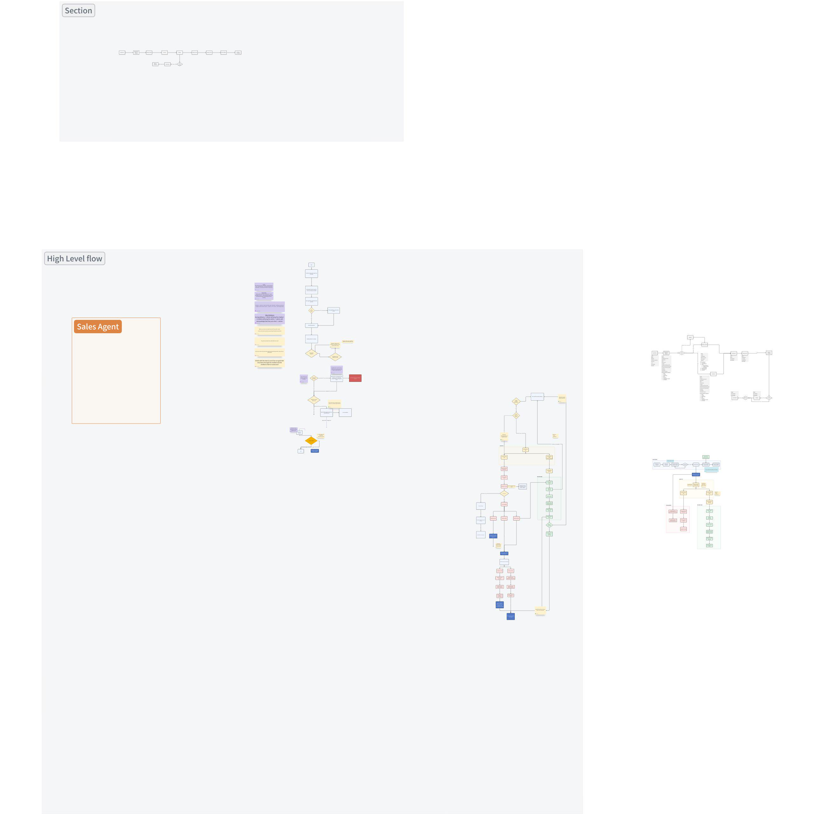
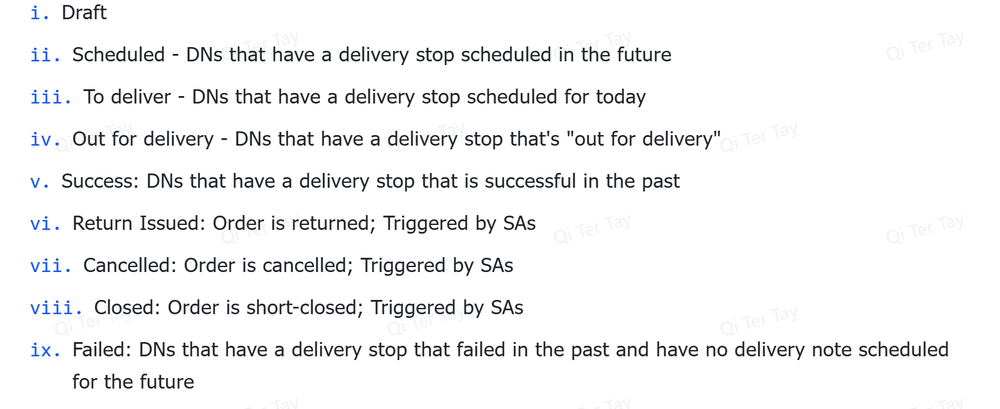
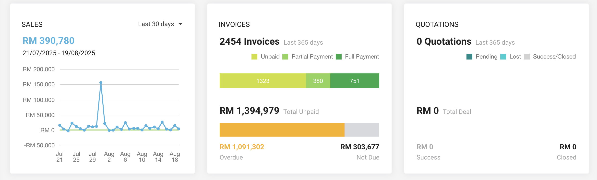
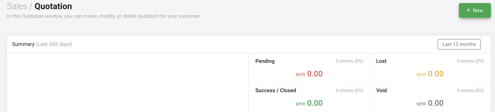
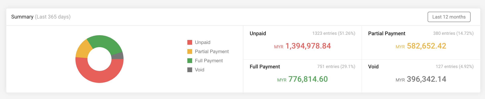
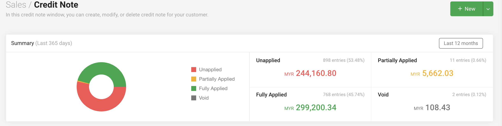
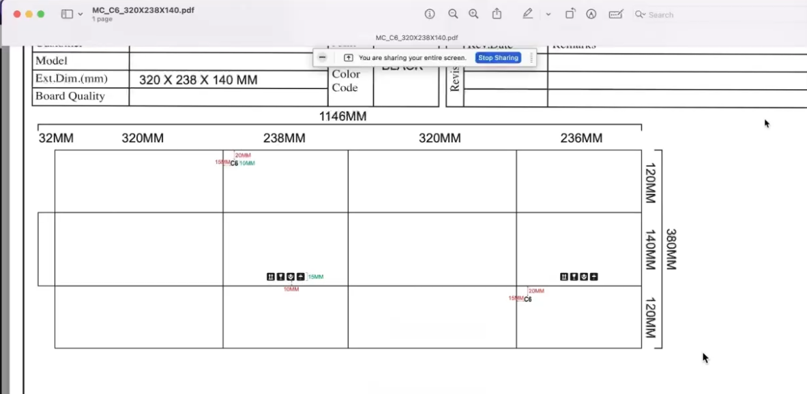

**Fixguru Functional Requirements**

**Notes (20/8/2025)**

Create customer profile in Autocount

We sync from autocount

Reminder messages:

Digest needs to have a summary of what are the remaining tasks

Check with clients on the data they want in the dashboard

Build the data part (check with them on what the threshold is)

Customer order quantity drop

Change SKU

Customer order amount drop

**Simplified System and Document Flow**

**Mermaid**

  ----------------------------------------------------------------------------------------------------------------------------
  flowchart TD\
  \
  %% ===== START =====\
  START(\[Start: Customer contacts Sales via WhatsApp\])\
  \
  %% ===== ORDER CAPTURE & QUOTATION =====\
  subgraph A \[Order Capture & Quotation\]\
  A1\[Sales forwards chats and files to Chatbot\]\
  A2\[Chatbot drafts Quotation and Pro-forma Invoice\]\
  A3{Price below minimum OR custom box profit check fails?}\
  A4\[Management approval for quotation\]\
  A5\[Quotation issued\]\
  A6((Reminder: quotation not converted to Sales Order in 7 days))\
  A7((Reminder: follow up on open quotations))\
  end\
  \
  START \--\> A1 \--\> A2 \--\> A3\
  A3 \-- Yes \--\> A4 \--\> A5\
  A3 \-- No \--\> A5\
  A5 -. triggers .-\> A6\
  A5 -. triggers .-\> A7\
  \
  %% ===== PAYMENT & CREDIT CHECK =====\
  subgraph B \[Payment and Credit Check\]\
  B1\[Agent uploads payment proof: bank, card, cash, QR, TNG\]\
  B2{Customer type?}\
  B3\[Sales Admin updates status via WhatsApp: Order or Invoice ID + PAID or COD\]\
  B4\[Validate payment record\]\
  B5\[Check credit limit and credit term\]\
  B6{Credit limit exceeded?}\
  B7\[Management approval required to create Sales Order\]\
  B8{Credit term nearing deadline?}\
  B9((Reminder: credit term approaching))\
  B10((Reminder: outstanding payment before DO))\
  B11\[Sales Order ready\]\
  end\
  \
  A5 \--\> B1 \--\> B2\
  B2 \-- Cash or COD \--\> B3 \--\> B4 \--\> B11\
  B2 \-- Credit term \--\> B5 \--\> B6\
  B6 \-- Yes \--\> B7 \--\> B11\
  B6 \-- No \--\> B8\
  B8 \-- Yes \--\> B9 \--\> B11\
  B8 \-- No \--\> B11\
  B4 -. triggers .-\> B10\
  \
  %% ===== DO & INVOICE GENERATION =====\
  subgraph C \[DO and Invoice Generation\]\
  C1\[Generate Pro-forma Invoice and Delivery Order on confirmation\]\
  C2{DO items match Pro-forma?}\
  C3\[Approval required for DO changes or mismatch\]\
  C4\[DO confirmed\]\
  end\
  \
  B11 \--\> C1 \--\> C2\
  C2 \-- No \--\> C3 \--\> C4\
  C2 \-- Yes \--\> C4\
  \
  %% ===== CUT-OFF & SCHEDULING =====\
  subgraph D \[Cut-off and Scheduling\]\
  D1{Confirmed at or before 2 PM?}\
  D2\[Route to next-day delivery\]\
  D3\[Roll to following schedule\]\
  end\
  \
  C4 \--\> D1\
  D1 \-- Yes \--\> D2\
  D1 \-- No \--\> D3\
  \
  %% ===== PICKING & ROUTING =====\
  subgraph E \[Picking and Routing\]\
  E1\[Ops receives digital picking list\]\
  E2\[Pack items; update stock via AutoCount\]\
  E3{Out of stock?}\
  E4((Reminder: stock availability to Sales))\
  E5\[Offline picking completion update if needed\]\
  E6\[Finalize routes by end of day\]\
  end\
  \
  D2 \--\> E1\
  D3 \--\> E1\
  E1 \--\> E2 \--\> E3\
  E3 \-- Yes \--\> E4 \--\> E5 \--\> E6\
  E3 \-- No \--\> E5 \--\> E6\
  \
  %% ===== DISPATCH & PROOF OF DELIVERY =====\
  subgraph F \[Dispatch and Proof of Delivery\]\
  F1\[Driver receives DO and route\]\
  F2\[Deliver goods\]\
  F3\[Driver uploads photo proof via chatbot\]\
  F4\[Bot returns proof image to Sales within 5 minutes\]\
  end\
  \
  E6 \--\> F1 \--\> F2 \--\> F3 \--\> F4\
  \
  %% ===== NIGHTLY SYNC & INVOICING =====\
  subgraph G \[Nightly Sync and Invoicing at 23:00\]\
  G1\[ERP pushes daily transactions to AutoCount: customers, products, invoices, receipts, credit notes, payment vouchers\]\
  G2((Sync quality target: at most 0.1 percent failed over 30 day UAT))\
  G3{DO completed and no dispute?}\
  G4\[Auto convert DO to Sales Invoice\]\
  G5((Reminder: Sales to send invoice copy to customer))\
  end\
  \
  F4 \--\> G1 \--\> G2 \--\> G3\
  G3 \-- Yes \--\> G4 \--\> G5\
  G3 \-- No \--\> G1\
  \
  %% ===== GLOBAL REMINDERS =====\
  subgraph H \[Reminders Engine\]\
  H1((Quotation to DO more than 7 days))\
  H2((Customer inactivity 30 / 60 / 90 days))\
  H3((Outstanding payments: cash before DO or credit term nearing))\
  H4((Delivery status reminders))\
  H5((Sales order status reminders))\
  H6((Send invoice copy after DO to Invoice))\
  end\
  \
  A5 -. global .-\> H1\
  B8 -. global .-\> H3\
  B4 -. global .-\> H3\
  E3 -. global .-\> H5\
  D2 -. global .-\> H4\
  D3 -. global .-\> H4\
  G4 -. global .-\> H6\
  START -. periodic scan .-\> H2\
  \
  %% ===== APPROVALS ENGINE =====\
  subgraph I \[Approvals Engine\]\
  I1\[Quotation below min price or custom box profit rule\]\
  I2\[Credit limit exceeded\]\
  I3\[DO not equal to Pro-forma items\]\
  I4\[Management approval queue\]\
  end\
  \
  A3 \-- Yes \--\> I1 \--\> I4\
  B6 \-- Yes \--\> I2 \--\> I4\
  C2 \-- No \--\> I3 \--\> I4\
  \
  %% ===== INTEGRATIONS =====\
  subgraph J \[Integrations\]\
  J1\[Maia and AutoCount push or pull end of day\]\
  J2\[Chatbot to Maia real time SO DO Invoice Quotation\]\
  J3\[Payment channels pull on event\]\
  J4\[Lalamove API push on demand\]\
  J5\[WhatsApp Business API deployment\]\
  end\
  \
  A1 -. uses .-\> J5\
  B4 -. validates via .-\> J3\
  B5 -. uses .-\> J2\
  C1 -. writes to .-\> J2\
  E2 -. stock via .-\> J1\
  G1 -. nightly .-\> J1\
  D2 -. optional .-\> J4\
  D3 -. optional .-\> J4\
  \
  %% ===== DASHBOARD & ANALYTICS =====\
  subgraph K \[Dashboard and Analytics\]\
  K1\[Overall sales KPIs\]\
  K2\[Outstanding payments\]\
  K3\[Quotation to DO pipeline and delays\]\
  K4\[On time delivery target 95 percent\]\
  end\
  \
  G4 \--\> K1\
  B11 \--\> K3\
  H1 \--\> K3\
  H3 \--\> K2\
  D2 \--\> K4\
  D3 \--\> K4\
  \
  %% ===== SLA & SUPPORT =====\
  subgraph L \[SLA and Support\]\
  L1((Availability 99.5 percent excluding planned))\
  L2((Planned maintenance: 24 hr notice))\
  L3{Issue impact?}\
  L4\[Critical: respond 2h, resolve or workaround 8h\]\
  L5\[Major: respond 4h, resolve 1 business day\]\
  L6\[Minor: respond 1 business day, resolve 3 business days\]\
  L7\[Performance monitoring and fix within 24h\]\
  L8\[Unplanned downtime: prompt comms and plan\]\
  end\
  \
  K1 -. ops monitors .-\> L7\
  START -. runtime .-\> L1\
  L1 \--\> L2\
  L1 \--\> L3\
  L3 \-- Critical \--\> L4\
  L3 \-- Major \--\> L5\
  L3 \-- Minor \--\> L6\
  L1 \--\> L8\
  \
  %% ===== REFUND POLICY =====\
  subgraph M \[Refund Policy\]\
  M1{Core requirements unmet after SLA remediation?}\
  M2\[Fixguru submits written notice within 14 business days\]\
  M3\[Good faith remediation attempts by Mindhive\]\
  M4{Still unresolved?}\
  M5\[Refund assessment by milestones or deliverables\]\
  M6\[100 percent refund if failure to go live post UAT\]\
  M7\[Partial refund proportional to unmet scope\]\
  M8((Exclusions: delays by Fixguru, scope changes, force majeure, third party failures))\
  M9\[Process agreed refund within 30 days\]\
  end\
  \
  L4 \--\> M1\
  L5 \--\> M1\
  L6 \--\> M1\
  M1 \-- Yes \--\> M2 \--\> M3 \--\> M4\
  M4 \-- Yes \--\> M5 \--\> M6 \--\> M9\
  M5 \--\> M7 \--\> M9\
  M1 \-- No \--\> ENDOK(\[Project OK - No Refund\])\
  M8 -. applies .-\> M1\
  \
  %% ===== TIMELINE & COMMERCIALS =====\
  subgraph N \[Timeline and Commercials\]\
  N1((Week 1: Requirements finalisation))\
  N2((Week 2: Development starts))\
  N3((Week 6: UAT starts))\
  N4((Milestone 1: Project confirmation 50 percent RM 24,000))\
  N5((Milestone 2: UAT completion 50 percent RM 24,000))\
  N6((Monthly: OpenAI and platform approx RM 1,000 usage based plus server RM 200))\
  end\
  \
  START \--\> N1 \--\> N2 \--\> N3\
  N1 \--\> N4\
  N3 \--\> N5\
  N5 \--\> N6\
  \
  %% ===== END =====\
  G5 \--\> END(\[End: Invoice sent and records synced\])

  ----------------------------------------------------------------------------------------------------------------------------

**Diagram**

{width="5.75in" height="5.75in"}

**Functional Requirements**

**User Account & System Controls**

+:--------------------------------------+:--------------------------------------------------------------------------------------------+
| Components                            | Description                                                                                 |
+---------------------------------------+---------------------------------------------------------------------------------------------+
| User Authentication and Authorization | Login screen with secure authentication (email + password).                                 |
|                                       |                                                                                             |
|                                       | Change password and forget password                                                         |
|                                       |                                                                                             |
|                                       | Display error message below the input field when user inputs the wrong login credentials    |
|                                       |                                                                                             |
|                                       | For Managers/Admins, able to access the Users List View and Users Detailed View             |
+---------------------------------------+---------------------------------------------------------------------------------------------+
| Users List View                       | Able to search for users using the search bar.                                              |
|                                       |                                                                                             |
|                                       | Able to sort users by full name, email, or contact number.                                  |
|                                       |                                                                                             |
|                                       | Able to bulk delete users                                                                   |
|                                       |                                                                                             |
|                                       | Able to add a new user.                                                                     |
|                                       |                                                                                             |
|                                       | Able to contact a user via WhatsApp (quick actions).                                        |
|                                       |                                                                                             |
|                                       | Able to send an email to a user (quick actions).                                            |
|                                       |                                                                                             |
|                                       | Able to edit user information (modal popup).                                                |
|                                       |                                                                                             |
|                                       | Able to navigate between pages using pagination controls.                                   |
|                                       |                                                                                             |
|                                       | Able to change the number of users displayed per page.                                      |
+---------------------------------------+---------------------------------------------------------------------------------------------+
| Users Detailed View                   | Able to return to the main User Management page using the \"Back to User Management\" link. |
|                                       |                                                                                             |
|                                       | Able to upload or change the user\'s profile picture.                                       |
|                                       |                                                                                             |
|                                       | Able to edit the user\'s first name.                                                        |
|                                       |                                                                                             |
|                                       | Able to edit the user\'s last name.                                                         |
|                                       |                                                                                             |
|                                       | Able to edit the user\'s email address.                                                     |
|                                       |                                                                                             |
|                                       | Able to edit the user\'s mobile number.                                                     |
|                                       |                                                                                             |
|                                       | Able to assign or unassign roles to the user using checkboxes.                              |
|                                       |                                                                                             |
|                                       | Able to save the changes made to the user\'s information.                                   |
|                                       |                                                                                             |
|                                       | Able to delete the user.                                                                    |
+---------------------------------------+---------------------------------------------------------------------------------------------+
| Landing Page                          | User will reach this landing page after logging in                                          |
|                                       |                                                                                             |
|                                       | They will be able to see 1-3 workspaces, depending on their role:                           |
|                                       |                                                                                             |
|                                       | Sales Agent (Desktop)                                                                       |
|                                       |                                                                                             |
|                                       | Logistics (Desktop)                                                                         |
|                                       |                                                                                             |
|                                       | Driver (Desktop/Mobile)                                                                     |
|                                       |                                                                                             |
|                                       | Clicking on a workspace brings you to the homepage of each workspace                        |
|                                       |                                                                                             |
|                                       | Sales homepage: Sales Order list view page                                                  |
|                                       |                                                                                             |
|                                       | Logistics homepage: Delivery Note/Trip list view page                                       |
|                                       |                                                                                             |
|                                       | Driver homepage: Today\'s delivery list view page                                           |
+---------------------------------------+---------------------------------------------------------------------------------------------+
| Account settings                      | Able to upload or change profile picture.                                                   |
|                                       |                                                                                             |
|                                       | Able to edit first name.                                                                    |
|                                       |                                                                                             |
|                                       | Able to edit last name.                                                                     |
|                                       |                                                                                             |
|                                       | Able to edit email address.                                                                 |
|                                       |                                                                                             |
|                                       | Able to edit mobile number.                                                                 |
|                                       |                                                                                             |
|                                       | Able to change password.                                                                    |
|                                       |                                                                                             |
|                                       | Able to save the changes made.                                                              |
+---------------------------------------+---------------------------------------------------------------------------------------------+

+:----------+:-----------------:+:----------:+:---------------------:+:----------:+:----------:+
| Statuses  | Allowed Actions   |            |                       |            |            |
|           +-------------------+------------+-----------------------+------------+------------+
|           | **Edit and Save** | **Submit** | **Delete**            | **Cancel** | **Export** |
+-----------+-------------------+------------+-----------------------+------------+------------+
| Draft     | Yes               | Yes        | Yes                   | No         | Yes        |
+-----------+-------------------+------------+-----------------------+------------+------------+
| Non-draft | Usually no        | No         | No (except Customers) | Yes        | Yes        |
+-----------+-------------------+------------+-----------------------+------------+------------+

**Reminder Engine**

+:-------------------------------------------------+:-------------------------------------------------------------+:------------------------------------+
| Components                                       | Condition                                                    | Reminder to whom?                   |
+--------------------------------------------------+--------------------------------------------------------------+-------------------------------------+
| Quotation not converted to SO after 7 days.      | Quotation not completed \> 7 days                            | Sales agent                         |
+--------------------------------------------------+--------------------------------------------------------------+-------------------------------------+
| SO not converted to DO after 7 days.             | Sales order not completed \> 7 days                          |                                     |
+--------------------------------------------------+--------------------------------------------------------------+-------------------------------------+
| Stock availability reminders                     | When stock reaches lower x amount (clarify with clients)     | Sales Agent, Management, Operations |
|                                                  |                                                              |                                     |
|                                                  | When stock is OOS(Out of stock)                              |                                     |
+--------------------------------------------------+--------------------------------------------------------------+-------------------------------------+
| Delivery status reminders (to Sales team).       | When Do is created                                           | Sales agent                         |
|                                                  |                                                              |                                     |
|                                                  | When Picklist is completed                                   |                                     |
|                                                  |                                                              |                                     |
|                                                  | When delivery loaded                                         |                                     |
|                                                  |                                                              |                                     |
|                                                  | When delivery is Out for delivery                            |                                     |
|                                                  |                                                              |                                     |
|                                                  | When Delivery is completed                                   |                                     |
+--------------------------------------------------+--------------------------------------------------------------+-------------------------------------+
| Customer inactivity reminders (30, 60, 90 days). | No orders for \> 30 , 60 and 90 (one reminder for each)      | Sales agent                         |
+--------------------------------------------------+--------------------------------------------------------------+-------------------------------------+
| outstanding payment                              | Cash Orders                                                  | Sales agent                         |
|                                                  |                                                              |                                     |
|                                                  | Credit term customers approaching their credit term deadline |                                     |
+--------------------------------------------------+--------------------------------------------------------------+-------------------------------------+
| Reminder to send Sales Invoice to customer       | When sales invoice is created                                | Sales agent                         |
+--------------------------------------------------+--------------------------------------------------------------+-------------------------------------+
| Sync failure reminder (if EOD sync fails).       | Sends a Reminder that Syncing failled                        | Management, Sales agent, Logistics  |
+--------------------------------------------------+--------------------------------------------------------------+-------------------------------------+

**Approval Engine**

Quotation below min selling price → management approval.

Customer credit limit exceeded → management approval.

Any DO changes after SO confirmation → approval required.

DO items not matching Pro-forma invoice → approval required. Final inv

Delivery disputes flagged → approval workflow before invoice conversion.

**Sales Agent Workspace**

**Notification List**

+:----------------+:------------------------------------------+:--------------+:-------------------+:-----------------------------------------------+:---------------------+
| Doc Type        | Subject                                   | Send Alert On | Extra field        | Condition                                      | Recipients           |
+-----------------+-------------------------------------------+---------------+--------------------+------------------------------------------------+----------------------+
| Customer        | Customer {{ doc.name }} deleted!          | Method        | on_trash           | \-                                             | Sales Manager        |
|                 |                                           |               |                    |                                                |                      |
|                 |                                           |               |                    |                                                | Sales Master Manager |
|                 |                                           |               |                    |                                                |                      |
|                 |                                           |               |                    |                                                | Admin                |
+-----------------+-------------------------------------------+---------------+--------------------+------------------------------------------------+----------------------+
| Sales Invoice   | Sales Invoice {{ doc.name }} submitted!   | Submit        | \-                 | doc.is_return != 1                             | Sales User           |
|                 +-------------------------------------------+---------------+--------------------+------------------------------------------------+----------------------+
|                 | Sales Invoice {{ doc.name }} deleted!     | Method        | on_trash           | doc.is_return != 1                             | Sales Manager        |
|                 |                                           |               |                    |                                                |                      |
|                 |                                           |               |                    |                                                | Sales Master Manager |
|                 |                                           |               |                    |                                                |                      |
|                 |                                           |               |                    |                                                | Admin                |
|                 +-------------------------------------------+---------------+--------------------+------------------------------------------------+----------------------+
|                 | Sales Invoice {{ doc.name }} cancelled!   | Cancel        | \-                 | doc.is_return != 1                             | Sales Manager        |
|                 |                                           |               |                    |                                                |                      |
|                 |                                           |               |                    |                                                | Sales Master Manager |
|                 |                                           |               |                    |                                                |                      |
|                 |                                           |               |                    |                                                | Admin                |
|                 +-------------------------------------------+---------------+--------------------+------------------------------------------------+----------------------+
|                 | Sales Invoice {{ doc.name }} overdue!     | Custom        | \-                 | doc.status==\"Overdue\" and doc.is_return != 1 | Sales Manager        |
|                 |                                           |               |                    |                                                |                      |
|                 |                                           |               |                    |                                                | Sales Master Manager |
|                 |                                           |               |                    |                                                |                      |
|                 |                                           |               |                    |                                                | Admin                |
|                 |                                           |               |                    |                                                |                      |
|                 |                                           |               |                    |                                                | Sales User           |
|                 +-------------------------------------------+---------------+--------------------+------------------------------------------------+----------------------+
|                 | Credit Note {{ doc.name }} submitted!     | Submit        | \-                 | doc.is_return == 1                             | Sales Manager        |
|                 |                                           |               |                    |                                                |                      |
|                 |                                           |               |                    |                                                | Sales Master Manager |
|                 |                                           |               |                    |                                                |                      |
|                 |                                           |               |                    |                                                | Admin                |
|                 |                                           |               |                    |                                                |                      |
|                 |                                           |               |                    |                                                | Sales User           |
|                 +-------------------------------------------+---------------+--------------------+------------------------------------------------+----------------------+
|                 | Credit Note {{ doc.name }} deleted!       | Method        | on_trash           | doc.is_return == 1                             | Sales Manager        |
|                 |                                           |               |                    |                                                |                      |
|                 |                                           |               |                    |                                                | Sales Master Manager |
|                 |                                           |               |                    |                                                |                      |
|                 |                                           |               |                    |                                                | Admin                |
|                 +-------------------------------------------+---------------+--------------------+------------------------------------------------+----------------------+
|                 | Credit Note {{ doc.name }} cancelled!     | Cancel        | \-                 | doc.is_return == 1                             | Sales Manager        |
|                 |                                           |               |                    |                                                |                      |
|                 |                                           |               |                    |                                                | Sales Master Manager |
|                 |                                           |               |                    |                                                |                      |
|                 |                                           |               |                    |                                                | Admin                |
+-----------------+-------------------------------------------+---------------+--------------------+------------------------------------------------+----------------------+
|                 | Credit Note {{ doc.name }} overdue!       | Custom        | \-                 | doc.is_return == 1 and doc.status==\"Overdue\" | Sales Manager        |
|                 |                                           |               |                    |                                                |                      |
|                 |                                           |               |                    |                                                | Sales Master Manager |
|                 |                                           |               |                    |                                                |                      |
|                 |                                           |               |                    |                                                | Admin                |
|                 |                                           |               |                    |                                                |                      |
|                 |                                           |               |                    |                                                | Sales User           |
+-----------------+-------------------------------------------+---------------+--------------------+------------------------------------------------+----------------------+
| Receipt         | Receipt {{ doc.name }} submitted!         | Submit        | \-                 | doc.payment_type == \"Receive\"                | Sales User           |
|                 +-------------------------------------------+---------------+--------------------+------------------------------------------------+----------------------+
|                 | Receipt {{ doc.name }} deleted!           | Method        | on_trash           | doc.payment_type == \"Receive\"                | Sales Manager        |
|                 |                                           |               |                    |                                                |                      |
|                 |                                           |               |                    |                                                | Sales Master Manager |
|                 |                                           |               |                    |                                                |                      |
|                 |                                           |               |                    |                                                | Admin                |
|                 +-------------------------------------------+---------------+--------------------+------------------------------------------------+----------------------+
|                 | Receipt {{ doc.name }} cancelled!         | Cancel        | \-                 | doc.payment_type == \"Receive\"                | Sales Manager        |
|                 |                                           |               |                    |                                                |                      |
|                 |                                           |               |                    |                                                | Sales Master Manager |
|                 |                                           |               |                    |                                                |                      |
|                 |                                           |               |                    |                                                | Admin                |
+-----------------+-------------------------------------------+---------------+--------------------+------------------------------------------------+----------------------+
| Payment Voucher | Payment voucher {{ doc.name }} submitted! | Submit        | \-                 | doc.payment_type == \"Pay\"                    | Sales User           |
|                 +-------------------------------------------+---------------+--------------------+------------------------------------------------+----------------------+
|                 | Payment voucher {{ doc.name }} deleted!   | Method        | on_trash           | doc.payment_type == \"Pay\"                    | Sales Manager        |
|                 |                                           |               |                    |                                                |                      |
|                 |                                           |               |                    |                                                | Sales Master Manager |
|                 |                                           |               |                    |                                                |                      |
|                 |                                           |               |                    |                                                | Admin                |
|                 +-------------------------------------------+---------------+--------------------+------------------------------------------------+----------------------+
|                 | Payment voucher {{ doc.name }} cancelled! | Cancel        | \-                 | doc.payment_type == \"Pay\"                    | Sales Manager        |
|                 |                                           |               |                    |                                                |                      |
|                 |                                           |               |                    |                                                | Sales Master Manager |
|                 |                                           |               |                    |                                                |                      |
|                 |                                           |               |                    |                                                | Admin                |
+-----------------+-------------------------------------------+---------------+--------------------+------------------------------------------------+----------------------+
| Sales Order     | Sales Order {{ doc.name }} submitted!     | Submit        | \-                 | \-                                             | Sales User           |
|                 +-------------------------------------------+---------------+--------------------+------------------------------------------------+----------------------+
|                 | Sales Order {{ doc.name }} deleted!       | Method        | on_trash           | \-                                             | Sales Manager        |
|                 |                                           |               |                    |                                                |                      |
|                 |                                           |               |                    |                                                | Sales Master Manager |
|                 |                                           |               |                    |                                                |                      |
|                 |                                           |               |                    |                                                | Admin                |
|                 +-------------------------------------------+---------------+--------------------+------------------------------------------------+----------------------+
|                 | Sales Order {{ doc.name }} cancelled!     | Cancel        | \-                 | \-                                             | Sales Manager        |
|                 |                                           |               |                    |                                                |                      |
|                 |                                           |               |                    |                                                | Sales Master Manager |
|                 |                                           |               |                    |                                                |                      |
|                 |                                           |               |                    |                                                | Admin                |
|                 +-------------------------------------------+---------------+--------------------+------------------------------------------------+----------------------+
|                 | Sales Order {{ doc.name }} closed!        | Value Change  | Status (Status)    | doc.status==\"Closed\"                         | Sales Manager        |
|                 |                                           |               |                    |                                                |                      |
|                 |                                           |               |                    |                                                | Sales Master Manager |
|                 |                                           |               |                    |                                                |                      |
|                 |                                           |               |                    |                                                | Admin                |
|                 |                                           |               |                    |                                                |                      |
|                 |                                           |               |                    |                                                | Sales User           |
|                 +-------------------------------------------+---------------+--------------------+------------------------------------------------+----------------------+
|                 | Sales Order {{ doc.name }} overdue!       | Days After    | delivery_date is 0 | doc.docstatus == 2                             |                      |
+-----------------+-------------------------------------------+---------------+--------------------+------------------------------------------------+----------------------+

**Blockers**

Notifications appear 4 times for all cases regardless of the number of recipients

Deletion of non-draft invoices/payments fails but the notification appears

Deletion failed due to linked GL entry

Need to find another method that\'ll only trigger the notification upon successful deletion. Right now, on_trash is used.

Deletion of draft invoices/payments/SO succeeds but the notification [does not]{.underline} appear

Right now, on_trash is used.

Deletion of Customer succeeds but the notification [does not]{.underline} appear

Right now, on_trash is used.

Cannot submit SO

ModuleNotFoundError: No module named \'mindhive_erpnext_apis.mindhive_erpnext_apis.services.hooks.sales_order\'

Need help to find the trigger for when a Sales Order is re-opened/overdue/closed (Currently no notifications showing).

**Quotation Module**

Quotation Actions Guide

  ------------- ---------- ------- ------------- -------- -------- -------- ---------------- ------- --------- --------------
                           Print   Edit & Save   Delete   Cancel   Submit   Create Invoice   Close   Re-open   Update Items

  Draft                                                                                                        

  In Progress                                                                                                  

  Completed                                                                                                    

  Cancelled                                                                                                    

  Closed                                                                                                       
  ------------- ---------- ------- ------------- -------- -------- -------- ---------------- ------- --------- --------------

+:----------------------+:---------------------------------------------------------------------------------------------------------------------------------------------------------------------+
| Components            | Description                                                                                                                                                          |
+-----------------------+----------------------------------------------------------------------------------------------------------------------------------------------------------------------+
| Quotation Status Tabs | Quotation will be categorized into 5 tabs based on their Sales order status                                                                                          |
|                       |                                                                                                                                                                      |
|                       | Draft                                                                                                                                                                |
|                       |                                                                                                                                                                      |
|                       | In Progress                                                                                                                                                          |
|                       |                                                                                                                                                                      |
|                       | Completed                                                                                                                                                            |
|                       |                                                                                                                                                                      |
|                       | Cancelled                                                                                                                                                            |
|                       |                                                                                                                                                                      |
|                       | Closed                                                                                                                                                               |
|                       |                                                                                                                                                                      |
|                       | Each tab will contain a list of sales orders of that particular status with slightly different functionalities (see below)                                           |
+-----------------------+----------------------------------------------------------------------------------------------------------------------------------------------------------------------+
| List View             | **General**                                                                                                                                                          |
|                       |                                                                                                                                                                      |
|                       | Able to view progress visually through the Order progress bar.                                                                                                       |
|                       |                                                                                                                                                                      |
|                       | Able to search for Quotation using the search bar.                                                                                                                   |
|                       |                                                                                                                                                                      |
|                       | Able to filter Quotation by status using the tab options: Draft, In Progress, Completed, Cancelled, and Closed.                                                      |
|                       |                                                                                                                                                                      |
|                       | **Actions**                                                                                                                                                          |
|                       |                                                                                                                                                                      |
|                       | Able to create a new Quotation by clicking the New Quotation button.                                                                                                 |
|                       |                                                                                                                                                                      |
|                       | Able to sort the table by clicking on column headers such as ID, Customer Name, % Delivered, % Amount Billed, Expected Delivery Date, and Grand Total (RM), Actions. |
|                       |                                                                                                                                                                      |
|                       | Able to perform non-destructive bulk actions by selecting rows                                                                                                       |
|                       |                                                                                                                                                                      |
|                       | Refer to Sales Order Actions Guide                                                                                                                                   |
|                       |                                                                                                                                                                      |
|                       | Able to change how many quotations are shown per page using the rows per page dropdown.                                                                              |
|                       |                                                                                                                                                                      |
|                       | Able to navigate between different pages of Quotation using the pagination controls at the bottom.                                                                   |
|                       |                                                                                                                                                                      |
|                       | Able to click on a row to view Quotation details                                                                                                                     |
|                       |                                                                                                                                                                      |
|                       | **Quick Actions (Icons)**                                                                                                                                            |
|                       |                                                                                                                                                                      |
|                       | Able to perform non-destructive quick actions using the icons in the actions column.                                                                                 |
|                       |                                                                                                                                                                      |
|                       | Refer to Sales Order Actions Guide                                                                                                                                   |
+-----------------------+----------------------------------------------------------------------------------------------------------------------------------------------------------------------+
| Create New Quotation  | **General Page Controls**                                                                                                                                            |
|                       |                                                                                                                                                                      |
|                       | Able to save the quotation as draft.                                                                                                                                 |
|                       |                                                                                                                                                                      |
|                       | Able to Delete the quotation.                                                                                                                                        |
|                       |                                                                                                                                                                      |
|                       | Able to Print the quotation.                                                                                                                                         |
|                       |                                                                                                                                                                      |
|                       | Able to navigate back to the previous Quotation listing page.                                                                                                        |
|                       |                                                                                                                                                                      |
|                       | **Quotation Information Section**                                                                                                                                    |
|                       |                                                                                                                                                                      |
|                       | Able to select a Customer Name from a dropdown.                                                                                                                      |
|                       |                                                                                                                                                                      |
|                       | Able to auto-fill or select a Contact Name and Mobile Number based on customer.                                                                                      |
|                       |                                                                                                                                                                      |
|                       | Able to auto-fill or set quotation ID.                                                                                                                               |
|                       |                                                                                                                                                                      |
|                       | Able to auto-fill or set Quote Date                                                                                                                                  |
|                       |                                                                                                                                                                      |
|                       | **Address Section**                                                                                                                                                  |
|                       |                                                                                                                                                                      |
|                       | Able to view company address based on Customer                                                                                                                       |
|                       |                                                                                                                                                                      |
|                       | **Items Section**                                                                                                                                                    |
|                       |                                                                                                                                                                      |
|                       | Able to add item row to the sales order.                                                                                                                             |
|                       |                                                                                                                                                                      |
|                       | Able to select Item Name/SKU which will auto-fill Description, UoM, and Unit Price for each row                                                                      |
|                       |                                                                                                                                                                      |
|                       | Able to edit Quantity for each row                                                                                                                                   |
|                       |                                                                                                                                                                      |
|                       | Able to delete individual rows using the trash icon on the right.                                                                                                    |
|                       |                                                                                                                                                                      |
|                       | Able to scroll horizontally to view all item columns.                                                                                                                |
|                       |                                                                                                                                                                      |
|                       | **Remarks and Pricing Breakdown**                                                                                                                                    |
|                       |                                                                                                                                                                      |
|                       | Able to enter remarks related to the quotation.                                                                                                                      |
|                       |                                                                                                                                                                      |
|                       | Able to view an automatic Items Subtotal.                                                                                                                            |
|                       |                                                                                                                                                                      |
|                       | Able to select a Tax Category and view the amount of taxes applied.                                                                                                  |
|                       |                                                                                                                                                                      |
|                       | Able to apply a Discount.                                                                                                                                            |
|                       |                                                                                                                                                                      |
|                       | Able to view the computed Grand Total in real-time.                                                                                                                  |
|                       |                                                                                                                                                                      |
|                       | **Terms and Conditions Section**                                                                                                                                     |
|                       |                                                                                                                                                                      |
|                       | Able to enter credit terms.                                                                                                                                          |
|                       |                                                                                                                                                                      |
|                       | Able to enter credit limit.                                                                                                                                          |
|                       |                                                                                                                                                                      |
|                       | Able to enter Terms & Condition Details.                                                                                                                             |
+-----------------------+----------------------------------------------------------------------------------------------------------------------------------------------------------------------+
| Detailed View         | **Actions**                                                                                                                                                          |
|                       |                                                                                                                                                                      |
|                       | Able to cancel/close quotation                                                                                                                                       |
|                       |                                                                                                                                                                      |
|                       | Able to view and print the document trail related to a quotation                                                                                                     |
|                       |                                                                                                                                                                      |
|                       | **Comments and Activity History**                                                                                                                                    |
|                       |                                                                                                                                                                      |
|                       | Able to post comments or replies in the Comments section                                                                                                             |
|                       |                                                                                                                                                                      |
|                       | Able to view Activity History, including submissions, edits, and status changes with timestamps.                                                                     |
+-----------------------+----------------------------------------------------------------------------------------------------------------------------------------------------------------------+

**Sales Order Module**

Sales Order Actions Guide

<table style="width:90%;">
<colgroup>
<col style="width: 9%" />
<col style="width: 14%" />
<col style="width: 7%" />
<col style="width: 7%" />
<col style="width: 7%" />
<col style="width: 7%" />
<col style="width: 7%" />
<col style="width: 7%" />
<col style="width: 7%" />
<col style="width: 7%" />
<col style="width: 7%" />
</colgroup>
<tbody>
<tr>
<td style="text-align: left;"></td>
<td style="text-align: left;"></td>
<td style="text-align: left;">Print</td>
<td style="text-align: left;">Edit &amp; Save</td>
<td style="text-align: left;">Delete</td>
<td style="text-align: left;">Cancel</td>
<td style="text-align: left;">Submit</td>
<td style="text-align: left;">Create Invoice</td>
<td style="text-align: left;">Close</td>
<td style="text-align: left;">Re-open</td>
<td style="text-align: left;">Update Items</td>
</tr>
<tr>
<td style="text-align: left;">Draft</td>
<td style="text-align: left;"></td>
<td style="text-align: left;"></td>
<td style="text-align: left;"></td>
<td style="text-align: left;"></td>
<td style="text-align: left;"></td>
<td style="text-align: left;"></td>
<td style="text-align: left;"></td>
<td style="text-align: left;"></td>
<td style="text-align: left;"></td>
<td style="text-align: left;"></td>
</tr>
<tr>
<td style="text-align: left;">To Fullfill</td>
<td style="text-align: left;">
<em>Billed == 100%</em>

Delivered == 100%

Paid == 100%
</td>
<td style="text-align: left;"></td>
<td style="text-align: left;"></td>
<td style="text-align: left;"></td>
<td style="text-align: left;"></td>
<td style="text-align: left;"></td>
<td style="text-align: left;"></td>
<td style="text-align: left;"></td>
<td style="text-align: left;"></td>
<td style="text-align: left;"></td>
</tr>
<tr>
<td style="text-align: left;">To Bill</td>
<td style="text-align: left;">
<em>Billed &lt; 100%</em>

Delivered &lt; 100%

Paid &lt; 100%
</td>
<td style="text-align: left;"></td>
<td style="text-align: left;"></td>
<td style="text-align: left;"></td>
<td style="text-align: left;"></td>
<td style="text-align: left;"></td>
<td style="text-align: left;"></td>
<td style="text-align: left;"></td>
<td style="text-align: left;"></td>
<td style="text-align: left;"></td>
</tr>
<tr>
<td style="text-align: left;">To Deliver</td>
<td style="text-align: left;">
<em>Billed == 100%</em>

Delivered &lt; 100%

Paid == 100%
</td>
<td style="text-align: left;"></td>
<td style="text-align: left;"></td>
<td style="text-align: left;"></td>
<td style="text-align: left;"></td>
<td style="text-align: left;"></td>
<td style="text-align: left;"></td>
<td style="text-align: left;"></td>
<td style="text-align: left;"></td>
<td style="text-align: left;"></td>
</tr>
<tr>
<td style="text-align: left;">To Pay</td>
<td style="text-align: left;">
<em>Billed == 100%</em>

Delivered == 100%

Paid &lt; 100%
</td>
<td style="text-align: left;"></td>
<td style="text-align: left;"></td>
<td style="text-align: left;"></td>
<td style="text-align: left;"></td>
<td style="text-align: left;"></td>
<td style="text-align: left;"></td>
<td style="text-align: left;"></td>
<td style="text-align: left;"></td>
<td style="text-align: left;"></td>
</tr>
<tr>
<td style="text-align: left;">To Bill, Pay, and Deliver</td>
<td style="text-align: left;">
<em>Billed &lt; 100%</em>

Delivered &lt; 100%

Paid &lt; 100%
</td>
<td style="text-align: left;"></td>
<td style="text-align: left;"></td>
<td style="text-align: left;"></td>
<td style="text-align: left;"></td>
<td style="text-align: left;"></td>
<td style="text-align: left;"></td>
<td style="text-align: left;"></td>
<td style="text-align: left;"></td>
<td style="text-align: left;"></td>
</tr>
<tr>
<td style="text-align: left;">To pay and fullfil</td>
<td style="text-align: left;">
<em>Billed == 100%</em>

Delivered == 100%

Paid &lt; 100%
</td>
<td style="text-align: left;"></td>
<td style="text-align: left;"></td>
<td style="text-align: left;"></td>
<td style="text-align: left;"></td>
<td style="text-align: left;"></td>
<td style="text-align: left;"></td>
<td style="text-align: left;"></td>
<td style="text-align: left;"></td>
<td style="text-align: left;"></td>
</tr>
<tr>
<td style="text-align: left;">To pay and Deliver</td>
<td style="text-align: left;">
<em>Billed == 100%</em>

Delivered &lt; 100%

Paid &lt; 100%
</td>
<td style="text-align: left;"></td>
<td style="text-align: left;"></td>
<td style="text-align: left;"></td>
<td style="text-align: left;"></td>
<td style="text-align: left;"></td>
<td style="text-align: left;"></td>
<td style="text-align: left;"></td>
<td style="text-align: left;"></td>
<td style="text-align: left;"></td>
</tr>
<tr>
<td style="text-align: left;">Completed</td>
<td style="text-align: left;"></td>
<td style="text-align: left;"></td>
<td style="text-align: left;"></td>
<td style="text-align: left;"></td>
<td style="text-align: left;"></td>
<td style="text-align: left;"></td>
<td style="text-align: left;"></td>
<td style="text-align: left;"></td>
<td style="text-align: left;"></td>
<td style="text-align: left;"></td>
</tr>
<tr>
<td style="text-align: left;">Cancelled</td>
<td style="text-align: left;"></td>
<td style="text-align: left;"></td>
<td style="text-align: left;"></td>
<td style="text-align: left;"></td>
<td style="text-align: left;"></td>
<td style="text-align: left;"></td>
<td style="text-align: left;"></td>
<td style="text-align: left;"></td>
<td style="text-align: left;"></td>
<td style="text-align: left;"></td>
</tr>
<tr>
<td style="text-align: left;">Closed</td>
<td style="text-align: left;"></td>
<td style="text-align: left;"></td>
<td style="text-align: left;"></td>
<td style="text-align: left;"></td>
<td style="text-align: left;"></td>
<td style="text-align: left;"></td>
<td style="text-align: left;"></td>
<td style="text-align: left;"></td>
<td style="text-align: left;"></td>
<td style="text-align: left;"></td>
</tr>
</tbody>
</table>

+:-----------------------+:----------------------------------------------------------------------------------------------------------------------------------------------------------------------+
| Components             | Description                                                                                                                                                           |
+------------------------+-----------------------------------------------------------------------------------------------------------------------------------------------------------------------+
| SO Status Tabs         | Sales orders will be categorized into 5 tabs based on their Order Progress (%):                                                                                       |
|                        |                                                                                                                                                                       |
|                        | Draft                                                                                                                                                                 |
|                        |                                                                                                                                                                       |
|                        | In Progress                                                                                                                                                           |
|                        |                                                                                                                                                                       |
|                        | Completed                                                                                                                                                             |
|                        |                                                                                                                                                                       |
|                        | Closed                                                                                                                                                                |
|                        |                                                                                                                                                                       |
|                        | Cancelled                                                                                                                                                             |
|                        |                                                                                                                                                                       |
|                        | Each tab will contain a list of sales orders of that particular status with slightly different functionalities (see below)                                            |
+------------------------+-----------------------------------------------------------------------------------------------------------------------------------------------------------------------+
| List View              | **General**                                                                                                                                                           |
|                        |                                                                                                                                                                       |
|                        | Able to view progress visually through the % Billed, %Delivered, %Paid, %Fulfilled and %Overall.                                                                      |
|                        |                                                                                                                                                                       |
|                        | Able to search for sales orders using the search bar.                                                                                                                 |
|                        |                                                                                                                                                                       |
|                        | Able to filter sales orders by status using the tab options: Draft, In Progress, Completed, Cancelled, and Closed.                                                    |
|                        |                                                                                                                                                                       |
|                        | **Actions**                                                                                                                                                           |
|                        |                                                                                                                                                                       |
|                        | Able to create a new sales order by clicking the New Sales Order button.                                                                                              |
|                        |                                                                                                                                                                       |
|                        | Able to sort the table by clicking on column headers such as Sales Order ID, Customer Name, Status, Order Progress, Delivery Date, Grand Total, Modified At, Actions. |
|                        |                                                                                                                                                                       |
|                        | Able to perform non-destructive bulk actions by selecting rows                                                                                                        |
|                        |                                                                                                                                                                       |
|                        | Refer to Sales Order Actions Guide                                                                                                                                    |
|                        |                                                                                                                                                                       |
|                        | Able to change how many sales orders are shown per page using the Rows per page dropdown.                                                                             |
|                        |                                                                                                                                                                       |
|                        | Able to navigate between different pages of sales orders using the pagination controls at the bottom.                                                                 |
|                        |                                                                                                                                                                       |
|                        | Able to click on a row to view Sales Order details                                                                                                                    |
|                        |                                                                                                                                                                       |
|                        | **Quick Actions (Icons)**                                                                                                                                             |
|                        |                                                                                                                                                                       |
|                        | Able to perform non-destructive quick actions using the icons in the actions column.                                                                                  |
|                        |                                                                                                                                                                       |
|                        | Refer to Sales Order Actions Guide                                                                                                                                    |
+------------------------+-----------------------------------------------------------------------------------------------------------------------------------------------------------------------+
| Create New Sales Order | **General Page Controls**                                                                                                                                             |
|                        |                                                                                                                                                                       |
|                        | Able to save the sales order as draft.                                                                                                                                |
|                        |                                                                                                                                                                       |
|                        | Able to Delete the draft sales order.                                                                                                                                 |
|                        |                                                                                                                                                                       |
|                        | Able to Print the sales order.                                                                                                                                        |
|                        |                                                                                                                                                                       |
|                        | Able to navigate back to the previous Sales Order listing page.                                                                                                       |
|                        |                                                                                                                                                                       |
|                        | **Sales Order Information Section**                                                                                                                                   |
|                        |                                                                                                                                                                       |
|                        | Able to select a Customer Name from a dropdown.                                                                                                                       |
|                        |                                                                                                                                                                       |
|                        | Able to auto-fill or select a Contact Name and Mobile Number based on customer.                                                                                       |
|                        |                                                                                                                                                                       |
|                        | Able to enter a Purchase Order Number manually.                                                                                                                       |
|                        |                                                                                                                                                                       |
|                        | Able to auto-fill or set Sales Order Date                                                                                                                             |
|                        |                                                                                                                                                                       |
|                        | Able to set Expected Delivery Date and Purchase Order Date using date pickers.                                                                                        |
|                        |                                                                                                                                                                       |
|                        | Able to choose a Fulfilment Method (e.g., Pick Up).                                                                                                                   |
|                        |                                                                                                                                                                       |
|                        | **Address Section**                                                                                                                                                   |
|                        |                                                                                                                                                                       |
|                        | Able to view or select Billing Address based on Customer                                                                                                              |
|                        |                                                                                                                                                                       |
|                        | Able to view or select Delivery Address based on Customer                                                                                                             |
|                        |                                                                                                                                                                       |
|                        | Able to set Billing Address == Delivery Address                                                                                                                       |
|                        |                                                                                                                                                                       |
|                        | **Items Section**                                                                                                                                                     |
|                        |                                                                                                                                                                       |
|                        | Able to add item row to the sales order.                                                                                                                              |
|                        |                                                                                                                                                                       |
|                        | Able to select Item Name/SKU which will auto-fill Description, UoM, and Unit Price for each row                                                                       |
|                        |                                                                                                                                                                       |
|                        | Able to edit Delivery Date and Quantity for each row                                                                                                                  |
|                        |                                                                                                                                                                       |
|                        | Able to delete individual rows using the trash icon on the right.                                                                                                     |
|                        |                                                                                                                                                                       |
|                        | Able to scroll horizontally to view all item columns.                                                                                                                 |
|                        |                                                                                                                                                                       |
|                        | **Remarks and Pricing Breakdown**                                                                                                                                     |
|                        |                                                                                                                                                                       |
|                        | Able to enter Remarks related to the sales order.                                                                                                                     |
|                        |                                                                                                                                                                       |
|                        | Able to view an automatic Items Subtotal.                                                                                                                             |
|                        |                                                                                                                                                                       |
|                        | Able to select a Tax Category and view the amount of taxes applied.                                                                                                   |
|                        |                                                                                                                                                                       |
|                        | Able to apply a Discount.                                                                                                                                             |
|                        |                                                                                                                                                                       |
|                        | Able to view the computed Grand Total in real-time.                                                                                                                   |
|                        |                                                                                                                                                                       |
|                        | **Terms and Conditions Section**                                                                                                                                      |
|                        |                                                                                                                                                                       |
|                        | Able to enter Payment Terms.                                                                                                                                          |
|                        |                                                                                                                                                                       |
|                        | Able to enter Terms & Condition Details.                                                                                                                              |
+------------------------+-----------------------------------------------------------------------------------------------------------------------------------------------------------------------+
| Detailed View          | **Actions**                                                                                                                                                           |
|                        |                                                                                                                                                                       |
|                        | Able to perform actions based on the Sales Order Actions Guide                                                                                                        |
|                        |                                                                                                                                                                       |
|                        | Able to view and print the document trail related to a Sales Order                                                                                                    |
|                        |                                                                                                                                                                       |
|                        | **Comments and Activity History**                                                                                                                                     |
|                        |                                                                                                                                                                       |
|                        | Able to view Activity History, including submissions, edits, and status changes with timestamps.                                                                      |
+------------------------+-----------------------------------------------------------------------------------------------------------------------------------------------------------------------+

**Invoice Module**

Invoice Actions Guide

  -------------------- -------- --------------- -------- -------- -------- ----------------- ------------------
                       Print    Edit and Save   Delete   Cancel   Submit   Receive Payment   Create CN/Return

  Draft                                                                                      

  Unpaid                                                                                     

  Overdue                                                                                    

  Partly paid                                                                                

  Paid                                                                                       

  Cancelled                                                                                  

  Credit Note Issued                                                                         
  -------------------- -------- --------------- -------- -------- -------- ----------------- ------------------

+:----------------------------+:------------------------------------------------------------------------------------------------------------------------------------------------+
| Components                  | Description                                                                                                                                     |
+-----------------------------+-------------------------------------------------------------------------------------------------------------------------------------------------+
| Invoice Status Tabs         | Invoices will be categorized into 7 tabs based on their payment status:                                                                         |
|                             |                                                                                                                                                 |
|                             | Overdue                                                                                                                                         |
|                             |                                                                                                                                                 |
|                             | Unpaid                                                                                                                                          |
|                             |                                                                                                                                                 |
|                             | Partly paid                                                                                                                                     |
|                             |                                                                                                                                                 |
|                             | Paid                                                                                                                                            |
|                             |                                                                                                                                                 |
|                             | Cancelled                                                                                                                                       |
|                             |                                                                                                                                                 |
|                             | Draft                                                                                                                                           |
|                             |                                                                                                                                                 |
|                             | Credit Note Issued                                                                                                                              |
|                             |                                                                                                                                                 |
|                             | Each tab will contain a list of invoices of that particular status with different functionalities                                               |
+-----------------------------+-------------------------------------------------------------------------------------------------------------------------------------------------+
| List View                   | **General**                                                                                                                                     |
|                             |                                                                                                                                                 |
|                             | Able to view a list of invoices with columns for Invoice ID, Customer Name, Status, Date, Total (RM), Modified At and Actions.                  |
|                             |                                                                                                                                                 |
|                             | Able to sort the table by Invoice ID, Customer Name, Status, Date, Total (RM), Modified At using the sorting arrows beside each column heading. |
|                             |                                                                                                                                                 |
|                             | Able to search invoices by typing in the search bar at the top.                                                                                 |
|                             |                                                                                                                                                 |
|                             | Able to navigate through pages using the pagination control at the bottom right of the table.                                                   |
|                             |                                                                                                                                                 |
|                             | Able to change the number of rows displayed per page using the dropdown labeled \"Rows per page\".                                              |
|                             |                                                                                                                                                 |
|                             | **Actions**                                                                                                                                     |
|                             |                                                                                                                                                 |
|                             | Able to export all selected invoices to a CSV file by clicking the Export CSV button.                                                           |
|                             |                                                                                                                                                 |
|                             | Able to create a new invoice by clicking the New Invoice button.                                                                                |
|                             |                                                                                                                                                 |
|                             | **Quick Actions (Icons)**                                                                                                                       |
|                             |                                                                                                                                                 |
|                             | Able to perform non-destructive quick actions using the icons in the actions column.                                                            |
|                             |                                                                                                                                                 |
|                             | Refer to Invoice Actions Guide                                                                                                                  |
+-----------------------------+-------------------------------------------------------------------------------------------------------------------------------------------------+
| Create New Invoice          | **General Page Controls**                                                                                                                       |
|                             |                                                                                                                                                 |
|                             | Able to save the invoice using the Save button in the top-right corner.                                                                         |
|                             |                                                                                                                                                 |
|                             | Able to print the invoice using the Print button.                                                                                               |
|                             |                                                                                                                                                 |
|                             | Able to delete the invoice using the Delete button.                                                                                             |
|                             |                                                                                                                                                 |
|                             | **Invoice Header Section**                                                                                                                      |
|                             |                                                                                                                                                 |
|                             | Able to select a customer name from a dropdown list.                                                                                            |
|                             |                                                                                                                                                 |
|                             | Able to auto-fill or select a Contact Name and Mobile Number based on customer.                                                                 |
|                             |                                                                                                                                                 |
|                             | Able to auto-fill or set invoice date using a date picker.                                                                                      |
|                             |                                                                                                                                                 |
|                             | Able to set the payment due date using a date picker.                                                                                           |
|                             |                                                                                                                                                 |
|                             | Able to select the fulfillment method (e.g., Delivery, Pick Up).                                                                                |
|                             |                                                                                                                                                 |
|                             | **Address Section**                                                                                                                             |
|                             |                                                                                                                                                 |
|                             | Able to view or select Billing Address based on Customer                                                                                        |
|                             |                                                                                                                                                 |
|                             | Able to view or select Delivery Address based on Customer                                                                                       |
|                             |                                                                                                                                                 |
|                             | Able to set Billing Address == Delivery Address                                                                                                 |
|                             |                                                                                                                                                 |
|                             | **Items Section**                                                                                                                               |
|                             |                                                                                                                                                 |
|                             | Able to add item row to the sales order.                                                                                                        |
|                             |                                                                                                                                                 |
|                             | Able to select Item Name/SKU which will auto-fill Description, UoM, and Unit Price for each row                                                 |
|                             |                                                                                                                                                 |
|                             | Able to edit Quantity for each row                                                                                                              |
|                             |                                                                                                                                                 |
|                             | Able to delete individual rows using the trash icon on the right.                                                                               |
|                             |                                                                                                                                                 |
|                             | Able to scroll horizontally to view all item columns.                                                                                           |
|                             |                                                                                                                                                 |
|                             | **Remarks and Pricing Breakdown**                                                                                                               |
|                             |                                                                                                                                                 |
|                             | Able to enter Remarks related to the sales order.                                                                                               |
|                             |                                                                                                                                                 |
|                             | Able to view an automatic Items Subtotal.                                                                                                       |
|                             |                                                                                                                                                 |
|                             | Able to select a Tax Category and view the amount of taxes applied.                                                                             |
|                             |                                                                                                                                                 |
|                             | Able to apply a Discount.                                                                                                                       |
|                             |                                                                                                                                                 |
|                             | Able to view the computed Grand Total in real-time.                                                                                             |
|                             |                                                                                                                                                 |
|                             | **Terms and Conditions Section**                                                                                                                |
|                             |                                                                                                                                                 |
|                             | Able to enter Payment Terms.                                                                                                                    |
|                             |                                                                                                                                                 |
|                             | Able to enter Terms & Condition Details.                                                                                                        |
+-----------------------------+-------------------------------------------------------------------------------------------------------------------------------------------------+
| Detailed View (Details tab) | **Functions**                                                                                                                                   |
|                             |                                                                                                                                                 |
|                             | Able to edit or view detailed invoice info                                                                                                      |
|                             |                                                                                                                                                 |
|                             | \"Edit\" is only allowed if invoice status is draft                                                                                             |
|                             |                                                                                                                                                 |
|                             | Able to view invoice status                                                                                                                     |
|                             |                                                                                                                                                 |
|                             | Able to quick reply customer via WhatsApp icon                                                                                                  |
|                             |                                                                                                                                                 |
|                             | Able to perform required actions (see Invoice Actions Guide)                                                                                    |
|                             |                                                                                                                                                 |
|                             | Toast notification for action result                                                                                                            |
+-----------------------------+-------------------------------------------------------------------------------------------------------------------------------------------------+

**Credit Note Module**

Credit Note Actions Guide

  ------------- -------- --------------- -------- -------- -------- ---------------- ------------------
                Print    Edit and Save   Delete   Cancel   Submit   Create Payment   Create CN/Return

  Draft         \*       \*\*            \*                \*                        

  Unpaid        \*                                \*                                 

  Partly paid   \*                                \*                                 

  Paid          \*                                \*                                 

  Cancelled     \*       \*\*            \*                                          
  ------------- -------- --------------- -------- -------- -------- ---------------- ------------------

*\*Bulk actions allowed in list view*

*\*\*Quick actions (i.e., icons in the Actions column) not required in list view*

  --------------------------------------------------------------------------
  **Single print** will print as PDF but **bulk print** will print as CSV.

  --------------------------------------------------------------------------

+:----------------------------+:--------------------------------------------------------------------------------------------------------------------------------------+
| Components                  | Description                                                                                                                           |
+-----------------------------+---------------------------------------------------------------------------------------------------------------------------------------+
| Credit Note Status Tabs     | Credit Notes will be categorized into 5 tabs based on their refund status:                                                            |
|                             |                                                                                                                                       |
|                             | Draft                                                                                                                                 |
|                             |                                                                                                                                       |
|                             | Paid                                                                                                                                  |
|                             |                                                                                                                                       |
|                             | Partly Paid                                                                                                                           |
|                             |                                                                                                                                       |
|                             | Unpaid                                                                                                                                |
|                             |                                                                                                                                       |
|                             | Cancelled                                                                                                                             |
|                             |                                                                                                                                       |
|                             | Each tab will contain a list of CNs of that particular status with similar functionalities (see below)                                |
+-----------------------------+---------------------------------------------------------------------------------------------------------------------------------------+
| List View                   | Lists CNs created from an invoice                                                                                                     |
|                             |                                                                                                                                       |
|                             | **Functions**                                                                                                                         |
|                             |                                                                                                                                       |
|                             | Able to view columns: CN ID, Customer Name, Status, Date, Total (RM), Modified At, Actions                                            |
|                             |                                                                                                                                       |
|                             | Able to search, sort and filter                                                                                                       |
|                             |                                                                                                                                       |
|                             | Able to change pagination                                                                                                             |
|                             |                                                                                                                                       |
|                             | Able to click on a row to view CN details                                                                                             |
|                             |                                                                                                                                       |
|                             | See Detailed View components (Details tab)                                                                                            |
|                             |                                                                                                                                       |
|                             | Able to click on Action icons to quickly perform actions on a single CN based on its status (see CN Actions Guide for required icons) |
|                             |                                                                                                                                       |
|                             | Able to perform bulk actions (see CN Actions Guide)                                                                                   |
+-----------------------------+---------------------------------------------------------------------------------------------------------------------------------------+
| Detailed View (Details tab) | **Functions**                                                                                                                         |
|                             |                                                                                                                                       |
|                             | Able to edit or view detailed CN info                                                                                                 |
|                             |                                                                                                                                       |
|                             | \"Edit\" is only allowed if CN status is draft                                                                                        |
|                             |                                                                                                                                       |
|                             | Able to view CN status                                                                                                                |
|                             |                                                                                                                                       |
|                             | Able to perform required actions (see CN Actions Guide)                                                                               |
|                             |                                                                                                                                       |
|                             | Toast notification for action result                                                                                                  |
+-----------------------------+---------------------------------------------------------------------------------------------------------------------------------------+

**Receipt Module**

Receipt Actions Guideline

  ----------- ----------- --------------- ----------- ----------- -----------
              Print       Edit and Save   Delete      Cancel      Submit

  Draft       \*          \*\*            \*                      \*

  Submitted   \*                                      \*          

  Cancelled   \*          \*\*            \*                      
  ----------- ----------- --------------- ----------- ----------- -----------

+:-------------------+:---------------------------------------------------------------------------------------------------------+
| Components         | Description                                                                                              |
+--------------------+----------------------------------------------------------------------------------------------------------+
| List View          | Lists all receipts paid to an invoice                                                                    |
|                    |                                                                                                          |
|                    | Receipts must be manually created from an invoice                                                        |
|                    |                                                                                                          |
|                    | **Functions**                                                                                            |
|                    |                                                                                                          |
|                    | Able to view columns: Customer Name, Receipt ID, Date, Status, Payment method, Amount, Actions           |
|                    |                                                                                                          |
|                    | Receipt statuses:                                                                                        |
|                    |                                                                                                          |
|                    | **Draft:** receipt that\'s still being edited                                                            |
|                    |                                                                                                          |
|                    | **Submitted**: receipt that has been applied to an invoice                                               |
|                    |                                                                                                          |
|                    | **Cancelled**                                                                                            |
|                    |                                                                                                          |
|                    | Able to search, sort and filter                                                                          |
|                    |                                                                                                          |
|                    | Able to click on a row to view Receipt details (Details view)                                            |
|                    |                                                                                                          |
|                    | Able to click on the print icon to print as PDF                                                          |
|                    |                                                                                                          |
|                    | Able to perform bulk actions based on receipt status (see Receipt Actions Guidelines)                    |
+--------------------+----------------------------------------------------------------------------------------------------------+
| Detailed View      | **Functions:**                                                                                           |
|                    |                                                                                                          |
|                    | Able to view the following details:                                                                      |
|                    |                                                                                                          |
|                    | Receipt Details: Customer Name, Receipt Date, Payment Method, Paid Amount, Receipt ID                    |
|                    |                                                                                                          |
|                    | Invoice Reference: Invoice ID, Due Date, Outstanding, Allocated                                          |
|                    |                                                                                                          |
|                    | Payment Reference: Transaction ID, Transaction Date                                                      |
|                    |                                                                                                          |
|                    | Proof of payment: 20MB max upload                                                                        |
|                    |                                                                                                          |
|                    | Remarks: Textbox for remarks                                                                             |
|                    |                                                                                                          |
|                    | Able to edit Payment Method, Paid Amount, Transaction ID, Transaction Date, proof of payment and remarks |
|                    |                                                                                                          |
|                    | Able to view receipt status                                                                              |
|                    |                                                                                                          |
|                    | Able to perform actions based on receipt status (see Receipt Actions Guidelines)                         |
+--------------------+----------------------------------------------------------------------------------------------------------+

**Payment Voucher Module**

Payment Vouchers Actions Guideline

  ----------- ----------- --------------- ----------- ----------- -----------
              Print       Edit and Save   Delete      Cancel      Submit

  Draft       \*          \*\*            \*                      \*

  Submitted   \*                                      \*          

  Cancelled   \*          \*\*            \*                      
  ----------- ----------- --------------- ----------- ----------- -----------

+:-------------------+:-----------------------------------------------------------------------------------------+
| Components         | Description                                                                              |
+--------------------+------------------------------------------------------------------------------------------+
| List View          | Lists all payment vouchers (PVs) paid to a CN                                            |
|                    |                                                                                          |
|                    | PVs must be manually created from a CN                                                   |
|                    |                                                                                          |
|                    | **Functions**                                                                            |
|                    |                                                                                          |
|                    | Able to view columns: Customer Name, PV ID, Date, Status, Refund method, Amount, Actions |
|                    |                                                                                          |
|                    | PV statuses:                                                                             |
|                    |                                                                                          |
|                    | **Draft:** PV that\'s still being edited                                                 |
|                    |                                                                                          |
|                    | **Submitted**: PV that has been applied to a CN                                          |
|                    |                                                                                          |
|                    | **Cancelled**                                                                            |
|                    |                                                                                          |
|                    | Able to search, sort and filter                                                          |
|                    |                                                                                          |
|                    | Able to click on a row to view PV details                                                |
|                    |                                                                                          |
|                    | See Detailed View components                                                             |
|                    |                                                                                          |
|                    | Able to click on the print icon to print as PDF                                          |
|                    |                                                                                          |
|                    | Able to perform bulk actions based on PV status (see PV Actions Guidelines)              |
+--------------------+------------------------------------------------------------------------------------------+
| Detailed View      | **Functions:**                                                                           |
|                    |                                                                                          |
|                    | Able to view the following details:                                                      |
|                    |                                                                                          |
|                    | PV Details: Customer Name, PV Date, Refund Method, Refund Amount, Refund ID              |
|                    |                                                                                          |
|                    | CN Reference: CN ID, Due Date, Outstanding, Allocated                                    |
|                    |                                                                                          |
|                    | Refund Reference: Transaction ID, Transaction Date                                       |
|                    |                                                                                          |
|                    | Proof of refund: 20MB max upload                                                         |
|                    |                                                                                          |
|                    | Remarks: Textbox for remarks                                                             |
|                    |                                                                                          |
|                    | Able to edit Paid Amount, Transaction ID, Transaction Date, Proof of refund and remarks  |
|                    |                                                                                          |
|                    | Able to view PV status                                                                   |
|                    |                                                                                          |
|                    | Able to perform actions based on PV status (see PV Actions Guidelines)                   |
+--------------------+------------------------------------------------------------------------------------------+

**Customer Module**

+:----------------------------+:----------------------------------------------------------------------------------------------------------------+
| Components                  | Description                                                                                                     |
+-----------------------------+-----------------------------------------------------------------------------------------------------------------+
| List View                   | List of all customers                                                                                           |
|                             |                                                                                                                 |
|                             | **Functions**                                                                                                   |
|                             |                                                                                                                 |
|                             | Able to view the most crucial info at a glance (the columns):                                                   |
|                             |                                                                                                                 |
|                             | Customer Name, Email, Contact Number, Actions                                                                   |
|                             |                                                                                                                 |
|                             | Customer Type: Individual, Company                                                                              |
|                             |                                                                                                                 |
|                             | Action icons: Edit, delete                                                                                      |
|                             |                                                                                                                 |
|                             | Able to search, sort and filter customers                                                                       |
|                             |                                                                                                                 |
|                             | Able to change pagination                                                                                       |
|                             |                                                                                                                 |
|                             | Able to add new customers (see New Customer component)                                                          |
|                             |                                                                                                                 |
|                             | Able to click on a row to view customer details                                                                 |
|                             |                                                                                                                 |
|                             | Able to single-/multi-select to delete customers                                                                |
+-----------------------------+-----------------------------------------------------------------------------------------------------------------+
| New Customer                | Editing a customer using quick actions                                                                          |
|                             |                                                                                                                 |
|                             | **Functions:**                                                                                                  |
|                             |                                                                                                                 |
|                             | Able to add Customer Name, Customer Type (dropdown), Email, Phone Number, Billing Address and Shipping Address. |
|                             |                                                                                                                 |
|                             | If Customer Type is \"Company\", extra fields (\"Company PIC Details\") should be available:                    |
|                             |                                                                                                                 |
|                             | PIC Name, PIC Role, PIC Email, PIC Phone Number                                                                 |
|                             |                                                                                                                 |
|                             | Continues on a [modal]{.underline} if creating customers on a non-customer page                                 |
|                             |                                                                                                                 |
|                             | Continues on a customer [page]{.underline} if creating customers on a customer page                             |
|                             |                                                                                                                 |
|                             | Display notification once a new customer is successfully added                                                  |
+-----------------------------+-----------------------------------------------------------------------------------------------------------------+
| Detailed view (Details Tab) | **Functions**                                                                                                   |
|                             |                                                                                                                 |
|                             | Able to view customer details (see New customer components)                                                     |
|                             |                                                                                                                 |
|                             | Able to update and save customer details                                                                        |
|                             |                                                                                                                 |
|                             | Able to delete customers                                                                                        |
|                             |                                                                                                                 |
|                             | Display toast notification once customer is successfully deleted/exported                                       |
+-----------------------------+-----------------------------------------------------------------------------------------------------------------+
| Detailed View (Invoice Tab) | Able to see invoices that a customer is linked to (uneditable):                                                 |
|                             |                                                                                                                 |
|                             | Able to print individual invoices as PDF                                                                        |
|                             |                                                                                                                 |
|                             | Able to bulk select invoices to export as CSV                                                                   |
|                             |                                                                                                                 |
|                             | Able to click on a linked invoice to see detailed info                                                          |
|                             |                                                                                                                 |
|                             | Brings SAs to the Invoice Page Mpdule                                                                           |
+-----------------------------+-----------------------------------------------------------------------------------------------------------------+

**Logistics Workspace**

**Invoice Module**

+:--------------------+:------------------------------------------------------------------------------------------------------------------------------------------------+
| Components          | Description                                                                                                                                     |
+---------------------+-------------------------------------------------------------------------------------------------------------------------------------------------+
| Invoice Status Tabs | Invoices will be categorized into 7 tabs based on their payment status:                                                                         |
|                     |                                                                                                                                                 |
|                     | Overdue                                                                                                                                         |
|                     |                                                                                                                                                 |
|                     | Unpaid                                                                                                                                          |
|                     |                                                                                                                                                 |
|                     | Partly paid                                                                                                                                     |
|                     |                                                                                                                                                 |
|                     | Paid                                                                                                                                            |
|                     |                                                                                                                                                 |
|                     | Cancelled                                                                                                                                       |
|                     |                                                                                                                                                 |
|                     | Draft                                                                                                                                           |
|                     |                                                                                                                                                 |
|                     | Credit Note Issued                                                                                                                              |
|                     |                                                                                                                                                 |
|                     | Each tab will contain a list of invoices of that particular status with different functionalities                                               |
+---------------------+-------------------------------------------------------------------------------------------------------------------------------------------------+
| List View           | **General**                                                                                                                                     |
|                     |                                                                                                                                                 |
|                     | Able to view a list of invoices with columns for Invoice ID, Customer Name, Status, Date, Total (RM), Modified At and Actions.                  |
|                     |                                                                                                                                                 |
|                     | Able to sort the table by Invoice ID, Customer Name, Status, Date, Total (RM), Modified At using the sorting arrows beside each column heading. |
|                     |                                                                                                                                                 |
|                     | Able to search invoices by typing in the search bar at the top.                                                                                 |
|                     |                                                                                                                                                 |
|                     | Able to navigate through pages using the pagination control at the bottom right of the table.                                                   |
|                     |                                                                                                                                                 |
|                     | Able to change the number of rows displayed per page using the dropdown labeled \"Rows per page\".                                              |
|                     |                                                                                                                                                 |
|                     | **Actions**                                                                                                                                     |
|                     |                                                                                                                                                 |
|                     | Able to export all selected invoices to a CSV file by clicking the Export CSV button.                                                           |
|                     |                                                                                                                                                 |
|                     | Able to create a new invoice by clicking the New Invoice button.                                                                                |
|                     |                                                                                                                                                 |
|                     | **Quick Actions (Icons)**                                                                                                                       |
|                     |                                                                                                                                                 |
|                     | Able to perform non-destructive quick actions using the icons in the actions column.                                                            |
|                     |                                                                                                                                                 |
|                     | Refer to Invoice Actions Guide                                                                                                                  |
+---------------------+-------------------------------------------------------------------------------------------------------------------------------------------------+
| Details Tab Invoice | **General Page Controls**                                                                                                                       |
|                     |                                                                                                                                                 |
|                     | User can **view** the invoice but cannot save, print, or delete it (Save, Print, Delete buttons are disabled or hidden).                        |
|                     |                                                                                                                                                 |
|                     | **Invoice Header Section**                                                                                                                      |
|                     |                                                                                                                                                 |
|                     | User can **view** the customer name (dropdown disabled).                                                                                        |
|                     |                                                                                                                                                 |
|                     | User can **view** the Contact Name and Mobile Number (auto-filled values, no editing).                                                          |
|                     |                                                                                                                                                 |
|                     | User can **view** the invoice date (date picker disabled).                                                                                      |
|                     |                                                                                                                                                 |
|                     | User can **view** the payment due date (date picker disabled).                                                                                  |
|                     |                                                                                                                                                 |
|                     | User can **view** the fulfillment method (Delivery, Pick Up, etc., selection disabled).                                                         |
|                     |                                                                                                                                                 |
|                     | **Address Section**                                                                                                                             |
|                     |                                                                                                                                                 |
|                     | User can **view** the Billing Address (no changes allowed).                                                                                     |
|                     |                                                                                                                                                 |
|                     | User can **view** the Delivery Address (no changes allowed).                                                                                    |
|                     |                                                                                                                                                 |
|                     | User can **see** if Billing Address == Delivery Address (read-only toggle/label).                                                               |
|                     |                                                                                                                                                 |
|                     | **Items Section**                                                                                                                               |
|                     |                                                                                                                                                 |
|                     | User can **view** item rows in the sales order.                                                                                                 |
|                     |                                                                                                                                                 |
|                     | User can **view** Item Name/SKU, Description, UoM, and Unit Price (all locked, no changes).                                                     |
|                     |                                                                                                                                                 |
|                     | User can **view** Quantity for each row (read-only).                                                                                            |
|                     |                                                                                                                                                 |
|                     | User can **view** rows but not delete them (trash icon disabled/hidden).                                                                        |
|                     |                                                                                                                                                 |
|                     | User can **scroll horizontally** to view item columns (read-only table).                                                                        |
|                     |                                                                                                                                                 |
|                     | **Remarks and Pricing Breakdown**                                                                                                               |
|                     |                                                                                                                                                 |
|                     | User can **view** Remarks (text is read-only).                                                                                                  |
|                     |                                                                                                                                                 |
|                     | User can **view** the automatic Items Subtotal (calculated, no editing).                                                                        |
|                     |                                                                                                                                                 |
|                     | User can **view** Tax Category and applied tax amounts (read-only).                                                                             |
|                     |                                                                                                                                                 |
|                     | User can **view** any applied Discount (no editing).                                                                                            |
|                     |                                                                                                                                                 |
|                     | User can **view** the computed Grand Total in real-time (read-only).                                                                            |
|                     |                                                                                                                                                 |
|                     | **Terms and Conditions Section**                                                                                                                |
|                     |                                                                                                                                                 |
|                     | User can **view** Payment Terms (locked field).                                                                                                 |
|                     |                                                                                                                                                 |
|                     | User can **view** Terms & Condition details (locked field).                                                                                     |
+---------------------+-------------------------------------------------------------------------------------------------------------------------------------------------+

**Delivery Note Module**

{width="5.75in" height="2.3541666666666665in"}

  ------------------ ------- ------------- -------- -------- -------- ------------------- ------------- ------- ---------
                     Print   Edit & Save   Delete   Cancel   Submit   Get Items from SO   Create Trip   Close   Re-open

  Draft                                                                                                         

  To schedule                                                                                                   

  Scheduled                                                                                                     

  To Deliver                                                                                                    

  Out for Delivery                                                                                              

  Return Issued                                                                           SA                    

  Cancelled                                                                               SA                    

  Closed                                                                                  SA                    

  Success                                                                                                       

  Failed                                                                                                        
  ------------------ ------- ------------- -------- -------- -------- ------------------- ------------- ------- ---------

+:-------------------+:--------------------------------------------------------------------------------------------------------------------------------+
| Components         | Description                                                                                                                     |
+--------------------+---------------------------------------------------------------------------------------------------------------------------------+
| List View          | List of all delivery orders                                                                                                     |
|                    |                                                                                                                                 |
|                    | Able to view the most crucial info at a glance (the columns):                                                                   |
|                    |                                                                                                                                 |
|                    | DN ID, Customer Name, Delivery Status, Posting Date, Grand Total, Modified At, Actions                                          |
|                    |                                                                                                                                 |
|                    | **DN statuses:** Draft, To Schedule, Scheduled, To Deliver, Out for Delivery, Success, Failed, Cancelled, Return Issued, Closed |
|                    |                                                                                                                                 |
|                    | **Functions**                                                                                                                   |
|                    |                                                                                                                                 |
|                    | Able to search and sort DNs based on DN ID, Customer Name, Delivery Status, Posting Date, Grand Total, Modified At              |
|                    |                                                                                                                                 |
|                    | Able to change pagination                                                                                                       |
|                    |                                                                                                                                 |
|                    | Able to click on a row to view DN details (see Detailed View component)                                                         |
|                    |                                                                                                                                 |
|                    | Able to single-/multi-select to:                                                                                                |
|                    |                                                                                                                                 |
|                    | Export DN info as PDF                                                                                                           |
|                    |                                                                                                                                 |
|                    | Cancel DNs                                                                                                                      |
+--------------------+---------------------------------------------------------------------------------------------------------------------------------+
| Details View       | **General Page Controls**                                                                                                       |
|                    |                                                                                                                                 |
|                    | User can **view** but cannot save, print, or delete it (Save, Print, Delete buttons are disabled or hidden).                    |
|                    |                                                                                                                                 |
|                    | **Invoice Header Section**                                                                                                      |
|                    |                                                                                                                                 |
|                    | User can **view** the customer name (dropdown disabled).                                                                        |
|                    |                                                                                                                                 |
|                    | User can **view** the Contact Name and Mobile Number (auto-filled values, no editing).                                          |
|                    |                                                                                                                                 |
|                    | User can **view** the invoice date (date picker disabled).                                                                      |
|                    |                                                                                                                                 |
|                    | User can **view** the payment due date (date picker disabled).                                                                  |
|                    |                                                                                                                                 |
|                    | User can **view** the fulfillment method (Delivery, Pick Up, etc., selection disabled).                                         |
|                    |                                                                                                                                 |
|                    | **Address Section**                                                                                                             |
|                    |                                                                                                                                 |
|                    | User can **view** the Billing Address (no changes allowed).                                                                     |
|                    |                                                                                                                                 |
|                    | User can **view** the Delivery Address (no changes allowed).                                                                    |
|                    |                                                                                                                                 |
|                    | User can **see** if Billing Address == Delivery Address (read-only toggle/label).                                               |
|                    |                                                                                                                                 |
|                    | **Items Section**                                                                                                               |
|                    |                                                                                                                                 |
|                    | User can **view** item rows in the sales order.                                                                                 |
|                    |                                                                                                                                 |
|                    | User can **view** Item Name/SKU, Description, UoM, and Unit Price (all locked, no changes).                                     |
|                    |                                                                                                                                 |
|                    | User can **view** Quantity for each row (read-only).                                                                            |
|                    |                                                                                                                                 |
|                    | User can **view** rows but not delete them (trash icon disabled/hidden).                                                        |
|                    |                                                                                                                                 |
|                    | User can **scroll horizontally** to view item columns (read-only table).                                                        |
|                    |                                                                                                                                 |
|                    | **Remarks and Pricing Breakdown**                                                                                               |
|                    |                                                                                                                                 |
|                    | User can **view** Remarks (text is read-only).                                                                                  |
|                    |                                                                                                                                 |
|                    | User can **view** the automatic Items Subtotal (calculated, no editing).                                                        |
|                    |                                                                                                                                 |
|                    | User can **view** Tax Category and applied tax amounts (read-only).                                                             |
|                    |                                                                                                                                 |
|                    | User can **view** any applied Discount (no editing).                                                                            |
|                    |                                                                                                                                 |
|                    | User can **view** the computed Grand Total in real-time (read-only).                                                            |
|                    |                                                                                                                                 |
|                    | **Terms and Conditions Section**                                                                                                |
|                    |                                                                                                                                 |
|                    | User can **view** Payment Terms (locked field).                                                                                 |
|                    |                                                                                                                                 |
|                    | User can **view** Terms & Condition details (locked field).                                                                     |
+--------------------+---------------------------------------------------------------------------------------------------------------------------------+

**Picking List Module**

  ----------- ------- ------------- -------- -------- -------- -------------------
              Print   Edit & Save   Delete   Cancel   Submit   Get Items from SO

  Draft                                                        

  Open                                                         

  Completed                                                    

  Cancelled                                                    
  ----------- ------- ------------- -------- -------- -------- -------------------

+:-------------------+:----------------------------------------------------------------------------------------------------+
| Components         | Description                                                                                         |
+--------------------+-----------------------------------------------------------------------------------------------------+
| List View          | List of all picking lists                                                                           |
|                    |                                                                                                     |
|                    | Able to view the most crucial info at a glance (the columns):                                       |
|                    |                                                                                                     |
|                    | Customer Name, PL ID, Pick Date, Status, Progress, Modified At                                      |
|                    |                                                                                                     |
|                    | PL statuses: Draft, Open, Completed, Cancelled                                                      |
|                    |                                                                                                     |
|                    | **Functions**                                                                                       |
|                    |                                                                                                     |
|                    | Able to search and sort PLs based on Customer Name, PL ID, Pick Date, Status, Progress, Modified At |
|                    |                                                                                                     |
|                    | Able to filter customers by Customer Name, PL ID, Pick Date, Status, Progress, Modified At          |
|                    |                                                                                                     |
|                    | Able to change pagination                                                                           |
|                    |                                                                                                     |
|                    | Able to click on a row to view PL details (see Detailed View component)                             |
|                    |                                                                                                     |
|                    | Able to single-/multi-select to                                                                     |
|                    |                                                                                                     |
|                    | Export PL info as PDF                                                                               |
|                    |                                                                                                     |
|                    | Cancel PLs                                                                                          |
+--------------------+-----------------------------------------------------------------------------------------------------+
| Detailed View      | Able to view PL details                                                                             |
|                    |                                                                                                     |
|                    | **Header Info:** Date                                                                               |
|                    |                                                                                                     |
|                    | **Customer Info:** Customer Name                                                                    |
|                    |                                                                                                     |
|                    | **Product details:** Item Name, SKU, Quantity, Description, Warehouse, UoM                          |
|                    |                                                                                                     |
|                    | Able to export PL info as PDF                                                                       |
|                    |                                                                                                     |
|                    | Able to view activity logs                                                                          |
|                    |                                                                                                     |
|                    | Created by whom and when, Updated by whom and when                                                  |
+--------------------+-----------------------------------------------------------------------------------------------------+

**Delivery Trips Module**

  --------------------- ------- ------------- -------- --------- -------- ------------------
                        Print   Edit & Save   Delete   Cancel    Submit   Create Checklist

  Draft                                                                   

  Scheduled                                                               

  To Deliver                                                              

  Out for Delivery                                                        

  Cancelled                     Amend                                     

  Partially Delivered                                                     

  Completed Delivery                                                      

  Failed                                                                  
  --------------------- ------- ------------- -------- --------- -------- ------------------

+:---------------------------+:--------------------------------------------------------------------------------------------------------------------+
| Components                 | Description                                                                                                         |
+----------------------------+---------------------------------------------------------------------------------------------------------------------+
| List View                  | List of all delivery trips                                                                                          |
|                            |                                                                                                                     |
|                            | Able to view the most crucial info at a glance (the columns):                                                       |
|                            |                                                                                                                     |
|                            | Driver Name, Trip ID, Vehicle, Date of delivery, Trip Status                                                        |
|                            |                                                                                                                     |
|                            | **Trip status:** Draft, Scheduled, Out for Delivery, Partially Delivered, Completed Delivery, Cancelled, To Deliver |
|                            |                                                                                                                     |
|                            | **Functions**                                                                                                       |
|                            |                                                                                                                     |
|                            | Able to search and sort trips based on Driver Name, Trip ID, Delivery area, Date of delivery, Trip status           |
|                            |                                                                                                                     |
|                            | Able to filter customers by Driver Name, Delivery Area, Date of delivery, Trip status                               |
|                            |                                                                                                                     |
|                            | Able to change pagination                                                                                           |
|                            |                                                                                                                     |
|                            | Able to click on a row to view Delivery Trip details (see Detailed View component)                                  |
|                            |                                                                                                                     |
|                            | Able to create a new Delivery Trip                                                                                  |
|                            |                                                                                                                     |
|                            | Able to single-/multi-select to                                                                                     |
|                            |                                                                                                                     |
|                            | Delete [draft]{.underline} delivery trips                                                                           |
|                            |                                                                                                                     |
|                            | Export delivery trip info as PDF                                                                                    |
|                            |                                                                                                                     |
|                            | Create Delivery Checklist                                                                                           |
|                            |                                                                                                                     |
|                            | Cancel Trips                                                                                                        |
+----------------------------+---------------------------------------------------------------------------------------------------------------------+
| Detail view                | Able to view trip details                                                                                           |
|                            |                                                                                                                     |
|                            | Driver name, Vehicle, Delivery date                                                                                 |
|                            |                                                                                                                     |
|                            | Able to View Delivery stops list and details                                                                        |
|                            |                                                                                                                     |
|                            | Customer, contact number, address, Delivery note ID, Delivery note remarks                                          |
|                            |                                                                                                                     |
|                            | Able to view Delivery checklist list and details                                                                    |
|                            |                                                                                                                     |
|                            | Product code, product name, product quantity                                                                        |
+----------------------------+---------------------------------------------------------------------------------------------------------------------+
| Create a new Delivery trip | Able to input delivery trip details                                                                                 |
|                            |                                                                                                                     |
|                            | Choose driver from dropdown                                                                                         |
|                            |                                                                                                                     |
|                            | Choose Vehicle from dropdown                                                                                        |
|                            |                                                                                                                     |
|                            | Choose Delivery date from date picker                                                                               |
|                            |                                                                                                                     |
|                            | Able to add Delivery stop                                                                                           |
|                            |                                                                                                                     |
|                            | Button to add delivery stop row                                                                                     |
|                            |                                                                                                                     |
|                            | Able to choose delivery stops from list of scheduled dropdowns                                                      |
|                            |                                                                                                                     |
|                            | Delivery checklist is automatically added on from selected delivery stops                                           |
+----------------------------+---------------------------------------------------------------------------------------------------------------------+

**Item Module**

+:-------------------+:-------------------------------------------------------------------------------------------------------------------------------+
| Components         | Description                                                                                                                    |
+--------------------+--------------------------------------------------------------------------------------------------------------------------------+
| List View          | List of all Products                                                                                                           |
|                    |                                                                                                                                |
|                    | Able to view the most crucial info at a glance (the columns):                                                                  |
|                    |                                                                                                                                |
|                    | Product code, product name,piece                                                                                               |
|                    |                                                                                                                                |
|                    | **Functions**                                                                                                                  |
|                    |                                                                                                                                |
|                    | Able to search and sort products by name, code ,price , type, quantity                                                         |
|                    |                                                                                                                                |
|                    | Able to filter products by name, code ,price , type, quantity                                                                  |
|                    |                                                                                                                                |
|                    | Able to change pagination                                                                                                      |
|                    |                                                                                                                                |
|                    | Able to click on a row to view Item details (see Detailed View component)                                                      |
|                    |                                                                                                                                |
|                    | Able to create a new Delivery Trip                                                                                             |
|                    |                                                                                                                                |
|                    | Able to single-/multi-select to                                                                                                |
|                    |                                                                                                                                |
|                    | Delete [draft]{.underline} delivery trips                                                                                      |
|                    |                                                                                                                                |
|                    | Export delivery trip info as PDF                                                                                               |
|                    |                                                                                                                                |
|                    | Create Delivery Checklist                                                                                                      |
|                    |                                                                                                                                |
|                    | Cancel Trips                                                                                                                   |
+--------------------+--------------------------------------------------------------------------------------------------------------------------------+
| Detailed View      | Able to view the following details:                                                                                            |
|                    |                                                                                                                                |
|                    | Product Details:Product Name, Product type, Price, length, width, height,size, bulk price,color , layers , thickness, Quantity |
|                    |                                                                                                                                |
|                    | Product image                                                                                                                  |
+--------------------+--------------------------------------------------------------------------------------------------------------------------------+

**Deliveryman Workspace (Mobile)**

**Lovable designs:**

https://preview\--hive-route-driver.lovable.app/

https://preview\--delivery-driver-hive.lovable.app/

https://preview\--delivery-hive-driver.lovable.app/

**Google slide reference:**

https://docs.google.com/presentation/d/1WjmEFGzcjBBuSDSqxGnUO47j1HxUSFXz1eMQRDFN37Y/edit?usp=sharing

+:----------------------------------------+:----------------------------------------------------------------------------------------------------------------------------------------+
| Components                              | Description                                                                                                                             |
+-----------------------------------------+-----------------------------------------------------------------------------------------------------------------------------------------+
| User Account & System Controls          | Login screen with secure authentication (email + password).                                                                             |
|                                         |                                                                                                                                         |
|                                         | Change password and forget password                                                                                                     |
|                                         |                                                                                                                                         |
|                                         | Display error message below the input field when user inputs the wrong login credentials                                                |
|                                         |                                                                                                                                         |
|                                         | Logout option accessible from the profile or settings menu.                                                                             |
|                                         |                                                                                                                                         |
|                                         | Settings screen to change password or view user details                                                                                 |
|                                         |                                                                                                                                         |
|                                         | Notifications center to view important alerts (e.g. new assignment, delivery failed sync, app update required).                         |
|                                         |                                                                                                                                         |
|                                         | Real-time push notifications for newly added deliveries, updated instructions, or urgent messages from dispatch.                        |
+-----------------------------------------+-----------------------------------------------------------------------------------------------------------------------------------------+
| **Navigation & Date Selection**         | View all deliveries assigned for a specific date, clearly shown at the top of the screen                                                |
|                                         |                                                                                                                                         |
|                                         | Date picker and previous/next buttons for quick day-to-day navigation                                                                   |
|                                         |                                                                                                                                         |
|                                         | Automatically defaults to today\'s date, with option to return to today instantly                                                       |
+-----------------------------------------+-----------------------------------------------------------------------------------------------------------------------------------------+
| **Delivery Status Grouping**            | **Deliveries are grouped into two collapsible sections:**                                                                               |
|                                         |                                                                                                                                         |
|                                         | Active Deliveries: Scheduled, To Deliver, Out for Delivery                                                                              |
|                                         |                                                                                                                                         |
|                                         | Completed Deliveries: Success, Failed, Cancelled                                                                                        |
|                                         |                                                                                                                                         |
|                                         | Sticky headers and expand/collapse toggles for each section.                                                                            |
+-----------------------------------------+-----------------------------------------------------------------------------------------------------------------------------------------+
| **Delivery Cards (List View)**          | **Each delivery appears as a quick-access card with:**                                                                                  |
|                                         |                                                                                                                                         |
|                                         | Customer Name                                                                                                                           |
|                                         |                                                                                                                                         |
|                                         | Phone Number (click-to-call)                                                                                                            |
|                                         |                                                                                                                                         |
|                                         | Order Number                                                                                                                            |
|                                         |                                                                                                                                         |
|                                         | Delivery Window/Time Slot                                                                                                               |
|                                         |                                                                                                                                         |
|                                         | Delivery Address (tap to open in navigation app)                                                                                        |
|                                         |                                                                                                                                         |
|                                         | Status Badge (color-coded)                                                                                                              |
|                                         |                                                                                                                                         |
|                                         | Icons:                                                                                                                                  |
|                                         |                                                                                                                                         |
|                                         | 📍 Location icon -- opens maps app                                                                                                      |
|                                         |                                                                                                                                         |
|                                         | 📞 Phone icon -- one-tap call                                                                                                           |
|                                         |                                                                                                                                         |
|                                         | 📝 Notes icon -- shows if remarks added                                                                                                 |
|                                         |                                                                                                                                         |
|                                         | 📷 Camera/file icon -- shows if evidence uploaded                                                                                       |
|                                         |                                                                                                                                         |
|                                         | Search bar or filter by status or customer name                                                                                         |
|                                         |                                                                                                                                         |
|                                         | **Every day before their deliveries, drivers can verify that all items that need to be delivered have been loaded onto their vehicle.** |
+-----------------------------------------+-----------------------------------------------------------------------------------------------------------------------------------------+
| **Delivery Detail Modal (on card tap)** | **Opens a slide-up modal with:**                                                                                                        |
|                                         |                                                                                                                                         |
|                                         | Update delivery status (Success or Failed, only once Out for Delivery)                                                                  |
|                                         |                                                                                                                                         |
|                                         | Upload one photo/file for delivery proof (e.g. signed receipt)                                                                          |
|                                         |                                                                                                                                         |
|                                         | Upload one photo/file for Cash on Delivery proof                                                                                        |
|                                         |                                                                                                                                         |
|                                         | Add optional notes (e.g. "Left with security")                                                                                          |
|                                         |                                                                                                                                         |
|                                         | Visual status tracker: Scheduled → To Deliver → Out for Delivery → Success/Failed                                                       |
|                                         |                                                                                                                                         |
|                                         | If marked Failed: mandatory reason or tag (e.g. "Customer not home")                                                                    |
+-----------------------------------------+-----------------------------------------------------------------------------------------------------------------------------------------+

**Dashboard**

overall sales, outstanding payments

Summary

{width="5.75in" height="1.7395833333333333in"}

Quotation

{width="5.75in" height="1.2916666666666667in"}

{width="5.75in" height="1.1770833333333333in"}

Credit Note

{width="5.75in" height="1.4479166666666667in"}

**Custom order**

{width="5.75in" height="2.8125in"}

**\[MC_CORONA STORE_220X152X72 (1).pdf\]**

RSC sheet

**\[Custom Made - RSC 1024 (1) (1).xlsx\]**

Required files to fill

Length

Width

Height

Quality

AF BF DW

+------------------------------+:----------------------------------------+
| Board Quality                | Price can refer to \"Sheetboard price\" |
|                              |                                         |
| T (Grammage) - paper quality |                                         |
|                              |                                         |
| M(Medium)                    |                                         |
+------------------------------+-----------------------------------------+

Quantity

Printing

Yes or no

Number of color

Max 4 colors

Each color cost RM 30

Transportation

Yes or no

Note

LM ( Linner meter)

Default to 150 \< Minimum
