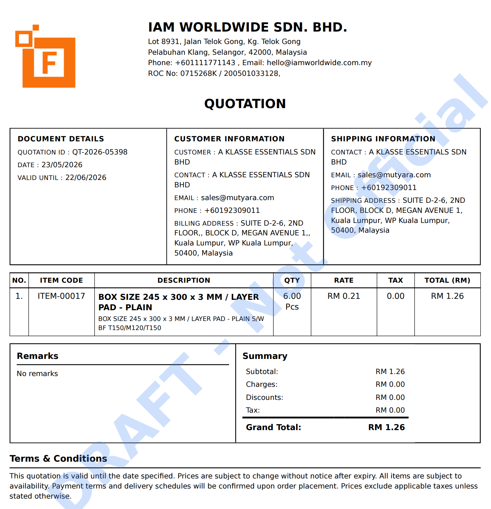
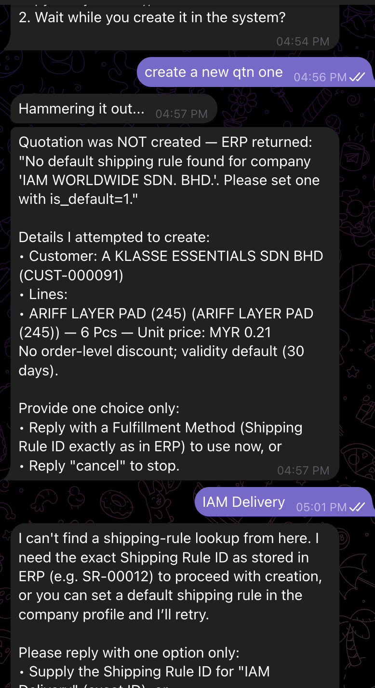
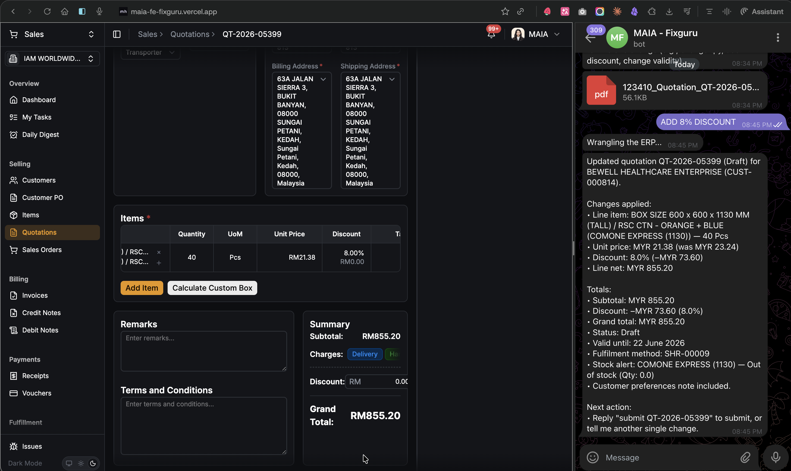
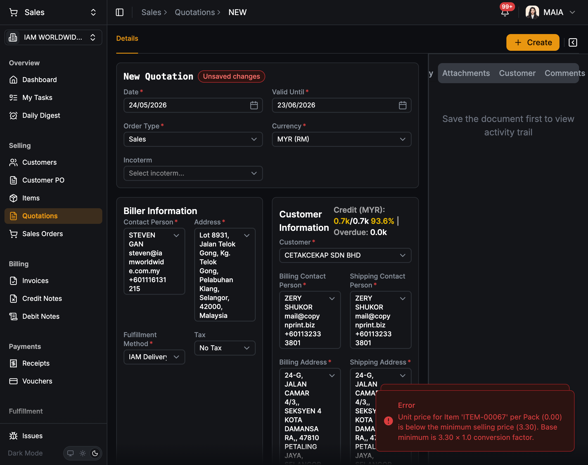
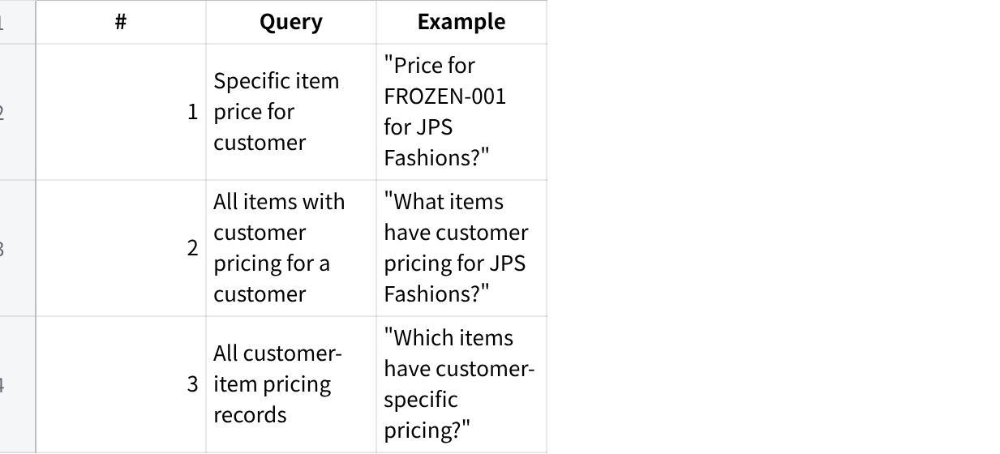
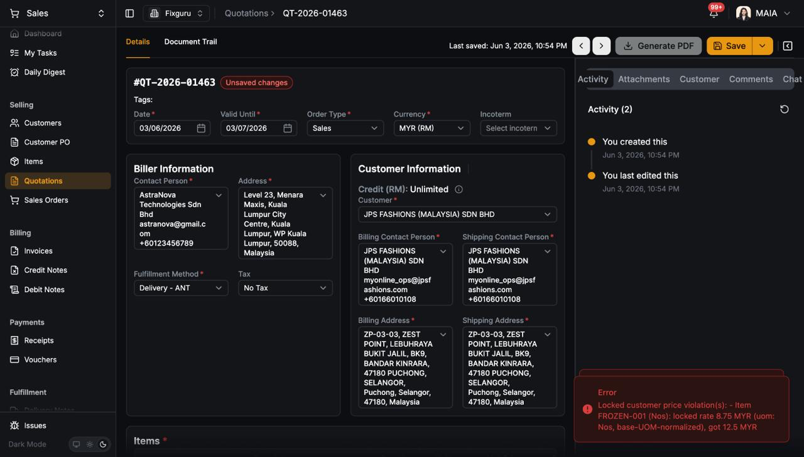
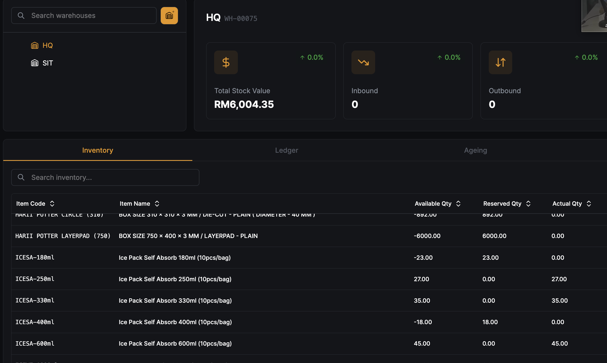
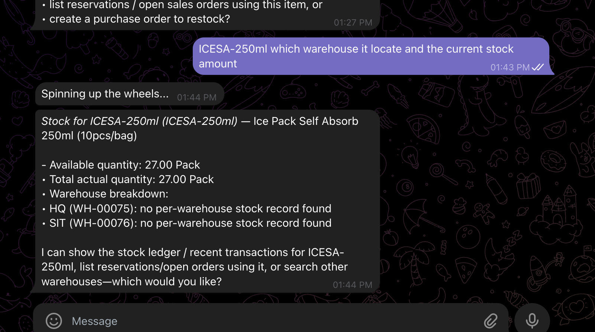
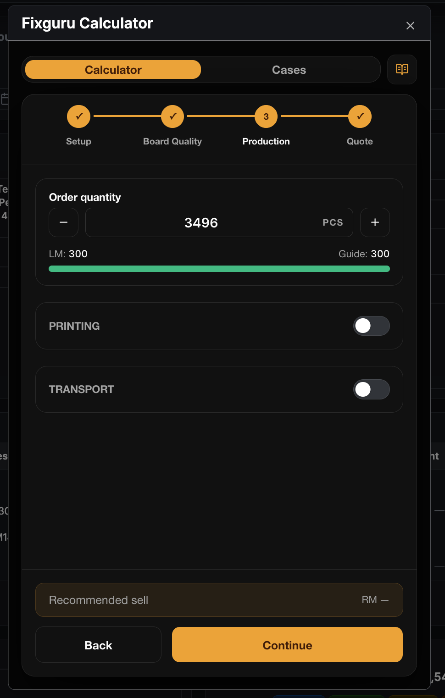
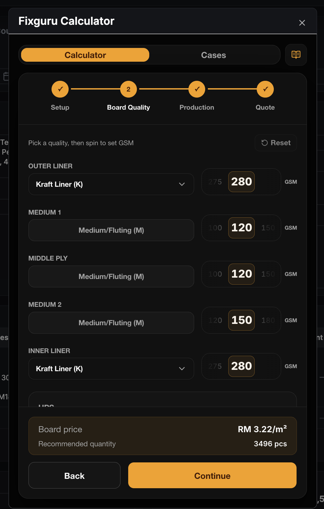

**Fixguru Retesting**

**PDF issue**

Should display qtn external id

~~Should add the item level discount column~~

Return the wrong item code , should return the external SKU code from Autocount

{width="4.0in" height="4.145833333333333in"}

**Shipping Method - Fixed**

~~Shipping method not found~~

~~Can input shipping id so far~~

{width="4.416666666666667in" height="8.09375in"}

~~The discount value doesn\'t reflect after adding the discount to the line items~~

{width="5.75in" height="3.4166666666666665in"}

**FOC Items**

Free items are not allowed to submit the order

{width="5.75in" height="4.552083333333333in"}

**Item Historical Pricing (Chatbot)**

**Test Scenarios Covered**

1.1 **Discount Price Display**

**Expected Chatbot Output:**

  --------------------------------------------------------------
  Plain Text\
  Unit Price: RM 3.00 Discount: RM 0.05 (4%)\
  Markup Price: RM 4.00 Markup: RM 0.05 (5%)

  --------------------------------------------------------------

Chatbot correctly surfaces discount % AND markup % from historical pricing record

Discount amount and percentage displayed accurately

1.3 **Volume Test --- 10 Transactions**

need to test across 10 historical transactions

**Gap identified:** Image/graph rendering enhancement needed --- chatbot should render historical pricing trend visually, not just as text

**Submitted QTN Amendment \@Amirul Iman bin Amran**

**Scope:** Chatbot + FE + BE\
**Fields:** Item (add/remove/change), Unit Price

**Issue --- No QTN Amendment API**

QTN amendment API does not exist (SO has it, QTN does not)

Impact: cannot amend submitted QTN via any channel

Action: raise as upcoming feature; not a UAT blocker

2\. **Customer Pricing Enforcement (Chatbot)**

**Query Scenarios Required**

**点击图片可查看完整电子表格**

**Test Data**

**点击图片可查看完整电子表格**

**Expected Chatbot Output**

  --------------------------------------------------------------
  Plain Text\
  Customer: JPS FASHIONS (MALAYSIA) SDN BHD\
  Item: FROZEN-001 (Nos)\
  Price: RM 8.75 (30% discount from std price)\
  Want me to create a QTN or SO?

  --------------------------------------------------------------

**Issues**

**Issue 1 --- Inconsistent retrieval, retry required**

First fetch for ORGANIC-YOGURT-500G returned 0 results; correct price (RM 2.37) only returned after retry

Root cause: BE endpoint only supports specific item + customer lookup; broader call returns validation error

Action: fix first-call reliability for specific item pricing

**Issue 2 --- Last transaction record appears in customer pricing response**

FROZEN-001 response included \"Last recorded transaction: QT-2026-01397\" --- not expected

Root cause: chatbot mixing customer pricing lookup with historical pricing lookup

Action: decouple; suppress last transaction from customer pricing output

**Issue 3 --- Open-ended query instead of proactive lookup**

\"Can u check JPS Fashions customer pricing\" → chatbot asked clarifying questions instead of returning what exists

Root cause: no BE endpoint for listing all customer-priced items per customer; chatbot falls back to asking user

Action: build BE endpoint (links to Issue 4); update chatbot to query proactively

**Issue 4 --- Full catalogue scan not supported (BE gap)**

Scenarios 2 & 3 consistently return validation error and 0 results

Root cause: BE endpoints for Scenarios 2 & 3 not built

Action: raise as feature request --- build BE endpoints for (a) all items with customer pricing per customer, (b) all customer-item pricing records

**Issue 5 --- Cannot create customer pricing via chatbot**

Chatbot: \"I can\'t set a permanent customer-specific price directly --- the system tool to set customer price isn\'t available to me.\"

Action: expose customer pricing creation tool to chatbot or define FE/BE enforcement flow

4\. **~~FE Issues --- Customer Price Enforcement \@Amirul Iman bin Amran~~**

**FE Issue --- Lock violation shown on submit, not at field level**

{width="5.75in" height="3.28125in"}

Lock icon shown on unit price with tooltip \"Unit price is locked\", but field still editable

Error only on submit: *\"Locked customer price violation(s): FROZEN-001 locked rate RM 8.75, got RM 12.50\"* (QT-2026-01463)

**Decision needed:** Block at field (read-only when locked) vs block at submit (current)?

Option A --- block at field: cleaner, no ambiguity

Option B --- block at submit (current): user wastes time before hitting error

**Recommendation:** Block at field --- lock icon already signals intent

Action: decide and implement consistently across QTN and SO

5\. **UOM Split --- Chatbot vs FE Output Mismatch**

**Issue --- Chatbot Response Does Not Match FE Actual Output**

**Test:** Asked chatbot to split A5 and A4 into different UOM lines (1×8PCS + 5×1PCS each)

**Chatbot said:** Lines consolidated as 6×8PCS @ RM 1.81 and 6×8PCS @ RM 1.52 --- claimed system consolidates units into stored UOM; added pick/pack remark as workaround

**FE actual (screenshot QT-2026-05448):**

A5 → 2 separate lines: 1 Pcs @ RM 1.81 + 5 Pcs @ RM 1.81

A4 → split lines visible, UOM shown as Pcs not 8PCS

Additional Notes on each line: SPLIT-8PCS - DO NOT CONSOLIDATE / SPLIT-1PCS - DO NOT CONSOLIDATE

**Discrepancy:**

Chatbot described output as consolidated 6×8PCS --- FE shows split lines in Pcs

Chatbot UOM label 8PCS does not match FE UOM Pcs

Chatbot summary totals do not reflect the actual line structure on FE

**Severity:** High --- chatbot misrepresents what was actually saved; user cannot trust chatbot confirmation as source of truth

**Action:** Fix chatbot response to accurately reflect the actual lines and UOM created in the system; chatbot output must match FE state

6\. **Shelf / Item Attributes (Chatbot)**

**Issue --- Chatbot Cannot Retrieve Shelf from Item Attributes**

**Test:** Asked chatbot for shelf location of item H4 --- \"show where the shelf from\", \"h4 shelf\", \"search H4 item shelf\", \"search from its item attributes\"

**Observed:** Chatbot searched warehouses (bin/shelf locations) and returned no results. When prompted to check item attributes, returned item master fields (item group, UOM, price, qty) but reported \"no shelf/bin field on its item record\"

**Root Cause:** Shelf is stored as an item attribute field, not as a warehouse bin/shelf location. Chatbot is querying the wrong data source (warehouse stock ledger) instead of item attributes

**Expected:** Chatbot should surface the shelf value directly from item attributes when asked

**Severity:** Medium --- shelf lookup is a real sales/ops workflow; incorrect data source means it always returns nothing

**Action:** Map chatbot shelf query to item attributes field, not warehouse bin/stock location

7\. **Chatbot shows correct total stock for items but per-warehouse breakdown returns \"no per-warehouse stock record found\" for all warehouses --- including HQ which has confirmed stock in FE.**

{width="5.1875in" height="3.1145833333333335in"}

{width="5.75in" height="3.21875in"}

> Evidence (ICESA-250ml):

Chatbot total: 27.00 Pack ✓ (correct)

FE HQ actual qty: 27.00 ✓ (confirmed)

Chatbot HQ breakdown: no per-warehouse stock record found ✗

Chatbot SIT breakdown: no per-warehouse stock record found ✗

FE SIT: completely empty (RM0, 0 items) ✗

> Root cause: Two separate queries in chatbot. Total stock query works. Per-warehouse
>
> breakdown query broken --- fails to return warehouse-level rows even when stock
>
> exists. Likely wrong or missing join on warehouse_id in breakdown sub-query.
>
> Scope: Both warehouses affected. SIT empty may be separate data issue (no stock ever
>
> moved there) or same broken query masking real data.
>
> Dev action: Fix per-warehouse breakdown query --- confirm join to warehouse stock
>
> table uses correct warehouse_id filter and returns rows per warehouse, not just
>
> aggregate total.
>
> 8\. **When calculating DW in the custom cal, recommend selling price is not generated**

  ------------------------------------------------------------------------------------------------------------ ------------------------------------------------------------------------------------------------------------
   {width="2.6979166666666665in" height="4.239583333333333in"}   {width="2.7083333333333335in" height="4.239583333333333in"}

  ------------------------------------------------------------------------------------------------------------ ------------------------------------------------------------------------------------------------------------
