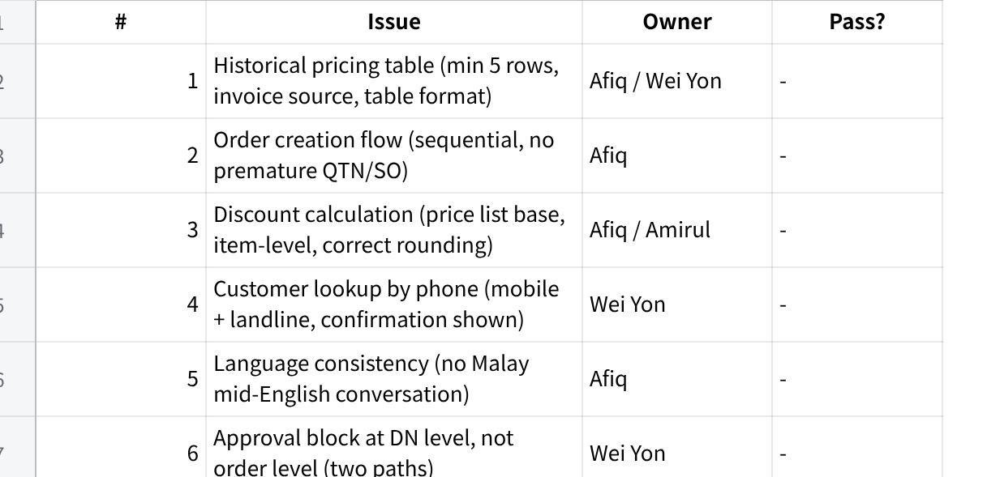
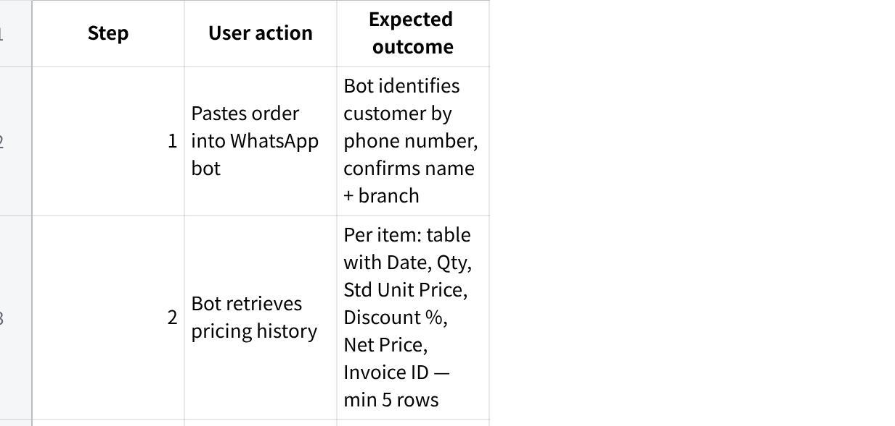
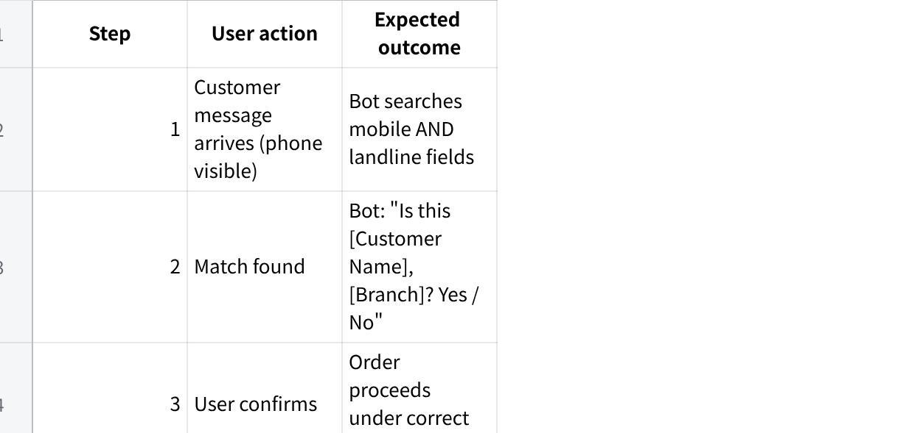
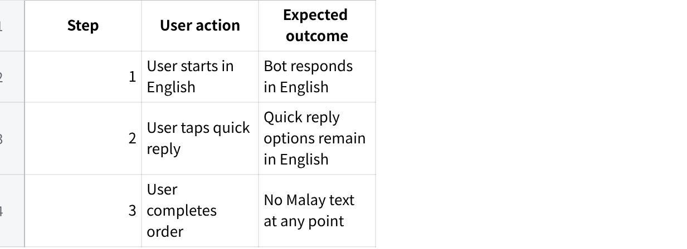
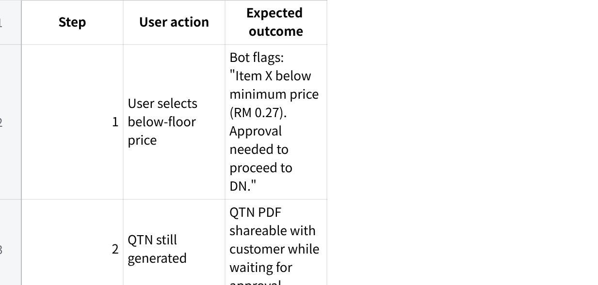
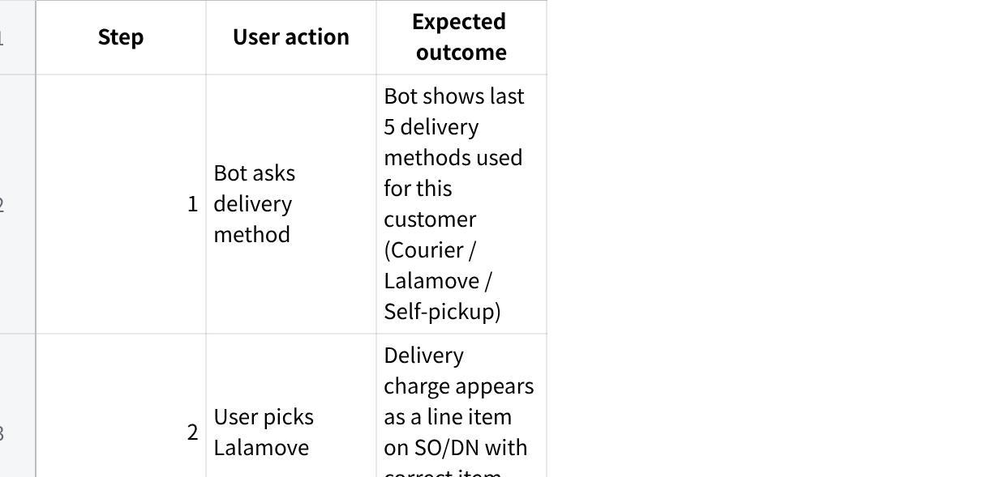
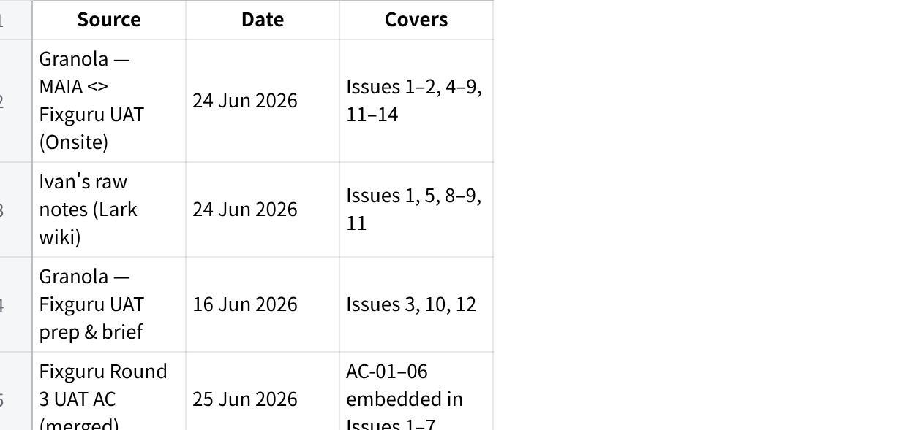

**Fixguru Round 3 Tech Brief**

**Fixguru Round 3 --- Tech Brief**

**Session:** MAIA \<\> Fixguru UAT (Onsite), 24 June 2026\
**Attendees (Mindhive):** Ivan, Gareth, Jermaine, Azib, Brendan, Bryan, Johnson\
**Attendees (Fixguru):** Ivan Cyh (Marcus), Yvonne (referenced), Azib

Pass gate: user completes end-to-end order without opening AutoCount or asking for price manually.

**Overall Pass Gate --- Round 3 Sign-off**

**点击图片可查看完整电子表格**

**Sign-off authority:** Gareth (pending confirmation --- Open Decision C6 in backward plan)

**Issue 1 --- Historical Pricing Display P0 RECURRING**

**Feedback (Fixguru UAT, 24 Jun --- same feedback since 7 Apr, 14 May, 16 Jun)**

  --------------------------------------------------------------------------------------------------------------------------------------------------------------------------------------------------------------------------------------------------------------------------------------------------------------
  \"Sales team needs historical pricing per customer per item before proceeding with any order. Current chatbot only shows one transaction line --- incomplete and misleading. Need at least 5 historical transactions per item with date. Clean table --- one glance. Grand total not needed at this stage.\"

  --------------------------------------------------------------------------------------------------------------------------------------------------------------------------------------------------------------------------------------------------------------------------------------------------------------

Yvonne\'s walkthrough: user specifies G3-100, G1-300, PM72-500 → if any historical pricing, surface based on invoiced amount → chatbot returns table per item → ask user which price to proceed with.

  ------------------------------------------------------------------------------------------------------------------------------------------------------------------------------------------------------------
  \"Search older invoices. People who use MAIA are very simple minded. If head of departments need 5 minutes to digest, their team will take much longer. MAIA must be super direct.\" --- Ivan\'s raw notes

  ------------------------------------------------------------------------------------------------------------------------------------------------------------------------------------------------------------

**Gaps --- Product**

No table format spec written (columns, row count, sort order)

No hard rule for min row count (client said 3 is too few --- never formalised)

Grand total suppression never written into spec

Date column never included in any spec --- client explicitly requires it

Source rule (invoice vs draft SO) never documented --- assumed same

**Gaps --- Tech**

API returning only 1 transaction per item

No date field in response

Source mixing draft SOs with confirmed invoices

Discount % calculated against wrong base

Still returning inline text, not table structure

**Acceptance Criteria (AC-01)**

Scenario: Sales user pastes WhatsApp order from returning customer (3 items).

**点击图片可查看完整电子表格**

Pass:

Min 5 invoice-sourced rows per item (never draft SOs)

Table visible in single message --- no text wall

Bot does NOT auto-generate QTN/SO before user confirms price

Date column present

Fail (from prior UAT): only 2--3 rows; draft SO source; QTN generated before discount picked.

**Action --- Product**

Write table spec: columns = Date \| Item Code \| Qty \| Std Unit Price \| Discount % \| Net Price \| Invoice ID

Hard rule: min 5 rows (3 is explicitly too few); sort most recent first

Source rule: confirmed invoices only --- never draft SOs

Remove grand total from chatbot response; total visible in PDF only

**Action --- Tech**

Rebuild historical pricing API: return all 6 columns per row; min 5 rows; filter confirmed invoices only (Afiq / Wei Yon)

If fewer than 5 invoices exist, return all available + note count

Output as structured table, not inline text

**Issue 2 --- Order Creation Flow Sequence P0**

**Feedback (Fixguru UAT, 24 Jun)**

  --------------------------------------------------------------------------------------------------------------------------------------------
  \"Confirm to proceed with quotation, yes, that\'s all. User wants a super simple flow. One step at a time --- no multi-question prompts.\"

  --------------------------------------------------------------------------------------------------------------------------------------------

Ideal flow: (1) identify customer by phone → (2) retrieve historical pricing table → (3) \"Proceed with these prices?\" yes/no → (4) generate QTN/SO → (5) ask delivery method.

  ------------------------------------------------------------------------
  \"Expect from user, only yes and no questions.\" --- Ivan\'s raw notes

  ------------------------------------------------------------------------

**Gaps --- Product**

No happy-path flow spec written step-by-step with exact bot messages

No rule that QTN/SO must not generate before price confirmation

No defined fallback for partial item confirmation

**Gaps --- Tech**

Bot generating QTN/SO before user confirms price

Bot asking multiple questions in same message

No state enforcement for sequential steps

**Acceptance Criteria (AC-01 Step 4--5 / flow gate)**

Pass:

Bot sends one question per message --- never multiple at once

QTN/SO only generated after explicit \"yes\" from user on price

Flow is resumable if user skips a step (bot re-prompts, not crash)

**Action --- Product**

Write step-by-step happy-path spec: each step = one bot message + one expected user response + transition condition

Define exact wording for each prompt

Define fallback: if user skips step, what bot does next

**Action --- Tech**

Gate QTN/SO generation on explicit user price confirmation (Afiq)

Implement strict sequential step model --- each step blocks next until resolved

Add conversation state tracking so user can resume mid-flow

**Issue 3 --- Discount Calculation Accuracy P0**

**Feedback (UAT prep 16 Jun + UAT 24 Jun)**

  ------------------------------------------------------------------------------------------------------------------------------------------------------------------------------------------------------------------------------------------------------------
  \"Price list rate and SSC found to be different during testing --- discount must use price list rate (standard selling price), not the item price. Unique price discount vs. total line item discount are separate values; both must be shown correctly.\"

  ------------------------------------------------------------------------------------------------------------------------------------------------------------------------------------------------------------------------------------------------------------

Session: discount % varies by customer and quantity --- not standardised globally. Some customers have pre-agreed prices below standard minimum.

**Gaps --- Product**

No documented rule: which price is the base for discount % (price list vs SSC vs item price)

Pre-approved customer-item price concept never specced

No rule: do pre-approved prices bypass the minimum price approval trigger?

**Gaps --- Tech**

Discount using item price not price list rate (price list vs SSC bug flagged 16 Jun --- unresolved)

Showing unit discount only; not showing total line discount

No pre-approved customer-item price bypass in approval check

**Acceptance Criteria (AC-02)**

Scenario: User selects 5% discount for item G1 (std price RM 0.33).

**点击图片可查看完整电子表格**

Pass:

3% / 5% / 10% all compute correctly against price list rate (not item price)

Different items in same order can carry different discount %

Net price shown rounds to 4 decimal places (or client-agreed standard)

Total line discount shown alongside unit discount

**Action --- Product**

Define rule: discount % = (price list rate − net price) / price list rate

Define pre-approved customer-item pricing: customer + item + agreed net price → no approval triggered

Spec: show unit discount AND total line discount on order

**Action --- Tech**

Fix discount base: use price list rate not item price; resolve price list vs SSC discrepancy (Amirul / Afiq)

Show both unit discount and total line discount in response

Implement pre-approved customer-item price bypass in approval check

**Issue 4 --- Customer Lookup by Phone Number P1**

**Feedback (Fixguru UAT, 24 Jun)**

  -------------------------------------------------------------------------------------------------------------------------------------------------------------------------------------------
  \"Leads and prospects --- always know either phone number or WhatsApp, but sometimes don\'t even know their name. Mobile field in AutoCount is a unique identifier for most customers.\"\
  \"Customer retrieval and referencing by phone number. mobile/landline.\" --- Ivan\'s raw notes

  -------------------------------------------------------------------------------------------------------------------------------------------------------------------------------------------

**Gaps --- Product**

No customer search priority spec (phone → landline → name)

No spec for multiple-match scenario

No lead/prospect creation flow if no match found

No confirmation step spec before order created

**Gaps --- Tech**

Search only using name or one phone field; not covering both mobile and landline

Silent auto-match risk --- no confirmation shown before proceeding

Branch/contact not synced: SO/DN defaults to HQ instead of matched branch

**Acceptance Criteria (AC-03)**

Scenario: Customer WhatsApps in with no company name --- only phone number.

**点击图片可查看完整电子表格**

Pass:

Phone search covers both mobile and landline fields

Confirmation step shown before proceeding --- no silent auto-match

SO/DN branch/contact = matched branch, not HQ default

**Action --- Product**

Define search priority: phone/mobile → landline → name

Define lead/prospect creation: if no match, offer \"Create as lead?\" requiring phone only

Define confirmation prompt wording

**Action --- Tech**

Search both phone and mobile columns in AutoCount (Wei Yon)

Show confirmation before proceeding

Sync branch/contact to SO/DN from matched customer, not HQ default

**Issue 5 --- Language Bug (Malay Mid-Conversation) P0**

**Feedback (Ivan\'s raw notes, 24 Jun)**

  ------------------------------------------------------------------------------------------------------------------
  \"Chatbot quick replies use Malay suddenly when majority of the chat is in English. To check.\" --- Afiq flagged

  ------------------------------------------------------------------------------------------------------------------

**Gaps --- Product**

No language consistency rule in any spec

No definition of how bot determines session language

**Gaps --- Tech**

Quick reply label generation not respecting conversation language

Language detection not propagated to quick reply builder

**Acceptance Criteria (AC-04)**

Scenario: Sales user conducts entire conversation in English.

**点击图片可查看完整电子表格**

Pass:

Zero mid-flow Malay switch in English conversation

Quick reply labels in English throughout

**Action --- Product**

Define rule: quick reply labels must match conversation language throughout session

Define detection: first user message language = session language

**Action --- Tech**

Fix quick reply generation: pass session language to reply builder; no Malay fallback (Afiq)

End-to-end test: English order → verify all quick replies in English

**Issue 6 --- Approval Blocks: Credit Limit and Minimum Price P1**

**Feedback (Fixguru UAT, 24 Jun)**

  -------------------------------------------------------------------------------------------------------------------------------------------------------------------------------------------------------------
  \"Credit limit block on order --- miss opportunity to collect money and invoice. Fix guru side: credit limit block on DN. If customer high outstanding, will block on DN. Based on DO value, will block.\"\
  \"Sales order minimum discount by item: minimum price needs approval. Which roles can bypass? Check with Azib screenshot on AutoCount.\"\
  \"Team approves manually after verifying bank transfer slip even if AR not yet knocked off.\"

  -------------------------------------------------------------------------------------------------------------------------------------------------------------------------------------------------------------

**Gaps --- Product**

Block level not locked in writing --- client leans DN but no formal confirmation

Which roles can bypass: unknown --- waiting on Azib\'s AutoCount screenshot (C2 blocker)

Two distinct approval paths not defined: AR-negative ≠ credit-limit-exceeded

Pre-approved customer-item prices still triggering minimum price approval incorrectly

**Gaps --- Tech**

Block triggering at SO level, not DN/DO level

Approval flow not split: AR-negative and credit-limit-exceeded treated as one flow

No approver visibility: AR, pending SO/DN, credit limit, available balance

Pre-approved prices not bypassing minimum price check

**Acceptance Criteria (AC-05)**

Scenario: Item priced below minimum floor. User mid-order.

**点击图片可查看完整电子表格**

Pass:

Order creation NOT blocked --- only DN submit blocked

QTN still generated and shareable pending approval

Approver sees: AR, pending SO/DN value, credit limit, available balance

Two flows separated: AR-negative (bank-in slip) vs credit-limit-exceeded (case-by-case)

**Action --- Product**

Lock block level in writing: DN submit only (pending client formal confirmation)

Chase Azib for AutoCount screenshot of both blocks + bypass roles (C2 --- Ivan to action)

Write two distinct approval flows: (A) AR-negative → bank-in slip; (B) credit-limit-exceeded → case-by-case

Define approver view: AR, pending SO/DN, credit limit, available balance

**Action --- Tech**

Move credit block trigger from SO to DN submit; use DO value as trigger (Wei Yon)

Separate approval routing: AR-negative path vs credit-limit path → both route to Ivan

Build approver context: AR, pending SO/DN, credit limit, available balance

Implement pre-approved customer-item price bypass in minimum price check

**Issue 7 --- Delivery Method as Item Line P1**

**Feedback (Fixguru UAT, 24 Jun)**

  ----------------------------------------------------------------------------------------------------------------------------------------------------------------------------------------------------------
  \"Historical shipment method, surface the column from sales order listing. In the user context this must be captured. Customer context bank should have historical N (minimum 5) confirmed documents.\"\
  \"Is this lalamove order, self pickup?\" --- Marcus\'s feedback (chatbot must prompt this)

  ----------------------------------------------------------------------------------------------------------------------------------------------------------------------------------------------------------

**Gaps --- Product**

No spec for delivery method as SKU/item line (currently free-text or config)

No spec for surfacing last 5 delivery methods per customer

No delivery address history spec (separate from method --- see Issue 9)

**Gaps --- Tech**

Delivery charge not appearing as item line with item code

No historical delivery method retrieval from SO history

Delivery accounting treatment not mapped per method type

**Acceptance Criteria (AC-06)**

Scenario: User selects \"Lalamove\" as delivery method after QTN confirmed.

**点击图片可查看完整电子表格**

Pass:

Last 5 confirmed delivery methods surfaced per customer

Delivery charge = item line, not free-text field

Correct item code maps to correct accounting treatment

**Action --- Product**

Define delivery method as SKU: each method has item code, description, charge rule

Spec: surface last 5 confirmed delivery methods from SO history per customer

Align with Fixguru on delivery charge amounts per method (own lorry vs Lalamove vs self-pickup)

**Action --- Tech**

Delivery charge as item line on SO/DN with correct item code (Wei Yon)

Historical delivery method retrieval: last 5 confirmed SOs per customer (Wei Yon)

**Issue 8 --- Chatbot Verbosity P0**

**Feedback (Fixguru UAT, 24 Jun)**

  ------------------------------------------------------------------------------------------------------------------------------------------------------------------------------------------------------------------------
  \"Responses are too long, too many numbers, hard to scan in one glance. Sales staff will revert to AutoCount if Maya is slower or more confusing. Key principle: Maya adapts to the user, not the other way around.\"\
  \"Be concise in the response, if not found then not found, don\'t need to over enrich.\" --- Ivan\'s raw notes

  ------------------------------------------------------------------------------------------------------------------------------------------------------------------------------------------------------------------------

**Gaps --- Product**

No response length spec or max-message rule

No single-action-per-message rule

\"Not found = not found\" principle never formalised

**Gaps --- Tech**

Bot returning multi-paragraph responses for single queries

No character/line limit enforced on output

Over-enrichment on \"item not found\" path

**Action --- Product**

Define chatbot response spec: max 3 lines per message, one action per turn

Write \"not found\" rule: return exactly one line --- \"No record found for \[item\]. Proceed with standard price?\"

**Action --- Tech**

Rewrite chatbot prompts: enforce single-step, single-question output (Afiq)

Remove all enrichment beyond what was asked

Enforce output character constraint before forcing new turn

**Issue 9 --- WhatsApp Latency vs Telegram P1**

**Feedback (Ivan\'s raw notes, 24 Jun)**

  ------------------------------------------------------------------------------------
  \"Observation from chatbot in WhatsApp: the latency is a bit longer vs Telegram.\"

  ------------------------------------------------------------------------------------

**Gaps --- Product**

No latency SLA defined

**Gaps --- Tech**

Root cause of WhatsApp vs Telegram latency gap unknown; no profiling done

**Action --- Product**

Define latency SLA: target \<5 seconds from user send to bot reply

**Action --- Tech**

Profile WhatsApp API call chain vs Telegram --- identify bottleneck (Wei Yon)

Report findings before next UAT

**Issue 10 --- AutoCount External ID Not Returned P1**

**Feedback (UAT prep, 16 Jun)**

  ---------------------------------------------------------------------------------------------------------------------------------------------------------------------------------------
  \"External ID from AutoCount must be returned on SO/invoice after push. Currently returning internal ID in some cases. On submit: push to AutoCount first, then return external ID.\"

  ---------------------------------------------------------------------------------------------------------------------------------------------------------------------------------------

**Gaps --- Product**

No spec: which ID to show user after submit

**Gaps --- Tech**

Returning MAIA internal ID in some cases instead of AutoCount external document ID

External ID not mapped back after AutoCount push

**Action --- Product**

Spec: after submit, display AutoCount external document ID --- not MAIA internal ID

**Action --- Tech**

Fix push flow: push to AutoCount → receive external ID → return it in response (Bryan)

Store external ID on MAIA SO/invoice record

**Issue 11 --- Custom Item Naming + Item Retrieval Fallback P1**

**Feedback (Ivan\'s raw notes, 24 Jun)**

  --------------------------------------------------------------------------------------------------------------------------------------------------------------------------------
  \"Fixguru has G5 as a base item, but they create customised G5: {Customer Name} G5. Item retrieval --- if not match, also return historical items that the customer ordered.\"

  --------------------------------------------------------------------------------------------------------------------------------------------------------------------------------

**Gaps --- Product**

No spec for {Customer Name} prefix variant lookup or resolution to base item

No defined fallback when item not found

**Gaps --- Tech**

Item search not handling customer-variant naming

Dead-end returned when item not found --- no fallback

**Action --- Product**

Define retrieval priority: exact match → strip prefix → base item → customer invoice history

Define fallback message: \"No match for \[item\]. Closest: \[base\]. Historically ordered: \[list\]\"

**Action --- Tech**

Implement 3-tier lookup: exact → prefix-stripped base → customer history (Wei Yon / Afiq)

Never return a dead-end; always provide at least historical fallback

**Issue 12 --- FOC Items and Partial Fulfillment P1**

**Feedback (Fixguru UAT, 24 Jun)**

  ---------------------------------------------------------------------------------------------------------------------------------------------------------------------------------------------------------------------------------
  \"FOC items: customer ordered 1000, production 1050 → 50 are free. Partial fulfillment: if stock short, issue DO for available stock, backorder remainder. Maya should support adjusting SO quantity and issuing DO directly.\"

  ---------------------------------------------------------------------------------------------------------------------------------------------------------------------------------------------------------------------------------

**Gaps --- Product**

FOC flow never specced: billing logic, stock deduction, DO line appearance

Partial fulfillment flow not defined

**Gaps --- Tech**

FOC items creating duplicate lines (flagged in UAT prep 16 Jun)

Partial DO not supported --- system requires full quantity

No natural-language SO quantity adjustment in bot

**Action --- Product**

Write FOC spec: bill billable qty; deduct billable + FOC from stock; FOC line on DO at RM 0

Write partial fulfillment spec: adjust SO qty + issue partial DO + backlog remainder

**Action --- Tech**

Consolidate FOC lines: deduplicate into single line per item (Bryan)

Support partial DO against SO; track backorder remainder (Wei Yon)

Support natural-language SO qty adjustment in bot flow

**Issue 13 --- Warehouse / Shelf Configuration P1**

**Feedback (Fixguru UAT, 24 Jun)**

  ----------------------------------------------------------------------------------------------------------------------------------------------------------------------------------------------------
  \"Current AutoCount setup ties shelf to item UOM, not to sub-warehouse. Industry standard: shelf as sub-warehouse within rack within HQ warehouse. Need to investigate correct AutoCount module.\"

  ----------------------------------------------------------------------------------------------------------------------------------------------------------------------------------------------------

**Gaps --- Product**

Warehouse structure never mapped from Fixguru\'s actual AutoCount setup

AutoCount sub-warehouse capability not validated

**Gaps --- Tech**

Wrong module used for shelf tracking (tied to item UOM)

Picking list / DN not showing correct shelf/warehouse

**Action --- Product**

Map intended hierarchy with Fixguru: HQ → rack → shelf

Validate with AutoCount vendor if sub-warehouse module supports this

**Action --- Tech**

Investigate correct AutoCount sub-warehouse module (Azib / Wei Yon)

Reconfigure shelves as sub-warehouses; update picking list and DN

**Issue 14 --- Dual Interface / Hybrid UX Open Decision**

**Feedback (Fixguru UAT, 24 Jun)**

  --------------------------------------------------------------------------------------------------------------------------------------------------------------------------------------------------------
  \"MAIA\'s perhaps a dual interface --- chat + front. The chat interface has its limitations. Sales people have to do manual data entry but rely on rich information best surfaced in the front end.\"\
  \"Marcus\'s feedback: chatbot intuitive, user-guided flow. Dual interface concept positively received.\"

  --------------------------------------------------------------------------------------------------------------------------------------------------------------------------------------------------------

**Gaps --- Product**

No decision made: chat-only vs dual interface vs image/table card

Without this decision, pricing table display spec cannot be finalised

**Gaps --- Tech**

No feasibility spike on hybrid chat + web panel

No design spec to build towards

**Action --- Product**

Make explicit decision by Day 1 (25 Jun): chat-only / dual interface / image card --- must lock before table spec finalised

If dual interface: define scope --- Phase 1 or costed CR

**Action --- Tech**

Feasibility spike: hybrid web panel alongside WhatsApp chat --- timeboxed 1 day (Jermaine / Amirul)

Run in parallel with P0 fixes --- must not block Issue 1 delivery

**Source Notes**

**点击图片可查看完整电子表格**

**See Also**

UAT/3rd backward final UAT action plan for Fixguru --- prioritised plan with owners and dates

Meetings/2026-06-24 Fixguru UAT Debrief --- Ivan\'s raw session notes

context/learnings --- running learnings log
