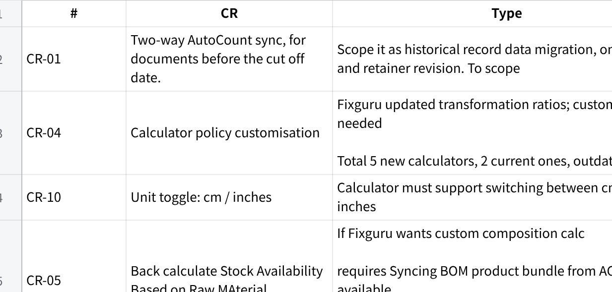

**Fixguru UAT - next action items**

**Fixguru UAT Action Items (2026-05-15 Feedback Sync)**

**Historical Pricing**

**What Fixguru wants**

When creating a SO/quotation, surface for each line item:

Last transaction net price for that **customer × item** combo

Discount % applied in that last transaction

Current list price (benchmark)

  ------------------------------------------------------------------------------------------------------------------
  **Note:** Fixguru does NOT use customer-specific pricing tiers. Historical pricing = last transaction data only.

  ------------------------------------------------------------------------------------------------------------------

**Expected Chatbot Display**

When a user adds item to QT via chatbot:

  --------------------------------------------------------------
  Plain Text\
  📦 \*Item A\* added for \*Customer XYZ\*\
  \
  Price history (last 2 transactions):\
  • SO-001 --- Qty 20 @ RM 8.10 (10% off list RM 9.00)\
  • SO-002 --- Qty 30 @ RM 9.90 (10% off list RM 11.00)\
  \
  Current list price: RM 15.00\
  \
  Which price to apply?\
  1. Last transaction --- RM 9.90 (10%)\
  2. List price --- RM 15.00\
  3. Enter custom price

  --------------------------------------------------------------

**Action Items**

**\@Bryan Tew~~Surface historical pricing in chatbot~~** ~~--- when user adds item to SO, show last transactions for that customer × item: SO ref, qty, unit price, discount % vs list price. LLM to service from existing data.~~

~~**\@Amirul Iman bin AmranSurface historical pricing in UI (front end)** --- price list pop-up shows last transactions + current list price. No customer-specific tier needed.~~

\@Muhammad Azib Iqbal Bin Harun@Amirul Iman bin Amran@Gareth Ng@Bryan Tewenforcement flag handling for cust x item x price/disc

**\@Muhammad Azib Iqbal Bin HarunImplement derived discount % field** --- discount % = (standard_price - unit_price) / standard_price × 100. Two-way input: type unit price → derive %, OR type % → compute unit price.

**\@Amirul Iman bin Amran@Afiq AqilAdd brand to item display string** --- formatted string: \[item_code\] \[brand\] \[item_name\]. Brand currently not shown.

**\@Bryan Tew~~Minimum price guardrail~~** ~~--- if unit price goes below item minimum price, trigger alert/block. Tied to item price movement feature.~~

~~**\@Muhammad Azib Iqbal Bin HarunConfirm item-level discount in backend** --- check with Amirul if discount % stored at item level or price list level. Determines how to derive historical discount accurately.~~

~~**\@Gareth NgCollect calculator policy samples from Fixguru** --- they updated volumetric/dimensional calculator rules; gather sample data, document transformation ratios. Scope customisation cost if needed.~~

~~\@Gareth NgCommunicate with Client that MAIA supports FOC items, just that the format will not be similar as Autocount which uses the Child Lines, in MAIA it will be two separate Lines~~

\@Bryan Tew@Amirul Iman bin Amran~~Chatbot side to check if can add FOC items to the QT/SO/SI. When Unit price is set to zero, chatbot ask if it is a free item. Yes then check the is_free_item flag and send to BE. CB Done~~

**\@Muhammad Azib Iqbal Bin HarunAutoCount Sync**

**Confirm cutoff date with Fixguru** --- agree snapshot date (likely 2nd UAT). Before = no sync. After = full two-way sync on all docs (SO, Invoice, etc.)

**Scope standalone invoice sync** --- AutoCount docs during migration period sync as standalone invoices into MAIA (no historical SO parent needed)

**Add cutoff date config field** --- hard-coded param in sync config; anything before cutoff untouched

**Request snapshot file from Fixguru** at cutoff date --- needs: (1) customer credit limits, (2) open invoice exposure per customer (statement of accounts). MAIA ingests to seed credit data.

**Scope daily stock reconciliation** --- configurable time (e.g. 7AM), MAIA pulls stock snapshot from AutoCount daily. Define policy per instance.

**Resolve external ID mapping** --- item created in MAIA → pushed to AutoCount → AutoCount generates different ID. MAIA must store + reference AutoCount\'s external ID.

~~**Fix item code display in chatbot** --- switch from MAIA internal ID to AutoCount external SKU~~

~~**Update retainer/SOW** --- two-way sync scope deviates from original spec; retainer revision needed~~

~~**Prepare in/out of scope doc** --- full list of what MAIA will/won\'t do for AutoCount sync. Bring to next Fixguru sync.~~

**Out of scope:** Historical data migration (5--7 years) = chargeable separate service. Full 100k+ invoice backfill = not viable.

Create Item in MAIA, some way to sync to Autocount Item Code. Autocount assigned code must overried MAIA.

In MAIA, User set D10, but when push to AC, D10 exist, then D11 available, Item created as D11 in AC, then in MAIA D10 is overriden with D11

**HQ + branch contact sync** --- some Fixguru customers have multiple branches (indah persona). Chatbot must correctly assign the branch when creating the SO. Requires contact sync across HQ + branch.

**Calculator**

**Context**

Fixguru uses a dimensional calculator (linear meter / square meter) for pricing raw materials (e.g. packaging boxes). They updated their calculator policy --- samples needed. Customisation = chargeable change request.

**\@Amirul Iman bin AmranAction Items**

~~**Remove SST from calculator display** --- Fixguru does not show tax to customers. Tax is in item master but must not surface in calculator or document output. Config fix (not code change).~~

~~**Enforce length ≥ width validation** --- physical constraint: if width \> length, they cannot print the box. Calculator must validate and enforce length \>= width before allowing submission.~~

**Confirm unit handling (linear meter)** --- they measure in meters. Verify calculator correctly handles linear meter input and unit conversion edge cases.

**Sync volumetric formula to AutoCount** --- volumetric/dimensional calculation must be passed to AutoCount on SO sync (for delivery note and driver reference).

~~**Gather updated calculator policy samples from Fixguru** --- they updated transformation ratios and rules. Collect sample data, document all ratios (raw material per unit, composition breakdown). - CR~~

**Scope composition/BOM customisation** --- they have a composition-based stock calculation (not full manufacturing). Ask Fixguru: do they want to customise this? If yes → chargeable change request.

~~**UI/UX fixes on calculator** --- Amir to review and fix calculator UI (flagged as enhancement, not a blocker).~~

**PDF Template**

**Context**

Fixguru\'s current workflow: SO draft → AutoCount PDF → send as pro-forma to customer → back-and-forth adjustments → confirm → proceed to next stage in MAIA. They **prefer AutoCount\'s PDF format** over MAIA\'s V3 PDF. Need to clarify scope.

**Action Items**

\@Wei Yon@Muhammad Azib Iqbal Bin HarunTo export the HTML and CSS from AC for us to review.

\@Amirul Iman bin AmranIf got HTML and CSS, Rahim to write a generator for Fixguru

~~**Clarify PDF scope with Fixguru** --- confirm if MAIA PDF V3 customisation is in scope, or if they will use AutoCount\'s PDF for all customer-facing documents~~

~~**Fix item code on PDF** --- currently shows MAIA internal ID; must show AutoCount\'s external item code~~

**Delivery note PDF --- multiple warehouse checks** --- Fixguru\'s delivery note requires more than one warehouse check field; current PDF only shows one

**Sync volumetric formula to PDF** --- dimensional/volumetric calculation must appear on PDF output (SO and/or delivery note)

~~**Define SO draft → pro-forma workflow** --- document the handoff: MAIA SO draft syncs to AutoCount → AutoCount PDF used as pro-forma → customer confirms → adjustments looped back → advance stage in MAIA~~

**Out of Scope (to confirm)**

Full PDF template redesign to match AutoCount\'s layout --- if confirmed out of scope, document and manage expectation with Fixguru

**\@Fariha Anis@Abdul Haiqal Abdul Aziz@Afiq Aqil Credit Limit ⚠️ Scope Change**

**What changed**

Original spec: MAIA tracks SO amount only for credit exposure.\
New requirement: full credit exposure = **unbilled SO amount + outstanding invoices**. Data must come from AutoCount via two-way sync to be accurate.

**Formula**

  --------------------------------------------------------------------------------
  Plain Text\
  Credit Exposure = (SO amount − already invoiced) + outstanding unpaid invoices

  --------------------------------------------------------------------------------

Exclude: draft docs, closed/paid invoices

Include: all open SO, SI, credit/debit notes (except draft)

**Action Items**

**Update credit exposure formula** --- change from SO amount only to: unbilled SO amount + outstanding invoice amount

**Exclude draft documents** from credit exposure calculation

**Surface credit limit in chatbot** --- when sales user creates new SO, chatbot must show: credit limit, current exposure, available balance. Block or warn if exceeded.

**Pull credit data from AutoCount** --- accurate credit limit requires AutoCount data via two-way sync (MAIA alone cannot guarantee accuracy without it)

**Scope credit limit as scope change** --- document deviation from original spec, flag to Fixguru, update SOW/retainer accordingly

**Chatbot**

**Language preference --- store in DB** --- user can set English or Malay response preference. Store in DB (not chatbot chain). Pending Amir\'s user context feature. ETA 5/21

**Language handling policy (per SOW --- set expectation with Fixguru)** --- intake: any language including Mandarin. Response: English or Malay only (user preference). Mandarin response = Must support, in SOW. To test (QC Mandarin)

~~**Ambiguity detector** --- if classifier cannot classify intent, chatbot must ask for clarification. Do not guess. Critical --- this solves most language edge cases too.~~

**Item display format** --- chatbot must show \[item_code\] \[brand\] \[item_name\] + external SKU (AutoCount ID). Do not show MAIA internal ID. To test

**Item search keys** --- chatbot must search by item_code, ~~customer_code, customer_name~~ as primary keys. Not internal ERPNext ID.

**Delivery method as SKU** --- Fixguru treats transport charges as SKU items for e-invoice claiming. Resolution (Wei Yon): user instructs chatbot to search and add delivery item by name (e.g. \"3PL Lalamove\") as a regular line item. **Chatbot must support searching delivery-type items in item list, not force-route to delivery method field. As per 5/19/2026 discussion, backend to map automatically upon creation (delivery method -\> sku on items (add))**

**Change Requests Summary ⚠️**

Items that deviate from original SOW or are new paid scope. All require retainer/SOW revision before dev starts.

**点击图片可查看完整电子表格**

**Next step:** Prepare formal CR doc, align with Fixguru, then revise retainer.
