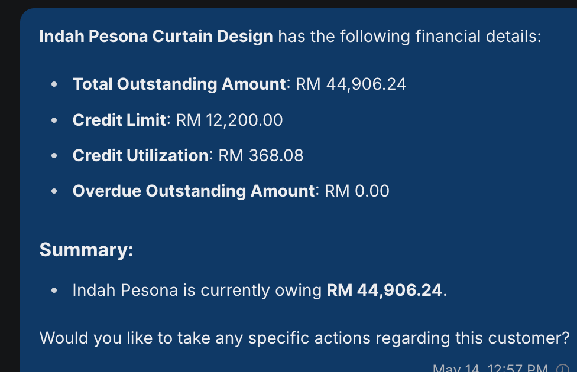
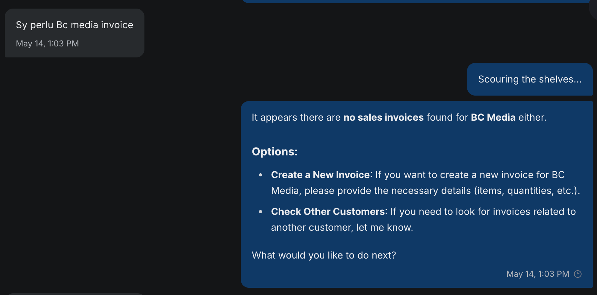
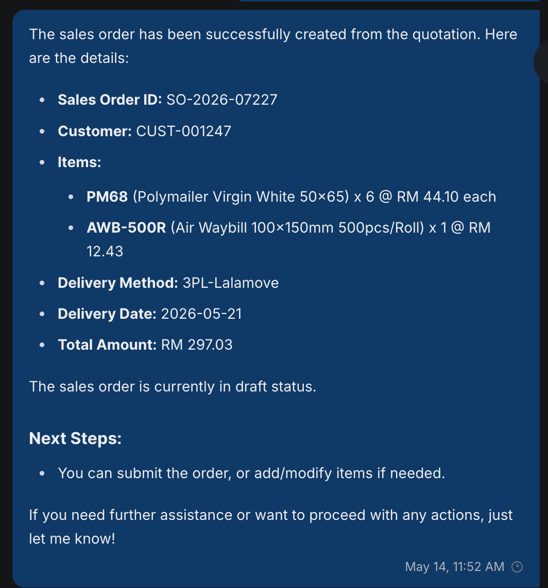
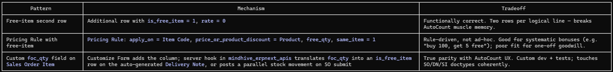

**Fixguru UAT Gaps**

Meeting Transcript : https://app.fireflies.ai/view/Fixguru-Mindhive-UAT-On-site-::01KRD9VVJ0PV89X8AYTPM8MCGQ

Meeting notes : https://claude.ai/share/29b626d3-f85b-4c42-b8ef-fc97b7d4be01

**Overall feedback**

They feel doing autocount is much faster than chatbot

**Challenge they encountered**

Fixguru salespeople handle **4--10 active customer orders simultaneously**; sequential flow won\'t work

Chatbot can **create** multiple SOs but **cannot edit mid-flow**

Salespeople reference everything by this id **number (SBI-XXX)** from autocount

**Feature: Item Historical Pricing**

Currently in their process, they can set a discount on an itheem

Their discount follows normal rounding

Historical Pricing & Discount Percentage Not Captured

Fixguru quoting depends on knowing the *last transacted price + discount %* given to each customer.

Item-Level Discount Not Supported currently

**Feature: Calculator**

Action Items

Changes:

~~Remove the SST toggle. They always want the sku\'s unit price to include tax. No need to populate tax on item columns. Their autocount and PDFs doesn\'t include tax on item.~~

~~Restriction on length must always be larger than width~~

~~Model name format: customer_name(dimension)~~

~~Add SB Cost price in the last step~~

Be able to switch between Cm/Inches

~~Be able to switch between steps~~

Bugs:

Customer dropdown not loading (during Calculator UI, the dropdown)

~~Overflowed GSM scroll area in small mobile view~~

~~Unable to populate more than one case from the case list~~

Unable to prefill past case to calculator

Concern / requires attention and discussion

They updated their RSC + Diecut formula excel versions,and needed to assess the gap with our current formula. How to handle future versionings?

On QT/SO/SI, they don\'t have tax on items. They expected the unit price to already include the Tax (SST). Their PDF doesn\'t include any information about the tax.

Item table need to be fixed

**Feature: Autocount Integration**

Gaps:

Syncing of Customer Contact (for HQ Contact), Branches (for multiple Shipping address and their respective Contact) from autocount

Client seems to be expecting using autocount PDF from start to end (even in draft mode)

Wrongly sync item_code. The item_code uses MAIA\'s instead of theirs.

Multiple contacts per customer not syncing to ERPNext

Customer company Branch-specific data (delivery addresses, contact persons) not captured per branch

Wrong PDF templates being pushed --- not following Fixguru format

Delivery Method Types

UOM conversion type

Stock balance cannot be identified

There\'s a volume metric m3 thing that want to show in the PDF of Delivery Note (Refer to Tools -\> Report Design Center) PDF layout template here ( can actually view that as a way for our PDF v3)

IAM Delivery Order

IAM Delivery Order (Branch)

Stock and warehouse sync (there\'s some shelf thing in each of their item) and they need it for the Pick List and Delivery Order

Credit Limit sync

All QTN, SO, SI from autocount not in MAIA yet (TBC)

Invoice has 143k++ which also includes ecommerce invoice(B2C) shopee, etc

Out of Scope:

**Chatbot**

**Multi-language response not working** --- chatbot responds in English regardless of input language; Fixguru has staff who cannot read English; Malay and Chinese response required;

The overdue, outstanding, and credit utilization figures for Indah Pesona are all inconsistent with each other, strongly indicating a calculation/display bug rather than accurate data.

> {width="3.1666666666666665in" height="2.0520833333333335in"}

Client prefer more actionables (i think previously already got but needs to check only) after one process has been done

Showing their product code/item code in the chatbot description

Historical Pricing expecation in chatbot interface (Standard price, Discount Provided (historical), Nett Price after Discount)

Confusion in adding item for Sales Order into a Quotation that user just talk about (Marcus)

Multitasking for Concurrency (need to test more on this to make sure the accuracy is good enough)

PDF for Chatbot when Sales Doc is not submitted is currently default PDF (user seems to expect Autocount PDF Template)

Searching for customer Sales Document fail

> {width="4.291666666666667in" height="2.125in"}

One sales team got 30 invoice per day (and they will edit here, submit there, context switching alot) need to see if our latency and performance can cope with that

**Client:** \"Convert to SO with 3pl-lalamove and add on charges rm20\", chatbot add the 3pl lalamove as delivery method, not the item (fixguru treats the delivery method as item)

> {width="2.84375in" height="3.0520833333333335in"}

Full Document Flow Traceability - make sure can retrieve\"**One SO can have multiple DOs** (partial fulfillment) and **multiple invoices** (one per DO, by DO date)\"

Out of Scope:

Reply functions in whatsapp to target certain chat : use that as context

**Gaps**

FOC quantity on the same line as billed quantity:\
Workflow: Customer order: 1000 Custom Box billable + 10 FOC. Stock must decrement 1010. Revenue captures 1000 × rate; FOC contributes 0.\
\
AutoCount. Qty and FOC Qty are sibling columns on the Sales Order Item row. Both decrement stock; only Qty × Rate hits revenue. Single row per logical line.\
\
ERPNext. No native side-by-side FOC column. Standard patterns:

> {width="5.75in" height="0.6875in"}

Their sales rep need to know, how many Volume Metrics they have\
Volume metrics

**Out of scopes**

They want to lock the items that doesn\'t allow the unit price to be changed

Multi-level stock visibility for sales commitment:\
Sales rep needs to commit a delivery date for a 1000-unit demand of custom box.\
\
Decision depends on combined availability of:\
(a) On-hand finished custom box and\
(b) On-hand raw materials convertible to custom box per the known BOM ratio (1:2).\
\
AutoCount. Both items are maintained as separate stock items. Planning is manual --- read the two on-hand figures, apply the BOM ratio, derive committable quantity.\
\
ERPNext. The same model --- separate item records with independent stock ledgers. BOM-aware availability is exposed via Bin / Stock Projected Qty reports, or computed by Production Planning Tool.

Raw→finished conversion with yield variance\
Workflow: Consume 2000 × raw mat to produce 4000 × custom box per BOM. Actual yield is 3900; the 100-unit loss must be visible against expected output.\
\
AutoCount. Single Stock Assembly Order. Operator enters consumed qty and actual produced qty; system posts both inventory movements on submit. Variance is the implicit delta between BOM-implied output and recorded output.\
\
ERPNext. Two paths:\
- Stock Entry (type: Manufacture) standalone --- closest 1:1 with the AutoCount UX. Takes a BOM, accepts fg_completed_qty below planned.\
\
- Work Order → Stock Entry against the Work Order --- full MRP(Material Requirements Planning) flow; overkill for a job-shop.\
\
100-unit loss = BOM-implied output (4000) minus fg_completed_qty (3900). Scrap can also be modeled explicitly via scrap_items on the BOM if needed downstream (costing, reporting).

Calculator

Currently MAIA supports 2 calculators (RSC + Diecut),\
but now they have 5 calculators (RSC, Diecut, Pizza, Layer Pad, 5 panels).\
\
**Decision: Allow the 2 calculators only. CR if they want to add more**

They\'ve updated their excel formula for RSC and Diecut\
\
**Decision: Consider this as a CR**

Approval process on Custom SKU that\'s below the profit\
\
**Minimal effort to do: Only allow SKU to meet the profit requirement**

**Pending from Fixguru**

The updated RSC and Diecut excels

Volume Metrics excel? Need?

Action items

What to do (Address Feedback), not going to do, CR

https://notes.granola.ai/t/44c63d17-b98b-49a1-b331-d58d0798df0e-008umkv4
