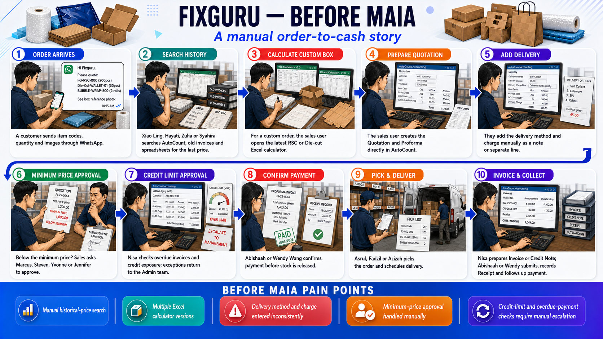
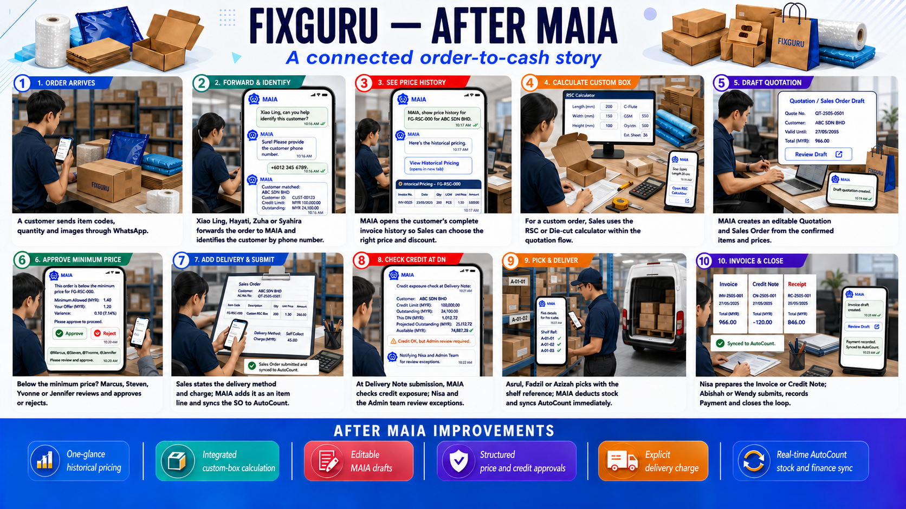

**Fixguru --- Role Workflows --- Before / After MAIA**

**Document Information**

**Client:** Fixguru (IAM Worldwide Sdn Bhd) --- B2B packaging (ready-made + custom RSC/Diecut boxes), SME → Enterprise

**Project:** MAIA Phase 2 (shared build with Ultimax)

**Document version:** v1

**Document status:** Draft workflow baseline --- ready for client validation.

**Date:** 5 Aug 2026

**Processes covered:** Order intake & historical-pricing decision, Quotation → Sales Order drafting, price/credit approval, picking & delivery, invoice/payment/credit note

**Scope exclusions:** Pizza/Layer Pad/5-panel calculators (OOS-02), WhatsApp reply-function targeting (OOS-01), hardware/on-premise (OOS-04), full driver/POD workflow (not yet a locked Scope Lock item)

**Main sources reviewed:** Scope Lock v2 --- Fixguru (24 Jun 2026, resolutions through 13 Jul 2026), Fixguru --- Unclear Scope: Client Story & Acceptance Criteria (24 Jul 2026), Fixguru --- VoC Extraction (13 Jul 2026), Fixguru --- End-user & Process Map (13 Jul 2026), Fixguru --- Lens Alignment Report v2, Fixguru business workflow (Sprint 0 kickoff notes)

**Transcripts reviewed (via secondary sources):** 2026-05-14 UAT On-site, 2026-06-24 UAT Debrief --- both already processed into VoC Extraction and Process Map; not independently re-read line-by-line for this doc

**Key evidence limitations:**

No named Sales Manager, Logistics Manager, or driver anywhere in the corpus (End-user & Process Map §6)

UAT signatory confirmed 2026-08-06: Yvonne Choo, internal champion, sole sign-off authority (previously the account\'s highest-risk open item)

The central \"Guest\" voice behind most historical-pricing/credit VoC evidence is BELIEVED, not CONFIRMED, to be Marcus Lim

Real WhatsApp order-intake message samples still outstanding (action item C1, owned by Yvonne)

**1. Purpose and Scope**

This document shows, role by role, how Fixguru\'s order-to-cash process runs **today** (direct in AutoCount, pre-MAIA habit) versus how it runs **after MAIA** per the currently LOCKED and resolved scope in Scope Lock v2. It is built for the workflow-validation session, UAT briefing, trainer prep, and go-live readiness review --- not as a feature list or a restatement of Scope Lock.

**Who should use it:** Gareth (PM) to run the validation session; Fixguru stakeholders (Sales Manager and Logistics Manager still need naming, driver status needs confirming; Yvonne Choo is confirmed as UAT signatory) to confirm role ownership; Mindhive dev/trainer team preparing UAT scripts and training material.

**What it supports:** Closing the identity gaps already flagged in the End-user & Process Map (§6) --- two unnamed manager roles and driver status remain open; UAT signatory is now resolved (Yvonne Choo) --- and giving every role a scannable \"what changes for me\" reference.

**What\'s out of scope:** Full UAT test scripts (see UAT/Fixguru --- UAT Checklist.md), the calculator\'s internal formula logic, Ultimax\'s parallel (different) workflow.

**How to read validation status:** Every process and role section is rated current-state / future-state completeness and validation status. Nothing here is rated \"Complete\" while a material role or step is still open --- see §11 for the honest overall rating.

**2. Role and Actor Coverage**

  ------------------------------- ------------------------ ---------------------------------------------------------------------------------------------------------------------------------
  Category                        Role                     Named representative(s)

  Internal --- Sales              Sales User               Xiao Ling, Hayati, Zuha, Syahira (2nd UAT testers; Syahira role-roster only)

  Internal --- Sales              Sales Manager            **Named representative: Not yet identified**

  Internal --- Logistics          Logistics User           Asrul, Fadzil, Azizah

  Internal --- Logistics          Logistics Manager        **Named representative: Not yet identified**

  Internal --- Finance            Finance Manager          Abishaah, Wendy Wang (submit rights)

  Internal --- Finance            Finance User             Nisa (no submit rights)

  Internal --- Management/Admin   Admin                    Marcus Lim, Steven Gan, Yvonne Choo, Jennifer Gan (full system access)

  External actor                  Customer                 Fixguru\'s own buyers --- no direct voice in corpus, WhatsApp-only contact

  External actor                  Driver                   **Named representative: Not yet identified** --- Client Narrative v2 references a driver/POD step; not yet locked in Scope Lock

  System/dependency               AutoCount                System of record for customer, product, stock, accounting (L-01, LOCKED)

  System/dependency               Lalamove / 3PL courier   Delivery execution vendor; captured as SKU line per L-07, not an internal role

  Vendor (not internal role)      Mindhive PM/dev team     Gareth Ng (PM), Amirul/Bryan/Azib/WeiShen (dev), Ivan (tech lead) --- delivery-side, not MAIA end users
  ------------------------------- ------------------------ ---------------------------------------------------------------------------------------------------------------------------------

Sales Manager and Logistics Manager exist as distinct roles in the client-confirmed permission matrix (different rights from Sales User / Logistics User) but currently have no assigned person --- see §7 Open Decisions.

**3. End-to-End Before / After Operating Model**

**Before MAIA**

{width="5.75in" height="3.2291666666666665in"}

  --------------------------------------------------------------------------
  Plain\
  CUSTOMER Sends WhatsApp order (item names/codes, qty, sometimes images)\
  ↓\
  SALES Looks up customer + past pricing directly in AutoCount\
  ↓\
  SALES Recalls or searches for last discount given (memory/spreadsheet)\
  ↓\
  SALES Creates Quotation → Proforma in AutoCount\
  ↓\
  LOGISTICS Picks from paper/AutoCount pick list → schedules delivery\
  ↓\
  FINANCE Issues Invoice in AutoCount → Credit Note if needed\
  ↓\
  FINANCE Records Receipt / follow-up on outstanding payment

  --------------------------------------------------------------------------

**After MAIA**

{width="5.75in" height="3.2291666666666665in"}

  ------------------------------------------------------------------------------------------------------------------------
  Plain\
  CUSTOMER Sends WhatsApp order\
  ↓\
  SALES Forwards order into internal MAIA WhatsApp chatbot\
  ↓\
  SALES Inputs customer\'s phone/WhatsApp number to search/identify customer\
  ↓\
  SALES Queries chatbot for historical pricing → taps FE link-out\
  ↓\
  SALES Decides price/discount from full invoice history, one glance\
  ↓\
  MAIA Drafts editable Quotation/SO; routes to approval if below floor\
  ↓\
  SALES Confirms delivery method + charge explicitly → submits\
  ↓\
  MAIA Syncs SO to AutoCount with AutoCount\'s own document ID\
  ↓\
  LOGISTICS Delivery Note created → MAIA checks credit exposure (DO-value triggered)\
  ↓\
  Credit exceeded?\
  ↙ ↘\
  NO YES\
  ↓ ↓\
  LOGISTICS DN proceeds MANAGEMENT/ADMIN (Marcus Lim, Yvonne Choo, etc.) reviews AR/credit/exposure → approve or reject\
  ↓\
  LOGISTICS Picks → shelf ref in DN note → stock decrements\
  ↓\
  FINANCE Invoice from delivered SO/DO → Payment → Credit Note if needed

  ------------------------------------------------------------------------------------------------------------------------

**Main operating changes**

Historical pricing decision moves from \"dig through AutoCount / recall from memory\" to a one-glance, invoice-sourced FE view triggered from chat (AIP-01/AIP-02, LOCKED) --- this is the single change Fixguru has said will decide whether they keep MAIA or revert to AutoCount.

Customer identification moves from name/code lookup to phone/WhatsApp number input directly in chat --- **proposed future step, AIP-03, not yet locked**; shown above because it is the client\'s stated intent, not because it is built.

Credit-limit enforcement becomes a formal gate at Delivery Note submission (DO-value triggered), not a manual AR reconciliation after the fact (NS-04, resolved --- built, pending client test).

Delivery charge becomes an explicit SKU/item line the sales user must state, not a metadata field silently guessed at (L-07, LOCKED).

AutoCount remains the system of record throughout --- MAIA sits on top, it does not replace AutoCount\'s accounting/stock authority (L-01, LOCKED).

**4. Major Process Flows**

**4.1 Order Intake & Historical Pricing Decision**

**Process purpose:** This is the flow Fixguru has repeatedly said decides whether MAIA gets adopted or the team reverts to AutoCount. A customer\'s WhatsApp order arrives, and Sales must quickly decide what price/discount to offer based on that customer\'s actual purchase history --- the same decision they make in seconds inside AutoCount today.

**Before MAIA**

  ---------------------------------------------------------------------------------
  Plain\
  CUSTOMER Sends WhatsApp message: item, qty, sometimes image\
  ↓\
  SALES Has only a phone number, not always a company name\
  ↓\
  SALES Looks up customer in AutoCount by name/code (phone search not available)\
  ↓\
  SALES Opens past invoices manually to check last price + discount %\
  ↓\
  SALES Decides price/discount from memory or manual invoice review

  ---------------------------------------------------------------------------------

**After MAIA**

  -------------------------------------------------------------------------------------
  Plain\
  CUSTOMER Sends WhatsApp message\
  ↓\
  SALES Forwards order into internal MAIA chatbot\
  ↓\
  SALES Inputs customer\'s phone/WhatsApp number to search/identify customer\
  (Proposed future state --- AIP-03, not yet locked; exact match only,\
  disambiguation list on multiple hits, never auto-selected)\
  ↓\
  SALES Asks chatbot for historical pricing on item/customer\
  ↓\
  MAIA Returns standalone FE URL, pre-filtered to that customer/item\
  ↓\
  SALES Opens link → sees ALL past Sales Invoice transactions in one glance:\
  item code, item name, date, invoice no, qty, standard price, discount %, net price\
  ↓\
  SALES Decides price/discount from full history, tells chatbot the price to apply

  -------------------------------------------------------------------------------------

**What changes**

Historical pricing is invoice-sourced and shown as a complete list, not capped at 5 and not manually dug up (NS-01/NS-02/NS-03, LOCKED 13 Jul 2026).

Output is a link-out to an FE page, not an inline WhatsApp table --- resolves the \"too wordy\" complaint directly (AIP-02, LOCKED).

Customer identification by phone/WhatsApp number (AIP-03) is **proposed, not locked** --- shown in the flow because it is the client\'s stated design intent (blocking item, Unclear Scope doc §1), but until locked, Sales may still need to fall back to a name/code match if the search isn\'t built yet.

**Process validation**

Current-state completeness: Complete --- well evidenced by VoC (VOC-001--006).

Future-state completeness: Partial --- pricing lookup is LOCKED and built; customer-identification-by-phone (AIP-03) is still open.

Validation status: Pending client confirmation (client has not yet re-tested the rebuilt historical-pricing flow against this exact design).

Validation basis: Directly supported --- 2026-06-24 UAT Debrief + 13 Jul 2026 resolution log.

Main unresolved decision: Whether/how phone-number customer search closes (AIP-03) --- partial-number search still unconfirmed.

**4.2 Quotation → Sales Order Drafting & Submission**

**Process purpose:** Once price is decided, Sales drafts the Quotation, sets delivery method and charge, and submits --- this is where draft editability and delivery-charge-as-SKU rules apply.

**Before MAIA**

  -------------------------------------------------------------------------------
  Plain\
  SALES Creates Quotation directly in AutoCount\
  ↓\
  SALES Adds delivery charge as a note or separate manual line, inconsistently\
  ↓\
  SALES Converts to Proforma → Sales Order in AutoCount\
  ↓\
  SALES Edits freely until formally issued

  -------------------------------------------------------------------------------

**After MAIA**

  ---------------------------------------------------------------------------
  Plain\
  SALES MAIA drafts Quotation/SO from confirmed price --- remains editable\
  ↓\
  SALES States delivery method + charge explicitly in the same instruction\
  (e.g. \"fulfillment method Lalamove, delivery charge RM10\")\
  ↓\
  MAIA Adds delivery charge as its own SKU/item line, not metadata\
  ↓\
  SALES Reviews, amends if needed, then explicitly confirms/submits\
  ↓\
  MAIA Syncs Sales Order to AutoCount using AutoCount\'s own document ID

  ---------------------------------------------------------------------------

**What changes**

Delivery charge is now a proper SKU/item line so it\'s captured correctly for invoicing and accounting (L-07, LOCKED) --- previously inconsistent.

Chatbot never auto-adds a charge without an explicit stated amount (L-07 acceptance criteria).

Draft stays editable until an explicit confirm action --- chatbot must not silently submit (L-04, LOCKED).

Item display now includes brand, not just code/name (L-08, LOCKED) --- reduces item mis-identification during drafting.

Document IDs follow AutoCount\'s own numbering, not a MAIA-internal ID (L-01/L-03 acceptance criteria).

**Process validation**

Current-state completeness: Complete.

Future-state completeness: Complete --- L-04, L-07, L-08 all LOCKED with acceptance criteria.

Validation status: Pending client confirmation for end-to-end retest.

Validation basis: Directly supported (L-04, L-07, L-08).

Main unresolved decision: None material --- this flow is the most fully locked of the set.

**4.3 Price & Credit Approval**

**Process purpose:** Two separate approval triggers exist --- a price falling below the item\'s minimum floor, and a customer\'s credit exposure. Both currently route to Management, but at different points in the flow, and the exact triggers were only recently clarified.

**Before MAIA**

  --------------------------------------------------------------------
  Plain\
  SALES Offers discount to close a deal\
  ↓\
  Nothing stops price going below floor until Finance notices later\
  ↓\
  SALES Creates Sales Order regardless of credit exposure\
  ↓\
  Credit exceeded discovered only when Finance reconciles AR

  --------------------------------------------------------------------

**After MAIA**

  ---------------------------------------------------------------------------------------------------------------------------
  Plain\
  SALES Requests price below item+UOM floor\
  ↓\
  Price-book/customer-specific price already locked?\
  ↙ ↘\
  YES NO\
  ↓ ↓\
  MAIA Bypasses approval MANAGEMENT reviews and approves/rejects\
  (unless request undercuts ↓\
  even the locked price) SALES resumes or revises\
  ↓\
  SALES Proceeds to Delivery Note stage\
  ↓\
  MAIA Checks credit exposure at DN submission (DO-value triggered)\
  ↓\
  Exposure exceeded?\
  ↙ ↘\
  NO YES\
  ↓ ↓\
  LOGISTICS DN proceeds MANAGEMENT/ADMIN (Marcus Lim, Yvonne Choo, etc.) reviews AR, credit limit, exposure, payment proof\
  ↓\
  Approve, reject, or conditionally release

  ---------------------------------------------------------------------------------------------------------------------------

**What changes**

Minimum-price check now fires before the quote reaches the customer, not after Finance notices (AIP-06, resolved --- item+UOM threshold).

Existing price-book prices bypass repeat approval --- approved once, not re-approved every order (AIP-07, resolved).

Credit block moved from order/SO stage to DN submission, triggered by DO value --- protects the sale from being killed too early while still gating before goods leave (per client\'s own stated direction, captured in the Unclear Scope doc item 3).

Approver (Fixguru\'s Admin role --- Marcus Lim, Steven Gan, Yvonne Choo, Jennifer Gan, per the permission matrix) sees full context --- AR, pending SO/DN, credit limit, available balance --- not a bare approve/reject prompt (VOC-020). Exact individual not yet confirmed.

Which Admin individuals can bypass credit approval is **still open**, pending Azib\'s AutoCount screenshot (C2). Ivan (Mindhive tech lead) is vendor-side --- he configured/built the DN-level block logic, he is not the client-side approver.

**Process validation**

Current-state completeness: Complete.

Future-state completeness: Partial --- direction decided and dev-configured for credit block; not yet client-tested (NS-04: RESOLVED-PENDING-TEST).

Validation status: Pending process-owner approval (formal write-up of the DN-level decision, currently only in the Round 3 Tech Brief, not the Scope Lock proper).

Validation basis: Working assumption for bypass-roles question; directly supported for block point + trigger + approver.

Main unresolved decision: Bypass-role list (blocked on C2); payment-proof-vs-AR-timing override remains parked (NS-05).

**4.4 Picking, Delivery Note & Stock**

**Process purpose:** Once a Sales Order is confirmed, Logistics picks the order and issues a Delivery Note, which must reflect real stock immediately in AutoCount to prevent oversell.

**Before MAIA**

  ------------------------------------------------------------------------------------
  Plain\
  LOGISTICS Receives paper/AutoCount pick list, no shelf reference captured\
  ↓\
  LOGISTICS Picks manually; stock accuracy checked only in AutoCount after the fact\
  ↓\
  LOGISTICS Issues Delivery Note; stock updated in AutoCount separately

  ------------------------------------------------------------------------------------

**After MAIA**

  ------------------------------------------------------------------------------------
  Plain\
  LOGISTICS Delivery Note generated from confirmed Sales Order\
  ↓\
  MAIA Populates shelf number in the DN additional-note field\
  ↓\
  LOGISTICS Picks using shelf reference; confirms FOC vs billable quantity\
  ↓\
  MAIA Decrements stock (billable + FOC) → pushes movement to AutoCount immediately\
  ↓\
  LOGISTICS Marks delivery ready → handoff to Driver / 3PL

  ------------------------------------------------------------------------------------

**What changes**

Shelf number now populates directly in the DN\'s additional-note field, closing a real picking-time gap (NS-08, resolved 13 Jul 2026 --- scoped fix, not full sub-warehouse modelling).

FOC quantity is tracked separately so stock deducts billable + FOC but revenue reflects billable only (L-06, LOCKED).

Stock movement pushes to AutoCount in real time on DN issuance (L-01 acceptance criteria) --- AutoCount remains the authority.

Broader warehouse-level mapping (which AutoCount table is the true source for \"warehouse,\" beyond shelf) is **still open** --- this is a technical, not a client-decision, gap.

Fixguru does not use branches --- this simplifies customer/contact handling but does not by itself resolve warehouse mapping (NS-06 resolved; NS-08 partial).

**Process validation**

Current-state completeness: Partial --- warehouse/picking detail is relayed through the sales-side voice in the corpus, not confirmed directly by a warehouse worker (VoC coverage gap, flagged \"thin-voice\").

Future-state completeness: Partial --- shelf resolved, warehouse mapping open.

Validation status: Pending ERP or technical confirmation.

Validation basis: Inferred from multiple sources (sales-relayed warehouse pain + 2nd UAT Backward Plan decision).

Main unresolved decision: Exact AutoCount module/table for warehouse; hard-block vs warn-only behaviour on insufficient stock.

**4.5 Invoice, Payment & Credit Note**

**Process purpose:** Converts a delivered order into a traceable invoice, records payment, and raises credit notes when needed --- all syncing to AutoCount as the accounting authority.

**Before MAIA**

  ---------------------------------------------------------------------------------
  Plain\
  FINANCE Re-keys delivered quantities into AutoCount\
  ↓\
  FINANCE Creates Invoice, referencing customer\'s preferred AutoCount-style PDF\
  ↓\
  FINANCE Records payment separately; reconciles AR manually

  ---------------------------------------------------------------------------------

**After MAIA**

  ------------------------------------------------------------------------
  Plain\
  MAIA Generates Invoice traceable to originating SO/DO\
  ↓\
  FINANCE Reviews (Finance User: no submit) / Submits (Finance Manager)\
  ↓\
  MAIA Syncs Invoice to AutoCount\
  ↓\
  FINANCE Records Payment → credit exposure recalculated\
  ↓\
  FINANCE Raises Credit Note if needed, linked to the submitted invoice

  ------------------------------------------------------------------------

**What changes**

Invoice traces back to its originating SO/DO automatically (L-03 acceptance criteria) instead of manual re-keying.

PDF layout parity with AutoCount, and delivery charge shown as its own PDF line, is implemented but still needs client testing (NS-10) --- was dropped between Scope Lock v1 and v2, now re-added.

SST/tax is confirmed hidden from customer-facing documents per client preference (NS-11, RESOLVED).

Credit-exposure formula (unbilled SO + outstanding invoices) is still not fully locked (VOC-029) despite being used operationally in approval decisions.

Finance User can create/edit but not submit --- only Finance Manager and Admin can submit Invoice/Payment/Credit Note (permission matrix).

**Process validation**

Current-state completeness: Complete.

Future-state completeness: Partial --- PDF parity implemented but untested; credit-exposure formula not fully locked.

Validation status: Pending client confirmation (NS-10 needs client testing/involvement).

Validation basis: Directly supported for document flow and permissions; working assumption for credit-exposure formula.

Main unresolved decision: Final credit-exposure formula; client sign-off on PDF template.

**5. Role Change Cards**

**5.1 Sales User**

**Role snapshot**

Named representative: Xiao Ling, Hayati, Zuha, Syahira

Process owner: Sales Manager (Not yet identified)

Relevant processes: 4.1, 4.2, part of 4.3 (request-side)

Current systems/channels: AutoCount, WhatsApp (personal), memory/spreadsheet for pricing

Future systems/channels: MAIA WhatsApp chatbot + FE link-out, AutoCount (via sync)

Change impact: High --- this role\'s daily workflow changes the most

Validation status: Pending client confirmation

Validation basis: Directly supported (VOC-001--006, L-04, L-07, L-08)

**Role\'s future working flow**

  ------------------------------------------------------------------------
  Plain\
  CUSTOMER WHATSAPP ORDER\
  ↓\
  SALES Forwards order into MAIA chatbot\
  ↓\
  SALES Queries historical pricing → opens FE link → decides price\
  ↓\
  SALES Drafts Quotation/SO, states delivery method + charge explicitly\
  ↓\
  MANAGEMENT Approves if below price floor and not price-book locked\
  ↓\
  SALES Confirms and submits → syncs to AutoCount

  ------------------------------------------------------------------------

**What changes for this user**

Gains a one-glance historical pricing view instead of manual AutoCount lookup.

Must state delivery method + charge explicitly --- no silent auto-add.

Draft stays editable until explicit submit --- same as before, now enforced by the system.

Customer search by phone number is not yet available --- still needs name/code lookup until AIP-03 locks.

**What the user must learn**

How to trigger and read the historical pricing FE link-out.

That price/discount decisions should reference the full invoice history now shown, not memory.

How to state delivery method + charge in one instruction.

How to recognise and respond to a below-floor-price approval hold.

**UAT scenarios required**

Happy path: forward order → check pricing → draft → submit within floor and credit limit.

Approval path: price below floor without a locked price-book entry.

Correction path: amend a draft SO before submission.

Permission case: attempt to submit an Invoice (should be blocked --- Sales has no Invoice rights).

**Open decision:** None role-specific beyond the register (§7).

**Role readiness**

Current-state completeness: Complete

Future-state completeness: Partial (AIP-03 open)

Named representative: Yes (4 individuals)

Representative validation: Partial --- named as UAT testers, not confirmed as process owners

Process-owner approval: No --- Sales Manager not yet named

Ready for UAT design: With conditions

Ready for training design: With conditions

Main blocker: No named Sales Manager to validate/approve the role\'s workflow

**5.2 Sales Manager**

**Role snapshot**

Named representative: **Not yet identified**

Process owner: Same --- unresolved

Relevant processes: 4.1--4.3 (oversight/approval-adjacent, per permission matrix --- Quotation/SO create rights, but not submit-capable per matrix)

Current systems/channels: Unknown

Future systems/channels: MAIA (per permission matrix scope)

Change impact: Cannot be assessed --- no named individual

Validation status: Not provided

Validation basis: Not provided

**Role\'s future working flow:** Cannot be drafted --- no evidence of what this role actually does day to day beyond the permission matrix\'s static rights list.

**What changes for this user:** Unknown until named.

**What the user must learn:** Unknown until named.

**UAT scenarios required:** Cannot be scoped until named.

**Open decision:** Who is the Sales Manager? This role exists in the client-confirmed permission matrix with distinct rights from Sales User but has never been assigned a person (End-user & Process Map §6, item 2).

**Role readiness**

Current-state completeness: Insufficient

Future-state completeness: Insufficient

Named representative: No

Representative validation: No

Process-owner approval: Not required (this role is not yet named to require its own approval)

Ready for UAT design: No

Ready for training design: No

Main blocker: No named individual --- highest-priority gap alongside Logistics Manager and driver

**5.3 Logistics User**

**Role snapshot**

Named representative: Asrul, Fadzil, Azizah

Process owner: Logistics Manager (Not yet identified)

Relevant processes: 4.4

Current systems/channels: Paper/AutoCount pick list

Future systems/channels: MAIA-generated Delivery Note with shelf reference in additional-note field

Change impact: Medium --- shelf reference is new, core picking motion unchanged

Validation status: Pending ERP or technical confirmation

Validation basis: Inferred from multiple sources (thin-voice --- relayed through sales, not direct)

**Role\'s future working flow**

  ------------------------------------------------------------------------
  Plain\
  SALES ORDER CONFIRMED\
  ↓\
  LOGISTICS Delivery Note generated, shelf ref in additional-note field\
  ↓\
  LOGISTICS Picks using shelf reference; confirms FOC vs billable qty\
  ↓\
  MAIA Decrements stock, pushes movement to AutoCount\
  ↓\
  LOGISTICS Hands off to Driver / 3PL

  ------------------------------------------------------------------------

**What changes for this user**

Shelf number is now visible directly on the DN, removing a manual lookup step.

FOC quantity must be confirmed separately from billable quantity at pick time.

Stock check should block DN generation when stock is insufficient (VOC-015) --- enforcement not yet independently confirmed by this role directly.

**What the user must learn**

Where to find the shelf reference on the DN.

How to record FOC vs billable quantity distinctly during picking.

**UAT scenarios required**

Happy path: pick and issue DN with sufficient stock.

Exception path: attempt DN generation with insufficient stock (should block).

FOC case: pick an order containing FOC items, confirm correct stock decrement and revenue exclusion.

**Open decision:** Warehouse-level mapping (beyond shelf) still pending technical confirmation (AIP-08/NS-08 remainder).

**Role readiness**

Current-state completeness: Partial --- thin-voice, not directly confirmed by warehouse staff

Future-state completeness: Partial

Named representative: Yes (3 individuals)

Representative validation: Partial --- named as roster entries, not directly quoted

Process-owner approval: No --- Logistics Manager not yet named

Ready for UAT design: With conditions

Ready for training design: With conditions

Main blocker: No named Logistics Manager; warehouse-mapping technical gap; no direct warehouse-worker voice in the evidence corpus

**5.4 Logistics Manager**

**Role snapshot**

Named representative: **Not yet identified**

Everything else: Same status as Sales Manager (§5.2) --- role exists in the permission matrix (Inventory, Delivery Note, Issue, Stock Reservation Entry --- create + submit) but has no assigned person.

**Open decision:** Who is the Logistics Manager? (End-user & Process Map §6, item 2.)

**Role readiness:** Insufficient across the board --- same reasoning as §5.2.

**5.5 Finance (Manager & User)**

**Role snapshot**

Named representative: Abishaah, Wendy Wang (Finance Manager --- submit rights); Nisa (Finance User --- no submit rights)

Process owner: Finance Manager (Abishaah/Wendy Wang, per 2nd UAT tester list)

Relevant processes: 4.3 (approval context), 4.5

Current systems/channels: AutoCount

Future systems/channels: MAIA (Invoice, Payment, Credit Note, Accounting) syncing to AutoCount

Change impact: Medium --- approval context becomes richer, credit block moves off their desk to DN stage

Validation status: Pending client confirmation

Validation basis: Directly supported (permission matrix); thin voice on actual approval-context needs (VoC gap --- described secondhand by sales-side actor, not by Finance/AR staff directly)

**Role\'s future working flow**

  -------------------------------------------------------------------
  Plain\
  DELIVERY CONFIRMED\
  ↓\
  FINANCE Generates/reviews Invoice traceable to SO/DO\
  ↓\
  FINANCE MANAGER Submits Invoice → syncs to AutoCount\
  ↓\
  FINANCE Records Payment\
  ↓\
  FINANCE Raises Credit Note if needed, linked to submitted invoice

  -------------------------------------------------------------------

**What changes for this user**

Credit-limit block now fires at DN submission (Logistics-triggered), not something Finance discovers after the fact during reconciliation.

SST/tax confirmed hidden from customer-facing documents (NS-11, resolved).

PDF template parity with AutoCount is implemented but not yet client-tested (NS-10).

Finance User retains create/edit rights but still cannot submit --- unchanged from today.

**What the user must learn**

How PDF output differs (or should now match) AutoCount\'s layout.

Where delivery charge appears as its own line for invoicing accuracy.

**UAT scenarios required**

Happy path: generate Invoice from delivered SO/DO, submit, record Payment.

Correction path: raise a Credit Note against a submitted Invoice.

Permission case: Finance User attempts to submit an Invoice (should be blocked).

**Open decision:** Full credit-exposure formula (unbilled SO + outstanding invoices, VOC-029) not fully locked.

**Role readiness**

Current-state completeness: Complete

Future-state completeness: Partial --- PDF and credit-exposure formula unresolved

Named representative: Yes

Representative validation: Partial --- named as testers, approval-context needs not independently verified with actual AR staff

Process-owner approval: Partial

Ready for UAT design: With conditions

Ready for training design: With conditions

Main blocker: PDF client testing (NS-10) and credit-exposure formula finalization

**5.6 Management / Admin**

**Role snapshot**

Named representative: Marcus Lim, Steven Gan, Yvonne Choo, Jennifer Gan (full system access, incl. delete on Accounting)

Process owner: Likely Marcus Lim (BELIEVED --- strongest voice in the VoC corpus) --- **not CONFIRMED**. Approver for credit/price-floor decisions is one of the four named Admins (Marcus Lim, Steven Gan, Yvonne Choo, Jennifer Gan) per the permission matrix; exact individual not yet confirmed. Ivan is Mindhive\'s tech lead (vendor-side) --- he configured/built the DN-level credit-block logic, he is not a Fixguru approver.

Relevant processes: 4.3 (approvals)

Current systems/channels: AutoCount, direct sales-team escalation

Future systems/channels: MAIA approval prompts with full context (AR, credit limit, exposure, payment proof)

Change impact: High --- approval context becomes structured instead of ad hoc

Validation status: Pending client confirmation

Validation basis: Directly supported for block point/trigger (DN submission, DO-value); working assumption for exact approver identity and \"Guest\" voice attribution

**Role\'s future working flow**

  ---------------------------------------------------------------------------------------
  Plain\
  BELOW-FLOOR PRICE OR CREDIT-EXPOSURE TRIGGER\
  ↓\
  MANAGEMENT/ADMIN Reviews full context: AR, credit limit, exposure, payment proof\
  (Marcus Lim, Steven Gan, Yvonne Choo, or Jennifer Gan)\
  ↓\
  MANAGEMENT/ADMIN Approves, rejects, or conditionally releases (partial payment case)\
  ↓\
  SALES/LOGISTICS Resumes or revises based on decision

  ---------------------------------------------------------------------------------------

**What changes for this user**

Approval prompt now (intended to) show full context in one view instead of a bare approve/reject ask (VOC-020).

Credit approval decision point moves to DN submission, DO-value triggered.

Which of the four named Admins actually approves, and who can bypass, is still unresolved (C2).

**What the user must learn**

How to read the new approval-context view once built.

The DN-level trigger point (vs the old ad hoc escalation).

**UAT scenarios required**

Happy path: approve a below-floor price request with full context visible.

Exception path: reject or conditionally release a credit-exceeded DN.

Permission case: confirm only authorized admin roles reach the approval prompt.

**Open decision:** Which named Admin is the actual approver, and bypass-role list --- both pending Azib\'s AutoCount screenshot (C2); \"Guest\" voice attribution (likely Marcus Lim, not confirmed) should be resolved at the sign-off session.

**Role readiness**

Current-state completeness: Complete

Future-state completeness: Partial --- approval-context UI not yet confirmed built/tested

Named representative: Yes (4 individuals), exact approver among them not yet confirmed

Representative validation: Partial

Process-owner approval: Partial

Ready for UAT design: With conditions

Ready for training design: With conditions

Main blocker: Confirming which named Admin approves; bypass-role list

**5.7 Driver**

**Role snapshot**

Named representative: **Not yet identified**

Process owner: Unknown

Relevant processes: Delivery execution (referenced in Client Narrative v2, not yet a locked Scope Lock item)

Current systems/channels: Unknown --- possibly fully outsourced to Lalamove/3PL

Future systems/channels: Chatbot-based proof-of-delivery upload (proposed, not locked)

Change impact: Cannot be assessed

Validation status: Not provided

Validation basis: Not provided --- zero named individuals anywhere in the corpus

**Role\'s future working flow:** Cannot be drafted --- not yet a locked process.

**What changes for this user:** Unknown.

**What the user must learn:** Unknown.

**UAT scenarios required:** Cannot be scoped until this is either confirmed as an internal role or explicitly confirmed as fully outsourced to Lalamove/3PL.

**Open decision:** Is delivery fully outsourced (in which case there is no internal Driver role to name), or does Fixguru have its own driver(s)? (End-user & Process Map §6, item 3.)

**Role readiness:** Insufficient across the board --- resolve the outsourcing question before attempting to build this role out further.

**6. Cross-Role Handoffs**

  -------------------------------------------------------------------- ------------------------------------ ------------------------------------------------------------
  From → To                                                            What moves                           Status

  Customer → Sales                                                     WhatsApp order details               Directly supported --- informal, no fixed format confirmed

  Sales → MAIA chatbot                                                 Order forwarded for processing       Directly supported (L-02)

  MAIA → Sales                                                         Historical pricing FE link           LOCKED (AIP-01/02)

  Sales → Management                                                   Below-floor-price approval request   Resolved (AIP-06/07)

  Sales → AutoCount (via MAIA)                                         Confirmed Sales Order                LOCKED (L-01, L-03)

  Sales/Logistics → Management/Admin (Marcus Lim, Yvonne Choo, etc.)   Credit-exposure approval at DN       RESOLVED-PENDING-TEST (NS-04)

  Logistics → Driver/3PL                                               Delivery handoff                     Not provided --- driver role unconfirmed

  Logistics → Finance                                                  Delivered SO/DO for invoicing        Directly supported (L-03)

  Finance → AutoCount                                                  Invoice, Payment, Credit Note sync   LOCKED (L-01)
  -------------------------------------------------------------------- ------------------------------------ ------------------------------------------------------------

**7. Open Decisions and Validation Register**

  ------ --------------------------------------------------------------------------------------------------------------------------------------------------- ------------------------------------------- --------------------------------------------------------------------------------
  \#     Question                                                                                                                                            Blocking level                              Basis

  1      ~~Who is the UAT signatory?~~ RESOLVED --- Yvonne Choo, confirmed 2026-08-06.                                                                       Resolved                                    Forensic Dossier B4/B11; debrief action item C6, now closed

  2      Who is the Sales Manager?                                                                                                                           Blocking UAT prep, blocking training prep   Permission matrix defines the role; no name assigned

  3      Who is the Logistics Manager?                                                                                                                       Blocking UAT prep, blocking training prep   Permission matrix defines the role; no name assigned

  4      Is delivery fully outsourced to Lalamove/3PL, or does Fixguru have named driver(s)?                                                                 Blocking UAT prep                           Client Narrative v2 references a driver step; zero named individuals in corpus

  5      Which of the four named Admins (Marcus Lim, Steven Gan, Yvonne Choo, Jennifer Gan) is the actual credit-exception approver, and which can bypass?   Blocking configuration or build             Pending Azib\'s AutoCount screenshot (C2)

  6      Should MAIA allow partial phone-number search when identifying a customer?                                                                          Non-blocking clarification                  AIP-03, still open

  7      Which doctype (Invoice/SO/DO) should delivery-method history reference?                                                                             Blocking configuration or build             NS-07, still open

  8      Which exact AutoCount module/table represents \"warehouse\" for stock mapping?                                                                      Blocking configuration or build             AIP-08/NS-08 remainder

  9      Should MAIA hard-block or only warn when mapped-warehouse stock is insufficient?                                                                    Blocking configuration or build             Unclear Scope doc, item 6

  10     Final credit-exposure formula (unbilled SO + outstanding invoices) --- fully locked?                                                                Blocking future-state approval              VOC-029, not yet formally locked

  11     Is the \"Guest\" voice behind most historical-pricing/credit VoC evidence Marcus Lim, Yvonne, or Gareth (Fixguru)?                                  Non-blocking clarification                  End-user & Process Map §6, item 5

  12     Can payment proof override an AR-timing credit block before AutoCount is knocked off?                                                               Blocking future-state approval              NS-05, parked/deferred by deliberate client choice
  ------ --------------------------------------------------------------------------------------------------------------------------------------------------- ------------------------------------------- --------------------------------------------------------------------------------

**8. UAT and Training Readiness**

  -------------------------- ---------------------- --------------------------- ----------------------------------------------------
  Role/Process               Ready for UAT design   Ready for training design   Main gap

  Sales User / 4.1--4.2      With conditions        With conditions             No named Sales Manager to sign off

  Sales Manager              No                     No                          Not named

  Logistics User / 4.4       With conditions        With conditions             No named Logistics Manager; warehouse mapping open

  Logistics Manager          No                     No                          Not named

  Finance / 4.5              With conditions        With conditions             PDF client test (NS-10) pending

  Management / Admin / 4.3   With conditions        With conditions             Bypass-role list, approver identity cross-check

  Driver                     No                     No                          Outsourcing question unresolved
  -------------------------- ---------------------- --------------------------- ----------------------------------------------------

**9. External Systems and Dependencies**

  ------------------------ --------------------------------------------------- ------------------------------------------------------------ ------------------------------------------- -------------------------- --------------------------------------------------------------------------------------
  System/vendor            Role in workflow                                    Info flow                                                    Manual vs integrated                        Source of truth            Confirmed fallback

  AutoCount                Customer, product, stock, accounting master         MAIA ↔ AutoCount, real-time on submit/DN issuance            Integrated                                  AutoCount (L-01, LOCKED)   Sync failure must be visible to internal users/management (L-01 acceptance criteria)

  Lalamove / 3PL courier   Delivery execution                                  Delivery method/charge captured as SKU line (L-07)           Manual booking, MAIA captures charge only   N/A --- external vendor    Not provided

  WhatsApp                 Customer intake channel, internal chatbot channel   Customer → Sales (external); Sales ↔ MAIA (internal, L-02)   Manual forward by Sales                     N/A                        Not provided
  ------------------------ --------------------------------------------------- ------------------------------------------------------------ ------------------------------------------- -------------------------- --------------------------------------------------------------------------------------

**10. Implementation Readiness Appendix**

Temporary project-status issues --- do not treat these as permanent workflow design:

  ------------------------------------------------ --------------------------------------------------------------------------------------------------------------------
  Issue                                            Status

  Historical pricing display (AIP-01/02)           Resolved in design (13 Jul 2026); Fixguru has not yet re-tested the rebuilt flow against 4 prior failed UAT rounds

  Credit-block trigger move (SO → DN)              Dev-configured (Wei Yon); needs client testing (NS-04)

  PDF/AutoCount-parity template                    Implemented; needs client testing/involvement (NS-10)

  Multilingual (Malay/Chinese) chatbot responses   Implemented; needs testing (NS-09)

  Bypass-role list for credit approval             Blocked on Azib\'s AutoCount screenshot (C2)

  Warehouse-level stock mapping (beyond shelf)     Pending technical investigation, Mindhive tech + Fixguru AutoCount admin

  Real WhatsApp order-intake samples               Outstanding action item (C1, owned by Yvonne)
  ------------------------------------------------ --------------------------------------------------------------------------------------------------------------------

**11. Final Completion Assessment**

  ---------------------------------- -------------------------------------------------------------------------------------------------------------
  Section                            Rating

  §2 Role and Actor Coverage         Partial --- 2 of 7 internal roles unnamed

  §3 End-to-End Operating Model      Complete

  §4.1 Order Intake & Pricing        Partial --- pricing LOCKED, customer search open

  §4.2 Quotation/SO Drafting         Complete

  §4.3 Price & Credit Approval       Partial --- bypass-roles and formal write-up pending

  §4.4 Picking & Delivery            Partial --- warehouse mapping open

  §4.5 Invoice/Payment/Credit Note   Partial --- PDF and credit-formula pending

  §5 Role Change Cards               Partial --- 2 roles cannot be drafted (Sales Manager, Logistics Manager), 1 role has zero evidence (Driver)
  ---------------------------------- -------------------------------------------------------------------------------------------------------------

**Overall status: Partially complete --- core workflows ready for validation.**

The order-intake, pricing-decision, and quotation/SO-drafting flows (§4.1--4.2) are the most mature and directly evidenced sections --- safe to walk through with Sales in a validation session now. Picking/delivery, approval, and invoicing (§4.3--4.5) are usable but carry real open technical and process questions that should be closed before calling this \"complete.\" The biggest structural gap is not process detail but **identity**: two manager roles and the driver role still have no named individual anywhere in the source corpus, so none of the role-level workflows for those roles can be meaningfully validated until that\'s resolved (UAT signatory is now resolved --- Yvonne Choo). Recommend running the remaining identity gaps in §7 (items 2--4) as the first agenda items in the next client session, ahead of any deeper process walkthrough.

**See Also**

\[\[03 - Clients/Active Cooking Clients/Fixguru/Scope Lock v2 --- Fixguru\]\]

\[\[03 - Clients/Active Cooking Clients/Fixguru/Fixguru --- Unclear Scope --- Client Story & Acceptance Criteria\]\]

\[\[03 - Clients/Active Cooking Clients/Fixguru/Fixguru --- VoC Extraction\]\]

\[\[03 - Clients/Active Cooking Clients/Fixguru/Fixguru --- End-user & Process Map\]\]

\[\[03 - Clients/Active Cooking Clients/Fixguru/Fixguru --- Lens Alignment Report\]\]

\[\[03 - Clients/Active Cooking Clients/Fixguru/UAT/Fixguru --- UAT Checklist\]\]
