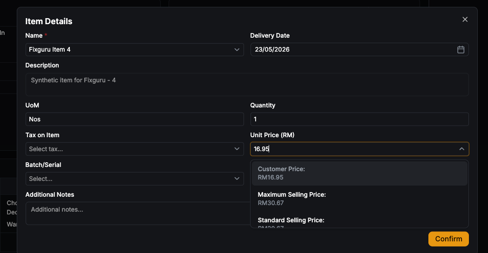
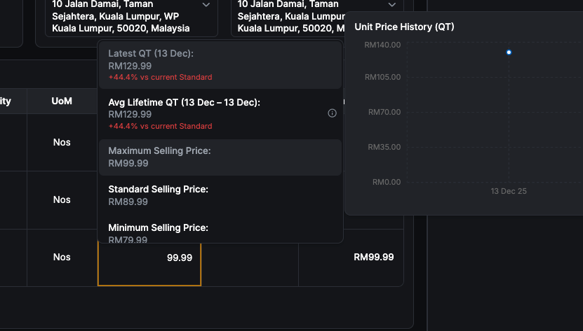

**Historical pricing testing**

**Customer Pricing**

Do unit price field in item details modal need to add the same dropdown?

{width="5.75in" height="2.9791666666666665in"}

Is the latest qt price allowed to exceed the max selling price?

{width="5.75in" height="3.2708333333333335in"}

3\. Whichever item standard price is 0, it would return the last qtn price and average lifetime price

Can invoice check historical pricing

Some items are not getting the last order price
