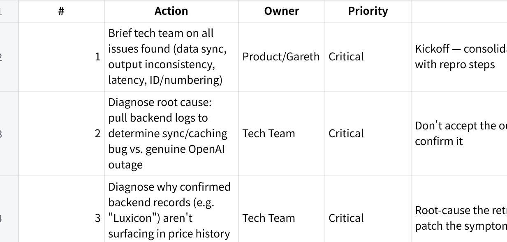

**Item Historical Pricing --- Demo & Mini UAT Summary**

**Client: Fixguru \| Date: 17 July 2026 \| Presenter: Gareth (MAIA) \| Client testers: Jennifer, Yvonne**

1\. **Overview**

MAIA demoed a pricing history feature: when creating a sales order, the system surfaces the customer\'s past transaction prices (date, quantity, unit price, discount) via a link-based UI (chosen over WhatsApp to avoid long message threads), so sales staff can pick from historical pricing when quoting.

2\. **Verdict**

Not ready for rollout. UI concept was received without objection, but testing surfaced data-accuracy and consistency issues that point to a backend problem, not just external service slowness.

3\. **What Happened in Testing**

**Missing historical price for a real customer order (likely backend sync, not outage)** --- client tester tried a customer with a known March 2026 order; system returned \"no past customer price found.\" Gareth later confirmed backend records for that customer *did* exist (referenced as \"Luxicon\") --- a data sync gap, independent of any external service issue.

**Same prompt, different results between users** --- client tester and Gareth ran the identical test on the same customer and got different outputs --- a stronger signal of backend/caching sync issue than of an external outage.

**Slow response times (1--2 min per transaction) and error messages** --- Gareth attributed this to an OpenAI outage in the moment, but this was not verified during the call.

**Draft sales orders have no PDF preview** --- PDF only generates after submission; a draft PDF can be requested manually as a workaround.

**PDF/document format doesn\'t match Fixguru\'s existing AutoCount template** --- flagged as needing alignment. Client also flagged an issue with the sales order ID/numbering, not fully detailed on the call.

**Testing was done on a shared admin login** --- individual user accounts still pending.

**Business Impact** Showing \"no data found\" for a customer that actually has pricing history, plus inconsistent results for the same query, are backend reliability issues that erode client trust regardless of response speed. These should be treated as top priority, with the OpenAI explanation not taken at face value until backend logs confirm it.

4\. **Business Impact**

Showing \"no data found\" for a customer that actually has pricing history, plus inconsistent results for the same query, are backend reliability issues that erode client trust regardless of response speed. These should be treated as top priority, with the OpenAI explanation not taken at face value until backend logs confirm it.

5\. **Action Plan**

**点击图片可查看完整电子表格**

6\. **Recommendation**

Hold next client-facing session until items 1--6 (tech team fixes) are resolved and root cause is confirmed via logs. Re-run mini UAT with Fixguru once stabilized.
