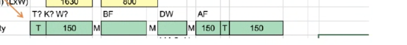
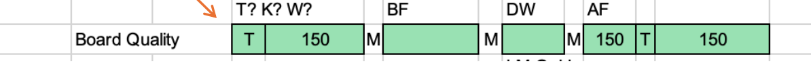
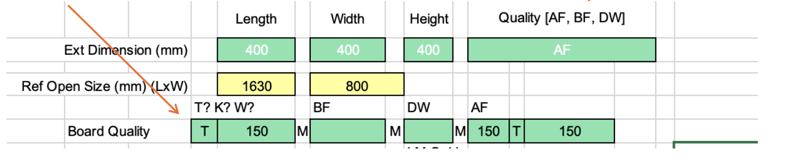
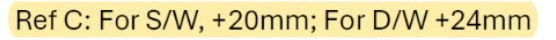

**RSC Box Calculator**

**\[Custom Made - RSC 1024 (1).xlsx\]**

**\[RSC Custom Made Calculation.pdf\]**

**Questions:**

Are there restrictions when inputing LxWxH for AF/BF/DW

Types of paper:

> Single wall - contains 3 layers of paper

A Flute 5mm thickness - corrugation pattern

B Flute 3mm thickness - corrugation pattern

> Double Wall 8 mm thickness - contains 5 layers of paper

DW = A Flute + B Flute

> Blue join - 32 mm

External dimension refers to the folded up size of the box. L x W x H

Ref open size refers to the area of the box when it is unfolded

Quality of paper M/T/K/W

T - test liner

Cheapest recycled

K - virgin paper

Aligned fibres, stronger

W - white paper

White colour paper, expensive

M - Medium paper

Usually used for corrugation as the middle layer

Density of paper will affect the quality.

Minimum liner meter - MOQ

How to understand the paper quality notation?

Example: AF T150/M150/T150 - this is the name of the type of paper

T150 - the 150 is paper density of 150g/inch2

Example: DW T150/M120/M150/M180/T150

{width="5.75in" height="0.6354166666666666in"}

M = 150/120/180

What is the filtering/selection logic to select the correct sheet board from the reference table based on user input in Page 4?

What is the meaning of AF/BF/DW in paper weight calculation?

DW = Double Wall?

SW = Single wall?

What are all possibilities?

For each sheet borad there seems to be outer, medium and inner quality quantities, what do they mean?

Meaning of Each quality M/T symbols?

What is T/ K/ W ? And how will it affect the board quality calculation

{width="5.75in" height="0.5208333333333334in"}

When will Ref Open SIze(mm) is used?

{width="5.75in" height="1.1979166666666667in"}

Ref open is for display purpose, no calculation needed, Ref open size is for reference when box is opened up to a full sheet (will reword it later)

Glue joint size for AF = 35mm, BF = 32mm, DW = 38mm.

No of Ups - number of boxes can be cut from a single pass of the sheet through the machine

Varies from supplier, machine to machine

Paper roll width calculation

Ref A - + 2 And round up

Ref B +4 and round up

Ref C - S/W + 20mm DW +24mm

> {width="5.75in" height="0.40625in"}

Max roll width = 2.5m

Min roll width = ?

Roll width round up,

1100mm-1750mm to nearest 50mm

1800mm-2200mm to nearest 100mm

Printing cost: Flexo/printing

Ink cost = ?

Glue cost= ?

**Notes:**

Estimated effort:

FE: 4 days

BE: 5 days

Test : 1 day
