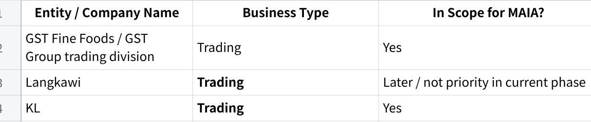
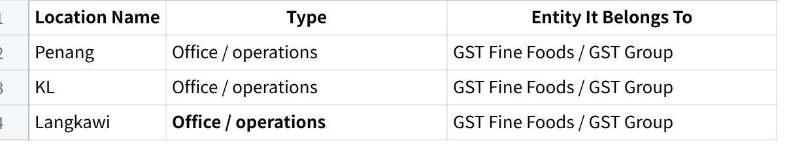
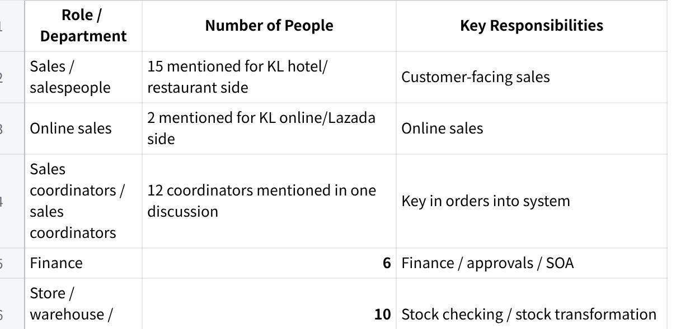
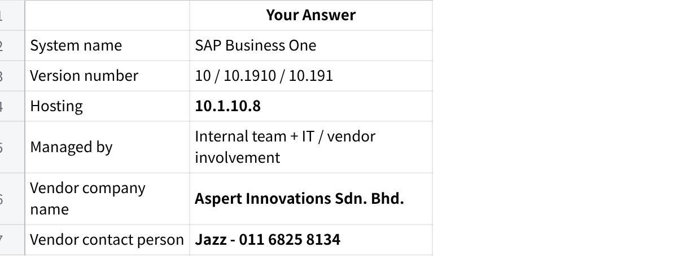
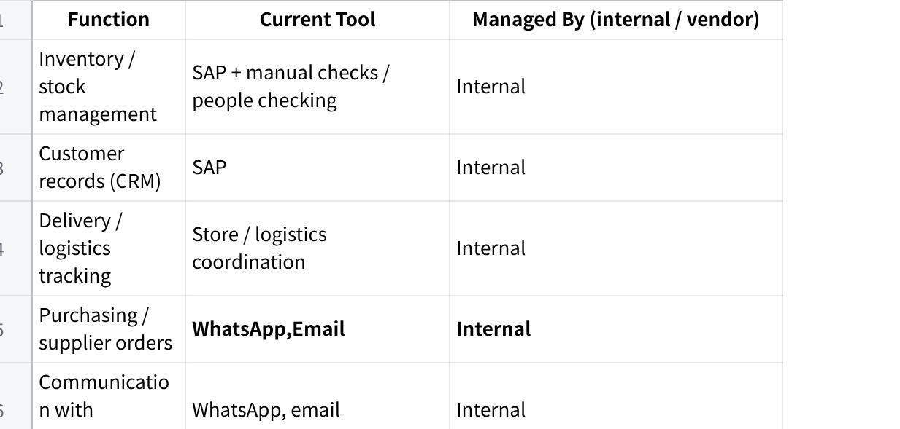
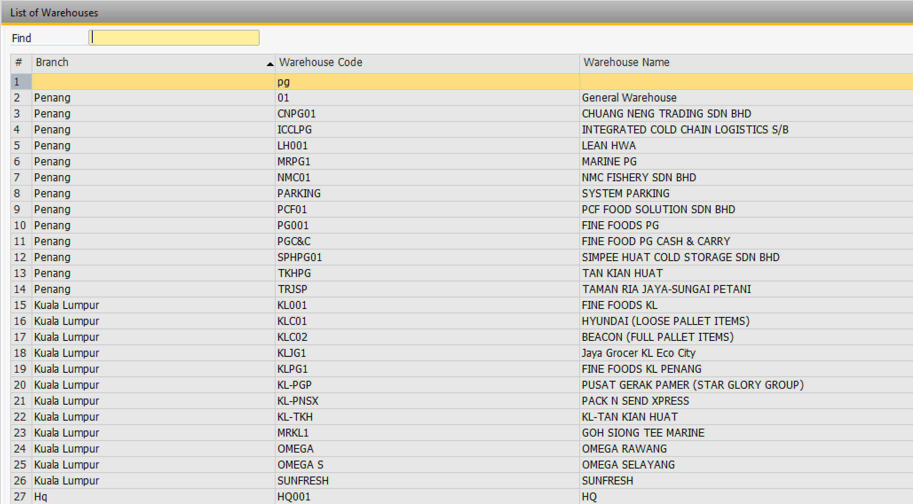
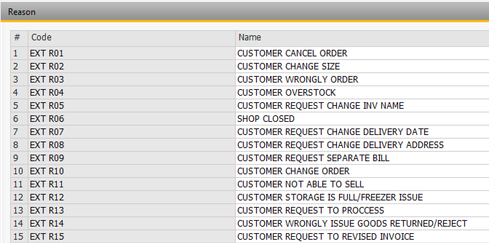
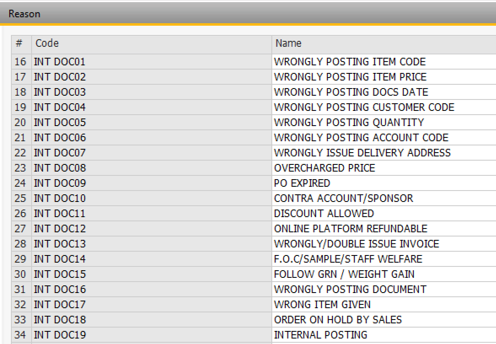
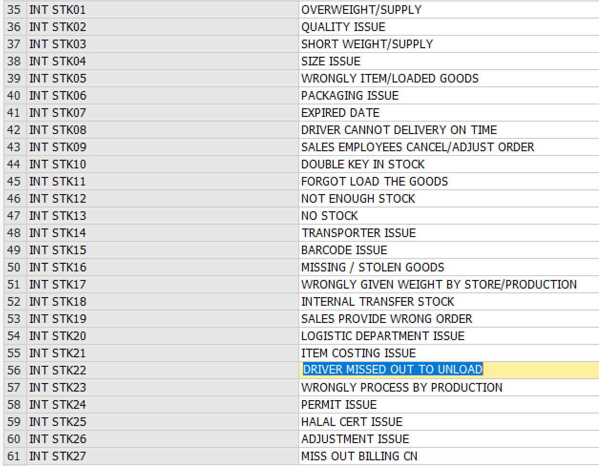
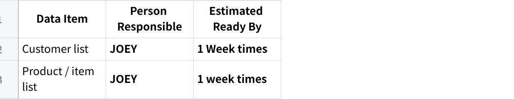

**12May26 - Pre-Onboarding Requirements Questionnaire**

*Pre-filled by Mindhive based on the 2026-05-04 GST Fine Foods requirements gathering session. Any unanswered item is marked CLIENT TO COMPLETE.*

**Client Name:** GST Fine Foods / GST Group\
**Completed By:** Mindhive\
**Date:** 2026-05-12\
**Account Manager (Mindhive):** Gareth Ng

**How to Use This Document**

This version is pre-filled based on the 4 May 2026 requirements gathering session.

If an item is marked CLIENT TO COMPLETE, GST still needs to fill it.

If an answer is incomplete, GST should correct or expand it.

**Client Completion Note**

Please review all fields marked **CLIENT TO COMPLETE** and fill them in before returning this questionnaire.

**Section 1 --- Business Structure**

**1.1** How many companies or business entities are in your group? List all of them, even if they won\'t use MAIA immediately.

**点击图片可查看完整电子表格**

**1.2** Do all entities share the same ERP / accounting system instance, or does each have its own?\
Langkawi uses AutoCount. The current project discussion is focused on SAP for the other in-scope operations. Penang and KL were discussed under the same SAP setup with separate company codes / ownership constraints.

**1.3** Do the entities share the same customer database and item database, or are they separate?\
Penang customers and KL customers are separate by ownership in SAP: Penang is Penang, KL is KL, and each customer is unique.

**1.4** How many branches, warehouses, or office locations operate across the in-scope entities?

**点击图片可查看完整电子表格**

**1.5** Do you operate in multiple currencies? If yes, which currencies and for which entities/customers?\
Main business is in Malaysia. There is also some business in Singapore. Exact currencies: **USD , SGD , RMB (CHINA) , JPY (JAPAN)**

**Section 2 --- Team & Roles**

**2.1** How many people in your company will use MAIA day-to-day?\
MAIA users would include sales, finance, warehouse/store, and management. Exact total user count: **50PAX**.

**2.2** What roles or departments will use the system, and roughly how many people per role?

**点击图片可查看完整电子表格**

**2.3** What are your standard operating hours? Do you operate on weekends or public holidays?\
**6AM-7PM**

**2.4** Do any of your staff work in the field (e.g., outdoor salespeople, drivers, service technicians)? If yes, which roles?\
Yes. Outdoor salespeople were explicitly mentioned.

**2.5** Do field staff currently have access to your ERP / accounting system? If not, why not?\
Outdoor salespeople do not have practical SAP access on mobile. They use phones, and invoice retrieval / sending PDFs is difficult unless someone inside the office helps them.

**Section 3 --- Current Systems & ERP**

**3.1** What is your main ERP / accounting system?

**点击图片可查看完整电子表格**

**3.2** Have you ever done any integration project with your ERP before?\
**Nope**

**3.3** Are there any customizations in your ERP that are not standard out-of-the-box features?\
Current setup includes:

Crystal Reports for documents

Blanket Agreement usage

stock transformation workflow

quotation function in SAP is not used because it cannot handle photos the way they want

**3.4** Do multiple users share a single ERP login, or does each user have their own account?\
Users do not share a common customer account for viewing SAP setup, and they have their own accounts. A UAT account/environment is available.

**3.5** Does your ERP have a test/UAT environment separate from the live system?\
Yes. UAT account / UAT access was explicitly discussed.

**3.6** What other systems or tools do you use alongside the ERP?

**点击图片可查看完整电子表格**

**3.7** Which of these systems would you want MAIA to connect to?\
SAP Business One and WhatsApp are the main systems to connect to.

**3.8** Are there any systems you plan to replace or stop using once MAIA is live?\
We want to reduce reliance on WhatsApp group coordination and manual back-and-forth for order handling, SOA requests, invoice retrieval, and payment follow-up.

**Section 4 --- Products, Inventory & Pricing**

**Products & Inventory**

**4.1** Approximately how many products / items (SKUs) do you carry?\
We can export about 203 items for testing/demo purposes. Total live SKU count: **1000** .

**4.2** How often are new items added?\
Approximately 10, subject to confirmation.

**4.3** Do you use product categories, brands, or groupings? If yes, describe briefly.\
Yes. We use different brands / operations including Langkawi, KL, and Penang.

**4.4** Do you manage stock across multiple warehouses or locations? If yes, list them.\
Yes. At least Penang and KL operate separately. Warehouse/bin detail:

{width="5.75in" height="3.1770833333333335in"}

**4.5** Which of the following apply to your products? (Check all that apply.)

~~Expiry dates / shelf life~~

~~Batch numbers~~

Serial numbers

~~Multiple units of measure~~

Bundle / kit products

~~Product variants~~

~~Product images are important for identification or quotation documents~~

**Notes:**

UOM issues were explicitly discussed: e.g. piece vs kg.

Variants/cut/size differences were explicitly discussed.

Product photos were explicitly discussed as a reason SAP quotation is not used.

**4.6** Do you do any processing, cutting, repackaging, or transformation of raw materials into finished goods? If yes, describe what types.\
Yes. We transform whole fish into fillet, head, tail, and other processed forms using a stock transformation process.

**4.7** Do your salespeople or account managers ever \"reserve\" stock for specific customers before a confirmed order is placed? If yes, how is this tracked today?\
Yes. There are cases where stock is informally kept for certain customers based on salesperson judgment / manual handling. This is managed manually and is not a structured system process.

**Pricing**

**4.8** How do you manage pricing? (Check all that apply.)

One standard price list for all customers

~~Multiple price lists / tiers for different customer segments~~

~~Customer-specific pricing (negotiated per customer)~~

~~Blanket agreements / contract pricing with individual customers~~

~~Volume-based or quantity-based discounts~~

~~Discount-based tiers~~

~~Price varies based on sourcing / import cost at time of order~~

Other:

**4.9** If you have multiple price lists or tiers, how many are there? What defines each tier?\
Each customer can have their own agreed price via Blanket Agreement. Number of tiers: **Wholesaler , Hypermarket, hotel & Restaurant , online consumer , Walk in Customer**

**4.10** Where is pricing data maintained today? (Check all that apply.)

Inside the ERP system

~~In a separate spreadsheet / Excel file~~

~~In the salesperson\'s memory / experience~~

Other:

**Notes:**

ERP pricing / Blanket Agreement was discussed.

Excel quotation prep / pricing with photos was discussed.

**4.11** How frequently do your costs or selling prices change? (e.g., daily for commodities, monthly, annually, by contract period)\
Pricing can be by changing weekly prices.

**4.12** Is there a person or role responsible for setting or updating prices? If yes, who?\
**Purchasing (Leying & Ms Beh)**

**Section 5 --- Sales & Order Workflow**

**5.1** How do customer orders / enquiries typically arrive? (Check all that apply.)

~~WhatsApp (text, voice message, or image)~~

~~Email~~

~~Phone call~~

~~Walk-in / counter~~

~~Customer portal / website~~

~~Marketplace (Shopee, Lazada, etc.)~~

~~Purchase Order document (PDF, Excel, or other format)~~

Other:

**Notes:** WhatsApp, email, PO, and customer group communication are used. Phone call: Yes , but very very less.

**5.2** Approximately how many sales orders are processed per day?\
We have cases where 10 orders come in and only 8 get processed while 2 are missed. Actual daily order volume: 160 invoice per day

**5.3** How many line items does a typical order contain?\
**5 lines +-**

**5.4** Who creates quotations? Who approves them?\
The salesperson prepare & reviews the quotation, and superior / manager approval is needed before it goes to the customer.

**5.5** Who creates or confirms sales orders? Is there an approval process?\
Sales coordinators / customer coordinators key the order into the system. Approval process exists for credit approval cases.

**5.6** Are there situations where a quotation or order needs special approval?\
Yes. Examples include:

credit/overdue situations requiring credit approval form

quotation needing superior sign-off before sending

**5.7** Do you handle any of the following? (Check all that apply.)

~~Customer returns / exchanges~~

~~Credit notes~~

~~Debit notes~~

~~Advance payments or deposits before delivery~~

~~Partial deliveries (order split across multiple shipments)~~

Back orders (items ordered but not currently in stock)

Consignment stock at customer sites

~~Substitution of alternative items when requested item is out of stock~~

for the other items if applicable.

**5.8** What are the most common reasons your team issues credit notes?

{width="5.75in" height="2.8541666666666665in"}

{width="5.75in" height="3.9791666666666665in"}

{width="5.75in" height="4.479166666666667in"}

**5.9** Can salespeople currently create credit notes, or is that restricted to finance?\
**No , sales person is not allowed , CN issued by the Sales coordinator and approval by Manager**

**Section 6 --- Delivery & Logistics**

**6.1** How do you deliver goods to customers? (Check all that apply.)

~~Own fleet / in-house drivers~~

~~Freelance / contract drivers~~

~~Third-party courier / logistics company~~

~~Customer self-pickup~~

Other:

**6.2** Do you plan delivery routes or trips? If yes, how is this done today?\
**Yes, we planned based on the order on the day & driver attendance. Not fixed**

**6.3** Do drivers currently capture proof of delivery (signature, photo)?\
**No ( We wish to have this )**

**6.4** Do you handle cash-on-delivery (COD)? If yes, how is COD reconciled with finance?\
**No , driver is not allowed to collect cash.**

**6.5** Is the delivery order and invoice issued at the same time, or separately?\
**Same time**

**Section 7 --- Finance, Payments & Credit**

**7.1** What payment methods do your customers use? (Check all that apply.)

~~Bank transfer~~

~~Cheque~~

~~Cash~~

Cash on delivery (COD)

~~Credit terms (net 30, net 60, etc.)~~

~~Online payment gateway~~

Other:

Credit terms are used. Other payment methods:

**7.2** Do you extend credit terms to customers? If yes, what are your standard terms? (e.g., 7 days, 30 days, 60 days)\
Yes. Standard terms mentioned include 30 days, 60 days, and 90 days. ( **We have also** 7, 14, 120 days)

**7.3** Do you set credit limits per customer? If yes, what happens when a customer exceeds their limit? (e.g., order blocked, requires manager approval, warning only)\
Yes. Credit standing / credit block exists in SAP. If overdue or over limit, internal sales needs to fill in a credit approval form and get approval.

**7.4** Is your credit limit enforcement managed inside the ERP, or tracked manually?\
Both. SAP has credit block / popup behavior, but approval handling is manual through form + WhatsApp + sign-off.

**7.5** How do customers notify you when they\'ve made a payment? (e.g., WhatsApp message to salesperson, email to finance, upload to portal)\
Customers notify the sales team, and this happens via WhatsApp.

**7.6** Do you send Statements of Account (SOA) to customers? If yes, how often and how? (e.g., monthly PDF email, manual process)\
Yes. SOA is emailed to customers, for all customers, monthly, and is currently handled manually one by one from SAP export / Crystal flow.

**7.7** What is your e-invoicing status?\
**We fully comply now**

**7.8** Do customers prefer individual invoices per delivery, or consolidated monthly invoices? (Is it a per-customer preference?)

**Individual invoices for customer have implented , and consolidated for customer not required**

**7.9** Are there any tax exemption scenarios relevant to your business? (e.g., C1, C3, A57 certificates, LMW, export exemptions)\
**No**

**Section 8 --- Documents & Reports**

**8.1** What documents do you currently generate for customers? (Check all that apply.)

~~Quotation~~

~~Proforma invoice~~

~~Sales order confirmation~~

~~Invoice~~

~~Delivery order / delivery note~~

~~Pick list (internal)~~

~~Credit note~~

~~Debit note~~

Payment receipt

~~Statement of Account (SOA)~~

Other:

Other document types if applicable:

**8.2** Are your document templates generated by the ERP\'s built-in report engine (e.g., Crystal Reports for SAP B1)? If yes, which documents?\
Yes. Crystal Reports is used for SAP documents / formats. Most of the documents above are create by Crystal Reports.

**8.3** Are there specific fields, references, or formatting on your documents that your customers or regulators require?\
Yes. We care about Crystal Report document formatting, and quotations need product photos.

**8.4** What reports do you look at regularly?\
We look at SOA and planning-related Excel/report outputs. Sales dashboard/reporting is also relevant.

**8.5** Are there any reports you currently build manually in Excel that you wish were automated?\
Yes. We manually pull planning-related Excel data for production, planning, and historical sales.

**Section 9 --- Communication & Channels**

**9.1** Do you have a WhatsApp Business account? If yes, is it a regular WhatsApp Business app or WhatsApp Business API (WABA)?\
Meta Business account and WhatsApp Business setup still need to be created.

**9.2** Would you want MAIA to communicate with your customers via WhatsApp? (e.g., order confirmations, delivery updates, payment reminders)\
Yes.

**9.3** Would you want MAIA to help your internal team via WhatsApp? (e.g., sales staff creating orders through chat, drivers receiving trip details, payment proof forwarding)\
Yes.

**9.4** What primary languages does your team use in daily operations? (e.g., English, Malay, Chinese --- specify Mandarin/Cantonese if relevant)\
This depends on staff. KL staff were described as Malay-speaking, Chinese is used operationally, and SAP/interface usage is in English.

**9.5** What primary languages do your customers communicate in?

English (Main), Chinese, Cantonese, Hok Kien , Malay

**Section 10 --- Pain Points & Priorities**

**10.1** What are the top 3 problems you want MAIA to solve? (In your own words --- be as specific as possible.)

Too much manual order handling from WhatsApp / email into SAP

Stock / reservation / availability handling is manual and causes issues

Finance coordination for credit approval, SOA, invoice retrieval, and payment follow-up is manual

**10.2** What currently takes the most time in your daily operations that you wish was faster or easier?\
Manual key-in from WhatsApp / PO into system, invoice retrieval for outdoor salespeople, manual SOA emailing, and payment follow-up via WhatsApp.

**10.3** Is there anything that currently \"falls through the cracks\" --- orders missed, documents lost, follow-ups forgotten?\
Yes. When order volume is high, we may receive 10 orders but only key in 8 and miss 2.

**10.4** If MAIA could only do one thing for your business, what would it be?\
Automate order intake / mapping from WhatsApp into SAP and reduce manual coordination around that flow.

**10.5** Is there anything your team currently does outside the ERP system (in WhatsApp, spreadsheets, paper, or memory) that you believe should be in a system? Describe briefly.\
Yes. Examples include:

order intake and coordination via WhatsApp groups

manual quotation work in Excel

manual credit approval form via WhatsApp

manual SOA sending

invoice retrieval requests through internal back-and-forth

**Section 11 --- Data Readiness**

**11.1** Can you provide the following in Excel or CSV format? (Check all you can provide.)

Customer list (company name, code, contact person, phone, email, address, credit terms, credit limit)

Product / item list (SKU/code, name, description, unit of measure, category, active/inactive status)

Price list(s) --- standard and/or customer-specific

Current stock balances (item, warehouse, quantity)

Supplier list (if relevant for purchasing)

We can export about 203 items and 50 customers for demo/testing. Other data types:

**11.2** For each item checked above, who in your team will prepare this data?

**点击图片可查看完整电子表格**

**11.3** Please provide 3--5 sample transaction documents. These help us understand your document formats, field requirements, and workflow. (e.g., a recent quotation, sales order, invoice, delivery order, credit note, customer PO, pick list)\
We can provide sample data and screen recordings of how SAP order handling works. Customer PO / quotation / invoice examples are relevant.

**11.4** Do you want historical transaction data (old orders, invoices, etc.) available inside MAIA, or are you comfortable starting fresh with forward-only data?

Forward-only (new transactions from go-live onwards) --- *standard*

Want historical data migrated --- Approximate date range: 2024

Unsure --- to discuss

**Want Historical Data Migrated , so that the Dash Board can read and compare 3 years back. Example 3 years back sales revenue and profit.**

**Section 12 --- Timeline & Project Ownership**

**12.1** When do you need MAIA to be operational? Is there a hard deadline? (e.g., tied to a contract, season, audit, or event)\
**1/8/2026**

**12.2** Who from your team will be the **internal project owner** --- the day-to-day contact during onboarding? (Ideally someone operational who understands the daily workflow, not only a department head.)

**点击图片可查看完整电子表格**

**12.3** Who will be the **decision-maker** if we need approvals during setup? (e.g., on workflows, permissions, integrations, scope decisions)

**点击图片可查看完整电子表格**

**12.4** Are there any upcoming events that might affect your availability during onboarding? (e.g., holidays, audits, travel, peak season)\
**No**

**What Happens Next**

GST should:

review the pre-filled the answers

correct anything inaccurate

fill all fields marked **CLIENT TO COMPLETE**

*MAIA by Mindhive --- Client Onboarding Questionnaire v2.0*
