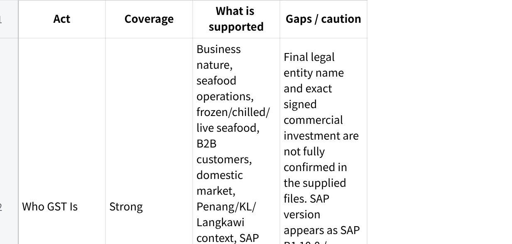

**22 June 26 - GST Client Narrative**

**Source Coverage**

**点击图片可查看完整电子表格**

**Discovery Gaps to Close**

**Investment figure** --- Fireflies records mention RM27,500 one-time fee and monthly charges from RM2,500, but the signed proposal / final investment figure is not present in the project files. Do not include the investment block until confirmed.

**Phase 1 branch** --- Sources suggest Penang should be initial focus because of B2B volume, while other notes mention KL/Rawang operational walkthrough and branch expansion. Confirm whether Phase 1 is Penang, KL/Rawang, or both.

**SAP version and integration readiness** --- SAP Business One is confirmed. Exact version, Service Layer availability, UAT access, VPN/security requirements, and custom endpoint coverage still need final technical confirmation.

**SAP custom/UDF fields** --- The SAP vendor discussion says custom fields must be mapped and that some fields may need custom endpoints. This is a build blocker.

**Crystal Reports / document samples** --- GST's document formats and numbering expectations are important, especially DO/invoice numbering, but gold-standard PDF samples still need to be supplied.

**Approval RACI** --- Manager/superior approval is confirmed for credit and quotation exceptions, but named sign-off authorities and fallback rules are not fully locked.

**Batch / expiry discipline** --- Some sources indicate batch/expiry relevance; other notes say batch tracking is currently not actively maintained enough for expiry-level alerts. Phase 1 should use movement/aging signals unless batch/expiry data discipline is confirmed.

**Check-in / customer visit report** --- GST asked about sales check-in and customer visit reporting after RG. It is not currently in MAIA and should be treated as optional customisation, not core scope.

**MAIA for GST Fine Foods**

**A structured coordination layer for GST's sales, finance, warehouse, and SAP workflows**

*Prepared by Mindhive for GST Fine Foods / GST Group*

**Who GST Fine Foods Is**

GST Fine Foods is part of GST Group, a Malaysian seafood operation involved in farming, hatchery, processing, trading, and distribution.

The business supplies frozen, chilled, and live seafood into B2B channels, mainly across the domestic Malaysian market. Its customers include supermarkets, hotels, restaurants, and food-service operators. The operation also handles processing and trading, not only simple buy-and-sell distribution.

That matters because GST does not only sell standard packed goods.

A whole fish may be received as raw stock, sold by KG, cut into fillet, head, tail, or other finished forms, repacked into smaller formats, and moved through SAP as part of a value-preserving stock transformation process. A customer may care not only about the item, but also the cut, portion, weight, packaging, description, pricing agreement, and delivery document format.

GST's operating environment is already systemised. SAP Business One is the core ERP for the in-scope operations. SAP holds the item master, customer master, stock, pricing logic, credit limits, Blanket Agreements, document generation, and financial record. Langkawi uses AutoCount, while the current MAIA discussion is centred on SAP for the other in-scope operations.

The in-scope operation is not small. The pre-onboarding questionnaire records 50 expected MAIA users across sales, finance, warehouse/store, and management. It records a total live SKU count of 1,000, around 160 invoices per day, and a typical order size of around five lines.

GST also operates across branch boundaries. Penang and KL are discussed under the same SAP setup with separate ownership controls. Customers are unique, not duplicated by branch, while users and documents are controlled by ownership or branch attribution.

That is the system.

Here is the problem.

SAP is the system of record, but too much of the operational work happens around SAP.

**Before MAIA --- How GST Operates Today**

GST Fine Foods does not have a software problem.

It has a coordination problem.

Orders and enquiries arrive through WhatsApp, email, phone calls, walk-ins, customer portals, marketplaces, purchase order documents, voice messages, Excel files, and PDF documents. Salespeople communicate with customers. Sales coordinators key orders. Warehouse and inventory teams pick, weigh, process, and fulfil. Finance handles payment, credit, invoices, returns, and SOA. Managers approve exceptions.

The work moves, but it moves through people.

The business depends on people remembering, forwarding, checking, approving, re-keying, and following up correctly.

**Quotation work starts as translation**

A customer does not always send an order in GST's internal language.

They may send an Excel RFQ. They may send a PDF. They may send a WhatsApp message, voice note, or image. The wording may describe the product by species, cut, size, portion, weight, packaging, origin, or customer habit rather than GST's SAP item name.

The sales team has to translate that request into GST's internal item logic.

That means identifying the intended item, checking what can be fulfilled, deciding whether a substitution is possible, checking stock, checking the customer's agreed price, and preparing the quotation for approval.

The work is not merely "create quotation".

It is interpret, match, verify, price, and only then quote.

When the person handling it is experienced, much of that work happens from memory. When the person is new, the same work slows down. That is the dependency: customer and product knowledge sits in people before it sits in the process.

**Pricing is not a simple price list**

GST's pricing is customer-specific.

The sources show multiple price tiers and customer-specific pricing through Blanket Agreements, contract pricing, volume-based conditions, discount tiers, and weekly price movement. Purchasing, including Leying and Ms Beh, is identified as responsible for setting or updating prices.

SAP can detect agreed customer-specific pricing when the order or invoice is created inside SAP.

The problem is the work that happens before that point.

Quotation prep may happen through Excel, WhatsApp, salesperson memory, or spreadsheet references before the order is cleanly created in SAP. If pricing is not pulled from the correct source at the right time, the team risks quoting from memory or outdated context.

This is not a cosmetic problem.

If the wrong agreed price is used, the order is already damaged before it reaches fulfilment.

**Credit approval lives outside the clean system path**

GST manages customer credit terms based on customer credit application forms. Terms include 30 days, 60 days, 90 days, 7 days, 3 days, and other customer-specific terms.

SAP blocks customers based on credit limit or overdue status. That control is real.

But the approval flow around the block happens through WhatsApp.

A manager or superior must approve before goods can be released. The notes record that managers may miss the message, approval can be delayed by 2--3 hours, and the order-taking process slows down.

That is the double loss.

SAP is strict enough to block the risk, but the release decision still travels through a channel where messages get buried.

**Pick-list execution creates double handling**

GST's current pick-list process has a manual execution gap.

A pick list is generated. Warehouse picks items. Warehouse manually annotates the actual picked quantity on the printed pick list. Sales support receives the annotated pick list. Sales support re-enters the actual picked quantity back into the system.

That creates double data entry, manual delay, error risk, weaker real-time stock accuracy, and dependency on sales support.

The pain is not that warehouse does not know what to pick.

The pain is that the truth of what was actually picked is captured on paper first, then has to be manually translated back into the system.

**Seafood processing is not standard inventory movement**

GST's seafood operation has stock transformation scenarios that standard sales-order logic does not cover cleanly.

Whole fish can become fillet, head, tail, or other finished outputs. A 1kg pack can be repacked into smaller 200g packs. Raw material can become retail packaging. Glazing may be applied.

GST's accounting constraint is explicit: total input value must equal total output value.

If salmon worth RM100 becomes fillet plus salmon head, the output value must still reconcile to RM100. SAP has been customised to enforce this value consistency. Users cannot create the transformation document if the value does not reconcile.

This is a major workflow.

It is not a standard BOM story. It is a stock transformation and accounting-control story.

**Stock commitment is not visible enough at the moment of selling**

GST has a stronger confirmed-order reservation need than an informal pre-PO reservation need.

The issue is preventing overselling once an order is confirmed. Salespeople need to see stock already committed to confirmed orders so they do not sell stock intended for another customer.

GST also needs visibility when a confirmed order is not moving. If a customer ordered 200 pieces of salmon, only 50 have been fulfilled, and 150 remain stagnant, that should not stay invisible.

The current operating risk is simple: total stock alone is not enough.

Sales needs available stock, committed stock, and stale commitment visibility.

**Customer preferences are operational, not decorative**

GST needs to capture customer-specific preferences at every interaction.

Examples in the notes include Shangri-La wanting butterfly cut, another customer wanting cleaned and gutted fish, and customers having preferred cut, processing method, packaging style, or remarks.

Today, those preferences are remembered manually or inserted into remarks.

That is too fragile.

A customer preference that affects cutting, picking, delivery, quotation, or document description is not a CRM note. It is an operating instruction.

**Salespeople cannot retrieve invoices cleanly from the field**

Salespeople frequently ask backend or finance to resend invoices to customers.

Customers say, "I don't have this invoice" or "please send me again." Backend may miss the request, causing delays of up to days.

The source also records that outdoor salespeople do not have practical SAP access on mobile. They use phones, and invoice retrieval or PDF sending is difficult unless someone in the office helps them.

That means customer service and collection follow-up depend on someone else's availability.

The salesperson owns the relationship but does not have direct access to the document the customer is asking for.

**SOA is important, but access control matters**

GST sends statement of account to customers monthly before the 3rd day of the month. SOA applies to all B2B customers except cash sales customers.

GST wants automated monthly SOA email, customer-specific SOA, invoice detail visibility, and a possible link-based self-service SOA page.

But they also raised the right security concern: if a customer forwards the SOA link, unauthorised people may see transaction information.

So SOA is not just a PDF automation feature.

It is a controlled-access financial information feature.

**After MAIA --- What Changes**

MAIA does not replace SAP Business One.

SAP remains the system of record.

MAIA replaces the scattered coordination layer around SAP.

It gives sales, finance, warehouse, and management one structured workspace for the work that currently moves through WhatsApp, memory, paper, Excel, and repeated follow-up.

**A salesperson or coordinator starts with the customer's message**

A customer sends a PO, Excel file, WhatsApp message, image, or voice note.

The salesperson or coordinator forwards the request into MAIA.

MAIA structures the request into a draft. It extracts the line items, quantities, and customer context where possible. It suggests likely internal product matches from GST's item data. Where the request is ambiguous, MAIA does not pretend to know. It asks for human confirmation or presents likely options.

The human still decides.

MAIA removes the reconstruction work.

**Product matching becomes reviewable instead of memory-based**

When a customer asks for a product in their own wording, MAIA surfaces likely matches based on GST's item master, customer history, product attributes, and configured matching logic.

If the requested SKU is out of stock, MAIA can surface substitute item suggestions.

But substitution stays advisory.

The salesperson still confirms with the customer. MAIA does not silently change the item. It supports the conversation; it does not replace the commercial decision.

**Pricing comes from the right place**

When a quotation or order is prepared, MAIA checks customer pricing context.

If GST's agreed pricing is maintained through SAP Blanket Agreements or customer-specific pricing data, MAIA must support or integrate with that logic. If no valid price is available, MAIA should expose the gap rather than letting the user proceed based on memory.

This is one of the load-bearing success criteria.

MAIA is only useful here if it protects the sales team from quoting the wrong price.

**Credit approval becomes structured**

When a customer is over credit limit or overdue, MAIA surfaces the credit block signal before the order moves forward.

The approval request is routed to the right manager or superior with the relevant order and customer context. The approver can see what needs review. The salesperson can see whether the approval is pending, approved, or rejected.

The point is not to weaken SAP's control.

The point is to stop the approval from being buried in WhatsApp.

**Payment proof gets its own workflow**

When a customer sends payment proof, the salesperson can forward it into MAIA.

MAIA creates a structured payment-review item with the attachment, customer, amount, and related invoice/order context where available. Finance reviews it, checks against bank records, and confirms before closing or updating the order.

MAIA does not auto-approve payments.

Finance stays in the seat.

The difference is that payment proof no longer lives as a screenshot inside a WhatsApp group.

**Pick-list execution captures actual quantities directly**

Warehouse actuals need to enter the system at the point they become true.

Instead of warehouse manually annotating paper and sales support re-entering actual picked quantities later, MAIA should allow actual picked quantity capture directly in system.

This reduces double data entry, delay, and error risk.

It also makes actual fulfilment visible earlier to sales, operations, and management.

**SAP stock transformation remains SAP's job**

MAIA should not replace GST's SAP stock transformation workflow in Phase 1.

GST's transformation logic has accounting consequences. Input value must equal output value. SAP has custom logic enforcing that reconciliation. Moving that too early would create unnecessary operational and financial risk.

So Phase 1 should respect the boundary:

SAP remains the transformation and record-of-accounting engine.

MAIA structures the surrounding workflow, captures what users need to do, reflects the resulting stock and document status, and reduces coordination loss around the process.

**Committed stock becomes visible before sales over-promises**

MAIA should show stock already committed to confirmed orders.

A salesperson preparing an order should not only see "stock exists". They should see whether that stock is already spoken for.

If a confirmed order is not moving, MAIA should flag it. The team should see stale commitments before they become silent stock traps.

This does not require MAIA to invent demand planning.

It requires MAIA to make order commitment visible at the moment decisions are being made.

**Customer preferences become part of execution**

When GST records that Shangri-La wants butterfly cut, or that a customer wants cleaned and gutted fish, MAIA should not bury that in a passive profile note.

That preference should flow into quotation, sales order, pick list, processing instruction, fulfilment remark, and chatbot context.

The next person serving the customer should not need to know the preference from memory.

The system should carry it forward.

**Salespeople can retrieve invoices without waiting for backend**

A salesperson in the field can ask MAIA for the customer's invoice.

MAIA retrieves or exposes the synced invoice record from SAP and allows the salesperson to send it to the customer without asking backend or finance to pull the PDF manually.

This improves customer response time and reduces backend interruptions.

It also improves collections because "please send invoice again" becomes a self-service task, not a multi-person follow-up loop.

**SOA becomes controlled, not merely automated**

MAIA can support monthly SOA generation and delivery for B2B customers except cash sales customers.

But it must be designed with controlled access.

A secure encrypted link, time-limited validity, and authentication or access-control rules are not optional details. They are the difference between useful self-service and a data leakage risk.

**Management sees the work without reading every message**

For managers, MAIA becomes the operational control layer.

It shows quotations, orders, credit exceptions, payment proofs, stale commitments, invoice requests, SOA status, stock movement signals, and items that need attention.

Management no longer has to infer business health from WhatsApp traffic.

They can see what is stuck, who owns it, and what needs a decision.

**Feature Deep Dive**

1\. **Quotation Intake and Product Matching**

**What it does**

MAIA receives customer quotation inputs, including Excel files and other customer-supplied order material, and turns them into structured drafts for review. It helps match customer wording against GST's internal products, attributes, and customer context.

**What it will not do**

MAIA will not guarantee perfect autonomous matching for every ambiguous product case. A human user must review and confirm uncertain matches.

**Why it matters**

This reduces the manual translation burden and makes quotation preparation less dependent on experienced staff memory.

2\. **Standard Order Creation**

**What it does**

MAIA helps create structured sales orders from normal customer POs, text messages, voice inputs, and other order channels, then pushes the agreed order data into SAP.

**What it will not do**

MAIA should not create a second disconnected order system. SAP remains the final system of record.

**Why it matters**

GST avoids duplicate operational truth. Users work through MAIA; SAP stores the clean final records.

3\. **Customer-Specific Pricing and Blanket Agreement Support**

**What it does**

MAIA checks customer-specific pricing context, including SAP Blanket Agreement logic where applicable, before a quotation or order is confirmed.

**What it will not do**

MAIA should not rely on generic pricing when customer-specific pricing exists. It should also not invent prices when the pricing source is missing.

**Why it matters**

Pricing errors are commercially expensive. This feature protects margin, customer trust, and order accuracy.

4\. **Credit Approval Workflow**

**What it does**

MAIA surfaces credit block conditions and routes approval requests to the responsible manager or superior, with status and audit trail.

**What it will not do**

MAIA does not override SAP credit control or auto-release blocked customers.

**Why it matters**

Credit approval stays controlled, but no longer disappears into WhatsApp.

5\. **Payment Slip Review**

**What it does**

MAIA receives payment proofs, structures the review item, and routes it to finance for checking before order closure or payment application.

**What it will not do**

MAIA does not replace finance verification against bank records.

**Why it matters**

Payment proof becomes traceable work, not a screenshot buried in a chat group.

6\. **Pick List and Actual Picked Quantity Capture**

**What it does**

MAIA supports actual picked quantity capture directly in system, reducing paper-to-system re-entry.

**What it will not do**

MAIA does not eliminate warehouse judgement or physical picking responsibility.

**Why it matters**

The picked quantity is where physical truth meets system truth. Capturing it earlier reduces fulfilment errors.

7\. **Stock Transformation Visibility**

**What it does**

MAIA respects SAP's stock transformation workflow and reflects the relevant resulting data and order state.

**What it will not do**

In Phase 1, MAIA should not replace SAP's value-preserving transformation engine.

**Why it matters**

GST's transformation process has accounting consequences. Replacing it prematurely would create more risk than value.

8\. **Committed Stock and Stale Order Signals**

**What it does**

MAIA shows stock committed to confirmed orders and flags confirmed orders that are not being fulfilled or consumed.

**What it will not do**

MAIA does not automatically release customer commitments or reassign stock without human decision.

**Why it matters**

Sales needs to know not only what stock exists, but what stock is already spoken for.

9\. **Customer Preference Memory**

**What it does**

MAIA captures customer-specific preferences and pushes them into the operational workflow: quotation, SO, pick list, processing instruction, fulfilment remark, and chatbot context.

**What it will not do**

MAIA does not decide customer preferences on its own. It carries forward what GST records and confirms.

**Why it matters**

Customer-specific operating knowledge stops being trapped in individual memory.

10\. **Invoice Retrieval and SOA Access**

**What it does**

MAIA allows salespeople to retrieve invoice copies and supports SOA generation or access workflows for customers.

**What it will not do**

MAIA should not expose financial documents through uncontrolled links.

**Why it matters**

Sales can serve customers faster, finance faces fewer interruptions, and SOA becomes scalable without compromising confidentiality.

11\. **SAP Integration via Middleware**

**What it does**

MAIA connects to GST SAP B1 through middleware, starting with SAP B1 standard service-layer routes where possible and adding custom endpoints where UDFs or GST-specific fields require them.

**What it will not do**

MAIA cannot proceed safely until custom fields, endpoint requirements, UAT access, and integration ownership are confirmed.

**Why it matters**

If MAIA and SAP disagree, the project fails. Integration accuracy is not a technical detail; it is the backbone of the deployment.

**Scope Summary**

**Included in Phase 1, subject to final scope confirmation**

Quotation intake and draft preparation

Product matching support

Standard order creation

SAP Business One integration through middleware

Customer-specific pricing / Blanket Agreement support, subject to SAP endpoint access

Credit block signal and approval workflow

Payment slip review workflow

Invoice retrieval support for salespeople

Actual picked quantity capture

Customer preference capture

Confirmed-order stock commitment visibility

Stale confirmed-order signal

Stock movement / inactive item notification based on available data

Backend visibility for quotations, orders, payments, exceptions, and follow-up

**Designed For, Not Included Unless Confirmed**

Full SOA self-service customer portal

Advanced SOA authentication design

Informal pre-PO stock reservation / CPRN workflow

Aging and expiry alerts based on batch or expiry data

Customer visit check-in and sales visit reporting

Planning Excel exports

Full digital stock transformation capture from factory floor

Cross-branch rollout beyond the confirmed Phase 1 branch

**Requires Clarification**

Final investment amount and commercial package

Confirmed Phase 1 branch

SAP Business One version and Service Layer readiness

Complete SAP UDF/custom-field list

Custom endpoint ownership and timeline

Crystal Report PDF samples and document formats

DO / invoice numbering rules across branches

Approval RACI by workflow

UAT data set, UAT scripts, and sign-off owner

Batch/expiry data discipline

Whether KL follows the same Blanket Agreement practice as Penang

**Not in Scope**

Replacing SAP Business One

Replacing SAP's accounting and stock transformation engine in Phase 1

Autonomous credit approval

Autonomous payment approval

Autonomous product substitution

Autonomous customer communication without user review

Full CRM replacement

Full warehouse management replacement

Batch-level expiry alerts without reliable batch/expiry data

Any custom workflow not confirmed in scope and UAT

**The Design Principle**

MAIA does not make GST less human.

It makes GST less dependent on invisible human memory.

The sales team still owns the customer. Finance still verifies payment. Managers still approve exceptions. Warehouse still confirms what was actually picked. SAP still holds the official record.

MAIA structures the environment around those decisions.

It turns WhatsApp messages, Excel files, verbal requests, payment proofs, product preferences, stock commitments, credit exceptions, and invoice requests into visible, assigned, reviewable work.

GST Fine Foods already has the people and the ERP.

What it needs is the coordination layer between them.

MAIA structures the workflow. Humans remain the decision-makers.
