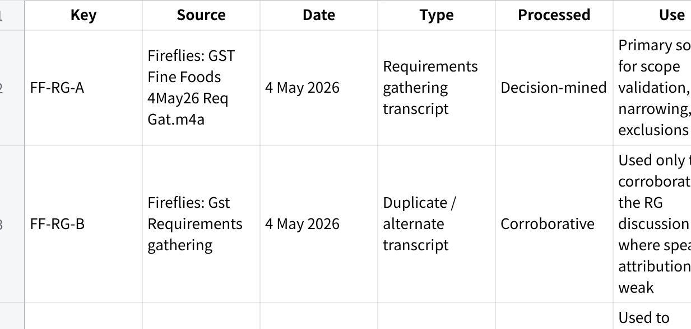
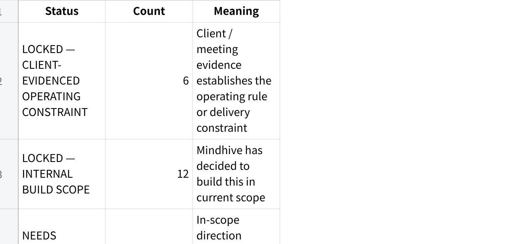
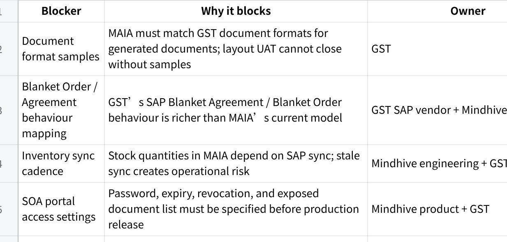
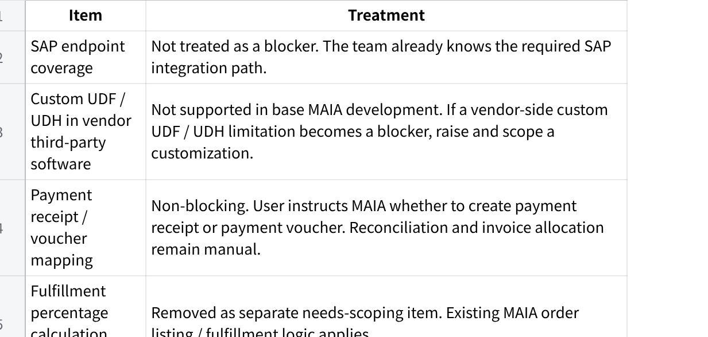
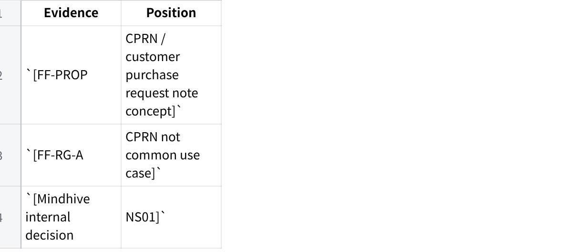
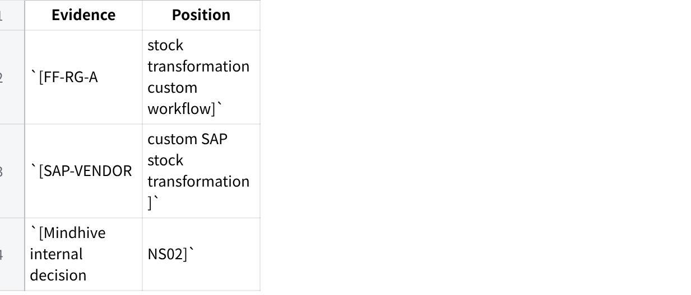
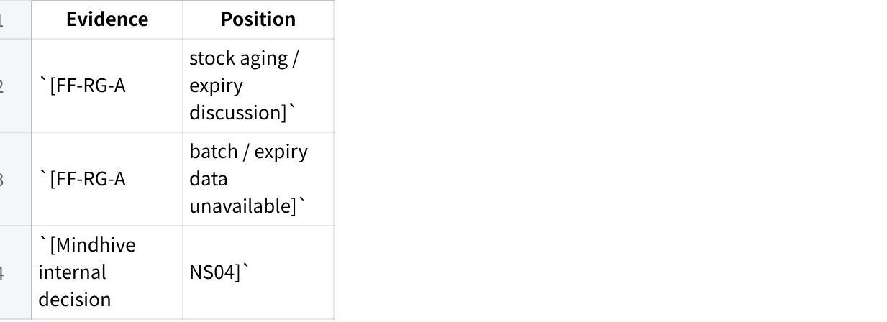
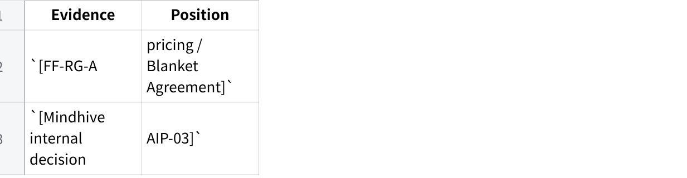
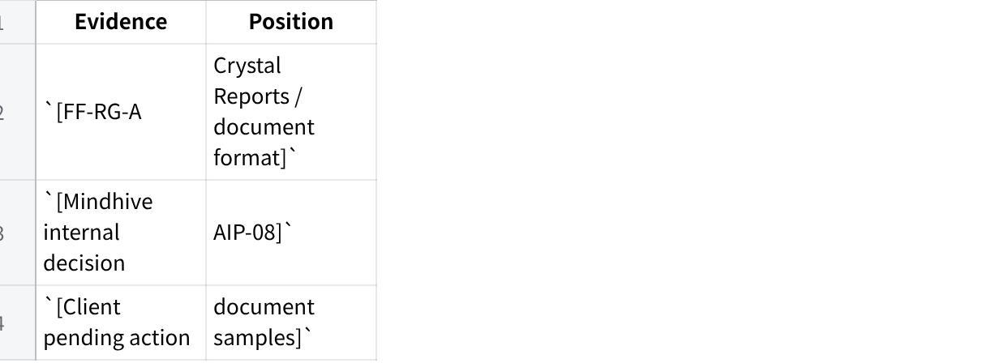
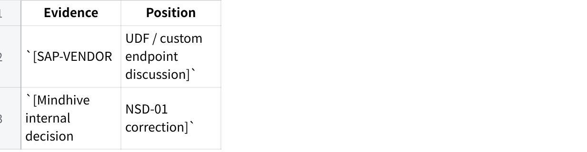

**23 June 26 - GST Fine Foods Scope Lock Document**

**GST Fine Foods --- Scope Lock v1.2**

**Account:** GST Fine Foods / GST Group\
**Document:** Scope Lock v1.2\
**Date:** 23 Jun 2026\
**Build stage:** Pre-build / early implementation\
**Prepared for:** Mindhive delivery, product, and engineering\
**Primary grounding:** Fireflies GST Fine Foods requirements gathering transcript + Mindhive internal scope decisions

1.1 **Control Note**

This Scope Lock has two layers:

**Client-evidenced scope grounding**\
Scope direction that was discussed, validated, corrected, or narrowed in the GST Fine Foods requirements gathering conversation.

**Mindhive internal build lock**\
Scope that Mindhive has now decided to build, even where some implementation details still require client samples, SAP vendor confirmation, or product specification.

A feature marked **LOCKED --- INTERNAL BUILD SCOPE** means the build team should treat it as in scope. It does **not** mean every field, layout, permission, UAT case, or configuration value is already complete.

The key delivery risk is SAP integration and document accuracy, not whether the MAIA workflow should be built. MAIA will integrate with SAP using the agreed integration path, but MAIA will **not** support custom UDF / UDH development inside vendor third-party software as part of base scope. If a vendor-side custom UDF / UDH limitation becomes a blocker, it must be raised and scoped as a separate customization.

1\. **Source Manifest**

**点击图片可查看完整电子表格**

**1.1 Citation Key Format**

This document uses internal citation keys in this format:

\[SOURCE \| topic\]

Example:

\[FF-RG-A \| pricing / Blanket Agreement\]

This is a scope provenance system showing which source supports each scope position. It is not a verbatim quote system.

2\. **Scope Lock Summary**

**2.1 Status Counts**

**点击图片可查看完整电子表格**

**2.2 Blocking Open Items**

**点击图片可查看完整电子表格**

**2.3 Non-Blocking Technical Boundaries**

**点击图片可查看完整电子表格**

**2.4 Top Client Confirmation Items**

These are not broad discovery questions. They are confirmation items needed to close build behaviour.

Confirm exact GST document formats to be matched and provide sample PDFs/templates.

Walk through SAP Blanket Order / Blanket Agreement behaviour that MAIA must match.

Confirm acceptable SAP ↔ MAIA inventory sync cadence.

Confirm slow-moving stock definition by item category or days without movement.

Confirm SOA link settings: validity period, password method, revocation, and exposed document types.

Confirm which user roles can generate/revoke SOA links, retrieve invoices, create documents, and create payment entries.

3\. **Locked Operating Constraints**

These are scope constraints that shape the whole build.

**LOC-01 --- MAIA sits above SAP B1**

**Status:** LOCKED --- CLIENT-EVIDENCED OPERATING CONSTRAINT

**Decision:**\
MAIA is not replacing SAP Business One. SAP remains the system of record for GST's accounting, inventory, document, and operational backbone. MAIA operates as the coordination, intelligence, and workflow layer on top of SAP.

**Source trail:**\
\[FF-PROP \| MAIA above SAP\]\
\[FF-RG-A \| SAP integration dependency\]\
\[SAP-VENDOR \| MAIA → middleware → SAP architecture\]

**Build implication:**\
Any MAIA document, payment, inventory, pricing, customer, or order behaviour that affects the system of record must account for SAP sync or SAP writeback.

**LOC-02 --- SAP integration is a core delivery path**

**Status:** LOCKED --- CLIENT-EVIDENCED OPERATING CONSTRAINT

**Decision:**\
SAP integration is required. GST's pricing, item master, customer master, invoice records, stock positions, and document flows depend on SAP.

**Source trail:**\
\[FF-RG-A \| SAP vendor required\]\
\[SAP-VENDOR \| Service Layer / endpoint integration path\]

**Build implication:**\
Mindhive will build the MAIA workflows and integrate through the known SAP path. SAP endpoint coverage itself is not treated as an unresolved blocker in this Scope Lock.

**Boundary:**\
MAIA will not support custom UDF / UDH development inside vendor third-party software as part of base scope. If such a limitation blocks delivery, it must be separately scoped.

**LOC-03 --- Phase 1 is Penang-first unless client changes rollout**

**Status:** LOCKED --- CLIENT-EVIDENCED OPERATING CONSTRAINT

**Decision:**\
The RG conversation framed the first rollout around Penang, especially because the B2B sales workflow and SAP pricing practices are clearest there.

**Source trail:**\
\[FF-RG-A \| Penang-first rollout\]\
\[Q \| business structure / branches\]

**Build implication:**\
Initial configuration, UAT, and sample data should use Penang-first assumptions unless GST explicitly confirms KL or multi-branch go-live.

**LOC-04 --- MAIA must respect SAP branch / data ownership**

**Status:** LOCKED --- CLIENT-EVIDENCED OPERATING CONSTRAINT

**Decision:**\
GST's SAP structure uses branch / data ownership logic. Users and documents are associated with branch-level visibility and control.

**Source trail:**\
\[FF-RG-A \| branch / data ownership\]\
\[RG-NOTES \| SAP branch configuration\]

**Build implication:**\
MAIA must not expose all branch data to all users by default. User visibility and document access must respect branch permissions.

**LOC-05 --- Joey is the working internal implementation PIC**

**Status:** LOCKED --- CLIENT-EVIDENCED OPERATING CONSTRAINT

**Decision:**\
Joey is the working implementation PIC / day-to-day coordination owner on GST's side.

**Source trail:**\
\[FF-RG-A \| project owner / Joey\]\
\[WA \| RG scheduling / PIC coordination\]

**Build implication:**\
Sample collection, UAT coordination, and requirement confirmations should route through Joey unless GST assigns another owner.

**LOC-06 --- GST-side setup dependencies are required**

**Status:** LOCKED --- CLIENT-EVIDENCED OPERATING CONSTRAINT

**Decision:**\
GST must support setup of WhatsApp Business Account, OpenAI API, AWS account, and relevant phone/account access for MAIA deployment.

**Source trail:**\
\[FF-RG-A \| WABA / AWS / OpenAI setup\]\
\[WA \| WABA setup request\]

**Build implication:**\
Infrastructure readiness is a client-side dependency. Mindhive can assist setup, but cannot fully proceed without account ownership and access.

4\. **Locked Scope**

**SL-01 --- Multi-format order / quotation intake and quotation draft**

**Status:** LOCKED --- INTERNAL BUILD SCOPE

**Scope definition:**\
Users can upload or forward an order request into MAIA. Supported order request inputs include:

quotation document;

handwritten document;

WhatsApp message;

other supported order request artefacts where parsing is technically feasible.

MAIA will extract the order intent and draft a quotation for the user.

**User responsibility:**\
The user remains responsible for checking and confirming the order to ensure accuracy before any quotation is finalized, sent, or converted downstream.

**Source trail:**\
\[FF-RG-A \| quotation intake / order request channels\]\
\[Mindhive internal decision \| AIP-01\]

**User-facing flow:**\
Customer sends order request → user uploads or forwards request into MAIA → MAIA parses the request → MAIA drafts quotation lines → user reviews item, quantity, customer, price, remarks, and delivery details → user confirms or edits → quotation proceeds.

**Acceptance criteria:**

MAIA supports agreed Phase 1 upload / forwarding channels.

MAIA drafts editable quotation lines.

User can edit all extracted fields before confirmation.

MAIA does not auto-finalize quotation without user confirmation.

UI clearly communicates that user review is required.

**Confidence:** HIGH on scope; MEDIUM on input-format performance until sample documents are received.

**SL-02 --- Item suggestion using RAG / item master retrieval**

**Status:** LOCKED --- INTERNAL BUILD SCOPE

**Scope definition:**\
MAIA will use item RAG search / retrieval against GST's item master database to suggest matching or similar items.

The quality of suggestions depends on:

completeness of GST's item master;

quality of item names;

enriched item descriptions;

captured attributes;

retrieval quality;

data hygiene.

**Important limitation:**\
MAIA does not guarantee perfect matching. Suggestions are retrieval-based and highly dependent on the quality of the item master.

**Source trail:**\
\[FF-RG-A \| product matching / item master\]\
\[Mindhive internal decision \| AIP-02\]

**User-facing flow:**\
User uploads order request → MAIA extracts item text → MAIA searches item master → MAIA suggests likely or similar items → user confirms or overrides → selected item enters quotation / order document.

**Acceptance criteria:**

MAIA returns suggested item matches from the item master.

User can select, reject, or override suggestions.

MAIA does not silently substitute items.

UI / documentation states that suggestion performance depends on item master quality.

Enriched item description fields are available for retrieval where provided.

**Confidence:** HIGH on scope; MEDIUM on performance because data quality is external dependency.

**SL-03 --- SAP-style Blanket Order / Blanket Agreement support**

**Status:** LOCKED --- INTERNAL BUILD SCOPE

**Scope definition:**\
Mindhive will build or extend MAIA Blanket Order / Blanket Agreement support to match the relevant SAP functionality used by GST.

GST's SAP Blanket Order / Blanket Agreement functionality is richer than MAIA's current capability. MAIA must be extended to match GST's required behaviour rather than forcing GST into MAIA's existing lighter model.

**Source trail:**\
\[FF-RG-A \| pricing / Blanket Agreement\]\
\[Mindhive internal decision \| AIP-03\]

**User-facing flow:**\
User creates quotation / order for a customer → MAIA checks applicable Blanket Order / Agreement → MAIA applies relevant customer/item agreed terms → user reviews → document proceeds → SAP writeback preserves required Blanket Order / Agreement linkage or behaviour.

**Acceptance criteria:**

MAIA supports required GST Blanket Order / Agreement fields.

MAIA can apply customer/item agreement data during quotation or order creation.

MAIA behaviour aligns with SAP-side agreement logic.

SAP writeback preserves necessary references and traceability.

Missing or expired agreement cases are surfaced to the user.

**Pending technical mapping:**\
GST SAP Blanket Order / Agreement behaviour must be walked through and mapped.

**Confidence:** HIGH on internal scope; MEDIUM on implementation until SAP behaviour is mapped.

**SL-04 --- Credit approval / approval workflow behaviour in MAIA**

**Status:** LOCKED --- INTERNAL BUILD SCOPE

**Scope definition:**\
MAIA will support structured approval workflow behaviour for cases that require credit or operational approval.

This includes:

approval-required status;

routing to approver;

approval / rejection / comment action;

decision visibility;

audit trail.

**Source trail:**\
\[FF-RG-A \| credit block / approval delay\]\
\[Mindhive internal decision \| AIP-04\]

**User-facing flow:**\
Order hits approval condition → MAIA flags approval requirement → approver receives task or notification → approver approves, rejects, or comments → decision is recorded → sales / finance sees outcome → order proceeds according to decision.

**Acceptance criteria:**

Approval-required documents show approval state.

Approvers can act inside MAIA.

Decision trail records actor, time, status, and comments.

Users can see whether approval is pending, approved, rejected, or action-required.

Approval visibility reduces dependency on WhatsApp message tracking.

**Boundary:**\
SAP-side credit-block release depends on SAP integration behaviour and should not be assumed unless confirmed in the integration design.

**Confidence:** HIGH on MAIA workflow; MEDIUM on SAP release automation.

**SL-05 --- Payment proof upload and payment entry decision**

**Status:** LOCKED --- INTERNAL BUILD SCOPE

**Scope definition:**\
Sales users or finance users can upload proof of payment into MAIA.

MAIA will understand the uploaded attachment and create a draft payment entry based on the user's instruction. The user decides whether MAIA should create:

payment receipt; or

payment voucher.

The uploaded attachment is attached to the draft payment entry.

**Manual boundary:**\
Reconciliation, invoice allocation, knockoff, and any related allocation of this payment to invoices or other documents are done manually and instructed manually by the user. MAIA does not automatically allocate payment to invoices in this scope.

**Source trail:**\
\[FF-RG-A \| payment proof workflow\]\
\[Mindhive internal decision \| AIP-05\]\
\[Mindhive internal decision \| NSD-06 resolved\]

**User-facing flow:**\
User uploads payment proof → MAIA reads / stores attachment → MAIA asks what the user wants to do → user chooses payment receipt or payment voucher → MAIA creates draft payment entry with attachment → user manually instructs allocation / reconciliation where needed → user reviews and confirms → document writes back to SAP where applicable.

**Acceptance criteria:**

Payment proof can be uploaded and attached.

MAIA can read the attachment sufficiently to assist draft creation.

MAIA prompts user for payment-entry decision.

User can choose payment receipt or payment voucher.

Uploaded attachment is attached to the draft payment entry.

Reconciliation and allocation remain manual user-controlled actions.

MAIA does not finalize payment document without user confirmation.

Payment document status and SAP writeback status are visible.

**Confidence:** HIGH on workflow; MEDIUM on SAP payment object mapping.

**SL-06 --- Invoice / document retrieval by users**

**Status:** LOCKED --- INTERNAL BUILD SCOPE

**Scope definition:**\
MAIA will support user requests for relevant customer documents, including invoice retrieval, where those documents exist in MAIA or are available through SAP sync.

**Source trail:**\
\[FF-RG-A \| invoice retrieval request\]\
\[Mindhive internal decision \| AIP-06\]

**User-facing flow:**\
Sales user requests invoice or related document → MAIA searches synced / linked document records → MAIA returns matching records → user downloads or shares as permitted.

**Acceptance criteria:**

User can search or request invoice records.

MAIA returns matching invoice / document records.

Access respects user permissions.

Download or share action is available where permitted.

SAP document reference is visible where applicable.

**Confidence:** HIGH on scope; MEDIUM on available SAP document access.

**SL-07 --- Password-protected SOA portal link**

**Status:** LOCKED --- INTERNAL BUILD SCOPE

**Scope definition:**\
MAIA will allow sales users to request a Statement of Account link that can be shared with customers.

The link will be:

password protected;

valid for a defined period;

revocable by the user at any time;

mobile responsive.

When the customer opens the link and enters the password, they can navigate to a mobile responsive website showing:

Statement of Account;

invoices;

credit notes;

orders;

other related customer documents where available.

Customers can self-service download available documents from the portal.

**Source trail:**\
\[FF-RG-A \| SOA / secure link concern\]\
\[Mindhive internal decision \| AIP-07\]

**User-facing flow:**\
Sales user requests SOA link → MAIA generates password-protected link → sales user shares link and password with customer → customer opens mobile portal → customer enters password → customer views SOA and related documents → customer downloads documents → sales user can revoke access.

**Acceptance criteria:**

Link requires password.

Link has defined expiry.

Link can be revoked by authorized user.

Portal is mobile responsive.

Portal exposes only documents within intended customer/account scope.

Customer cannot access unrelated customer data.

Access revocation takes effect after user action.

**Pending product detail:**\
Expiry duration, password generation method, password delivery method, access logs, and document list.

**Confidence:** HIGH on scope; MEDIUM on security design detail.

**SL-08 --- Client document format matching**

**Status:** LOCKED --- INTERNAL BUILD SCOPE

**Scope definition:**\
For documents generated by MAIA, MAIA will match GST's required document formats.

**Current pending action from client:**\
GST must provide sample document formats.

**Source trail:**\
\[FF-RG-A \| Crystal Reports / document format\]\
\[Mindhive internal decision \| AIP-08\]

**User-facing flow:**\
User generates quotation / order / invoice / other supported document in MAIA → MAIA outputs document using GST-approved layout → user reviews, downloads, or sends.

**Acceptance criteria:**

GST provides sample formats for every in-scope document type.

MAIA-generated documents match agreed layout and required fields.

Format match is validated in UAT.

Missing format sample is treated as blocker for that document type.

**Confidence:** HIGH on scope; LOW on document-specific acceptance until samples are received.

**SL-09 --- Inventory visual cue on document item tables**

**Status:** LOCKED --- INTERNAL BUILD SCOPE

**Scope definition:**\
When users create quotations, sales orders, or delivery notes, and add items into the item table, MAIA will show a visual cue of inventory state for that item.

Users will be able to see:

actual quantity;

available quantity;

reserved quantity;

producible quantity, where the item is a Product Bundle / BOM / manufacturing item configured in MAIA.

**Source trail:**\
\[FF-RG-A \| committed stock / inventory visibility\]\
\[Mindhive internal decision \| AIP-09\]

**User-facing flow:**\
User adds item to quotation / SO / DN → MAIA displays inventory cue beside item line → user sees actual / available / reserved / producible quantity → user decides whether to proceed, reduce quantity, produce, or choose alternative item.

**Acceptance criteria:**

Inventory cue appears during item entry.

Actual, available, and reserved quantities are distinguishable.

Producible quantity appears only where Product Bundle / BOM data exists in MAIA.

UI does not imply GST's custom SAP stock transformation workflow is supported.

Inventory cue reflects latest available MAIA/SAP sync data.

**Boundary:**\
This scope supports MAIA-configured BOM / Product Bundle producible quantity. It does not support GST's custom SAP stock transformation module.

**Confidence:** HIGH on MAIA-side inventory cue; MEDIUM on accuracy due to SAP sync dependency.

**SL-10 --- Order listing, fulfillment percentage, and order aging**

**Status:** LOCKED --- INTERNAL BUILD SCOPE

**Scope definition:**\
MAIA will provide an interface showing order listings with fulfillment percentage and order age.

Users can identify:

slow-moving orders;

long-open orders;

partially fulfilled orders;

orders requiring follow-up.

**Source trail:**\
\[FF-RG-A \| stale order / fulfillment visibility\]\
\[Mindhive internal decision \| AIP-10\]

**User-facing flow:**\
User opens order listing → sees order status, fulfillment percentage, and order age → filters or sorts by aging / fulfillment → opens order detail → follows up or acts.

**Acceptance criteria:**

Order listing includes fulfillment percentage.

Order listing includes order age / open duration.

Users can navigate from listing to order detail.

Users can identify slow-moving or long-open orders from the interface.

Fulfillment percentage is shown using MAIA's order fulfillment logic.

**Confidence:** HIGH.

**SL-11 --- MAIA-created document writeback to SAP**

**Status:** LOCKED --- INTERNAL BUILD SCOPE

**Scope definition:**\
All supported documents created in MAIA will write back to SAP.

This includes MAIA-created documents in the supported business flow, subject to the agreed SAP integration design.

**Source trail:**\
\[FF-RG-A \| SAP integration dependency\]\
\[SAP-VENDOR \| MAIA → middleware → SAP\]\
\[Mindhive internal decision \| NS07 resolved\]

**User-facing flow:**\
User creates supported document in MAIA → user confirms → MAIA writes document to SAP through integration layer → SAP returns document reference / success or failure → MAIA stores SAP reference and displays writeback status.

**Acceptance criteria:**

Supported MAIA-created documents write back to SAP.

Writeback success / failure is visible to users.

Duplicate document creation is prevented.

SAP document references are stored in MAIA.

Writeback error states are recoverable or clearly actionable.

**Boundary:**\
MAIA does not support custom UDF / UDH development inside vendor third-party software as part of base scope. If a vendor-side custom UDF / UDH limitation blocks writeback, that item is raised and scoped as a separate customization.

**Confidence:** HIGH on scope.

**SL-12 --- Movement-based slow stock visibility and reports**

**Status:** LOCKED --- INTERNAL BUILD SCOPE

**Scope definition:**\
Because GST does not capture batch number or expiry-related data in the required structured form, MAIA will not provide batch-expiry alerts. Instead, MAIA will surface movement-based slow stock signals.

This includes:

slow-moving stock notifications;

slow-moving stock reports;

warehouse dashboard;

stock aging reports;

stock movement reports.

**Source trail:**\
\[FF-RG-A \| batch / expiry limitation\]\
\[Mindhive internal decision \| NS04\]

**User-facing flow:**\
User opens warehouse dashboard or stock report → MAIA shows stock movement / aging signals based on available stock movement data → user identifies slow-moving stock → user follows up operationally.

**Acceptance criteria:**

MAIA provides warehouse dashboard visibility.

MAIA provides stock aging / stock movement views.

Slow-moving stock logic is configurable or defined.

MAIA does not claim batch-level expiry alerting.

Reports use available SAP / MAIA stock movement data.

**Confidence:** HIGH on scope; MEDIUM on rule definitions.

5\. **Needs-Scoping / Technical Detail Register**

These items are not open scope debates. They are details or inputs required to complete production-ready implementation.

**NSD-01 --- Document format samples**

**Status:** NEEDS SCOPING / TECHNICAL DETAIL

**Issue:**\
MAIA must match GST document formats, but document samples are pending.

**Source trail:**\
\[FF-RG-A \| Crystal Reports / document sample request\]\
\[Mindhive internal decision \| AIP-08\]

**Required decision / input:**\
GST must provide samples for all in-scope generated documents.

**Blocking:** YES for document UAT.

**NSD-02 --- Blanket Order / Agreement behaviour**

**Status:** NEEDS SCOPING / TECHNICAL DETAIL

**Issue:**\
GST's SAP Blanket Order / Blanket Agreement functionality is richer than current MAIA support.

**Source trail:**\
\[FF-RG-A \| pricing / Blanket Agreement\]\
\[Mindhive internal decision \| AIP-03\]

**Required decision / input:**\
Walk through GST's SAP Blanket Order / Agreement behaviour and map fields, lifecycle, price application, validity, and writeback.

**Blocking:** YES for pricing / order accuracy.

**NSD-03 --- SOA portal security settings**

**Status:** NEEDS SCOPING / TECHNICAL DETAIL

**Issue:**\
SOA portal behaviour is locked, but exact security settings are not.

**Source trail:**\
\[FF-RG-A \| SOA link security\]\
\[Mindhive internal decision \| AIP-07\]

**Required decisions:**

Link expiry period;

password generation method;

password delivery method;

access logging;

revocation audit;

document list exposed in portal.

**Blocking:** YES for production SOA portal release.

**NSD-04 --- Inventory sync cadence**

**Status:** NEEDS SCOPING / TECHNICAL DETAIL

**Issue:**\
MAIA will reflect SAP inventory based on sync jobs. Sync cadence affects stock accuracy and user trust.

**Source trail:**\
\[SAP-VENDOR \| SAP sync / middleware architecture\]\
\[Mindhive internal decision \| NS02\]

**Required decision:**\
Confirm acceptable sync interval and whether any objects need near-real-time sync.

**Blocking:** YES for inventory visibility acceptance.

6\. **Resolved / Non-Blocking Technical Items**

**R-01 --- Vendor custom UDF / UDH support**

**Status:** RESOLVED AS OUT-OF-SCOPE BOUNDARY

**Decision:**\
MAIA will not support custom UDF / UDH development in vendor third-party software as part of base development.

**Treatment:**\
If a custom UDF / UDH limitation is identified as a blocker, Mindhive will raise it and scope it as a separate customization.

**Source trail:**\
\[Mindhive internal decision \| NSD-01 correction\]

**R-02 --- SAP endpoint coverage**

**Status:** RESOLVED / NON-BLOCKING

**Decision:**\
SAP endpoint coverage is not treated as a blocker in this document. The team already knows the integration path required.

**Treatment:**\
Build proceeds on the known SAP integration path. Any unexpected endpoint limitation is escalated through delivery risk management, not treated as an unresolved scope question.

**Source trail:**\
\[SAP-VENDOR \| integration path\]\
\[Mindhive internal decision \| NSD-02 correction\]

**R-03 --- Payment receipt / voucher mapping**

**Status:** RESOLVED / NON-BLOCKING

**Decision:**\
MAIA does not need prior scenario mapping to proceed. The user instructs MAIA whether to create a payment receipt or payment voucher.

**Treatment:**\
The attachment is attached to the draft payment entry. Reconciliation and allocation of payment to invoices or other documents is manual and user-instructed.

**Source trail:**\
\[Mindhive internal decision \| NSD-06 correction\]

**R-04 --- Fulfillment percentage calculation source**

**Status:** REMOVED

**Decision:**\
The former NSD-08 item is removed. MAIA's existing order listing and fulfillment logic applies.

7\. **Supersessions Log**

**SUP-01 --- CPR / CPRN pre-order reservation replaced by committed-order visibility**

**Original idea:**\
A CPR / CPRN / customer purchase request note concept was discussed in earlier proposal context as a way to track pre-order commitments or informal stock reservation.

**Current decision:**\
CPR / CPRN is out of scope. The validated requirement is visibility into reserved / committed quantities tied to actual order flow.

**Source trail:**\
\[FF-PROP \| CPRN / customer purchase request note concept\]\
\[FF-RG-A \| CPRN reframed as not common use case\]\
\[Mindhive internal decision \| NS01\]

**Client agreed?**\
Validated in requirements gathering as not a common use case.

**Current status:**\
OUT OF SCOPE.

**SUP-02 --- Stock transformation engine excluded from MAIA**

**Original idea:**\
GST's seafood processing and stock transformation was explored as a possible MAIA capability.

**Current decision:**\
MAIA will not support GST's custom SAP stock transformation workflow. Users continue performing stock transformation in SAP.

**Source trail:**\
\[FF-RG-A \| stock transformation discussion\]\
\[SAP-VENDOR \| SAP stock transformation custom feature\]\
\[Mindhive internal decision \| NS02\]

**Rationale:**\
GST's transformation module is not standard BOM. It is a custom SAP module. MAIA will sync inventory after SAP transformation.

**Current status:**\
OUT OF SCOPE.

**SUP-03 --- Batch / expiry alerts replaced by movement-based slow stock reports**

**Original idea:**\
Expiry, aging, or batch-based alerts were discussed.

**Current decision:**\
Because GST does not capture batch number or expiry data in the required structured form, MAIA will not provide batch-expiry alerts. MAIA will instead surface slow-moving stock via reports, notifications, warehouse dashboard, stock aging reports, and stock movement reports.

**Source trail:**\
\[FF-RG-A \| batch / expiry limitation\]\
\[Mindhive internal decision \| NS04\]

**Current status:**\
Batch / expiry alerts OUT OF SCOPE; movement-based slow stock visibility IN SCOPE.

**SUP-04 --- Excel planning / purchasing calculator excluded**

**Original idea:**\
An Excel export or planning / purchasing support item was discussed.

**Current decision:**\
Excel planning / purchasing calculator is out of scope.

**Source trail:**\
\[FF-RG-A \| planning Excel unclear\]\
\[Mindhive internal decision \| NS05\]

**Rationale:**\
Stakeholders present in detailed requirements gathering were unsure of the direct or detailed requirements. This is not safe to treat as scoped.

**Current status:**\
OUT OF SCOPE.

8\. **Out-of-Scope / Explicit Exclusions**

**OOS-01 --- CPR / CPRN / pre-confirmation stock reservation**

**Status:** OUT OF SCOPE

**Decision:**\
CPR / CPRN is not in scope for the current build.

**Rationale:**\
During requirements gathering, this was validated as not a common use case for GST. Stock reservation before order confirmation is not frequent enough to justify current-phase scope.

**Source trail:**\
\[FF-RG-A \| CPRN not common use case\]\
\[Mindhive internal decision \| NS01\]

**Current in-scope substitute:**\
Inventory visual cues and reserved quantity visibility in actual quotation / SO / DN flow.

**OOS-02 --- GST SAP stock transformation workflow**

**Status:** OUT OF SCOPE

**Decision:**\
MAIA will not support GST's custom SAP stock transformation workflow.

**Rationale:**\
GST's stock transformation module is customized in SAP and is not standard BOM.

**Source trail:**\
\[FF-RG-A \| stock transformation custom workflow\]\
\[SAP-VENDOR \| stock transformation\]\
\[Mindhive internal decision \| NS02\]

**MAIA behaviour:**\
Users continue performing stock transformation in SAP. MAIA reflects latest SAP inventory quantities after scheduled sync.

**OOS-03 --- SAP item master / UOM reconfiguration**

**Status:** OUT OF SCOPE

**Decision:**\
MAIA will not reconfigure or change GST's item master setup.

**Rationale:**\
The KG / NOS / variable-weight fish issue is an operational challenge tied to GST's current SAP item master and stock transformation configuration.

**Source trail:**\
\[FF-RG-A \| KG vs NOS operational issue\]\
\[Mindhive internal decision \| NS03\]

**MAIA behaviour:**\
MAIA syncs item master data from SAP as-is.

**OOS-04 --- Batch-number / expiry-date alerts**

**Status:** OUT OF SCOPE

**Decision:**\
MAIA will not support batch-number or expiry-date alerting in current scope.

**Rationale:**\
GST does not capture batch number or expiry-related data in the required structured form.

**Source trail:**\
\[FF-RG-A \| batch / expiry data unavailable\]\
\[Mindhive internal decision \| NS04\]

**In-scope alternative:**\
Movement-based slow stock visibility and reports.

**OOS-05 --- Excel planning / purchasing calculator**

**Status:** OUT OF SCOPE

**Decision:**\
Excel planning / purchasing calculator is out of scope.

**Rationale:**\
The stakeholders present in detailed requirements gathering were unsure of the direct or detailed requirements. This cannot be safely built as a scoped item.

**Source trail:**\
\[FF-RG-A \| planning / purchasing unclear\]\
\[Mindhive internal decision \| NS05\]

**Future handling:**\
Requires separate scoping if revived.

**OOS-06 --- Vendor custom UDF / UDH development**

**Status:** OUT OF SCOPE

**Decision:**\
MAIA will not support custom UDF / UDH development inside vendor third-party software in base development.

**Rationale:**\
MAIA should not absorb third-party vendor customization as implied base scope. If a custom vendor-side UDF / UDH limitation becomes a blocker, it must be raised and scoped out as a separate customization.

**Source trail:**\
\[Mindhive internal decision \| NSD-01 correction\]

**Future handling:**\
Raise as customization if required.

9\. **Source-Conflict Register**

**SC-01 --- CPRN sold idea vs RG validation**

**点击图片可查看完整电子表格**

**Resolution:**\
CPR / CPRN is OUT OF SCOPE. Current build supports reserved quantity visibility in actual document/order flow.

**SC-02 --- Stock transformation need vs MAIA capability**

**点击图片可查看完整电子表格**

**Resolution:**\
Stock transformation remains in SAP. MAIA syncs resulting inventory quantities.

**SC-03 --- Expiry alerts vs missing batch data**

**点击图片可查看完整电子表格**

**Resolution:**\
Do not promise expiry alerts. Build slow-moving stock notifications and reports.

**SC-04 --- Rich SAP Blanket Agreement vs current MAIA blanket order capability**

**点击图片可查看完整电子表格**

**Resolution:**\
Blanket Order / Agreement support is locked in scope, but requires SAP behaviour mapping.

**SC-05 --- Document generation scope vs missing samples**

**点击图片可查看完整电子表格**

**Resolution:**\
Document format matching is in scope, but UAT cannot close until samples are provided.

**SC-06 --- SAP UDF / UDH exposure vs base MAIA scope**

**点击图片可查看完整电子表格**

**Resolution:**\
Base MAIA does not absorb vendor UDF / UDH customization. If it blocks delivery, it is raised and separately scoped.

10\. **Client Confirmation Agenda**

These questions should be taken to GST / SAP vendor. They should be phrased as confirmation or required input, not broad discovery.

**10.1 Document Formats**

Please provide sample formats for every document GST expects MAIA to generate.

Confirm which documents are in Phase 1:

quotation;

sales order;

delivery note;

invoice;

credit note;

receipt;

SOA;

pick list.

**10.2 Blanket Order / Agreement**

Please walk through GST's SAP Blanket Order / Blanket Agreement behaviour.

Confirm which fields MAIA must support.

Confirm how Blanket Agreement pricing applies during quotation and sales order creation.

Confirm how expired / missing / conflicting agreements should behave.

**10.3 SOA Portal**

Confirm SOA link validity period.

Confirm password generation method.

Confirm password delivery method.

Confirm whether access logs are required.

Confirm which documents appear in the SOA portal.

Confirm which user roles can generate and revoke links.

**10.4 Inventory**

Confirm acceptable SAP ↔ MAIA inventory sync frequency.

Confirm definitions for:

actual quantity;

available quantity;

reserved quantity;

producible quantity.

Confirm slow-moving stock rule by category or days without movement.

Confirm stock aging report expectations.

**10.5 Payments**

Confirm that payment receipt / payment voucher creation is user-instructed.

Confirm that attachment should be attached to the draft payment entry.

Confirm that reconciliation and allocation to invoices remain manual user-controlled actions.

**10.6 Permissions**

Confirm which roles can:

create quotations;

create sales orders;

create delivery notes;

generate SOA links;

revoke SOA links;

retrieve invoices;

upload payment proof;

create payment entries;

approve credit / workflow tasks.

**10.7 Vendor Customization Boundary**

Confirm that vendor custom UDF / UDH development is not base scope.

Confirm that if custom vendor-side UDF / UDH becomes a blocker, it will be raised and separately scoped.

11\. **Build Team Instruction**

The build team should treat the following as the current build line.

**11.1 Build In Scope**

Multi-format order / quotation intake.

MAIA-drafted quotation with mandatory user review.

RAG-based item suggestion from enriched item master.

SAP-style Blanket Order / Agreement support.

Credit / approval workflow behaviour in MAIA.

Proof-of-payment upload and user-instructed payment-entry decision.

Payment receipt / payment voucher draft creation.

Attachment capture on draft payment entry.

Invoice and document retrieval.

Password-protected SOA customer portal.

Client-format document generation.

Inventory visual cue on quotation / SO / DN item tables.

Actual / available / reserved quantity display.

Producible quantity for MAIA-configured BOM / Product Bundle items.

Order listing with fulfillment percentage and order age.

MAIA-created document writeback to SAP.

Slow-moving stock notifications, reports, stock aging reports, stock movement reports, and warehouse dashboard.

**11.2 Do Not Build Unless Separately Scoped**

CPR / CPRN / pre-confirmation stock reservation.

GST's custom SAP stock transformation workflow.

SAP item master / UOM reconfiguration.

Batch-number / expiry-date alerts.

Excel planning / purchasing calculator.

Vendor custom UDF / UDH development inside third-party software.

Automatic payment reconciliation / invoice allocation.

**11.3 High-Risk Boundary: Inventory**

The dangerous ambiguity is inventory.

MAIA can show:

actual quantity;

available quantity;

reserved quantity;

producible quantity for configured MAIA BOM / Product Bundle items;

synced inventory from SAP.

MAIA does **not** recreate GST's SAP stock transformation engine.

The product and delivery team must make this boundary explicit in demos, UAT scripts, and client confirmation materials.

**11.4 High-Risk Boundary: SAP Vendor Customization**

MAIA will integrate with SAP through the agreed path, but it will not develop or support custom UDF / UDH in vendor third-party software as part of base scope.

If vendor-side UDF / UDH becomes a blocker:

identify exact blocked object / field / workflow;

document impact;

raise to delivery lead;

scope as separate customization.

**11.5 High-Risk Boundary: Payment**

MAIA will create draft payment entries based on user instruction and attach the uploaded proof.

MAIA will **not** automatically reconcile payments, allocate invoices, knock off invoices, or decide allocation rules in base scope. Those actions remain manually instructed by the user.

12\. **Final Scope Position**

The final scope position is:

**GST Phase 1 is an SAP-integrated MAIA workflow layer for order intake, quotation drafting, item suggestion, Blanket Order / Agreement support, approval workflow, payment proof handling, user-instructed payment entry drafting, document retrieval, SOA portal access, document generation, inventory visibility, order aging, fulfillment tracking, and SAP document writeback.**

**It is not a SAP replacement, not a stock transformation engine, not a CPRN reservation system, not a batch-expiry alerting system, not a purchasing planning calculator, not an automatic payment reconciliation engine, and not a vehicle for vendor third-party custom UDF / UDH development.**

The current build is sufficiently scoped for product and engineering to proceed on MAIA-side workflows. Remaining closure items are implementation inputs: document samples, Blanket Order / Agreement behaviour, SOA security settings, inventory sync cadence, slow stock rules, and permissions.
