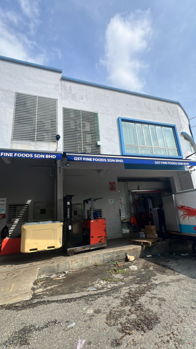
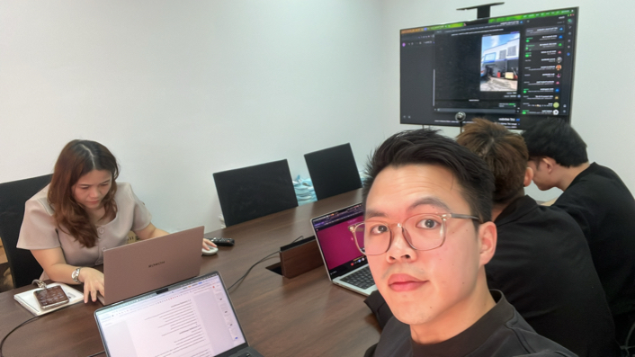
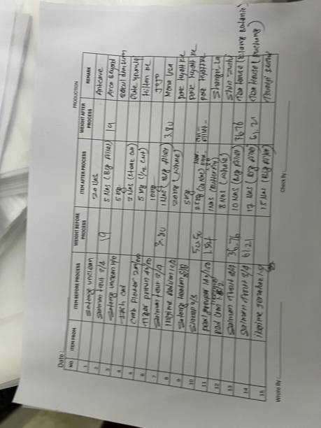
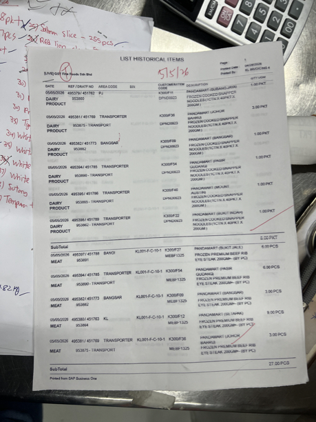
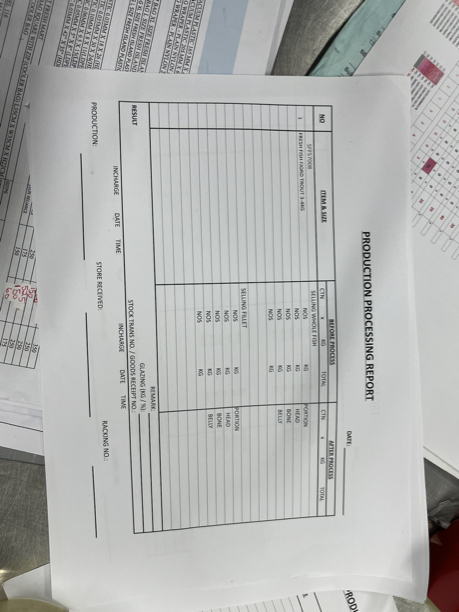

**4May26 - Ivan\'s Notes**

GST Fine foods, requirements gathering meeting

{width="4.135416666666667in" height="7.354166666666667in"}

{width="5.75in" height="3.2291666666666665in"}

{width="4.78125in" height="6.375in"}

{width="4.78125in" height="6.375in"}

{width="4.78125in" height="6.375in"}

Soo chin - Boss

Tim operation manager

Teoh Le Ying - CEO wife

Miss lee - Penang finance

Joey- sales

Ivan's notes.

no activity stock item notification

Item descritpion/name override in sales document.

blanket order.

how to capture customer preference at every interaction. Ie shangrila want butterfly cut, this customer want clean and gutted.

key in actual picked qty to the system again, sales support will receive the manually annotated pick list with actual picked qty and data entry back into maia.

SAP has a relationship map feature to see the document trail.

Sap has a branch configuration, each business document will have its own branch attribution, also for user.

This is how they can restrict user visibility by branch.

**\[GST-Fine-Foods-4May26-Req-Gat-m4a-11f63b4f-eac7.docx\]**
