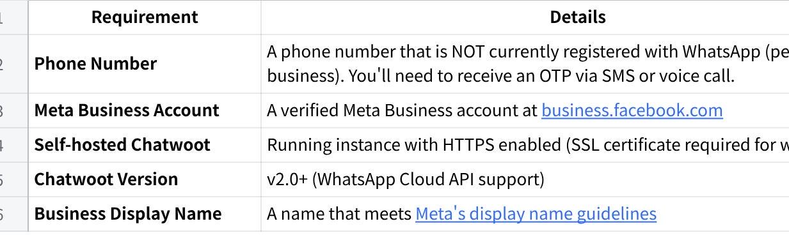
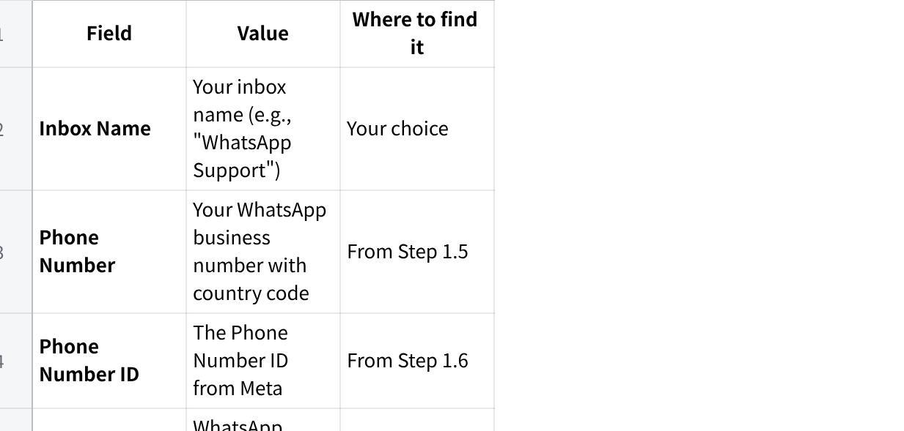
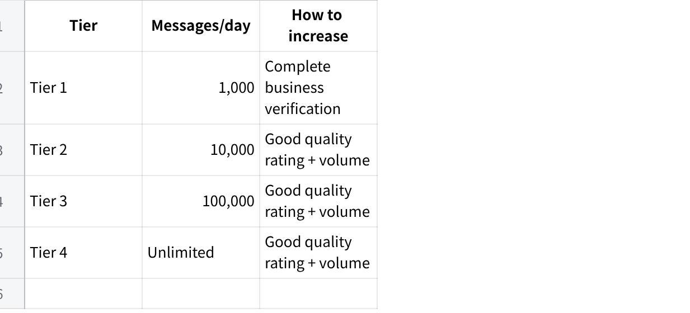
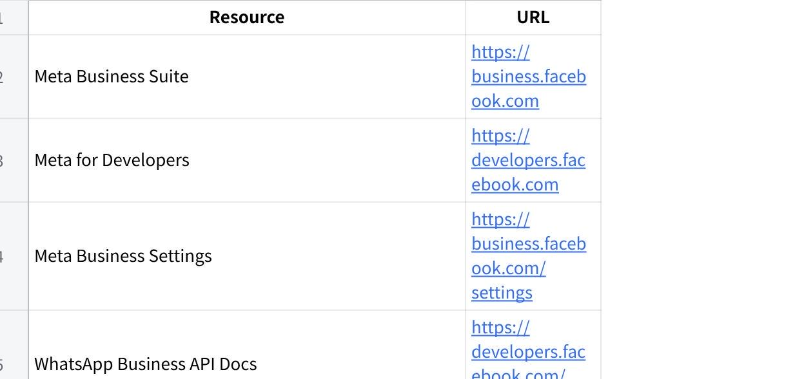
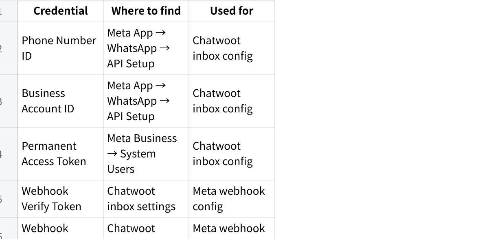

**WhatsApp Channel Setup Guide for Chatwoot Copy**

This guide walks you through setting up a WhatsApp Business channel in your self-hosted Chatwoot instance using Meta\'s WhatsApp Cloud API.

**Table of Contents**

Prerequisites

Part 1: Meta Business Platform Setup

Part 2: Chatwoot WhatsApp Inbox Configuration

Part 3: Testing the Integration

Part 4: Going Live (Production)

Part 5: Middleware Integration

Troubleshooting

Important Notes & Best Practices

MAIA communicates with your internal team through WhatsApp. To connect, you need a verified WhatsApp Business API account.

**Estimated time:** 1--2 hours of setup work + 3--7 business days for Meta verification. Can take longer if phone number KYC or Meta verification issues arise (see Important Warnings below).

**Important Warnings --- Read Before Starting**

**Phone number KYC (Malaysia):** Company phone numbers in Malaysia require KYC registration with your telco provider. If you don\'t already have a suitable company number, getting one registered and activated can take 1--2 weeks. **Start this immediately if you need a new number.**

**Meta account banning risk:** Meta sometimes flags or bans new Business Manager accounts during setup --- even when you\'ve done nothing wrong. This is a known industry-wide issue. To reduce the risk:

Do NOT create a new Meta Business Manager account if you already have one --- use your existing one

Do NOT attempt to register a phone number that is currently active on any WhatsApp app

Follow the setup steps exactly --- skipping steps or doing them out of order increases ban risk

If you get banned or restricted, **stop immediately and contact Mindhive** before trying again. Repeated attempts after a ban make recovery harder

**Prerequisites**

Before starting, ensure you have:

**点击图片可查看完整电子表格**

**Phone Number Requirements**

Must be able to receive SMS or voice calls for verification

Cannot be currently registered with WhatsApp (personal or WhatsApp Business app)

If migrating from WhatsApp Business app, you must delete it first

Recommended: Use a dedicated business line

**Part 1 - Get a Dedicated Phone Number**

You need a phone number that is:

**New or not currently registered on WhatsApp** (personal or WhatsApp Business app)

**Able to receive SMS or voice calls** (for verification)

**Dedicated to MAIA** --- it cannot be used for regular WhatsApp simultaneously

**Registered under your company name** (KYC-compliant)

**Options:**

Purchase a new prepaid SIM and complete KYC registration under your company

Use a company landline number (Meta can verify via voice call)

Port an existing number (only if it\'s not currently on WhatsApp)

**Important:** Once this number is registered with the WhatsApp Business API, it cannot be used with the regular WhatsApp app. This is a permanent change.

**If you need a new number:** Start the purchase and KYC process now. Do not wait for any other onboarding step. This is typically the longest wait in the entire setup.

**Part 2: Meta Business Platform Setup**

**Step 2.1: Create or Access Meta Business Account**

Go to [business.facebook.com](https://business.facebook.com/)

Click **Create Account** (or log in if you have one)

Enter your business details:

Business name

Your name

Business email

Complete the account setup

**Step 2.2: Create a Meta App**

Go to [Meta for Developers](https://developers.facebook.com/)

Click **My Apps** → **Create App**

Select **Other** for use case, then click **Next**

Select **Business** as the app type, then click **Next**

Fill in app details:

**App name**: Your app name (e.g., \"MyCompany WhatsApp Bot\")

**App contact email**: Your email

**Business Account**: Select your Meta Business Account

Click **Create App**

**Step 2.3: Add WhatsApp Product to Your App**

In your app dashboard, scroll to **Add products to your app**

Find **WhatsApp** and click **Set up**

You\'ll be redirected to WhatsApp Getting Started page

**Step 2.4: Set Up WhatsApp Business Account**

On the WhatsApp Getting Started page, you\'ll see **Step 1: Select phone numbers**

If you don\'t have a WhatsApp Business Account:

Click **Create a WhatsApp Business Account**

Select your Meta Business Account

Enter business details

If you have one, select it from the dropdown

**Step 2.5: Add and Verify Your Phone Number**

In the WhatsApp dashboard, go to **Step 1: Select phone numbers**

Click **Add phone number**

Fill in the details:

**Display name**: Your business name (must follow [Meta\'s guidelines](https://www.facebook.com/business/help/338047025165344))

**Phone number**: Enter your phone number with country code

**Verification method**: Choose SMS or Voice call

Click **Next** and enter the OTP received on your phone

Your phone number is now registered

  ---------------------------------------------------------------------------------------------------------------------------------------------
  **Note**: The display name must accurately represent your business and follow Meta\'s naming guidelines. Misleading names will be rejected.

  ---------------------------------------------------------------------------------------------------------------------------------------------

**Step 2.6: Get Your API Credentials**

After adding your phone number, collect these credentials:

**Phone Number ID**

Go to **WhatsApp** → **API Setup** in the left sidebar

Under **Step 1: Select phone numbers**, find **Phone number ID**

Copy this value

**WhatsApp Business Account ID**

Go to **WhatsApp** → **API Setup**

Find **WhatsApp Business Account ID** in the same section

Copy this value

**Temporary Access Token (for testing)**

On the API Setup page, find **Step 2: Send messages with the API**

Click **Generate** under **Temporary access token**

Copy the token (valid for 24 hours)

**Step 2.7: Generate Permanent Access Token**

For production, create a permanent System User token:

Go to [Meta Business Settings](https://business.facebook.com/settings)

Navigate to **Users** → **System Users**

Click **Add** to create a new system user:

**Name**: e.g., \"WhatsApp API Bot\"

**Role**: Admin

Click **Create System User**

Click on the system user you created

Click **Add Assets**:

Select **Apps**

Find your app and add it

Grant **Full Control**

Click **Generate New Token**:

Select your app

Set token expiration to **Never**

Select these permissions:

whatsapp_business_management

whatsapp_business_messaging

Click **Generate Token**

**Copy and save this token securely** - you won\'t see it again!

**Step 2.8: Configure Webhooks in Meta**

Chatwoot will handle webhooks, but you need to know the URL format:

  -----------------------------------------------------------------
  Plain Text\
  https://your-chatwoot-domain.com/webhooks/whatsapp/\<inbox_id\>

  -----------------------------------------------------------------

  -------------------------------------------------------------------------------
  **Note**: You\'ll configure this after creating the Chatwoot inbox in Part 2.

  -------------------------------------------------------------------------------

**Part 3: Chatwoot WhatsApp Inbox Configuration**

**Step 3.1: Navigate to Inbox Settings**

Log in to your Chatwoot instance

Go to **Settings** (gear icon) → **Inboxes**

Click **Add Inbox**

**Step 3.2: Select WhatsApp Channel**

From the channel list, select **WhatsApp**

Choose **WhatsApp Cloud** as the provider

**Step 3.3: Enter API Credentials**

Fill in the following fields:

**点击图片可查看完整电子表格**

**Step 3.4: Configure Webhook in Meta**

After creating the inbox, Chatwoot will show you a webhook URL and verify token:

Copy the **Webhook URL** from Chatwoot (format: https://your-chatwoot-domain.com/webhooks/whatsapp/\<inbox_id\>)

Copy the **Webhook Verify Token** from Chatwoot

Now configure it in Meta:

Go to your app in [Meta for Developers](https://developers.facebook.com/)

Navigate to **WhatsApp** → **Configuration** in the left sidebar

Under **Webhook**, click **Edit**

Enter:

**Callback URL**: Paste the Chatwoot webhook URL

**Verify Token**: Paste the Chatwoot verify token

Click **Verify and Save**

**Step 3.5: Subscribe to Webhook Fields**

After verification, subscribe to the required webhook fields:

In the **Webhook** section, click **Manage**

Subscribe to the messages field - this is required for receiving incoming messages

**Step 3.6: Complete Inbox Setup**

Back in Chatwoot, complete the inbox setup

Add agents to the inbox

Configure business hours if needed

**Part 4: Testing the Integration**

**Step 4.1: Add Test Phone Numbers (Development Mode)**

While in development mode, only registered test numbers can message you:

Go to **WhatsApp** → **API Setup** in Meta

Scroll to **Step 2: Send messages with the API**

Under **To**, click **Manage phone number list**

Add your personal WhatsApp number as a recipient

You\'ll receive a verification code on WhatsApp - enter it to confirm

**Step 4.2: Send a Test Message**

Open WhatsApp on your personal phone

Send a message to your business number

Check your Chatwoot inbox - the message should appear

**Step 4.3: Reply from Chatwoot**

In Chatwoot, click on the conversation

Type a reply and send

Verify it arrives on your WhatsApp

**Step 4.4: Verify Webhook Delivery**

If messages aren\'t appearing in Chatwoot:

Go to **WhatsApp** → **Configuration** in Meta

Check **Webhook** logs for delivery status

Verify your Chatwoot server is accessible via HTTPS

Check Chatwoot logs for errors

**Part 5: Going Live (Production)**

**Step 4.1: Complete Business Verification**

For production access, verify your business:

Go to [Meta Business Settings](https://business.facebook.com/settings)

Navigate to **Security Center**

Click **Start Verification**

Submit required documents:

Business registration certificate

Utility bill or bank statement

Articles of incorporation

Wait for verification (typically 1-3 business days)

**Step 4.2: Request Production Access**

In your app dashboard, go to **App Review** → **Permissions and Features**

Request the following:

whatsapp_business_management

whatsapp_business_messaging

Provide use case descriptions for each permission

Submit for review

**Step 4.3: Display Name Approval**

Your display name must be approved for production:

Go to **WhatsApp** → **Overview**

Check the status of your display name

If rejected, update it following [Meta\'s guidelines](https://www.facebook.com/business/help/338047025165344)

**Step 4.4: Configure Message Templates**

For initiating conversations or messaging after 24 hours:

Go to **WhatsApp** → **Message Templates**

Click **Create Template**

Fill in:

**Name**: Template identifier (lowercase, underscores)

**Category**: Choose appropriate category

**Language**: Select language(s)

**Body**: Template content with variables like {{1}}, {{2}}

Submit for approval (usually 24-48 hours)

Example template:

  --------------------------------------------------------------
  Plain Text\
  Hello {{1}}, thank you for contacting us!\
  Your inquiry #{{2}} has been received.\
  We\'ll respond within 24 hours.

  --------------------------------------------------------------

**Step 4.5: Go Live**

Once approved:

Your app automatically moves to live mode

Remove test number restrictions

Any WhatsApp user can now message your business

**Part 6: Middleware Integration**

This section covers integrating the WhatsApp/Chatwoot setup with the MAIA chatbot middleware.

**Webhook Flow**

  ---------------------------------------------------------------------------------------
  Plain Text\
  User (WhatsApp) → Meta → Chatwoot → Middleware → AI Response → Chatwoot → Meta → User

  ---------------------------------------------------------------------------------------

**Environment Variables**

Configure these in your middleware .env file:

  --------------------------------------------------------------
  Bash\
  \# Enable Chatwoot integration\
  CHATWOOT_ENABLED=True\
  \
  \# Your Chatwoot instance URL\
  CHATWOOT_API_URL=https://your-chatwoot-domain.com\
  \
  \# API tokens (from Chatwoot settings)\
  CHATWOOT_PLATFORM_API_TOKEN=your_platform_api_token\
  CHATWOOT_ACCOUNT_API_TOKEN=your_account_api_token\
  \
  \# Your Chatwoot account ID\
  CHATWOOT_DEFAULT_ACCOUNT_ID=1\
  \
  \# Message handling settings\
  CHATWOOT_MAX_MESSAGE_LENGTH=4000\
  CHATWOOT_ENABLE_MESSAGE_SPLITTING=True\
  CHATWOOT_MESSAGE_SPLIT_INDICATOR=\[{current}/{total}\]\
  CHATWOOT_MESSAGE_DELAY_MS=200

  --------------------------------------------------------------

**Chatwoot Webhook to Middleware**

Configure Chatwoot to forward messages to your middleware:

In Chatwoot, go to the WhatsApp inbox settings

Add a webhook URL pointing to your middleware:

  ------------------------------------------------------------------
  Plain Text\
  POST https://your-middleware-domain.com/api/v1/webhooks/chatwoot

  ------------------------------------------------------------------

For detailed integration instructions, see [CHATWOOT_INTEGRATION.md](https://claude.ai/chat/CHATWOOT_INTEGRATION.md).

**Troubleshooting**

**Common Issues and Solutions**

**Webhook Verification Failed**

**Symptoms**: Meta shows \"Callback URL could not be verified\"

**Solutions**:

Verify your Chatwoot instance is accessible via HTTPS

Check SSL certificate is valid and not self-signed

Ensure the verify token matches exactly

Check firewall/security rules allow Meta\'s IPs

Verify the callback URL format is correct

**Messages Not Appearing in Chatwoot**

**Symptoms**: WhatsApp messages sent but not showing in Chatwoot

**Solutions**:

Check webhook subscription includes messages field

Verify webhook URL is correct in Meta settings

Check Chatwoot logs for errors:

  --------------------------------------------------------------
  Bash\
  docker logs chatwoot-web -f

  --------------------------------------------------------------

Verify the inbox is active and has agents assigned

**\"Number is not registered\" Error**

**Symptoms**: Cannot add phone number to Meta

**Solutions**:

Ensure the number isn\'t already on WhatsApp (personal or business)

If migrating, delete WhatsApp Business app first

Wait 24 hours after deleting before re-registering

Try different verification method (SMS vs Voice)

**Token Expired**

**Symptoms**: API calls return authentication errors

**Solutions**:

Regenerate temporary token (for testing)

Create System User permanent token (for production)

Update token in Chatwoot inbox settings

**Message Delivery Failed**

**Symptoms**: Replies from Chatwoot not reaching WhatsApp

**Solutions**:

Check you\'re within 24-hour messaging window

Verify API token has correct permissions

Check rate limits haven\'t been exceeded

For conversations older than 24h, use approved message templates

**Display Name Rejected**

**Symptoms**: Meta rejects your display name

**Solutions**:

Use your official registered business name

Avoid generic names like \"Customer Support\"

Don\'t include promotional content

Don\'t use WhatsApp-related terms

Review [Meta\'s naming guidelines](https://www.facebook.com/business/help/338047025165344)

**Checking Logs**

**Chatwoot Logs**

  --------------------------------------------------------------
  Bash\
  \# Self-hosted Docker\
  docker logs chatwoot-web -f\
  docker logs chatwoot-worker -f

  --------------------------------------------------------------

**Middleware Logs**

  --------------------------------------------------------------
  Bash\
  \# Check webhook processing\
  docker logs maia-api -f \| grep -i chatwoot

  --------------------------------------------------------------

**Meta Webhook Logs**

Go to **WhatsApp** → **Configuration**

View webhook delivery logs

**Important Notes & Best Practices**

**24-Hour Messaging Window**

WhatsApp enforces a 24-hour customer service window:

**Window Opens**: When customer sends a message

**Window Closes**: 24 hours after customer\'s last message

**During Window**: You can send any message

**After Window**: You can ONLY send approved template messages

**Best Practices**:

Respond promptly to keep the window open

Save template messages for follow-ups

Track conversation timing

**Message Templates**

Required for:

Initiating conversations (customer hasn\'t messaged you)

Messaging after 24-hour window closes

Notifications and alerts

**Template Categories**:

UTILITY: Order updates, account alerts, receipts

AUTHENTICATION: OTP, verification codes

MARKETING: Promotions, offers (requires opt-in)

**Rate Limits**

WhatsApp Cloud API limits:

**点击图片可查看完整电子表格**

**Quality Rating**

Meta monitors:

User blocks and reports

Template message quality

Response times

Keep quality high by:

Only messaging opted-in users

Responding within 24 hours

Not sending spam or promotional content without consent

**Phone Number Considerations**

**Portability**: You can migrate numbers between providers

**Multiple Numbers**: Each number requires separate verification

**Display Name**: Can be different from business name but must represent your business

**Country Codes**: Always include country code (+1, +44, etc.)

**Security Best Practices**

**Token Security**:

Never commit tokens to version control

Use environment variables

Rotate tokens periodically

**Webhook Security**:

Always use HTTPS

Validate webhook signatures if available

Rate limit webhook endpoints

**Access Control**:

Limit who has access to Meta Business Suite

Use appropriate system user permissions

Audit access regularly

**If You Get Stuck**

This is common --- Meta\'s interface changes frequently and their verification process is unpredictable. Contact your Mindhive product team contact and we will assist. In some cases, we may need to do this on-site with you.

**Common blockers and what to do:**

  ---------------------------------------------------------------------- ------------------------------------------------------------------------------------------------------------------------------------------------------------------------------------------------------------------
  Problem                                                                What to Do

  Business verification rejected                                         Usually a documents issue --- SSM cert, address proof, or company name mismatch. Contact Mindhive with the rejection reason.

  Meta rejects your display name                                         Avoid generic names like \"Customer Support\"; don\'t include promotional content; don\'t use WhatsApp-related terms; review [Meta\'s naming guidelines](https://www.facebook.com/business/help/338047025165344)

  Account banned or restricted                                           Stop immediately. Do NOT create a new account. Contact Mindhive --- we have recovery procedures.

  \"Number is not registered\" Error / Cannot add phone number to Meta   You need a different number, or delete the existing registration first (7-day wait period). Or you can try different verification method (SMS vs Voice)

  KYC taking too long with telco                                         Follow up with your telco provider. If urgent, consider using a landline number instead.

  Two-factor authentication issues                                       Contact Meta support directly, or let Mindhive handle it.
  ---------------------------------------------------------------------- ------------------------------------------------------------------------------------------------------------------------------------------------------------------------------------------------------------------

**Quick Reference**

**Key URLs**

**点击图片可查看完整电子表格**

**Required Credentials Summary**

**点击图片可查看完整电子表格**

**\\Related Documentation**

[Chatwoot Integration Guide](https://claude.ai/chat/CHATWOOT_INTEGRATION.md) - Middleware integration details

[Meta WhatsApp Cloud API Docs](https://developers.facebook.com/docs/whatsapp/cloud-api)

[Chatwoot WhatsApp Docs](https://www.chatwoot.com/docs/product/channels/whatsapp/whatsapp-cloud)
