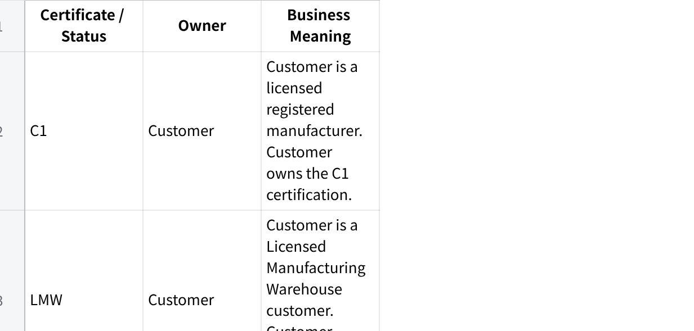

**16Jun26 - Holsen Ivan Brain dump**

**Holsen --- MAIA Client Quirks Summary**

1\. **Client Profile**

**Client:** Holsen\
**Industry:** Chemical supplies and manufacturing\
**MAIA status:** Alpha client\
**Accounting system:** UBS\
**Integration status:** UBS is **not integrated** with MAIA because UBS has no available API integration path for this implementation.

Holsen will use MAIA as the operational order and invoicing layer, but not as a directly integrated accounting layer. The key accounting requirement is for MAIA to generate/export invoice data in a file format that Holsen can use to bulk-create invoices inside UBS for e-invoicing purposes.

2\. **UBS / Accounting Workflow Quirk**

Holsen currently uses **UBS** as its accounting system, but MAIA will not push invoices into UBS directly.

**Required MAIA behaviour**

MAIA should:

Generate invoices inside MAIA.

Export those invoices into a structured file.

Allow Holsen to use that export file to bulk-create invoices in UBS.

Support Holsen's UBS-based e-invoicing workflow indirectly through this export process.

**Out of scope / deferred**

Re-ingesting UBS e-invoice metadata back into MAIA is currently **out of scope and unscheduled**.

This may never become an active ticket because Holsen is already on a migration journey from UBS to SQL Accounting. Building a UBS metadata re-ingestion path may become wasted effort if UBS is replaced before this becomes operationally necessary.

3\. **Main Customisation: C1 / C3 / A57 Tax Exemption Enforcement**

Holsen's most important MAIA quirk is tax-exempt sales enforcement for Malaysian chemical supply transactions involving **C1, C3, LMW, and A57-related certification workflows**.

Holsen sells to customers that may be **C1-certified** or **LMW-certified**, and Holsen itself is a **C1 manufacturer**. MAIA is expected to enforce tax exemption eligibility based on certificates, customer eligibility, item HS codes, and tax exemption rules.

This should not be treated as a simple tax-rate toggle. It is a compliance workflow that requires certificate intake, extraction, storage, validation, and auditability.

4\. **Certificate Ownership Model**

The certificates differ by ownership and application responsibility.

**点击图片可查看完整电子表格**

The key distinction is that **C1 and LMW certification belongs to Holsen's customer**, while **C3 and A57 workflows involve Holsen applying for a certificate or approval to sell tax-free to the customer**.

5\. **PO Upload + Certificate Attachment Workflow**

When a customer PO is uploaded into MAIA, the PO may come with supporting attachments. These attachments may include C1, C3, or A57 certificates.

**Required MAIA behaviour**

When a PO is uploaded with a certificate attachment, MAIA should:

Classify the attachment type.

Detect whether it is a C1, C3, or A57-related certificate.

Extract key certificate metadata.

Store the certificate in MAIA.

Link the certificate to the correct owner and customer relationship.

Use the certificate to determine whether the sales order should be tax-exempt.

Apply tax exemption only to eligible SKU lines.

6\. **Certificate Data Extraction Requirements**

Certificates contain multiple fields, but the most important data is the item eligibility table.

MAIA should extract and store:

Certificate owner

Customer / party the certificate applies to

Issuing body

Certificate number

Certificate date

Effective date / validity period, where available

Expiry date, where available

HS code table

Item descriptions

Tax exemption eligibility per item / HS code

Quantity or quota entitlement, where applicable

Any certificate-specific remarks or conditions

The HS code and item description table is the critical part because Holsen's tax exemption enforcement needs to happen at the **individual SKU line level**, not merely at the customer or order level.

7\. **Tax-Exempt Sales Order Enforcement**

MAIA must support tax exemption enforcement per SKU.

For each uploaded PO and resulting sales order, MAIA should validate:

Whether the customer is eligible for tax exemption.

Whether the correct certificate is attached.

Whether the certificate belongs to the correct party.

Whether the certificate is valid for the customer relationship.

Whether each SKU maps to an eligible HS code or item description.

Whether the certificate allows exemption for that item.

Whether quota tracking is required.

Whether sufficient remaining quota exists, if applicable.

If the certificate and SKU eligibility are valid, MAIA can create the order as tax-exempt for the eligible lines.

If only some SKUs are eligible, tax exemption should apply only to those SKUs. Non-eligible items should remain taxable or be flagged for user review.

8\. **Quota / Utilisation Ledger Requirement**

Some C1, C3, or A57-related documents require the user or customer to maintain a utilisation ledger.

The ledger is needed because, during an audit, Holsen or the relevant party may need to prove how much tax-exempt quantity was purchased, sold, or delivered under a specific certificate.

**MAIA should support:**

Tracking tax-exempt quantity utilisation by certificate

Tracking utilisation by SKU / HS code

Tracking utilisation by customer

Tracking utilisation by sales order

Tracking utilisation by delivery note, once delivery-side logic is built

Exporting or presenting the ledger for audit purposes

This should be designed as a compliance-grade ledger, not just a reporting view.

9\. **Deferred Delivery-Side / Warehouse Quirk**

Holsen also has a delivery and warehouse compliance requirement, but this is currently **scoped but not scheduled or built**.

The deferred requirement is that tax-exempt goods and non-tax-exempt goods cannot be physically mixed.

Example:

Tax-exempt chili powder

Non-tax-exempt chili powder

Even if both are the same product, they must be stored separately, tracked separately, and registered under different batch numbers or warehouse locations.

**Future delivery-side requirements**

MAIA may eventually need to support:

Batch-level exemption tagging.

Separate stock locations for tax-exempt and non-tax-exempt goods.

Delivery Note-based utilisation tracking.

Ledger updates based on actual shipped quantities.

Enforcement that only eligible batches are delivered to eligible customers.

Audit-ready traceability from certificate → sales order → delivery note → batch → warehouse location.

This is a significant warehouse/compliance module and should not be casually bundled into the initial tax exemption workflow.

10\. **Current Scope Position**

**In scope / active expectation**

MAIA invoice generation.

Invoice export file for UBS bulk invoice creation.

PO upload with certificate attachment handling.

C1 / C3 / A57 certificate classification.

Certificate metadata extraction.

Certificate storage and linkage to owner/customer.

SKU-level tax exemption enforcement using HS code / certificate data.

Tax-exempt sales order creation where eligible.

Quota/utilisation ledger concept for tax-exempt transactions.

**Out of scope / deferred**

Direct UBS API integration.

Re-ingesting UBS e-invoice metadata back into MAIA.

Full delivery-side batch enforcement.

Warehouse segregation enforcement.

Delivery Note-based quota ledger updates.

Batch/location-level audit module.

11\. **Product Risk / Implementation Notes**

Holsen's implementation is high-risk because the core quirk is not normal invoicing or order-taking. It is compliance enforcement.

The dangerous mistake would be treating C1 / C3 / A57 as "customer has tax exemption = apply zero tax." That is too shallow and likely wrong.

The correct product model is:

  --------------------------------------------------------------
  Plain Text\
  PO + Certificate Attachment\
  → Attachment Classification\
  → Certificate Extraction\
  → Certificate Master Record\
  → Customer / Owner / HS Code Validation\
  → SKU-Level Tax Exemption Enforcement\
  → Sales Order Line Tax Treatment\
  → Quota / Utilisation Ledger\
  → Future Delivery + Batch Traceability

  --------------------------------------------------------------

Holsen should be treated as a specialised tax-exemption compliance client, not just a chemical supplies client using MAIA for order processing.

12\. **Key Documentation Note**

There is a naming consistency issue in the raw discussion: the client name appears as "Holsen," "Hosen," and "Polson" in different places. The canonical client name should be confirmed and standardised across all internal documentation, tickets, doctypes, and implementation notes.

Recommended canonical name: **Holsen**, unless corrected by the commercial or onboarding team.
