**22 June 26 - Forensic Account Dossier**

**Holsen --- Account Dossier v3, 2026-06-22**

**Regeneration basis:** final enriched source set, including renamed transcript copies and earlier project files. I treated duplicate uploads with the same granola_id as one meeting, not separate evidence. The decisive update vs v2 is unchanged but sharper: **Holsen is in active UAT / late implementation, not discovery; acceptance is blocked by unresolved UAT issues, not by absence of build evidence.** ⚠️

**Source Manifest**

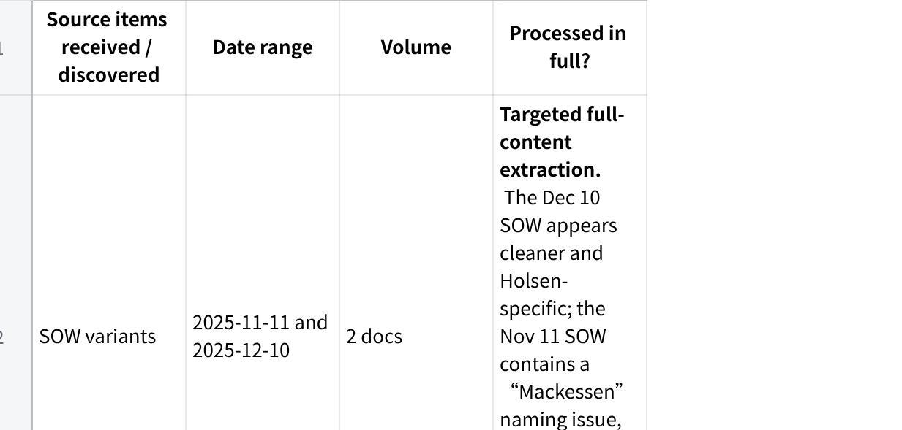

**点击图片可查看完整电子表格**

**PART A --- Executive Layer**

**A1. Snapshot**

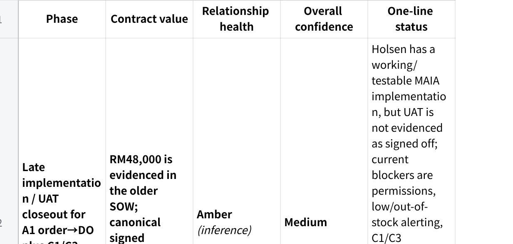

**点击图片可查看完整电子表格**

**A2. Top 5 things that matter most right now**

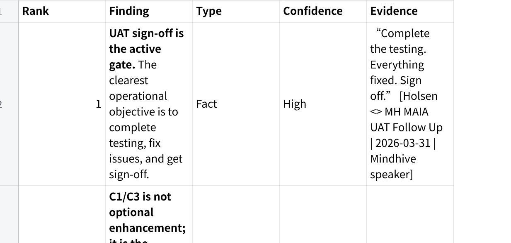

**点击图片可查看完整电子表格**

**A3. Ultimax check --- headline**

**Material divergence remains, but it is now specific: MAIA appears to cover order creation, document flow, C1/C3 certificate/tax handling in UAT, and partial compliance enforcement; it does not yet evidence full compliance-grade C3 utilisation, warehouse segregation, and delivery-side batch enforcement.**

The dangerous mismatch is not "MAIA cannot do Holsen." It is narrower: **Holsen may believe the system is converging on end-to-end compliance control, while current evidence shows a mix of working UAT functions, unresolved defects, and manual/next-phase C3 management.** The correct product model requires certificate classification/extraction, customer/owner/HS-code validation, SKU-level tax treatment, quota/utilisation ledger, and future delivery/batch traceability; internal scope notes explicitly defer full delivery-side batch enforcement, warehouse segregation, DN-based quota updates, and batch/location audit module.

**A4. Recommended next moves**

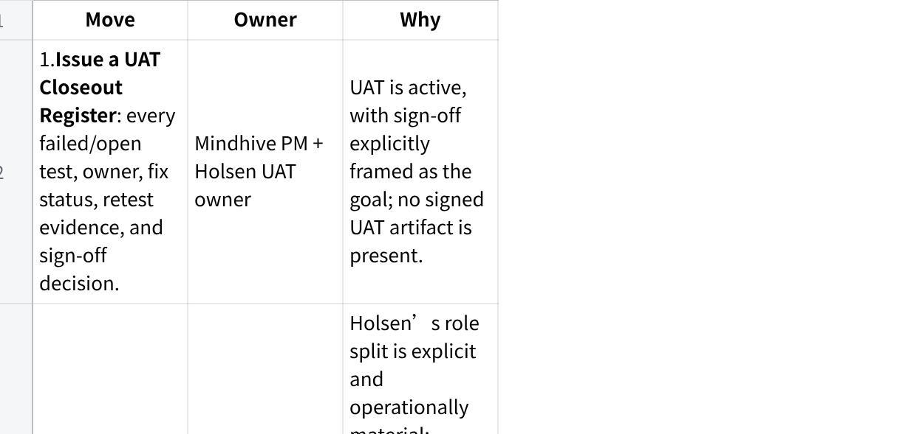

**点击图片可查看完整电子表格**

**PART B --- Evidence Layer**

**B1. Source manifest & coverage / blindness**

**Fireflies coverage table**

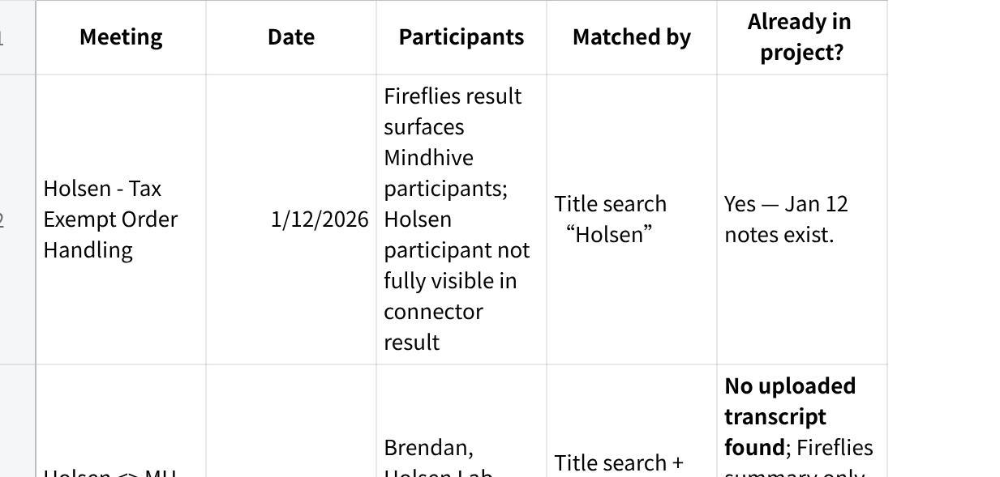

**点击图片可查看完整电子表格**

**Uploaded transcript dedupe table**

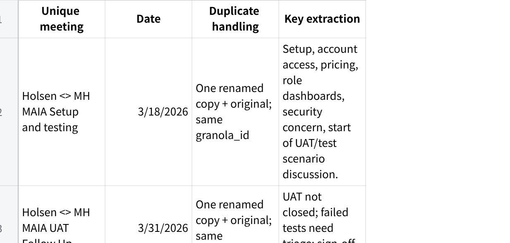

**点击图片可查看完整电子表格**

**Queries / angles checked**

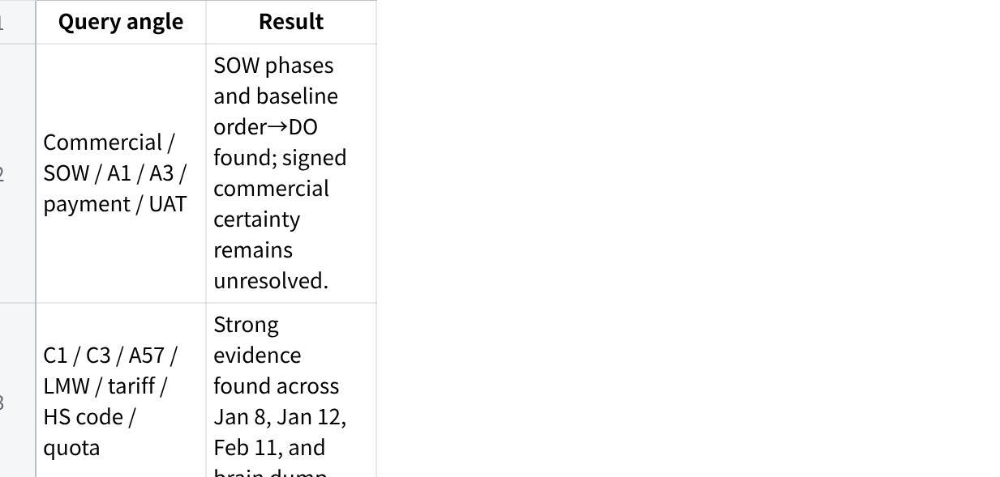

**点击图片可查看完整电子表格**

**Source-type blindness**

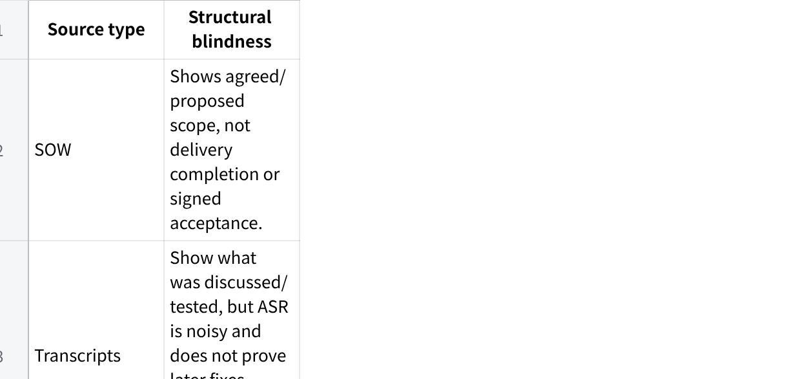

**点击图片可查看完整电子表格**

**B2. Chronological timeline**

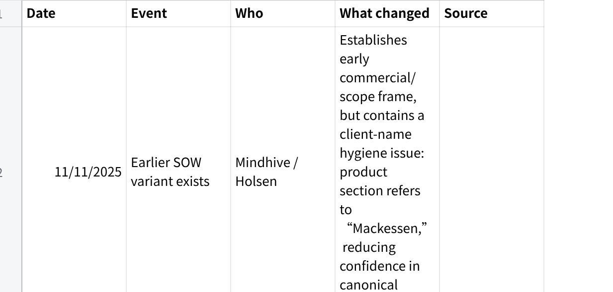

**点击图片可查看完整电子表格**

**B3. The client's world**

**Fact --- business and operations.** Holsen's process is enquiry → quote → customer PO → Holsen invoice → customer payment → production/picklist → packing → driver allocation → customer receipt → DO acknowledgement; they use UBS for invoice/credit notes, Word for quotation, and Excel for proforma invoice / manual inventory management.

**Fact --- operational pain.** Holsen faces stock-availability issues after checking stock, issuing invoices, and receiving payment; MAIA is expected to book/reserve quantity to avoid stock disappearing.

**Fact --- compliance reality.** C1 is customer/manufacturer certificate logic tied to tariff-code coverage; C3 is not a generic item flag and must be tracked as item → customer → approved quantity/quota.

**Inference --- what success means to Holsen.** Success means MAIA reduces manual work without breaking tax-exempt compliance: certificate intake, tariff/HS-code validation, batch/K1/COA traceability, role-specific work, and correct documents at SO/DN/invoice points. This is inferred from the compliance docs, SOW scope, and UAT defects.

**Inference --- what failure means to Holsen.** Failure means MAIA lets wrong stock be sold, wrong tax be applied, wrong PDF/documents generated, wrong role access granted, or requires so much manual workaround that the system cannot be trusted for compliance-heavy daily operations. This is inferred from UAT issues and the C1/C3 compliance model.

**B4. Actors --- profiles + decision map**

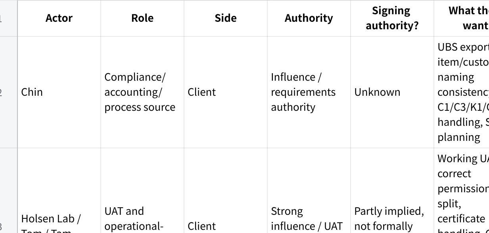

**点击图片可查看完整电子表格**

**Standing authority risk:** The Mar 31 transcript implies the tester may sign the UAT form, but no actual signed UAT form, named signatory record, or authority confirmation exists in the provided corpus.

**B5. Commercial state**

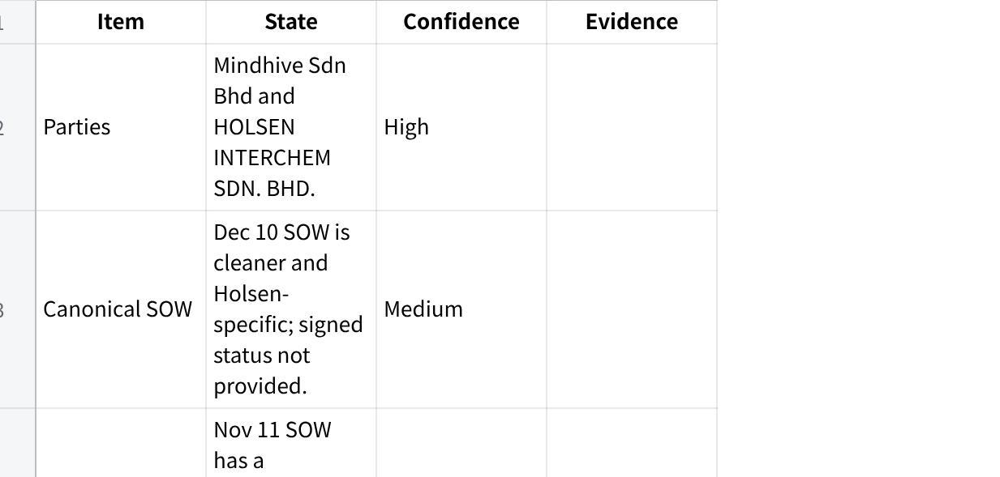

**点击图片可查看完整电子表格**

**B6. Commitments ledger**

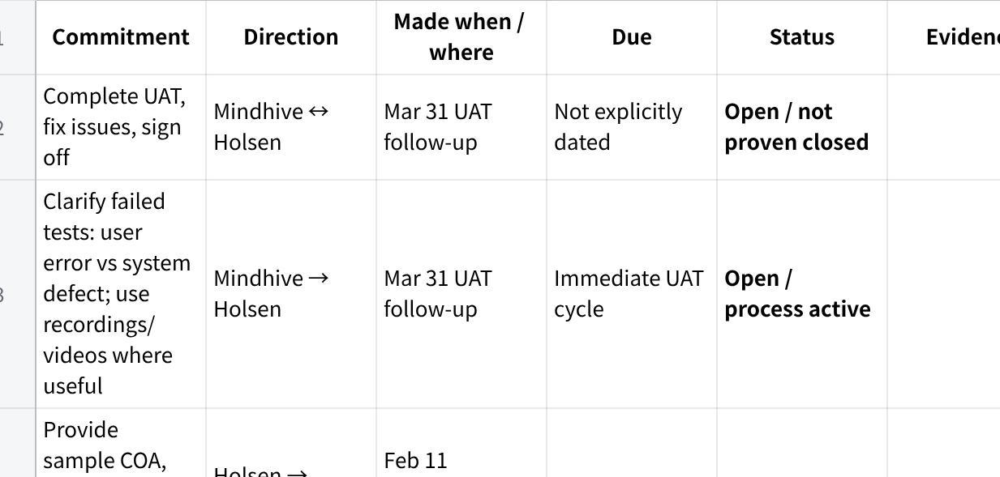

**点击图片可查看完整电子表格**

**B7. Decisions log**

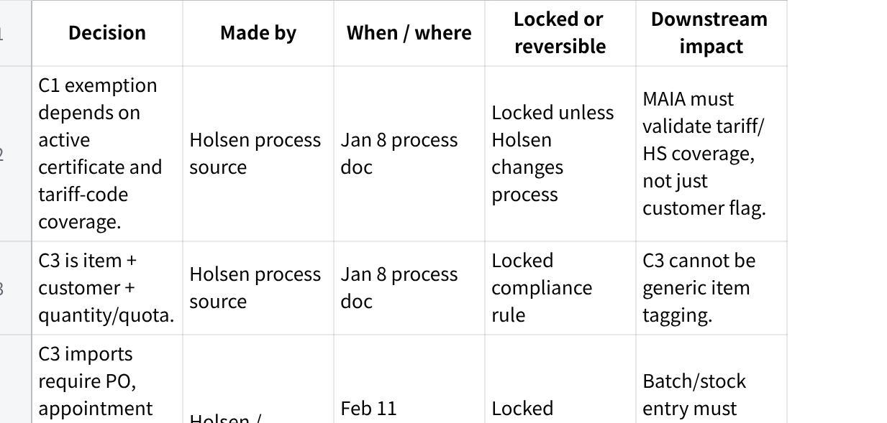

**点击图片可查看完整电子表格**

**B8. Understood deliverable vs scope vs build**

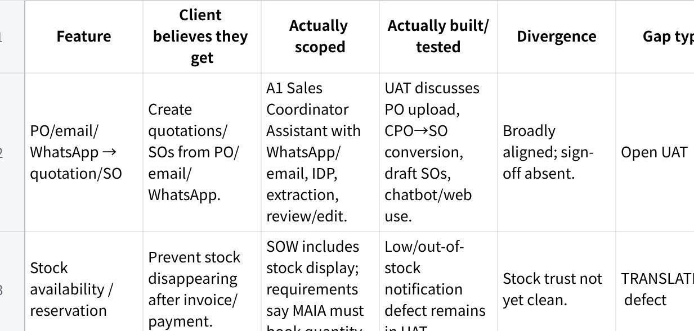

**点击图片可查看完整电子表格**

**B9. Gaps & risks --- prioritized**

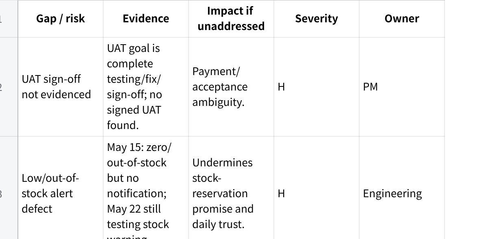

**点击图片可查看完整电子表格**

**B10. Relationship health & sentiment trajectory**

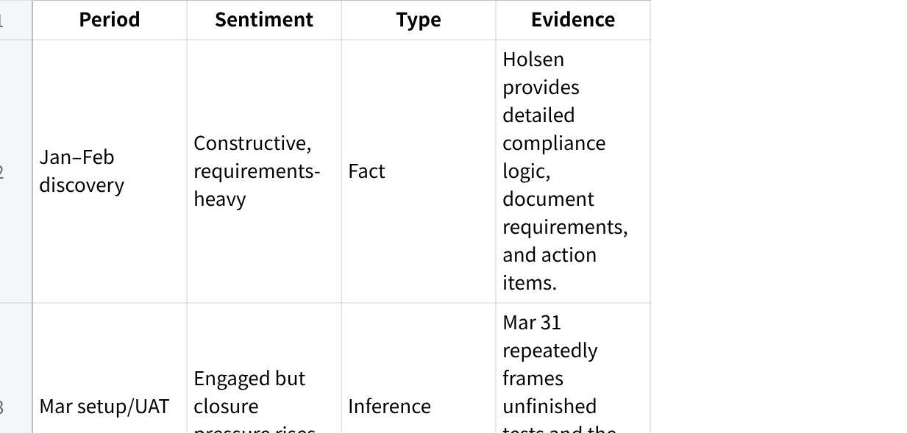

**点击图片可查看完整电子表格**

**Relationship health conclusion:** **Amber / Medium confidence.** There is no evidence of churn or hostility, but there is clear UAT friction and unresolved acceptance risk. The relationship risk is credibility erosion through open defects and blurred phase boundaries, not obvious client anger.

**B11. Open questions / unresolved threads**

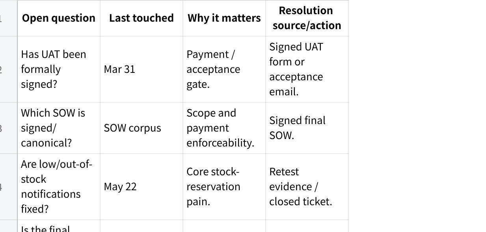

**点击图片可查看完整电子表格**

**B12. What we do NOT know**

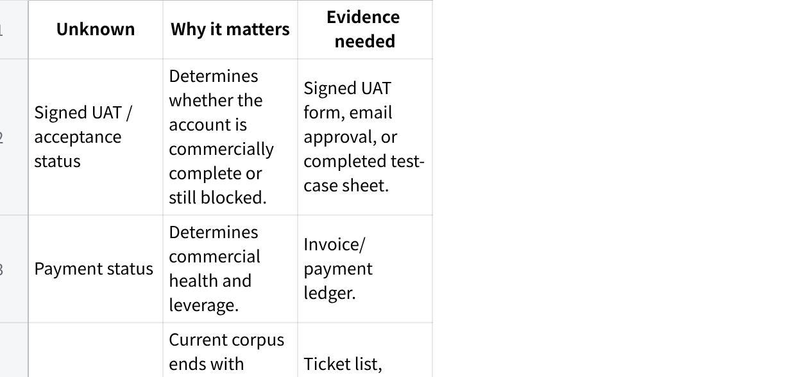

**点击图片可查看完整电子表格**

**PART C --- Synthesis**

**C1. Confidence statement**

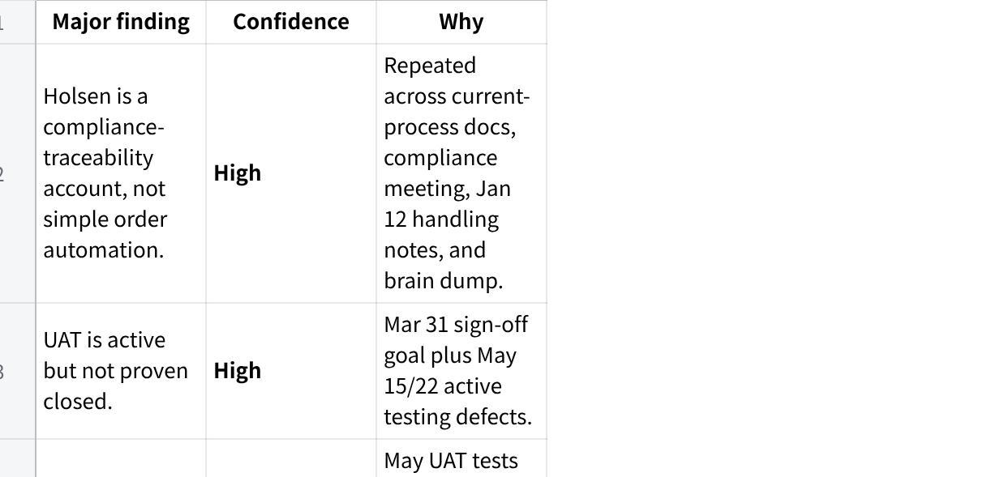

**点击图片可查看完整电子表格**

**C2. Rollup handoff note --- Q3 cross-account plan**

**Regulated-stock accounts need a compliance object model before build.** Holsen requires certificate owner, customer, HS/tariff code, SKU, quota, batch, K1, COA, SO/DN/invoice, and future warehouse-location traceability.

**UAT needs a defect taxonomy.** Holsen mixes user misunderstanding, configuration issue, product defect, and next-phase scope in the same UAT flow; each needs a separate closure path.

**Role permissions are product features, not admin cleanup.** Holsen's logistics/finance/sales split directly affects compliance and acceptance.

**Manual fallback must be written down.** Holsen is willing to manage deeper C3 manually for now, but only a phase-boundary note prevents later expectation drift.

**Reusable platform primitive opportunity:** certificate extraction, HS-code mapping, SKU-line tax treatment, quota ledger, batch/K1/COA linking, and audit reporting should become MAIA primitives rather than one-off Holsen logic.
