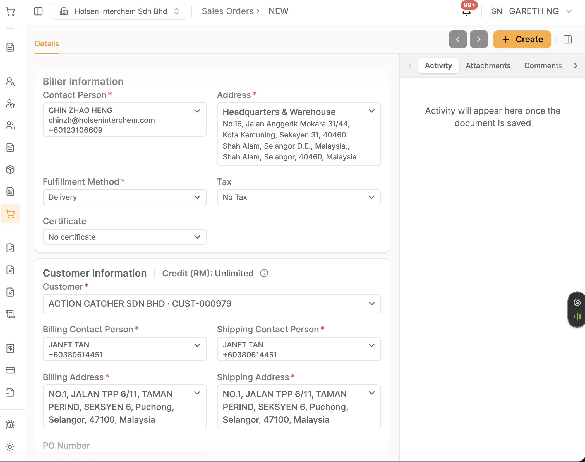
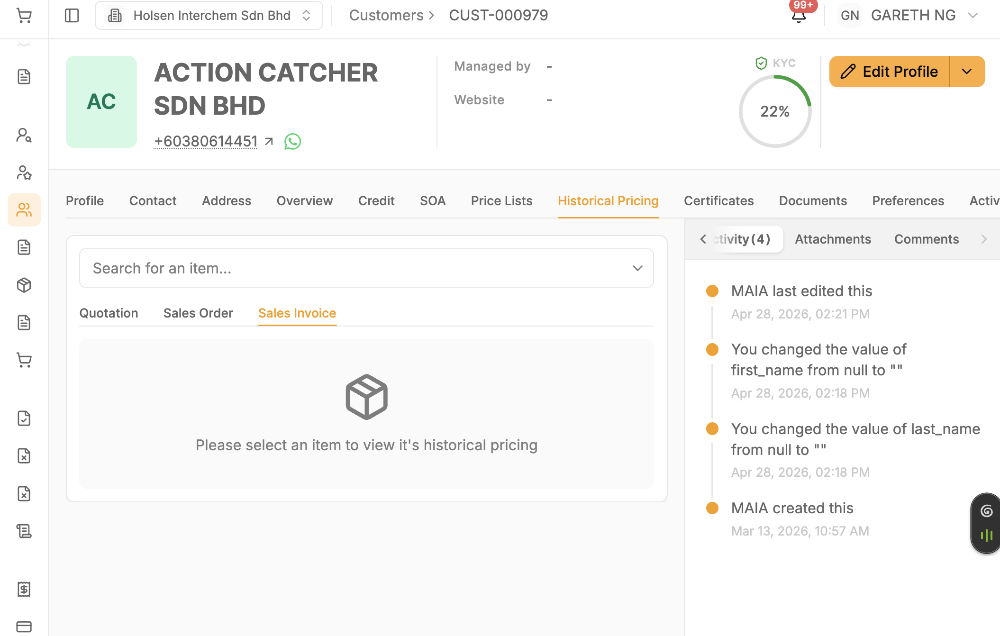
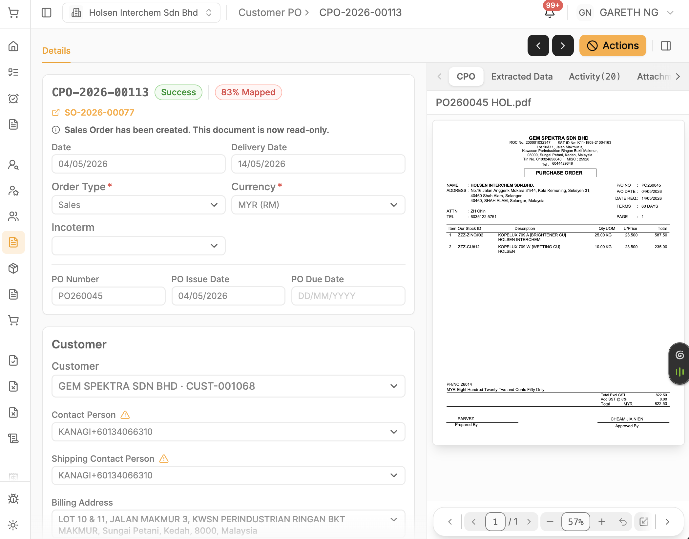
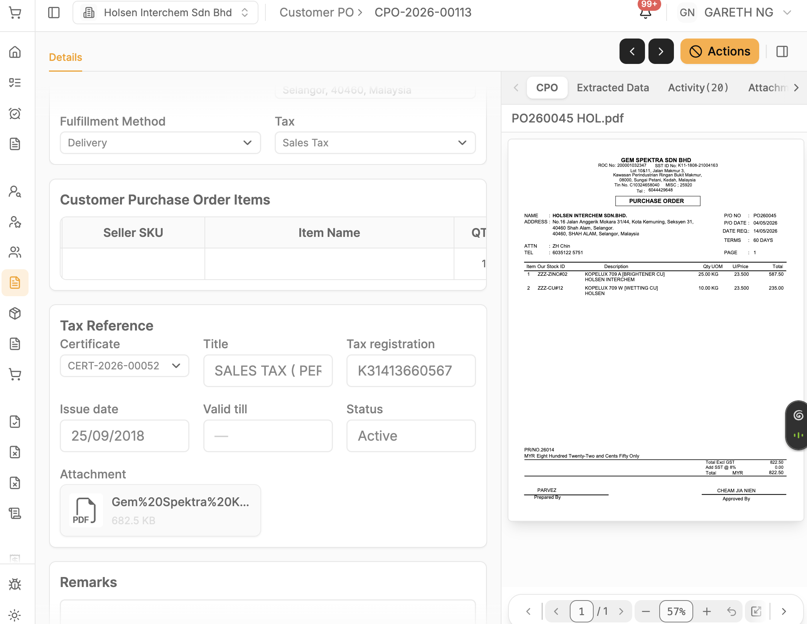
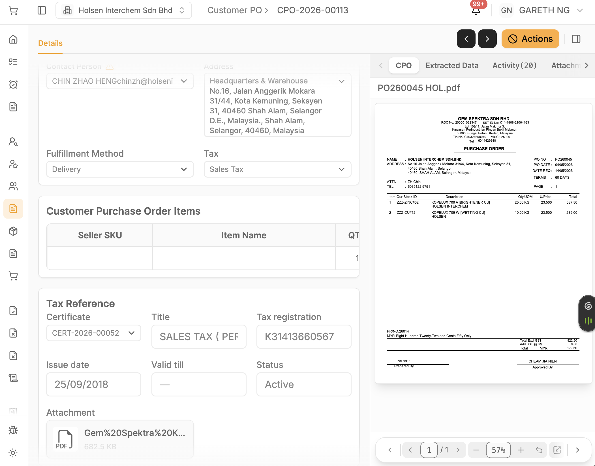
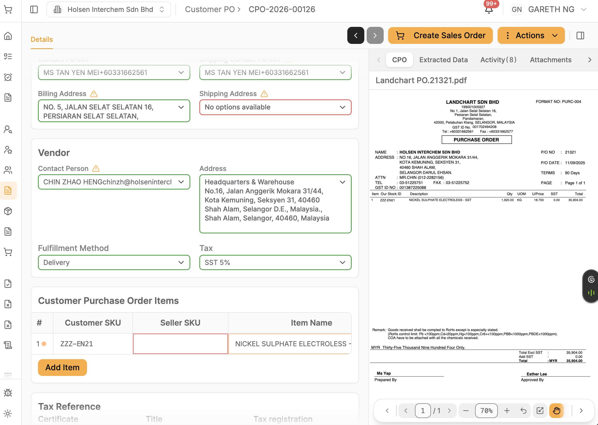
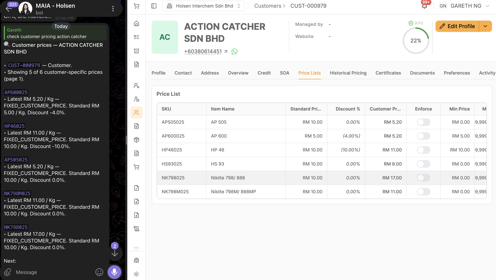

**3Aug26 - Holsen Training Gaps**

**#391 --- Invoice PDF missing the discount column**

Invoice PDF does not display the discount column. Expected: invoice PDF should display the discount column.

**\[该类型的内容暂不支持下载\]**

**#390 --- SO PDF shows auto-populated discount when unit price is updated against std price**

SO PDF is a customer-facing document; it should not show/reflect the given discount for line items. Expected: remove the displayed discount from the SO/SI PDF.

**\[该类型的内容暂不支持下载\]**

**#389 --- DN submission blocked by false negative-stock error after stock/batch qty update**

Item qty is added into the stock entry and batch, but when submitting the DN with the batch that has updated qty, it returns an error saying the item has negative stock quantity of -2.0.

Expected: after updating/adding qty at stock qty/batch level, submitting the DN should check and acknowledge the qty used from stock/batch level, not throw a false negative-stock error.

**\[该类型的内容暂不支持下载\]**

**\[该类型的内容暂不支持下载\]**

**#388 --- Stock entry missing UOM display/column**

Stock entry does not display UOM alongside item qty. Expected: stock entry should display UOM with the item qty.

**\[该类型的内容暂不支持下载\]**

**#387 --- Cannot view batch total qty for line items when selecting/adding batch in SO/PL**

When selecting the batch number, the current total qty of the batch is not displayed. Expected: current total qty of the batch should be displayed when selecting it.

**\[该类型的内容暂不支持下载\]**

**#386 --- Multiple warehouses showing in Holsen instance**

Holsen uses one warehouse only. Expected: name that warehouse \"Main warehouse\" and remove the other warehouses.

**\[该类型的内容暂不支持下载\]**

**#385 --- Picklist submission fails when picked qty differs from SO qty**

Fails to submit picklist because picked qty differs from the qty on the SO, cannot be lower/higher than qty. Expected: picklist should allow submission after picked quantity is updated, even if lower or higher than the ordered quantity.

**\[该类型的内容暂不支持下载\]**

**#384 --- Picklist submission error persists, picklist stays in draft after refresh**

When submitting the picklist, it returns an error that the picklist is already submitted, yet the picklist remains in draft status after refreshing the page.

Expected: picklist should submit without returning the \"already submitted\" error.

**\[该类型的内容暂不支持下载\]**

**\[该类型的内容暂不支持下载\]**

The biller contact person is not changing based on which customer is managed by which sales user when the customer is selected.

{width="5.75in" height="4.552083333333333in"}

The sales user has not been assigned to the customer (Managed by who)

{width="5.75in" height="3.65625in"}

Item in submitted CPO is missing

{width="5.75in" height="4.5in"}

{width="5.75in" height="4.447916666666667in"}

Misconception of the copywriting cancel button; change \"action\" to \"cancel\"

{width="5.75in" height="4.5in"}

Why cpo still populate the \"SST 5%\", even there is no any \"SST 5 %\" data from the raw po

{width="5.75in" height="4.083333333333333in"}

Customer specific pricing lookup output format, the data to display should be informative, useful for them.\
Chatbot should return the message with sku, item name, customer pricing, discount, std price, enforced

> {width="5.75in" height="3.25in"}

For DIY/Fixguru volume in DN

cm3 convert to m3, due to value in cm being too big

Update the kg to kg/cm3 in the PDF and FE column , basically

100 Kg\
100 cm3
