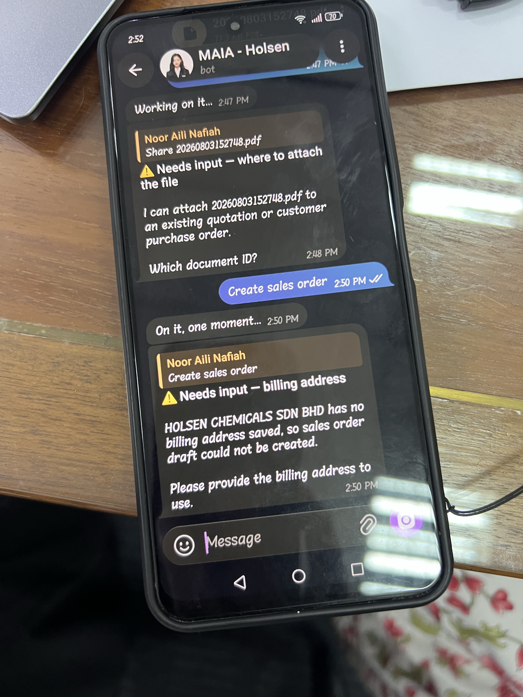
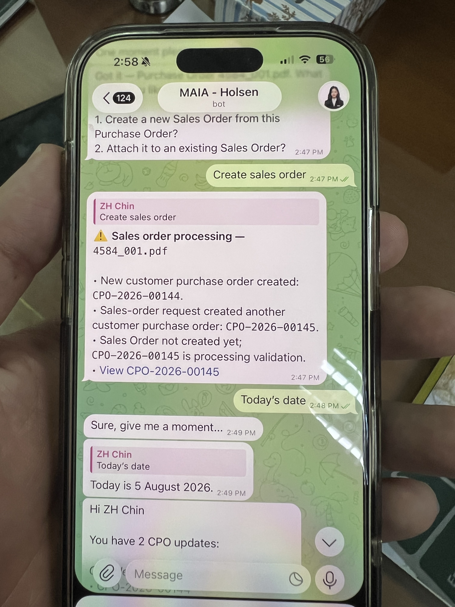
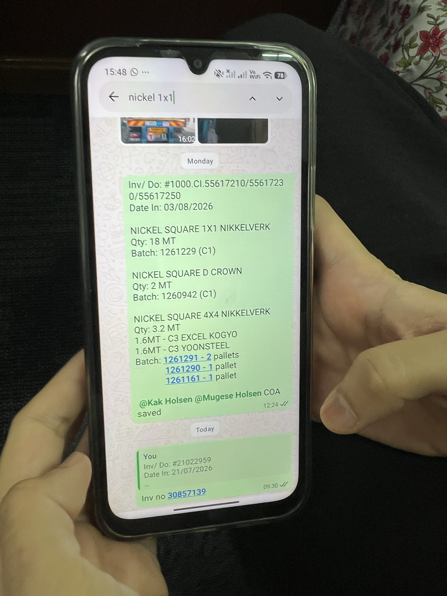
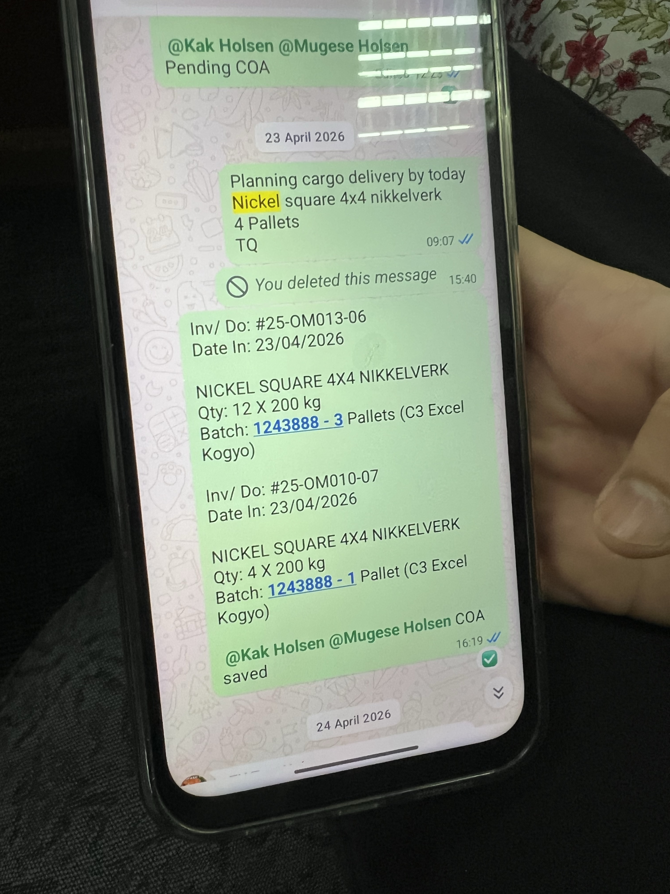
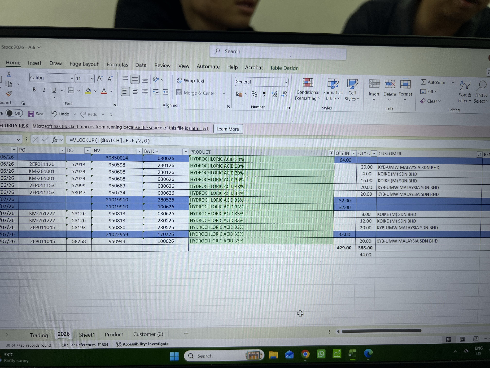
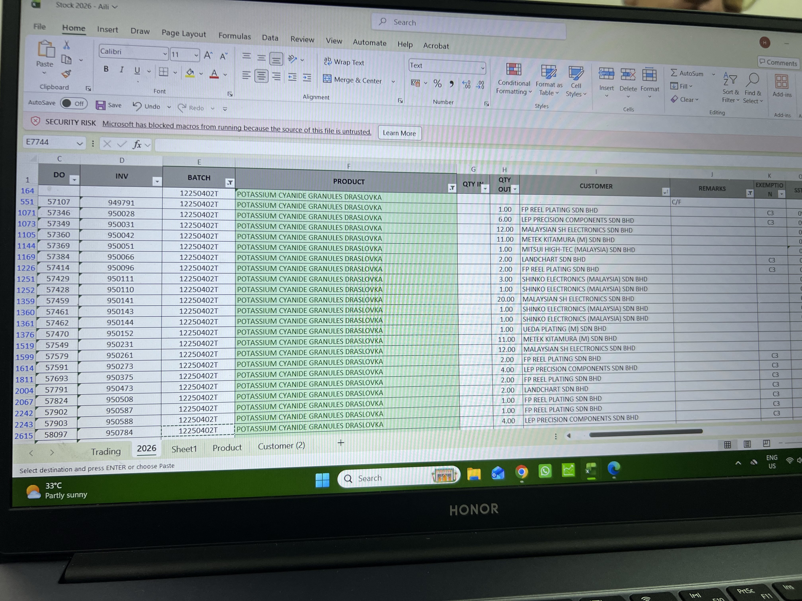
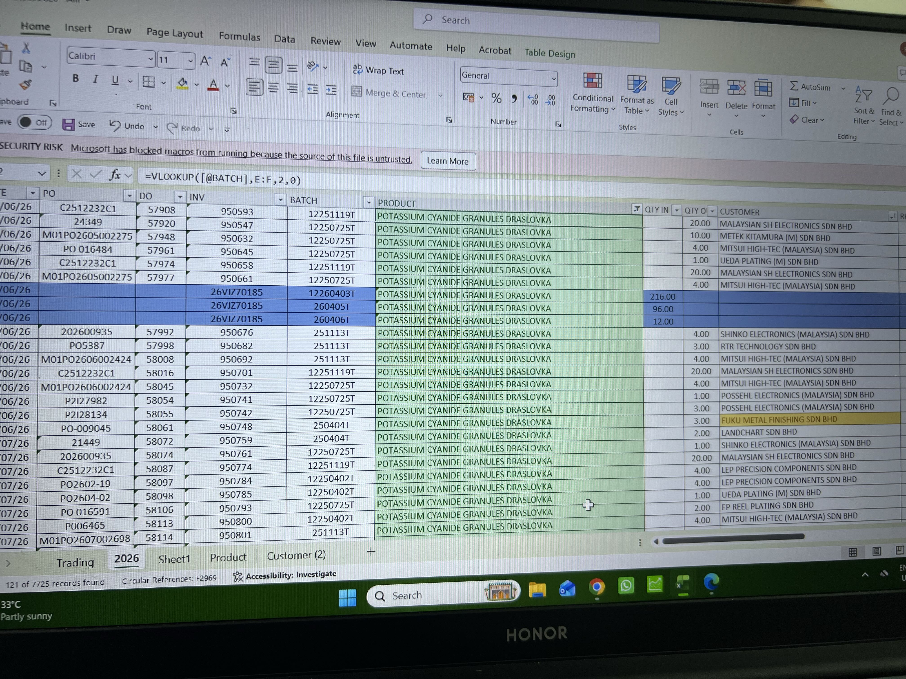
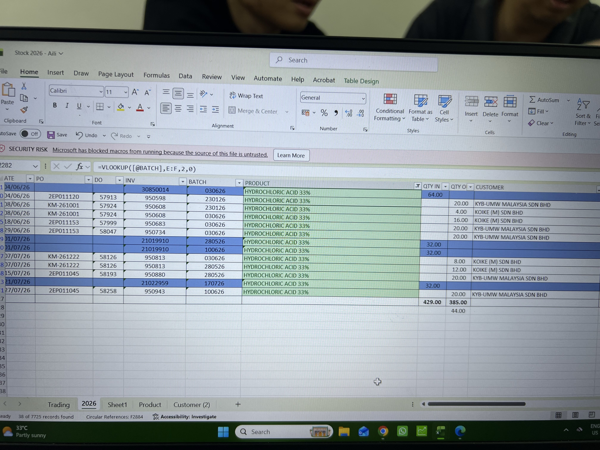
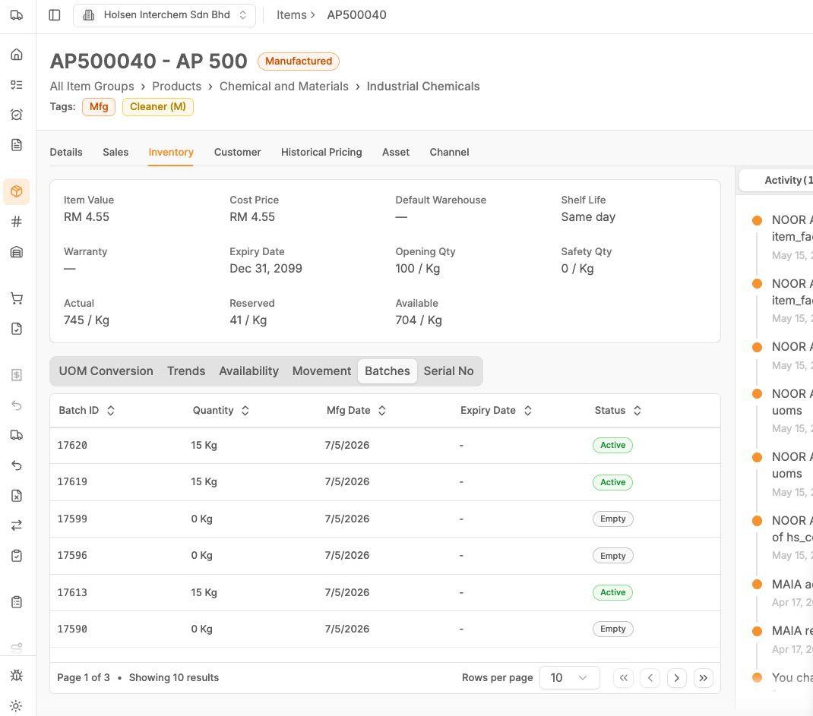

**5 Aug26 - Holsen Training**

CPO 2026 - 142 attachment missing

We should flush the default roles as well, when clients have their own custom roles.

llm hallucinate holsen chemicals?, this chat session also capture wrong intent

{width="5.75in" height="7.666666666666667in"}

ZH CPO 144 and 145 upload one PO created two POs

{width="5.75in" height="7.666666666666667in"}

Holsen side will do 2 way sync with SQL, they will familiarise with onboarding SQL first, before going live with MAIA since after sharing they can see how MAIA and SQL will integrate with their current business workflow

Main possible risk is the batch and lot number handling and integration into SQL.

This is a known blindpsot.

User Assignment, by role, user name, email, phone number.

Batch search by item not found, visibility of item stock by batch by warehouse.

Consulting and educate holsen team on adoption of SQL and whats the pre-requisites before on boarding to MAIA

Key theme here is to reduce double entry work

Also shared how the purchasing etc make sure that their informatino is correct.

Batch and lot number segratation

Incoming by lot, sometimes need to split the lot in to batches

Batched tied to customer and quota managed

> {width="5.75in" height="7.666666666666667in"}
>
> {width="5.75in" height="7.666666666666667in"}
>
> this is supplier batch number
>
> sometimes self create
>
> stock card,
>
> {width="5.75in" height="4.3125in"}
>
> {width="5.75in" height="4.3125in"}
>
> {width="5.75in" height="4.3125in"}
>
> {width="5.75in" height="4.3125in"}
>
> {width="5.75in" height="4.3125in"}

Stock view by batch by warehouse, also show mfg date and/or expiry date to visible

Production need to be notified when pick list is created

Pick list, when updating the picked qty can also update the batch information if unset (e.g. Set means creator need it to be that batch, if null open)

When receiving goods, may have variety of shelf life

Batch Mfg Date format DD/MM/YY

{width="5.75in" height="5.0625in"}
