**Holsen - Customer Onboarding Checklist**

**MAIA -- Client Onboarding Template**

**Document Purpose:**\
This document captures all required information to configure a client's organisation within the MAIA platform, including company profile, users, inventory, customers, selling rules, and system configurations.

**Section A --- Critical Setup (Mandatory for Go-Live)**

  --------------------------------------------------------------------------------------------------------------
  These items are **required** to activate MAIA core workflows (Sales, Orders, Documents, Finance visibility).

  --------------------------------------------------------------------------------------------------------------

**A1. Company Profile (Core Identity)**

**Company Identity**

Company Legal Name

  --------------------------------------------------------------
  Plain Text\
  **Holsen Interchem Sdn Bhd**

  --------------------------------------------------------------

Company Abbreviation (Max 3 characters, e.g. FS, MAI)

  --------------------------------------------------------------
  Plain Text\
  HLN

  --------------------------------------------------------------

Company Type (Sdn Bhd / Enterprise / LLP / Sole Prop)

  -----------------------------------------------------------
  Plain Text\
  **Sdn Bhd**

  -----------------------------------------------------------

Country of Incorporation

  --------------------------------------------------------------
  Plain Text\
  Malaysia

  --------------------------------------------------------------

ROC / SSM Number

  --------------------------------------------------------------
  Plain Text\
  0181344H / 198901004037

  --------------------------------------------------------------

Date of Incorporation

  --------------------------------------------------------------
  Plain Text\
  1989-04-22

  --------------------------------------------------------------

Date of Establishment

  --------------------------------------------------------------
  Plain Text\
  1989-04-22

  --------------------------------------------------------------

**Company Registration & Compliance**

Upload the following:

SSM / ROC Certificate

SST Certificate (if applicable)

TIN Number (with supporting document)

  --------------------------------------------------------------
  (upload documents here)

  --------------------------------------------------------------

**Online Presence**

Company Website

  --------------------------------------------------------------
  Plain Text\
  holseninterchem.com

  --------------------------------------------------------------

FAQ Page / About Us content (or text to be used inside MAIA)

  --------------------------------------------------------------
  Plain Text\
  https://www.holseninterchem.com/index.php#about

  --------------------------------------------------------------

**A2. Branding & Corporate Information**

{width="2.0in" height="0.96875in"}

Corporate Profile (PDF / Slides)

N/A

Mission & Vision

  ----------------------------------------------------------------------------------------------------------------------------------------------------------------------------------------------------------------------------------------------------------------------------------------------------------------------------------------------------------------------------------------------------------
  Plain Text\
  Vision: Pioneer in Innovation, Quality and Service Standards\
  \
  Mission: We continuously strive to provide value add through the innovation of quality products and services as well as escalating profitability to our customers.\
  \
  Expertise: We are ISO 9001:2008 & ISO 14001:2004 certified company.We prioritise in providing our customers with the expertise to resolve technical complications of electroplating as well as to provide tailor-made products for each unique need. The Company strives to offer value-added service advantages that allow the most efficient and profitable supplier --customer relationship possible.

  ----------------------------------------------------------------------------------------------------------------------------------------------------------------------------------------------------------------------------------------------------------------------------------------------------------------------------------------------------------------------------------------------------------

Core Values

  --------------------------------------------------------------
  Plain Text\
  N/A

  --------------------------------------------------------------

Service Promise

  --------------------------------------------------------------
  Plain Text\
  N/A

  --------------------------------------------------------------

Industry Positioning

  --------------------------------------------------------------
  Plain Text\
  Chemical

  --------------------------------------------------------------

Key Corporate Milestones

  --------------------------------------------------------------
  Plain Text\
  N/A

  --------------------------------------------------------------

**A3. Official Documents & Policies**

Quotation

**\[Quotation.pdf\]**

Receipt

**\[Receipt.pdf\]**

Proforma Invoice

**\[Proforma Invoice.pdf\]**

PO

**\[Holsen_PO_1.pdf\]**

**\[Holsen_PO_2.pdf\]**

**\[Holsen_PO_3.pdf\]**

**\[Holsen_PO_4.pdf\]**

**\[Holsen_PO_5.pdf\]**

Invoice

**\[INV1.pdf\]**

**\[INV2.pdf\]**

**\[INV3.pdf\]**

DO

**\[DO1.pdf\]**

**\[DO2.pdf\]**

**\[DO3.pdf\]**

Supporting attachment for DO

**\[PSO Sample.xlsx\]**

Credit Note

**\[Credit Note.pdf\]**

**Certificates & Internal Policies**

Attachment required for C1 Tax Exemption Cert (Item list at Customer level)

**\[C1 Sample.pdf\]**

Attachment required for C3 Tax exemption (per SO)

Appointment letter

**\[C3 AppointmentLetter 1.pdf\]**

**\[C3 AppointmentLetter 2.pdf\]**

**\[C3 AppointmentLetter 3.pdf\]**

**\[C3 AppointmentLetter 4.pdf\]**

PO (refer above)

C3 sample

**\[C3 Certificate 2.pdf\]**

**\[C3 Certificate 3.pdf\]**

**\[C3 Certificate 4.pdf\]**

**Stock & Inventory**

Stock Entry/Batch

K1

+:---------------------------+:---------------------------+:---------------------------+:---------------------------+
| **\[K1 SMK NA77448.pdf\]** | **\[K1 SMK NB77448.pdf\]** | **\[K1 SMK NC77448.pdf\]** | **\[K1 SMK ND77448.pdf\]** |
|                            |                            |                            |                            |
| **\[K1 SMK NE77448.pdf\]** | **\[K1 SMK NF77448.pdf\]** | **\[K1 SMK NG77448.pdf\]** |                            |
+----------------------------+----------------------------+----------------------------+----------------------------+

BOL

**\[BOL Sample.pdf\]**

COA

> Cert of Analysis issued by Holsen for Finished Goods

**\[COA Finished Goods (1).pdf\]**

> Cert of Analysis issued by Holsen\'s Trader for Trading Goods

**\[COA Trading Goods (1).pdf\]**

Supplier/vendor invoices.

**\[Supplier Invoice.pdf\]**

Packing lists

**\[Supplier Packing List.pdf\]**

Item

SGS compliance report - A supporting attachment to show the items meet destination makret regulations.

**\[260203 SGS Test Report Nikkelverk Nickel Squares.pdf\]**

Warehouse Preparation List

https://drive.google.com/file/d/1-pA-EtSdEEiZzhvB5KdSOx3YnD_mKsmx/view?usp=drive_link

https://drive.google.com/file/d/1dGswYI4CK4DVhYLlTg1nmQMvDuAyuhLB/view?usp=drive_link

https://drive.google.com/file/d/1QjBcZEswfNFQ0YjqimkyHCVvgmuK-i0w/view?usp=sharing

Poison Signing Form (PSO)

This includes PSO form sample

which customers will need PSO (in customer sheet)

what item flagged as the poisonous item (in product sheet)

**\[PSO Sample.xlsx\]**

**A4. Company Contact Information**

  ---------------------- ---------------------------- ------------------------------------------- -------------------------------
  Company phone number   Company email                Website                                     Social media links (optional)

  03-5122 5751           holsen@holseninterchem.com   https://www.holseninterchem.com/index.php   N/A
  ---------------------- ---------------------------- ------------------------------------------- -------------------------------

**A5. Addresses**

  --------------------------------------------------------------
  Minimum **1 Billing + 1 Shipping address required**

  --------------------------------------------------------------

+:-------------------+:---------------------------------------------------------------+:---------+:---------+:----------------+
| Address type       | Full address                                                   | Country  | State    | Primary address |
+--------------------+----------------------------------------------------------------+----------+----------+-----------------+
| BIlling + Shipping | No.16, Jalan Anggerik Mokara 31/44, Kota Kemuning, Seksyen 31, | Malaysia | Selangor | Yes             |
|                    |                                                                |          |          |                 |
|                    | 40460 Shah Alam, Selangor D.E., Malaysia.                      |          |          |                 |
+--------------------+----------------------------------------------------------------+----------+----------+-----------------+

**A6. Contact Persons**

+:-----------+:-----------+:-------------+:---------------------------+:----------------+
| Full name  | Role/Title | Phone Number | Email address              | Primary Contact |
+------------+------------+--------------+----------------------------+-----------------+
| Tam Ze Xin | Operations | +60124295751 | holsenlab@gmail.com        | Yes             |
|            |            |              |                            |                 |
|            |            |              | holsen@holseninterchem.com |                 |
+------------+------------+--------------+----------------------------+-----------------+

**A7. Bank Accounts**

  -------------------- ---------------- ------------------------------
  Bank Name            Account Number   Default Bank Account

  Public Bank Berhad   3127963911       Yes
  -------------------- ---------------- ------------------------------

**A8. Users & Roles (Access Control)**

**User Database**

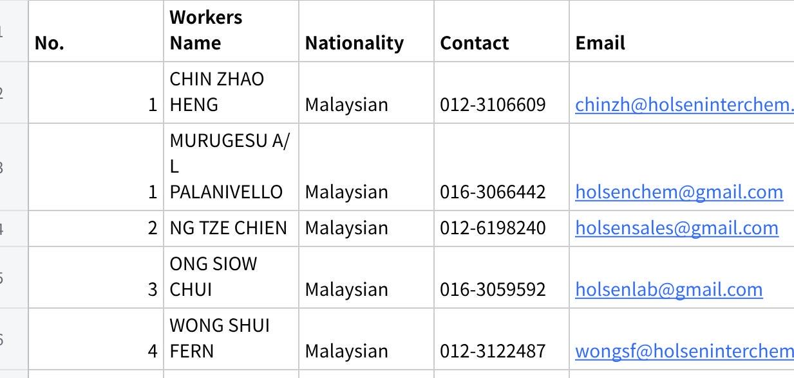

**点击图片可查看完整电子表格**

**Roles Definition**

**Raw file from Holsen**

**\[MAIA Permissions.xlsx - Sheet2.csv\]**

+------------------------------------------------------+--------------------------------------+
|   ---------------------- --------------------------- |   -------------- ------------------- |
|   Name                   Role                        |   Department     Role                |
|                                                      |                                      |
|   Mr. Tam Ze Xin         Sales , Admin (Operation)   |   Sales, Admin   Operations          |
|                                                      |                                      |
|   Mr. Ng Tze Chien       Sales                       |   Sales          Sales               |
|                                                      |                                      |
|   Ms. Wong Shui Fern     Finance                     |   Finance        Finance             |
|                                                      |                                      |
|   Ms. Noor Aili Nafiah   Logistics                   |   Logistics      Logistics           |
|                                                      |                                      |
|   Ms. Intan Atikah       Procurement                 |   Logistics      Procurement         |
|                                                      |                                      |
|   Mr. Murugesu           Production                  |   Logistics      Production          |
|                                                      |                                      |
|   Ms. Ong Siew Chui      System Admin                |   All roles      System Admin        |
|                                                      |                                      |
|   Mr. Chin Zhao Heng     Boss, System Admin          |   All roles      Boss                |
|   ---------------------- --------------------------- |                                      |
|                                                      |                                      |
|                                                      |   -------------- ------------------- |
+------------------------------------------------------+--------------------------------------+

**Role Permissions Configuration**

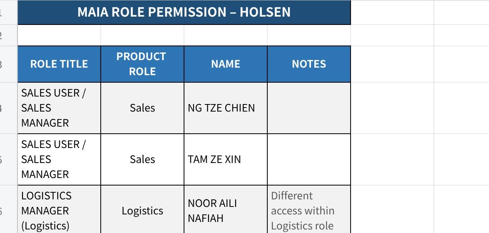

**点击图片可查看完整电子表格**

Notifications

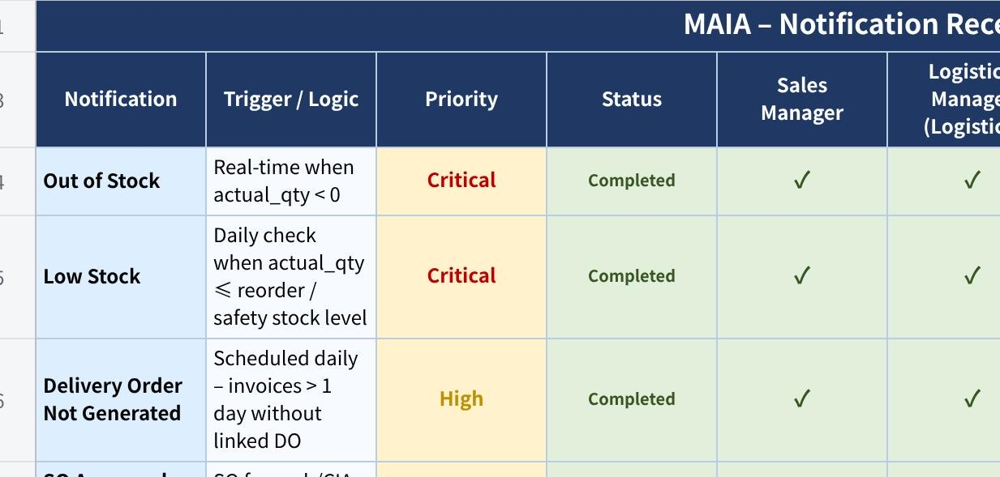

**点击图片可查看完整电子表格**

**~~Default~~**

+:--------------------------------------------------------------------------+:------------------------------------+:-------------------------------------+:------------------------------------+:-----------------------------------+:------------------------------------+:----------------------------+:--+:--+:----+:-----------------+
| **ROLES**                                                                 |                                     |                                      |                                     |                                    |                                     |                             |   |   |     |                  |
+---------------------------------------------------------------------------+-------------------------------------+--------------------------------------+-------------------------------------+------------------------------------+-------------------------------------+-----------------------------+---+---+-----+------------------+
|                                                                           |                                     |                                      |                                     |                                    |                                     |                             |   |   |     |                  |
+---------------------------------------------------------------------------+-------------------------------------+--------------------------------------+-------------------------------------+------------------------------------+-------------------------------------+-----------------------------+---+---+-----+------------------+
| SALES MANAGER                                                             | Sales                               | NG TZE CHIEN                         |                                     |                                    |                                     |                             |   |   |     |                  |
+---------------------------------------------------------------------------+-------------------------------------+--------------------------------------+-------------------------------------+------------------------------------+-------------------------------------+-----------------------------+---+---+-----+------------------+
| SALES MANAGER                                                             | Sales                               | TAM ZE XIN                           |                                     |                                    |                                     |                             |   |   |     |                  |
+---------------------------------------------------------------------------+-------------------------------------+--------------------------------------+-------------------------------------+------------------------------------+-------------------------------------+-----------------------------+---+---+-----+------------------+
| LOGISTICS MANAGER (Logistics)                                             | Logistics                           | NOOR AILI NAFIAH                     |                                     |                                    |                                     |                             |   |   |     |                  |
|                                                                           |                                     |                                      |                                     |                                    |                                     |                             |   |   |     |                  |
| (Require different access)                                                |                                     |                                      |                                     |                                    |                                     |                             |   |   |     |                  |
+---------------------------------------------------------------------------+-------------------------------------+--------------------------------------+-------------------------------------+------------------------------------+-------------------------------------+-----------------------------+---+---+-----+------------------+
| LOGISTICS MANAGER (Procurement)                                           | Logistics                           | INTAN ATIKAH                         |                                     |                                    |                                     |                             |   |   |     |                  |
|                                                                           |                                     |                                      |                                     |                                    |                                     |                             |   |   |     |                  |
| (Require different access)                                                |                                     |                                      |                                     |                                    |                                     |                             |   |   |     |                  |
+---------------------------------------------------------------------------+-------------------------------------+--------------------------------------+-------------------------------------+------------------------------------+-------------------------------------+-----------------------------+---+---+-----+------------------+
| LOGISTICS MANAGER (Production)                                            | Logistics                           | MURUGESU A/L PALANIVELLO             |                                     |                                    |                                     |                             |   |   |     |                  |
|                                                                           |                                     |                                      |                                     |                                    |                                     |                             |   |   |     |                  |
| (Require different access)                                                |                                     |                                      |                                     |                                    |                                     |                             |   |   |     |                  |
+---------------------------------------------------------------------------+-------------------------------------+--------------------------------------+-------------------------------------+------------------------------------+-------------------------------------+-----------------------------+---+---+-----+------------------+
| FINANCE USER, FINANCE MANAGER                                             | Finance                             | WONG SHUI FERN                       |                                     |                                    |                                     |                             |   |   |     |                  |
+---------------------------------------------------------------------------+-------------------------------------+--------------------------------------+-------------------------------------+------------------------------------+-------------------------------------+-----------------------------+---+---+-----+------------------+
| All the roles                                                             | Admin                               | ONG SIOW CHUI                        |                                     |                                    |                                     |                             |   |   |     |                  |
+---------------------------------------------------------------------------+-------------------------------------+--------------------------------------+-------------------------------------+------------------------------------+-------------------------------------+-----------------------------+---+---+-----+------------------+
| All the roles                                                             | Admin                               | TAM ZE XIN                           | Have access to everything           |                                    |                                     |                             |   |   |     |                  |
|                                                                           +-------------------------------------+--------------------------------------+                                     +------------------------------------+-------------------------------------+-----------------------------+---+---+-----+------------------+
|                                                                           | Management                          | CHIN ZHAO HENG                       |                                     |                                    |                                     |                             |   |   |     |                  |
+---------------------------------------------------------------------------+-------------------------------------+--------------------------------------+-------------------------------------+------------------------------------+-------------------------------------+-----------------------------+---+---+-----+------------------+
|                                                                           |                                     |                                      |                                     |                                    |                                     |                             |   |   |     |                  |
+---------------------------------------------------------------------------+-------------------------------------+--------------------------------------+-------------------------------------+------------------------------------+-------------------------------------+-----------------------------+---+---+-----+------------------+
|                                                                           |                                     |                                      |                                     |                                    |                                     |                             |   |   |     |                  |
+---------------------------------------------------------------------------+-------------------------------------+--------------------------------------+-------------------------------------+------------------------------------+-------------------------------------+-----------------------------+---+---+-----+------------------+
| **SECTION/ROLE**                                                          | **SALES MANAGER**                   | **LOGISTICS MANAGER (Logistics)**    | **LOGISTICS MANAGER (Procurement)** | **LOGISTICS MANAGER (Production)** | **FINANCE MANAGER**                 | **Admin**                   |   |   |     | **System Admin** |
+---------------------------------------------------------------------------+-------------------------------------+--------------------------------------+-------------------------------------+------------------------------------+-------------------------------------+-----------------------------+---+---+-----+------------------+
| **Core Documents**                                                        |                                     |                                      |                                     |                                    |                                     |                             |   |   |     | **Full access**  |
+---------------------------------------------------------------------------+-------------------------------------+--------------------------------------+-------------------------------------+------------------------------------+-------------------------------------+-----------------------------+---+---+-----+                  |
| Customer                                                                  |                                     |                                      |                                     |                                    |                                     |                             |   |   |     |                  |
+---------------------------------------------------------------------------+-------------------------------------+--------------------------------------+-------------------------------------+------------------------------------+-------------------------------------+-----------------------------+---+---+-----+                  |
| Quotation                                                                 | READ, WRITE, CREATE, DELETE, SUBMIT | READ                                 | READ                                |                                    | READ                                | READ                        |   |   |     |                  |
+---------------------------------------------------------------------------+-------------------------------------+--------------------------------------+-------------------------------------+------------------------------------+-------------------------------------+-----------------------------+---+---+-----+                  |
| Purchase Order                                                            | READ, WRITE, CREATE, DELETE, SUBMIT | READ                                 | READ                                |                                    | READ                                | READ                        |   |   |     |                  |
+---------------------------------------------------------------------------+-------------------------------------+--------------------------------------+-------------------------------------+------------------------------------+-------------------------------------+-----------------------------+---+---+-----+                  |
| Sales Order                                                               | READ                                | READ, WRITE, CREATE, DELETE , SUBMIT | READ, SUBMIT                        |                                    | READ, WRITE, CREATE, DELETE, SUBMIT | READ, WRITE, CREATE, DELETE |   |   |     |                  |
+---------------------------------------------------------------------------+-------------------------------------+--------------------------------------+-------------------------------------+------------------------------------+-------------------------------------+-----------------------------+---+---+-----+                  |
| Invoice                                                                   | READ                                | READ, WRITE, CREATE, DELETE          | READ                                |                                    | READ, WRITE, CREATE, DELETE, SUBMIT | READ, WRITE, CREATE, DELETE |   |   |     |                  |
+---------------------------------------------------------------------------+-------------------------------------+--------------------------------------+-------------------------------------+------------------------------------+-------------------------------------+-----------------------------+---+---+-----+                  |
| Payment                                                                   | READ                                | READ                                 | READ                                |                                    | READ, WRITE, CREATE, DELETE, SUBMIT | READ, WRITE, CREATE, DELETE |   |   |     |                  |
+---------------------------------------------------------------------------+-------------------------------------+--------------------------------------+-------------------------------------+------------------------------------+-------------------------------------+-----------------------------+---+---+-----+                  |
| **Inventory**\                                                            | READ                                | READ, WRITE, CREATE, DELETE, SUBMIT  |                                     |                                    | READ                                | READ                        |   |   |     |                  |
| **Item, Batch, Serial No., Warehouse,Pick List,stock recon, stock entry** |                                     |                                      |                                     |                                    |                                     |                             |   |   |     |                  |
+---------------------------------------------------------------------------+-------------------------------------+--------------------------------------+-------------------------------------+------------------------------------+-------------------------------------+-----------------------------+---+---+-----+                  |
| Delivery Note                                                             | READ                                | READ, WRITE, CREATE, DELETE, SUBMIT  | READ, SUBMIT                        |                                    | READ                                | READ                        |   |   |     |                  |
+---------------------------------------------------------------------------+-------------------------------------+--------------------------------------+-------------------------------------+------------------------------------+-------------------------------------+-----------------------------+---+---+-----+                  |
| **Operations**                                                            |                                     |                                      |                                     |                                    |                                     |                             |   |   |     |                  |
+---------------------------------------------------------------------------+-------------------------------------+--------------------------------------+-------------------------------------+------------------------------------+-------------------------------------+-----------------------------+---+---+-----+                  |
| Issue                                                                     | READ, WRITE, CREATE, DELETE, SUBMIT | READ, WRITE, CREATE, DELETE, SUBMIT  |                                     |                                    | READ, WRITE, CREATE, DELETE, SUBMIT | READ, WRITE, CREATE, DELETE |   |   |     |                  |
+---------------------------------------------------------------------------+-------------------------------------+--------------------------------------+-------------------------------------+------------------------------------+-------------------------------------+-----------------------------+---+---+-----+                  |
| **Accounting**\                                                           | READ, WRITE, CREATE, DELETE, SUBMIT |                                      |                                     |                                    | READ, WRITE, CREATE, DELETE, SUBMIT | READ, WRITE, CREATE, DELETE |   |   |     |                  |
| **GL Entry, Payment Entry, Sales Invoice**                                |                                     |                                      |                                     |                                    |                                     |                             |   |   |     |                  |
+---------------------------------------------------------------------------+-------------------------------------+--------------------------------------+-------------------------------------+------------------------------------+-------------------------------------+-----------------------------+---+---+-----+                  |
|                                                                           |                                     |                                      |                                     |                                    |                                     |                             |   |   |     |                  |
+---------------------------------------------------------------------------+-------------------------------------+--------------------------------------+-------------------------------------+------------------------------------+-------------------------------------+-----------------------------+---+---+-----+                  |
| **Sales Taxes and Charges**                                               | READ, WRITE, CREATE, DELETE, SUBMIT |                                      |                                     |                                    | READ, WRITE, CREATE, DELETE, SUBMIT | READ, WRITE, CREATE, DELETE |   |   |     |                  |
+---------------------------------------------------------------------------+-------------------------------------+--------------------------------------+-------------------------------------+------------------------------------+-------------------------------------+-----------------------------+---+---+-----+                  |
| **Configuration**\                                                        | READ, WRITE, CREATE, DELETE, SUBMIT |                                      |                                     |                                    | READ, WRITE, CREATE, DELETE, SUBMIT | READ, WRITE, CREATE, DELETE |   |   |     |                  |
| **Payment Term, Item Tax Template**                                       |                                     |                                      |                                     |                                    |                                     |                             |   |   |     |                  |
+---------------------------------------------------------------------------+-------------------------------------+--------------------------------------+-------------------------------------+------------------------------------+-------------------------------------+-----------------------------+---+---+-----+------------------+

**Role Permissions Configuration**

Define access rules:

View own documents only (Yes / No)

View orders by outlet / territory

Warehouse-specific visibility

Finance data access

Supervisor visibility (subordinates)

Driver access (assigned deliveries only)

**Roles based on the workflow**

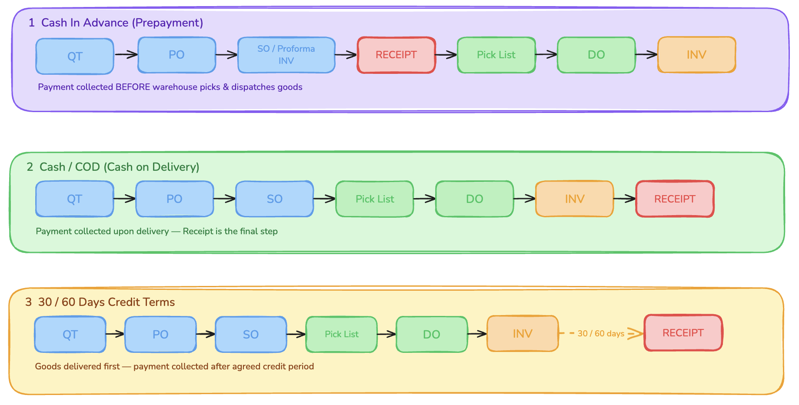{width="5.75in" height="2.90625in"}

**Notification for Role Configuration**

**A9. Customer Master Data**

**\[Customer List UBS.xlsx\]**

**A9.1 Required Fields --- Availability Summary**

The table below shows each field required for MAIA ingestion, its source column(s) in the dataset, and whether the data is present.

+:----------------------------------------------------------------------------------------------------------------+
| 🟢 **Available** = data is present in the source dataset                                                        |
|                                                                                                                 |
| 🔴 **Data Gap** = field is required for MAIA but absent from this dataset --- must be resolved before ingestion |
+-----------------------------------------------------------------------------------------------------------------+

  ------------ ---------------------- ----------------------------- ------------------- ---------------------------------------------
  \#           Required Field         MAIA Section                  Source Column(s)    Status

  1            Customer Code / ID     \-                            Cust.No.            Not required

  2            Company Name           Company Information           Name(1) + Name(2)   🟢 Available

  3            Contact Name           Primary Contact Information   Contact             🟢 Available --- partially populated

  4            Address Line 1         Primary Address Information   add1                🟢 Available --- some records blank

  5            Address Line 2         Primary Address Information   add2                🟢 Available --- some records blank

  6            Postal Code            Primary Address Information   add3 (extract)      🟢 Available --- requires extraction

  7            City / Town            Primary Address Information   add3 (extract)      🟢 Available --- requires extraction

  8            State                  Primary Address Information   add4 (extract)      🟢 Available --- requires extraction

  9            Country                Primary Address Information   add4 (derive)       🟢 Derivable --- \"Malaysia\" as default

  10           Phone                  Primary Contact Information   Phone               🟢 Available --- mixed formats, some empty

  11           Email                  Primary Contact Information   ---                 🔴 **NOT IN DATASET --- Data Gap**

  12           Default Payment Term   Company Information           Term                🟢 Available --- \~20--25% of records blank

  13           Credit Limit           ---                           ---                 🔴 **NOT IN DATASET --- Data Gap**
  ------------ ---------------------- ----------------------------- ------------------- ---------------------------------------------

  --------------------------------------------------------------------------------------------------------------------------------------------------------------------------------------------------------------------------------
  **Note --- Address Type:** MAIA supports separate Billing Address and Shipping Address. For this dataset, **billing address and shipping address are the same** --- use the same source address for both address type entries.

  --------------------------------------------------------------------------------------------------------------------------------------------------------------------------------------------------------------------------------

**A9.2 Field Descriptions**

Each field below follows the standard description format. This same format must be used for all future master data onboarding documents.

**~~4.1 Customer Code / ID~~**

  ---------------------- -------------------------------------------------------------------------------------------------------------------------------------------------------------------------------------------------------------------------------------------------------------------------------------------------
  Attribute              Detail

  **Field Name**         Customer Code / ID

  **Source Column**      Cust.No.

  **MAIA Field**         Customer Code / ID (system identifier)

  **Data Type**          String --- Alphanumeric

  **Description**        Acts as the primary key for the customer record. Every record must have a non-null, unique value in this field.

  **Format / Pattern**   3000/\[A--Z\]\[01--99\] for regular accounts; 3000/\[A--Z\]99 for placeholder or inactive accounts. The prefix 3000 is fixed across all records. The letter group loosely reflects the first letter of the company name at time of creation.

  **Example Values**     3000/A01, 3000/B03, 3000/C14, 3000/H99

  **Mandatory**          ✅ YES --- must not be null or duplicate

  **Ingestion Notes**    Confirm whether MAIA expects the full string (e.g. 3000/A01) or only the suffix. Records with suffix 99 (e.g. 3000/A99, 3000/G99) are likely placeholder or legacy entries --- confirm with business whether to include or exclude. Validate uniqueness. Strip any leading/trailing whitespace.
  ---------------------- -------------------------------------------------------------------------------------------------------------------------------------------------------------------------------------------------------------------------------------------------------------------------------------------------

**4.2 Company Name**

  ---------------------- ---------------------------------------------------------------------------------------------------------------------------------------------------------------------------------------------------------------------------------------------------------------------
  Attribute              Detail

  **Field Name**         Company Name

  **Source Columns**     Name(1) + Name(2)

  **MAIA Field**         Company Name (Company Information section)

  **Data Type**          String --- Text

  **Description**        The registered or trading name of the customer entity. Name(1) holds the primary company name. Name(2) is an overflow field used only when the full name is too long for Name(1) --- the vast majority of records have Name(2) blank.

  **Format / Pattern**   All uppercase text. Common Malaysian entity type suffixes: SDN BHD (private limited), BHD (public listed), PLT (limited liability partnership), ENT. / ENTERPRISE (sole prop or partnership), S/B (abbreviation of Sdn Bhd). One Singapore entity uses PTE LTD.

  **Example Values**     ACTION CATCHER SDN BHD, DAIBOCHI PLASTIC AND PACKAGING INDUSTRY BHD, BRYLCHEM PTE LTD

  **Mandatory**          ✅ YES --- Name(1) must not be null

  **Ingestion Notes**    Concatenate Name(1) and Name(2) with a single space when Name(2) is non-empty (e.g. Name(1) + \" \" + Name(2)). Trim trailing spaces and punctuation. Do not transform casing unless MAIA enforces a specific standard. Validate that no record has a null Name(1).
  ---------------------- ---------------------------------------------------------------------------------------------------------------------------------------------------------------------------------------------------------------------------------------------------------------------

**4.3 Contact Name**

  ---------------------- -----------------------------------------------------------------------------------------------------------------------------------------------------------------------------------------------------------------------------------------------------------------------------------------------------------------------------------------------------------------------------------
  Attribute              Detail

  **Field Name**         Contact Name

  **Source Column**      Contact

  **MAIA Field**         Contact Name (Primary Contact Information section)

  **Data Type**          String --- Text

  **Description**        The name of the primary contact person at the customer\'s organisation. This is the individual the sales or accounts team interacts with directly. The field may contain a first name only, a full name, or a name with a title/honorific prefix.

  **Format / Pattern**   Free-text, all uppercase. Common patterns observed: first name only (e.g. JASON, STELLA), full name (e.g. JANET TAN, FELIX LAI), title + name (e.g. MS CHONG, MR GOH, MS. FAN, MRS CHUAH), role code appended (e.g. SANAYA (AC) where AC = Accounts Contact, A/C = Accounts). Some records have no contact name populated.

  **Example Values**     JANET TAN, MR YEOH AH SOON, MS SHAMSINAR, SANAYA (AC), MS. FAN, ACCOUNTS PAYABL

  **Mandatory**          ⚠️ Recommended --- approximately 30--40% of records have no contact name

  **Ingestion Notes**    Strip role codes in parentheses (e.g. (AC), (A/C)) if MAIA Contact Name is a plain name field. Strip honorific prefixes (MR, MS, MRS, MS., MR.) if MAIA stores title separately. For records with ACCOUNTS PAYABL or similar department names in the contact field, treat these as functional contacts, not personal names --- flag for business review. Set to NULL where blank.
  ---------------------- -----------------------------------------------------------------------------------------------------------------------------------------------------------------------------------------------------------------------------------------------------------------------------------------------------------------------------------------------------------------------------------

  ---------------------------------------------------------------------------------------------------------------------------------------------------------------------------------------------------------------------------------------------------------
  **MAIA Address Behaviour:** MAIA supports separate Billing Address and Shipping Address entries. For this dataset, **billing and shipping use the same address**. The same source address fields should be mapped to both address type records in MAIA.

  ---------------------------------------------------------------------------------------------------------------------------------------------------------------------------------------------------------------------------------------------------------

The source dataset stores addresses across four line fields (add1--add4) plus one unlabelled pre-concatenated column. MAIA\'s Primary Address Information section uses structured fields. The mapping from source to MAIA is described below.

**Source → MAIA Address Field Mapping**

  -------------------- ------------------ -------------------------------------------------------------------------------------------------------------------------------------------------------------
  MAIA Field           Source Column(s)   Extraction Logic

  **Address Line 1**   add1               Use directly. Strip trailing comma and whitespace.

  **Address Line 2**   add2               Use directly. Strip trailing comma and whitespace.

  **Postal Code**      add3 or add4       Extract the first 5-digit numeric sequence. Pattern: \\b\\d{5}\\b. Example: from 47100 SELANGOR. → 47100.

  **City / Town**      add3 or add4       Extract text remaining after removing the postal code. Example: from 47100 SELANGOR. → SELANGOR (or cross-reference add4 for cleaner state vs. city split).

  **State**            add4               Use add4 as the state field after stripping trailing period. For records where add4 is blank, fall back to text after postal code in add3.

  **Country**          add4 (derived)     Default to Malaysia for all records. If add4 contains SINGAPORE or USA, override accordingly. One Singapore record confirmed in dataset.
  -------------------- ------------------ -------------------------------------------------------------------------------------------------------------------------------------------------------------

**Full Address Field Description**

  ---------------------- --------------------------------------------------------------------------------------------------------------------------------------------------------------------------------------------------------------------------------------------------------------------------------------------------------------------------------------------------------------------------------------------------------------------------------------------------------------------------------------------------------
  Attribute              Detail

  **Field Name**         Address

  **Source Columns**     add1, add2, add3, add4 (+ unlabelled column 9: pre-concatenated string)

  **MAIA Fields**        Address Line 1, Address Line 2, Postal Code, City / Town, State, Country (Primary Address Information section)

  **Data Type**          String --- Multi-line text (split into structured sub-fields for MAIA)

  **Description**        The physical or mailing address of the customer. Stored in four separate line fields in the source. The pre-concatenated column (column 9, no header in source) joins all four lines and is suitable for single-field reference, but the structured MAIA address fields require the lines to be parsed individually.

  **Format / Pattern**   Typical Malaysian industrial address structure: add1 = lot/unit and street name, add2 = industrial estate or area name, add3 = postcode + city or sub-area, add4 = state name. Address lines end with trailing commas or periods as a UBS export artefact.

  **Example Values**     add1: NO.1, JALAN TPP 6/11, TAMAN PERIND. PUCHONG, · add2: SEKSYEN 6, PUCHONG, · add3: 47100 SELANGOR. · add4: (blank or state name)

  **Mandatory**          ⚠️ Address Line 1, Country, State, City / Town, Postal Code are marked required in MAIA. Approximately 5% of records have all address fields blank.

  **Ingestion Notes**    Strip trailing commas, periods, and extra whitespace from each line before mapping. Validate that extracted postal codes are exactly 5 numeric digits (Malaysian standard). For international records (Singapore, USA), override Country and adjust address parsing accordingly. Records with all address fields blank must be flagged for manual remediation --- do not ingest with null required address fields if MAIA enforces them. Use the pre-concatenated column only as a fallback reference.
  ---------------------- --------------------------------------------------------------------------------------------------------------------------------------------------------------------------------------------------------------------------------------------------------------------------------------------------------------------------------------------------------------------------------------------------------------------------------------------------------------------------------------------------------

**4.4 Address**

  ---------------------------------------------------------------------------------------------------------------------------------------------------------------------------------------------------------------------------------------------------------
  **MAIA Address Behaviour:** MAIA supports separate Billing Address and Shipping Address entries. For this dataset, **billing and shipping use the same address**. The same source address fields should be mapped to both address type records in MAIA.

  ---------------------------------------------------------------------------------------------------------------------------------------------------------------------------------------------------------------------------------------------------------

The source dataset stores addresses across four named line fields (add1--add4) plus **one unlabelled pre-concatenated column (column 9, no header)**. MAIA\'s Primary Address Information section requires structured fields.

**⚠️ Known Data Issue --- Inconsistent Postcode Position in add3 / add4**

Analysis of all 316 records in the dataset reveals that the 5-digit postcode does **not** sit in a fixed column:

  ------------------------------------- --------------- --------------- ---------------------------------------------------
  Scenario                              Record Count    \% of Total     Example

  Postcode found in add3                144             \~46%           add3: 41000 KLANG, · add4: SELANGOR DARUL EHSAN.

  Postcode found in add4                153             \~48%           add3: SEKSYEN 6, PUCHONG, · add4: 47100 SELANGOR.

  Postcode in neither (blank records)   19              \~6%            Both add3 and add4 are empty

  Postcode in both                      1               \<1%            Multi-address entry with two postcodes
  ------------------------------------- --------------- --------------- ---------------------------------------------------

Because the postcode position is effectively a **50/50 split** across add3 and add4, neither column can be treated as a reliable extraction source individually. Attempting to parse from add3 alone would miss \~48% of records, and vice versa.

**Recommended approach:** Use the **unnamed column 9 (full pre-concatenated address string)** as the single source for extracting Postal Code, City/Town, and State. This column contains the complete address as one string regardless of how UBS distributed it across the four line fields. Apply a regex search across the whole string to locate the 5-digit postcode, then derive City/Town and State from their position relative to the postcode.

add1 and add2 remain the direct source for Address Line 1 and Address Line 2 respectively, as their content is consistent across all records.

**Source → MAIA Address Field Mapping**

  -------------------- ------------------------------------- ---------------------------------------------------------------------------------------------------------------------------------------------------------------------------
  MAIA Field           Recommended Source                    Extraction Logic

  **Address Line 1**   add1                                  Use directly. Strip trailing comma and whitespace.

  **Address Line 2**   add2                                  Use directly. Strip trailing comma and whitespace.

  **Postal Code**      Unnamed col 9 (full address string)   Regex: find first occurrence of \\b\\d{5}\\b in the full string. Malaysian postcodes are always exactly 5 digits. Singapore postcodes are 6 digits --- handle separately.

  **City / Town**      Unnamed col 9 (full address string)   Extract the text segment immediately following the postal code match, up to the next comma or period. Strip and trim.

  **State**            Unnamed col 9 (full address string)   Extract the last meaningful text segment before the country indicator (or end of string). Cross-validate against known Malaysian state names for confidence.

  **Country**          Unnamed col 9 (full address string)   Default to Malaysia. Override to Singapore if the string contains SINGAPORE. Override to other countries if detected (one USA record: OH 44131, USA).
  -------------------- ------------------------------------- ---------------------------------------------------------------------------------------------------------------------------------------------------------------------------

  --------------------------------------------------------------------------------------------------------------------------------------------------------------------------------------------------------------------------
  **Do not use add3 or add4 directly** for Postal Code, City/Town, or State extraction --- the \~50/50 split in postcode position across these two columns makes them individually unreliable as structured source fields.

  --------------------------------------------------------------------------------------------------------------------------------------------------------------------------------------------------------------------------

**Full Address Field Description**

  ---------------------- ---------------------------------------------------------------------------------------------------------------------------------------------------------------------------------------------------------------------------------------------------------------------------------------------------------------------------------------------------------------------------------------------------------------------------------------------------------------------------------------
  Attribute              Detail

  **Field Name**         Address

  **Source Columns**     add1 (Address Line 1), add2 (Address Line 2), unnamed col 9 (full address --- for Postal Code / City / State / Country extraction). add3 and add4 are **not used directly** due to inconsistent postcode positioning.

  **MAIA Fields**        Address Line 1, Address Line 2, Postal Code, City / Town, State, Country (Primary Address Information section)

  **Data Type**          String --- Multi-line text (split into structured sub-fields for MAIA)

  **Description**        The physical or mailing address of the customer. The UBS system distributes the address across four line fields, but the split between add3 and add4 is not consistent --- the postcode appears in add3 for roughly half of all records and in add4 for the other half. The unnamed concatenated column (col 9) combines all four lines into a single reliable string and is therefore the recommended extraction source for all sub-fields except Address Line 1 and Address Line 2.

  **Format / Pattern**   Full address string is a comma-separated concatenation of add1 through add4. Malaysian postcodes are 5-digit numeric (e.g. 47100). State names appear after the postcode (e.g. SELANGOR, JOHOR, PENANG). Lines end with trailing commas or periods as a UBS export artefact --- strip before use.

  **Example Values**     Full string: NO.1, JALAN TPP 6/11, TAMAN PERIND. PUCHONG, SEKSYEN 6, PUCHONG, 47100 SELANGOR. → Postal Code: 47100 · State: SELANGOR · Address Line 1: NO.1, JALAN TPP 6/11, TAMAN PERIND. PUCHONG

  **Mandatory**          ⚠️ Address Line 1, Country, State, City / Town, Postal Code are marked required in MAIA. \~6% of records (19 records) have all address fields blank.

  **Ingestion Notes**    Strip trailing commas, periods, and extra whitespace from all extracted values. Validate extracted postcode is exactly 5 digits for Malaysian records (6 digits for Singapore). For international records, override Country and adjust state/city extraction logic. Records with a fully blank address must be flagged for manual remediation --- do not ingest with null required address fields if MAIA enforces them.
  ---------------------- ---------------------------------------------------------------------------------------------------------------------------------------------------------------------------------------------------------------------------------------------------------------------------------------------------------------------------------------------------------------------------------------------------------------------------------------------------------------------------------------

**4.5 Phone**

  ---------------------- ---------------------------------------------------------------------------------------------------------------------------------------------------------------------------------------------------------------------------------------------------------------------------------------------------------------------------------------------------------------------------------------------------------------------------------------------------------------------------------
  Attribute              Detail

  **Field Name**         Phone

  **Source Column**      Phone

  **MAIA Field**         Phone (Primary Contact Information section --- displayed with country code prefix +60)

  **Data Type**          String --- Numeric / Mixed format

  **Description**        The primary contact telephone number for the customer. This may be a fixed-line office number or a mobile number. The dataset also contains a separate Fax column which is distinct and not mapped here.

  **Format / Pattern**   Multiple formats present in the dataset: international without + (e.g. 60380614451), local landline (e.g. 03-8061 4436), local mobile (e.g. 019-322 2853, 012-662 7559), E.164-style mobile (e.g. 60127980823), composite multi-number (e.g. 03-5161 5152/4079/4349). Some records have no phone number.

  **Example Values**     60380614451, 03-8061 4436, 019-322 2853, 60127980823, 03-5004 / 5189 Ivy

  **Mandatory**          ✅ YES --- marked required in MAIA

  **Ingestion Notes**    Normalise all numbers to E.164 format (+60XXXXXXXXX for Malaysia) before ingestion --- strip hyphens, spaces, and formatting characters, then prepend +60 if not already present. For composite entries with multiple numbers separated by / or ,, extract only the first number unless MAIA supports secondary phone fields. Some phone fields contain person names appended (e.g. 5189 Ivy) --- strip any non-numeric suffix. Set to NULL where blank and flag for follow-up.
  ---------------------- ---------------------------------------------------------------------------------------------------------------------------------------------------------------------------------------------------------------------------------------------------------------------------------------------------------------------------------------------------------------------------------------------------------------------------------------------------------------------------------

**4.6 Email (currently not using)**

  ------------------------------------------------------------------------------------------------------------------------------------------------------------------------------------------------------------------------------
  ⚠️ **DATA GAP --- Email is NOT present in this dataset.** This field is marked as required (\*) in MAIA\'s Primary Contact Information section. It must be sourced from a supplementary system before ingestion can proceed.

  ------------------------------------------------------------------------------------------------------------------------------------------------------------------------------------------------------------------------------

  ---------------------- --------------------------------------------------------------------------------------------------------------------------------------------------------------------------------------------------------------------------------------------------------------------------------------------------------------------
  Attribute              Detail

  **Field Name**         Email

  **Source Column**      **NOT AVAILABLE** in current dataset

  **MAIA Field**         Email (Primary Contact Information section --- marked required \*)

  **Data Type**          String --- Email address

  **Description**        The primary email address for the customer account. Used for order confirmations, invoices, and electronic communications. This field is entirely absent from the UBS Customers Listing export.

  **Format / Pattern**   Standard email format: localpart@domain.tld. Example: accounts@company.com.my

  **Example Values**     N/A --- field absent from source

  **Mandatory**          ✅ YES --- required in MAIA

  **Action Required**    Obtain email addresses from CRM, sales team records, or a separate customer contact export. Validate format (must contain @ and a valid domain). If unavailable, set to NULL and implement a post-ingestion remediation workflow. Do not ingest if MAIA enforces this as a hard-required field without a fallback.
  ---------------------- --------------------------------------------------------------------------------------------------------------------------------------------------------------------------------------------------------------------------------------------------------------------------------------------------------------------

**4.7 Default Payment Term**

  ---------------------- -------------------------------------------------------------------------------------------------------------------------------------------------------------------------------------------------------------------------------------------------------------------
  Attribute              Detail

  **Field Name**         Default Payment Term

  **Source Column**      Term

  **MAIA Field**         Default Payment Term (Company Information section)

  **Data Type**          String --- Enumerated / Controlled vocabulary

  **Description**        The agreed payment terms for the customer account. Defines how many days after invoice date the customer is expected to make payment, or whether the transaction requires upfront or on-delivery payment. Critical for accounts receivable and credit management.

  **Format / Pattern**   Enumerated values observed in the dataset:
  ---------------------- -------------------------------------------------------------------------------------------------------------------------------------------------------------------------------------------------------------------------------------------------------------------

  ------------------ ----------------------------------------------------------------------------
  Value in Source    Meaning

  30 DAYS            Net 30 --- payment due 30 days from invoice date

  60 DAYS            Net 60 --- payment due 60 days from invoice date

  75 DAYS            Net 75 --- payment due 75 days from invoice date

  CASH               Cash payment --- exact sub-type (CBD or COD) to be confirmed with Finance

  CBD                Cash Before Delivery --- full payment required before goods are dispatched

  C.O.D              Cash on Delivery --- payment collected at point of delivery
  ------------------ ----------------------------------------------------------------------------

\| *(blank)* \| Not yet assigned --- approximately 20--25% of records \|

  --------------------- ---------------------------------------------------------------------------------------------------------------------------------------------------------------------------------------------------------------------------------------------------------------------------------------------------------------------------------------------------------------------
  Attribute             Detail

  **Example Values**    60 DAYS, 30 DAYS, CASH, CBD, C.O.D, 75 DAYS

  **Mandatory**         ✅ YES --- for MAIA; note that \~20--25% of source records have blank Term

  **Ingestion Notes**   Confirm the MAIA code or dropdown value that corresponds to each source term (e.g. 60 DAYS may map to a MAIA code such as N60). Treat blank values as NULL --- do not default to any term without business sign-off. Clarify the distinction between CASH, CBD, and C.O.D with the Finance team before finalising mapping, as they carry different AR implications.
  --------------------- ---------------------------------------------------------------------------------------------------------------------------------------------------------------------------------------------------------------------------------------------------------------------------------------------------------------------------------------------------------------------

**4.8 Credit Limit (Missing)**

  ----------------------------------------------------------------------------------------------------------------------------------------------
  ⚠️ **DATA GAP --- Credit Limit is NOT present in this dataset.** This field must be sourced from the finance or ERP system before ingestion.

  ----------------------------------------------------------------------------------------------------------------------------------------------

  ---------------------- ------------------------------------------------------------------------------------------------------------------------------------------------------------------------------------------------------------------------------------------------------------------------------------------------------------------------------------------------------
  Attribute              Detail

  **Field Name**         Credit Limit

  **Source Column**      **NOT AVAILABLE** in current dataset

  **MAIA Field**         Credit Limit (to be confirmed from MAIA field reference)

  **Data Type**          Numeric --- Currency (MYR, or as configured in MAIA)

  **Description**        The maximum outstanding credit amount permitted for the customer before orders are placed on hold. Managed by the Finance / Credit Control team. Absent from the UBS Customers Listing report.

  **Format / Pattern**   Positive numeric value with two decimal places. Example: 10000.00, 50000.00, 0.00 (cash customers with no credit facility)

  **Example Values**     N/A --- field absent from source

  **Mandatory**          ✅ YES --- required for MAIA

  **Action Required**    Source credit limit values from ERP or internal finance records. For customers with CASH, CBD, or C.O.D payment terms, set Credit Limit to 0.00 after Finance confirmation. For accounts with no credit data available, set to NULL or 0.00 and flag for Finance team review post-ingestion. Do not default all records to a single arbitrary value.
  ---------------------- ------------------------------------------------------------------------------------------------------------------------------------------------------------------------------------------------------------------------------------------------------------------------------------------------------------------------------------------------------

**A9.3 Additional Fields in Dataset (Not in Required List)**

The source dataset contains four columns that are not in the current required ingestion list. They are documented here for completeness. Confirm with the business whether any should be added to the MAIA ingestion scope.

  --------------- ----------------- --------------- ---------------------------------------------------------------------------------------------------------------------------------------------------------------------------------------------------------------------------------------
  Source Column   Field Label       Data Type       Description

  Fax             Fax Number        String          Fax number for the customer. Format mirrors the Phone field (local and international formats mixed). Many records have no fax number. Low priority for ingestion unless a MAIA fax field is confirmed.

  Area            Sales Territory   String          Internal sales region code. Observed values: CENTRAL, CENTRAL (N), CENTRAL (S), NORTH, SOUTH, KA. Used for routing to the correct sales team. May map to MAIA\'s **Territory** field in Company Information if values can be aligned.

  Agent           Sales Agent       String          Assigned sales agent or account owner. Predominantly blank in the current dataset. May map to MAIA\'s **Account Manager** field if populated.
  --------------- ----------------- --------------- ---------------------------------------------------------------------------------------------------------------------------------------------------------------------------------------------------------------------------------------

**Credit Control**

Block sales if overdue

If No Provide prompt/warning

**Payment Terms**

Cash Before Delivery

Cash

30 Days

60 Days

**A10. Item & Inventory Setup**

**\[Product List - Holsen.xlsx - Sheet1.csv\]**

**Item Taxonomy**

**\[holsen_product_taxonomy_final (1) (1) (1).yaml\]**

**Item Attributes**

Inventory

**\[Inventory - Mindhive - Copy (1).xlsm\]**

Product List

**\[Product List - Holsen (1).xlsx\]**

**Pricing**

Raw file in pdf

**\[Price List Holsen.pdf\]**

Customer Price list in csv

**\[Price List Holsen.csv\]**

1\. **Data Source Overview**

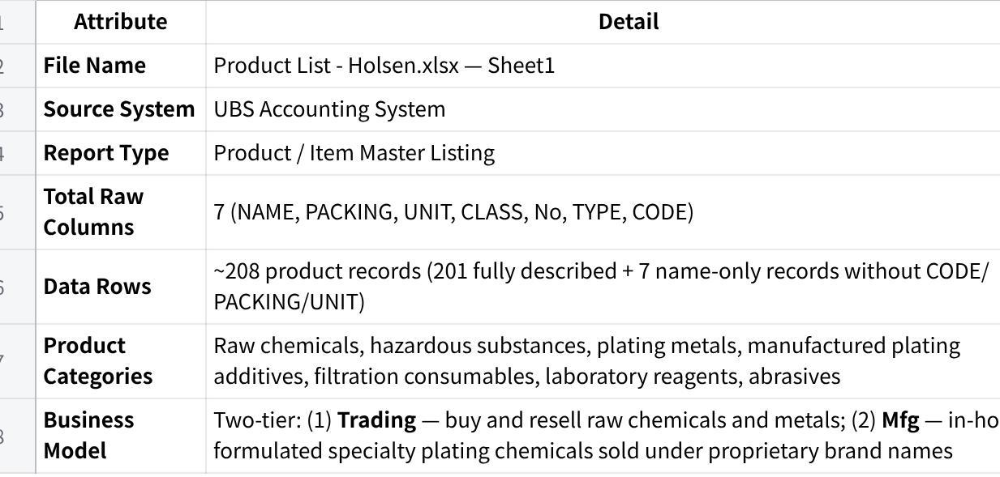

**点击图片可查看完整电子表格**

2\. **MAIA Field Mapping --- Availability Summary**

The table below shows each MAIA product field, the source column it maps from, and whether the data is ready for ingestion.

  ----------------------------------------------------------------------------------------------------------------------------------------------------------------------------------------------------------------------------------------------------------------------------------------------------------------------------------------------------------------------------
  🟢 **Available** = data is present and can be mapped directly ⚠️ **Available with caveats** = data is present but requires transformation or judgement before ingestion 🔵 **Derived** = no source column --- value is a fixed constant applied to all records 🔴 **Data Gap** = field required by MAIA but absent from this dataset --- must be resolved before ingestion

  ----------------------------------------------------------------------------------------------------------------------------------------------------------------------------------------------------------------------------------------------------------------------------------------------------------------------------------------------------------------------------

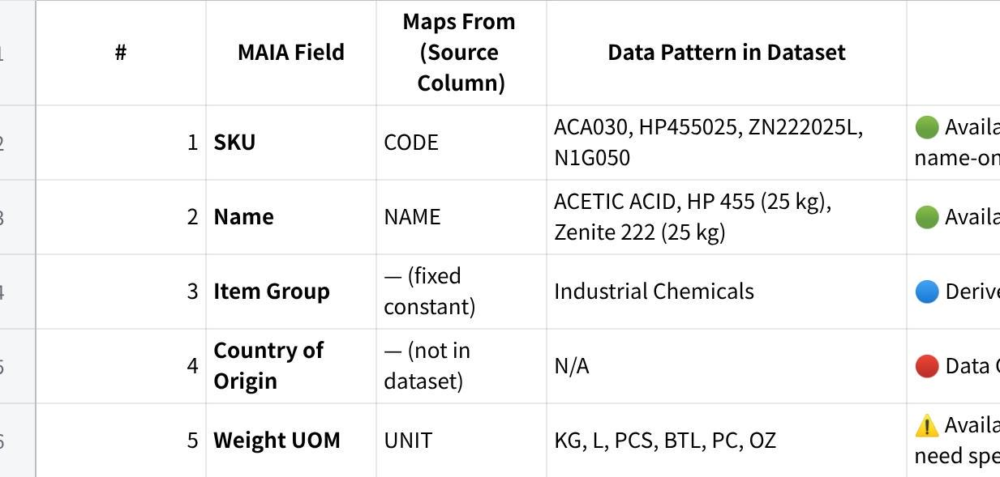

**点击图片可查看完整电子表格**

  ------------------------------------------------------------------------------------------------------------------------------------------------------------------------------------------------------------------------------------------------------------------------------------------------------------------------------------------
  **Note on 7 name-only records:** Purifier ZP, HP 488/49, Ekozin 511A, Ekozin 511CT, Ekozin 511B, Wetter B-10, QENT 318B --- these appear at the bottom of the dataset with a name and unit price only. SKU, PACKING, and UNIT are all absent. These records must have SKUs assigned and weight data sourced separately before ingestion.

  ------------------------------------------------------------------------------------------------------------------------------------------------------------------------------------------------------------------------------------------------------------------------------------------------------------------------------------------

3\. **Field Descriptions**

Each field below follows the standard description format. This same format must be used for all future master data onboarding documents.

**4.1 Product Code / SKU**

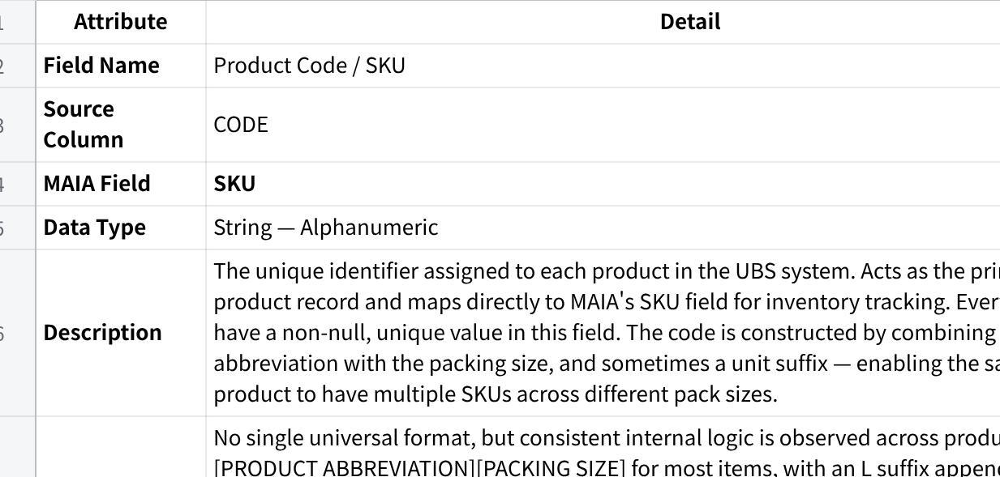

**点击图片可查看完整电子表格**

**4.2 Product Name**

+:----------------------+:--------------------------------------------------------------------------------------------------------------------------------------------------------------------------------------------------------------------------------------------------------------------------------------------------------------------------------------------------------------------------------------------------------------------------------------------------------------------------------------------------------------------------------------------------------------------------------------------------------------------------------------------------------------------------------------------------------------------------------------------------------------------------------------------------------------------------------------------------------------------------------------------------------------------------------------------------------------------------------------------------------------------------------------------------------------------------------------------------------------+
| Attribute             | Detail                                                                                                                                                                                                                                                                                                                                                                                                                                                                                                                                                                                                                                                                                                                                                                                                                                                                                                                                                                                                                                                                                                        |
+-----------------------+---------------------------------------------------------------------------------------------------------------------------------------------------------------------------------------------------------------------------------------------------------------------------------------------------------------------------------------------------------------------------------------------------------------------------------------------------------------------------------------------------------------------------------------------------------------------------------------------------------------------------------------------------------------------------------------------------------------------------------------------------------------------------------------------------------------------------------------------------------------------------------------------------------------------------------------------------------------------------------------------------------------------------------------------------------------------------------------------------------------+
| **Field Name**        | Product Name                                                                                                                                                                                                                                                                                                                                                                                                                                                                                                                                                                                                                                                                                                                                                                                                                                                                                                                                                                                                                                                                                                  |
+-----------------------+---------------------------------------------------------------------------------------------------------------------------------------------------------------------------------------------------------------------------------------------------------------------------------------------------------------------------------------------------------------------------------------------------------------------------------------------------------------------------------------------------------------------------------------------------------------------------------------------------------------------------------------------------------------------------------------------------------------------------------------------------------------------------------------------------------------------------------------------------------------------------------------------------------------------------------------------------------------------------------------------------------------------------------------------------------------------------------------------------------------+
| **Source Column**     | NAME                                                                                                                                                                                                                                                                                                                                                                                                                                                                                                                                                                                                                                                                                                                                                                                                                                                                                                                                                                                                                                                                                                          |
+-----------------------+---------------------------------------------------------------------------------------------------------------------------------------------------------------------------------------------------------------------------------------------------------------------------------------------------------------------------------------------------------------------------------------------------------------------------------------------------------------------------------------------------------------------------------------------------------------------------------------------------------------------------------------------------------------------------------------------------------------------------------------------------------------------------------------------------------------------------------------------------------------------------------------------------------------------------------------------------------------------------------------------------------------------------------------------------------------------------------------------------------------+
| **MAIA Field**        | Name                                                                                                                                                                                                                                                                                                                                                                                                                                                                                                                                                                                                                                                                                                                                                                                                                                                                                                                                                                                                                                                                                                          |
+-----------------------+---------------------------------------------------------------------------------------------------------------------------------------------------------------------------------------------------------------------------------------------------------------------------------------------------------------------------------------------------------------------------------------------------------------------------------------------------------------------------------------------------------------------------------------------------------------------------------------------------------------------------------------------------------------------------------------------------------------------------------------------------------------------------------------------------------------------------------------------------------------------------------------------------------------------------------------------------------------------------------------------------------------------------------------------------------------------------------------------------------------+
| **Data Type**         | String --- Text                                                                                                                                                                                                                                                                                                                                                                                                                                                                                                                                                                                                                                                                                                                                                                                                                                                                                                                                                                                                                                                                                               |
+-----------------------+---------------------------------------------------------------------------------------------------------------------------------------------------------------------------------------------------------------------------------------------------------------------------------------------------------------------------------------------------------------------------------------------------------------------------------------------------------------------------------------------------------------------------------------------------------------------------------------------------------------------------------------------------------------------------------------------------------------------------------------------------------------------------------------------------------------------------------------------------------------------------------------------------------------------------------------------------------------------------------------------------------------------------------------------------------------------------------------------------------------+
| **Mandatory**         | ✅ YES --- must not be null                                                                                                                                                                                                                                                                                                                                                                                                                                                                                                                                                                                                                                                                                                                                                                                                                                                                                                                                                                                                                                                                                   |
+-----------------------+---------------------------------------------------------------------------------------------------------------------------------------------------------------------------------------------------------------------------------------------------------------------------------------------------------------------------------------------------------------------------------------------------------------------------------------------------------------------------------------------------------------------------------------------------------------------------------------------------------------------------------------------------------------------------------------------------------------------------------------------------------------------------------------------------------------------------------------------------------------------------------------------------------------------------------------------------------------------------------------------------------------------------------------------------------------------------------------------------------------+
| **Description**       | The full descriptive name of the product as recorded in UBS. Maps to MAIA\'s Name field --- the human-readable product title displayed throughout the system. For traded raw chemicals and metals, names follow IUPAC chemical nomenclature and may include the supplier or country of origin (e.g. NICKEL SULPHATE SUMITOMO, POTASSIUM CYANIDE JAPAN). For manufactured products, names are proprietary brand names assigned by Holsen (e.g. Zenite 222, Niklite 798M, Zepro 220A). Some names embed pack size or specification directly in the name itself (e.g. HP 455 (200 kg), PRIMARY NICKEL NIKKELVERK 1X1 CUT CATHODES - 50).                                                                                                                                                                                                                                                                                                                                                                                                                                                                         |
+-----------------------+---------------------------------------------------------------------------------------------------------------------------------------------------------------------------------------------------------------------------------------------------------------------------------------------------------------------------------------------------------------------------------------------------------------------------------------------------------------------------------------------------------------------------------------------------------------------------------------------------------------------------------------------------------------------------------------------------------------------------------------------------------------------------------------------------------------------------------------------------------------------------------------------------------------------------------------------------------------------------------------------------------------------------------------------------------------------------------------------------------------+
| **Format / Pattern**  | Two capitalisation conventions are present:                                                                                                                                                                                                                                                                                                                                                                                                                                                                                                                                                                                                                                                                                                                                                                                                                                                                                                                                                                                                                                                                   |
|                       |                                                                                                                                                                                                                                                                                                                                                                                                                                                                                                                                                                                                                                                                                                                                                                                                                                                                                                                                                                                                                                                                                                               |
|                       | • **ALL UPPERCASE** --- used exclusively for Trading products (raw chemicals and metals) • **Title Case / Mixed Case** --- used exclusively for Mfg (manufactured) products                                                                                                                                                                                                                                                                                                                                                                                                                                                                                                                                                                                                                                                                                                                                                                                                                                                                                                                                   |
|                       |                                                                                                                                                                                                                                                                                                                                                                                                                                                                                                                                                                                                                                                                                                                                                                                                                                                                                                                                                                                                                                                                                                               |
|                       | • The casing difference is consistent and can serve as a secondary signal for product type, though TYPE and No are the authoritative fields for classification                                                                                                                                                                                                                                                                                                                                                                                                                                                                                                                                                                                                                                                                                                                                                                                                                                                                                                                                                |
|                       |                                                                                                                                                                                                                                                                                                                                                                                                                                                                                                                                                                                                                                                                                                                                                                                                                                                                                                                                                                                                                                                                                                               |
|                       | • Some names include parenthetical pack size qualifiers (e.g. (25 kg), (200 kg), (200L)) --- these are descriptive suffixes in UBS, not part of the canonical product name                                                                                                                                                                                                                                                                                                                                                                                                                                                                                                                                                                                                                                                                                                                                                                                                                                                                                                                                    |
+-----------------------+---------------------------------------------------------------------------------------------------------------------------------------------------------------------------------------------------------------------------------------------------------------------------------------------------------------------------------------------------------------------------------------------------------------------------------------------------------------------------------------------------------------------------------------------------------------------------------------------------------------------------------------------------------------------------------------------------------------------------------------------------------------------------------------------------------------------------------------------------------------------------------------------------------------------------------------------------------------------------------------------------------------------------------------------------------------------------------------------------------------+
| **Example Values**    | ACETIC ACID, SULPHURIC ACID 98%, Niklite 798M/ 888MP, Zenite 555XT (200 kg), NICKEL SULPHATE NORILSK EN GRADE, HP 455 (25 kg)                                                                                                                                                                                                                                                                                                                                                                                                                                                                                                                                                                                                                                                                                                                                                                                                                                                                                                                                                                                 |
+-----------------------+---------------------------------------------------------------------------------------------------------------------------------------------------------------------------------------------------------------------------------------------------------------------------------------------------------------------------------------------------------------------------------------------------------------------------------------------------------------------------------------------------------------------------------------------------------------------------------------------------------------------------------------------------------------------------------------------------------------------------------------------------------------------------------------------------------------------------------------------------------------------------------------------------------------------------------------------------------------------------------------------------------------------------------------------------------------------------------------------------------------+
| **Ingestion Actions** | • **Name → MAIA Name**: Ingest the product name as-is from the NAME source column into the MAIA Name field. Do not transform casing --- the uppercase/title-case distinction carries business meaning (Trading vs Mfg). Validate that no record has a null Name. • **Country of Origin → MAIA Country of Origin**: Where the product name contains a country of origin (e.g. JAPAN, KOREA, CZECH in POTASSIUM CYANIDE JAPAN, SODIUM CYANIDE KOREA, POTASSIUM CYANIDE DRASLOVKA (CZECH)), extract that country value and ingest it into the MAIA Country of Origin field. • **Brand → MAIA Brand**: Where the product name contains a supplier or brand name (e.g. SUMITOMO, NORILSK, NIKKELVERK, UMICORE, LUVATA, BROCHEM, ELEMENTIS), extract that brand value and ingest it into the MAIA Brand field. • **Pack size qualifiers**: If MAIA requires a clean canonical product name, strip parenthetical pack size suffixes (e.g. (25 kg), (200L), - 50) before ingestion --- the weight is already captured in Weight per Unit and Weight UOM. Confirm this requirement with the MAIA team before applying. |
+-----------------------+---------------------------------------------------------------------------------------------------------------------------------------------------------------------------------------------------------------------------------------------------------------------------------------------------------------------------------------------------------------------------------------------------------------------------------------------------------------------------------------------------------------------------------------------------------------------------------------------------------------------------------------------------------------------------------------------------------------------------------------------------------------------------------------------------------------------------------------------------------------------------------------------------------------------------------------------------------------------------------------------------------------------------------------------------------------------------------------------------------------+

**4.3 Pack Size / Weight per Unit (kg)**

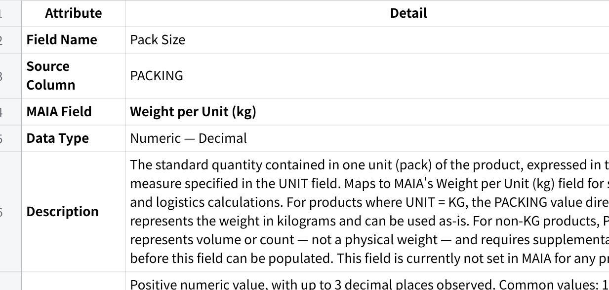

**点击图片可查看完整电子表格**

**4.4 Unit of Measure / Weight UOM**

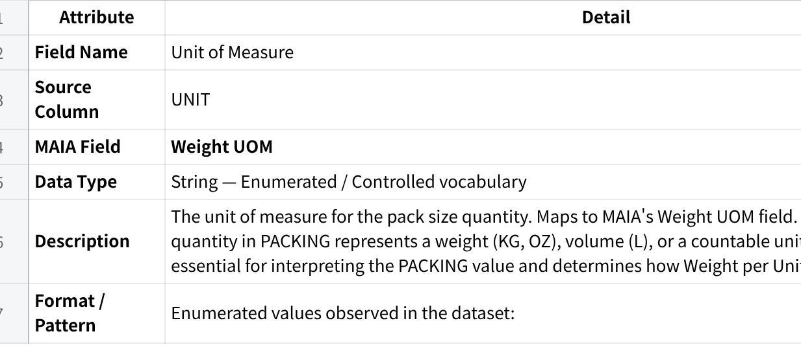

**点击图片可查看完整电子表格**

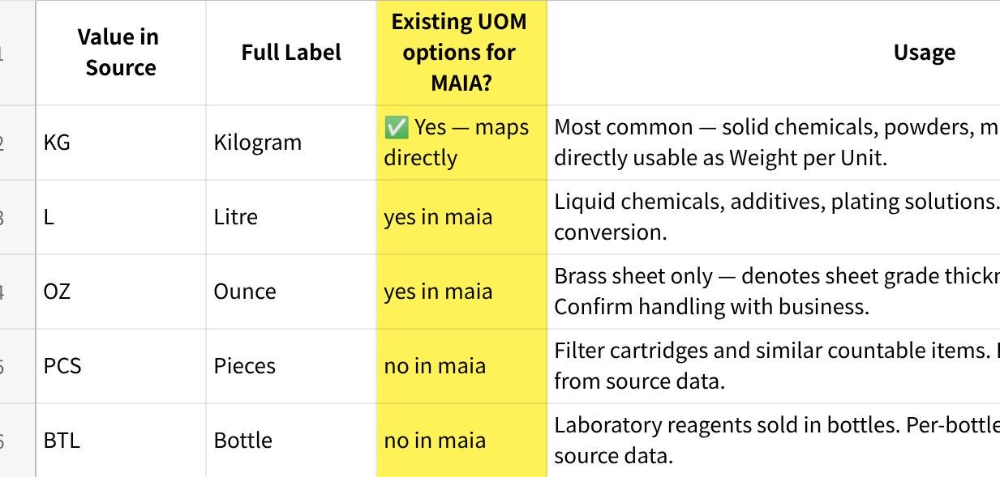

**点击图片可查看完整电子表格**

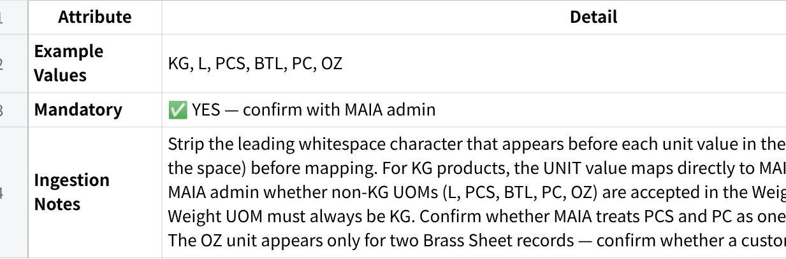

**点击图片可查看完整电子表格**

**4.5 Product Class / Category**

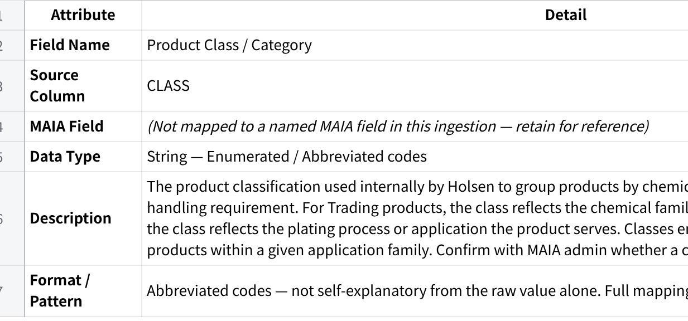

**点击图片可查看完整电子表格**

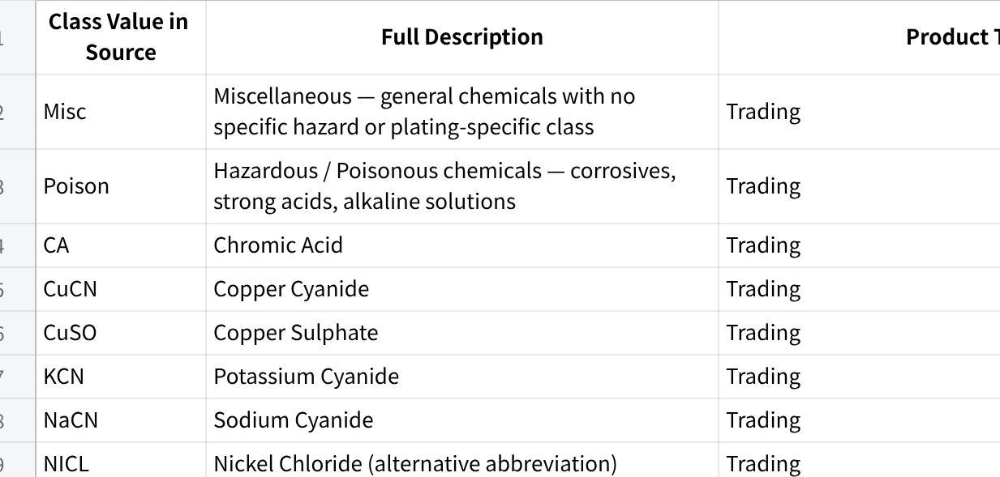

**点击图片可查看完整电子表格**

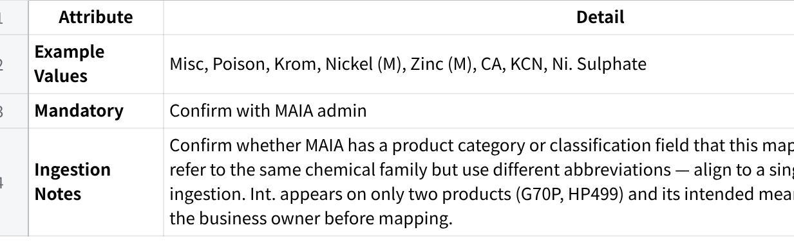

**点击图片可查看完整电子表格**

**4.7 Product Type**

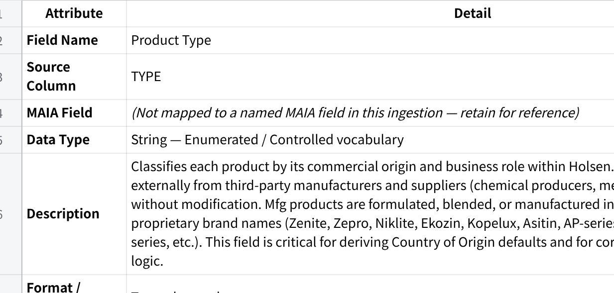

**点击图片可查看完整电子表格**

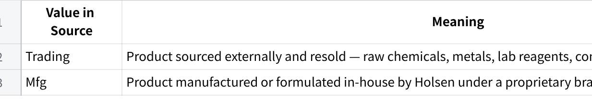

**点击图片可查看完整电子表格**

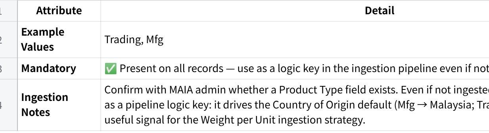

**点击图片可查看完整电子表格**

**Decision / Suggestion: (Jia Hau take note for item description)**

• Embed TYPE and CLASS together into MAIA\'s **Item Description** field --- no dedicated MAIA field exists for either.\
• Proposed format: Type: Trading \| Class: Poison or Type: Mfg \| Class: Zinc (M) --- consistent across all records.\
• Format is human-readable in MAIA and parseable programmatically if Item Description is searchable.\
• Confirm Item Description character limit with MAIA admin before finalising.\
• This decision applies equally to Section 4.5 (Product Class / Category).

**4.8 Item Group *(MAIA field --- industrial chemicals)***

  --------------------------------------------------------------------------------------------------------------------------
  🔵 This field has no corresponding source column in UBS. The value is a fixed constant applied uniformly to all records.

  --------------------------------------------------------------------------------------------------------------------------

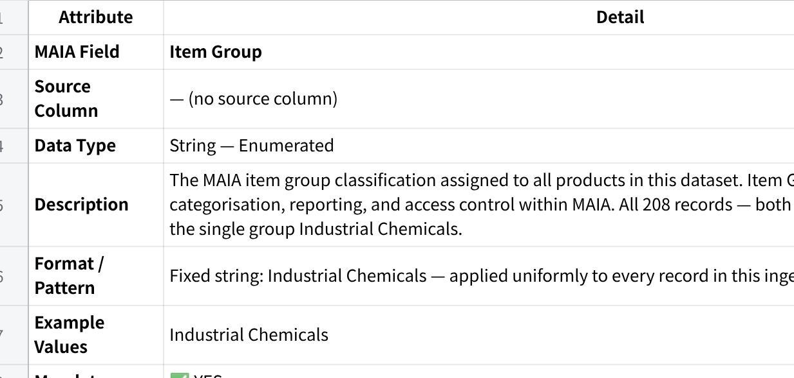

**点击图片可查看完整电子表格**

**4.9 Country of Origin *(MAIA field --- data gap)***

  ---------------------------------------------------------------------------------------------------------------------------------------------------------------------------------------
  🔴 **DATA GAP --- Country of Origin is NOT present in this dataset.** Confirm whether MAIA enforces this as a required field. If so, it must be sourced before ingestion can proceed.

  ---------------------------------------------------------------------------------------------------------------------------------------------------------------------------------------

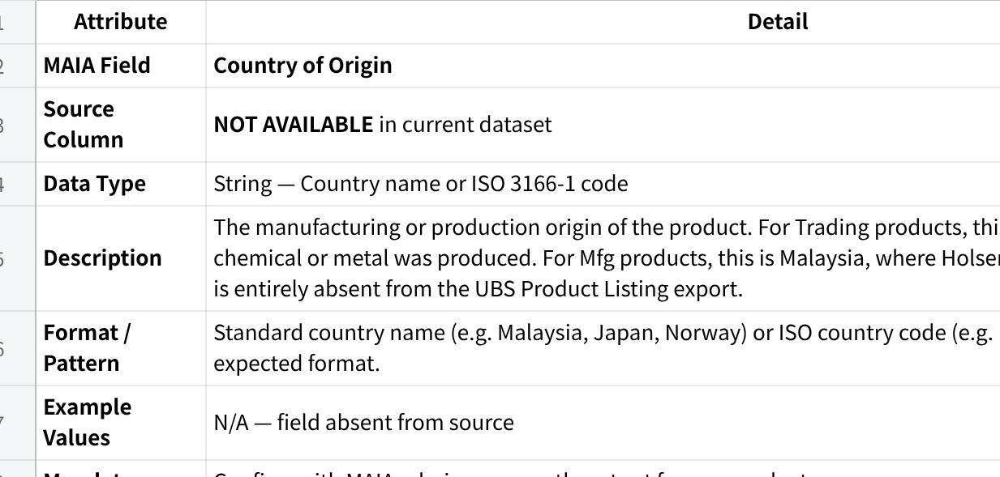

**点击图片可查看完整电子表格**

**~~4.6 Type Code~~**

**~~Bundles (Not applicable)~~**

Bundle Name

Included Items & Quantities

(upload Bundle csv here)

**A11. Selling Module -- Core Rules**

**Credit & Payment Enforcement**

Credit terms enforcement - **Yes**

Overdue blocking rules

Block sales if overdue

If No Provide prompt/warning

**A12. Phone number, Server hosting WABA & open AI api key**

**Phone number**

  --------------------------------------------------------------
  Plain Text\
  0196175122

  --------------------------------------------------------------

**Open AI : API key**

  --------------------------------------------------------------
  Plain Text

  --------------------------------------------------------------

**WABA: API Key (for chatwoot setup)**

  --------------------------------------------------------------
  Plain Text\
  0196175122 - phone number\
  HolsenAI26 - password\
  HISB- **Your business and account name**\
  holseninterchem@gmail.com - business email address

  --------------------------------------------------------------

**AWS Hosting**

+:-------------------------------------------------------------+
| holseninterchem@gmail.com                                    |
|                                                              |
| holseninterchem@gmail.com                                    |
|                                                              |
| Hisbai26#                                                    |
+--------------------------------------------------------------+

**Section B --- Secondary Setup (Optimisation & Enhancements)**

  ------------------------------------------------------------------------------------------------------------------
  These items improve automation, accuracy, and customer experience but are **not mandatory for initial go-live**.

  ------------------------------------------------------------------------------------------------------------------

**B1. Customer-Specific Pricing**

Customer List

Customer Specific Pricing

**\[Price List Holsen.pdf\]**

**B2. Customer-Specific Items**

**\[Price List Holsen.pdf\]**

**\[Price List (30.01.26).xlsx\]**

**\[Price List Holsen.csv\]**

**B3. Payment Methods**

Cash

Bank Transfer

**B4. Delivery & Fulfilment Methods**

Delivery

All deliveries are handled only via third party transporters

Menaka (local)

GMax (outstation)

Tiong Nam Logistics (outstation)

There is **no system driven delivery option selection** (no standard vs express, no COD, no self collect)

Delivery confirmation happens in two ways only:

Confirmation from the **customer side** that goods are received

Receipt of the **Delivery Order (DO)** returned by the transporter, whether for local or outstation delivery

Pickup/self collect

**B5. Charges Configuration**

Charges are within the quotation, no separate configuarion

**B6. Warehouses**

+:----------------+:---------------------------------------------------------------+:--------------+:--------------------------+
| Warehouse name  | address                                                        | Assigned User | Default Fullfilment Rules |
+-----------------+----------------------------------------------------------------+---------------+---------------------------+
|                 | No.16, Jalan Anggerik Mokara 31/44, Kota Kemuning, Seksyen 31, |               |                           |
|                 |                                                                |               |                           |
|                 | 40460 Shah Alam, Selangor D.E., Malaysia.                      |               |                           |
+-----------------+----------------------------------------------------------------+---------------+---------------------------+

**B7. Notifications & Reminders**

Payment Due Reminders

Delivery Status Notifications

Order Confirmation Alerts

Internal Ops Notifications

  ----------- ----------- -----------
                          

                          
  ----------- ----------- -----------

**B8. Global Integrations**

Email Domain (Gmail / Outlook / SMTP)

Payment Gateways (Billplz, Stripe, etc.)
