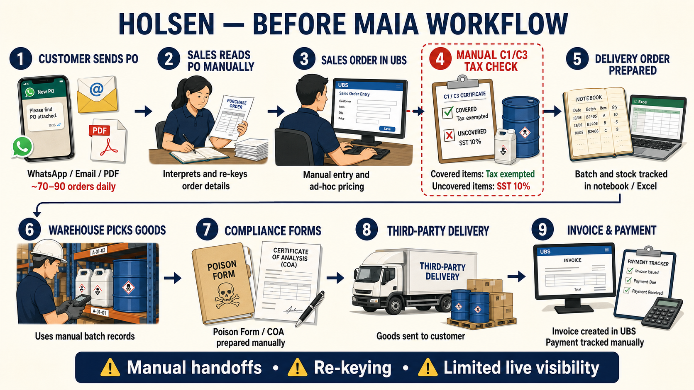
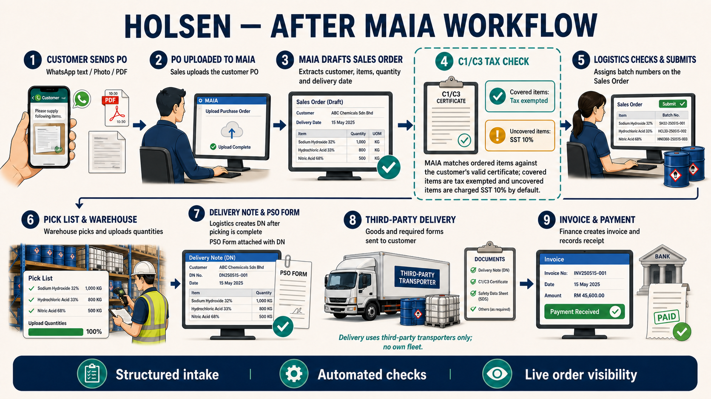

**Holsen --- Before vs After MAIA Workflow**

Format follows Macrofood/macrofrozen/27Jul26 - Macrofrozen E2E Flow and Per-Role Breakdown and Dalson --- Before vs After MAIA and E2E Flow. Sourced from Client Overview, Config Overlay, Onboarding Status, Holsen MAIA User Guide - Mr Tam Team, Holsen --- PM Handover Brief, and the **Holsen - Customer Onboarding Checklist** (Lark) for named users/roles and permission matrix.

  ------------------------------------------------------------------------------------------------------------------------------------------------------------------------------------------------------------------------------------------------------------------------------------------------------------------------------------------------------------------------------------------------------------------------------------------------------------------------------------------------------------------------
  **Corrected 2026-08-03:** the earlier draft claimed \"no named client contact anywhere in the KB\" --- that\'s now resolved. The Customer Onboarding Checklist\'s Roles Definition table (§A8) names every user and role. Per-role section below now uses real names and titles instead of functional placeholders. It also corrected a wrong delivery assumption --- Holsen has **no own fleet**; all deliveries go through third-party transporters (Menaka for local, GMax and Tiong Nam Logistics for outstation).

  ------------------------------------------------------------------------------------------------------------------------------------------------------------------------------------------------------------------------------------------------------------------------------------------------------------------------------------------------------------------------------------------------------------------------------------------------------------------------------------------------------------------------

**Before MAIA --- Current (As-Is) Flow**

{width="5.75in" height="3.2291666666666665in"}

  --------------------------------------------------------------
  ┌───────────────────────────┐\
  │ Customer sends PO │\
  │ WhatsApp / email / PDF │\
  │ (manual, \~70--90/day) │\
  └─────────────┬─────────────┘\
  ▼\
  ┌───────────────────────────┐\
  │ Sales staff reads PO, │\
  │ interprets manually │\
  └─────────────┬─────────────┘\
  ▼\
  ┌───────────────────────────┐\
  │ Sales Order keyed into │\
  │ UBS manually │\
  │ • Price negotiated ad hoc │\
  │ • No structured approval │\
  │ • C1/C3 checked manually │\
  │ • Covered: tax exempted │\
  │ • Uncovered: SST 10% │\
  └─────────────┬─────────────┘\
  ▼\
  ┌───────────────────────────┐\
  │ Delivery Order prepared │\
  │ manually │\
  │ • Batch/stock tracked in │\
  │ notebook/Excel │\
  └─────────────┬─────────────┘\
  ▼\
  ┌───────────────────────────┐\
  │ Warehouse picks by batch │\
  │ from notebook records │\
  │ • Poison/hazardous items │\
  │ need physical form │\
  └─────────────┬─────────────┘\
  ▼\
  ┌───────────────────────────┐\
  │ Goods delivered │\
  │ (own fleet / outstation │\
  │ transporter e.g. Tiong Nam)│\
  └─────────────┬─────────────┘\
  ▼\
  ┌───────────────────────────┐\
  │ Invoice created in UBS │\
  └─────────────┬─────────────┘\
  ▼\
  ┌───────────────────────────┐\
  │ Payment tracked manually │\
  └────────────────────────────┘

  --------------------------------------------------------------

**Customer sends a PO** --- WhatsApp, email, or PDF --- directly to Holsen sales staff. High volume: \~70--90 customer POs a day.

**Sales staff reads and interprets each PO manually**, then keys it into UBS as a Sales Order.

**Pricing is negotiated ad hoc** --- commodity items in particular need manual price confirmation each time, no system-enforced minimum price check.

**No structured approval workflow** --- credit limit and payment terms are checked manually by whoever is handling the order.

**Manual C1/C3 tax-exemption check:** During Sales Order entry, staff checks the ordered items against the customer\'s valid C1/C3 certificate. Items covered by the certificate are tax exempted; items not covered are charged SST 10% by default.

**Batch and stock tracking lives in notebooks/Excel**, not a live system --- matches the \"current tools being replaced\" listed in Client Overview.

**Poison/hazardous chemical items require a physical government-mandated form** before the driver can leave with the goods --- tracked manually today.

**Delivery is via Holsen\'s own fleet or an outstation transporter** (e.g. Tiong Nam) for out-of-area drops.

**Invoice generated in UBS**, with tax handling performed manually: items covered by the customer\'s valid C1/C3 certificate are tax exempted, while uncovered items are charged SST 10% by default.

**Payment tracked manually** --- no automated receipt/knock-off flow.

**Problems this creates**

**High manual PO volume (\~70--90/day) with no structured intake** --- every order depends on staff correctly reading and re-keying WhatsApp/email/PDF messages into UBS.

**Pricing consistency depends on memory** --- no system record of last price charged to a customer, especially for commodity items needing manual confirmation each time.

**No enforced credit/approval gate before delivery** --- credit limit and payment-term checks are manual, so an over-limit order can slip through before anyone catches it.

**Batch/stock tracking in notebook or Excel** --- no live visibility of what\'s actually in which warehouse, no FEFO enforcement, no traceability from batch to invoice.

**Compliance paperwork and C1/C3 tax checks are handled manually** per order. Staff must compare ordered items against the customer\'s certificate; covered items are tax exempted and uncovered items are charged SST 10% by default.

**UBS is the system of record with no direct integration** --- Holsen\'s own tools (WhatsApp, UBS, notebooks) don\'t talk to each other; everything is re-entered by hand at each handoff.

**After MAIA --- E2E Flow: Order Intake → Payment**

{width="5.75in" height="3.2291666666666665in"}

  -------------------------------------------------------------------------------------
  CUSTOMER\
  \|\
  \| Sends PO (WhatsApp text, photo, or PDF) --- Telegram \@maia_holsen_bot for UAT,\
  \| WhatsApp Sales Agent chatbot at go-live\
  v\
  SALESMAN\
  \|\
  \| Uploads the customer PO into MAIA\
  v\
  MAIA\
  \|\
  \| Extracts customer, items, quantities, delivery date from the PO\
  \| Drafts the Sales Order\
  v\
  SALESMAN\
  \|\
  \| Creates / reviews the Sales Order from the extracted PO\
  \| Checks customer C1/C3 certificate against ordered items\
  \| Covered items: tax exempted\
  \| Uncovered items: SST 10% charged by default\
  v\
  LOGISTICS\
  \|\
  \| Checks the Sales Order\
  \| Submits the Sales Order\
  \| Adds batch number for each item to be picked (on the SO itself)\
  v\
  Converts the Sales Order into a Pick List\
  v\
  Pick List generated → sent to Warehouse\
  \|\
  v\
  WAREHOUSE\
  \|\
  \| Picks the item quantities per the Pick List\
  \| Uploads the picked quantities back into MAIA\
  v\
  Pick List marked Complete\
  \|\
  v\
  LOGISTICS\
  \|\
  \| Creates the Delivery Note (DN) once the Pick List is complete\
  \| Attaches the PSO Form with the DN\
  v\
  FINANCE\
  \|\
  \| Creates the Invoice\
  \| Tax applied by SKU tag: Manufacturing = SST 10% default, Trading = 0% default\
  \| Payment due date = invoice date + 30 days (Net 30)\
  v\
  Invoice sent to customer (email/WhatsApp)\
  \|\
  v\
  FINANCE\
  \|\
  \| Records payment on receipt, creates Receipt in MAIA\
  v\
  SALES ORDER LIFECYCLE COMPLETE

  -------------------------------------------------------------------------------------

  ---------------------------------------------------------------------------------------------------------------------------------------------------------------------------------------------------------------------------------------------------------------------------------------------------------------------------------------------------------------------------------------------------------------------------------------------------------------------------------------------------------------------------------------------------------------------------------------------------------------------------------------------------------------------------------------------------------------------------------------------------------
  **Corrected 2026-08-03 (per direct client instruction):** the flow below replaces an earlier draft that assumed a separate Finance-approval gate before the Delivery Note, and batch selection happening at DN stage. Actual flow: Logistics --- not Finance --- checks and submits the Sales Order, batch numbers are assigned on the SO itself (before it becomes a Pick List), and there\'s no confirmed Finance-approval checkpoint between SO and DN. **Open question:** the Config Overlay and User Guide both describe a Finance-approval-before-DO step and manual credit/limit checks --- unclear whether that still happens somewhere in this flow (e.g. folded into Logistics\' SO check) or was dropped in practice. Flag for verification.

  ---------------------------------------------------------------------------------------------------------------------------------------------------------------------------------------------------------------------------------------------------------------------------------------------------------------------------------------------------------------------------------------------------------------------------------------------------------------------------------------------------------------------------------------------------------------------------------------------------------------------------------------------------------------------------------------------------------------------------------------------------------

**1. Order Intake**

Customer sends their PO to the MAIA Sales Agent chatbot --- WhatsApp text, a photo of the PO, or a PDF. UAT channel is Telegram (@maia_holsen_bot); go-live channel is WhatsApp (pending Meta account setup --- see PM Handover Brief gotcha on this cutover being unclear as of June).

Salesman uploads the PO into MAIA; MAIA extracts customer name, items, quantities, and delivery date.

Customer and items must already exist in MAIA --- if either is missing, the Salesman escalates to the MAIA admin rather than MAIA creating them inline (unlike Dalson/Macrofrozen\'s chatbot-driven new-customer creation --- **not confirmed as a Holsen feature**, treat as a gap to verify).

**2. Sales Order Creation**

Salesman creates/reviews the Sales Order drafted from the extracted PO --- corrects any extraction errors (especially likely on handwritten or unclear POs) and confirms the selling price.

**Duplicate check:** same customer + PO number → MAIA blocks creation as a duplicate; must verify before proceeding.

**Minimum price check:** MAIA warns if the entered price is below the item\'s minimum.

**C1/C3 tax-exemption check:** During Sales Order creation, MAIA checks the ordered items against the customer\'s valid C1/C3 certificate. Items covered by the certificate are tax exempted; items not covered are charged SST 10% by default.

**Pricing by SKU tag (corrected 2026-08-03, source: 2026-05-22 \"Holsen C1/C3 Testing\" Granola transcript, client-facing):**

**Trading items default to price = RM0** --- by design, not a bug (also flagged in PM Handover Brief Gotchas). Salesman must manually key in the price on every Trading-item order, **unless the customer already has a customer-specific price set** --- MAIA checks for existing customer pricing first, and only falls back to the RM0 default / manual entry if none exists.

**Commodity items** still require manual price confirmation each time regardless of customer pricing (Config Overlay: \"Commodity manual confirmation\").

**3. Logistics Check, Submit & Batch Assignment**

Logistics checks the Sales Order and submits it --- this is the actual submission gate, not Sales and not (confirmed) Finance.

Logistics adds the **batch number for each item to be picked, directly on the Sales Order** --- batch assignment happens before the SO becomes a Pick List, not later at DN stage.

**SKU classification tags drive downstream behaviour:** Trading (standard pick-and-pack, price defaults to RM0, 0% SST default), Manufacturing (Logistics must check with Production first, SST 10% default), Poison/Hazardous (triggers a \"POISON FORM REQUIRED\" alert), Commodity (Sales price-confirmation prompt), COA Required (Certificate of Analysis auto-attached).

C1/C3 tax treatment is determined during Sales Order creation by matching the ordered items against the customer\'s certificate: covered items are tax exempted, while uncovered items are charged SST 10% by default. Logistics verifies the resulting order before submission.

**4. Sales Order → Pick List**

Logistics converts the submitted, batch-assigned Sales Order into a Pick List.

The Pick List is generated and sent to the Warehouse team.

**5. Picking (Warehouse)**

Warehouse picks the item quantities per the Pick List --- item, quantity, batch number.

Warehouse uploads the picked quantities back into MAIA.

Pick List is marked **Complete** once all quantities are uploaded.

**6. Delivery Note (Logistics)**

Once the Pick List is complete, Logistics creates the Delivery Note.

Partial delivery is supported --- a Delivery Note can be created for less than the full ordered quantity, with the Sales Order tracking overall fulfilment until the remainder is delivered on a later DN. **Unconfirmed whether this still holds under the corrected flow** --- carried over from the earlier draft, needs re-verification.

Poison/hazardous items trigger the \"PSO FORM REQUIRED\" alert at this stage. Logistics prepares the PSO Form and attaches it with the Delivery Note before delivery.

**7. Delivery**

The third-party transporter takes the goods and Delivery Note, with the PSO Form attached to the DN when required.

Third-party transporter --- Menaka (local) or GMax/Tiong Nam Logistics (outstation), depending on delivery-type classification (Local vs. Outstation, auto-classified from postcode). **No own fleet** --- corrected 2026-08-03.

**8. Invoice (Finance)**

Finance creates the Invoice --- from the Delivery Note.

**Tax applied by SKU classification tag, not a flat split (corrected 2026-08-03, source: 2026-05-22 \"Holsen C1/C3 Testing\" Granola transcript):**

**Manufacturing-tagged items → SST 10% by default** (\"in manufacturing, automatically 10% to manufacturing tag\"; \"manufacturing\... SSD 10%. That\'s it. \... 10%, as a default.\").

**Trading-tagged items → 0% by default** (\"Trading. 0%. Trading tax values in trader.\").

This is the item\'s own tax default, separate from A57 tax exemption enforcement, which is **deferred to post-go-live** (per Client Overview / Config Overlay), and separate from C1/C3 certificate-based exemptions (see Compliance Documents below).

Payment due date defaults to invoice creation date + 30 days (Net 30).

Invoice sent to the customer via email or WhatsApp.

**9. Payment & Receipt (Finance)**

On payment, Finance creates a Receipt against the Invoice with amount and date.

Sales Order lifecycle is complete.

**10. Compliance Documents (C1/C3) --- SO-level live-tested, DN/Invoice-level still open**

C1 (perpetual manufacturer tax-exemption certificate) and C3 (per-order import-on-behalf exemption) are used during Sales Order creation to determine tax treatment. Ordered items covered by the customer\'s valid certificate are tax exempted; items not covered are charged SST 10% by default.

**Corrected 2026-08-03** (checked directly against Granola transcripts, not just the handover doc): dedicated client UAT sessions on 15 and 22 May 2026 confirmed working live --- C1/C3 certificate creation, PDF upload, applying a certificate to a Sales Order, and matching ordered items against certificate coverage. Covered items are tax exempted; uncovered items are charged SST 10% by default.

**Still open:** DN/Invoice-level C1/C3 behavior was never fully tested --- the 15 May session stalled at Delivery Note creation because C3 line items need a batch/serial assignment first. Two live bugs also surfaced (PDF-uploaded certs not showing tax reference on the finance side; stock-notification not firing) with no confirmed fix on record. The UAT form itself (Tests 24--36) still has no Pass/Fail box ticked --- a sign-off/paperwork gap, not evidence the feature wasn\'t tested.

See Holsen --- PM Handover Brief C1/C3 Deep Dive for full detail and direct transcript quotes.

**Per-Role: What Each User Does**

  --------------------------------------------------------------------------------------------------------------------------------------------------------------------------------------------------------------------------------------------------------------------------------------------------------------------------------------------------------------------------------------------------------------------
  **Corrected 2026-08-03:** named users and roles now sourced directly from the Holsen - Customer Onboarding Checklist (Lark), §A8 Roles Definition + Role Permissions Configuration. Permission-matrix columns are SALES MANAGER / LOGISTICS MANAGER (Logistics) / LOGISTICS MANAGER (Procurement) / LOGISTICS MANAGER (Production) / FINANCE MANAGER / Admin / System Admin --- cited inline below where relevant.

  --------------------------------------------------------------------------------------------------------------------------------------------------------------------------------------------------------------------------------------------------------------------------------------------------------------------------------------------------------------------------------------------------------------------

**Sales --- Tam Ze Xin (Sales, Admin/Operations --- primary contact) & Ng Tze Chien (Sales Manager)**

**Responsibilities**

Receives the customer PO, uploads it into MAIA via the Sales chatbot.

Creates/reviews the MAIA-extracted Sales Order, corrects errors, confirms the selling price --- manually keys in price for Trading items (default RM0) unless a customer-specific price already exists; manual confirmation always required for Commodity items.

**Does not submit the SO** --- Logistics checks and submits it (corrected 2026-08-03; earlier draft had this role submitting to a Finance-approval gate). Matches the permission matrix: Sales Manager has **Sales Order = READ only**, full CRUD+SUBMIT on Quotation and Purchase Order only.

**Benefits**

No longer manually re-keying every PO into UBS from scratch --- MAIA drafts the order first.

Duplicate-PO and minimum-price checks catch two of the most common manual-entry errors before submission.

**Risks**

Extraction errors on handwritten or unclear POs still require careful manual review --- not eliminated, just surfaced earlier.

New customer/item setup still routes to the MAIA admin rather than being self-service --- **unconfirmed whether this is intended as permanent or a current gap**.

**Finance --- Wong Shui Fern (Finance User / Finance Manager)**

**Responsibilities**

Creates the Invoice once the Delivery Note exists; applies tax per item. Submits Payment. Per the permission matrix, Finance actually has **full CRUD+SUBMIT on Sales Order too** --- she is not locked out of the SO, even though the day-to-day E2E flow routes SO submission through Logistics.

Records payment and creates the Receipt.

**Benefits**

Payment due date is calculated automatically (invoice date + 30 days) instead of tracked manually.

**Risks**

**No confirmed approval/credit-check step before the DN in the corrected flow** --- the Config Overlay and User Guide both describe Finance reviewing order accuracy and checking credit limit/payment terms before a Delivery Note is created (manual in A1, automated in A2). That gate doesn\'t appear in the client-confirmed flow above, where Logistics checks and submits the SO directly --- even though Finance\'s permissions would allow her to do it. **Open question:** is the credit/accuracy check actually happening (just informally, by whoever has access) or was it dropped? Needs direct client clarification.

A57 tax exemption enforcement is not live at go-live --- Finance must still manually verify tax classification is correct per the User Guide\'s troubleshooting table.

**Logistics --- Noor Aili Nafiah (Logistics Manager, Logistics)**

**Responsibilities**

Checks the Sales Order and submits it --- the actual gate between Sales Order creation and fulfilment. Confirmed by the permission matrix: **Sales Order = full READ/WRITE/CREATE/DELETE/SUBMIT**, the only role with unrestricted SO control besides Finance and System Admin.

Adds the batch number for each item to be picked, directly on the Sales Order (before it becomes a Pick List) --- covered under her **Inventory** permission (Item, Batch, Serial No., Warehouse, Pick List, stock recon, stock entry --- full CRUD+SUBMIT).

Converts the submitted, batch-assigned Sales Order into a Pick List and sends it to Warehouse.

Creates and submits the Delivery Note once Warehouse marks the Pick List Complete --- matches her **full CRUD+SUBMIT on Delivery Note**.

Handles SKU-classification-driven actions: preparing and attaching the PSO Form with the Delivery Note, Manufacturing hold for Production check, and COA auto-attach.

Checks C1/C3 certificate eligibility at the Sales Order stage: items covered by the certificate are tax exempted, while uncovered items are charged SST 10% by default --- see Compliance Documents below.

**Benefits**

Batch assignment now happens once, on the SO, in MAIA --- not re-keyed later at DN stage or tracked in a notebook.

Poison/hazardous compliance is a system-triggered alert instead of something staff have to remember per order.

Logistics has one clear checkpoint (SO check + submit) instead of the order silently passing through an unconfirmed approval step.

**Risks**

This role now carries what used to look like split Sales-submission and Finance-approval responsibility --- the permission matrix confirms she genuinely holds the widest operational write access of any non-admin role.

Batch-not-showing and insufficient-stock errors still require warehouse/admin troubleshooting per the User Guide\'s common-issues table --- not yet fully self-service.

**Logistics (Procurement) --- Intan Atikah**

**Responsibilities**

Read access to Quotation, PO, Invoice, Payment; **SO and DN limited to READ + SUBMIT** --- can submit but not create/edit either document.

Exact day-to-day duties not documented beyond the permission matrix --- **gap to verify** (title suggests procurement/purchasing coordination, not floor logistics).

**Production --- Murugesu A/L Palanivello (Logistics Manager, Production)**

**Responsibilities**

Listed in the Roles Definition table with a \"Production\" role, but the permission matrix shows **no populated access rows for this column** --- either a data-entry gap in the source sheet or this role genuinely has minimal/no MAIA access. **Gap to verify** --- the Before-MAIA notes elsewhere in the KB flag Manufacturing-tagged SKUs needing a \"check with Production\" step; unclear if that happens inside MAIA or entirely outside it via this person.

**Warehouse (floor staff --- no named individual or MAIA role identified)**

**Responsibilities**

Receives the Pick List (generated by Logistics).

Picks the item quantities per the Pick List --- item, quantity, batch number.

Uploads the picked quantities back into MAIA; Pick List is marked Complete once done.

**Gap**

**No warehouse-floor role or named person appears in the Roles Definition table** --- the Inventory/Pick List permission (full CRUD+SUBMIT) sits with Noor Aili Nafiah (Logistics Manager), not a separate warehouse user. Either floor staff work under her account, or there\'s an unnamed/undocumented warehouse login. **Needs direct verification** --- this is the same kind of gap Dalson had with Joseph before that got resolved by name.

**Admin --- Ong Siow Chui (System Admin) & Tam Ze Xin / Chin Zhao Heng (System Admin, full access)**

**Responsibilities**

Ong Siow Chui: all-roles Admin access --- Quotation/PO/read, SO/Invoice/Payment CRUD (no submit noted), Inventory/DN read, Issue CRUD.

Tam Ze Xin and Chin Zhao Heng (Boss): System Admin --- **full access to everything**, per the matrix\'s explicit \"Have access to everything\" note.

**Delivery --- Third-Party Transporters (Menaka, GMax, Tiong Nam Logistics) --- corrected 2026-08-03, no own fleet**

**Responsibilities**

**Holsen has no own delivery fleet.** All deliveries go through third-party transporters: **Menaka** (local), **GMax** and **Tiong Nam Logistics** (outstation).

Delivers goods per the Delivery Note; the PSO Form is attached with the DN for hazardous items when required.

There is **no system-driven delivery-option selection** in MAIA (no standard/express, no COD, no self-collect) --- delivery confirmation happens only two ways: the customer confirms goods received, or the transporter\'s Delivery Order (DO) is returned, local or outstation.

**Not a MAIA user**

Transporters are external --- no confirmed MAIA login. Same pattern as Dalson\'s Lalamove.

**Open Gaps Carried Into This Doc**

~~No named client contacts~~ --- **resolved 2026-08-03**: full Roles Definition table found in the Customer Onboarding Checklist (Lark) --- see Per-Role section above for all 8 named users.

**New customer/item creation path** --- unclear whether this stays admin-only (current User Guide behaviour) or becomes chatbot-driven like Dalson/Macrofrozen. *(open)*

~~Own-fleet driver\'s MAIA access~~ --- **resolved 2026-08-03**: there is no own fleet; all delivery is via third-party transporters (Menaka, GMax, Tiong Nam Logistics), none of them MAIA users.

**Meta/WhatsApp cutover from Telegram UAT bot** --- still unclear as of the last handover whether go-live actually moved off \@maia_holsen_bot. *(open --- see PM Handover Brief)*

**C1/C3 compliance** --- SO-level handling (certificate creation/upload, application to the Sales Order, item-coverage matching, tax exemption for covered items, and default SST 10% for uncovered items) is **confirmed live-tested with the client** (15/22 May 2026). Still open: DN/Invoice-level behavior (blocked on batch assignment, never re-tested), two live bugs (PDF tax-reference display, stock notification), and formal Pass/Fail sign-off on the UAT form. *(open --- see PM Handover Brief C1/C3 Deep Dive)*

**Finance vs Logistics approval-gate discrepancy** --- Config Overlay/User Guide describe a Finance approval step before DN; the client-confirmed flow has Logistics checking and submitting the SO directly, though Finance\'s permissions still allow full SO access. Unclear if credit checking still happens somewhere in practice. *(open)*

**Warehouse floor-staff role** --- no named individual or distinct MAIA role found for warehouse picking; Inventory/Pick List permissions sit entirely with Noor Aili Nafiah (Logistics Manager). *(open)*

**Logistics (Production) role** --- Murugesu A/L Palanivello is named with a Production role, but the permission matrix shows no populated access for that column. *(open)*

**See Also**

Holsen --- PM Handover Brief

Client Overview

Config Overlay

Onboarding Status

Holsen MAIA User Guide - Mr Tam Team

Holsen - Customer Onboarding Checklist (Lark, IShHwGOY9iNabKkn9iFlYDL9g7f) --- named users, roles, permission matrix

Dalson --- Before vs After MAIA and E2E Flow

Macrofood/macrofrozen/27Jul26 - Macrofrozen E2E Flow and Per-Role Breakdown
