**MAIA UAT Form - Holsen - March 2026 Copy**

**MAIA User Acceptance Test (UAT) --- Holsen**

**March 2026 · Round 1**

**Before You Start**

**UAT Period:** 18 March 2026 -- 25 March 2026\
**Sign-Off Deadline:** 25 March 2026\
**Go-Live (Core MAIA):** 31 March 2026

**UAT Timeline**

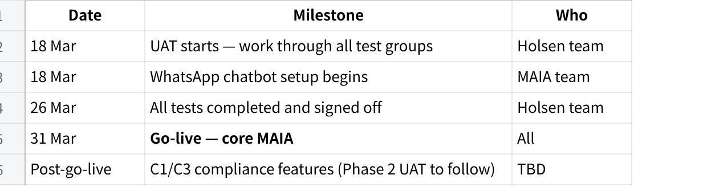

**点击图片可查看完整电子表格**

+:----------------------------------------------------------------------------------------------------------------------------------------------------------------------------------------------+
| **Scope note:** This UAT covers core MAIA only. C1/C3 compliance features and A57 tax exemption enforcement are not included in this round --- they will be tested separately after go-live.\ |
| **Web App:** <https://maia-fe-holsen.vercel.app/login>\                                                                                                                                       |
| **Chatbot (during UAT):** Telegram --- scan the QR code provided to open the MAIA Holsen chatbot                                                                                              |
|                                                                                                                                                                                               |
| {width="2.7916666666666665in" height="3.375in"}                                                                          |
|                                                                                                                                                                                               |
| **Chatbot (after go-live):** WhatsApp *(same features --- WhatsApp setup is in progress)*                                                                                                     |
+-----------------------------------------------------------------------------------------------------------------------------------------------------------------------------------------------+

**Your Login Details**

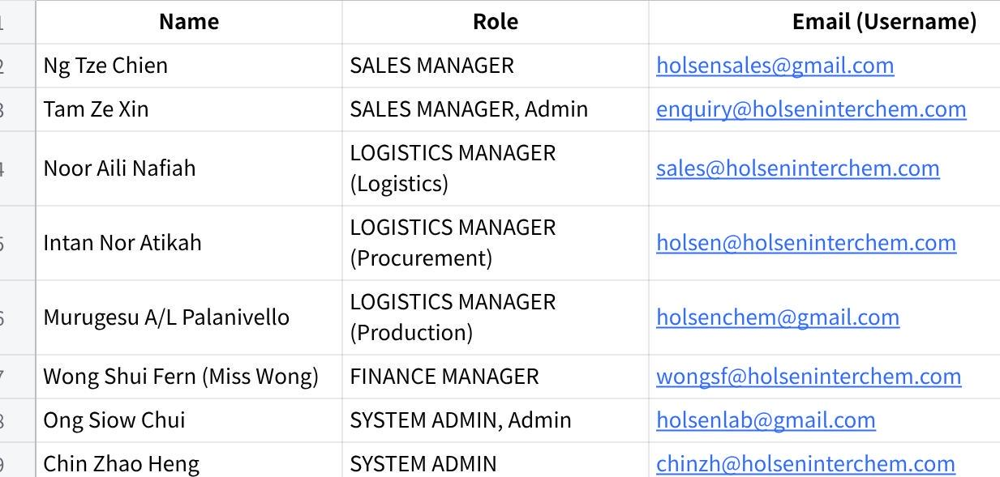

**点击图片可查看完整电子表格**

**How to Use This Document**

Work through each test **in order** --- some tests use data created in earlier steps.

For each step, do what is described and check that what you see matches the **\"What you should see\"** column.

After each test, tick your result and write any notes in the feedback box.

If something does not work as expected, mark it **Fail** and describe what happened.

If you are unsure or something is not loading, mark it **Issue** and contact **Gareth**.

Sign off at the end when you are done.

  -----------------------------------------------------------------------------------------------------------------------------------------------------------------------------------------------------------------------------------------------------------------------------------------------------------------------------------------
  **About these test cases:** All tests in this document are based on the agreed MAIA scope in the Holsen SOW. If any test case does not match how your business works, or if you notice a step that seems incorrect, please do not guess --- contact **Gareth** directly and we will review and update the test case before you proceed.

  -----------------------------------------------------------------------------------------------------------------------------------------------------------------------------------------------------------------------------------------------------------------------------------------------------------------------------------------

**Result options:**

✅ **Pass** --- Everything worked as described

❌ **Fail** --- Something did not work correctly

⚠️ **Issue** --- Could not complete the test (e.g., button missing, page not loading)

**Reporting issues:**

If you find a bug or something is not working correctly, use **Jam** to record your screen and share the issue with us.\
-\> [How to Record and Share Issues with Jam](https://eg69120xnei.sg.larksuite.com/wiki/TeDLwCfCFiYmKSkAn40lHYFrg5c)

Copy the link and share it in the test cases or in the group

**Setup Checklist *(For MAIA team to complete before UAT starts)***

All user accounts created and login details filled in above

Customer records loaded (at least 3 test customers with name and address)

Product catalogue loaded (at least 5 products with descriptions and pricing)

Stock quantities loaded (at least 1 product at zero stock, 1 at low-stock level)

Low-stock threshold configured (Safety Qty in Item)

Delivery delay reminder threshold configured

At least 1 product flagged as Poison in the system

Test customer has full address and phone number

**Tests**

**Group 1 --- Chatbot: Sending Orders**

**Test 1 --- Send an Order by Text Message**

*Who tests this: **Ng Tze Chien** or **Tam Ze Xin** (Sales Manager)*

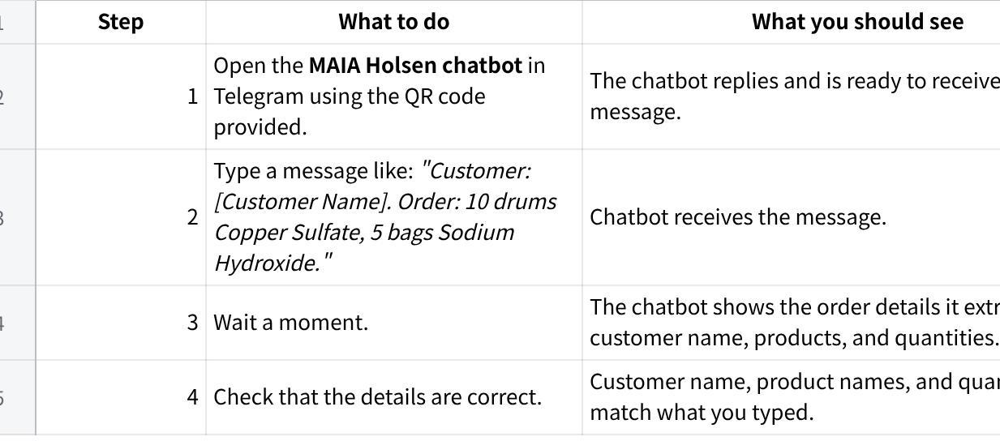

**点击图片可查看完整电子表格**

+:-------------------------------------------------------------+
| **Your result:**                                             |
|                                                              |
| ~~Pass~~                                                     |
|                                                              |
| Fail                                                         |
|                                                              |
| ~~Issue~~                                                    |
|                                                              |
| **Tested by: Tam**\                                          |
| **Date: 26/5/26**\                                           |
| **Notes:**                                                   |
+--------------------------------------------------------------+

**Test 2 --- Send an Order by Photo**

*Who tests this: **Ng Tze Chien** or **Tam Ze Xin** (Sales Manager)*

**\[电子表格下载失败\]**

+:-------------------------------------------------------------+
| **Your result:**                                             |
|                                                              |
| Pass                                                         |
|                                                              |
| Fail                                                         |
|                                                              |
| Issue                                                        |
|                                                              |
| **Tested by: Tam**\                                          |
| **Date: 14/5/26**                                            |
|                                                              |
| **Notes:**                                                   |
+--------------------------------------------------------------+

**Test 3 --- Send an Order by PDF**

*Who tests this: **Ng Tze Chien** or **Tam Ze Xin** (Sales Manager)*

**\[电子表格下载失败\]**

+:--------------------------------------------------------------------------------------------------------------------------------------------------------------------------------------------------+
| ⚠️ **Note:** After the chatbot confirms the CPO is created, go to the web app to review the extracted details and convert the CPO to a Sales Order. This is covered in the Group 2 web app tests. |
|                                                                                                                                                                                                   |
| **Your result:**                                                                                                                                                                                  |
|                                                                                                                                                                                                   |
| Pass                                                                                                                                                                                              |
|                                                                                                                                                                                                   |
| Fail                                                                                                                                                                                              |
|                                                                                                                                                                                                   |
| Issue                                                                                                                                                                                             |
|                                                                                                                                                                                                   |
| **Tested by: Tam**\                                                                                                                                                                               |
| **Date: 14/5/26**                                                                                                                                                                                 |
|                                                                                                                                                                                                   |
| **Notes:**                                                                                                                                                                                        |
+---------------------------------------------------------------------------------------------------------------------------------------------------------------------------------------------------+

**Test 4 --- Pricing and Stock Check**

*Who tests this: **Ng Tze Chien** or **Tam Ze Xin** (Sales Manager) --- continue from Test 1, 2, or 3.*

**\[电子表格下载失败\]**

+:-------------------------------------------------------------+
| **Your result:**                                             |
|                                                              |
| Pass                                                         |
|                                                              |
| Fail                                                         |
|                                                              |
| Issue                                                        |
|                                                              |
| **Tested by: Tam**\                                          |
| **Date: 28/4/26**                                            |
|                                                              |
| **Notes:**                                                   |
+--------------------------------------------------------------+

**Group 2 --- Web App: Managing Orders**

**Test 5 --- Generate Documents (Quotation → Sales Order → Proforma Invoice → Invoice)**

*Who tests this: **Ng Tze Chien / Tam Ze Xin** (Sales Manager) for Step 1; **Noor Aili** (Logistics) or **Miss Wong** (Finance) for Steps 2--5*

*Continue from the order created in Test 4. Different roles handle different steps --- coordinate as needed.*

  -------------------------------------------------------------------------------------------------------------------------------------------------------------------------------------------
  **Why different roles?** Sales Manager can create Quotations but cannot create or edit Sales Orders (view only). SO creation and Invoice submission must be done by Logistics or Finance.

  -------------------------------------------------------------------------------------------------------------------------------------------------------------------------------------------

**\[电子表格下载失败\]**

+:-------------------------------------------------------------+
| **Your result:**                                             |
|                                                              |
| ~~Pass~~                                                     |
|                                                              |
| Fail                                                         |
|                                                              |
| Issue                                                        |
|                                                              |
| **Tested by: Tam (Aili, Wong)**\                             |
| **Date: 14/4/26**                                            |
|                                                              |
| **Notes:**                                                   |
+--------------------------------------------------------------+

**Test 6 --- Create a Credit Note and Debit Note**

*Who tests this: **Miss Wong** (Finance)*

*Use an existing Invoice from Test 5.*

**\[电子表格下载失败\]**

+:-------------------------------------------------------------+
| **Your result:**                                             |
|                                                              |
| ~~Pass~~                                                     |
|                                                              |
| Fail                                                         |
|                                                              |
| Issue                                                        |
|                                                              |
| **Tested by: Tam (Wong)**\                                   |
| **Date: 14/4/26**                                            |
|                                                              |
| **Notes:**                                                   |
+--------------------------------------------------------------+

**Test 7 --- Duplicate Order is Blocked**

*Who tests this: **Ng Tze Chien** or **Tam Ze Xin** (Sales Manager)*

  -------------------------------------------------------------------------------------------------------------------------------------------------------------------
  **Note:** The duplicate check triggers when an existing order with the same PO number is already in **TO BILL** (submitted) status. Draft orders are not checked.

  -------------------------------------------------------------------------------------------------------------------------------------------------------------------

**\[电子表格下载失败\]**

+:-------------------------------------------------------------+
| **Your result:**                                             |
|                                                              |
| ~~Pass~~                                                     |
|                                                              |
| Fail                                                         |
|                                                              |
| Issue                                                        |
|                                                              |
| **Tested by: Tam**\                                          |
| **Date: 26/5/26**                                            |
|                                                              |
| **Notes:**                                                   |
|                                                              |
| Unable to proceed due to test 2 and test 3 not working.      |
+--------------------------------------------------------------+

**Test 8 --- Manage Sales Orders on the Web App**

*Who tests this: **Noor Aili** (Logistics) or **Miss Wong** (Finance) for SO creation; **Ng Tze Chien** (Sales Manager) for view-only check*

  ------------------------------------------------------------------------------------------------------------------------------------------------
  **Note:** Sales Manager has view-only access to Sales Orders. SO creation and editing is done by Logistics (Noor Aili) or Finance (Miss Wong).

  ------------------------------------------------------------------------------------------------------------------------------------------------

**\[电子表格下载失败\]**

+:-------------------------------------------------------------+
| **Your result:**                                             |
|                                                              |
| ~~Pass~~                                                     |
|                                                              |
| Fail                                                         |
|                                                              |
| Issue                                                        |
|                                                              |
| **Tested by: Tam (Aili, Ng)**\                               |
| **Date: 14/4/26**                                            |
|                                                              |
| **Notes:**                                                   |
+--------------------------------------------------------------+

**Test 9 --- Export Sales Order / Sales Invoice / Delivery Note as CSV**

*Who tests this: Admin*

Exports these document types from MAIA as CSV files for downstream processing and checking.

**\[电子表格下载失败\]**

⚠️ **Note:** This test is to confirm that the required document types can be exported correctly as CSV from MAIA.

**Your result:**

Pass

Fail

Issue

**Tested by:**\
**Date:**

**Notes:**

**Group 3 --- Logistics: Deliveries and Stock Alerts**

**Test 10 --- Create a Delivery Order and Picking List**

*Who tests this: **Noor Aili** (Logistics)*

**\[电子表格下载失败\]**

+:-------------------------------------------------------------+
| **Your result:**                                             |
|                                                              |
| ~~Pass~~                                                     |
|                                                              |
| Fail                                                         |
|                                                              |
| Issue                                                        |
|                                                              |
| **Tested by: Tam (Aili)**\                                   |
| **Date: 14/4/26**                                            |
|                                                              |
| **Notes:**                                                   |
|                                                              |
| Pick list pdf : SO ref & warehouse not important             |
|                                                              |
| Require batch number / barcode                               |
+--------------------------------------------------------------+

**Test 10A --- Delivery Note Batch Number Carries Over to Pick List**

*Who tests this: **Noor Aili** (Logistics)*

**\[电子表格下载失败\]**

**Your result:**

Pass

Fail

Issue

**Tested by:**\
**Date:**

**Notes:**

**Test 10B --- Exact Selected Batch Number Stays Correct and Visible in Pick List**

*Who tests this: **Noor Aili** (Logistics)*

**\[电子表格下载失败\]**

**Your result:**

Pass

Fail

Issue

**Tested by:**\
**Date:**

**Notes:**

**Test 11 --- Stock Alerts (Out of Stock and Low Stock)**

*Who tests this: **Noor Aili** (Logistics) and **Ng Tze Chien / Tam Ze Xin** (Sales Manager) --- both should see the alerts*

**\[电子表格下载失败\]**

+:--------------------------------------------------------------------------------------------------------------------------------------------------------------------------------------------------------------------------------------------------------------------------------------+
| **Your result:**                                                                                                                                                                                                                                                                      |
|                                                                                                                                                                                                                                                                                       |
| Pass                                                                                                                                                                                                                                                                                  |
|                                                                                                                                                                                                                                                                                       |
| ~~Fail~~                                                                                                                                                                                                                                                                              |
|                                                                                                                                                                                                                                                                                       |
| ~~Issue~~                                                                                                                                                                                                                                                                             |
|                                                                                                                                                                                                                                                                                       |
| **Tested by: Tam (Aili)**\                                                                                                                                                                                                                                                            |
| **Date: 28/4/26**                                                                                                                                                                                                                                                                     |
|                                                                                                                                                                                                                                                                                       |
| **Notes:**                                                                                                                                                                                                                                                                            |
|                                                                                                                                                                                                                                                                                       |
| 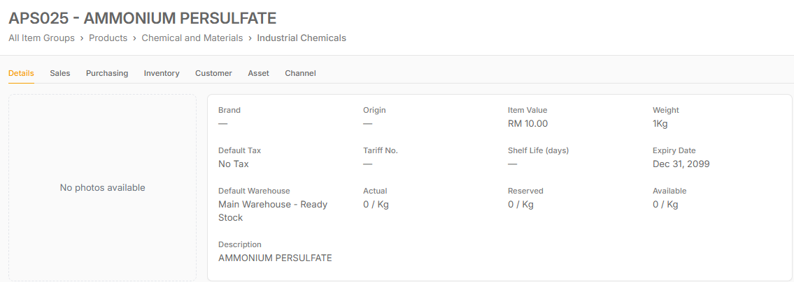{width="4.708333333333333in" height="1.6875in"}                                                                                                                                                                  |
|                                                                                                                                                                                                                                                                                       |
| 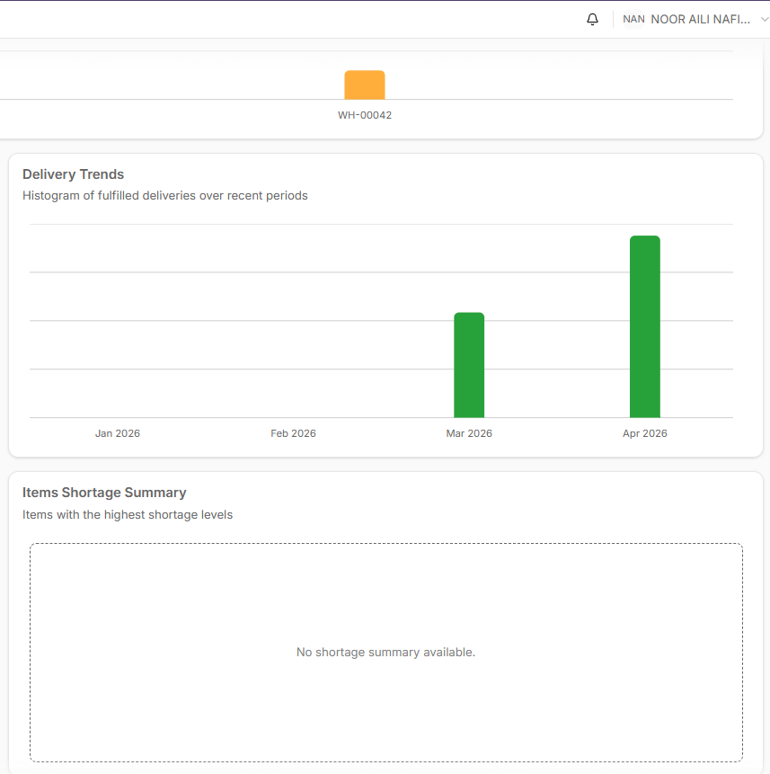{width="3.5833333333333335in" height="3.6041666666666665in"}                                                                                                                                                     |
|                                                                                                                                                                                                                                                                                       |
| 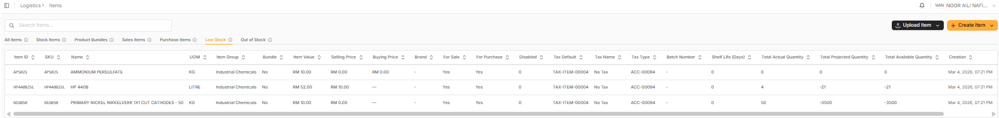{width="5.583333333333333in" height="0.65625in"}                                                                                                                                                                 |
|                                                                                                                                                                                                                                                                                       |
| 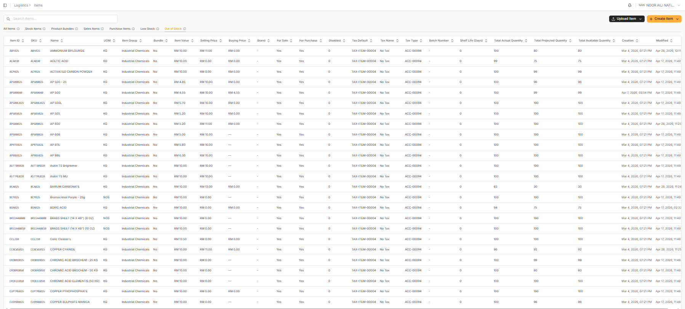{width="5.583333333333333in" height="2.5208333333333335in"}                                                                                                                                                      |
|                                                                                                                                                                                                                                                                                       |
| 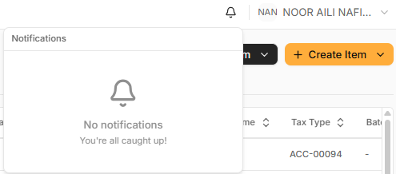{width="5.15625in" height="2.2708333333333335in"}                                                                                                                                                                |
|                                                                                                                                                                                                                                                                                       |
| Tested on item ammonium persulfate. Did stock recon to 0 quantity. No notification popup. Item does not show up in Out Of Stock tab. Shows up in Low Stock tab instead. Same with ammonium bifluoride. No alerts or notification even after stock falls below the safety stock limit. |
+---------------------------------------------------------------------------------------------------------------------------------------------------------------------------------------------------------------------------------------------------------------------------------------+

Low stock tab and out of stock tab reverse

Noor aili logistics manager, no notification

**Test 12 --- Delivery Delay Reminder**

*Who tests this: **Noor Aili** (Logistics)*

**\[电子表格下载失败\]**

+:------------------------------------------------------------------------------------------------------+
| ⚠️ **Note:** If you cannot find an overdue Invoice to test this, please contact Gareth to set one up. |
|                                                                                                       |
| **Your result:**                                                                                      |
|                                                                                                       |
| Pass                                                                                                  |
|                                                                                                       |
| Fail                                                                                                  |
|                                                                                                       |
| Issue                                                                                                 |
|                                                                                                       |
| **Tested by:**\                                                                                       |
| **Date:**                                                                                             |
|                                                                                                       |
| **Notes:**                                                                                            |
+-------------------------------------------------------------------------------------------------------+

**Group 4 --- Logging In**

**Test 13 --- All Users Can Log In**

*Who tests this: **Everyone** --- all 8 users log in with their own account*

**\[电子表格下载失败\]**

+:-------------------------------------------------------------+
| **Your result:**                                             |
|                                                              |
| ~~Pass~~                                                     |
|                                                              |
| Fail                                                         |
|                                                              |
| Issue                                                        |
|                                                              |
| **Tested by:**\                                              |
| **Date:**                                                    |
|                                                              |
| **Notes:**                                                   |
+--------------------------------------------------------------+

**Group 5 --- What Each Person Can and Cannot Do**

*Each person tests their own account. Check that you can do the things listed, and that you are blocked from things outside your role.*

**Test 14 --- Sales Manager Access Check**

*Who tests this: **Ng Tze Chien** or **Tam Ze Xin** (Sales Manager)*

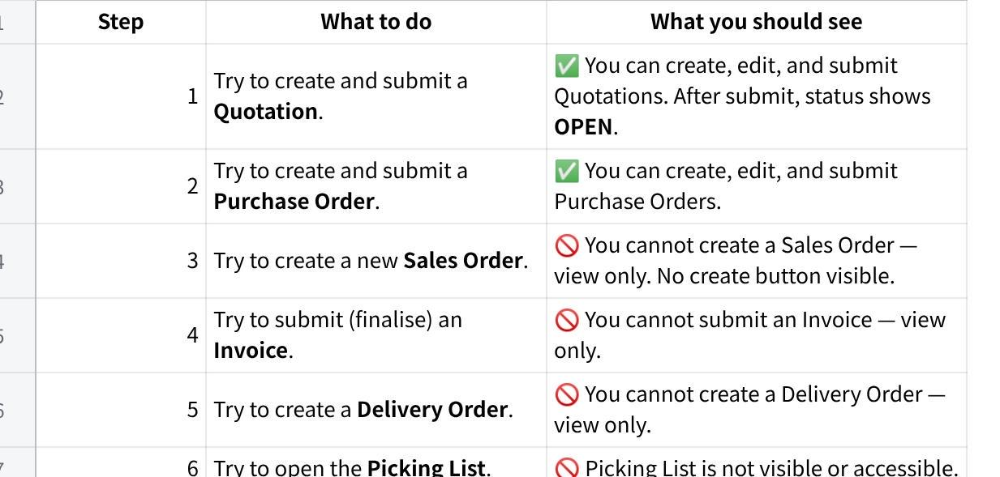

**点击图片可查看完整电子表格**

+:-------------------------------------------------------------+
| **Your result:**                                             |
|                                                              |
| ~~Pass~~                                                     |
|                                                              |
| Fail                                                         |
|                                                              |
| Issue                                                        |
|                                                              |
| **Tested by: Tam (Ng acct)**\                                |
| **Date: 14/4/26**                                            |
|                                                              |
| **Notes (list any step that did not behave as expected):**   |
+--------------------------------------------------------------+

**Test 15 --- Logistics / Operations Access Check**

*Who tests this: **Noor Aili** (Logistics --- Operations)*

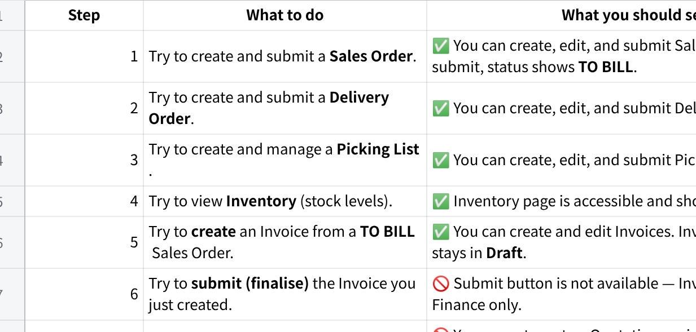

**点击图片可查看完整电子表格**

+:----------------------------------------------------------------------------------------------------------------------------------+
| **Your result:**                                                                                                                  |
|                                                                                                                                   |
| Pass                                                                                                                              |
|                                                                                                                                   |
| ~~Fail~~                                                                                                                          |
|                                                                                                                                   |
| ~~Issue~~                                                                                                                         |
|                                                                                                                                   |
| **Tested by: Tam**\                                                                                                               |
| **Date: 14/4/26**                                                                                                                 |
|                                                                                                                                   |
| **Notes (list any step that did not behave as expected):**                                                                        |
|                                                                                                                                   |
| Qty shown up in DO is different from the qty in sales order. Could be because managed to update the Wt UOM to 50kg.               |
|                                                                                                                                   |
| 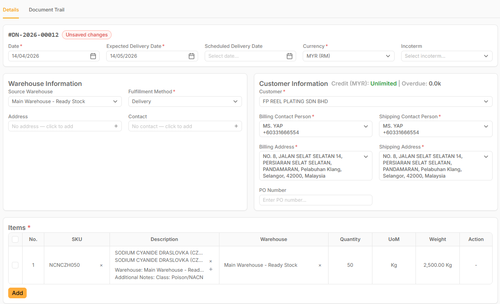{width="5.583333333333333in" height="3.3958333333333335in"} |
|                                                                                                                                   |
| ~~Possible to leave out the warehouse info from the pick list? Not necessary for current practice.~~                              |
+-----------------------------------------------------------------------------------------------------------------------------------+

**Test 16 --- Logistics / Procurement Access Check**

*Who tests this: **Intan Atikah** (Logistics --- Procurement)*

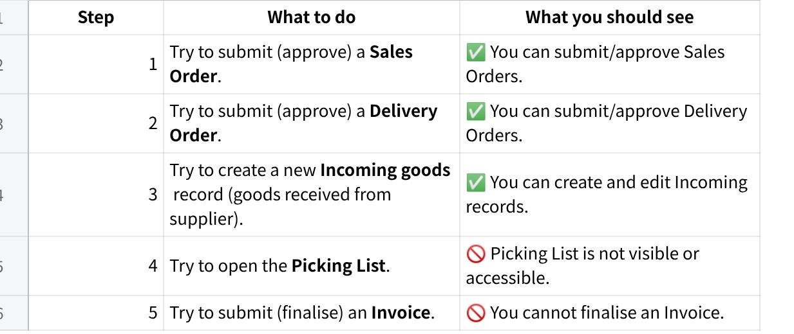

**点击图片可查看完整电子表格**

+:-------------------------------------------------------------+
| **Your result:**                                             |
|                                                              |
| Pass                                                         |
|                                                              |
| Fail                                                         |
|                                                              |
| Issue                                                        |
|                                                              |
| **Tested by: Tam**\                                          |
| **Date: 1/4/26**                                             |
|                                                              |
| **Notes (list any step that did not behave as expected):**   |
+--------------------------------------------------------------+

**Test 17 --- Logistics / Production Access Check**

*Who tests this: **Murugesu** (Logistics --- Production)*

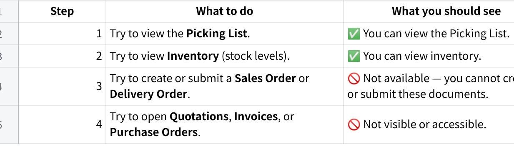

**点击图片可查看完整电子表格**

+:-------------------------------------------------------------+
| **Your result:**                                             |
|                                                              |
| ~~Pass~~                                                     |
|                                                              |
| Fail                                                         |
|                                                              |
| ~~Issue~~                                                    |
|                                                              |
| **Tested by:**\                                              |
| **Date:**                                                    |
|                                                              |
| **Notes (list any step that did not behave as expected):**   |
|                                                              |
| Please remove access to customer list                        |
+--------------------------------------------------------------+

**Test 18 --- Finance Manager Access Check**

*Who tests this: **Miss Wong** (Finance)*

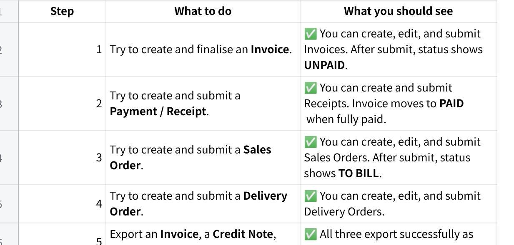

**点击图片可查看完整电子表格**

+:-------------------------------------------------------------+
| **Your result:**                                             |
|                                                              |
| ~~Pass~~                                                     |
|                                                              |
| Fail                                                         |
|                                                              |
| Issue                                                        |
|                                                              |
| **Tested by:**\                                              |
| **Date:**                                                    |
|                                                              |
| **Notes (list any step that did not behave as expected):**   |
+--------------------------------------------------------------+

**Test 19 --- Admin Access Check**

*Who tests this: **Ong Siow Chui** or **Tam Ze Xin** (Admin)*

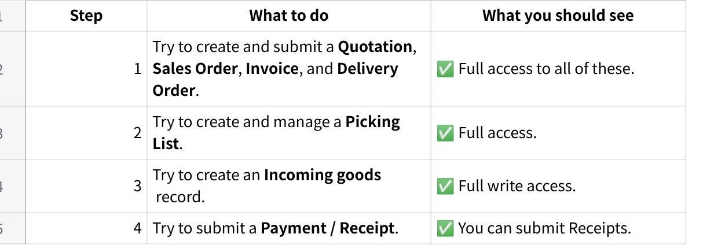

**点击图片可查看完整电子表格**

+:-------------------------------------------------------------+
| **Your result:**                                             |
|                                                              |
| ~~Pass~~                                                     |
|                                                              |
| Fail                                                         |
|                                                              |
| Issue                                                        |
|                                                              |
| **Tested by:**\                                              |
| **Date:**                                                    |
|                                                              |
| **Notes (list any step that did not behave as expected):**   |
+--------------------------------------------------------------+

**Test 20 --- System Admin Access Check**

*Who tests this: **Chin Zhao Heng** (System Admin)*

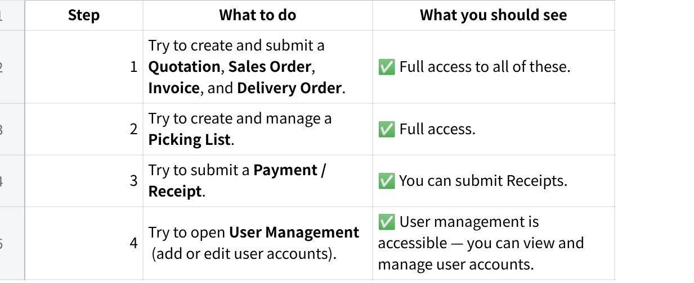

**点击图片可查看完整电子表格**

+:-------------------------------------------------------------+
| **Your result:**                                             |
|                                                              |
| ~~Pass~~                                                     |
|                                                              |
| Fail                                                         |
|                                                              |
| ~~Issue~~                                                    |
|                                                              |
| **Tested by:**\                                              |
| **Date:**                                                    |
|                                                              |
| **Notes (list any step that did not behave as expected):**   |
|                                                              |
| Cannot edit minimum price for items                          |
+--------------------------------------------------------------+

**Test 21 --- Role Approval Flow**

*Who tests this: **All roles** --- coordinate as a group across all steps*

**Part A --- Quotation & Purchase Order (Sales Manager submits)**

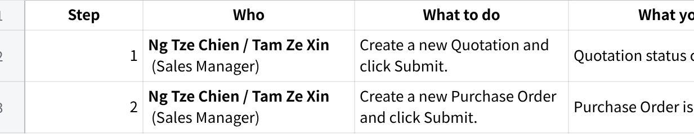

**点击图片可查看完整电子表格**

**Part B --- Sales Order submission (Logistics and Finance can create and submit)**

  -----------------------------------------------------------------------------------------------------------------
  **Note:** Sales Manager has view-only access on Sales Orders --- SO drafts are created by Logistics or Finance.

  -----------------------------------------------------------------------------------------------------------------

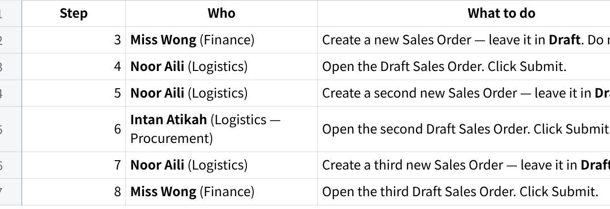

**点击图片可查看完整电子表格**

**Part C --- Delivery Order submission (Logistics and Finance can submit)**

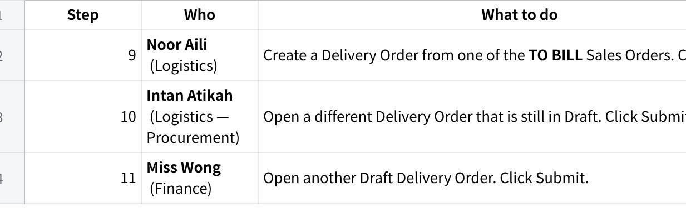

**点击图片可查看完整电子表格**

**Part D --- Pick List submission (Logistics --- Noor Aili)**

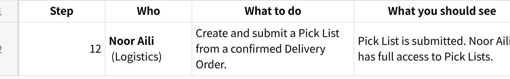

**点击图片可查看完整电子表格**

**Part E --- Invoice submission (Finance submits)**

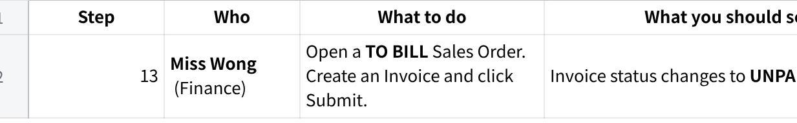

**点击图片可查看完整电子表格**

**Part F --- Receipt / Payment submission (Finance creates; Finance and Admin can submit)**

  --------------------------------------------------------------------------------------------------------------------------------
  **Note:** Admin can submit Receipts but cannot create them. Finance (Miss Wong) creates the Receipt; Admin can then submit it.

  --------------------------------------------------------------------------------------------------------------------------------

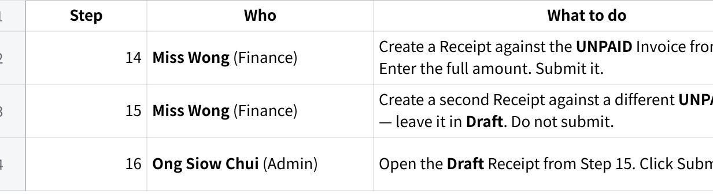

**点击图片可查看完整电子表格**

+:-------------------------------------------------------------+
| **Your result:**                                             |
|                                                              |
| Pass                                                         |
|                                                              |
| Fail                                                         |
|                                                              |
| Issue                                                        |
|                                                              |
| **Tested by:** (coordinate across team)\                     |
| **Date:**                                                    |
|                                                              |
| **Notes (note the step number if any step failed):**         |
+--------------------------------------------------------------+

**Group 6 --- Poison Signed Order (PSO)**

  ------------------------------------------------------------------------------------------------------------------------------------------------------------------------------------------
  **What is this?** Holsen requires to attach a signed Poison Signed Order (PSO) form to every delivery that contains poison products. MAIA generates this form automatically when needed.

  ------------------------------------------------------------------------------------------------------------------------------------------------------------------------------------------

**Test 22 --- Poison Signed Order (PSO) --- Full Test**

Who tests this: **Noor Aili** (Logistics) or ***Tam Ze Xin (Admin)***

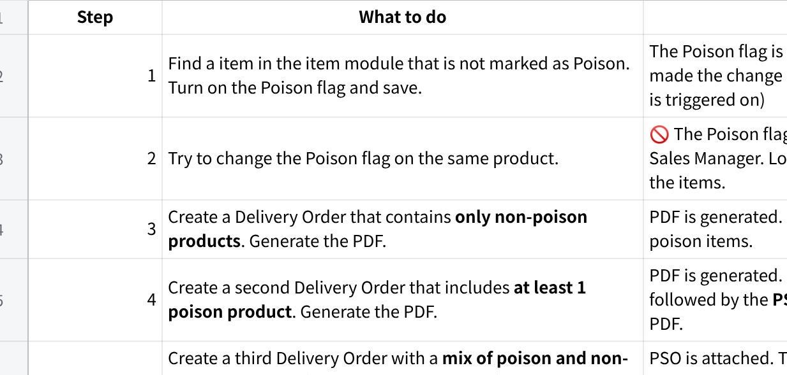

**点击图片可查看完整电子表格**

+:-----------------------------------------------------------------------------------+
| **Your result:**                                                                   |
|                                                                                    |
| ~~Pass~~                                                                           |
|                                                                                    |
| Fail                                                                               |
|                                                                                    |
| Issue                                                                              |
|                                                                                    |
| **Tested by: TAM**\                                                                |
| **Date: 11/5/26**                                                                  |
|                                                                                    |
| **Notes (if any step failed, note the step number and describe what happened):\\** |
+------------------------------------------------------------------------------------+

**Test 23 --- Tagging and Trading Item Price Prompt Alert**

*Who tests this: **Ng Tze Chien** or **Tam Ze Xin** (Sales Manager)*

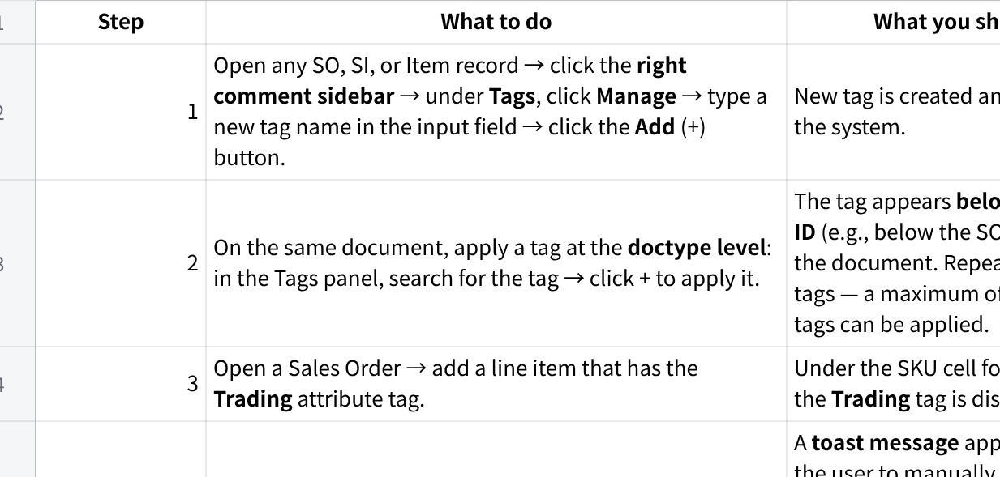

**点击图片可查看完整电子表格**

**Your result:**

~~Pass~~

Fail

Issue

**Tested by: Tam**\
**Date:**\
**Notes:**

**Group 7: Tax Reference / Certificate (C1 & C3)**

**Test 24 --- Upload C1 Certificate via PDF**

Who tests this: **\[Admin\]** or **\[Sales Manager\]**\
Channel: **FE + Chatbot**

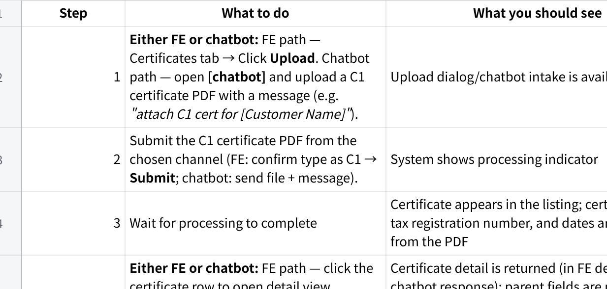

**点击图片可查看完整电子表格**

**Your result:**

~~Pass~~

Fail

Issue

**Tested by: Tam**\
**Date: 26/5/26**\
**Notes: Uploaded C1 cert for Guan Huat**

**Test 25 --- Apply C1 Certificate on Sales Order --- All Items Covered**

Who tests this: **\[Sales Manager\]** or **\[Finance / Logistics\]**\
Channel: **FE + Chatbot**

**Part A --- Get the Sales Order via Chatbot**

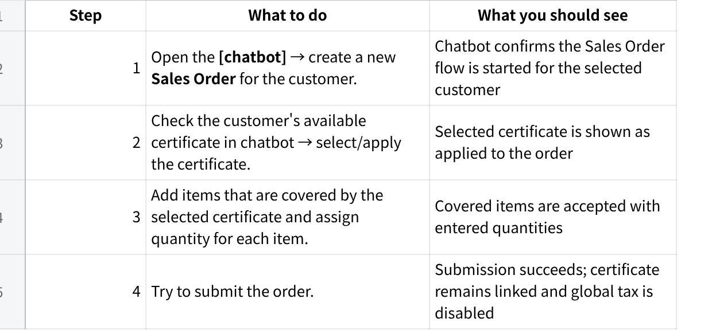

**点击图片可查看完整电子表格**

**Part B --- Get the Sales Order via Web App**

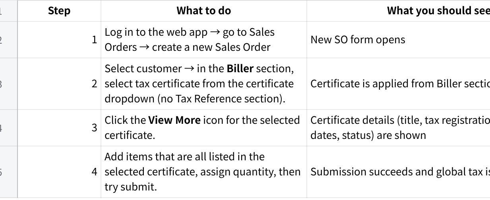

**点击图片可查看完整电子表格**

**Your result:**

Pass

Fail

Issue

**Tested by:**\
**Date:**\
**Notes:**

**Test 26 --- Apply C1 Certificate --- Partial Coverage + Save**

Who tests this: **\[Sales Manager\]** or **\[Finance / Logistics\]**\
Channel: **FE + Chatbot**

**Part A --- Get the Sales Order via Chatbot**

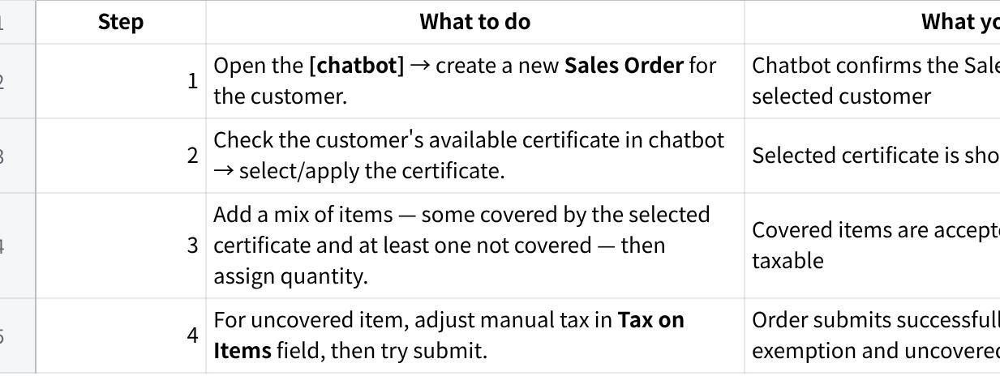

**点击图片可查看完整电子表格**

**Part B --- Get the Sales Order via Web App**

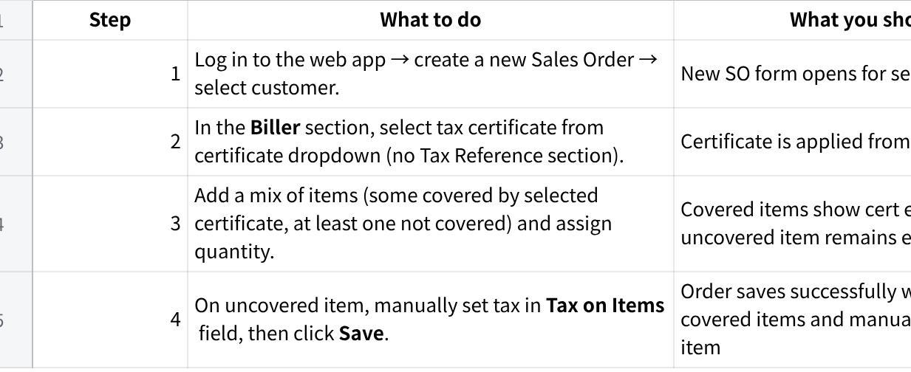

**点击图片可查看完整电子表格**

**Your result:**

Pass

Fail

Issue

**Tested by:**\
**Date:**\
**Notes:**

**Test 27 --- Upload C3 Certificate via PDF**

Who tests this: **\[Admin\]** or **\[Sales Manager\]**\
Channel: **FE + Chatbot**

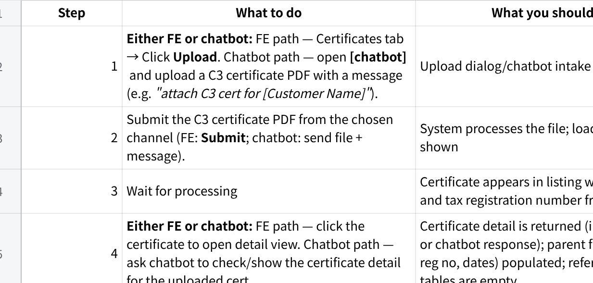

**点击图片可查看完整电子表格**

**Your result:**

~~Pass~~

Fail

Issue

**Tested by: Tam**\
**Date: 26/5/26**\
**Notes: Uploaded C3 cert for Guan Huat**

**Test 28 --- Apply C3 Certificate on Sales Order --- All Items Covered**

Who tests this: **\[Sales Manager\]** or **\[Finance / Logistics\]**\
Channel: **FE + Chatbot**

**Part A --- Get the Sales Order via Chatbot**

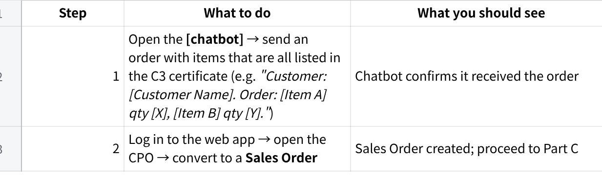

**点击图片可查看完整电子表格**

**Part B --- Get the Sales Order via Web App**

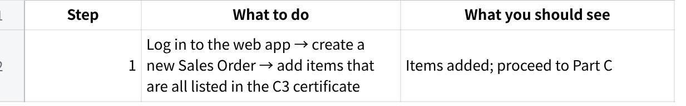

**点击图片可查看完整电子表格**

**Part C --- Apply C3 Certificate (both paths continue here)**

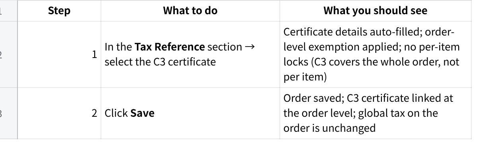

**点击图片可查看完整电子表格**

**Your result:**

~~Pass~~

Fail

Issue

**Tested by: Tam**\
**Date: 26/5/26**\
**Notes:**

**Test 29 --- C3 Certificate --- Ineligible Items Removal Prompt**

Who tests this: **\[Sales Manager\]** or **\[Finance / Logistics\]**\
Channel: **FE + Chatbot**

**Part A --- Get the Sales Order via Chatbot**

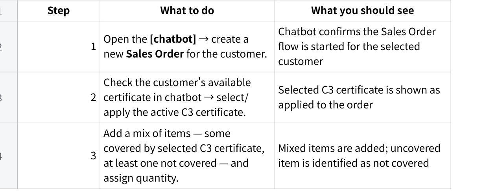

**点击图片可查看完整电子表格**

**Part B --- Get the Sales Order via Web App**

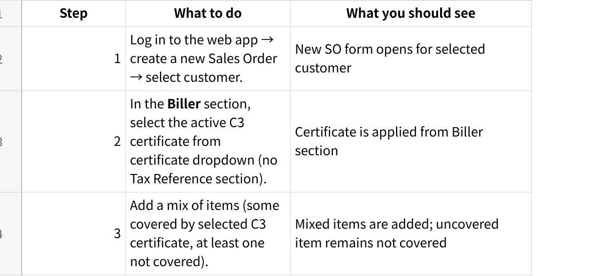

**点击图片可查看完整电子表格**

**Part C --- Apply C3 Certificate and Test Removal Prompt (both paths continue here)**

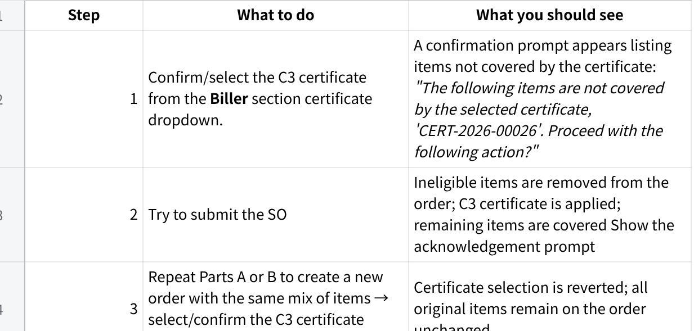

**点击图片可查看完整电子表格**

**Your result:**

~~Pass~~

Fail

Issue

**Tested by:**\
**Date:**\
**Notes:**

**Test 30 --- Link Certificate to CPO at Upload Time (C1 + C3)**

Who tests this: **\[Admin\]** or **\[Sales Manager\]**\
Channel: **FE + Chatbot**

**Part A --- via Chatbot**

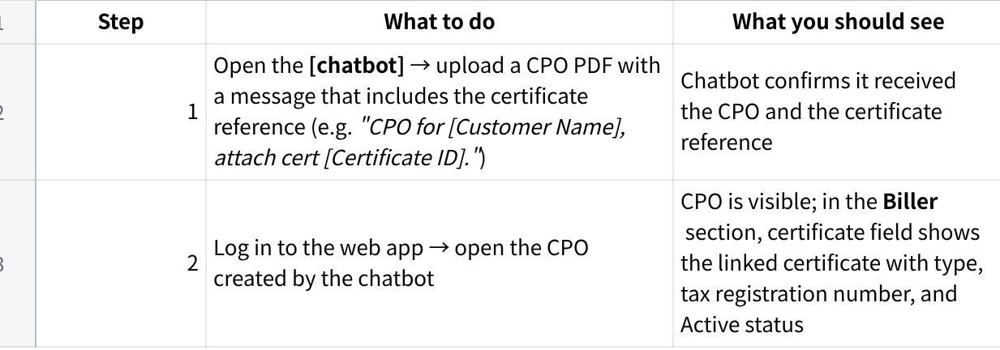

**点击图片可查看完整电子表格**

**Part B --- via Web App**

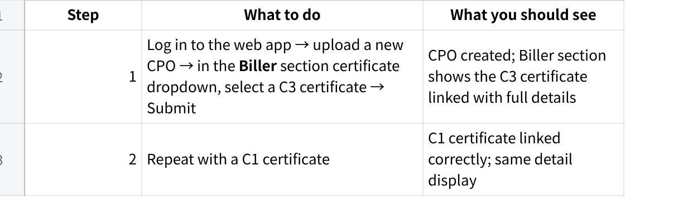

**点击图片可查看完整电子表格**

**Your result:**

Pass

Fail

Issue

**Tested by:**\
**Date:**\
**Notes:**

**Test 31 --- CPO with Certificate Converts to SO --- Cert Carries Over**

Who tests this: **\[Admin\]** or **\[Sales Manager\]**\
Channel: **FE only**

*Continue from Test 32 --- a CPO with a certificate already linked.*

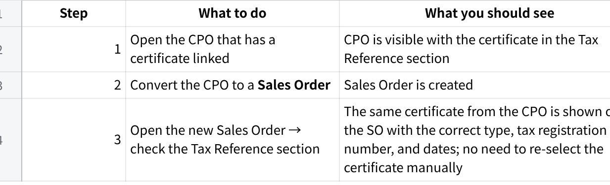

**点击图片可查看完整电子表格**

**Your result:**

~~Pass~~

Fail

Issue

**Tested by: Tam**\
**Date: 26/5/26**\
**Notes: Guan Huat**

**Test 32 --- SO Submit Blocked --- C3 Missing Required Attachments**

Who tests this: **\[Sales Manager\]** or **\[Finance / Logistics\]**\
Channel: **FE + Chatbot**

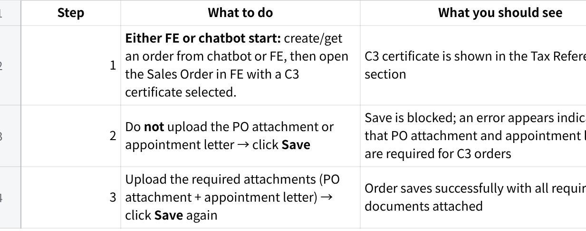

**点击图片可查看完整电子表格**

**Your result:**

~~Pass~~

Fail

Issue

**Tested by: Tam**\
**Date: 26/5/26**\
**Notes: Guan Huat**

**Test 33 --- SO Submit Blocked --- Item HS Code Not in Certificate**

Who tests this: **\[Sales Manager\]** or **\[Finance / Logistics\]**\
Channel: **FE + Chatbot**

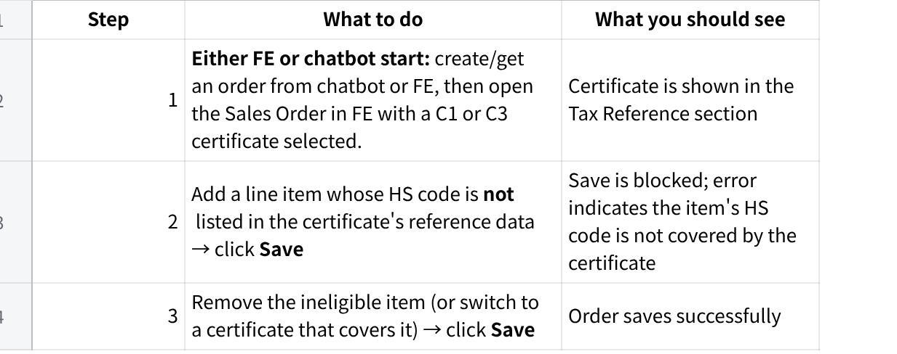

**点击图片可查看完整电子表格**

**Your result:**

~~Pass~~

Fail

Issue

**Tested by: Tam**\
**Date: 26/5/26**\
**Notes:**

**Results Summary**

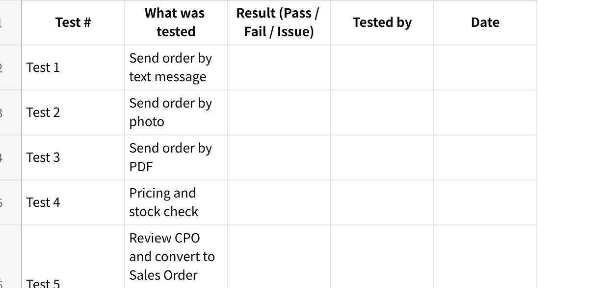

**点击图片可查看完整电子表格**

**Total: 36 tests**

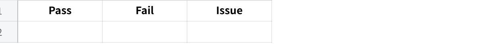

**点击图片可查看完整电子表格**

**Overall Feedback**

**Any general comments about the system?**

**Any features that were confusing or difficult to use?**

**Sign-Off**

By signing below, the Holsen team confirms that UAT has been completed and the results above are accurate.

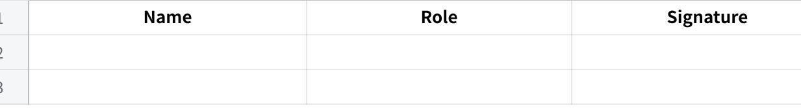

**点击图片可查看完整电子表格**

**Overall outcome:**

**Approved --- Ready to go live**

**Conditional --- Go live with the following items to fix first:**

*Conditions:*

**Not approved --- Further fixes required before go live**
