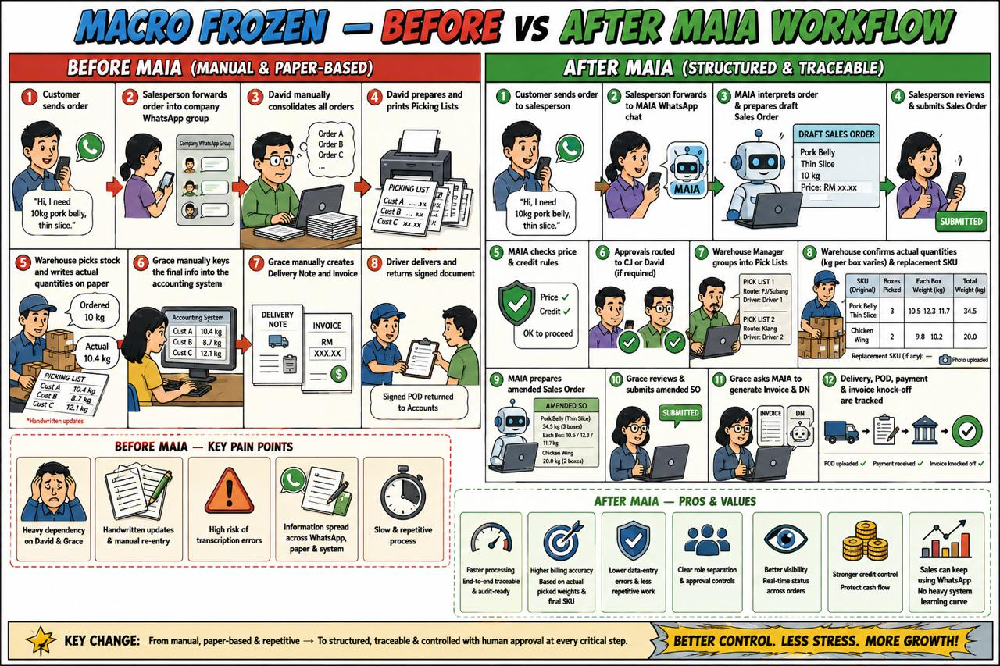
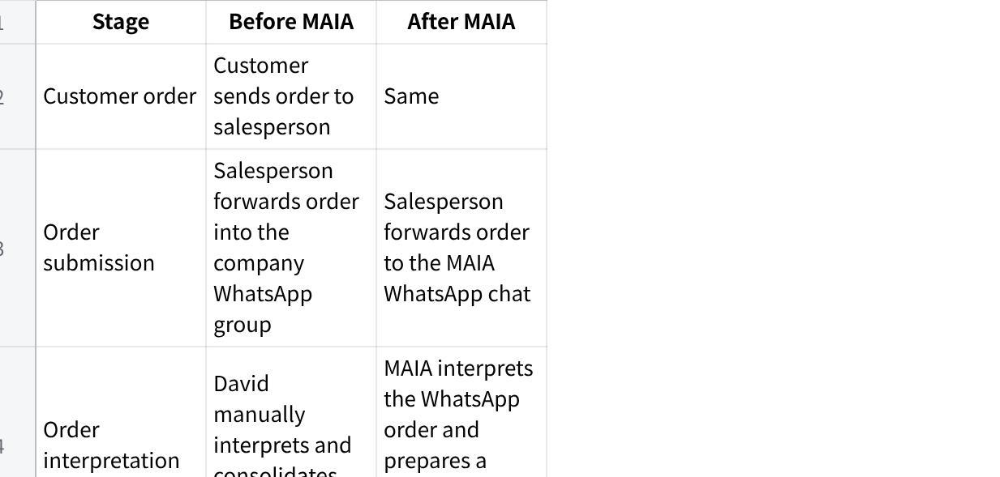
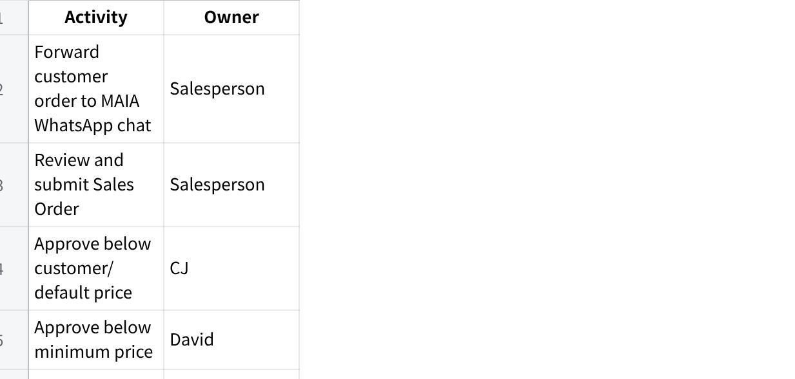

**20Jul26 - Macrofrozen Before vs After MAIA**

**Macro Frozen --- Before and After MAIA Workflow**

  --------------------- --------------------------------
  Role                  Name

  Owner                 David

  Finance               Apple

  Account               Grace

  Sales Manager         CJ

  Sales Rep             Queenie, Ben

  Warehouse Manager     Lai
  --------------------- --------------------------------

{width="5.75in" height="3.8229166666666665in"}

1.1 **Overview**

Macro Frozen's current workflow depends heavily on WhatsApp groups, printed documents, handwritten warehouse updates, manual consolidation by David, and manual accounting data entry by Grace.

MAIA is intended to create a more structured and traceable workflow while retaining human control over pricing, warehouse quantity changes, invoicing, delivery confirmation, and payment reconciliation.

The main change is:

  -----------------------------------------------------------------------
  Plain Text\
  BEFORE MAIA\
  \
  Customer sends order\
  ↓\
  Salesperson forwards order into company WhatsApp group\
  ↓\
  David manually consolidates all orders\
  ↓\
  David prepares and prints Picking Lists\
  ↓\
  Warehouse picks stock and writes actual quantities on paper\
  ↓\
  Grace manually keys the final information into the accounting system\
  ↓\
  Grace manually creates the Delivery Note and Invoice\
  ↓\
  Driver delivers and returns the signed delivery document

  -----------------------------------------------------------------------

  ----------------------------------------------------------------------
  Plain Text\
  AFTER MAIA\
  \
  Customer sends order\
  ↓\
  Salesperson forwards the order to the MAIA WhatsApp chat\
  ↓\
  MAIA interprets the order and prepares the Sales Order\
  ↓\
  Salesperson reviews and submits the Sales Order\
  ↓\
  MAIA checks pricing and credit rules\
  ↓\
  Required approvals are routed to CJ or David\
  ↓\
  Warehouse Manager groups Sales Orders into Pick Lists\
  ↓\
  Warehouse confirms actual quantity, kg per box, and replacement SKU\
  ↓\
  MAIA prepares the amended Sales Order\
  ↓\
  Grace reviews and submits the amended Sales Order\
  ↓\
  Grace asks MAIA to generate the Invoice and Delivery Note\
  ↓\
  MAIA generates the requested Invoice and Delivery Note\
  ↓\
  Delivery, POD, payment receipt, and invoice knock-off are tracked

  ----------------------------------------------------------------------

2\. **Workflow Before MAIA**

**2.1 Customer Order**

The customer sends an order to the salesperson.

The salesperson forwards the order into the company WhatsApp group.

Orders from different salespeople and customers are mixed together in the group.

David reviews the messages and manually consolidates the orders.

Orders may contain:

Informal product names.

Shorthand.

Typing mistakes.

Different units of measure.

Customer-specific cutting or packing instructions.

Incomplete product information.

**Current dependency on David**

David is the central coordinator for most orders.

He needs to:

Read the order messages.

Interpret the requested products.

Check the quantities.

Consolidate multiple orders.

Decide how orders should be grouped.

Organise delivery routes and drivers.

Prepare and print the Picking Lists.

Handle pricing or operational exceptions.

**2.2 Picking-List Preparation**

David consolidates multiple customer orders.

He prepares and prints one or more Picking Lists.

One Picking List may contain many customer orders.

A single customer may also have multiple orders on the same Picking List.

Picking Lists may be grouped according to:

Delivery route.

Driver.

Delivery area.

Delivery schedule.

Warehouse efficiency.

Example:

  --------------------------------------------------------------
  Plain Text\
  Pick List 1\
  \
  Customers:\
  - Customer A\
  - Customer B\
  - Customer C\
  \
  Driver:\
  - Driver 1\
  \
  Delivery area:\
  - PJ\
  - Subang

  --------------------------------------------------------------

  --------------------------------------------------------------
  Plain Text\
  Pick List 2\
  \
  Customers:\
  - Customer D\
  - Customer E\
  \
  Driver:\
  - Driver 2\
  \
  Delivery area:\
  - Klang

  --------------------------------------------------------------

The grouping is operationally useful, but it is manually controlled by David.

**2.3 Warehouse Picking**

David gives the printed Picking List to the warehouse.

Warehouse workers pick the physical stock.

The actual quantity picked may differ from the ordered quantity.

Warehouse workers write the actual picked quantity on the paper Picking List.

The Warehouse Manager checks the completed picking work.

Example:

  --------------------------------------------------------------
  Plain Text\
  Ordered quantity:\
  10 kg\
  \
  Actual picked quantity:\
  10.4 kg

  --------------------------------------------------------------

The completed paper Picking List becomes the operational source of truth for what was physically picked.

**2.4 Manual Data Entry into the Accounting System**

After the warehouse completes picking and records the final quantities on paper, Grace must manually transfer the information into the accounting system.

The process typically involves:

Reviewing the handwritten quantities on the completed Picking List.

Comparing the completed Picking List against the original customer orders.

Identifying any quantity differences.

Identifying any product or SKU changes.

Manually keying the final quantity into the accounting system.

Manually updating the relevant order information.

Creating the Delivery Note.

Creating the Invoice.

Checking that both documents match what the warehouse actually picked.

**Current dependency on Grace**

Grace is responsible for ensuring that:

The quantity entered into the accounting system matches the warehouse's handwritten records.

Any handwritten amendment is not missed.

The Delivery Note reflects the actual goods being delivered.

The Invoice reflects the final delivered quantity.

Any SKU changes are manually reflected correctly.

The accounting records match the physical stock movement.

There is no automatic synchronisation between the warehouse's paper records and the accounting system.

**Problems with manual data entry**

Manual data entry is slow and prone to error.

Common risks include:

Typing the wrong quantity.

Missing a handwritten amendment.

Reading unclear handwriting incorrectly.

Entering the wrong SKU.

Entering the correct quantity against the wrong customer.

Creating a Delivery Note that does not match the picked goods.

Creating an Invoice that does not match the delivered goods.

Delays between warehouse completion and document generation.

Repetitive work because the same information is written by the warehouse and typed again by Accounts.

Increased dependency on Grace to detect and correct discrepancies.

The current process is therefore:

  -----------------------------------------------------------------
  Plain Text\
  Customer order\
  ↓\
  Salesperson sends order into WhatsApp group\
  ↓\
  David consolidates orders\
  ↓\
  David creates and prints Picking List\
  ↓\
  Warehouse picks stock\
  ↓\
  Warehouse writes actual quantity on paper\
  ↓\
  Grace manually keys the information into the accounting system\
  ↓\
  Grace creates Delivery Note\
  ↓\
  Grace creates Invoice\
  ↓\
  Driver delivers\
  ↓\
  Signed delivery document is returned

  -----------------------------------------------------------------

**2.5 Delivery Note and Invoice Preparation**

Once Grace completes the manual data entry:

Grace creates the Delivery Note in the accounting system.

Grace creates the Invoice.

The documents are checked against the warehouse's handwritten quantities.

The Delivery Note is printed.

The goods and Delivery Note are assigned to the relevant driver.

The driver delivers according to the assigned route.

The Delivery Note and Invoice must be prepared after picking because the final weight may differ from the original order.

**2.6 Delivery Confirmation**

The driver delivers the goods to the customer.

The customer signs the Delivery Order or Delivery Note.

The driver sends or returns the signed document.

The signed document acts as Proof of Delivery.

Accounts retains or files the signed document as evidence that delivery was completed.

Delivery confirmation therefore depends on a physical signed document.

**2.7 Credit and New-Order Control**

Macro Frozen currently applies a strict credit-control practice.

Before a customer can place a new order:

The customer's previous Invoice must be cleared.

If the previous Invoice remains unpaid, the next order may be blocked.

Grace or Finance checks whether payment has been received.

Once the Invoice is cleared, the customer may place another order.

The customer's credit limit is generally set based on their average order value.

Example:

  --------------------------------------------------------------
  Plain Text\
  Average customer order:\
  RM5,000\
  \
  Indicative credit limit:\
  RM5,000

  --------------------------------------------------------------

The practical intention is to prevent the customer from accumulating several unpaid orders at the same time.

3\. **Problems in the Workflow Before MAIA**

**3.1 Heavy Dependence on David**

David is involved in:

Reading orders.

Interpreting WhatsApp messages.

Consolidating multiple orders.

Preparing Picking Lists.

Grouping orders by driver and route.

Coordinating warehouse work.

Handling exceptions.

Monitoring pricing and customer issues.

This makes David the main operational bottleneck.

If David is unavailable, the order flow may slow down or stop.

**3.2 Heavy Dependence on Grace**

Grace must manually transfer warehouse information into the accounting system before documents can be generated.

This makes Grace responsible for:

Reading handwritten changes.

Comparing ordered and picked quantities.

Correcting quantity differences.

Updating final SKU information.

Creating the Delivery Note.

Creating the Invoice.

Checking that all documents match.

If Grace is busy or unavailable, document preparation and delivery may be delayed.

**3.3 Orders Are Unstructured**

Orders arrive as WhatsApp messages and may use inconsistent language.

This creates risks such as:

Wrong product interpretation.

Wrong quantity.

Wrong unit of measure.

Missing special instructions.

Duplicate orders.

Orders being overlooked in the group.

**3.4 Limited Traceability**

It may be difficult to identify:

Who submitted the order.

Who changed the quantity.

Why the final quantity changed.

Who approved a price.

Who selected a replacement SKU.

When picking was completed.

When the Delivery Note was created.

When delivery was completed.

Whether payment was verified.

The information is spread across:

WhatsApp.

Printed paper.

Handwritten notes.

The accounting system.

Physical signed delivery documents.

**3.5 Manual Quantity Amendments**

Warehouse workers write actual picked quantities on paper.

Grace must then manually update the accounting system.

This creates risks such as:

Wrong quantity on the Delivery Note.

Wrong quantity on the Invoice.

Missed handwritten changes.

Differences between paper and the accounting system.

Billing the ordered quantity instead of the delivered quantity.

Delayed document generation.

**3.6 Duplicate Data Entry**

The same information is handled several times:

The salesperson sends the customer order.

David consolidates it.

Warehouse writes the actual quantity.

Grace types the final quantity into the accounting system.

This duplication increases processing time and the likelihood of errors.

**3.7 Limited Role Separation**

The current workflow depends more on personal coordination than system permissions.

There may not be clear system controls over:

Who can see customer records.

Who can approve price changes.

Who can edit credit terms.

Who can edit credit limits.

Who can see product cost.

Who can amend Sales Orders.

Who can submit financial documents.

**3.8 Credit Control Is Strict but Manual**

The rule that a customer must clear their previous Invoice before placing a new order protects cash flow.

However, without system-based controls:

Sales may not immediately know that the customer is blocked.

Credit status may depend on manual checking.

A customer may have paid, but the payment may not yet be verified.

New orders may be delayed while waiting for Grace or Finance.

Exceptions may be handled inconsistently.

4\. **Workflow After MAIA**

**4.1 Customer Order and Sales-Order Creation**

The customer sends an order to the salesperson.

The salesperson forwards the customer's order to the **MAIA WhatsApp chat**.

MAIA interprets the WhatsApp message and prepares a draft Sales Order.

The salesperson reviews:

Customer.

Product.

SKU.

Quantity.

Unit of measure.

Price.

Additional notes.

The salesperson corrects any incorrect interpretation.

The salesperson submits the Sales Order through the MAIA WhatsApp chat.

The Sales Order may be entered in:

Box.

Pieces.

Carton.

Kilogram.

  --------------------------------------------------------------
  Plain Text\
  Customer sends order to salesperson\
  ↓\
  Salesperson forwards order to MAIA WhatsApp chat\
  ↓\
  MAIA interprets the order\
  ↓\
  MAIA prepares a draft Sales Order\
  ↓\
  Salesperson reviews and corrects\
  ↓\
  Salesperson submits through MAIA

  --------------------------------------------------------------

**4.2 Price Check and Approval**

MAIA checks the submitted price against the applicable pricing rules.

**Normal approved price**

If the salesperson uses the approved customer price or default price:

  --------------------------------------------------------------
  Plain Text\
  Salesperson submits Sales Order\
  ↓\
  Sales Order proceeds

  --------------------------------------------------------------

**Below default or customer-specific price**

If the salesperson uses a price below the default or customer-specific price, but not below the minimum price:

  --------------------------------------------------------------
  Plain Text\
  Salesperson create Sales Order\
  ↓\
  Salesperson seeks CJ\'s approval on special price\
  ↓\
  CJ approves by submitting the Sales Order, or rejects

  --------------------------------------------------------------

**Below minimum price**

If the salesperson uses a price below the minimum price:

  --------------------------------------------------------------
  Plain Text\
  Salesperson create Sales Order\
  ↓\
  Salesperson seeks David\'s approval on special price\
  ↓\
  David approves by submitting the Sales Order, or rejects

  --------------------------------------------------------------

**4.3 Credit Check**

Before the Sales Order proceeds, MAIA should check:

Outstanding Invoice balance.

Credit limit.

Overdue status.

Whether the previous Invoice has been cleared.

Whether the customer is allowed to place another order.

Macro Frozen's current business rule is:

  --------------------------------------------------------------
  Plain Text\
  Previous Invoice remains unpaid\
  ↓\
  New order is blocked

  --------------------------------------------------------------

The customer's credit limit should generally be based on the customer's average order value.

Possible treatment:

  --------------------------------------------------------------
  Plain Text\
  Average order value:\
  RM5,000\
  \
  Credit limit:\
  RM5,000\
  \
  Current outstanding:\
  RM5,000\
  \
  Available credit:\
  RM0\
  \
  New order:\
  Blocked

  --------------------------------------------------------------

**4.4 Warehouse Manager Reviews Sales Orders**

Every morning, Ah Lai or the Warehouse Manager:

Views the available Sales Orders.

Selects which Sales Orders should be grouped together.

Allocates the Sales Orders into one or more Pick Lists.

The grouping may be based on:

Delivery route.

Driver.

Customer location.

Delivery date.

Delivery area.

Warehouse efficiency.

One Pick List may contain:

Multiple Sales Orders.

Multiple customers.

Multiple Sales Orders belonging to the same customer.

**4.5 Pick-and-Pack Preparation**

Sales Orders may be submitted using different units of measure:

Box.

Pieces.

Carton.

Kilogram.

Regardless of the Sales Order unit, the warehouse will return and confirm the actual picked quantity in kilograms.

However, the warehouse does not only need the total weight. The warehouse also needs the **kilograms per box**.

The warehouse should therefore be able to capture:

Original Sales Order unit.

Original ordered quantity.

Number of boxes.

Kilograms per box.

Actual total kilograms.

Example:

  --------------------------------------------------------------
  Plain Text\
  Sales Order:\
  2 cartons\
  \
  Warehouse confirmation:\
  4 boxes\
  12 kg per box\
  48 kg total

  --------------------------------------------------------------

Another example:

  --------------------------------------------------------------
  Plain Text\
  Sales Order:\
  3 boxes\
  \
  Warehouse confirmation:\
  8.5 kg per box\
  25.5 kg total

  --------------------------------------------------------------

The kilograms-per-box value is operationally important because the warehouse packs and handles physical boxes, not only total weight.

**4.6 SKU Replacement During Picking or Packing**

The warehouse may only discover during picking or packing that the ordered SKU is unavailable.

Example:

  --------------------------------------------------------------
  Plain Text\
  Original SKU:\
  Brand A French Fries\
  \
  Warehouse finding:\
  No stock available\
  \
  Replacement SKU:\
  Brand B French Fries

  --------------------------------------------------------------

The proposed workflow is:

The warehouse identifies that the original SKU is unavailable.

The warehouse selects a replacement SKU.

The replacement SKU is recorded in MAIA.

The replacement SKU is reflected in the Pick List.

The confirmed replacement flows into the amended Sales Order.

After Grace submits the amended Sales Order, the final Delivery Note and Invoice use the approved replacement SKU.

The SKU replacement should not remain only as a handwritten note.

The system should retain:

Original SKU.

Replacement SKU.

User who made the change.

Reason for the replacement.

Approval status, where required.

**4.7 Pick-List Generation**

The confirmed order information is used to generate the Pick List.

The Pick List should include:

Customer name.

Sales Order number.

SKU.

Product description.

Salesperson's product wording.

Additional Sales Order notes.

Ordered quantity.

Ordered unit.

Number of boxes.

Kilograms per box.

Expected or actual total kilograms.

Replacement SKU, where applicable.

Delivery route.

Assigned driver.

Warehouse remarks.

**Why customer name is required**

A Pick List can contain multiple Sales Orders.

A single customer can also have multiple Sales Orders.

Showing the customer name helps warehouse staff separate, pick, and pack the goods correctly.

**Why Sales Order notes are required**

Warehouse staff may not recognise the formal SKU name.

They may better understand the wording used by the salesperson, such as:

Thin slice.

Skin on.

Small pack.

Customer-specific cut.

Special packaging instruction.

These notes should therefore appear on the Pick List.

**4.8 Warehouse Picking and Confirmation**

The Warehouse Manager prints the Pick List.

Warehouse workers pick and pack the goods.

The actual physical quantity is recorded.

The number of boxes is recorded.

The kilograms per box are recorded.

Any replacement SKU is recorded.

The Warehouse Manager checks the completed work.

The Warehouse Manager confirms that the physical goods match the completed Pick List.

The Warehouse Manager takes a photo of the completed Pick List.

The Warehouse Manager submits the completed Pick List to MAIA.

**4.9 Sales-Order Amendment**

Once the Pick List is confirmed, MAIA should prepare the Sales Order amendment based on the warehouse-confirmed information.

The amendment may include:

Actual quantity in kilograms.

Number of boxes.

Kilograms per box.

Replacement SKU.

Warehouse remarks.

Final packing information.

Example:

  --------------------------------------------------------------
  Plain Text\
  Original Sales Order:\
  SKU A\
  10 kg\
  \
  Confirmed Pick List:\
  SKU B\
  10.4 kg\
  \
  Amended Sales Order prepared by MAIA:\
  SKU B\
  10.4 kg

  --------------------------------------------------------------

Grace should not need to manually re-enter these changes into the accounting system.

Instead:

  --------------------------------------------------------------
  Plain Text\
  Warehouse confirms Pick List\
  ↓\
  MAIA identifies the final quantity and SKU\
  ↓\
  MAIA prepares the amended Sales Order\
  ↓\
  Grace reviews the amendment\
  ↓\
  Grace submits the amended Sales Order

  --------------------------------------------------------------

This removes repetitive manual data entry while retaining Grace as the final control.

**4.10 Grace's Finance Review**

Once MAIA prepares the amended Sales Order:

Grace receives a notification.

Grace reviews the amended Sales Order.

Grace checks:

Original SKU.

Final SKU.

Original quantity.

Final quantity.

Number of boxes.

Kilograms per box.

Price.

Pricing approval status.

Credit status.

Grace submits the amended Sales Order.

Grace acts as the final control point before the Invoice and Delivery Note are requested.

**4.11 Invoice and Delivery Note Generation**

MAIA does **not** automatically generate the Invoice or Delivery Note when Grace submits the amended Sales Order.

The intended workflow is:

Grace reviews and submits the amended Sales Order.

Grace asks MAIA to generate the Invoice and Delivery Note.

MAIA prepares the requested documents.

Grace reviews the generated documents.

Grace submits or confirms the documents.

The warehouse prints the Delivery Note.

The Delivery Note is given to the driver.

The driver receives the goods assigned to the delivery route.

  --------------------------------------------------------------
  Plain Text\
  Grace submits amended Sales Order\
  ↓\
  No Invoice or Delivery Note is generated automatically\
  ↓\
  Grace asks MAIA to generate Invoice and Delivery Note\
  ↓\
  MAIA generates the requested documents\
  ↓\
  Grace reviews and submits\
  ↓\
  Warehouse prints Delivery Note\
  ↓\
  Driver begins delivery

  --------------------------------------------------------------

This ensures that document generation remains an explicit action controlled by Grace.

The documents should reflect:

Final approved SKU.

Actual warehouse-confirmed quantity.

Number of boxes, where relevant.

Kilograms per box, where relevant.

Final approved pricing.

**4.12 Delivery and Proof of Delivery**

The driver delivers the goods.

The customer signs the delivery document.

The driver submits the signed Proof of Delivery.

Accounts uploads the Proof of Delivery to MAIA.

MAIA attaches the POD to the relevant order.

MAIA marks the delivery as completed.

The order should not be marked as delivered solely because the Delivery Note was generated.

**4.13 Payment and Invoice Knock-Off**

The customer submits payment proof.

Sales or Accounts uploads the payment proof to MAIA.

MAIA creates a draft payment receipt.

Grace checks the company bank account.

Grace confirms that the money has been received.

Grace submits the payment receipt.

The payment is used to knock off the Invoice.

The customer's outstanding balance is updated.

The customer's available credit is updated.

The customer may proceed with the next order, subject to the applicable credit rules.

5\. **End-to-End Workflow Comparison**

**点击图片可查看完整电子表格**

6\. **Roles After MAIA**

**6.1 David --- Owner**

**Responsibilities**

Oversees the full operation.

Reviews major exceptions.

Approves prices below the minimum price.

Monitors sales, warehouse, delivery, and financial activity.

**Permissions**

David can view:

All leads.

All prospects.

All customers.

All Sales Orders.

All approvals.

Warehouse progress.

Delivery status.

Financial status.

**Approvals**

David approves:

Selling prices below the minimum price.

Exceptional commercial decisions.

High-risk overrides, where required.

**Benefits**

No longer needs to consolidate every order manually.

Does not need to prepare every Pick List.

Can focus on exceptions and higher-risk decisions.

Gains visibility without coordinating every routine activity.

**Risks**

David may remain a bottleneck if too many transactions require approval.

Pricing rules must be configured correctly.

Staff may continue using the company WhatsApp group instead of forwarding orders to the MAIA WhatsApp chat unless the workflow is enforced.

**6.2 CJ --- Sales Manager**

**Responsibilities**

Oversees the sales team.

Reviews pricing exceptions.

Monitors customer and Sales Order activity.

Supports salespeople where approval is needed.

**Permissions**

CJ can view:

All salespeople's leads.

All prospects.

All customers.

All Sales Orders.

Pending sales approvals.

**Approvals**

CJ approves:

Prices below the default selling price.

Prices below the customer-specific price.

Prices that remain above the minimum price.

**Benefits**

Clear sales-team visibility.

Formal approval queue.

Better pricing discipline.

Reduced need to search through WhatsApp group messages.

**Risks**

CJ may receive too many approval requests if pricing data is not maintained.

The distinction between default, customer, and minimum prices must be clear.

The system must prevent CJ from approving prices below the minimum.

**6.3 Queenie, Ben --- Salesperson / Sales Rep**

**Responsibilities**

Receives customer orders.

Forwards customer orders to the MAIA WhatsApp chat.

Reviews MAIA's interpretation.

Corrects any incorrectly interpreted information.

Submits Sales Orders through MAIA.

Maintains leads and prospects.

Converts leads or prospects into customers.

Uploads customer payment proof where applicable.

Follows up on inactive or recurring customers.

**Permissions**

A salesperson can view only their own:

Leads.

Prospects.

Customers.

Sales Orders.

A salesperson can:

Create leads.

Create prospects.

Convert leads or prospects into customers.

Forward orders to the MAIA WhatsApp chat.

Review MAIA-generated Sales Order drafts.

Submit Sales Orders.

View their own customers' credit status.

Upload payment proof.

A salesperson cannot:

Create a customer directly from a raw record.

View another salesperson's customers.

Edit credit terms.

Edit credit limits.

Bypass pricing approvals.

Approve their own pricing exception.

**Benefits**

The salesperson can continue working through WhatsApp.

Faster order entry.

Less manual retyping.

Clear approval status.

Better visibility of customer credit issues.

Recurring-order reminders.

Inactive-customer reminders.

CRM notes and customer history.

Lower duplicate-customer risk.

**Risks**

Salespeople must review MAIA's interpretation carefully.

Forwarding the wrong message or incomplete order may create an inaccurate draft.

Incorrect SKU selection remains possible where product names are ambiguous.

Orders may be delayed while approvals are pending.

Strict credit controls may block urgent orders.

Staff may continue forwarding orders to the old internal group instead of MAIA.

**6.4 Apple --- Finance**

**Responsibilities**

Sets customer credit limits.

Maintains finance-related customer settings.

Controls customer credit terms.

Ensures customer financial settings are accurate.

**Permissions**

Apple can manage:

Credit limits.

Credit terms.

Credit-control settings.

Finance-related customer configuration.

**Benefits**

Central control over customer credit exposure.

Reduced unauthorised changes by Sales.

Better separation between Sales and Finance.

More consistent application of credit rules.

**Risks**

Credit limits based only on average order value may not reflect total payment risk.

Zero-credit-limit treatment must be clearly defined.

Incorrect settings may block valid orders or allow excessive exposure.

**6.5 Grace --- Accounts / Finance User**

**Responsibilities**

Receives completed Pick-List notifications.

Reviews the Sales Order amendment prepared by MAIA.

Confirms the final quantity and SKU.

Submits the amended Sales Order.

Asks MAIA to generate the Invoice and Delivery Note.

Reviews the generated Invoice and Delivery Note.

Submits or confirms the financial documents.

Uploads Proof of Delivery.

Reviews payment proof.

Confirms receipt of money in the bank.

Submits payment receipts.

Knocks off Invoices.

**Permissions**

Grace can:

Review warehouse-confirmed quantities.

Review Sales Order amendments.

Submit amended Sales Orders.

Request MAIA to generate an Invoice.

Request MAIA to generate a Delivery Note.

Review and submit financial documents.

Confirm payment receipts.

Perform Invoice knock-off.

**Explicit document-generation control**

Submitting the amended Sales Order does not automatically generate the Invoice or Delivery Note.

Grace must separately instruct MAIA to generate them.

  --------------------------------------------------------------
  Plain Text\
  Grace submits amended Sales Order\
  ↓\
  Grace asks MAIA to generate Invoice and DN\
  ↓\
  MAIA generates the documents\
  ↓\
  Grace reviews and submits

  --------------------------------------------------------------

**Benefits**

No need to manually re-enter warehouse quantities.

Lower risk of transcription errors.

Faster document preparation.

Grace retains control over when financial documents are generated.

Better control before invoicing.

Clear relationship between Sales Order, Pick List, Delivery Note, Invoice, POD, and payment.

Easier audit trail.

Payment receipts can be drafted automatically.

**Risks**

Grace may become a bottleneck if every order requires individual review and a separate generation request.

Automatic amendments must be clearly highlighted.

SKU and quantity changes must be easy to compare.

MAIA must not generate the Invoice or Delivery Note before Grace requests it.

MAIA must not submit financial documents without Grace's confirmation.

Bank verification remains a manual step.

**6.6 Lai --- Warehouse Manager**

**Responsibilities**

Reviews Sales Orders each morning.

Groups Sales Orders into Pick Lists.

Organises Pick Lists by route, area, driver, or date.

Prints Pick Lists.

Assigns work to warehouse workers.

Reviews completed picking.

Confirms actual quantities.

Records kilograms per box.

Records replacement SKUs.

Uploads completed Pick Lists to MAIA.

**Permissions**

Ah Lai can view:

Sales Orders.

Product information required for picking.

Pick Lists.

Customer names.

Sales Order notes.

Delivery information.

Ah Lai can:

Group Sales Orders.

Generate Pick Lists.

Confirm quantities.

Record kilograms per box.

Record replacement SKUs.

Upload completed Pick Lists.

Ah Lai cannot view:

Product cost price.

Product margin.

Sensitive customer financial information.

Accounting records unrelated to warehouse work.

**Benefits**

Better visibility of all orders requiring picking.

Easier grouping by delivery route and driver.

Clear customer and Sales Order references.

Structured quantity confirmation.

Ability to record replacement SKUs.

Reduced dependence on David.

**Risks**

The warehouse still depends on printed Pick Lists unless a digital workflow is adopted.

Handwriting may be difficult for MAIA to interpret.

Unit conversions must be configured correctly.

Warehouse users must understand the difference between:

Number of boxes.

Kilograms per box.

Total kilograms.

SKU replacement may require approval.

**6.7 Warehouse Workers**

**Responsibilities**

Receive the Pick List.

Pick the products.

Pack the products.

Record or confirm actual quantities.

Inform the Warehouse Manager when stock is unavailable.

Follow customer-specific preparation notes.

**Permissions**

Warehouse workers may see:

Customer name.

SKU.

Product description.

Sales notes.

Ordered quantity.

Packing instructions.

Route or delivery grouping.

Warehouse workers should not see:

Product cost.

Margin.

Customer credit information.

Sensitive financial data.

Internal pricing approvals.

**Benefits**

Clearer picking instructions.

Customer names displayed on Pick Lists.

Additional Sales Order notes.

Less confusion over formal SKU names.

Better handling of multiple orders on one Pick List.

**Risks**

Printed documents can be lost or damaged.

Handwriting may remain ambiguous.

Notes must be captured accurately.

Workers may select an incorrect replacement SKU without clear rules.

**6.8 Driver**

**Responsibilities**

Receives the goods and Delivery Note.

Delivers according to the assigned route.

Obtains the customer's signature.

Returns or sends the signed Proof of Delivery.

**Permissions**

The driver should only receive:

Delivery route.

Customer address.

Customer contact.

Delivery Note.

Delivery instructions.

Goods assigned for delivery.

The driver should not see:

Product cost.

Customer credit limit.

Internal pricing approvals.

Internal financial information.

**Benefits**

Clearer route assignment.

Correct delivery documents linked to each order.

Easier POD submission.

Reduced risk of carrying the wrong documents.

**Risks**

POD quality may be poor if submitted as a low-quality photo.

The driver may forget to obtain a signature.

Failed or partial deliveries require a separate exception process.

7\. **Advantages of the Workflow After MAIA**

**7.1 Salespeople Can Continue Using WhatsApp**

Salespeople do not need to switch to a complex ERP interface for daily order submission.

They can:

Receive the customer's order.

Forward it to the MAIA WhatsApp chat.

Review MAIA's interpretation.

Submit the Sales Order.

This reduces the change required in the salesperson's day-to-day behaviour.

**7.2 Reduced Dependence on David**

Routine order consolidation and Pick-List preparation move away from David.

David mainly handles:

Minimum-price approvals.

Major exceptions.

Overall oversight.

**7.3 Reduced Manual Data Entry for Grace**

MAIA prepares the amended Sales Order based on the completed Pick List.

Grace no longer needs to manually retype:

Final quantity.

Kilograms per box.

Number of boxes.

Replacement SKU.

Warehouse remarks.

Grace reviews and submits instead of recreating the transaction manually.

**7.4 Grace Retains Control of Document Generation**

MAIA does not automatically create the Invoice or Delivery Note when the amended Sales Order is submitted.

Grace decides when the documents should be generated by asking MAIA to generate them.

This prevents documents from being created prematurely or without Accounts' knowledge.

**7.5 Lower Data-Entry Error Risk**

The warehouse-confirmed information flows into the amended Sales Order and requested downstream documents.

This reduces the risk of:

Typing mistakes.

Missed handwritten amendments.

Wrong SKU entry.

Wrong quantity on the Invoice.

Wrong quantity on the Delivery Note.

Documents being created against the wrong customer.

**7.6 Better Role Separation**

**点击图片可查看完整电子表格**

**7.7 Better Billing Accuracy**

The Invoice is based on the warehouse-confirmed physical quantity and final SKU.

This reduces:

Underbilling.

Overbilling.

Billing an unavailable SKU.

Billing the original quantity instead of the delivered quantity.

**7.8 Stronger Audit Trail**

MAIA can record:

Who forwarded the order to the MAIA WhatsApp chat.

Who reviewed and submitted the Sales Order.

Who approved the price.

Who grouped the Pick List.

What quantity the warehouse confirmed.

Whether the SKU changed.

Who submitted the amended Sales Order.

When Grace requested the Invoice and Delivery Note.

When the documents were generated.

When the POD was uploaded.

Who verified the payment.

**7.9 Better Credit Control**

Credit rules can be checked before an order proceeds.

This supports Macro Frozen's policy that customers should clear their previous Invoice before placing another order.

**7.10 Improved Warehouse Visibility**

Warehouse staff receive clearer information, including:

Customer name.

Sales Order number.

Product notes.

Ordered unit.

Number of boxes.

Kilograms per box.

Actual kilograms.

Replacement SKU.

Driver or route grouping.

**7.11 Faster Processing**

Removing repeated manual re-entry should reduce the time between:

  --------------------------------------------------------------
  Plain Text\
  Warehouse completes picking\
  ↓\
  MAIA prepares amended Sales Order\
  ↓\
  Grace reviews and submits\
  ↓\
  Grace asks MAIA to generate Invoice and DN\
  ↓\
  MAIA generates the requested documents

  --------------------------------------------------------------

8\. **Disadvantages and Risks of the Workflow After MAIA**

**8.1 More Structured Steps**

The new workflow introduces formal stages:

Forwarding the order to the MAIA WhatsApp chat.

Reviewing MAIA's interpretation.

Sales Order submission.

Price approval.

Credit check.

Pick-List grouping.

Warehouse confirmation.

Sales Order amendment.

Grace's submission.

Separate Invoice and DN generation request.

Document review.

POD upload.

Payment verification.

This improves control but may initially feel slower than forwarding everything into one company WhatsApp group.

**8.2 Approval Bottlenecks**

Orders may be delayed if:

CJ does not approve pricing quickly.

David is unavailable.

Grace has many amendments waiting for review.

Grace has not yet requested the Invoice and DN.

Apple has not updated the credit limit.

Notifications and escalation rules will be needed.

**8.3 Dependence on Correct WhatsApp Forwarding**

The workflow depends on salespeople forwarding the correct customer order to the MAIA WhatsApp chat.

Risks include:

Forwarding only part of the customer's message.

Missing an image or attachment.

Forwarding an outdated message.

Forwarding the message to the wrong MAIA chat.

Submitting the draft without checking MAIA's interpretation.

**8.4 Dependence on Correct Master Data**

The workflow depends on accurate:

SKU records.

Product names.

Units of measure.

Kilograms-per-box values.

Customer prices.

Minimum prices.

Credit limits.

Customer ownership.

Delivery information.

Incorrect master data can produce incorrect approvals, Pick Lists, and documents.

**8.5 Unit-of-Measure Complexity**

An order may be entered in box, pieces, carton, or kilogram, while the warehouse confirms in kilograms.

The system must clearly separate:

  --------------------------------------------------------------
  Plain Text\
  Ordered unit\
  Ordered quantity\
  Number of boxes\
  Kilograms per box\
  Total kilograms

  --------------------------------------------------------------

A confusing interface may introduce new errors.

**8.6 SKU-Replacement Control**

Allowing the warehouse to replace an SKU is operationally useful but creates risks:

Different selling price.

Different cost.

Different product specification.

Customer dissatisfaction.

Incorrect Invoice.

Unapproved substitution.

The workflow must define whether approval is required from:

Sales.

CJ.

David.

Customer.

Grace.

**8.7 Continued Use of Paper**

The proposed process still uses a printed Pick List and a photo upload.

Some current risks therefore remain:

Illegible handwriting.

Missing paper.

Incomplete photographs.

Incorrect photographs.

Delayed uploads.

Manual interpretation errors.

**8.8 Grace May Still Become a Bottleneck**

Although manual data entry is reduced, Grace remains the final control point for:

Sales Order amendments.

Requesting Invoice and DN generation.

Reviewing the generated documents.

Payment receipts.

Invoice knock-off.

The workflow should make each action fast and clear.

**8.9 Invoice and DN Generation Can Be Delayed**

Because MAIA does not automatically generate the Invoice and Delivery Note, the documents will not be created until Grace explicitly requests them.

This provides stronger control but creates a possible delay if:

Grace does not see the notification.

Grace submits the amended Sales Order but forgets to request the documents.

Grace is unavailable.

There are many completed orders in the queue.

MAIA should therefore clearly remind Grace that the amended Sales Order has been submitted but the Invoice and DN have not yet been requested.

**8.10 Strict Credit Rules May Block Sales**

The rule requiring customers to clear previous Invoices protects cash flow but may also:

Delay legitimate repeat orders.

Create customer dissatisfaction.

Require frequent overrides.

Cause lost sales where payment has been made but not yet verified.

A controlled exception process may be required.

9\. **Final After-MAIA Workflow**

  --------------------------------------------------------------
  Plain Text\
  Customer sends order to salesperson\
  ↓\
  Salesperson forwards order to MAIA WhatsApp chat\
  ↓\
  MAIA interprets order and prepares draft Sales Order\
  ↓\
  Salesperson reviews, corrects, and submits\
  ↓\
  MAIA checks price and credit\
  ↓\
  CJ or David approves, where required\
  ↓\
  Warehouse Manager reviews Sales Orders\
  ↓\
  Warehouse Manager groups Sales Orders into Pick Lists\
  ↓\
  Warehouse prints Pick List\
  ↓\
  Warehouse picks and packs goods\
  ↓\
  Warehouse confirms:\
  - actual quantity in kg\
  - number of boxes\
  - kg per box\
  - replacement SKU, where applicable\
  ↓\
  Warehouse Manager uploads completed Pick List\
  ↓\
  MAIA prepares amended Sales Order\
  ↓\
  Grace reviews and submits amended Sales Order\
  ↓\
  Grace asks MAIA to generate Invoice and Delivery Note\
  ↓\
  MAIA generates Invoice and Delivery Note\
  ↓\
  Grace reviews and submits documents\
  ↓\
  Warehouse prints Delivery Note\
  ↓\
  Driver delivers goods\
  ↓\
  Driver returns signed Proof of Delivery\
  ↓\
  Accounts uploads POD to MAIA\
  ↓\
  Delivery is marked completed\
  ↓\
  Customer submits payment proof\
  ↓\
  Sales or Accounts uploads payment proof\
  ↓\
  MAIA creates draft payment receipt\
  ↓\
  Grace checks the bank\
  ↓\
  Grace submits payment receipt\
  ↓\
  Invoice is knocked off

  --------------------------------------------------------------

10\. **Summary**

**Before MAIA**

Macro Frozen's workflow is flexible but highly manual.

David coordinates the order and warehouse process through:

The company WhatsApp group.

Manual order consolidation.

Printed Picking Lists.

Driver and route planning.

Warehouse staff record actual quantities by hand.

Grace then manually keys the final information into the accounting system before creating the Delivery Note and Invoice.

The process works because experienced staff understand the operation, but it is:

Slow.

Repetitive.

Prone to manual data-entry errors.

Highly dependent on David and Grace.

Difficult to trace from start to finish.

**After MAIA**

The workflow becomes structured and role-based while retaining WhatsApp as the main Sales interface:

  --------------------------------------------------------------
  Plain Text\
  Customer order\
  ↓\
  Salesperson forwards order to MAIA WhatsApp chat\
  ↓\
  MAIA prepares draft Sales Order\
  ↓\
  Salesperson reviews and submits\
  ↓\
  Price and credit checks\
  ↓\
  CJ or David approval\
  ↓\
  Warehouse Manager creates Pick List\
  ↓\
  Warehouse confirms quantity, kg per box, and final SKU\
  ↓\
  MAIA prepares amended Sales Order\
  ↓\
  Grace reviews and submits amended Sales Order\
  ↓\
  Grace asks MAIA to generate Invoice and DN\
  ↓\
  MAIA generates the requested documents\
  ↓\
  Grace reviews and submits\
  ↓\
  Driver delivers\
  ↓\
  POD is uploaded\
  ↓\
  Payment proof is uploaded\
  ↓\
  Grace verifies payment\
  ↓\
  Payment receipt is submitted\
  ↓\
  Invoice is knocked off

  --------------------------------------------------------------

The expected benefits are:

Salespeople can continue using WhatsApp.

Less manual consolidation.

Less manual accounting data entry.

Faster processing.

Better billing accuracy.

Lower transcription-error risk.

Better role separation.

Stronger audit trail.

Lower dependency on David.

Better control over pricing and credit.

Grace retains explicit control over Invoice and Delivery Note generation.

The main risks are:

Approval bottlenecks.

Salespeople forwarding incomplete or incorrect messages.

Unit-of-measure complexity.

Incorrect master data.

SKU-replacement governance.

Continued reliance on printed Pick Lists.

Grace remaining the final bottleneck for amendments, document generation requests, and Finance submission.
