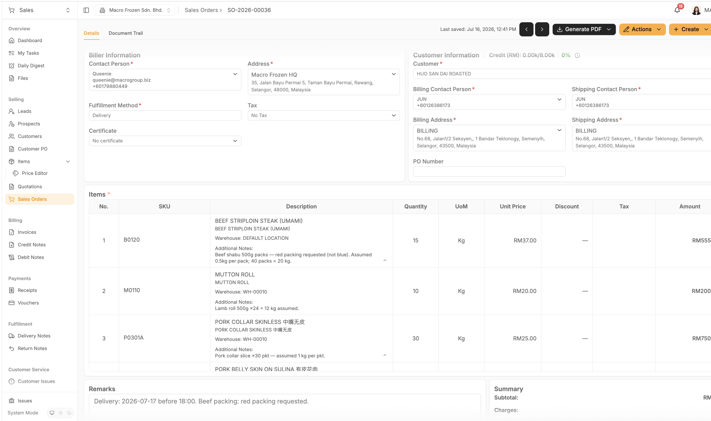
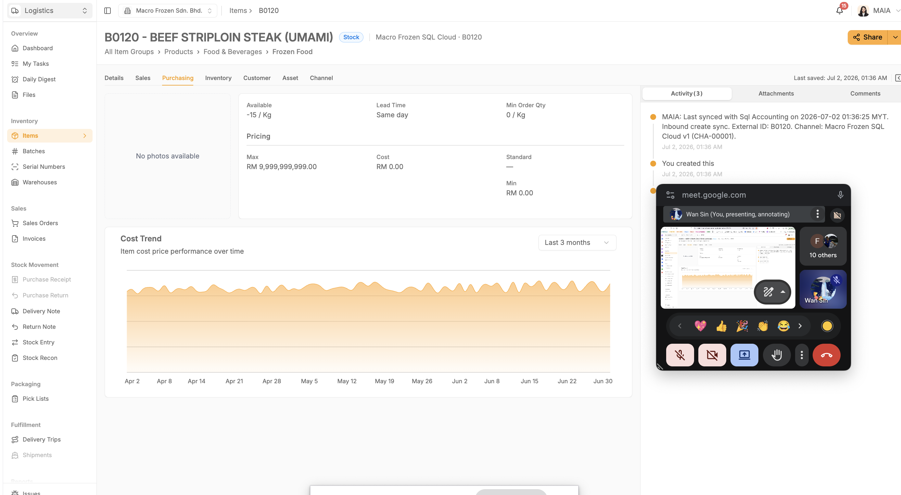

**23Jul26 - Macro Frozen Enhancement**

1\. **Pick List**

**Objective**

Improve the Pick List so warehouse staff can identify orders faster and reduce picking mistakes.

**Business Problem**

Current Pick Lists lack contextual information.

Warehouse staff currently need to infer:

Which customer each line belongs to

Which warehouse should fulfil the order (Warehouse names are more meaningful than internal codes)

Special salesperson instructions (additional notes)

Remarks are also easy to miss because they appear at the bottom of the document.

**Functional Requirements**

**1.1 Group Pick List - Detail Page**

Warehouse Manager should be able to group Pick Lists on **Web UI** by:

Customer

Sales Order

Warehouse

**1.2 Additional Columns**

Add the following to both Pick List table (UI) and Pick List PDF:

Customer Name

Additional Notes

{width="5.75in" height="3.40625in"}

**\[Screen Recording 2026-07-23 at 6.16.06 PM.mov\]**

**\[Macrofrozen-Stock-Variance.mov\]**

**1.3 Warehouse Display**

In the Pick List PDF\'s Pick Scope section, display warehouse name, not warehouse code

**1.4 Remarks Placement**

Move Remarks section.

Current

  --------------------------------------------------------------
  Plain Text\
  Bottom of page

  --------------------------------------------------------------

Expected

  ------------------------------------------------------------------------------------------------------------------------------------------------------------------------------------------------------------
  Plain Text\
  Top of page\
  \
  Remarks:\
  Walk the warehouse top-to-bottom. At each stop pick the group total and write it in the Picked Qty box; note any shortfall in Remarks. Photograph this sheet and send to MAIA (\<PL_id\> must be visible).

  ------------------------------------------------------------------------------------------------------------------------------------------------------------------------------------------------------------

Warehouse staff should see important instructions immediately.

**1.5 Pick List**

Workflow after MAIA:

User attach packaging list to the pick list

When DN generated,

User manually split rows

Print packaging list attachment and attch to the DN

Packing list (backlog) if client insists on having packing list, will charge them as customisation

Suggested approach:

Chatbot text based (11+12.5+13+12+12+\.....=50kg)

Excel processing

[packging list 2026](https://eg69120xnei.sg.larksuite.com/sheets/UI4tsbVDyhncJ7t3Em8lMTIUg3c?from=from_copylink&sheet=16oPoZ)

[CamScanner 06-08-2026 18.35.pdf](https://eg69120xnei.sg.larksuite.com/file/RUf1bfCzzo0OA4xlMrAlZElZgte)

[AGF INV2606-150.pdf](https://eg69120xnei.sg.larksuite.com/file/XnT1bzDuXorf5UxTm1Nlbb9ogWd)

[AGF D0-05012.pdf](https://eg69120xnei.sg.larksuite.com/file/YTwObwxnEo2XTHxDLQiltbRRgdd?from=from_copylink)

2\. **Product Detail Screen**

**Objective**

Simplify the Item Details screen for warehouse users.

**Requirement**

Hide Purchasing Tab from the Item Detail page.

{width="5.75in" height="3.1666666666666665in"}

**Rationale**

Warehouse users do not require purchasing information.

Reduces visual clutter and accidental exposure of procurement data.

3\. **Lead / Prospect Improvements**

**3.1 CRM Notes for Leads**

**Requirement**

Lead records should support CRM Notes as customers do.

After converting a lead to customer, CRN notes for such lead should be brought forward to the customer.

**Rationale**

Sales interactions begin before a customer is created.

Preserves engagement history throughout the sales lifecycle.

**3.2 Hide Prospect Module**

**Requirements**

Hide the Prospect module.

Hide the **Lead → Prospect** button on the lead details page**.**

Adopt a simpler **Lead → Customer** workflow.

**Rationale**

It is confusing to differentiate Leads and Prospects operationally.

Removes an unnecessary CRM step and simplifies adoption.

**3.3 Lead Merge**

**Requirements**

Detect existing customers during Lead conversion.

Allow merging into the existing customer.

Latest value takes precedence when conflicts occur.

Merge

CRM Notes

Contact person

Phone numbers

Emails

Address

Company information

**Rationale**

Prevents duplicate customer records.

Preserves historical interactions while maintaining a single customer profile.

4\. **Credit Control Toggling Naming**

**Objective**

Use consistent wording and logic.

**Problem**

The current customer-profile toggles are confusing because one is expressed positively and the other negatively.

Current concepts include:

Bypass credit limit.

Overdue block.

**Requirement**

**Credit limit enforced:** Yes / No.

**Overdue block enabled:** Yes / No.

Under this approach, "Yes" consistently means that the control is active.

5\. **Sales Dashboard Filter**

**Requirement**

For David (owner) and CJ (Sales manager), Dashboard should support filtering by Salesperson.

6\. **Stock entry - out of scope**

Supplier name is a required field

https://wiki.sql.com.my/wiki/Goods_Received
