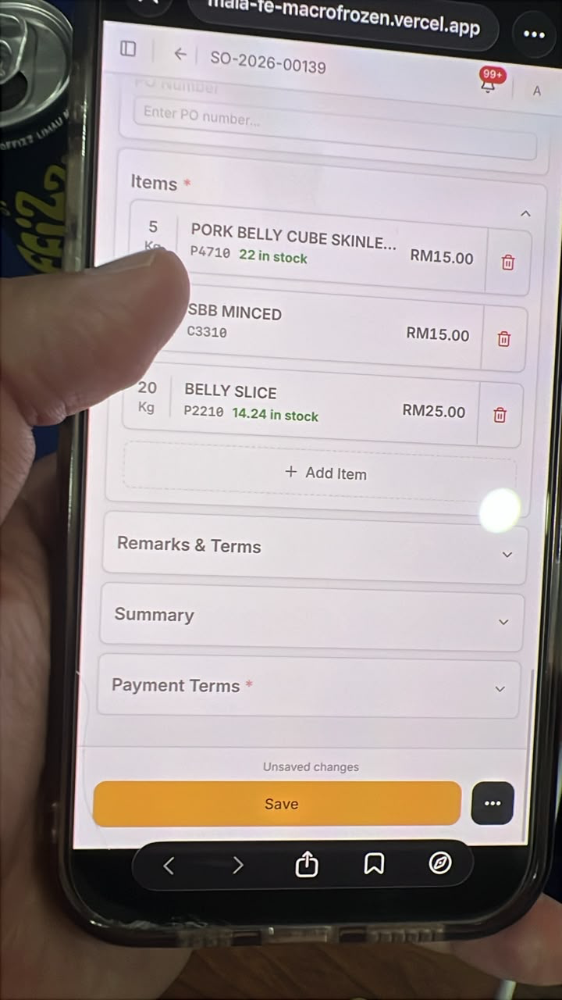
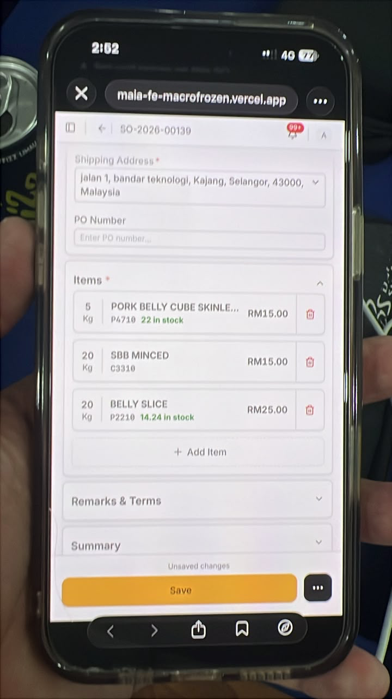
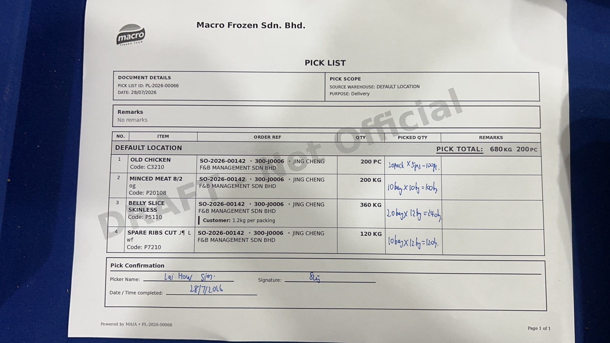

**28Jul26 - UAT 2 MAIA Training Feedback**

Approval credit controller notification not showing

Chatbot didnt prompt to escalate to credit controller on credit block

Chatbot didnt prompt to escalate to price controller on price block

mobile responsive UI, payment term adding UI issue

  --------------------------------------------------------------------------------------------------------------------- ---------------------------------------------------------------------------------------------------------------------
   {width="2.7083333333333335in" height="4.8125in"}   {width="2.7083333333333335in" height="4.8125in"}

  --------------------------------------------------------------------------------------------------------------------- ---------------------------------------------------------------------------------------------------------------------

Mobile responsive UI triggering thresholds to check if the transition between desktop view to square layout phones (Samsung Z Fold, and also Iphone Promax is optimised)

David uses Z Fold

Krystle using IP 17 Pro Max

Default payment term on SO create to be automatically set

Default to Customer Default payment term, if not present

Then default to Company Default Payment term, if not present

Then default to Cash in Advance payment term (if configured)

Search customer by the billing and shipping address (default)

Main columns are area, state, postcode and country

We should also have a contact database

Allows client to search across contacts, this is very relevant to search individuals that are tied to company

e.g. Muthu, is for mamak sdn bhd, but there is also a muthu from malaysia food.

Sales person familiar with muthu, but forgot company name

Pick List PDF Chinese Character printing.

To also check special ascii ranges are supported eg fractions and any other relevant ranges.

Pick List order selection must also surface delivery date

Default sort by delivery date ascending, near closest date ranked top.

Draft DN by Lai to Push the Draft DN Message to Grace

Created as a custom hook, that must push into their chat.

Add to activity trail

Yes spam grace

Pick List printed PDF missing the address small subheading

{width="5.75in" height="3.2291666666666665in"}

Submitted order must notify Lai with the Order PDF.

Add to activity trail

Yes spam Lai

Sales Order need to deliver by delivery date. Cron Notification.

Daily 1pm cutoff time for submitted orders that need to deliver today

Daily 2pm cutoff time for submitted order that need to deliver today

DO same day notification if dont have

Pick list submitted must notify Grace

On demand

Low stock, near expiry

To all, except finance, most important david, sales, lai

David and apple are owners, credit controller

Apple no price control

Every Sunday morning, month to date sales summary at 8am

CJ, David

Every Sunday morning, annual sales summary at 8am

CJ David

Every sales person sales report, Every Sunday morning, month to date sales summary at 8am

Month to date new lead by sales person, Every Sunday morning, month to date sales summary at 8am

CJ

Month to date new customer by sales person, Every Sunday morning, month to date sales summary at 8am

Month to date lead to customer converstion rate

To scope, ffb marketing leads, auto reply. Suggest to use ready made

Customer churn notification to specific sales person, for own, every sunday.

Customer churn notification for David and CJ every sunday

Disable default noisy notification

Apart from kg and carton, how to deal with pcs? Queenie tried creating order for 3pcs of an Item, bot prompted to choose between kg/carton. Cannot proceed without resolving into either.

To scope, customer internal memo or announcement, can be done via MAIA.

Check if can blast to specific audiences

Each view make sure important columns are prioritized

Smaller screen form factor need to scroll too much

Operational columns left most, then action then, analytical columns by priority

Driver uncle to be onboarded to MAIA, only can submit proof of delivery.

New Role Delivery Driver, can see DN, Update Dn but not submit.

Must be able to mark dn as delivered, with proof of delivery

Must be able to access customer delivery address etc.

Currently the delivery driver just posts the photos in the group etc, and the Grace keeps a record of it, in the case of dispute, she will need to search through all the files to surface the accurate proof of delivery to settle disputes, having this managed in MAIA, will allow the driver to directly update this in MAIA and tied to the correct delivery note when mark as delivered.

MAcro Frozen wants all delivery notes when mark as delivered to must have proof of delivery uploaded. They should also be able to add on more proof later on after mark as delivered.

User\'s submit order via link in MR UI, but chatbot side has stale context, can recover when specifically said to refetch the order.

Since in the chat links are being surfaced, sometimes for speed, the users will navigate to the MR UI to submit or update the order, when they come back to the chat, since the chatbot is not aware that the order has been updated, uses the stale order information to continue the conversation

This causes the users to feel confused when they have updated the order, but in the conversation the bot still references the stale information

This can currently be recovered by user specifically asking the bot to check the order information again.

But this should be natural, for a seamless chat to UI experience, may need to see if chatbot middleware can subscribe to the frappe realtime socket to listen to these changes.

David also mentioned that they are exploring implementing a WMS system in the future, how to integrate to MAIA, to scope and discuss further, timeline coming quarter

David also mentioend that they recently subscribed a fleet tracking gps system that can log delivery timestamp, gps location, and temperature within the truck, this is used for proof that an order has been delivered to settle disputes from customer

e.g. Delivered to customer factory, but their side fault worker left the cold goods outside and halfway thawed, blamed david\'s worker for not turning on the freezer in the cold truck, as for discount

Suggestion by Ivan for tech to assess, what if on the pick list and delivery note we support a custom column on the items level, which is the picked quantity breakdown (list of tuples of qty and uom- default nos), and for delivery note item as well.

This allows a MVP scope to support e.g. To capture the picked quantity breakdown on the picklist level without introducing a new doctype or child table.

When from Pick List to DN, this can be propagated as well.

In the pick list PDF it will show the picked qty breakdown for each line

In the Delivery note it will show the qty breakdown for each line if present

This is important because though our proposal was to remove the packing list excel, they did mention that they need to show these breakdown to the customer and use it for traceability purposes when there are discrepancies in the pciked vs delivered qtys
