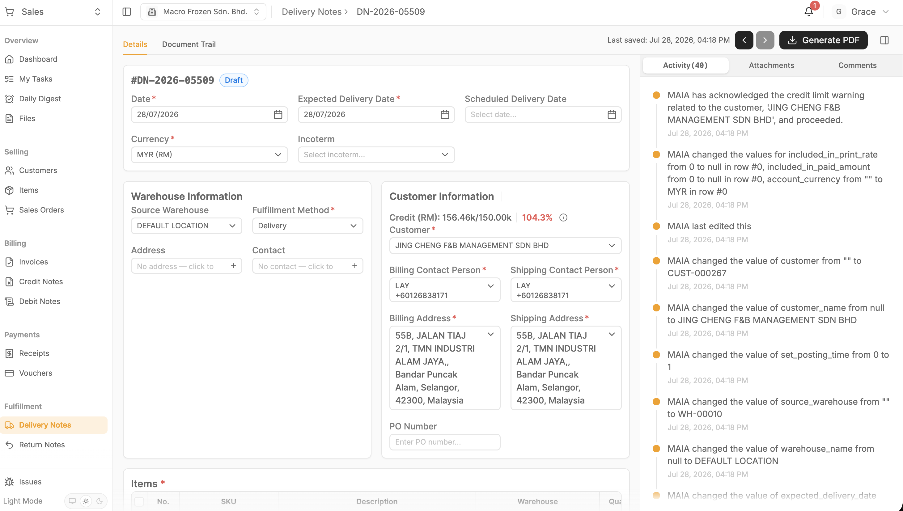
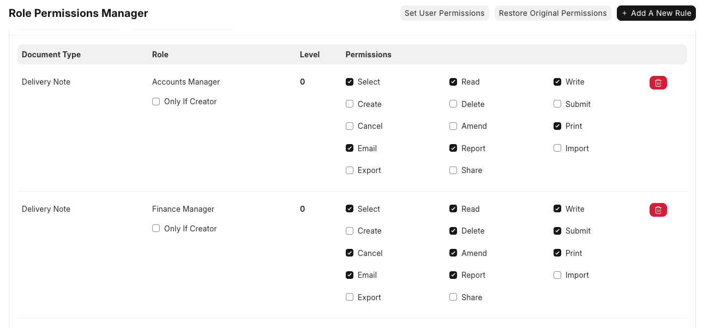

**29Jul26 - Macrofrozen 2nd UAT fixes checklist**

**Timeline**

  ------------------------------------------ -------------------------------
  Milestone                                  Date

  **All P0 + P1 fixes complete**             **Wed 5 Aug 2026**

  Internal regression + channel smoke test   Thu 6 -- Fri 8 Aug

  **3rd UAT with client**                    **Tue 11 -- Fri 14 Aug 2026**
  ------------------------------------------ -------------------------------

P0 and P1 must be done **and internally verified** before 5 Aug

P2 and below do not block the 3rd UAT

Every item below carries an **acceptance criteria** --- that is the test run in round 3, not a subjective \"looks fixed\"

**Sources**

2nd UAT onsite session, 28 Jul → [29Jul26 - UAT 2 - Summary and Action Plan](https://eg69120xnei.sg.larksuite.com/wiki/SYwwwWfjfiyl6kkLqkalt1UcgO9)

2ND UAT macrofrozen - [Macro Frozen UAT - Meeting recording by Fireflies.ai](https://app.fireflies.ai/view/Macro-Frozen-UAT::01KYKJ9NB1MEYTJHG55CQ99TBD)

Internal tech debrief, 29 Jul --- [Macro Frozen Debrief](https://app.fireflies.ai/view/Macro-Frozen-Debrief::01KYNVMYQ0PZ4QDWFMHPD92PM7)

Internal tech debrief, 29 Jul --- [Meet -- Macro Debrief](https://app.fireflies.ai/view/Meet-Macro-Debrief::01KYNWCTKE5GX42CXH69DF87FB)

Granola/Transcripts/2026-07-29/Macro Debrief-transcript.md

[28Jul26 - UAT 2 MAIA Training Feedback](https://eg69120xnei.sg.larksuite.com/wiki/HK6pwSJeuiZbwEknnOOlyLr5gfc)

**Source fidelity --- read before re-checking any item against the recording:**

Room ran in mixed Cantonese, Mandarin, Malay and English

Fireflies mangled a large share of the second half into single-word fragments; speaker identities never resolved

**Ivan\'s raw notes are the authoritative record of what was decided** --- the transcript is used only for framing, client pushback and data caveats

Only one Macro Frozen recording exists for 28 Jul --- the \"meeting transcript\" and \"Tharani\'s recording\" are the same artifact

**Data caveat --- not a defect:**

SQL sync paused: orders / invoices / payments only to 3 Jul

Customers and items only to 15 Jul

Gap backfills at go-live

**Scope pressure --- why the priorities are drawn this way**

Roughly **35 items** surfaced from this session; only **5 are genuine go-live blockers**

The rest splits into day-one usability gaps and a substantial block of **new scope** --- driver role, contacts database, a nine-item notification engine, a six-report analytics suite, WMS and telemetry

If new scope enters the sprint undifferentiated, the **one-week Core MAIA delivery SLA is dead** and Macro Frozen absorbs August on its own

**Only one new-scope item is load-bearing:** the picked-quantity breakdown (MF-P1-01) --- our proposal to delete the Excel packing list depends on it

Everything else in P2 and below can wait without breaking a commitment we have already made

**CRITICAL PATH --- must clear before 3rd UAT**

**Theme 1 --- the approval loop does not close**

Blocked order has no escalation prompt, no notification, no way for the approver to know it exists

Orders silently die

Fix P0-01 → P0-03 as one unit, verify end-to-end: Queenie → CJ → David

**Theme 2 --- the pick list → DN handoff is broken**

Customer info does not carry from pick list to DN (P0-05)

Grace cannot see or submit the document she is the gate for (P0-06)

Together these kill the core order-to-invoice path

**Blocker on everything notification-related**

Notification engine underpins 9 items across P0--P3

Pipeline is not firing at all

Still has **no named owner** --- close this first, nothing in the cluster can be estimated until then

**P0 --- Go-live blockers (due 5 Aug)**

**~~MF-P0-01 · Chatbot doesn\'t prompt escalation on credit block~~**

**Issue:** Order blocks correctly but the bot dead-ends. Sales user is never told the order can be actioned by someone else. In session the recovery was manual --- the facilitator had to open CJ\'s account to show the draft sitting there.

**Action:** Add an escalation prompt plus a one-tap \"assign to credit controller\" action on block. Bot must name the approver. Build the **update notification first**; defer the submit notification (orders almost always get changed before submit).

**Owner:** Chatbot / middleware --- Jermaine

**Acceptance criteria:** Sales user hits a credit block → bot names the approver and offers the assign action → credit controller receives it → controller acts → sales user is notified of the outcome. If the controller submits on the sales user\'s behalf, the sales user is notified. Verified end-to-end on the Queenie → CJ → David chain.

**~~MF-P0-02 · Chatbot doesn\'t prompt escalation on price block~~**

**Issue:** Sales user sets a price below minimum → warning fires and the price snaps back to the minimum, but nothing offers to notify the price controller. Missing on both chatbot and front end.

**Action:** Add the escalation prompt and assign-to-price-controller action. Price controller must be able to bypass minimum-price validation and save; the salesperson is then notified. Implement on **chatbot and front-end UI** --- behaviour must match, since CJ has no company laptop and works entirely mobile. Cover **max price** as well as minimum, across all three price-sensitive doctypes (Quotation, Sales Order, Invoice). Customer-specific pricing can also be enforced/locked.

**Owner:** Chatbot / middleware + Frontend --- Jermaine

**Acceptance criteria:** On all three doctypes and both surfaces, a below-minimum *and* an above-maximum price triggers the prompt. Approval routes to David --- **CJ cannot self-approve**. Price controller can override and save; salesperson receives notification of the override.

**~~MF-P0-03 · Approval / credit-controller notification not firing~~**

**Issue:** Blocked orders do not notify the approver at all. Client asked twice in session, \"but no any notification?\" The notification pipeline itself is broken, not just this trigger. This is what makes the whole approval loop non-functional --- a block with no prompt and no notification is an order that silently dies.

**Action:** Fix notification dispatch on credit block and price block. Use the existing backend notification seeder (Bryan); build **role-based (\"row to row\") first**, not user-action-to-user-action. Product side must supply clear written requirements to populate the seeder config.

**Owner:** Notification service --- **chatbot, backend**

**Acceptance criteria:** Credit block and price block both dispatch to the correct role recipient. Full chain verified Queenie → CJ → David with no silent failures. Notification delivery confirmed in logs, not just assumed.

**~~MF-P0-04 · Pick List PDF --- Chinese characters not printing~~**

**Issue:** Item descriptions carrying Chinese characters do not render in the printed pick list. Lai\'s entire day starts from this PDF --- an unreadable line item is an unpickable line item.

**Action:** Fix font embedding / glyph coverage in the pick list PDF template. Also cover special ASCII ranges, fractions in particular, since company SKUs use them.

**Owner:** Reports / PDF --- Amirul Iman

**Acceptance criteria:** A regression run against a **real Macro item master extract** (not synthetic data) renders all Chinese characters and fractions correctly, both in the generated PDF and in a physical printout.

**MF-P0-05 · Customer info not propagating from pick list → DN**

**Issue:** A DN created from a pick list is missing customer details. Breaks the core document chain.

**Action:** Fix field propagation from pick list to Delivery Note.

**Owner:** Backend

**Acceptance criteria:** DN created from a pick list carries customer name, customer code, billing address, shipping address and contact. All visible on both the DN record and the DN PDF.

**MF-P0-06 · Grace\'s Finance Manager account --- pick list + DN submit broken**

**Issue:** Grace cannot see the pick list in the document trail, and cannot submit the DN. She is the DN gate, so order-to-invoice cannot run without this.

**Action:** Fix the Finance Manager role / permission configuration.

**Owner:** Backend / permissions

**Acceptance criteria:** Grace logs in, sees the pick list in the DN document trail, opens the draft DN, submits it successfully, then creates and submits the invoice --- the full finance leg with no admin intervention.

  --------------------------------------------------------------------------------------------------------------------------- ----------------------------------------------------------------------------------------------------------------------------------------
   {width="2.4270833333333335in" height="1.375in"}   {width="2.9791666666666665in" height="1.3854166666666667in"}

  --------------------------------------------------------------------------------------------------------------------------- ----------------------------------------------------------------------------------------------------------------------------------------

**~~MF-P0-07 · Go-live channel is not the tested channel~~**

**Issue:** All UAT ran on Telegram because the WhatsApp number is still pending verification. MAIA is sold WhatsApp-first and Macro has never tested the channel they will actually use.

**Action:** Complete WhatsApp verification, then run a channel-parity smoke test.

**Owner:** Ops / Tech --- TBC

**Acceptance criteria:** WhatsApp number verified and live. Order capture, PDF delivery and notification receipt all pass on WhatsApp with the same results as Telegram.

**P1 --- Day-one usability (due 5 Aug)**

**MF-P1-01 · Picked-quantity breakdown on Pick List Item + DN Item**

**Issue:** No way to capture the picked-quantity breakdown, so the Excel packing list cannot be removed. **Load-bearing** --- David and Lai pushed back precisely here: the breakdown is shown to the customer and used for traceability when picked and delivered quantities differ.

**Action:** Add a custom field storing a **list of (qty, uom) tuples** at item level on Pick List Item and Delivery Note Item --- no new doctype, no new child table. Propagates Pick List → DN; optional on Sales Invoice Item. Ship in three steps: (1) store in DB and expose in API schema, (2) surface on frontend, (3) render as a mini breakdown table per line in both PDFs.

**Owner:** Tech lead --- feasibility assessment, then build

**Acceptance criteria:** A picker can enter \"10 boxes × \~9.5 kg\" against a 130 kg line. The breakdown persists, propagates to the DN, and renders as a breakdown table on both the pick list and DN PDFs. Breakdown total reconciles against the line quantity. *If not technically viable, DG-2 flips and the Excel stays --- say so early, do not discover it at go-live.*

**MF-P1-02 · Pick list PDF doesn\'t print picked quantity**

**Issue:** Only the submitted PDF prints. Once picking is done, the system\'s picked quantity is not rendered on the document.

**Action:** Render the picked quantity on the pick list PDF alongside the requested quantity.

**Owner:** Reports / PDF

**Acceptance criteria:** After picking, the PDF shows both requested and picked quantity per line.

**~~MF-P1-03 · Pick list printed PDF missing company header block~~**

**Issue:** Company name, address subheading and phone number all drop on printout. The client is buying a dedicated computer and printer so Lai can print these daily --- this document is client-facing and load-bearing for trust.

**Action:** Fix the print layout and margins so UI elements do not block header content.

**Owner:** Reports / PDF --- Amirul Iman

**Acceptance criteria:** A **physically printed** pick list shows company name, address subheading and phone number. Verified on a real printer, not a screen preview.

**MF-P1-04 · Pieces (pcs) as a third UOM**

**Issue:** Queenie hit this live --- ordering \"3 pcs\" forces a choice between kg and carton and will not proceed without resolving into one. Not a uniform conversion: some items are a fixed 10 kg/carton, pork belly is not, so pcs cannot simply be derived.

**Action:** Accept pcs as an order-capture UOM, resolved at pick time via the MF-P1-01 breakdown --- same mechanism solves both items. Do not build full pcs↔kg conversion.

**Owner:** Product --- Wan Sin + account owner

**Acceptance criteria:** \"3 pcs of pork belly\" is accepted at order capture without forcing a conversion. Actual weight is captured at picking, and the invoice reflects the actual weight.

**~~MF-P1-05 · Default payment term not auto-set on SO create~~**

**Issue:** Payment term is not populated on SO creation, and a customer with no default term cannot proceed cleanly.

**Action:** Implement a cascade at SO creation: customer default term → company default term → cash-in-advance → leave empty if none configured. Must be parametric, not hardcoded --- this recurs across accounts.

**Owner:** Backend / config

**Acceptance criteria:** Creating an SO applies the customer\'s term; with none, the company term; with none, cash-in-advance; with none, empty. Behaviour is configurable per account without a code change.

**MF-P1-06 · Pick list order selection missing delivery date**

**Issue:** Lai selects orders into a pick list with no visibility of delivery date. Some orders are picked on the delivery day and some earlier, so date is the primary sort key for his queue.

**Action:** Add a delivery date column to pick list order selection and the order listing. Default sort ascending, nearest date first.

**Owner:** Frontend --- Amirul Iman

**Acceptance criteria:** Delivery date column is visible and sorts ascending by default. Orders with no delivery date (some customers do not require one) remain selectable and do not break the sort.

**MF-P1-07 · Draft DN created by Lai → push notification to Grace**

**Issue:** Grace is the gate --- Lai creates the draft DN but cannot submit it, and today she has no signal that a draft is waiting.

**Action:** Build a custom hook: draft DN56 created → push into Grace\'s chat with the DN PDF, and write an activity trail entry. Client instruction was explicit --- **\"yes, spam Grace\"** --- every event, no digest.

**Owner:** Notification service

**Acceptance criteria:** Every draft DN creation pushes to Grace\'s chat with the PDF attached and writes a trail entry. No batching or digesting.

**MF-P1-08 · Submitted SO → notify Lai with Order PDF**

**Issue:** Lai works off a WhatsApp group and misses orders. Once an order is submitted everything downstream depends on him seeing it.

**Action:** On SO submit, push the Order PDF to Lai and write an activity trail entry. Client instruction --- **\"yes, spam Lai.\"**

**Owner:** Notification service

**Acceptance criteria:** Every submitted SO pushes the Order PDF to Lai with a trail entry, leaving no route for \"I missed it\".

**MF-P1-09 · Pick list submitted / confirmed → notify Grace**

**Issue:** No signal to Grace when picking is confirmed, breaking the Lai → Grace handoff chain.

**Action:** Send an on-demand notification to Grace on pick list submission.

**Owner:** Notification service

**Acceptance criteria:** Pick list submit triggers notification to Grace; the Lai → Grace chain is complete end to end alongside MF-P1-07.

**MF-P1-10 · Daily digest notification for Lai to start the pick list**

**Issue:** No daily prompt to begin picking.

**Action:** Configure a daily digest notification to Lai.

**Owner:** Notification service

**Acceptance criteria:** Lai receives one scheduled daily digest listing orders pending pick.

**MF-P1-11 · Price update reminder notification**

**Issue:** No reminder prompting a price review.

**Action:** Configure the price update reminder.

**Owner:** Notification service

**Acceptance criteria:** Reminder fires on schedule to the price controller.

**MF-P1-11b · Delivery-date cron --- same-day delivery chase**

**Issue:** No automated chase for submitted orders that need to deliver today, and no alert when the DN is missing on the day. Raw notes record **both a 1pm and a 2pm cutoff** for what reads as the same condition --- as written the two rules contradict.

**Action:Blocked on DG-3.** Resolve the ambiguity into a single rule (or two rules with genuinely distinct conditions), then build. Do not let a developer resolve this by guessing.

**Owner:** Ivan to confirm with David → then Notification service

**Acceptance criteria:** One agreed cutoff rule is documented and implemented. Orders requiring same-day delivery are chased at the cutoff, and a same-day alert fires when the DN is missing.

**MF-P1-12 · Disable default noisy notifications**

**Issue:** The out-of-the-box notification set is too noisy. Note the tension --- they simultaneously want high-frequency pushes to Grace and Lai. This is \"only the ones we asked for\", not \"fewer notifications\".

**Action:** Turn off the MAIA default notification set for Macro. Whitelist only the events in MF-P1-07 → P1-11b and MF-P2-05.

**Owner:** Config --- Wan Sin

**Acceptance criteria:** Over a full test day, only whitelisted events fire. No unrequested notification reaches any user.

**MF-P1-13 · Mobile --- bottom banner blocks payment term input**

**Issue:** The bottom banner covers the payment-term field and the page will not scroll past it, so a customer with no default payment term cannot have one added at all. Reproduced live; screenshots in source docx Appendix B.

**Action:** Fix the payment term add UI at mobile breakpoints so the banner does not obstruct input.

**Owner:** Frontend --- Amirul Iman

**Acceptance criteria:** On mobile, the payment term field is reachable and editable, the page scrolls clear of the banner, and a customer with no default term can have one added.

**MF-P1-14 · Mobile breakpoint thresholds on square-format devices**

**Issue:** Named devices, not generic responsive work. **David\'s Samsung Z Fold** renders the desktop page on mobile; **Krystle\'s iPhone 17 Pro Max** defaults to mobile but locks into desktop after rotating and returning. These two are the approvers --- if the approval UI is broken on their handsets, the approval loop is broken regardless of P0-01/02/03.

**Action:** Audit and correct the breakpoint thresholds for the desktop → square-layout transition.

**Owner:** Frontend --- Amirul Iman

**Acceptance criteria:** Z Fold and iPhone 17 Pro Max both render the correct layout on load *and* after a rotate-and-return cycle. Approval actions are usable on both handsets.

**~~MF-P1-15 · CPO page cannot scroll on mobile~~**

**Issue:** The CPO page does not scroll on mobile, making content below the fold unreachable.

**Action:** Fix scroll behaviour on the CPO page at mobile widths.

**Owner:** Frontend

**Acceptance criteria:** CPO page scrolls to the full length of its content on mobile.

**MF-P1-16 · Delivery Note UI not mobile-responsive**

**Issue:** The DN view does not lay out correctly at mobile widths.

**Action:** Make the Delivery Note UI mobile-responsive.

**Owner:** Frontend

**Acceptance criteria:** DN can be viewed and edited on mobile without horizontal scrolling or obstructed controls.

**MF-P1-17 · SCN / CCN credit note connector --- untested**

**Issue:** The connector was completed 27 Jul, one day before UAT, and was disclosed to the client as a known risk --- **not accepted scope**. SQLC treats credit notes differently from our design (return-holder vs negative billing), plus the customer credit note variant. Grace specifically flagged credit notes that reduce stock, a case they rarely run.

**Action:** Run a full test pass on SCN and CCN against SQLC. Log defects into the sprint bug list; do not treat as accepted scope. Interim guidance already given to Grace: keep using SQL until stable.

**Owner:** Gareth Ng (test) / TBC (fix)

**Acceptance criteria:** SCN and CCN both tested against SQLC including the stock-reducing case. All defects logged. Grace confirms she can stop the SQL workaround.

**MF-P1-18 · Stale chatbot context after order edited in MR UI**

**Issue:** Real usage pattern, not an edge case. Links surface in chat, so for speed users jump to the MR UI to submit or update an order, then return to chat --- where the bot is still holding the pre-edit order and continues from stale data. Users read this as the bot being wrong. Recoverable today only if the user explicitly asks the bot to re-fetch, which no real user will think to do.

**Action:** Short term --- force a re-fetch whenever the bot references an order it has previously seen. Longer term --- subscribe the chatbot middleware to the ERPNext realtime socket, which already emits these events; identify the user, find their latest active chat session and re-inject fresh context. Webhook is the fallback. This is a cross-portfolio fix, not a Macro-only fix.

**Owner:** Chatbot / middleware --- Jermaine

**Acceptance criteria:** User edits an order in the MR UI, returns to chat, and the bot reflects the updated order without being told to re-fetch.

**~~MF-P1-19 · Provision new admin account (admin@macrogroup)~~**

**Issue:** New admin email confirmed in session but not yet provisioned in MAIA.

**Action:** Provision and test the account. Apple and David are confirmed as admins with full access.

**Owner:** Ops / config

**Acceptance criteria:** admin@macrogroup logs in successfully with full admin access verified.

**MF-P1-20 · Confirm unapplied payment knocks off latest outstanding balance**

**Issue:** Behaviour of unapplied payment amounts against outstanding balances is unconfirmed.

**Action:** Verify and configure so unapplied amounts knock off the latest outstanding balance.

**Owner:** Backend / config

**Acceptance criteria:** An unapplied payment knocks off the latest outstanding balance, confirmed against client expectation with Grace and David.

**MF-P1-21 · Delivery Driver role + POD, provisioned for \"Uncle\"***(merged --- was also listed separately as MF-P2-04; role definition and driver provisioning are one deliverable, not two)*

**Issue:** No Delivery Driver role exists yet, and the one active driver (\"Uncle\") has no MAIA account, so POD cannot be attached against the correct DN. Today he posts delivery photos into a WhatsApp group and Grace keeps the record manually; on a dispute she has to search through all the files to surface the right proof.

**Action:** Create a Delivery Driver role --- can view DN, update DN, **cannot submit, cannot cancel**. POD is **mandatory** on mark-as-delivered; further POD can be appended afterwards; POD **cannot be deleted**. No trip/route-planning module --- only one or two drivers, they self-manage. Then collect Uncle\'s email and name, create his account, assign the role, and verify permissions. Note this expands the user population beyond signed scope --- check commercial impact before committing a date.

**Owner:** Wan Sin (role spec) → Ops / config (provisioning + build, TBC)

**Acceptance criteria:** Delivery Driver role exists with view/update-DN-only permissions (no submit, no cancel). Uncle\'s account is created and assigned the role --- he can open a DN and upload POD. Marking a DN delivered is blocked without POD; additional POD can be appended after the fact; no POD can ever be deleted. Proof is tied to the correct DN and retrievable on dispute.

**P2 --- Scheduled build, August (does not block 3rd UAT)**

**MF-P2-01 · Column prioritisation per view**

**Issue:** On smaller form factors users scroll horizontally too much to reach what they need. Even on a MacBook Pro in split view, the price editor and listing pages are too wide.

**Action:** Order columns left to right by bucket: **operational → action → analytic → auditability**. Action buttons need not sit rightmost; consider a sticky / frozen right column on wide screens. Parametric across accounts --- do once, not per client.

**Owner:** UX --- Wan Sin

**Acceptance criteria:** Each view\'s columns follow the four-bucket priority order, and primary actions are reachable without horizontal scrolling on a laptop screen.

**MF-P2-02 · Customer search by billing and shipping address**

**Issue:** Customers cannot be found by address, blocking area-based push-sales (\"find all my PJ customers\") and Lai\'s grouping-by-area.

**Action:** Extend the customer search index to address fields. Search the customer\'s **default** billing / shipping address only, not every address. Expose area, state, postcode and country as columns.

**Owner:** Backend / search

**Acceptance criteria:** Searching a state, postcode or area returns customers matched on their default billing or shipping address, with the four columns visible.

**MF-P2-03 · Contact database as its own entity**

**Issue:** Salespeople remember the person, not the company --- especially where brand name differs from registered company name. There is no way to get from a person to their company today. Client\'s own example: \"Muthu\" is at Mamak Sdn Bhd, but there is also a Muthu at Malaysia Food.

**Action:** Scope a Contacts entity searchable across companies, with company linkage, alongside Lead / Prospect / Customer. Chatbot should disambiguate: \"you have three Muthu --- which company?\" Candidate for build-once-unblock-many --- check demand across the other accounts before sizing.

**Owner:** Roadmap --- Wan Sin + Ivan

**Acceptance criteria:** A contact name search returns all matching people with their linked companies, and the chatbot disambiguates when more than one matches.

~~MF-P2-04 · Delivery Driver role + proof of delivery~~ --- **merged into MF-P1-21** (see P1). Provisioning depends on the role, so they ship as one deliverable, not two tracked separately across tiers.

**MF-P2-05 · Low stock / near expiry notification routing**

**Issue:** Feature shipped last week and was explicitly declared **not perfect and NOT part of acceptance** --- usable, not accepted. Routing is not yet configured.

**Action:** Route to **all roles except finance**; priority recipients David, sales team, Lai. Configure once the notification owner is assigned. Keep out of the acceptance set.

**Owner:** Notification service

**Acceptance criteria:** Alerts reach all roles except finance, with David, sales and Lai as priority recipients. **Explicitly excluded from round 3 acceptance.**

**MF-P2-06 · Extended glyph coverage audit across client-facing PDFs**

**Issue:** Character rendering problems may extend beyond the Chinese-character defect fixed in P0-04.

**Action:** Audit glyph coverage across all client-facing PDF templates, covering special ASCII ranges and fractions relevant to the Macro item master.

**Owner:** Reports / PDF --- Amirul Iman

**Acceptance criteria:** All client-facing PDF templates render the full character set present in the Macro item master without dropped or substituted glyphs.

**MF-P2-07 · Batch tracking on stock entry --- dropped between UAT 1 and UAT 2**

**Issue:** Raised in the 1st UAT / 16--17 Jul training (stock entry by item code + qty, with batch tracking --- supplier\'s own batch or SKU batch code, each item carrying batch + expiry date + shelf life) but never followed up, tested, or re-surfaced in the 2nd UAT session or this checklist. Without batch/expiry captured at stock entry, **MF-P2-05\'s low-stock / near-expiry alert has no reliable data to compute aging from** --- the alert can flag \"low stock\" on quantity, but \"near expiry\" needs a batch-level expiry date to mean anything. Currently that link doesn\'t exist.

**Action:** Confirm whether batch tracking (supplier batch or own SKU batch, expiry/shelf-life per batch) is being built into stock entry. If yes, wire MF-P2-05\'s near-expiry alert to read off batch expiry dates rather than item-level assumption. If batch tracking is deferred, MF-P2-05\'s \"near expiry\" half should be explicitly scoped down to what it can actually alert on today, so it isn\'t silently wrong.

**Owner:** Product (confirm scope) → Backend (if building)

**Acceptance criteria:** A decision is recorded on whether batch/expiry tracking is in scope for this phase. If yes: stock entry captures batch + expiry per item, and MF-P2-05\'s near-expiry alert reads from real batch expiry data, verified against a real aging item. If no: MF-P2-05\'s alert scope is corrected to state clearly what it does NOT cover (no batch-level expiry), so David isn\'t told he has an aging alert that can\'t actually see aging.

**P3 --- September wave (mostly config, not build)**

**MF-P3-01 → 06 · Sunday 08:00 recurring reports**

**Issue:** No scheduled sales visibility. David needs to see, for example, that one rep did 200k across 10 customers while another did 50k across 20 --- and decide hiring and account allocation from it.

**Action:** Build six scheduled reports: (1) MTD sales summary, (2) year-to-date sales summary, (3) per-salesperson MTD sales, (4) MTD new leads by salesperson, (5) MTD new customers by salesperson, (6) lead-to-customer conversion rate. Recipients CJ + David; per-salesperson reports go to each rep. Product designs the report spec, then hands to Wai Yon for the cron. **Labelled P3 but effectively required** --- these are configured notifications, not builds. **See DG-5 before building.**

**Owner:** Product --- reporting

**Acceptance criteria:** All six reports deliver every Sunday 08:00 to the correct recipients with figures reconciling against the system. *Sunday 8am is deliberate --- they work six days a week, David is up at 6am and out with customers till 10pm, so Sunday is his only reading window.*

**MF-P3-07 · Customer churn notifications**

**Issue:** No churn visibility. **No churn definition was given in session** --- do not build against an assumed one.

**Action:** Agree the churn definition with David first, then build two channels: per-salesperson churn alerts for their own customers, and a full churn view for David and CJ. Both every Sunday.

**Owner:** Product --- reporting

**Acceptance criteria:** A written churn definition is signed off by David, and both notification channels deliver against it every Sunday.

**MF-P3-08 · Sales dashboard by salesperson**

**Issue:** Management cannot review individual salesperson performance.

**Action:** Hold the committed date --- **first week of September**, deployed as a multi-client release, not a Macro-specific build. Ensure DG-5 does not duplicate this with push reports.

**Owner:** Product --- roadmap (Ivan)

**Acceptance criteria:** Dashboard ships first week of September with per-salesperson filtering. *This is a dated promise already on record with Macro, not a backlog item.*

**MF-P3-09 · AR module / bank statement reconciliation --- timeline moved up**

**Issue:** Client asked to accelerate the AR module. Two or three other clients need the same thing.

**Action:** After payment entry is created, reconcile against bank statement in a dedicated finance workspace, then push to SQL --- a simpler version than the full build. ERPNext backend already supports auto-matching by ID and string match; the hard part is field extraction and mapping. Needs a feature kill-switch / permission to hide it. Build as core MAIA finance workspace, not a Macro one-off.

**Owner:** Product --- roadmap

**Acceptance criteria:** Payment entries reconcile against an imported bank statement with auto-matching, and the feature can be toggled off per client via permission.

**MF-P3-10 · Customer complaint ticketing via chatbot**

**Issue:** High complaint volume with no traceable log. Complaints live in chat and disappear.

**Action:** Reuse the existing Issues feature --- sales says \"this customer complained, here\'s the issue\" and the chatbot logs a complaint ticket. Scope alongside MF-P2-03 (same CRM surface).

**Owner:** Product --- roadmap

**Acceptance criteria:** A complaint raised in chat creates a retrievable ticket tied to the customer, with complaint as a leading tag.

**MF-P3-11 · Official receipt / payment recording**

**Issue:** Raised by client in session; currently work-in-progress on our side and declared as such.

**Action:** Confirm current status and give Macro a date.

**Owner:** Product --- roadmap

**Acceptance criteria:** A committed date is communicated to Macro in writing.

**P4 --- Out of scope / change request**

**MF-P4-01 · Packing list Excel optical extraction**

**Issue:** Client asked for automated extraction from an attached Excel packing list.

**Action:** Raise as a CR --- this is a customisation on top of the base module. Do not absorb into the delivery sprint.

**Owner:** Commercial + Product

**Acceptance criteria:** CR formally scoped and quoted.

**MF-P4-02 · Delivery trip / route management with POD upload per DN**

**Issue:** Full trip and route management requested. Distinct from the basic driver role in MF-P2-04, which **is** in scope.

**Action:** Raise as a CR.

**Owner:** Commercial + Product

**Acceptance criteria:** CR formally scoped and quoted; boundary against MF-P2-04 documented.

**MF-P4-03 · Customer internal memo / announcement blast**

**Issue:** Client wants to send internal memos or announcements to customers via MAIA, with the ability to blast to specific audiences.

**Action:** Raise as a CR. Good idea, not in current scope.

**Owner:** Commercial + Product

**Acceptance criteria:** CR raised; not absorbed into the delivery sprint.

**MF-P4-04 · Facebook marketing lead capture + auto-reply**

**Issue:** Requested lead capture and auto-reply from Facebook ads.

**Action:** Raise as a CR; evaluate an off-the-shelf solution first rather than building.

**Owner:** Commercial + Product

**Acceptance criteria:** Off-the-shelf options evaluated and a recommendation given before any build is quoted.

**MF-P4-05 · WMS integration**

**Issue:** Client is standing up a new warehouse and pricing a WMS at roughly RM1m via Krystle\'s partner. The integration surface is unknown until they pick one.

**Action:** Keep warm. Ask which WMS they are evaluating so we are not designing blind.

**Owner:** Ivan ↔ David

**Acceptance criteria:** WMS vendor shortlist obtained from David; integration surface assessed before any commitment.

**MF-P4-06 · Fleet GPS / truck temperature telemetry**

**Issue:** Client subscribes to a fleet service logging delivery timestamp, GPS location and in-truck temperature, used as dispute evidence --- e.g. goods left in the sun by the customer\'s own worker, then blamed on our driver. Strong pairing with POD, same dispute-resolution job.

**Action:** Raise as a CR. Scope only after MF-P2-04 (POD) lands.

**Owner:** Commercial + Product

**Acceptance criteria:** CR raised and sequenced behind POD delivery.

**MF-P4-07 · QR / barcode scanning + label / sticker printing in warehouse**

**Issue:** Discussed as future warehouse direction alongside racking sensors and possible warehouse consolidation. Not committed.

**Action:** Bundle into the WMS conversation (MF-P4-05) rather than treating separately. Separate quotation required.

**Owner:** Commercial + Product

**Acceptance criteria:** Folded into the WMS scoping conversation, not tracked as a standalone request.

**Already shipped since UAT 1 --- do not re-report in round 3**

**Prospect workflow disabled for Macro** --- leads only, to remove the lead-vs-prospect confusion; notes on a lead carry forward on conversion to customer

**Carton + kg dual-UOM ordering** supported on the standard setup, via the kg-placeholder pattern for carton orders

**Pick list PDF formatting improved** --- customer, code and remarks surfaced; columns widened for handwriting and upload-back

**Shipping address added to customer listing** --- orders can now be grouped by area for picking

**Bulk price setting page** --- Excel-like grid with filter and drag, mirroring how David controls prices today

*Note: near-expiry and low-stock alerts also shipped, but were explicitly declared **not perfect and not part of acceptance** --- see MF-P2-05.*

**Workflow change proposed to the client**

**Today --- double entry at two points**

Salesperson forwards WhatsApp orders into a company group

Lai prepares the pick list by warehouse

Lai records actual picked quantities by hand

Lai opens Excel and copies them into a packing list template ← *entry 1*

Passes to Grace

Grace re-keys the DN, then the invoice, into SQLC ← *entry 2*

**Proposed --- Excel disappears**

Salesperson sends the order straight to MAIA

MAIA drafts the SO with customer, items, quantity, unit price, notes, billing and shipping

Salesperson checks price and credit → submits, or routes for approval

Lai creates the pick list and, after picking, the draft DN directly --- with the breakdown he would otherwise have typed into Excel

Grace verifies and submits the DN

Invoice copies from the DN

**Why this makes MF-P1-01 load-bearing**

Client pushback centred on the Excel: how many pictures per order, how quantities aggregate on large carton orders, and whether the breakdown can still be shown to the customer

They need it for traceability when picked ≠ delivered quantities

Without the breakdown column, the Excel stays and DG-2 flips

Credit check placement also moves: MAIA runs it at DN, where SQLC today checks at DN or invoice --- combined with the stale knock-off problem, this is DG-1

**Open decisions --- block builds above**

**DG-1 · Credit block enforcement mode**

**Blocks:** MF-P0-01 rollout · **Owner:** Ivan ↔ David · **By:** before go-live

Macro\'s payment knock-off in SQLC lags reality --- customers pay roughly weekly, knock-off is entered late, so outstanding balances are stale

Client stated in session that nearly every customer shows overdue

Hard blocking on day one blocks most orders and the client concludes MAIA is broken

Decide: warn-only vs hard block · tolerance window (e.g. ignore overdue under N days) · block on order value + outstanding vs outstanding alone · who overrides (David, or Apple --- credit control but no price control)

**DG-2 · Keep or remove the Excel packing list**

**Blocks:** MF-P1-01 · **Owner:** Ivan ↔ David / Lai / Grace · **By:** on MF-P1-01 assessment

Removal is conditional on MF-P1-01 shipping

Client needs the breakdown to show customers and for picked-vs-delivered traceability

Decide: accept the tuple breakdown column as the replacement, or keep the Excel as a supported customisation

**DG-3 · Delivery-date cron cutoff times**

**Blocks:** MF-P1-11b · **Owner:** Ivan ↔ David · **By:** Thu gate

Raw notes record both a 1pm and a 2pm cutoff for what reads as the same condition, plus a same-day DN-missing alert

Either one is a mis-capture, or they are two rules with distinct conditions never written down

Do not let a developer resolve this by guessing

**DG-4 · UAT 2 verdict was never called**

**Blocks:** sign-off · **Owner:** Ivan (call) + Wan Sin (co-sign) · **By:** Thu gate

Success bar was set up front: green (pass) / yellow (proceed with fixes) / red (fail)

No verdict was recorded at the end; closing line was \"much better progress\" --- encouragement, not acceptance

Without a recorded verdict and a named signer there is no acceptance event, and nothing structurally prevents a fourth UAT

**DG-5 · Sunday push-reports vs September dashboard**

**Blocks:** MF-P3-01 → 06 · **Owner:** Wan Sin + Ivan · **By:** Aug planning

Substantial overlap between the six Sunday reports and MF-P3-08

Building both is waste --- pick one path

**DG-6 · Written answer to David on supplier / GRN**

**Owner:** Ivan · **By:** this week

David opened the session with this, before the agenda started: no supplier info means GRN cannot flow to SQLC

Our position: purchasing stays business-as-usual in SQLC, module hidden in MAIA (which also conceals cost price)

Answered verbally, in three languages, at minute one --- needs to exist in writing or it comes back

**Notes**

**Assign the notification owner first**

Nine items across P0--P3 are notification work, three of them P0

The pipeline isn\'t firing at all

Nothing in that cluster can be estimated until someone owns it

**P0-01 / 02 / 03 ship as one unit**

Three faces of the same failure --- the approval loop does not close

Verify the full chain: Queenie → CJ → David

**MF-P1-01 is the only load-bearing new-scope item**

Everything else in P2 and below can slip without breaking a commitment already made

**Role map**

**David** --- owner; price + credit controller; final approver on both

**CJ** --- sales manager, carries own accounts; price approval routes to David, cannot self-approve

**Queenie, Benz** --- standard sales users; own records only

**Lai / Lim** --- warehouse manager; creates pick list + draft DN; cannot submit DN

**Grace** --- finance manager; verifies + submits DN; creates invoice

**Apple** --- credit controller; no price control

**Uncle** --- driver; POD only

**See Also**

\[\[Maya Training --- Identified Gaps Report\]\] (1st UAT round, 16--17 Jul)

\[\[16Jul26 Macrofrozen 1st UAT Checklist\]\]

\[\[Macrofood --- UAT Checklist\]\]

\[\[brain/Gotchas\]\]
