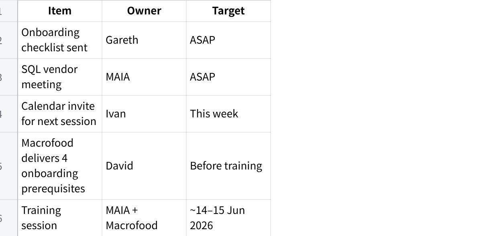

**4 Jun 26 - Macro Frozen Meeting Notes**

**Meeting Minutes**

**Date:** 4 June 2026\
**Type:** Face-to-Face\
**Attendees:**

David (Macrofood --- Director / Credit Controller)

CJ (Macrofood --- Sales)

Finance/Account rep (Macrofood)

Sean, Krsytle, WS, Gareth, Ivan (MAIA)

**Discussion Summary**

**End-to-End Order Workflow**

Current state: customers place orders via WhatsApp → salesperson manually interprets and creates order in SQL → warehouse picks goods and updates actual weight → invoice generated → customer sends payment slip → finance reconciles against bank statement.

**Agreed target workflow (end state):** WhatsApp order → MAIA draft SO → warehouse picks → update actual weight → submit SO → DO / Invoice → push to SQL.

**Phasing:** Phase 1 deploys core MAIA first. The picking-list flow inside MAIA (draft SO → pick → confirm weight) is **Phase 2** --- needs to be sorted out before adopting. For Phase 1 / early go-live, Macrofood may continue pick list outside MAIA as interim.

2\. **AR Reconciliation**

MAIA demoed the existing AR interface. System auto-matches bank statement entries to outstanding invoices; ambiguous matches are surfaced for human review. Finance team finalises the knock-off. External consultant does the final bank reconciliation outside MAIA.

Macrofood clarified payment methods: some customers pay via bank transfer, some via cash (collected by driver), some via QR merchant scan. Merchant/QR settlement reconciliation was discussed --- confirmed out of scope for MAIA; only customer invoice AR is in scope. Cash payments from drivers are currently tracked by Finance via Excel; same AR knock-off flow will apply inside MAIA.

3\. **Bulk Price Update**

Currently no system manages pricing --- David updates prices via WhatsApp image/word messages generated manually (via ChatGPT). Prices change roughly monthly or more frequently when market shifts; typically 30 SKUs change per update.

MAIA will become the pricing source of truth. Prices uploaded via Excel template. System enforces pricing per customer: global wholesale / global retail / customer-specific fixed price. Minimum price protection prevents below-floor pricing. Salesperson can view and, if permitted, adjust; enforcement level configurable.

Volume-based pricing (discount tiers by quantity) discussed --- not supported in current MAIA; flagged as gap.

4\. **Product Catalog**

David currently generates image-based catalog (not PDF) using ChatGPT --- product photos + prices. Two catalog variants: wholesale and retail. Used for inactive customers and new prospects. Customer preference: images over PDF because older customers won\'t open PDF files.

MAIA to design catalog generation feature. Follow-up needed: David to share current catalog samples before format is finalised.

**Stock Entry (Warehouse) --- Root Cause Clarified**

Original customization request was framed as a stock-entry / GRN problem. On discussion, the real pain point is **human error in weighing, data entry and checking** --- e.g. order says 33.9 kg, picker takes 32, checker misses it; or wrong cut picked (belly vs outer belly). GRN is generated *after* details are keyed in, so the error occurs at key-in. Extracting/pre-populating from a GRN document does **not** solve this --- it is a process/data issue, not a system extraction issue.

**Conclusion: no direct MAIA feature solves this.** Accuracy improves only by making the process more rigid (SOP discipline). True automation (WMS / barcode scanning) is high cost (RM1M+) and out of scope. MAIA acknowledged the problem; no Phase 1 feature.

*Note: GRN/supplier-invoice matching (AI item-code and UOM mapping) was demoed but belongs to the **purchasing module --- not in Phase 1.***

6\. **Credit Limit Control**

MAIA blocks order when customer hits credit limit. David receives notification and approves override as credit controller. Credit limit and payment terms data pulled from SQL. Discussion confirmed that blocking applies on either amount limit or payment terms --- either/or.

Payment model: most customers operate on \"one invoice\" basis --- must pay previous invoice before placing next order. Standard terms 30 / 60 days, but in practice varies (2 weeks to 45 days). Macrofood controls exposure by setting a customer credit limit based on order pattern (e.g. \~5,000/week).

**6a. Pro Forma Invoice**

David asked whether MAIA can issue a pro forma invoice (some customers\' financiers require a document with the word \"invoice\" before paying; David collects \~30% deposit against it). MAIA sales order serves a similar role but is not a proper invoice. Flagged --- to confirm whether a dedicated pro forma document is needed.

7\. **Delivery & Pick List Management**

Pick list is currently paper-based; orders are grouped by delivery route/driver. David consolidates orders by location and communicates via WhatsApp group. MAIA pick list module demoed --- newer version in progress.

Agreed: Macrofood will continue creating pick list outside MAIA. Delivery trip management module (driver app, proof of delivery upload) noted as a post-Phase 1 add-on.

8\. **Credit Notes**

Discussed credit note numbering --- Finance rep prefers CN number to reference the original invoice number. MAIA generates document IDs automatically (cannot override). Option noted: create CN in SQL then MAIA pulls back. Recommended: use MAIA running number to simplify; Finance to align internally.

9\. **User Roles & Access**

3 sales reps (manage own customers --- no cross-visibility)

David (director / credit controller)

Finance/Account person (AR reconciliation)

1 warehouse person (5 warehouses --- 3 nearby, 2 further)

External consultant (final bank recon, outside MAIA)

Stock count done once a year only --- root cause of inaccurate stock figures in SQL (variances \~10--20 units, not large enough to block orders).

10\. **Onboarding Requirements**

Four items needed from Macrofood before MAIA can be deployed:

New SIM card (for MAIA WhatsApp number)

Meta / WhatsApp Business account

OpenAI account + API key

AWS account (company email) + grant MAIA access

**Inventory Aging / Expiry Alerts (Agreed)**

Agreed feature: MAIA to alert when product is near expiry or aging is high (slow-moving stock), so David can decide to discount/offer or clear. Example raised: a 78-ton container where only 4 tons sold in 6 months. Currently David prints aging manually from SQL; wants proactive notification instead.

**Future / Parking Lot**

Batch tracking --- not currently practiced; possible future if Macrofood adopts (would enable batch-level aging/damage tracking)

Damage stock reporting --- MAIA issue ticket feature can serve as workaround

Warehouse barcode / QR scanning (WMS) --- high cost (RM1M+ enterprise scale), separate future discussion

AP reconciliation (supplier payments) --- later phase

Payment chasing escalation: Account alerts → Sales chases → David escalates; MAIA overdue notifications to be set up accordingly

**Decisions Made**

**Agreed target workflow:** WhatsApp order → MAIA draft SO → pick → update actual weight → submit SO → DO / Invoice → push to SQL. **Picking-list flow inside MAIA = Phase 2** (must be sorted before adoption); Phase 1 ships core MAIA first, pick list may stay outside MAIA as interim.

**SQL = master** for customer list and item list; pricing managed and enforced inside MAIA.

**Core system deployed first (Phase 1);** customizations (AR reconciliation, bulk price update, product catalog) and picking-list flow deployed separately after.

**Stock-entry pain = human weighing/data-entry error, not a system gap.** No direct MAIA feature; GRN extraction does not solve it. Addressed only via process/SOP rigidity or future WMS (out of scope).

**Inventory aging / expiry alert = agreed feature** --- MAIA notifies on near-expiry or high-aging stock.

**David is credit controller** --- approver for order overrides when credit limit is exceeded.

**Credit limit block triggers on either** credit amount limit OR payment terms exceeded (either/or, not both required).

**Product catalog** = image-based, not PDF; two groups: wholesale and retail; final format TBD pending sample from David.

**AR main user** = Account/Finance person; external consultant does final bank recon outside MAIA.

**Merchant/QR settlement reconciliation is out of scope** --- MAIA only handles customer invoice AR.

**Purchasing module (AP, GRN matching) not in Phase 1** --- flagged for future phase.

**Each sales rep sees own customers only** --- no cross-visibility between reps.

**Volume-based pricing not supported** in current MAIA --- flagged as a gap; no enforcement for now.

**Pricing migrates to MAIA** as source of truth --- currently lives outside any system.

**Delivery trip management** = post-Phase 1 module.

**Warehouse barcode/WMS** = future phase due to high cost and SOP adoption requirements.

**Action Items**

**MAIA**

Send onboarding checklist to Macrofood (SIM, Meta, OpenAI, AWS steps) --- **Gareth**

Schedule meeting with SQL vendor to get integration credentials

Deploy core system first; customizations separately on confirmed timeline

Send calendar invite for next session (\~14 Jun 2026) --- **Ivan**

Review Macrofood doc samples (invoice, CN, DO, pick list) and match PDF format

**Macrofood**

Obtain new SIM card for MAIA WhatsApp number

Set up Meta / WhatsApp Business account

Open OpenAI account + generate API key (share with MAIA)

Open AWS account using company email + grant MAIA access

Share current product catalog samples with MAIA team

Send doc samples: invoice, credit note, DO, pick list

**Next Steps**

**点击图片可查看完整电子表格**
